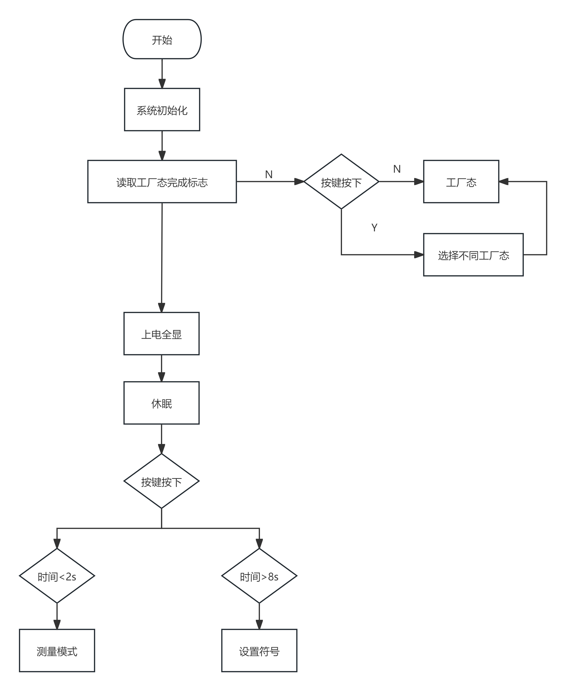
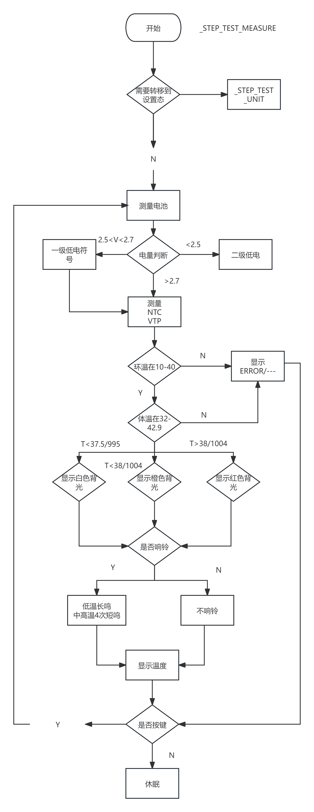
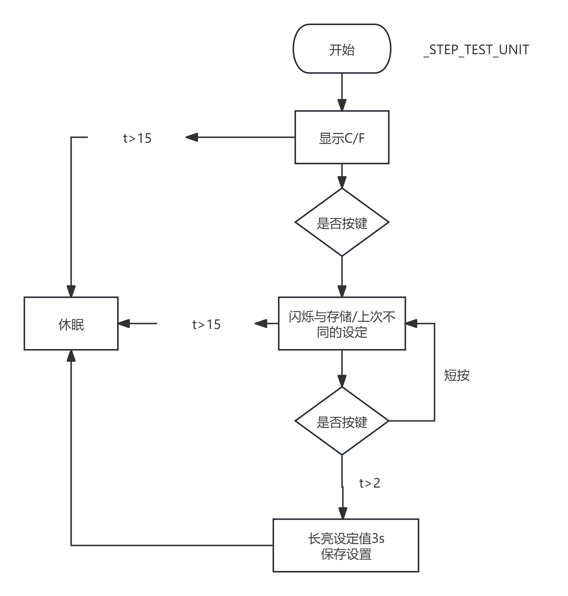
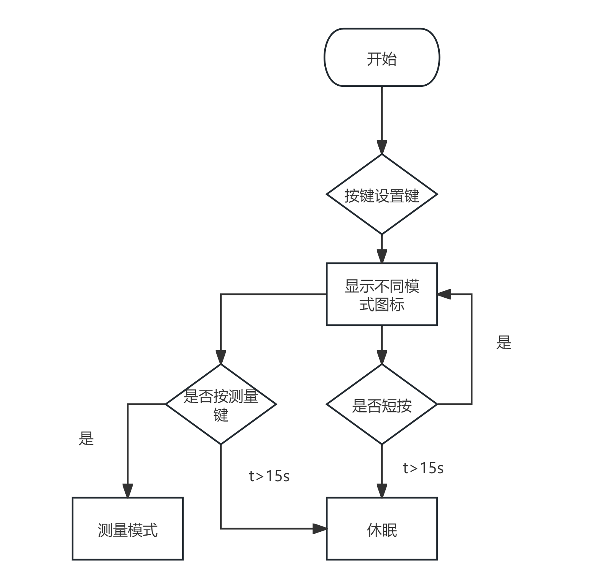
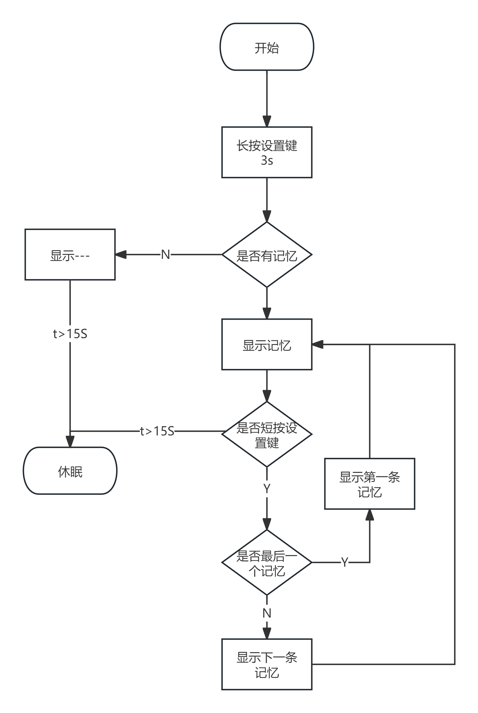
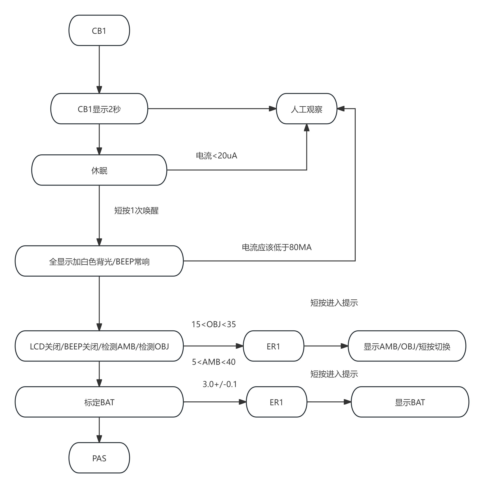
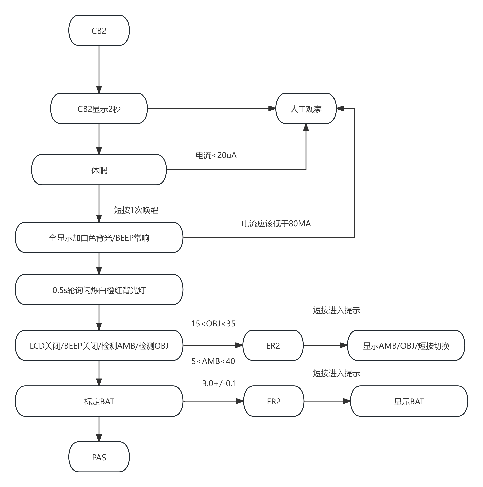
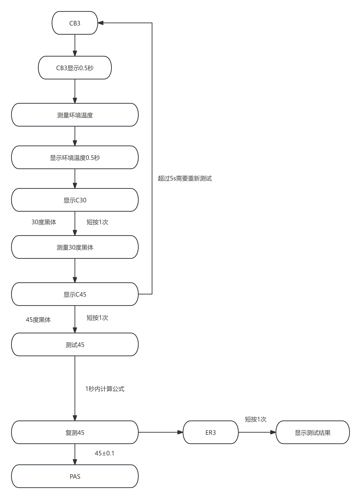
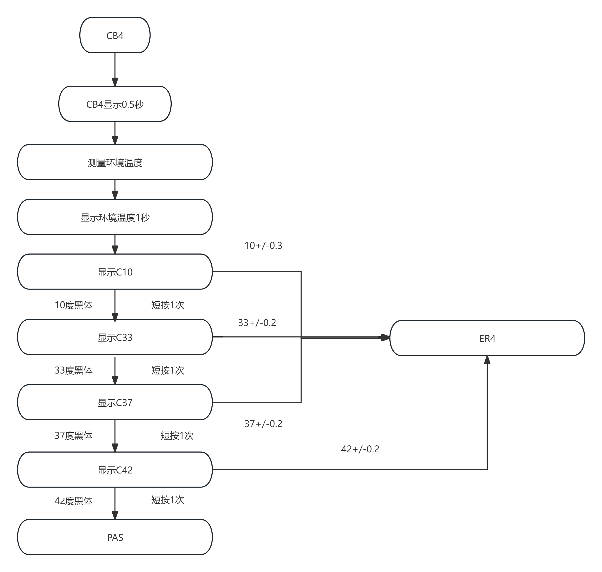
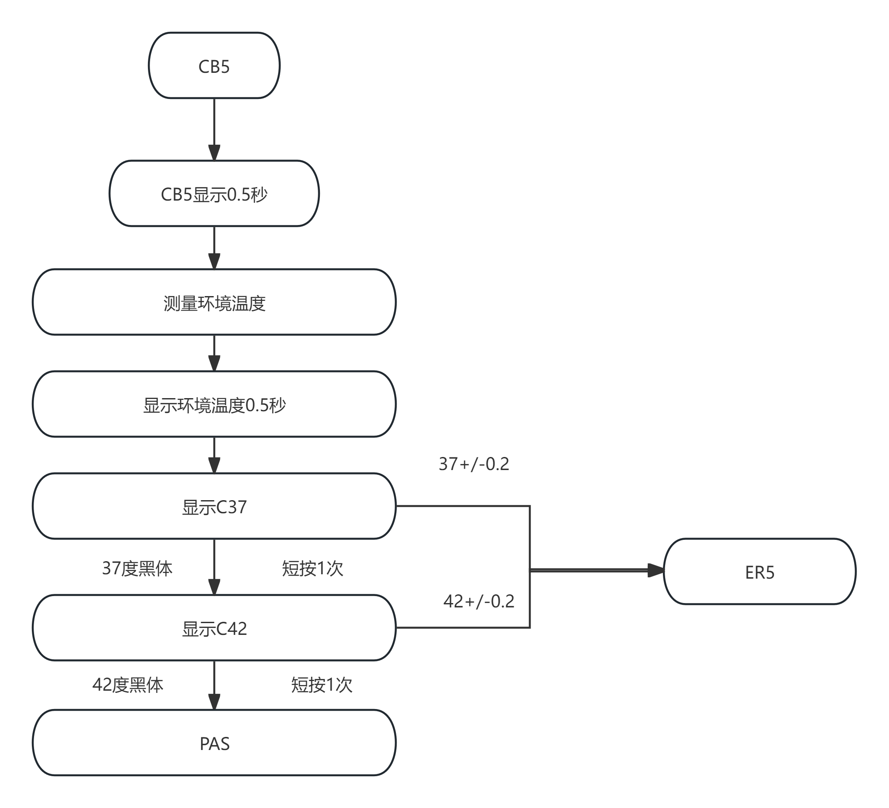

**软件流程图**

**（V1.0）**

产 品 型 号：       <u>PT9L</u>       

项 目 编 号：  <u>30000078</u>   

产品/项目名称：    <u>红外体温计</u>      

**编    制***（软件工程师）*                        <u>年   月   日</u>

**审    核***（软 件主 管）*                        <u>年   月   日</u>

**批    准***（技术负责人）*                        <u>年   月   日</u> 

**历史版本记录**

<table><tr><td>
<strong>序号</strong>
</td><td>
<strong>更改日期</strong>
</td><td>
<strong>版本描述</strong>
</td><td>
<strong>版本</strong>
</td><td>
<strong>更改人</strong>
</td><td>
<strong>批准人</strong>
</td></tr><tr><td>
1
</td><td>
2024年02月21日
</td><td>
起草
</td><td>
V1.0
</td><td>
王迪
</td><td>
侯广伟
</td></tr><tr><td></td><td></td><td></td><td></td><td></td><td></td></tr><tr><td></td><td></td><td></td><td></td><td></td><td></td></tr><tr><td></td><td></td><td></td><td></td><td></td><td></td></tr><tr><td></td><td></td><td></td><td></td><td></td><td></td></tr><tr><td></td><td></td><td></td><td></td><td></td><td></td></tr><tr><td></td><td></td><td></td><td></td><td></td><td></td></tr><tr><td></td><td></td><td></td><td></td><td></td><td></td></tr><tr><td></td><td></td><td></td><td></td><td></td><td></td></tr><tr><td></td><td></td><td></td><td></td><td></td><td></td></tr><tr><td></td><td></td><td></td><td></td><td></td><td></td></tr><tr><td></td><td></td><td></td><td></td><td></td><td></td></tr><tr><td></td><td></td><td></td><td></td><td></td><td></td></tr><tr><td></td><td></td><td></td><td></td><td></td><td></td></tr><tr><td></td><td></td><td></td><td></td><td></td><td></td></tr><tr><td></td><td></td><td></td><td></td><td></td><td></td></tr><tr><td></td><td></td><td></td><td></td><td></td><td></td></tr><tr><td></td><td></td><td></td><td></td><td></td><td></td></tr><tr><td></td><td></td><td></td><td></td><td></td><td></td></tr></table>

软件主流程图

用户测量

符号设置

测量模式设置

记忆模式

CB1

CB2

CB3

CB4

CB5

