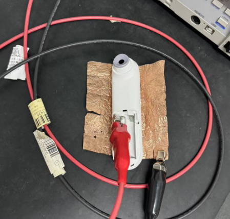
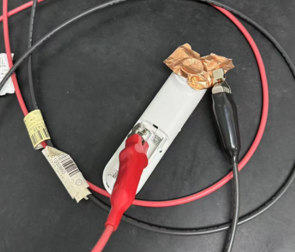
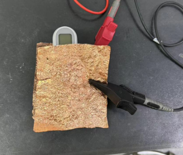
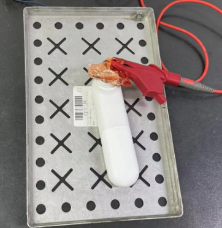

PT9L红外体温计产品检验标准

**V1.0**	

产  品  型  号      <u>PT9L</u>     

项  目  编  号    <u>30000078</u>        

产品/项目名称   <u>红外体温计</u>  

**编    制：**                           <u>年   月   日</u>

**审    核：**                           <u>年   月   日</u>

**批    准：**                           <u>年   月   日</u>

历史记录

<table><tr><td>
<strong>序号</strong>
</td><td>
<strong>更新时间</strong>
</td><td>
<strong>更改描述</strong>
</td><td>
<strong>版本号</strong>
</td><td>
<strong>拟制</strong>
</td><td>
<strong>批准</strong>
</td></tr><tr><td>
1
</td><td></td><td>
起草
</td><td>
V1.0
</td><td>
万龙
</td><td>
侯广伟
</td></tr><tr><td></td><td></td><td></td><td></td><td></td><td></td></tr><tr><td></td><td></td><td></td><td></td><td></td><td></td></tr><tr><td></td><td></td><td></td><td></td><td></td><td></td></tr><tr><td></td><td></td><td></td><td></td><td></td><td></td></tr></table>

目录

一、概述...........................................................................................................................2

1 使用范围........................................................................................................................2

2 声明............................................................................................................................2

3 术语和定义......................................................................................................................2

4 试验器具........................................................................................................................2

二、性能要求及测试方法.............................................................................................................3

三、出厂检验项目...................................................................................................................6

1 外观............................................................................................................................6

2 功能、性能......................................................................................................................7

3 包装............................................................................................................................11

# 一、概述

## 1 适用范围

**1.1** 本标准用于PT9L红外体温计。

**1.2** 本标准用于PT9L红外体温计过程检验及产品出厂验证。

## 2 声明

**2.1** 如果由于技术原因，某项测试不能完全执行时，可采用实质等同或更严格的测试方法。

## 3 术语和定义

**3.1** 红外体温计

通过使用红外传感器将测量到的温度显示出来的电子仪器。

**3.2** 黑体模式

体温计显示从黑体处测量所得的温度的模式。

**3.3** 恒温水槽

具有自动控温，提供恒定温度源的一种装置。

此处使用的恒温水槽要求水温在工作区域内任意两点的温差不大于0.01℃，恒温时温度波动不大于0.015℃/15min。

**3.4** 恒温水槽的稳定状态

恒温水槽到达预设的温度后，在15分钟内温度波动不超过0.015℃，则认为该恒温水槽达到稳定状态

**3.5** 黑体

能精确知道孔壁温度和在孔的任意开口处辐射率近似为1.0的孔状红外辐射基准源。

4 试验器具

**4.1**振动试验台（跌落测试机）

**4.2**恒温恒湿箱（高低温湿热试验箱）

**4.3**可调稳压直流电源

**4.4** 电流表

**4.5** 恒温水槽

**4.6** 标准铂电阻温度计

**4.7** 黑体

**4.8**卡尺/菲林尺

**4.9** 塞尺

# 二、性能、功能要求及测试方法

<table><tr><td>
<strong>检验项目</strong>
</td><td>
<strong>具体描述</strong>
</td><td>
<strong>备注</strong>
</td></tr><tr><td>
测试条件
</td><td>
要求：

1) 工作电压 DC3.0V±0.1V；

2) 测试标准黑体时，产品需在恒温房中放置120min以上 

3) 恒温房温湿度要求：a）温度：23.0±2.0℃；b）相对湿度：50%RH±20%RH；c）大气压强：70~106kPa

4）恒温水槽精度要求：±0.02℃；
</td><td></td></tr><tr><td>
1、上电自检
</td><td>
产品上电后会进入上电自检：白色背光灯点亮，LCD显示屏全显，此时检查显示内容是否正确，是否有乱显，多显，少显现象，同时蜂鸣器响0.5S，2S后进入待机模式（若自检故障，屏幕全亮且闪烁）。
</td><td></td></tr><tr><td>
2、提示音开关
</td><td>
通过机器侧面静音键控制提示音，当静音键置于关时，屏幕出现静音符号，此时提示音关；当静音键置于开时，屏幕上静音符号消失，此时提示音开。

测试方法：机器每次测温时，完成温度测量后显示测量结果，如果目标温度正常，按设定蜂鸣；若测量错误，显示三条杠和温度单位，按设定蜂鸣。
</td><td></td></tr><tr><td>
3、测量单位切换
</td><td>
1.待机状态下长按测量键8秒，进入单位切换状态；

2.短按测量键切换℃或℉单位，对应的单位符号闪烁，并伴有短蜂鸣一声；

3.长按测量键2秒以确认所选单位，对应的单位符号将常亮2秒并伴有短蜂鸣一声。之后体温计将自动关机。
</td><td></td></tr><tr><td>
4、测量模式切换
</td><td>
测量状态下短按设置按键进入模式切换状态，短按设置键循环切换婴儿模式，成人模式和物温模式，LCD屏上对应图标显示。
</td><td></td></tr><tr><td>
5、自动关机
</td><td>
测温后无操作 15±1S 自动转入待机模式。
</td><td></td></tr><tr><td>
6、温度显示范围
</td><td>
要求：32℃~42.9℃；

按照第8项的测试方法分别测量31.6℃、32.4℃、42.5℃和43.4℃恒温水槽，32.4℃、42.5℃可正确显示温度，31.6℃和43.4℃无法显示温度，屏显“--.-”报错。
</td><td></td></tr><tr><td>
7、显示分辨率
</td><td>
要求：0.1℃；

实验室环境中，黑体温度变化在0.1℃--0.15℃，显示数值应随之发生改变。
</td><td></td></tr><tr><td>
8、常温精度测试
</td><td>
环境要求：室温：23.0±2.0℃ 相对湿度：50%RH±20%RH

将恒温水槽分别设定在32℃、32.5℃、35℃、38.5℃、42℃、42.5℃、42.9℃，待恒温水槽温度稳定后，使用体温计进行测量：

1. 在断电情况下按住按键后装入电池，显示“CAL”后松开按键，产品进入黑体模式；

2. 对被测水槽连续测量三次；

3. 精度要求：≥35℃且≤42℃：±0.2℃，其它：±0.3℃。

4. 对测试结果不符合规定的温度计，可复测两次，两次复测合格，亦可作合格处理。
</td><td></td></tr><tr><td>
9、低电压提示功能
</td><td>
1、使用可调直流稳压电源供电，调整输出电压为3.0V给设备供电，开机后启动测量，此时应能正常测量；

2、调整直流电源输出电压低于2.7V，此时仍可进行测量但低电符号“”将随测量结果显示；

2、调整直流电源输出电压低于2.5V，此时屏幕上单独闪烁显示“”图标，15秒后将自动关机。
</td><td></td></tr><tr><td>
10、背光灯
</td><td>
环境要求：室温：24℃-26℃ 相对湿度：30%-70%

将恒温水槽分别设定在34℃、35.7℃、37℃，待恒温水槽温度稳定后，使用体温计进行测量：

1. 体温计应处于用户模式，不要进入黑体模式；

2. 对被测水槽连续测量三次，不必关注屏幕显示的温度，只看背光颜色；

3. 要求：测试34℃水槽时背光应为白色，测试35.7℃水槽时背光应为橙色、测试37℃水槽时背光应为红色。

4. 对测试结果不符合规定的温度计，可复测两次，两次复测合格，亦可作合格处理。
</td><td></td></tr><tr><td>
11、静态电流
</td><td>
检测在省电模式下的静态电流

1. 将电源电压调至DC3.0V

2. 将万用表调到mA档，然后将万用表串在直流电源上，并由主机连接，看万用表电流； 

3. 待机器进入睡眠状态时，观测静态电流值；

4. 标准：≤0.02mA。
</td><td></td></tr><tr><td>
12、工作电流
</td><td>
检测在工作中任意状态下的工作电流。

1. 将电源电压调于DC3.0V； 

2. 将万用表调到mA档，将万用表串在直流电源上，并由主机连接，看万用表电流； 

3. 按测量键测量时，LCD背光点亮观测最大工作电流值； 

4. 标准：工作电流在≤20mA(工作中任意状态)。
</td><td></td></tr><tr><td>
13、裸机跌落测试
</td><td>
产品在开机状态下，跌落高度 1.0 米，跌落正下方用平整硬木板作基垫，以垂直于地面自由落下。

1. 跌落高度为 1M，跌 3 次，依次顺序底部、LCD 面、有测量键 面朝下方跌落各一次，探头部位不可跌落。 

2.应跌落于密度为 700kg/M3，厚度为 50mm 的硬质木板或混凝 土地面，若未完成跌落次数就已经解体或严重损伤时，应立即 停止后续动作。并分析。 

3.以产品自身的重量自由下落，不可有外力加持，下落过程中 产品不可在空中翻转，否则无效。

跌落后产品没有开裂，PCB板 元器件没有损伤，产品结构功能完好。
</td><td></td></tr><tr><td>
14、带包装振动
</td><td>
方法：将1箱成品以不同方向放置在测试机上固定好，进行模拟测试

振动条件：

（1）5Hz-35Hz-5Hz 

（2）振幅：0.35mm

（3）振动方向：X，Y，Z

（4）振动次数：各15次

（Z方向（上下）振动时外箱处于自由状态）

判定基准：

1）不可看到被包装物品，边角不可破裂；

2）测试后在标准状态下测试，误差须在第8项项允许范围内。
</td><td></td></tr><tr><td>
15、低温工作试验
</td><td>
要求：温度10℃~40℃，相对湿度：≤95%不结露，大气压力：70kPa～106kPa；

在10℃恒温箱中放置24h之后，常温下恢复1h，按照第8项进行测试，测量结果应满足设计要求。
</td><td></td></tr><tr><td>
16、高温工作试验
</td><td>
要求：温度10℃~40℃，相对湿度：≤95%不结露，大气压力：70kPa～106kPa；

在40℃恒温箱中放置24h之后，常温下恢复1h，按照第8项进行测试，测量结果应满足设计要求。
</td><td></td></tr><tr><td>
17、低温存储试验
</td><td>
要求：温度-20℃~55℃，相对湿度：≤95%不结露，大气压力：70kPa～106kPa；

在-20℃恒温箱中放置48h之后，常温下恢复1h，按照第8项进行测试，测量结果应满足设计要求。
</td><td></td></tr><tr><td>
18、高温存储试验
</td><td>
要求：温度-20℃~55℃，相对湿度：≤95%不结露，大气压力：70kPa～106kPa；

在55℃恒温箱中放置48h之后，常温下恢复1h，按照第8项进行测试，测量结果应满足设计要求。
</td><td></td></tr><tr><td>
19、产品寿命
</td><td>
要求：五年或10000次；

产品整机寿命5年，假设平均每天使用5次，等效1万次的使用寿命，对其中可以影响到整机寿命的电子元器件以及结构组件进行测试。选取5个样品实际测量1万次，测试前和测试后都按照第8项进行测试，精度和功能均需正常，则认为产品寿命达到本项要求
</td><td></td></tr><tr><td>
20、电池寿命
</td><td>
要求：测量次数≥1000次，待机能力≥6个月；

模拟人体测试，通过测试不同状态的功耗推算出连续工作时间和待机时间，结果应满足设计要求。
</td><td></td></tr></table>

# 三、出厂检验项目

## **1 外观**

## 抽样方案参考GB2828.1-2012

## CR AQL=0

## MA AQL=0.4

## MI AQL=1.0

<table><tr><td rowspan="2">
缺陷分类
</td><td colspan="5">
缺陷描述
</td><td>
检验工具
</td><td>
缺陷等级
</td></tr><tr><td>
AA面
</td><td>
A面
</td><td>
B面
</td><td>
C面
</td><td>
D面
</td><td>
塞尺
</td><td>
MI
</td></tr><tr><td>
1.组装间隙
</td><td>
≤0.1mm
</td><td>
≤0.1mm
</td><td>
≤0.1mm
</td><td>
不影响组装及功能即可
</td><td>
不影响组装及功能即可
</td><td>
塞尺
</td><td>
MI
</td></tr><tr><td>
2.段差
</td><td>
≤0.1mm
</td><td>
≤0.1mm
</td><td>
≤0.1mm
</td><td>
不影响组装及功能即可
</td><td>
不影响组装及功能即可
</td><td>
塞尺
</td><td>
MI
</td></tr><tr><td>
3.脏污、指纹
</td><td>
不允许
</td><td>
不允许
</td><td>
不允许
</td><td>
不允许
</td><td>
不影响组装及功能即可
</td><td>
目视
</td><td>
MI
</td></tr><tr><td>
4.无感划伤/划痕 线状缺陷
</td><td>
不允许
</td><td>
划伤不允许。 划痕： L≤2mm，W≤0.1mm 同一平面N≤1.
</td><td>
划伤不允许。 划痕： L≤3mm，W≤0.1mm 同一平面N≤2 DS≥20mm.
</td><td>
划伤： L≤3mm，W≤0.1mm 划痕： L≤10mm,W≤0.3mm 同一平面总N≤2 DS≥20mm.
</td><td>
不影响组装及功能即可
</td><td>
菲林卡
</td><td>
MI
</td></tr><tr><td>
5.异色点/凹凸点 点状缺陷
</td><td>
不允许
</td><td>
D≤0.20mm 同一平面 N≤1
</td><td>
D≤0.30mm 同一平面 N≤2 DS≥20mm
</td><td>
D≤0.30mm 同一平面 N≤2 DS忽略
</td><td>
不影响组装及功能即可
</td><td>
菲林卡
</td><td>
MI
</td></tr><tr><td>
6.同色点
</td><td>
不允许
</td><td>
D≤0.30mm 同一平面 N≤1 
</td><td>
D≤0.30mm 同一平面 N≤2 DS≥20mm
</td><td>
D≤0.40mm 同一平面 N≤2 DS忽略
</td><td>
不影响组装及功能即可
</td><td>
菲林卡
</td><td>
MI
</td></tr><tr><td>
7.顶凸/顶白
</td><td>
不允许
</td><td>
不允许
</td><td>
不允许
</td><td>
不影响组装及功能即可
</td><td>
不影响组装及功能即可
</td><td>
目视
</td><td>
MI
</td></tr><tr><td>
8.缩水、凹陷
</td><td>
不允许
</td><td>
不允许
</td><td>
不允许
</td><td>
不允许
</td><td>
不影响组装及功能即可
</td><td>
目视
</td><td>
MI
</td></tr><tr><td>
9.产品本体或装配后翘曲/变形
</td><td>
不允许
</td><td>
不允许
</td><td>
目测不明显/参照限度样本
</td><td>
目测不明显/参照限度样本
</td><td>
不影响组装及功能即可
</td><td>
目视，与样件对比
</td><td>
MI
</td></tr><tr><td>
10.注塑件拉伤
</td><td>
不允许
</td><td>
不允许
</td><td>
不允许
</td><td>
目测不明显/参照限度样本
</td><td>
不影响组装及功能即可
</td><td>
目视，与样件对比
</td><td>
MI
</td></tr><tr><td>
11.注塑件料口/水口
</td><td>
不允许
</td><td>
不允许
</td><td>
不允许
</td><td>
目测不明显/参照限度样本
</td><td>
不影响组装及功能即可
</td><td>
目视，与样件对比
</td><td>
MI
</td></tr><tr><td>
12.注塑件熔接线/气痕
</td><td>
不允许
</td><td>
目测不明显/参照限度样本
</td><td>
目测不明显/参照限度样本
</td><td>
目测不明显/参照限度样本
</td><td>
不影响组装及功能即可
</td><td>
目视，与样件对比
</td><td>
MI
</td></tr><tr><td>
13.毛边/批锋/分型线
</td><td>
不允许
</td><td>
不允许
</td><td>
无刮手感，不允许有安全风险的批锋
</td><td>
无刮手感，不允许有安全风险的批锋
</td><td>
不影响组装及功能且牢固即可
</td><td>
目视，与样件对比
</td><td>
MI
</td></tr><tr><td>
14.高光面光泽度
</td><td>
参照限度样本
</td><td>
N/A
</td><td>
N/A
</td><td>
N/A
</td><td>
N/A
</td><td>
目视，与样件对比
</td><td>
MI
</td></tr><tr><td>
15.缺料、断裂、裂痕、烧焦
</td><td>
不允许
</td><td>
不允许
</td><td>
不允许
</td><td>
不允许
</td><td>
不允许
</td><td>
目视
</td><td>
MI
</td></tr><tr><td>
16.金属部件锈蚀氧化
</td><td>
N/A
</td><td>
N/A
</td><td>
N/A
</td><td>
不允许
</td><td>
不允许
</td><td>
目视
</td><td>
MI
</td></tr><tr><td>
17.色差
</td><td colspan="5">
色差值管控△E≤0.8，色差肉眼不可见，表面光泽与样件相同
</td><td>
目视，与样件对比，色差仪
</td><td>
MI
</td></tr><tr><td>
18.螺丝
</td><td colspan="5">
漏装、滑丝/滑牙、划伤不允许，需紧固到位，无松动、未打紧现象
</td><td>
目视，与样件对比
</td><td>
MI
</td></tr><tr><td>
19.按键
</td><td colspan="5">
用指腹正常力按压按键，无弹性、不回弹不允许
</td><td>
目视/按键
</td><td>
MI
</td></tr><tr><td>
20.装配后异响
</td><td colspan="5">
装配后，晃动产品不允许零部件松动、异常声音
</td><td>
目视/晃动
</td><td>
MI
</td></tr></table>

## **2 功能、性能**

<table><tr><td>
检验项目
</td><td>
具体描述
</td><td>
缺陷等级
</td></tr><tr><td>
1.精度测试
</td><td>
测试方法和要求见第二项第8条
</td><td>
MA

抽样方案参考GB2828.1-2012
</td></tr><tr><td>
2.上电自检
</td><td>
测试方法和要求见第二项第1条
</td><td>
MI

每批抽5个

AC=0

RE=1
</td></tr><tr><td>
3. 低电压提示功能
</td><td>
测试方法和要求见第二项第9条
</td><td>
MI

每批抽5个

AC=0

RE=1
</td></tr><tr><td>
4.背光灯
</td><td>
测试方法和要求见第二项第10条
</td><td>
MI

每批抽5个

AC=0

RE=1
</td></tr><tr><td>
5.测量单位切换
</td><td>
测试方法和要求见第二项第3条
</td><td>
MI

每批抽5个

AC=0

RE=1
</td></tr><tr><td>
6.测量模式切换
</td><td>
测试方法和要求见第二项第4条
</td><td>
MI

每批抽5个

AC=0

RE=1
</td></tr><tr><td>
7.提示音开关
</td><td>
测试方法和要求见第二项第2条
</td><td>
MI

每批抽5个

AC=0

RE=1
</td></tr><tr><td>
8.电池反接
</td><td>
把电池用相反方向放入机器，机器应无明显反应。再次把电池按正确方法放入后，机器应能正常工作。
</td><td>
MA

每批抽5个

AC=0

RE=1
</td></tr><tr><td>
9.耐压测试
</td><td>
1、测试项：电池正极到外壳。

测试要求：要求能承受DC1000V 1分钟内无绝缘击穿。

2、测试项：电池正极到探头。

测试要求：要求能承受DC1000V 1分钟内无绝缘击穿。

具体操作详见IEC60601-1-2020/GB9706.1-2020相关条目。
</td><td>
MA

每批抽3台。

AC=0

RE=1

测试完的机器不可出货，作为留样保存。
</td></tr><tr><td>
10.漏电流测试
</td><td>
1．测试项：接触电流

测试要求：接触电流正常状态≤0.1 mA

2．测试项：患者漏电流F型

测试要求：患者漏电流正常状态≤5 mA

具体操作详见IEC60601-1-2020/GB9706.1-2020相关条目。       
</td><td>
MA

每批抽3台。

AC=0

RE=1

测试完的机器不可出货，作为留样保存。
</td></tr></table>

## **3 包装**

## 抽样方案参考GB2828.1-2012

## CR AQL=0

## MA AQL=0.4

## MI AQL=1.0

<table><tr><td>
检验项目
</td><td>
具体描述
</td><td>
缺陷等级
</td></tr><tr><td>
1 彩盒
</td><td>
1）确认彩盒颜色与生产通知单是否相符合。 

2）确认彩盒印刷与生产通知单要求是否相符合。 

3）确认彩盒上所有条形码 

内容与生产通知单要 求一致.字迹清楚,不模糊。

漏贴,多贴或贴错, 标签位置,方向贴错不允许。

歪斜:两水平位置相 对差值≤1.5mm,不允许盖住文字。

表面无明显的 脏污，破损，开胶。 

4）彩盒粘合处不允许出现开胶现象。

.粘合边 上下错位≤2mm,前后错位不允许露白。

空隙：不得影响正常成型 

5）成型过程中彩盒,插口,插舌处不允许有瓦楞开 胶现象 

6）折线居中,清晰,不得有破裂,断线,重线等现象 

7）划痕 30-50cm 直视,L≤10mm,W≤0.3mm,N≤1， 未造成表面破损 

8）脏污 30-50cm 直视无明显脏污 9）褶皱 30-50cm 直视,客户 Logo 和主图案 L≤ 2mm，其他 L≤5mm，N≤1
</td><td>
MI
</td></tr><tr><td>
2 外箱及配件
</td><td>
1) 图案,条码等内容大小,图像与合同评审（样件）完全 一致.

2) 外箱标签内容、材质及粘贴位置符合客户要求。 

3) 标签粘贴不可盖住外箱文字，外箱破损造成字体条形 码无法辨识不可以。 

4) 撕裂长度≤2cm ,宽度≤5mm,未在文字处,允许有一个, 穿透不可以．表面破损≤20cm²,且不影响字符辨识,允 收一个;外箱标签破损长度＞10mm 不可以﹔倾斜超过 30 度,标签褶皱 N≤2。 

5) 外箱没有被内箱或彩盒装入后顶起  
</td><td>
MI
</td></tr><tr><td>
3 说明书 保修卡 快纸
</td><td>
印刷清晰易读，无脏污折痕， 破损等
</td><td>
MI
</td></tr><tr><td>
4 装箱数量
</td><td>
装箱数量正确， 没有漏装， 多装问题
</td><td>
MI
</td></tr><tr><td>
5 称重
</td><td>
带外箱重量。
</td><td>
MI
</td></tr><tr><td>
6 装箱列表
</td><td>
整机一台

说明书

保修卡

快纸

7号电池*2
</td><td>
MI
</td></tr></table>