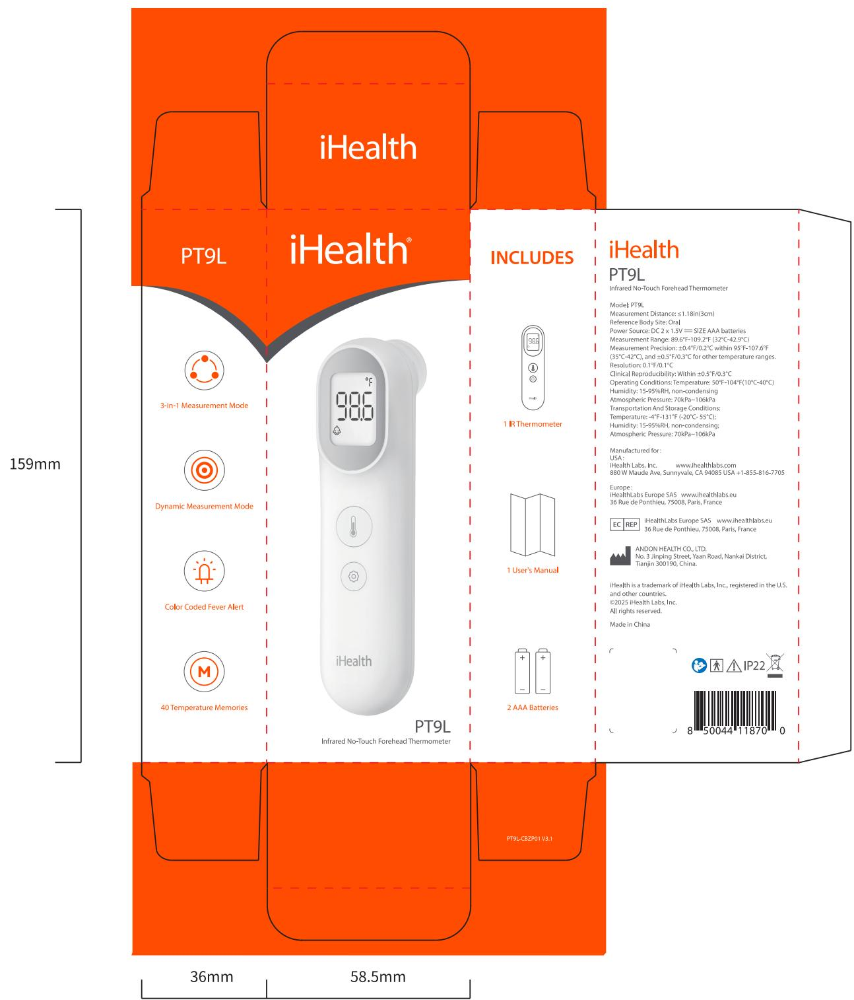

# andon

X 尺寸序号

text_image

iHealth
PT9L
iHealth®
INCLUDES
iHealth
PT9L
Infrared No-Touch Forehead Thermometer
Model: PT9L
Measurement Distance: <1.18in(3cm)
Reference Body Site: Oral
Power Source: DC 2 x 1.5V==SIZE AAA batteries
Measurement Range: 89.6°F-109.2°F (32°C-42.9°C)
Measurement Precision: ±0.4°F/0.2°C within 95°F-107.6°F
(35°C-42°C), and ±0.5°F/0.3°C for other temperature ranges.
Resolution: 0.1°F/0.1°C
Clinical Reproducibility: Within ±0.5°F/0.3°C
Operating Conditions: Temperature: 50°F-104°F(10°C-40°C)
Humidity: 15-95%RH, non-condensing
Atmospheric Pressure: 70kPa-106kPa
Transportation And Storage Conditions:
Temperature: -4°F-13.1°F (-20°C -55°C),
Humidity: 15-95%RH, non-condensing
Atmospheric Pressure: 70kPa-106kPa
Manufactured for:
USA;
iHealth Labs, Inc. www.ihealthlabs.com
880 W Maude Ave, Sunnyvale, CA 94085 USA +I-855-816-770S
Europe:
iHealthLabs Europe SAS www.ihealthlabs.eu
36 Rue de Ponthieu, 75008, Paris, France
EC REP iHealthLabs Europe SAS www.ihealthlabs.eu
36 Rue de Ponthieu, 75008, Paris, France
ANDON HEALTH CO., LTD.
No. 3 Jinping Street, Yuan Road, Nankai District,
Tianjin 300190, China.
iHealth is a trademark of iHealth Labs, Inc., registered in the U.S.
and other countries.
©2025 Health Labs, Inc.
All rights reserved.
Made in China
PT9L-CBZP01 V3.1
36mm
58.5mm

本件要求通过RoHS测试

说明：材质为：350g白卡，覆哑膜

尺寸：58.5X36X159mm，公差：±1mm

印刷颜色：4色+2专色印刷:PANTONE 1655C +PANTONE Cool Gray 11C

<table><tr><td>3</td><td>V3.1 主机色彩修正</td><td>2025.02.26</td><td>K04020002139</td><td>Signature</td><td>Date</td><td colspan="2">Tolerance</td><td>Pro material</td><td></td><td>Model NO.</td><td colspan="2">PT9L</td></tr><tr><td>2</td><td>V3.0 更新设计风格</td><td>2025.02.14</td><td>Design</td><td></td><td></td><td>.X</td><td></td><td>Surf dispose</td><td></td><td>Part name</td><td colspan="2">彩包装</td></tr><tr><td>1</td><td>V2.0 更新设计风格</td><td>2024.08.30</td><td>Checkup</td><td></td><td></td><td>.XX</td><td></td><td>Scale</td><td>1:1</td><td>Drawing NO.</td><td colspan="2">PT9L-CBZP01 V3.1</td></tr><tr><td>No.</td><td>更改记录</td><td>更改时间</td><td>Approve</td><td></td><td></td><td>.X°</td><td></td><td>Units</td><td>mm</td><td></td><td>Edition</td><td>V3.1</td></tr></table>