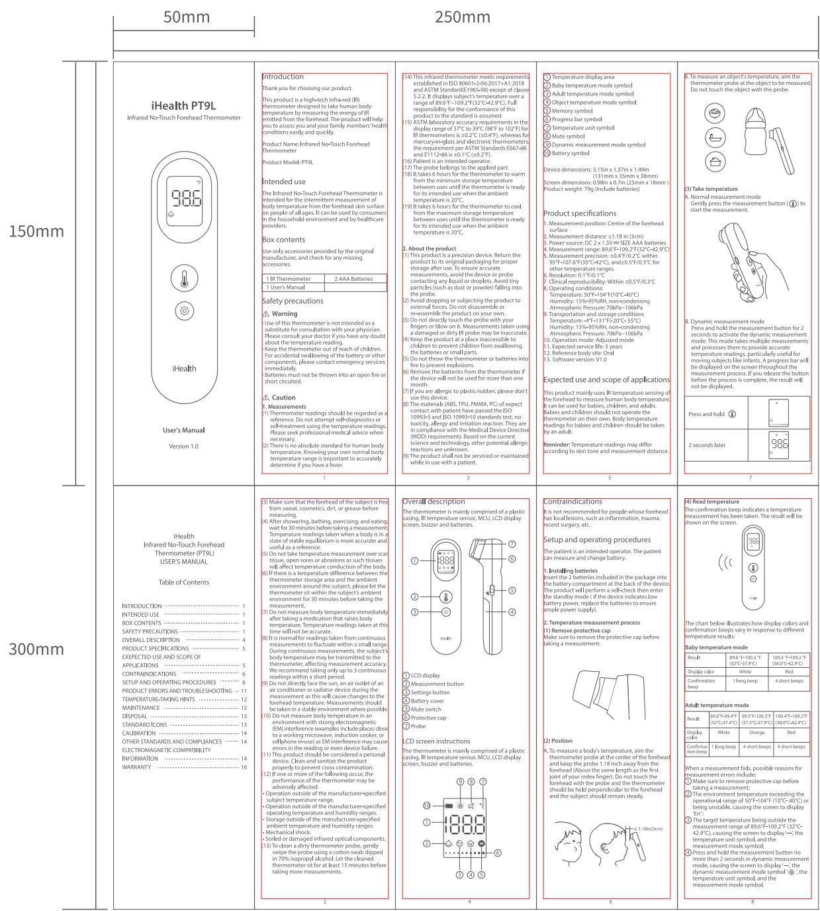

andon   
  
正面

<table><tr><td>3. Selecting modes
The default mode is baby temperature mode. To switch between the three modes, please follow the steps below.
(1) In the measurement state, press the settings button briefly to enter the mode switching state.
(2) Press the settings button briefly to cycle through the baby mode, adult mode, and object temperature mode, with corresponding icons displayed on the LCD screen.
(3) Press the measurement button to save the current settings and initiate a measurement process.
Note: The thermometer turns off automatically after 15 seconds of inaction.</td><td colspan="2">Product errors and troubleshooting</td><td rowspan="5">The RF thermometer is an extremely precise instrument. Any improper maintenance, disassembly, or modification may lead to measurement inaccuracies.
Do not put the thermometer under direct sunlight, high temperature, or moist environments. Do not allow to come into contact with fire or harsh vibrations.
Take out the battery if the device is not used for a month or more.</td><td rowspan="5" colspan="2">Use of accessories, transducers and cables other than those specified or provided by the manufacturer of this equipment could result in increased electromagnetic emissions or decreased electromagnetic environment of this equipment and result in improper operation.
- Portable RF communications equipment (including peripherals such as antenna alarm, sales and external antennas) should be used no closer than 30 cm(12 inches) any part of the PTLR, including cables specified by the manufacturer. Otherwise degradation of the performance of this equipment could result.</td><td rowspan="5">4. Liability for direct or indirect consequential losses caused by the unit is excluded even if the damage to the unit is accepted as a warranty claim.
5. If you encounter any product issues during the warranty period, please contact customer services for assistance.
Manufactured for: USA
iHealth Labs, Inc. www.ihealthlabs.com
B80 W Maude Ave, Sunnyvale, CA 94085 USA +1-455-816-7705
Europe:
iHealthLabs Europe SAS
www.ihealthlabs.eu
36 Rue de Ponthieu, 75008, Paris, France
EC REP HealthLabs Europe SAS
36 Rue de Ponthieu, 75008, Paris, France
support@healthlab.eu
www.ihealthlab.eu
ANDON HEALTH CO., LTD.
No. 3 Jinping Street, Vain Road, Nankai District, Tierjin 300/90, China
Tel: 86-22-60526161
Made in China
PT9L-SMSP01 V1.0</td></tr><tr><td rowspan="11">4. Switching units
(1) Press and hold the measurement button for 8 seconds to enter the unit switching mode.
(2) The screens flash the current unit press the measurement button to toggle between°C and°F, then selected unit will flash accompanied by a short bell.
(3) Press and hold the measurement button for 2 seconds to confirm the setting, the current unit is &quot;T&quot; will turn up for 3 seconds, accompanied by a short bell. And then the thermometer turns off automatically.
Note: The thermometer will automatically turn off after 15 seconds of inactivity, and the selected unit will also be saved automatically even if without pressing the measurement button for confirmation.
5. Memory mode
Press and hold the settings button (☐) for 3 seconds to enter the minimum mode, and the memory icon &quot;M&quot; will flash simultaneously. Release and use the measurement button to toggle between the different memories, and later memory will be shown as the first memory. If you want to view more memories of other modes, please choose your device mode at first.
(e) Note: The thermometer turns off automatically after 15 seconds of inaction.</td><td colspan="2">Problem Possible issues Solution</td></tr><tr><td colspan="2">Battery depleted</td></tr><tr><td colspan="2">Batteries have been installed with the wrong polarity batteries are not installed properly</td></tr><tr><td colspan="2">Unable to carry out sound measurements as current battery capacity is too low</td></tr><tr><td>Dynamic measurement failed</td><td>Press and hold the measurement button to restart the dynamic measurements until the result display on screen, and make sure to remove protective cap before taking a measurement.</td><td rowspan="7">Disposition
Dispose of batteries in accordance with the collection point in the EU countries - 2012/19/EEE Directive.
If you have any queries, please refer to the local authorities responsible for waste disposal.
Notes
- Please act according to local laws for disposal of user batteries.
- Take out the batteries if the device will not be used for more than one month.
To protect the environment, dispose of empty batteries at appropriate collection sites according to local regulations. Dispose of batteries at public collection point in the EU countries - REGULATION (EU) 2023/1542 Directive.
Standard icons
The operation guide must be read (The background color is blue. The graphical sign symbol is white).
The batteries and electronic instruments must be disposed of accordance with the locally applicable regulation, not with domestic waste.
Manufacturer
Warning
Batch Code
EC REP European Representative
13</td><td colspan="3">Phenomenon Compliance Electromagnetic Environment
RF emissions CISPR 11 Group 1 Class B The device is intended to be used in home healthcare environment.
Harmonic distortion IEC 61000-3-2 NA The device is powered by battery.
Voltage fluctuations and flicker IEC 61000-3-1 NA The device is powered by battery.
Table 2 - Enclosure Port</td></tr><tr><td>Environment temperature exceeds the operational range 50°F-104°F (10°C-40°C) or is unstable</td><td>Please use the thermometer within the range&#x27;s designed ambient temperature range</td><td colspan="3">Phenomeno Basic EMC standard Immunity test levels Home Healthcare Environment</td></tr><tr><td>Current state: All flashing on the screen. The product is not usable</td><td>Please contact Customer Services</td><td colspan="3">Electrostatic Discharge IEC 61000-4-2 ±8kV contact ±2kV, ±8kV, ±15kV air</td></tr><tr><td rowspan="4">Current battery capacity is too low</td><td rowspan="4">Replace the battery as soon as possible</td><td colspan="3">Radiated RF EM field IEC 61000-4-3 10V/m 80MHz-2.7GHz 80% AM ± 1kHz</td></tr><tr><td colspan="3">Proximity fields from RF wireless communication equipment IEC 61000-4-2 Refer to table 3</td></tr><tr><td colspan="3">Rated power frequency magnetic fields IEC 61000-4-8 Exempted</td></tr><tr><td colspan="3">Proximity magnetic fields IEC 61000-4-39 Exempted</td></tr><tr><td>6. Memory deletion mode
In the power-off state, press and hold the measurement button and the settings button simultaneously for 8 seconds until the icon of &#x27;DEL&#x27; and &#x27;LM&#x27; flash on screen; all memories will be deleted, and only the &#x27;DEL&#x27; icon shows up on screens. And the thermometer will turn automatically after 3 seconds.
(e) Note: The metering tool takes off from a single time.</td><td>Temperature-taking hints
- Body temperature varies from person to person and fluctuates during the course of the day. For this reason, it is not advised on a normal, healthy forehead temperature to correctly determine the temperature.
- Body temperature runs approximately from 95.9°F - 99.5°F (35.5°C -37.5°C). To determine if one has a fever, compare the temperature detected with the person&#x27;s normal temperature. A rise over the reference body temperature of 1°F or more is generally an indication of a fever.
- Different measurement sites will give different readings. Therefore, it is not advised to compare the measurement taken from different sites.
Maintenance
The thermometer is designed for home use. If there are multiple users, please clean the device in between uses with the following steps:
① Use an alcohol swab or tissue moistened with alcohol (70% lusopropyl) to clean. The thermometer casing thoroughly, ideally for more than 15 seconds.
② Allow the battery capacity is too low for measurements, the screen will display a flashing [☐] i Icon and automatically switch OFF after 15 seconds. To continue using the device, batteries must be replaced.
9. Power off
The thermometer turns off automatically after 15 seconds of inaction.
10. Replacing batteries
(1) Press down the battery cover and slide the cover to open the battery compartment.
(2) Reduce battery polarity symbols to orient the batteries properly during installation. Make sure that the new batteries are lightly inserted into the battery compartment and the polarity is not reversed during installation.
(4) Reinstall the battery cover to close the battery compartment.
- Comply with relevant state and local laws and regulations when disposing of the used batteries.
- For environmental safety, please do not discard batteries in the trash.
- Remove the batteries if the device will not be used more than one month.
- When using, shall not touch battery and the patient simultaneously.
- Do not throw batteries into fire.
- The typical service life of the new and unused batteries is approximately 1,000 measurements, and the service life may vary among different brands of batteries.
10</td><td>IP22 IP code of the device: this device&#x27;s grade of aging illness of solid foreign objects - ≥ 12.5mm diameter (and the against access to hazardous parts with fingers): the grade of waterproof is dripping (15&quot; tilted).
Type BF Applied PartsCalibration
The thermometer is initially calibrated at the time of manufacture. If this thermometer is used according to the use instruction, periodic re-adjustment is not required. If any time your question the accuracy of measurement, please contact customer support of the distributor. The contact information is on the last page of the User&#x27;s Manual.Other standards and compliances
The Infrared No-Touch Forehead Thermometer corresponds to the following standards:
IEC 60601-1:2:005+A1:2:012+A2:2:020 EN 60601-1:2:006/A2:2:021 (Medical electrical equipment - Part 1: General requirements for basic safety and essential performance). IEC 60601-1:2:2:014+A1:2:020 (Medical electrical equipment - Part 1-2: General requirements for basic safety and essential performance - Collateral Standard: Electromagnetic disturbances - Requirements and tests).
ISO 80601-2:56:2017+A1:2:018 / EN ISO 80601-2:56:2017/A1:2:020 (Medical Electrical Equipment - Part 2-56: Particular Requirements For The Basic Safety And Essential Performance Of clinical thermometers for body temperature measurement).
ASTM E1965-98(2023): (Standard Specification for Infrared Thermometers for Intermittent Determination of Patient Temperature).Electromagnetic compatibility information
• The essential performance: accuracy of the clinical thermometer
• When electronic interference affects the above performance, please stop using this device.
• Use of this equipment adjacent to or stacked with other equipment should be avoided
• Use it could result in improper operation.If such use is necessary; this equipment and the other equipment should be observed to verify that they are operating normally.
• All damage which is arisen due to improper treatment, e.g. nonobservance of the user instruction.
All damage which is due to repairs or tampering by the customer or unauthorized third parties.
Damage which has arisen during transport from the manufacturer&#x27;s equipment or during transport to the service center.
Accessories which are subject to normal wear and tear.</td><td></td><td></td><td></td><td></td></tr></table>

背面

本件要求通过RoHS测试

说明：材质为：70g双胶纸

尺寸：展开尺寸:250 X 300mm ,成型尺寸:50 X 150mm

正背印刷,风琴折4下,然后上下对折1下

印刷颜色：1专色印刷：PANTONE Cool Gray 11 C

<table><tr><td>3</td><td></td><td></td><td>K04070002202</td><td>Signature</td><td>Date</td><td colspan="2">Tolerance</td><td>Pro material</td><td></td><td>Model NO.</td><td colspan="2">PT9L</td></tr><tr><td>2</td><td></td><td></td><td>Design</td><td></td><td></td><td>.X</td><td></td><td>Surf dispose</td><td></td><td>Part name</td><td colspan="2">说明书</td></tr><tr><td>1</td><td></td><td></td><td>Checkup</td><td></td><td></td><td>.XX</td><td></td><td>Scale</td><td>1:1</td><td>Drawing NO.</td><td colspan="2">PT9L-SMSP01 V1.0</td></tr><tr><td>No.</td><td>更改记录</td><td>更改时间</td><td>Approve</td><td></td><td></td><td>.X°</td><td></td><td>Units</td><td>mm</td><td></td><td>Edition</td><td>V1.0</td></tr></table>