<table>
  <tr>
    <th colspan="9">
PT9L标签检查报告
</th>
  </tr>
  <tr>
    <td colspan="9">
拟制:                       年  月  日           审核:                          年  月  日  
</td>
  </tr>
  <tr>
    <td colspan="9">
产品型号：  PT9L                  项目编号： 2024-DEV01                     产品/项目名称：红外体温计
</td>
  </tr>
  <tr>
    <td colspan="4">
标签类型
</td>
    <td colspan="3">
文件编号
</td>
    <td colspan="2">
备注
</td>
  </tr>
  <tr>
    <td colspan="4">
▉说明书 □彩包装 □铭牌 □外箱 □其他：
</td>
    <td colspan="3">
PT9L-SMSP01
</td>
    <td colspan="2">

</td>
  </tr>
  <tr>
    <td colspan="4">
□说明书 ▉彩包装 □铭牌 □外箱 □其他：
</td>
    <td colspan="3">
PT9L-CBZP01
</td>
    <td colspan="2">

</td>
  </tr>
  <tr>
    <td colspan="4">
□说明书 □彩包装 ▉铭牌 □外箱 □其他：
</td>
    <td colspan="3">
PT9L-F02
</td>
    <td colspan="2">

</td>
  </tr>
  <tr>
    <td colspan="4">
□说明书 □彩包装 □铭牌 ▉外箱 □其他：
</td>
    <td colspan="3">
PT9L-F01
</td>
    <td colspan="2">

</td>
  </tr>
  <tr>
    <td rowspan="2">
标准名称
</td>
    <td colspan="2">
适用性
</td>
    <td colspan="5">
标签类型
</td>
    <td rowspan="2">
检查记录
</td>
  </tr>
  <tr>
    <td>
A
</td>
    <td>
NA
</td>
    <td>
说明书
</td>
    <td>
彩包装
</td>
    <td>
铭牌
</td>
    <td>
外箱
</td>
    <td>
袖带
</td>
  </tr>
  <tr>
    <td>
IEC 60601-1
</td>
    <td>
A
</td>
    <td>

</td>
    <td>
▉Pass □Fail
</td>
    <td>
▉Pass □Fail
</td>
    <td>
▉Pass □Fail
</td>
    <td>
▉Pass □Fail
</td>
    <td>
▉Pass □Fail
</td>
    <td>
PT9L-ZXBQ01 V1.0
</td>
  </tr>
  <tr>
    <td>
IEC 60601-1-2
</td>
    <td>
A
</td>
    <td>

</td>
    <td>
▉Pass □Fail
</td>
    <td>
▉Pass □Fail
</td>
    <td>
▉Pass □Fail
</td>
    <td>
▉Pass □Fail
</td>
    <td>
▉Pass □Fail
</td>
    <td>
PT9L-ZXBQ02 V1.0
</td>
  </tr>
  <tr>
    <td>
IEC 60601-1-11：2015+AMD1：2020
</td>
    <td>
A
</td>
    <td>

</td>
    <td>
▉Pass □Fail
</td>
    <td>
▉Pass □Fail
</td>
    <td>
▉Pass □Fail
</td>
    <td>
▉Pass □Fail
</td>
    <td>
▉Pass □Fail
</td>
    <td>
PT9L-ZXBQ03 V1.0
</td>
  </tr>
  <tr>
    <td>
EN ISO 80601-2-56: 2017/AC:2018
</td>
    <td>
A
</td>
    <td>

</td>
    <td>
▉Pass □Fail
</td>
    <td>
▉Pass □Fail
</td>
    <td>
▉Pass □Fail
</td>
    <td>
▉Pass □Fail
</td>
    <td>
▉Pass □Fail
</td>
    <td>
PT9L-ZXBQ05 V1.0
</td>
  </tr>
  <tr>
    <td>
ASTM E1965-98：2023
</td>
    <td>
A
</td>
    <td>

</td>
    <td>
▉Pass □Fail
</td>
    <td>
▉Pass □Fail
</td>
    <td>
▉Pass □Fail
</td>
    <td>
▉Pass □Fail
</td>
    <td>
▉Pass □Fail
</td>
    <td>
PT9L-ZXBQ06 V1.0
</td>
  </tr>
  <tr>
    <td>
EN ISO 20417:2021
</td>
    <td>
A
</td>
    <td>

</td>
    <td>
▉Pass □Fail
</td>
    <td>
▉Pass □Fail
</td>
    <td>
▉Pass □Fail
</td>
    <td>
▉Pass □Fail
</td>
    <td>
▉Pass □Fail
</td>
    <td>
PT9L-ZXBQ07 V1.0
</td>
  </tr>
  <tr>
    <td>
ISO 15223-1:2021

</td>
    <td>
A
</td>
    <td>

</td>
    <td>
▉Pass □Fail
</td>
    <td>
▉Pass □Fail
</td>
    <td>
▉Pass □Fail
</td>
    <td>
▉Pass □Fail
</td>
    <td>
▉Pass □Fail
</td>
    <td>
PT9L-ZXBQ08 V1.0
</td>
  </tr>
  <tr>
    <td>
21CFR801 Labeling
</td>
    <td>
A
</td>
    <td>

</td>
    <td>
▉Pass □Fail
</td>
    <td>
▉Pass □Fail
</td>
    <td>
▉Pass □Fail
</td>
    <td>
▉Pass □Fail
</td>
    <td>
▉Pass □Fail
</td>
    <td>
PT9L-ZXBQ09 V1.0
</td>
  </tr>
  <tr>
    <td>
ISO780（GB/T 191-2008）
</td>
    <td>
A
</td>
    <td>

</td>
    <td>
▉Pass □Fail
</td>
    <td>
▉Pass □Fail
</td>
    <td>
▉Pass □Fail
</td>
    <td>
▉Pass □Fail
</td>
    <td>
▉Pass □Fail
</td>
    <td>
PT9L-ZXBQ10 V1.0
</td>
  </tr>
  <tr>
    <td>
FCC PART 15
</td>
    <td>
A
</td>
    <td>

</td>
    <td>
▉Pass □Fail
</td>
    <td>
▉Pass □Fail
</td>
    <td>
▉Pass □Fail
</td>
    <td>
▉Pass □Fail
</td>
    <td>
▉Pass □Fail
</td>
    <td>
PT9L-ZXBQ11 V1.0
</td>
  </tr>
  <tr>
    <td>

</td>
    <td>

</td>
    <td>

</td>
    <td>

</td>
    <td>

</td>
    <td>

</td>
    <td>

</td>
    <td>

</td>
    <td>

</td>
  </tr>
  <tr>
    <td colspan="3">
结论
</td>
    <td>
▉Pass □Fail
</td>
    <td>
▉Pass □Fail
</td>
    <td>
▉Pass □Fail
</td>
    <td>
▉Pass □Fail
</td>
    <td>
▉Pass □Fail
</td>
    <td>

</td>
  </tr>
  <tr>
    <td colspan="9">
检查:                      年  月  日             审核:                          年  月  日  
</td>
  </tr>
  <tr>
    <td colspan="9">
备注
</td>
  </tr>
</table>

<table>
  <tr>
    <th colspan="8">
标签检查报告（IEC 60601-1）
</th>
  </tr>
  <tr>
    <td colspan="8">
拟制:                    年  月  日               审核:                        年  月  日  
</td>
  </tr>
  <tr>
    <td colspan="8">
产品型号：  PT9L                  项目编号： 2024-002-WX02                     产品/项目名称：红外体温计
</td>
  </tr>
  <tr>
    <td colspan="8">
<strong>IEC 60601-1Medical electrical equipment—Part 1:General Requirements for basic safety and essential performance</strong>医用电气设备<strong> </strong>第<strong>1</strong>部分：基本安全和基本性能通用要求
</td>
  </tr>
  <tr>
    <td rowspan="2">
<strong>Clause NO. </strong>条款号
</td>
    <td rowspan="2">
<strong>Description, Requirement/</strong>描述或要求
</td>
    <td>
<strong>Applicable</strong>适用性
</td>
    <td rowspan="2">
<strong>Verification method </strong>验证方法
</td>
    <td colspan="2">
<strong>Compliance/</strong>符合性
</td>
    <td rowspan="2">
<strong>Verification annal </strong>验证记录
</td>
    <td rowspan="2">
<strong>Comments/</strong>备注
</td>
  </tr>
  <tr>
    <td>
A
</td>
    <td>
OK
</td>
    <td>
Fail
</td>
  </tr>
  <tr>
    <td>
7.2
</td>
    <td>
Marking on the outside of ME EQUIPMENT or ME EQUIPMENT parts/ME设备和ME设系上的标记（见表C.1）
</td>
    <td>
——
</td>
    <td>
——
</td>
    <td>
——
</td>
    <td>
——
</td>
    <td>
——
</td>
    <td>
——
</td>
  </tr>
  <tr>
    <td>
7.2.1
</td>
    <td>
Minimum requirements for marking on ME EQUIPMENT and on interchangeable parts/在ME设备和可更换部件上标记的最低要求
</td>
    <td>
——
</td>
    <td>
——
</td>
    <td>
——
</td>
    <td>
——
</td>
    <td>
——
</td>
    <td>
——
</td>
  </tr>
  <tr>
    <td>

</td>
    <td>
If the size of the ME EQUIPMENT, an ME EQUIPMENT part or an ACCESSORY, or the nature of its ENCLOSURE, does not allow affixation of all markings specified in 7.2.2 to 7.2.20 (inclusive),then at least the markings as indicated in 7.2.2, 7.2.5, 7.2.6 (not for PERMANENTLY INSTALLED ME EQUIPMENT), 7.2.10 and 7.2.13 (if applicable) shall be affixed and the remaining markings shall be recorded in full in the ACCOMPANYING DOCUMENTS. /如果ME设备、ME设备部件或附件的尺寸或外壳性质不容许附加7.2.2～7.2.20所规定的所有标记时，至少应标记7.2.2、7.2.5、7.2.6（永久性安装的设备除外）、7.2.10和7.2.13（如适用）等所规定的标记。
</td>
    <td>
A
</td>
    <td>
检查外部标识
</td>
    <td>

</td>
    <td>

</td>
    <td>

</td>
    <td>
见7.2.2、7.2.5、7.2.6、7.2.10回复
</td>
  </tr>
  <tr>
    <td>

</td>
    <td>
the remaining markings shall be recorded in full in the ACCOMPANYING DOCUMENTS./其余的标记应在随机文件中完整地记载。
</td>
    <td>
A
</td>
    <td>
检查说明书
</td>
    <td>
OK
</td>
    <td>

</td>
    <td>
Sign &amp;Symbols 
</td>
    <td>

</td>
  </tr>
  <tr>
    <td>
7.2.2
</td>
    <td>
Identification/标识
</td>
    <td>
——
</td>
    <td>
——
</td>
    <td>
——
</td>
    <td>
——
</td>
    <td>
——
</td>
    <td>
——
</td>
  </tr>
  <tr>
    <td>

</td>
    <td>
ME EQUIPMENT shall be marked with: ME 设备应标识以下信息：
</td>
    <td>
——
</td>
    <td>
——
</td>
    <td>
——
</td>
    <td>
——
</td>
    <td>
—— 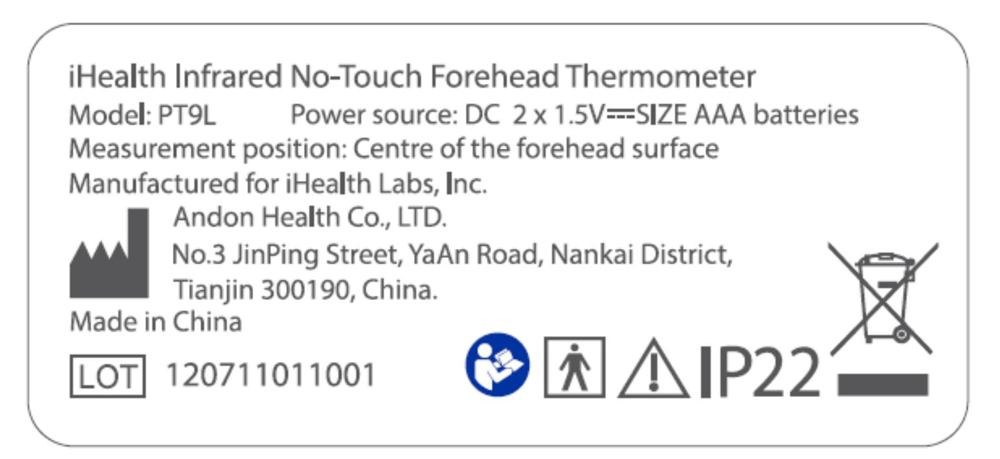
</td>
    <td>

</td>
  </tr>
  <tr>
    <td>

</td>
    <td>
– the name or trademark and contact information of the MANUFACTURER; —制造商的名称或商标，制造商的联系方式；
</td>
    <td>
A
</td>
    <td>
检查铭牌
</td>
    <td>
OK
</td>
    <td>

</td>
    <td>
九安公司名称及地址
</td>
    <td>

</td>
  </tr>
  <tr>
    <td>

</td>
    <td>
– a MODEL OR TYPE REFERENCE; – 型号或型式标记；
</td>
    <td>
A
</td>
    <td>
检查铭牌
</td>
    <td>
OK
</td>
    <td>

</td>
    <td>
Model：PT9L
</td>
    <td>

</td>
  </tr>
  <tr>
    <td>

</td>
    <td>
– a serial number or lot or batch identifier; and – 序列号或批号或批次标识；和
</td>
    <td>
A
</td>
    <td>
检查铭牌
</td>
    <td>
OK
</td>
    <td>

</td>
    <td>
SN中包含批次信息
</td>
    <td>

</td>
  </tr>
  <tr>
    <td>

</td>
    <td>
– the date of manufacture or use by date, if applicable. – 如果适用，生产日期或使用截止日期。 The serial number, lot or batch identifier, and the date of manufacture may be provided in a human readable code or through automatic identification technology such as barcodes or RFID.序列号，批号或批次标识，生产日期可通过人可读代码或通过自动识别技术如条形码或电子标签的方式提供。
</td>
    <td>
A
</td>
    <td>
检查铭牌
</td>
    <td>
OK
</td>
    <td>

</td>
    <td>

</td>
    <td>

</td>
  </tr>
  <tr>
    <td>

</td>
    <td>
Detachable components of the ME EQUIPMENT shall be marked with: – the name or trademark of the MANUFACTURER; and – a MODEL OR TYPE REFERENCE; unless misidentification does not result in an unacceptable RISK.除非错误的识别不会带来不可接受的风险，ME设备的可分离元器件上应标识： –制造商的名称或商标；和—型号或型式标记；
</td>
    <td>
NA
</td>
    <td>
——
</td>
    <td>
——
</td>
    <td>
——
</td>
    <td>
——
</td>
    <td>
无此类设备
</td>
  </tr>
  <tr>
    <td>

</td>
    <td>
Software that forms part of a PEMS shall be identified with a unique identifier, such as revision level or date of release/issue. The identification shall be available to designated persons, e.g. SERVICE PERSONNEL. The identification does not need to be on the outside of the ME EQUIPMENT./构成医用可编程电气系统(PEMS)一部分的的软件应有唯一的识别标识，例如版本号或发布日期。该识别标识对于指定人员如维护人员可以利用的。该标识不需要标在设备外部。
</td>
    <td>
A
</td>
    <td>
设备上无需软件版本号，服务人员可进入测试态查到此信息
</td>
    <td>
OK
</td>
    <td>
——
</td>
    <td>
——
</td>
    <td>
服务人员可进入测试态查到此信息
</td>
  </tr>
  <tr>
    <td>
7.2.3
</td>
    <td>
Consult ACCOMPANYING DOCUMENTS/查阅随机文件
</td>
    <td>
——
</td>
    <td>
——
</td>
    <td>
——
</td>
    <td>
——
</td>
    <td>
——
</td>
    <td>
——
</td>
  </tr>
  <tr>
    <td>

</td>
    <td>
When appropriate, symbol ISO 7000-1641 (DB:2004-01) (see Table D.1, symbol 11) may be used to advise the OPERATOR to consult the ACCOMPANYING DOCUMENTS./如果适用，ISO 7000-1641规定的符号（见表D.1，符号11），可以用于建议操作者查阅随机文件。
</td>
    <td>
NA
</td>
    <td>
——
</td>
    <td>
——
</td>
    <td>
——
</td>
    <td>
——
</td>
    <td>
此条不是强制性要求
</td>
  </tr>
  <tr>
    <td>

</td>
    <td>
When consulting the ACCOMPANYING DOCUMENTS is a mandatory action, safety sign IEC 60878 Safety 01 (see Table D.2, safety sign 10) shall be used instead of symbol ISO 7000-1641./当查阅随机文件是强制性要求时，则应采用IEC 60870安全标志（见表D.2，安全标志10）来代替ISO 7000-1641规定的符号。
</td>
    <td>
A
</td>
    <td>
检查铭牌是否有小人翻书标志
</td>
    <td>

</td>
    <td>

</td>
    <td>
机器上有此标识
</td>
    <td>
小人翻书为强制性要求，故适用，小人翻书标识必须是蓝底白图的 
</td>
  </tr>
  <tr>
    <td>
7.2.4
</td>
    <td>
ACCESSORIES/附件
</td>
    <td>
——
</td>
    <td>
——
</td>
    <td>
——
</td>
    <td>
——
</td>
    <td>
——
</td>
    <td>
——
</td>
  </tr>
  <tr>
    <td>

</td>
    <td>
ACCESSORIES shall be marked with: 附件应标识：
</td>
    <td>
NA
</td>
    <td>
——
</td>
    <td>
——
</td>
    <td>
——
</td>
    <td>
——
</td>
    <td>
——
</td>
  </tr>
  <tr>
    <td>

</td>
    <td>
– the name or trademark and contact information of the MANUFACTURER; —制造商的名称或商标，制造商的联系方式；
</td>
    <td>
NA
</td>
    <td>
——
</td>
    <td>
——
</td>
    <td>
——
</td>
    <td>
——
</td>
    <td>
无此类设备
</td>
  </tr>
  <tr>
    <td>

</td>
    <td>
– a MODEL OR TYPE REFERENCE; – 型号或型式标记；
</td>
    <td>
NA
</td>
    <td>
——
</td>
    <td>
——
</td>
    <td>
——
</td>
    <td>
——
</td>
    <td>
无此类设备
</td>
  </tr>
  <tr>
    <td>

</td>
    <td>
– a serial number or lot or batch identifier; and – 序列号或批号或批次标识；和
</td>
    <td>
NA
</td>
    <td>
——
</td>
    <td>
——
</td>
    <td>
——
</td>
    <td>
——
</td>
    <td>
无此类设备
</td>
  </tr>
  <tr>
    <td>

</td>
    <td>
– the date of manufacture or use by date, if applicable. – 如果适用，生产日期或使用截止日期。 The serial number, lot or batch identifier, and the date of manufacture may be provided in a human readable code or through automatic identification technology such as barcodes or RFID.序列号，批号或批次标识，生产日期可通过人可读代码或通过自动识别技术如条形码或电子标签的方式提供。
</td>
    <td>
NA
</td>
    <td>
——
</td>
    <td>
——
</td>
    <td>
——
</td>
    <td>
——
</td>
    <td>
无此类设备
</td>
  </tr>
  <tr>
    <td>

</td>
    <td>
Where no marking of the ACCESSORIES is practicable, these markings may be affixed to the individual packaging./如果附件不宜作标识，标记应贴在单包装上。
</td>
    <td>
NA
</td>
    <td>
——
</td>
    <td>
——
</td>
    <td>
——
</td>
    <td>
——
</td>
    <td>
无此类设备
</td>
  </tr>
  <tr>
    <td>
7.2.5
</td>
    <td>
预期从其他设备获得供电的ME设备
</td>
    <td>
——
</td>
    <td>
——
</td>
    <td>
——
</td>
    <td>
——
</td>
    <td>
——
</td>
    <td>
——
</td>
  </tr>
  <tr>
    <td>

</td>
    <td>
If ME EQUIPMENT is intended to receive its power from other electrical equipment in an ME SYSTEM and compliance with the requirements of this standard is dependent on that other equipment, one of the following shall be provided:如果ME设备预期从ME系统中其它设备获得供电，并且对本标准要求的符合取决于此“其它设备”，应提供以下要求中的一种：
– the name or trademark of the manufacturer of the other electrical equipment with a MODEL OR TYPE REFERENCE of the specified other equipment adjacent to the relevant connection point;–相关连接点附近，应注明供电设备制造商的名称或商标，供电设备的的型号或型式标记；
– placing safety sign ISO 7010-M002 (see Table D.2, safety sign 10) adjacent to the relevant connection point and listing of the required details in the instructions for use; or–在相关连接点附近放置安全符号ISO 7010-M002 （见表D.2，符号10）并列明使用说明中所需的细节。或
– using a special connector style that is not commonly available on the market and listing of the required details in the instructions for use.–使用市场上不广泛通用的专用连接器并列明使用说明中所需的细节。
</td>
    <td>
NA
</td>
    <td>
——
</td>
    <td>
——
</td>
    <td>
——
</td>
    <td>
——
</td>
    <td>
无此类设备
</td>
  </tr>
  <tr>
    <td>
7.2.6
</td>
    <td>
Connection to the SUPPLY MAINS与供电网的连接
</td>
    <td>
——
</td>
    <td>
——
</td>
    <td>
——
</td>
    <td>
——
</td>
    <td>
——
</td>
    <td>
电源为7号电池
</td>
  </tr>
  <tr>
    <td>

</td>
    <td>
除了永久安装的ME设备之外，这些标记应贴在包括网电源连接器在内的部件外面，更适宜在邻近连接点处。
</td>
    <td>
NA
</td>
    <td>
——
</td>
    <td>
——
</td>
    <td>
——
</td>
    <td>
——
</td>
    <td>
——
</td>
  </tr>
  <tr>
    <td>

</td>
    <td>
对于永久安装的ME设备，可连接的标称电源电压或电压范围应该标记在设备的内部或外部，更适宜贴在邻近电源接线端子处。
</td>
    <td>
NA
</td>
    <td>
——
</td>
    <td>
——
</td>
    <td>
——
</td>
    <td>
——
</td>
    <td>
——
</td>
  </tr>
  <tr>
    <td>

</td>
    <td>
— 设备可连接的额定供电电压或额定电压范围。额定供电电压范围应在最小与最大电压值之间用连字符（-）连接。
</td>
    <td>
NA
</td>
    <td>
——
</td>
    <td>
——
</td>
    <td>
——
</td>
    <td>
——
</td>
    <td>
——
</td>
  </tr>
  <tr>
    <td>

</td>
    <td>
当给出多个额定供电电压或多个额定供电电压范围时，应采用斜线（/）分开
</td>
    <td>
NA
</td>
    <td>
——
</td>
    <td>
——
</td>
    <td>
——
</td>
    <td>
——
</td>
    <td>
——
</td>
  </tr>
  <tr>
    <td>

</td>
    <td>
— 电源的类型，如相数（单相电源除外）和电流的类型；符号可采用IEC 60417-5032、5032-1、5032-2、5031、和5033 （DB:2002-10）（见表D.1 符号1、2、3、4和5）；
</td>
    <td>
NA
</td>
    <td>
——
</td>
    <td>
——
</td>
    <td>
——
</td>
    <td>
——
</td>
    <td>
——
</td>
  </tr>
  <tr>
    <td>

</td>
    <td>
— 以Hz表示额定电源频率或者额定频率范围；
</td>
    <td>
NA
</td>
    <td>
——
</td>
    <td>
——
</td>
    <td>
——
</td>
    <td>
——
</td>
    <td>
——
</td>
  </tr>
  <tr>
    <td>

</td>
    <td>
— 对于ⅡME设备，符号采用IEC60417-5172（DB:2003-02）（见表D.1符号9）。
</td>
    <td>
NA
</td>
    <td>
——
</td>
    <td>
——
</td>
    <td>
——
</td>
    <td>
——
</td>
    <td>
——
</td>
  </tr>
  <tr>
    <td>
7.2.7
</td>
    <td>
Electrical input power from the SUPPLY MAINS从供电网输入的功率
</td>
    <td>
——
</td>
    <td>
——
</td>
    <td>
——
</td>
    <td>
——
</td>
    <td>
——
</td>
    <td>
——
</td>
  </tr>
  <tr>
    <td>

</td>
    <td>
The RATED input from the SUPPLY MAINS shall be marked on the ME EQUIPMENT. The RATED input shall be given in:
– amperes or volt-amperes, or
– if the power factor exceeds 0,9, in amperes, volt-amperes or watts.ME设备上应标识来自网电源的额定输入，额定输入应以如下方式表示：
–安培或伏安，或
–如果功率因数大于0.9，用安培，伏安或瓦特表示。
</td>
    <td>
NA
</td>
    <td>
——
</td>
    <td>
——
</td>
    <td>
——
</td>
    <td>
——
</td>
    <td>
——
</td>
  </tr>
  <tr>
    <td>

</td>
    <td>
In the case of ME EQUIPMENT for one or several RATED voltage ranges, the RATED input shall always be given for the upper and lower limits of the range or ranges, if the range(s) is/are greater than ± 10 % of the mean value of the given range.当ME设备有一个或几个额定电压范围，若这（些）范围超过给定范围平均值±10%时，应标明这（些）范围输入功率的上、下限。
</td>
    <td>
NA
</td>
    <td>
——
</td>
    <td>
——
</td>
    <td>
——
</td>
    <td>
——
</td>
    <td>
——
</td>
  </tr>
  <tr>
    <td>

</td>
    <td>
In the case of range limits which do not differ by more than 10 % from the mean value,marking of the input at the mean value of the range is sufficient.若电压范围的极限未超过其平均值的10%，则只需标明平均值输入功率。
</td>
    <td>
NA
</td>
    <td>
——
</td>
    <td>
——
</td>
    <td>
——
</td>
    <td>
——
</td>
    <td>
——
</td>
  </tr>
  <tr>
    <td>

</td>
    <td>
If the rating of ME EQUIPMENT includes both long-time and momentary current or volt-ampere
ratings, the marking shall include both long-time and the most relevant momentary voltampere
ratings, each plainly identified and indicated in the ACCOMPANYING DOCUMENTS.若ME设备额定值同时包括了长期的和瞬时的电流或伏安值，标记应同时包括长期和最相关的瞬时伏安额定值，并在随机文件中清楚地分别予以表明。
</td>
    <td>
NA
</td>
    <td>
——
</td>
    <td>
——
</td>
    <td>
——
</td>
    <td>
——
</td>
    <td>
——
</td>
  </tr>
  <tr>
    <td>

</td>
    <td>
The marked input of ME EQUIPMENT provided with means for the connection of supply conductors of other electrical equipment shall include the RATED (and marked) output of such means.若ME设备附有供其他设备的电源连接装置，则ME设备所标的输入功率应包括对这些装置的额定（并标明）输出在内。
</td>
    <td>
NA
</td>
    <td>
——
</td>
    <td>
——
</td>
    <td>
——
</td>
    <td>
——
</td>
    <td>
——
</td>
  </tr>
  <tr>
    <td>
7.2.9
</td>
    <td>
IP classificationIP分类
</td>
    <td>
——
</td>
    <td>
——
</td>
    <td>
——
</td>
    <td>
——
</td>
    <td>
——
</td>
    <td>
——
</td>
  </tr>
  <tr>
    <td>

</td>
    <td>
ME EQUIPMENT or its parts shall be marked with a symbol, using the letters IP followed by the
designations described in IEC 60529, according to the classification in 6.3 (see Table D.3,Code 2).ME设备或其部件应依据6.3所述的分类（见表D.3 代码2）用字母IP后接上IEC60529中描述的符号来标记。
IPX0或IP0X类ME设备不需要这样标记。
</td>
    <td>
A
</td>
    <td>
检查铭牌
</td>
    <td>
OK
</td>
    <td>

</td>
    <td>

</td>
    <td>
IP22
</td>
  </tr>
  <tr>
    <td>
7.2.10
</td>
    <td>
APPLIED PARTS/应用部分
</td>
    <td>
——
</td>
    <td>
——
</td>
    <td>
——
</td>
    <td>
——
</td>
    <td>
—— 
</td>
    <td>
——
</td>
  </tr>
  <tr>
    <td>

</td>
    <td>
This requirement does not apply to parts that have been identified according to 4.6. The degree of protection against electric shock as classified in 6.2 for all APPLIED PARTS shall be marked with the relevant symbol, i.e.,/本要求不适用于依据4.6已被识别的部件。 如6.2所述的电击防护程度分类，所有应用部分均应使用相关符号做标记。
</td>
    <td>
——
</td>
    <td>
——
</td>
    <td>
——
</td>
    <td>
——
</td>
    <td>
——
</td>
    <td>
——
</td>
  </tr>
  <tr>
    <td>

</td>
    <td>
TYPE B APPLIED PARTS with symbol IEC 60417-5840,/B型应用部分以IEC60417-5840符号标记（DB:2002-10全部）
</td>
    <td>
NA
</td>
    <td>
——
</td>
    <td>
——
</td>
    <td>
——
</td>
    <td>
——
</td>
    <td>
我们体温计为BF型设备 
</td>
  </tr>
  <tr>
    <td>

</td>
    <td>
TYPE BF APPLIED PARTS with symbol 20 of Table D.1 (IEC 60417-5333, DB: 2002-10)/BF型应用部分以IEC60417-5333符号标记（DB:2002-10全部） 
</td>
    <td>
A
</td>
    <td>
检查铭牌
</td>
    <td>
OK
</td>
    <td>

</td>
    <td>

</td>
    <td>
小人加方框标识
</td>
  </tr>
  <tr>
    <td>

</td>
    <td>
TYPE CF APPLIED PARTS with symbol IEC 60417-5335 (all DB:2002-10)/CF型应用部分以IEC60417-5335符号标记（DB:2002-10全部）
</td>
    <td>
NA
</td>
    <td>
——
</td>
    <td>
——
</td>
    <td>
——
</td>
    <td>
——
</td>
    <td>
我们体温计为BF型设备
</td>
  </tr>
  <tr>
    <td>

</td>
    <td>
For DEFIBRILLATION-PROOF APPLIED PARTS, symbols IEC 60417-5841, IEC 60417-5334, or IEC 60417-5336 shall be used as applicable (all DB:2002-10) (see Table D.1, symbols 25, 26 and 27)./对防除颤应用部分，适用于IEC 60417-5841、IEC 60417-5334或IEC60417-5336规定的符号（见表D.1符号25、26和27）。（DB:2002-10全部）
</td>
    <td>
NA
</td>
    <td>
——
</td>
    <td>
——
</td>
    <td>
——
</td>
    <td>
——
</td>
    <td>
——
</td>
  </tr>
  <tr>
    <td>

</td>
    <td>
The relevant symbol shall be marked adjacent to or on the connector for the APPLIED PART, unless either: – there is no such connector, in which case the marking shall be on the APPLIED PART; or – the connector is used for more than one APPLIED PART and the different APPLIED PARTS have different classifications, in which case each APPLIED PART shall be marked with the relevant symbol./相应符号应标记在应用部分连接器上或其邻近处，除非： — 无该类连接器，此时应标记在应用部分上；或 — 如果连接器用于连接一个以上的应用部分，并且不同的应用部分具有不同的分类，在这种情况下，每个应用部分应使用相应的符号作标记。
</td>
    <td>
NA
</td>
    <td>
——
</td>
    <td>
——
</td>
    <td>
——
</td>
    <td>
——
</td>
    <td>
——
</td>
  </tr>
  <tr>
    <td>

</td>
    <td>
If the protection against the effect of the discharge of a cardiac defibrillator is partly in the PATIENT cable, safety sign ISO 7010-W001, shall be placed near the relevant outlet (see Table D.2, safety sign 2)../如果对心脏除颤器放电效应的防护部分在患者电缆中，ISO7010-W001的安全标记应安置在相应的插座附近（见表D.2，安全标记2）。
</td>
    <td>
NA
</td>
    <td>
——
</td>
    <td>
——
</td>
    <td>
——
</td>
    <td>
——
</td>
    <td>
——
</td>
  </tr>
  <tr>
    <td>

</td>
    <td>
The instructions for use shall explain that protection of the ME EQUIPMENT against the effects of the discharge of a cardiac defibrillator is dependent upon the use of appropriate cables./使用说明书应说明，ME设备对心脏除颤器放电效应的防护依赖于使用适当的电缆。
</td>
    <td>
NA
</td>
    <td>
——
</td>
    <td>
——
</td>
    <td>
——
</td>
    <td>
——
</td>
    <td>
——
</td>
  </tr>
  <tr>
    <td>
7.2.11
</td>
    <td>
符号Symbols
</td>
    <td>
——
</td>
    <td>
——
</td>
    <td>
——
</td>
    <td>
——
</td>
    <td>
——
</td>
    <td>
——
</td>
  </tr>
  <tr>
    <td>

</td>
    <td>
If no marking is provided, ME EQUIPMENT is assumed to be suitable for CONTINUOUS OPERATION./如果没有标记，ME设备被认为适合连续运行。
</td>
    <td>
A
</td>
    <td>
检查铭牌
</td>
    <td>
OK
</td>
    <td>

</td>
    <td>

</td>
    <td>
无标记
</td>
  </tr>
  <tr>
    <td>

</td>
    <td>
For ME EQUIPMENT intended for non-CONTINUOUS OPERATION, the DUTY CYCLE shall be indicated using an appropriate marking giving the maximum activation (on) time and the minimum deactivation (off) time./对于预期非连续运行的ME设备，应采用适当的标记指示工作周期，给最大激活启动时间和最小激活关闭时间。
</td>
    <td>
NA
</td>
    <td>
——
</td>
    <td>
——
</td>
    <td>
——
</td>
    <td>
——
</td>
    <td>
——
</td>
  </tr>
  <tr>
    <td>
7.2.17
</td>
    <td>
Protective packaging/保护性包装
</td>
    <td>
——
</td>
    <td>
——
</td>
    <td>
——
</td>
    <td>
——
</td>
    <td>
——
</td>
    <td>
——
</td>
  </tr>
  <tr>
    <td>

</td>
    <td>
If special handling measures have to be taken during transport or storage, the packaging shall be marked accordingly (see ISO 780)./若在运输或贮存中要采取特别的处理措施，在包装上应作出相应的标记 （见ISO 780）。
</td>
    <td>
A
</td>
    <td>
按照ISO 780检查表检查外箱
</td>
    <td>
OK
</td>
    <td>

</td>
    <td>
见ISO 780检查表
</td>
    <td>
——
</td>
  </tr>
  <tr>
    <td>

</td>
    <td>
The permissible environmental conditions for transport and storage shall be marked on the outside of the packaging (see 7.9.3.1 and ISO 15223)./运输和贮存时允许的环境条件应在外包装上标出（见7.9.3.1和ISO 15223）。
</td>
    <td>
A
</td>
    <td>
检查彩盒、外箱上是否有运输和存贮温湿度要求
</td>
    <td>
OK
</td>
    <td>

</td>
    <td>
彩盒、外箱上有运输、存储温湿度
</td>
    <td>

</td>
  </tr>
  <tr>
    <td>
7.3
</td>
    <td>
ME设备和ME设备部件的内部标记
</td>
    <td>
——
</td>
    <td>
——
</td>
    <td>
——
</td>
    <td>
——
</td>
    <td>
——
</td>
    <td>
——
</td>
  </tr>
  <tr>
    <td>
7.3.3
</td>
    <td>
Batteries/电池
</td>
    <td>
——
</td>
    <td>
——
</td>
    <td>
——
</td>
    <td>
——
</td>
    <td>
——
</td>
    <td>
——
</td>
  </tr>
  <tr>
    <td>

</td>
    <td>
The type of battery and the mode of insertion (if applicable) shall be marked (see 15.4.3.2)./应标明电池的型号及其装入方法（如合适用）（见15.4.3.2）。
</td>
    <td>
A
</td>
    <td>
检查设备电池仓是否有标识，和正负极
</td>
    <td>
OK
</td>
    <td>

</td>
    <td>
电池仓有正极标志
</td>
    <td>
——
</td>
  </tr>
  <tr>
    <td>

</td>
    <td>
For batteries intended to be changed only by SERVICE PERSONNEL with the use of a TOOL, an identifying marking referring to information stated in the ACCOMPANYING DOCUMENTS is sufficient./预期仅由服务人员使用工具才能更换的电池，用一个引用随机文件中说明的识别标记即可。
</td>
    <td>
NA
</td>
    <td>
——
</td>
    <td>
——
</td>
    <td>
——
</td>
    <td>
——
</td>
    <td>
——
</td>
  </tr>
  <tr>
    <td>

</td>
    <td>
Where lithium batteries or fuel cells are incorporated and where incorrect replacement would result in an unacceptable RISK, a warning indicating that replacement by inadequately trained personnel could result in a HAZARD (such as excessive temperatures, fire or explosion) shall be given in addition to the identifying marking referring to information stated in the ACCOMPANYING DOCUMENTS./在装有锂电池或燃料电池，并且由于不正确的更换可能导致不可接受的风险时，由培训不充分的人员更换可能导致危害（如过高的温度、火灾或爆炸）的警示性说明应附加到识别标记
</td>
    <td>
NA
</td>
    <td>
——
</td>
    <td>
——
</td>
    <td>
——
</td>
    <td>
——
</td>
    <td>
——
</td>
  </tr>
  <tr>
    <td>
7.4
</td>
    <td>
Marking of controls and instruments/控制器和仪表的标记
</td>
    <td>
——
</td>
    <td>
——
</td>
    <td>
——
</td>
    <td>
——
</td>
    <td>
——
</td>
    <td>
——
</td>
  </tr>
  <tr>
    <td>
7.4.1
</td>
    <td>
Power switches/电源开关
</td>
    <td>
——
</td>
    <td>
——
</td>
    <td>
——
</td>
    <td>
——
</td>
    <td>
——
</td>
    <td>
——
</td>
  </tr>
  <tr>
    <td>

</td>
    <td>
Switches used to control power to ME EQUIPMENT or its parts, including mains switches, shall have their “on” and “off” positions: – marked with symbols IEC 60417-5007 (DB:2002-10) and IEC 60417-5008 (DB:2002-10) (see Table D.1, symbols 12 and 13); or/用于控制ME设备或其部件的电源的开关，包括网电源开关，应有相应的“通”和“断”位置： — 标有IEC 60417-5007（DB:2002-10）和IEC 60417-5008 （DB:2002-10）规定的符号（见表D.1符号12和13）；或其他明确的方法指示
</td>
    <td>
NA
</td>
    <td>
——
</td>
    <td>
——
</td>
    <td>
——
</td>
    <td>
——
</td>
    <td>
启动测量的开关不是电源开关
</td>
  </tr>
  <tr>
    <td>

</td>
    <td>
— 用相邻的指示灯指示；或
</td>
    <td>
NA
</td>
    <td>
——
</td>
    <td>
——
</td>
    <td>
——
</td>
    <td>
——
</td>
    <td>
无指示灯
</td>
  </tr>
  <tr>
    <td>

</td>
    <td>
indicated by other unambiguous means./— 其他明确的方法指示。
</td>
    <td>
NA
</td>
    <td>
——
</td>
    <td>
——
</td>
    <td>
——
</td>
    <td>
——
</td>
    <td>
——
</td>
  </tr>
  <tr>
    <td>

</td>
    <td>
如果使用具有双稳态位置的按钮： — 应标有IEC60417-5010（2002-10）规定的符号（见表D.1符号14；且
</td>
    <td>
NA
</td>
    <td>
——
</td>
    <td>
——
</td>
    <td>
——
</td>
    <td>
——
</td>
    <td>
——
</td>
  </tr>
  <tr>
    <td>

</td>
    <td>
— 应使用附近的指示灯指示其状态；或
</td>
    <td>
NA
</td>
    <td>
——
</td>
    <td>
——
</td>
    <td>
——
</td>
    <td>
——
</td>
    <td>
——
</td>
  </tr>
  <tr>
    <td>

</td>
    <td>
— 应使用其他明确的方法指示其状态
</td>
    <td>
NA
</td>
    <td>
——
</td>
    <td>
——
</td>
    <td>
——
</td>
    <td>
——
</td>
    <td>
——
</td>
  </tr>
  <tr>
    <td>

</td>
    <td>
如果使用的是瞬态位置的按钮：
— 应标有IEC60417-5011（2002-10）规定的符号（见表D.1符号15）；或
</td>
    <td>
NA
</td>
    <td>
——
</td>
    <td>
——
</td>
    <td>
——
</td>
    <td>
——
</td>
    <td>
——
</td>
  </tr>
  <tr>
    <td>

</td>
    <td>
— 应使用相邻的指示灯指示其状态；或
</td>
    <td>
NA
</td>
    <td>
——
</td>
    <td>

</td>
    <td>

</td>
    <td>

</td>
    <td>
——
</td>
  </tr>
  <tr>
    <td>

</td>
    <td>
— 应使用其他明确的方法指示其状态
</td>
    <td>
NA
</td>
    <td>
——
</td>
    <td>

</td>
    <td>

</td>
    <td>

</td>
    <td>
——
</td>
  </tr>
  <tr>
    <td>
7.4.2
</td>
    <td>
控制器
</td>
    <td>
——
</td>
    <td>
——
</td>
    <td>
——
</td>
    <td>
——
</td>
    <td>
——
</td>
    <td>
——
</td>
  </tr>
  <tr>
    <td>

</td>
    <td>
ME设备上控制器和开关的不同位置应采用数字、字母或其他直观的方法表明
</td>
    <td>
NA
</td>
    <td>
——
</td>
    <td>
——
</td>
    <td>
——
</td>
    <td>
——
</td>
    <td>
——
</td>
  </tr>
  <tr>
    <td>

</td>
    <td>
如果在正常使用中，控制器设定值的改变会对患者造成不可接受的风险，
该类控制器应备有：
— 相应的指示装置，或
</td>
    <td>
NA
</td>
    <td>
——
</td>
    <td>
——
</td>
    <td>
——
</td>
    <td>
——
</td>
    <td>
控制器无设定值
</td>
  </tr>
  <tr>
    <td>

</td>
    <td>
— 功能量值变化方向的指示
</td>
    <td>
NA
</td>
    <td>
——
</td>
    <td>
——
</td>
    <td>
——
</td>
    <td>
——
</td>
    <td>
控制器无设定值
</td>
  </tr>
  <tr>
    <td>

</td>
    <td>
将ME设备置于“待机”状态的控制器或开关可采用IEC 60417-5009(2002-10)的符号指示
</td>
    <td>
NA
</td>
    <td>
——
</td>
    <td>
——
</td>
    <td>
——
</td>
    <td>
——
</td>
    <td>
无此类控制器或开关
</td>
  </tr>
  <tr>
    <td>
7.4.3
</td>
    <td>
Units of measure/计量单位
</td>
    <td>
——
</td>
    <td>
——
</td>
    <td>
——
</td>
    <td>
——
</td>
    <td>
——
</td>
    <td>
——
</td>
  </tr>
  <tr>
    <td>

</td>
    <td>
Numeric indications of parameters on ME EQUIPMENT shall be expressed in SI units according to ISO 31 except the base quantities listed in Table 1 may be expressed in the indicated units, which are outside the SI units system./ME设备参数的数值指示，应采用ISO 31的国际单位制表示，除了表1中列出的基本量可采用国际单位制以外的单位表示之外。
</td>
    <td>
A
</td>
    <td>
检查温度计显示和随机文件中参数的单位是否为摄氏度
</td>
    <td>
OK
</td>
    <td>

</td>
    <td>
温度计符合要求 Resolution: 0.1℉/0.1℃ Measurement range:93.2℉-109.4℉(34.0℃-43.0℃) 
</td>
    <td>
——
</td>
  </tr>
  <tr>
    <td>

</td>
    <td>
For application of SI units, their multiples and certain other units, ISO 1000 applies./对于国际单位制的应用，其倍数和某些其他单位，按ISO1000规定。
</td>
    <td>
A
</td>
    <td>
检查温度计显示和随机文件中参数的单位是否为摄氏度
</td>
    <td>
OK
</td>
    <td>

</td>
    <td>
温度计符合要求 Resolution: 0.1℉/0.1℃ Measurement range:93.2℉-109.4℉(34.0℃-43.0℃) 
</td>
    <td>
——
</td>
  </tr>
  <tr>
    <td>
7.5
</td>
    <td>
Safety signs/安全标识
</td>
    <td>
——
</td>
    <td>
——
</td>
    <td>
——
</td>
    <td>
——
</td>
    <td>
——
</td>
    <td>
——
</td>
  </tr>
  <tr>
    <td>

</td>
    <td>
For the purpose of this clause, markings used to convey a warning, prohibition or mandatory action that mitigates a RISK that is not obvious to the OPERATOR shall be a safety sign selected from ISO 7010.If a safety sign with an established meaning is appropriately used, the use of the general warning sign ISO 7010:2003-W001 (see Table D.2, safety sign 2) is not required./为达到本章目的，用于传递警告、禁止或强制性行动的标记应选择ISO 7010里的符号.规定的安全标识，以降低操作者不易察觉的风险。如果具有明确意义的安全符号被适当使用，那么一般性安全符号ISO7010:2003的使用不是必须的。
</td>
    <td>
A
</td>
    <td>
检查说明书
</td>
    <td>
OK
</td>
    <td>

</td>
    <td>
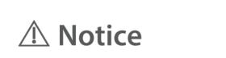
</td>
    <td>
——
</td>
  </tr>
  <tr>
    <td>

</td>
    <td>
If there is insufficient space to place the affirmative statement together with the safety sign on the ME EQUIPMENT, it may be placed in the instructions for use./如果在ME设备上没有足够的空间将肯定性陈述和安全标识安置在一起，可将其放在使用说明书中。
</td>
    <td>
A
</td>
    <td>
检查铭牌及说明书
</td>
    <td>

</td>
    <td>

</td>
    <td>
Sign &amp;Symbols 
</td>
    <td>
——
</td>
  </tr>
  <tr>
    <td>

</td>
    <td>
The colours for safety signs are specified in ISO 3864-1 and it is important to use the specified colour/安全标识的颜色由ISO 3864-1规定，使用规定的颜色是重要的。
</td>
    <td>
NA
</td>
    <td>
——
</td>
    <td>
——
</td>
    <td>
——
</td>
    <td>
——
</td>
    <td>
建议此条不适用，因为1.彩色印刷成本高2.与风险分析暂时无关
</td>
  </tr>
  <tr>
    <td>

</td>
    <td>
A safety GENERAL SAFETY AND PRECAUTIONS should include the appropriate precautions or include instructions on how to reduce the RISK/安全须知应包括恰当的预防措施或如何降低风险的说明。
</td>
    <td>
A
</td>
    <td>
检查说明书是否有警告标识及警告内容
</td>
    <td>
OK
</td>
    <td>

</td>
    <td>

</td>
    <td>
列举几条有警告标识的内容
</td>
  </tr>
  <tr>
    <td>

</td>
    <td>
Safety signs, including any supplementary symbol or text, shall be explained in the instructions for use/安全标识、包括任何辅助符号或文本，均应在使用说明书中予以解释。
</td>
    <td>
A
</td>
    <td>
检查说明书是否有符号解释
</td>
    <td>
OK
</td>
    <td>

</td>
    <td>
Sign &amp;Symbols 
</td>
    <td>
——
</td>
  </tr>
  <tr>
    <td>

</td>
    <td>
如果安全符号附近有补充文本，补充文本应采用预期操作者可接受的语言 。注4：在某些国家，需要不止一种语言。
</td>
    <td>
NA
</td>
    <td>
——
</td>
    <td>
——
</td>
    <td>
——
</td>
    <td>
——
</td>
    <td>
安全符号附近无文本标识
</td>
  </tr>
  <tr>
    <td>
7.6
</td>
    <td>
Symbols/符号
</td>
    <td>
——
</td>
    <td>
——
</td>
    <td>
——
</td>
    <td>
——
</td>
    <td>
——
</td>
    <td>
——
</td>
  </tr>
  <tr>
    <td>
7.6.1
</td>
    <td>
Explanation of symbols/符号的说明
</td>
    <td>
——
</td>
    <td>
——
</td>
    <td>
——
</td>
    <td>
——
</td>
    <td>
——
</td>
    <td>
——
</td>
  </tr>
  <tr>
    <td>

</td>
    <td>
The meanings of the symbols used for marking shall be explained in the instructions for use./用作标记的符号含义应在使用说明书中予以解释。
</td>
    <td>
A
</td>
    <td>
检查说明书是否有符号解释
</td>
    <td>
OK
</td>
    <td>

</td>
    <td>
Sign &amp;Symbols 
</td>
    <td>
——
</td>
  </tr>
  <tr>
    <td>
7.6.2
</td>
    <td>
Symbols from Annex D/附录D的符号
</td>
    <td>
——
</td>
    <td>
——
</td>
    <td>
——
</td>
    <td>
——
</td>
    <td>
——
</td>
    <td>
——
</td>
  </tr>
  <tr>
    <td>

</td>
    <td>
Symbols required by this standard shall conform to the requirements in the referenced IEC or ISO publication./本标准所要求的符号应符合引用的IEC或ISO出版物的要求。
</td>
    <td>
A
</td>
    <td>
检查说明书
</td>
    <td>
OK
</td>
    <td>

</td>
    <td>
说明书中描述均采用摄氏华氏两种标注
</td>
    <td>
——
</td>
  </tr>
  <tr>
    <td>
7.6.3
</td>
    <td>
Symbols for controls and performance用于控制器和性能的符号
</td>
    <td>
——
</td>
    <td>
——
</td>
    <td>
——
</td>
    <td>
——
</td>
    <td>
——
</td>
    <td>
——
</td>
  </tr>
  <tr>
    <td>

</td>
    <td>
Symbols used for controls and performance shall conform to the requirements of the IEC or ISO publication where the symbol is defined, when applicable./用于控制器和性能的符号，适用时，应符合给出其定义的IEC或ISO出版物的要求。
</td>
    <td>
NA
</td>
    <td>
——
</td>
    <td>
——
</td>
    <td>
——
</td>
    <td>
——
</td>
    <td>
无用于控制器和性能的符号
</td>
  </tr>
  <tr>
    <td>
7.8
</td>
    <td>
Indicator lights and controls/指示灯和控制器
</td>
    <td>
——
</td>
    <td>
——
</td>
    <td>
——
</td>
    <td>
——
</td>
    <td>
——
</td>
    <td>
——
</td>
  </tr>
  <tr>
    <td>
7.8.1
</td>
    <td>
Colours of indicator lights/指示灯颜色
</td>
    <td>
——
</td>
    <td>
——
</td>
    <td>
——
</td>
    <td>
——
</td>
    <td>
——
</td>
    <td>
背光、分类灯不算指示灯
</td>
  </tr>
  <tr>
    <td>

</td>
    <td>
Red-Warning – immediate response by the OPERATOR is required/红色指示灯表示警告（要求操作者立即作出反应）
</td>
    <td>
NA
</td>
    <td>
——
</td>
    <td>
——
</td>
    <td>
——
</td>
    <td>
——
</td>
    <td>
——
</td>
  </tr>
  <tr>
    <td>

</td>
    <td>
Yellow-Caution – prompt response by the OPERATOR is required/黄色指示灯表示注意
</td>
    <td>
NA
</td>
    <td>
——
</td>
    <td>
——
</td>
    <td>
——
</td>
    <td>
——
</td>
    <td>
——
</td>
  </tr>
  <tr>
    <td>

</td>
    <td>
Green-Ready for use/绿色指示灯表示可以正常使用
</td>
    <td>
NA
</td>
    <td>
——
</td>
    <td>
——
</td>
    <td>
——
</td>
    <td>
——
</td>
    <td>
——
</td>
  </tr>
  <tr>
    <td>

</td>
    <td>
Any other colour-Meaning other than that of red, yellow or green/其它颜色指示灯
</td>
    <td>
NA
</td>
    <td>
——
</td>
    <td>
——
</td>
    <td>
——
</td>
    <td>
——
</td>
    <td>
——
</td>
  </tr>
  <tr>
    <td>

</td>
    <td>
Dot-matrix and other alphanumeric displays are not considered to be indicator lights./点阵和其他字母—数字显示不作为指示灯考虑 
</td>
    <td>
NA
</td>
    <td>
——
</td>
    <td>
——
</td>
    <td>
——
</td>
    <td>
——
</td>
    <td>
——
</td>
  </tr>
  <tr>
    <td>
7.8.2
</td>
    <td>
Colours of controls/控制器的颜色
</td>
    <td>
——
</td>
    <td>
——
</td>
    <td>
——
</td>
    <td>
——
</td>
    <td>
——
</td>
    <td>
——
</td>
  </tr>
  <tr>
    <td>

</td>
    <td>
The colour red shall be used only for a control by which a function is interrupted in case of emergency./红色应仅用于在紧急情况下中断功能的控制器
</td>
    <td>
NA
</td>
    <td>
——
</td>
    <td>
——
</td>
    <td>
——
</td>
    <td>
——
</td>
    <td>
——
</td>
  </tr>
  <tr>
    <td>
7.9
</td>
    <td>
ACCOMPANYING DOCUMENTS/随机文件
</td>
    <td>
——
</td>
    <td>

</td>
    <td>
——
</td>
    <td>
——
</td>
    <td>
——
</td>
    <td>
——
</td>
  </tr>
  <tr>
    <td>
7.9.1
</td>
    <td>
General/总则
</td>
    <td>
——
</td>
    <td>

</td>
    <td>
——
</td>
    <td>
——
</td>
    <td>
——
</td>
    <td>
——
</td>
  </tr>
  <tr>
    <td>

</td>
    <td>
ME EQUIPMENT shall be accompanied by documents containing at least the instructions for use and a technical description. The ACCOMPANYING DOCUMENTS shall be regarded as a part of the ME EQUIPMENT.The ACCOMPANYING DOCUMENTS shall identify the ME EQUIPMENT by including, as applicable, the following:/ME设备应附有至少包括使用说明书，技术说明书的文件。随机文件被认为是ME设备的一部分。如果适用，随机文件中应包括下述识别ME设备的信息：
</td>
    <td>
——
</td>
    <td>
——
</td>
    <td>
——
</td>
    <td>
——
</td>
    <td>
——
</td>
    <td>
——
</td>
  </tr>
  <tr>
    <td>

</td>
    <td>
– name or trade-name of the MANUFACTURER and contact information to which the RESPONSIBLE ORGANIZATION can refer;/—制造商名称或商标，可供责任组织查阅的制造商联系方式。
</td>
    <td>
A
</td>
    <td>
检查说明书
</td>
    <td>

</td>
    <td>

</td>
    <td>
九安公司名称及地址
</td>
    <td>
出口美国的有分销商客户名称、地址即可，无需九安信息
</td>
  </tr>
  <tr>
    <td>

</td>
    <td>
– MODEL OR TYPE REFERENCE/—型式标记
</td>
    <td>
A
</td>
    <td>
检查说明书中有无型式标记（即产品型号）
</td>
    <td>

</td>
    <td>

</td>
    <td>
说明书<strong>Product Introduction </strong>中最后一项
</td>
    <td>

</td>
  </tr>
  <tr>
    <td>

</td>
    <td>
If the ACCOMPANYING DOCUMENTS are provided electronically, the USABILITY ENGINEERING PROCESS shall include consideration of which information also needs to be provided as hard copy or as markings on the ME EQUIPMENT,/随机文件可以电子版的方式提供，如电子文件方式的光盘。如果随机文件以电子的方式提供，易用性工程中应考虑哪些信息需要以硬拷贝或ME设备上的标记的方式提供。
</td>
    <td>
NA
</td>
    <td>
检查设备标识或易用性工程文档
</td>
    <td>
——
</td>
    <td>
——
</td>
    <td>
——
</td>
    <td>
如有电子版说明书，此项适用
</td>
  </tr>
  <tr>
    <td>

</td>
    <td>
The ACCOMPANYING DOCUMENTS shall specify any special skills, training and knowledge required of the intended OPERATOR or the RESPONSIBLE ORGANIZATION and any restrictions on locations or environments in which the ME EQUIPMENT can be used./随机文件应详细说明对预期的操作者或责任组织要求的专业机技能、培训和知识，以及ME设备使用时在场所或环境等方面的限制。
</td>
    <td>
A
</td>
    <td>
检查说明书中操作和Notice部分
</td>
    <td>

</td>
    <td>

</td>
    <td>
Notice
</td>
    <td>

</td>
  </tr>
  <tr>
    <td>
7.9.2
</td>
    <td>
Instructions for use/使用说明书
</td>
    <td>
——
</td>
    <td>
——
</td>
    <td>
——
</td>
    <td>
——
</td>
    <td>
——
</td>
    <td>
——
</td>
  </tr>
  <tr>
    <td>
7.9.2.1
</td>
    <td>
General/一般要求
</td>
    <td>
——
</td>
    <td>
——
</td>
    <td>
——
</td>
    <td>
——
</td>
    <td>
——
</td>
    <td>
——
</td>
  </tr>
  <tr>
    <td>

</td>
    <td>
The instructions for use shall document: – the use of the ME EQUIPMENT as intended by the MANUFACTURER/使用说明书应包括下列内容： — 制造商对ME设备的预期用途；
</td>
    <td>
A
</td>
    <td>
检查说明书是否有预期用途描述
</td>
    <td>
OK
</td>
    <td>

</td>
    <td>
INTENDED USE
</td>
    <td>
——
</td>
  </tr>
  <tr>
    <td>

</td>
    <td>
– the frequently used functions, and/— 经常使用的功能；
</td>
    <td>
A
</td>
    <td>
检查说明书是否有功能描述
</td>
    <td>
OK
</td>
    <td>

</td>
    <td>
Instruction for use
</td>
    <td>
——
</td>
  </tr>
  <tr>
    <td>

</td>
    <td>
– any known contraindication(s) to the use of the ME EQUIPMENT/— 已知的ME设备使用的任何禁忌症。
</td>
    <td>
A
</td>
    <td>
检查说明书有无禁忌症信息
</td>
    <td>
OK
</td>
    <td>

</td>
    <td>
 CONTRAINDICATION   
It is inappropriate for people with serious arrhythmia to use this Electronic Sphygmomanometer.                    
</td>
    <td>
——
</td>
  </tr>
  <tr>
    <td>

</td>
    <td>
– those parts of the ME EQUIPMENT that shall not be serviced or maintained while in use witha PATIENT.– 在患者身体上使用时不能进行维护或服务的ME设备的部件。
</td>
    <td>
NA
</td>
    <td>
——
</td>
    <td>
——
</td>
    <td>
——
</td>
    <td>
——
</td>
    <td>
——
</td>
  </tr>
  <tr>
    <td>

</td>
    <td>
Where the PATIENT is an intended OPERATOR, the instructions for use shall indicate:如果患者是预期的操作者，使用说明应包含：
</td>
    <td>
_
</td>
    <td>
_
</td>
    <td>
_
</td>
    <td>
_
</td>
    <td>
_
</td>
    <td>
——
</td>
  </tr>
  <tr>
    <td>

</td>
    <td>
– the PATIENT is an intended OPERATOR;– 患者是一个预期的操作者
</td>
    <td>
A
</td>
    <td>
检查说明书
</td>
    <td>
OK
</td>
    <td>

</td>
    <td>
NOTICE
The patient is an intended operator.
</td>
    <td>
——
</td>
  </tr>
  <tr>
    <td>

</td>
    <td>
– a warning against servicing and MAINTENANCE while the ME EQUIPMENT is in use;– 针对ME设备在使用中进行服务和维护的警告。
</td>
    <td>
NA
</td>
    <td>
——
</td>
    <td>
——
</td>
    <td>
——
</td>
    <td>
——
</td>
    <td>
——
</td>
  </tr>
  <tr>
    <td>

</td>
    <td>
– which functions the PATIENT can safely use and, where applicable, which functions the PATIENT cannot safely use; and– 患者可以安全使用的功能，以及如果适用，患者不能安全使用的功能；
</td>
    <td>
NA
</td>
    <td>
——
</td>
    <td>
——
</td>
    <td>
——
</td>
    <td>
——
</td>
    <td>
——
</td>
  </tr>
  <tr>
    <td>

</td>
    <td>
– which MAINTENANCE the PATIENT can perform (e.g. changing batteries).– 患者可进行的维护（如充电）
</td>
    <td>
A
</td>
    <td>
检查说明书
</td>
    <td>
OK
</td>
    <td>

</td>
    <td>
CARE &amp; MAINTENANCE
</td>
    <td>
——
</td>
  </tr>
  <tr>
    <td>

</td>
    <td>
The instructions for use shall indicate: – the name or trademark and address of the MANUFACTURER 使用说明应指示： – 制造商的名称或商标，制造商的地址
</td>
    <td>
A
</td>
    <td>
检查说明书
</td>
    <td>
OK
</td>
    <td>

</td>
    <td>
九安公司名称及地址
</td>
    <td>
——
</td>
  </tr>
  <tr>
    <td>

</td>
    <td>
– the MODEL OR TYPE REFERENCE.–型号或型式标记
</td>
    <td>
A
</td>
    <td>
检查说明书
</td>
    <td>
OK
</td>
    <td>

</td>
    <td>
Product Introduction最后 Model: PT9L
</td>
    <td>
——
</td>
  </tr>
  <tr>
    <td>

</td>
    <td>
The instructions for use shall include all applicable classifications specified in Clause 6, all markings specified in 7.2, and the explanation of safety signs and symbols (marked on the ME EQUIPMENT)./使用说明书应包括在第6条中详细说明的所有适合的分类、7.2规定的标记以及（标记在ME设备上的）安全标识和符号的解释。
</td>
    <td>
A
</td>
    <td>
检查7.2是否符合，以及说明书中有无符号解释
</td>
    <td>
OK
</td>
    <td>

</td>
    <td>
见7.2回复和 Signs and symbols
</td>
    <td>
——
</td>
  </tr>
  <tr>
    <td>

</td>
    <td>
The instructions for use shall be in a language that is acceptable to the intended OPERATOR/使用说明书使用的语言应该能被预期的操作者所接受。
</td>
    <td>
A
</td>
    <td>
检查说明书
</td>
    <td>
OK
</td>
    <td>

</td>
    <td>
语言为英语
</td>
    <td>
以出口国家为准
</td>
  </tr>
  <tr>
    <td>
7.9.2.2
</td>
    <td>
Warning and safety GENERAL SAFETY AND PRECAUTIONSs/警告和安全通告
</td>
    <td>
——
</td>
    <td>
——
</td>
    <td>
——
</td>
    <td>
——
</td>
    <td>
——
</td>
    <td>
——
</td>
  </tr>
  <tr>
    <td>

</td>
    <td>
The instructions for use shall include all warning and safety GENERAL SAFETY AND PRECAUTIONSs./使用说明书应该包括所有的警告和安全通告。
</td>
    <td>
A
</td>
    <td>
检查说明书中警告/注意标识及其内容，以及GENERAL SAFETY AND PRECAUTIONS
</td>
    <td>
OK
</td>
    <td>

</td>
    <td>
Notice
</td>
    <td>

</td>
  </tr>
  <tr>
    <td>

</td>
    <td>
For CLASS I ME EQUIPMENT, the instructions for use shall include a warning statement to the effect: “WARNING: To avoid the risk of electric shock, this equipment must only be connected to a supply mains with protective earth.”/对于Ⅰ类ME设备，使用说明书应包括警告性陈述“警告：为了避免电击风险，本设备只应与带有保护接地的电网相连接”。
</td>
    <td>
NA
</td>
    <td>
——
</td>
    <td>
——
</td>
    <td>
——
</td>
    <td>
——
</td>
    <td>
非一类设备
</td>
  </tr>
  <tr>
    <td>

</td>
    <td>
The instructions for use shall provide the OPERATOR or RESPONSIBLE ORGANIZATION with warnings regarding any significant RISKS of reciprocal interference posed by the presence of the ME EQUIPMENT during specific investigations or treatments.使用说明书应该向操作者或责任组织提供有关ME设备在具体的检查或治疗期间，由相互干扰所引起的任何重大风险的警告。
</td>
    <td>
A
</td>
    <td>
检查说明书中有无电磁兼容方面内容
</td>
    <td>
OK
</td>
    <td>

</td>
    <td>
Electromagnetic compatibility information 
</td>
    <td>

</td>
  </tr>
  <tr>
    <td>

</td>
    <td>
The instructions for use shall include information regarding potential electromagnetic or other interference between the ME EQUIPMENT and other devices together with advice on ways to avoid or minimize such interference.使用说明书应包括有关ME设备与其他器械之间潜在的电磁干扰或其他干扰的信息，并给出避免或减少该种干扰的建议措施。
</td>
    <td>
A
</td>
    <td>
检查说明书中有无电磁兼容方面内容
</td>
    <td>
OK
</td>
    <td>

</td>
    <td>
Electromagnetic compatibility information 
</td>
    <td>

</td>
  </tr>
  <tr>
    <td>

</td>
    <td>
If the ME EQUIPMENT is provided with an integral MULTIPLE SOCKET-OUTLET, the instructions for use shall provide a warning statement that connecting electrical equipment to the MSO effectively leads to creating an ME SYSTEM and the result can be a reduced level of safety. For the requirements that are applicable to an ME SYSTEM, the RESPONSIBLE ORGANIZATION shall be referred to this standard.如果ME设备配备一个集成的多联插座，使用说明书应有警告性说明：将电气设备连接到多联插座，会有效地导致生成一个ME系统，其结果将会降低安全水平。本要求适用于任何ME系统，责任方应参考本标准。
</td>
    <td>
NA
</td>
    <td>
——
</td>
    <td>
——
</td>
    <td>
——
</td>
    <td>
——
</td>
    <td>
无多联插座
</td>
  </tr>
  <tr>
    <td>
7.9.2.3
</td>
    <td>
ME EQUIPMENT specified for connection to a separate power supply/规定与独立电源连接的ME设备
</td>
    <td>
——
</td>
    <td>
——
</td>
    <td>
——
</td>
    <td>
——
</td>
    <td>
——
</td>
    <td>
——
</td>
  </tr>
  <tr>
    <td>

</td>
    <td>
If ME EQUIPMENT is intended for connection to a separate power supply, either the power supply shall be specified as part of the ME EQUIPMENT or the combination shall be specified as an ME SYSTEM. The instructions for use shall state this specification./如果ME设备预期与独立电源连接，那么该电源应被作为ME设备的一部分，或者该联合应被作为ME系统。
</td>
    <td>
NA
</td>
    <td>
——
</td>
    <td>
——
</td>
    <td>
——
</td>
    <td>
——
</td>
    <td>
无独立电源
</td>
  </tr>
  <tr>
    <td>
7.9.2.4
</td>
    <td>
Electrical power source/电源
</td>
    <td>
——
</td>
    <td>
——
</td>
    <td>
——
</td>
    <td>
——
</td>
    <td>
——
</td>
    <td>
——
</td>
  </tr>
  <tr>
    <td>

</td>
    <td>
For mains-operated ME EQUIPMENT with an additional power source not automatically maintained in a fully usable condition, the instructions for use shall include a warning statement referring to the necessity for periodic checking or replacement of such an additional power source/对由电网供电并带有附加电源的ME设备，若其附加电源不能自动地保持在完全可用的状态，使用说明书应提出警告，规定应对该附加电源进行定期检查和更换。
</td>
    <td>
NA
</td>
    <td>
——
</td>
    <td>
——
</td>
    <td>
——
</td>
    <td>
—— 
</td>
    <td>
无附加电源
</td>
  </tr>
  <tr>
    <td>

</td>
    <td>
If leakage from a battery would result in an unacceptable RISK, the instructions for use shallinclude a warning to remove the battery if the ME EQUIPMENT is not likely to be used for sometime./如果电池的漏液会导致不可接受的风险，使用说明书中应有警告性说明：若在一段时间内可能不使用ME设备时，应取出这些电池。
</td>
    <td>
A
</td>
    <td>
检查说明书
</td>
    <td>
OK
</td>
    <td>

</td>
    <td>
Remove the batteries if the device will not be used more than one month.
</td>
    <td>
——
</td>
  </tr>
  <tr>
    <td>

</td>
    <td>
If an INTERNAL ELECTRICAL POWER SOURCE is replaceable, the instructions for use shall state its specification./如果内部电源是可更换的，使用说明书应陈述其规格。
</td>
    <td>
A
</td>
    <td>
检查说明书是否有此描述
</td>
    <td>
OK
</td>
    <td>

</td>
    <td>
<strong>Product performance </strong>3.  
</td>
    <td>
必须要有直流符号
</td>
  </tr>
  <tr>
    <td>

</td>
    <td>
If loss of the power source would result in an unacceptable RISK, the instructions for use shall contain a warning that the ME EQUIPMENT must be connected to an appropriate power source./如果电源的损失会导致不可接受的风险，使用说明书应包括警告，要求ME设备必须连接到适合的电源上使用。
</td>
    <td>
NA
</td>
    <td>
——
</td>
    <td>
——
</td>
    <td>
——
</td>
    <td>
——
</td>
    <td>
——
</td>
  </tr>
  <tr>
    <td>
7.9.2.5
</td>
    <td>
ME EQUIPMENT description/ME设备描述
</td>
    <td>
——
</td>
    <td>
——
</td>
    <td>
——
</td>
    <td>
——
</td>
    <td>
——
</td>
    <td>
——
</td>
  </tr>
  <tr>
    <td>

</td>
    <td>
The instructions for use shall include: – a brief description of the ME EQUIPMENT; – how the ME EQUIPMENT functions; and – the significant physical and performance characteristics of the ME EQUIPMENT. If applicable, this description shall include the expected positions of the OPERATOR, PATIENT and other persons near the ME EQUIPMENT in NORMAL USE (see 9.2.2.3)./使用说明书应包括： — ME设备简要的描述； — ME设备的功能；和 — ME设备重要的物理和性能参数。 如果适用，应包括ME设备在正常使用时操作者、患者和靠近ME设备的其他人员的预期位置的描述。
</td>
    <td>
A
</td>
    <td>
检查说明书是否有此描述
</td>
    <td>
OK
</td>
    <td>

</td>
    <td>
 INTENDED USE             
    Product performance
     Instruction for Use
</td>
    <td>
——
</td>
  </tr>
  <tr>
    <td>

</td>
    <td>
The instructions for use shall indicate any APPLIED PART./使用说明书应指示出任何一个应用部分。
</td>
    <td>
A
</td>
    <td>
检查说明书
</td>
    <td>
OK
</td>
    <td>

</td>
    <td>
Signs and symbols中小人加框解释
</td>
    <td>
——
</td>
  </tr>
  <tr>
    <td>
7.9.2.6
</td>
    <td>
Installation/安装
</td>
    <td>
——
</td>
    <td>
——
</td>
    <td>
——
</td>
    <td>
——
</td>
    <td>
——
</td>
    <td>
——
</td>
  </tr>
  <tr>
    <td>

</td>
    <td>
If installation of the ME EQUIPMENT or its parts is required, the instructions for use shall contain: – a reference to where the installation instructions are to be found (e.g. the technical description), or – contact information for persons designated by the MANUFACTURER as qualified to perform the installation./如果需要对ME设备或其部件进行安装，使用说明书应包括： — 可找到安装说明的参考资料（例如技术说明书）；或 — 与制造商指定的有资格执行安装的人员进行联系的信息。
</td>
    <td>
NA
</td>
    <td>
——
</td>
    <td>
——
</td>
    <td>
——
</td>
    <td>
——
</td>
    <td>
无需安装
</td>
  </tr>
  <tr>
    <td>
7.9.2.7
</td>
    <td>
Isolation from the SUPPLY MAINS/与供电网的分断
</td>
    <td>
——
</td>
    <td>
——
</td>
    <td>
——
</td>
    <td>
——
</td>
    <td>
——
</td>
    <td>
——
</td>
  </tr>
  <tr>
    <td>

</td>
    <td>
If an APPLIANCE COUPLER or MAINS PLUG or other separable plug is used as the isolation means to satisfy 8.11.1 a),the instructions for use shall contain an instruction not to position the ME EQUIPMENT so that it is difficult to operate the disconnection device./如果使用设备连接装置或网电源插头或可分离式插头来作为分断方法以满足8.11.1a)要求，则使用说明书中应包括以下说明：不要将ME设备安置在 难以操作断开装置的位置。
</td>
    <td>
NA
</td>
    <td>
——
</td>
    <td>
——
</td>
    <td>
——
</td>
    <td>
——
</td>
    <td>
——
</td>
  </tr>
  <tr>
    <td>
7.9.2.8
</td>
    <td>
Start-up PROCEDURE/启动程序
</td>
    <td>
——
</td>
    <td>
——
</td>
    <td>
——
</td>
    <td>
——
</td>
    <td>
——
</td>
    <td>
——
</td>
  </tr>
  <tr>
    <td>

</td>
    <td>
The instructions for use shall contain the necessary information for the OPERATOR to bring the ME EQUIPMENT into operation including such items as any initial control settings, connection to or positioning of the PATIENT, etc.The instructions for use shall detail any treatment or handling needed before the ME EQUIPMENT, its parts, or ACCESSORIES can be used.使用说明书应包括操作者启动运转ME设备的必要的信息，包括诸如任何初始控制的设置、患者的连接和定位等事项。 使用说明书应详细说明，在ME设备、其部件或附件可被使用之前必需的处理或操作。
</td>
    <td>
A
</td>
    <td>
检查说明书
</td>
    <td>
OK
</td>
    <td>

</td>
    <td>
 Instruction for use
</td>
    <td>
——
</td>
  </tr>
  <tr>
    <td>
7.9.2.9
</td>
    <td>
Operating instructions/操作说明
</td>
    <td>
——
</td>
    <td>
——
</td>
    <td>
——
</td>
    <td>
——
</td>
    <td>
——
</td>
    <td>
——
</td>
  </tr>
  <tr>
    <td>

</td>
    <td>
The instructions for use shall contain all information necessary to operate the ME EQUIPMENT in accordance with its specification. This shall include explanation of the functions of controls,displays and signals, the sequence of operation, and connection and disconnection of detachable parts and ACCESSORIES, and replacement of material that is consumed during operation./使用说明书应该包括对按照其技术条件运行ME设备的所有必要信息。应包括如控制器、显示器和信号的功能说明，操作顺序、可拆卸部件和附件的连接和拆卸方法以及使用过程中消耗材料的更换方法。
</td>
    <td>
A
</td>
    <td>
检查说明书
</td>
    <td>
OK
</td>
    <td>

</td>
    <td>
Instruction for use
</td>
    <td>
——
</td>
  </tr>
  <tr>
    <td>

</td>
    <td>
The meanings of figures, symbols, warning statements, abbreviations and indicator lights on ME EQUIPMENT shall be explained in the instructions for use./ME设备上的图形、符号、警告性声明，缩写和指示灯的含义，应在使用说明书中予以说明。
</td>
    <td>
A
</td>
    <td>
检查说明书
</td>
    <td>
OK
</td>
    <td>

</td>
    <td>
Signs and symbols
</td>
    <td>
——
</td>
  </tr>
  <tr>
    <td>
7.9.2.10
</td>
    <td>
Messages/信息
</td>
    <td>
——
</td>
    <td>
——
</td>
    <td>
——
</td>
    <td>
——
</td>
    <td>
——
</td>
    <td>
——
</td>
  </tr>
  <tr>
    <td>

</td>
    <td>
The instructions for use shall list all system messages, error messages and fault messages that are generated, unless these messages are self-explanatory.                               The list shall include an explanation of messages including important causes, and possible action(s) by the OPERATOR, if any, that are necessary to resolve the situation indicated by the message./使用说明书应列出生成的所有系统信息、错误信息和故障信息。除非这些信息是不言自明的。 所列举的信息清单应包括重要起因的解释，并且如有信息指示需要解决的情况，操作者可能的行动。
</td>
    <td>
A
</td>
    <td>
检查说明书
</td>
    <td>
OK
</td>
    <td>

</td>
    <td>
Product errors and troubleshooting
</td>
    <td>
——
</td>
  </tr>
  <tr>
    <td>
7.9.2.11
</td>
    <td>
Shutdown PROCEDURE/关机程序
</td>
    <td>
——
</td>
    <td>
——
</td>
    <td>
——
</td>
    <td>
——
</td>
    <td>
——
</td>
    <td>
——
</td>
  </tr>
  <tr>
    <td>

</td>
    <td>
The instructions for use shall contain the necessary information for the OPERATOR to safely terminate the operation of the ME EQUIPMENT./使用说明书应包含用于操作者安全终止ME设备运行的必要的信息。
</td>
    <td>
A
</td>
    <td>
检查说明书有无此信息
</td>
    <td>

</td>
    <td>

</td>
    <td>
_x001F_If no more measuring is required, simply let the device sit idle for 8 seconds to power off_x001F_ automatically.
</td>
    <td>
——
</td>
  </tr>
  <tr>
    <td>
7.9.2.12
</td>
    <td>
Cleaning, disinfection and sterilization/清洗、消毒和灭菌
</td>
    <td>
——
</td>
    <td>
——
</td>
    <td>
——
</td>
    <td>
——
</td>
    <td>
——
</td>
    <td>
——
</td>
  </tr>
  <tr>
    <td>

</td>
    <td>
For ME EQUIPMENT parts or ACCESSORIES that can become contaminated through contact with the PATIENT or with body fluids or expired gases during NORMAL USE, the instructions for use shall contain: – details about cleaning and disinfection or sterilization methods that may be used; and – list the applicable parameters such as temperature, pressure, humidity, time limits and number of cycles that such ME EQUIPMENT parts or ACCESSORIES can tolerate./在正常使用期间与患者、体液或者呼气相接触的有可能被污染的ME设备部件或其附件，使用说明书应包括： — 可使用的清洗、消毒或灭菌方法的详细说明； — 列出该ME设备部件或其附件所能承受的适当的参数，如温度、压力、湿度、时间限制和运行循环次数。
</td>
    <td>
A
</td>
    <td>
检查说明书
</td>
    <td>
OK
</td>
    <td>

</td>
    <td>
Care and cleaning
</td>
    <td>
——
</td>
  </tr>
  <tr>
    <td>

</td>
    <td>
This requirement does not apply to any material, component, ACCESSORY or ME EQUIPMENT that is marked as intended for a single use unless the MANUFACTURER specifies that the material, component, ACCESSORY or ME EQUIPMENT is to be cleaned, disinfected or sterilized before use/该要求不适用于标记有“一次性使用”的任何材料、元件、附件或ME设备，除非制造商规定在使用这些材料、元件、附件或ME设备之前应进行清洗、消毒和灭菌
</td>
    <td>
NA
</td>
    <td>
——
</td>
    <td>
——
</td>
    <td>
——
</td>
    <td>
——
</td>
    <td>
——
</td>
  </tr>
  <tr>
    <td>
7.9.2.13
</td>
    <td>
MAINTENANCE/维护
</td>
    <td>
——
</td>
    <td>
——
</td>
    <td>
——
</td>
    <td>
——
</td>
    <td>
——
</td>
    <td>
——
</td>
  </tr>
  <tr>
    <td>

</td>
    <td>
The instructions for use shall instruct the OPERATOR or RESPONSIBLE ORGANIZATION in sufficient detail concerning preventive inspection, MAINTENANCE and calibration to be performed by them, including the frequency of such MAINTENANCE./使用说明书必须向操作者或服务人员详细说明由他们自己来进行的预防性检查保养和校验，以及保养的周期。
</td>
    <td>
A
</td>
    <td>
检查说明书有无使用者自己预防性检查保养和校验，以及保养的周期。
</td>
    <td>
OK
</td>
    <td>

</td>
    <td>
Care and cleaning
</td>
    <td>
——
</td>
  </tr>
  <tr>
    <td>

</td>
    <td>
The instructions for use shall provide information for the safe performance of such routine MAINTENANCE necessary to ensure the continued safe use of the ME EQUIPMENT./这类说明书必须提供安全地执行常规保养的资料以确保ME设备的继续安全使用。
</td>
    <td>
A
</td>
    <td>
检查说明书
</td>
    <td>
OK
</td>
    <td>

</td>
    <td>
Care and cleaning
</td>
    <td>
——
</td>
  </tr>
  <tr>
    <td>

</td>
    <td>
Additionally, the instructions for use shall identify the parts on which preventive inspection
and MAINTENANCE shall be performed by SERVICE PERSONNEL, including the periods to be
applied, but not necessarily including details about the actual performance of such
MAINTENANCE./此外，使用说明书还必须提出哪些部件必须由服务人员进行预防性检查和保养，以及适用的周期，但不必包括执行这种保养的具体细节。
</td>
    <td>
A
</td>
    <td>
检查说明书
</td>
    <td>
OK
</td>
    <td>

</td>
    <td>
Care and cleaning
</td>
    <td>
——
</td>
  </tr>
  <tr>
    <td>

</td>
    <td>
For ME EQUIPMENT containing rechargeable batteries that are intended to be maintained by
anyone other than SERVICE PERSONNEL, the instructions for use shall contain instructions to ensure adequate MAINTENANCE./对于配有预期由非服务人员维护的可充电电池的ME设备，使用说明书应包含相关说明，以确保其充分的维护。
</td>
    <td>
NA
</td>
    <td>
——
</td>
    <td>
——
</td>
    <td>
——
</td>
    <td>
——
</td>
    <td>
锂电池适用
</td>
  </tr>
  <tr>
    <td>
7.9.2.14
</td>
    <td>
ACCESSORIES, supplementary equipment, used material/附件、辅助设备、使用的材料
</td>
    <td>
——
</td>
    <td>
——
</td>
    <td>
——
</td>
    <td>
——
</td>
    <td>
——
</td>
    <td>
——
</td>
  </tr>
  <tr>
    <td>

</td>
    <td>
The instructions for use shall include a list of ACCESSORIES, detachable parts and materials that the MANUFACTURER has determined are intended for use with the ME EQUIPMENT./使用说明书中应包括制造商规定的、预期与ME设备一起使用的附件、可拆卸部件和材料的清单。
</td>
    <td>
A
</td>
    <td>
检查说明书
</td>
    <td>
OK
</td>
    <td>

</td>
    <td>
Included in delivery

</td>
    <td>
——
</td>
  </tr>
  <tr>
    <td>

</td>
    <td>
If ME EQUIPMENT is intended to receive its power from other equipment in an ME SYSTEM, the instructions for use shall sufficiently specify such other equipment to ensure compliance with the requirements of this standard (e.g. part number, RATED voltage, maximum or minimum power, protection class, intermittent or continuous service)./如果ME设备预期从一个ME系统中的其他设备获得电源，使用说明书应对该类设备做出充分的说明，以确保符合本标准的要求（如部件编号、额定电压、最大或最小功率、保护分类、间歇或连续服务等）。备注：在本标准第一版和第二版中所指的“指定电源”可认为是相同ME设备的另一部分或一 个ME系统中的其他设备。同理，一个电池充电器可认为是ME设备的一个部分或ME系统中的其 他设备。
</td>
    <td>
NA
</td>
    <td>
——
</td>
    <td>
——
</td>
    <td>
——
</td>
    <td>
——
</td>
    <td>
——
</td>
  </tr>
  <tr>
    <td>
7.9.2.15
</td>
    <td>
Environmental protection/环境保护
</td>
    <td>
——
</td>
    <td>
——
</td>
    <td>
——
</td>
    <td>
——
</td>
    <td>
——
</td>
    <td>
——
</td>
  </tr>
  <tr>
    <td>

</td>
    <td>
The instructions for use shall provide advice on the proper disposal of waste products, residues, etc. and of the ME EQUIPMENT and ACCESSORIES at the end of their EXPECTED SERVICE LIFE./使用说明应提供正确处理废弃物，残渣等以及在预期寿命末期的ME设备和 附件方面的建议。
</td>
    <td>
A
</td>
    <td>
检查说明书有无垃圾筒标识
</td>
    <td>
OK
</td>
    <td>

</td>
    <td>
Signs and symbols
</td>
    <td>
——
</td>
  </tr>
  <tr>
    <td>
7.9.2.16
</td>
    <td>
Reference to the technical description/引用技术说明书
</td>
    <td>
——
</td>
    <td>
——
</td>
    <td>
——
</td>
    <td>
——
</td>
    <td>
——
</td>
    <td>
——
</td>
  </tr>
  <tr>
    <td>

</td>
    <td>
The instructions for use shall contain the information specified in 7.9.3 or a reference to where the material specified in 7.9.3 is to be found (e.g. in a service manual)./使用说明书应包含7.9.3中规定的信息或引用可得到7.9.3中规定材料的文件（如在服务手册中）。
</td>
    <td>
A
</td>
    <td>
检查7.9.3是否符合，若都符合则OK,若有其中一条不符合则Fail
</td>
    <td>
OK
</td>
    <td>

</td>
    <td>

</td>
    <td>
见7.9.3回复
</td>
  </tr>
  <tr>
    <td>
7.9.2.19
</td>
    <td>
Unique version identifier唯一的版本识别号
</td>
    <td>
——
</td>
    <td>
——
</td>
    <td>
——
</td>
    <td>
——
</td>
    <td>
——
</td>
    <td>
——
</td>
  </tr>
  <tr>
    <td>

</td>
    <td>
The instructions for use shall contain a unique version identifier such as its date of issue.使用说明应包含一个唯一的版本号，如发布日期。
例 月和年
</td>
    <td>
A
</td>
    <td>
检查说明书
</td>
    <td>
OK
</td>
    <td>

</td>
    <td>
说明书最后一页
</td>
    <td>
——
</td>
  </tr>
  <tr>
    <td>
7.9.3
</td>
    <td>
Technical description/技术说明书
</td>
    <td>
——
</td>
    <td>
——
</td>
    <td>
——
</td>
    <td>
——
</td>
    <td>
——
</td>
    <td>
——
</td>
  </tr>
  <tr>
    <td>
7.9.3.1
</td>
    <td>
General/概述
</td>
    <td>
——
</td>
    <td>
——
</td>
    <td>
——
</td>
    <td>
——
</td>
    <td>
——
</td>
    <td>
——
</td>
  </tr>
  <tr>
    <td>

</td>
    <td>
The technical description shall provide all data that is essential for safe operation, transport and storage, and measures or conditions necessary for installing the ME EQUIPMENT, and preparing it for use. This shall include:/技术说明书应提供为安全运行、运输和贮存所必要的所有数据，以及安装ME设备所必须的方法和条件，为其使用做准备。应包括：
</td>
    <td>
——
</td>
    <td>
——
</td>
    <td>
——
</td>
    <td>
——
</td>
    <td>
——
</td>
    <td>
——
</td>
  </tr>
  <tr>
    <td>

</td>
    <td>
the information required in 7.2;/— 7.2的要求的信息；
</td>
    <td>
A
</td>
    <td>
检查7.2是否符合
</td>
    <td>
OK
</td>
    <td>

</td>
    <td>
详见7.2条款说明
</td>
    <td>
——
</td>
  </tr>
  <tr>
    <td>

</td>
    <td>
– the permissible environmental conditions of use including conditions for transport and storage. See also 7.2.17;/— 允许的使用环境条件，包括运输和贮存条件；
</td>
    <td>
A
</td>
    <td>
检查说明书有无工作、运输、储存条件
</td>
    <td>
OK
</td>
    <td>

</td>
    <td>
 Product performance 9、10
</td>
    <td>
——
</td>
  </tr>
  <tr>
    <td>

</td>
    <td>
– all characteristics of the ME EQUIPMENT, including range(s), accuracy, and precision of the displayed values or an indication where they can be found;/— ME设备的所有特性，包括范围、准确度和显示数值的精度，或在何处可获到这些数据；
</td>
    <td>
A
</td>
    <td>
检查说明书有无此信息
</td>
    <td>
OK
</td>
    <td>

</td>
    <td>
 Product performance 5、6、8
</td>
    <td>
——
</td>
  </tr>
  <tr>
    <td>

</td>
    <td>
– a description of the means of isolating the ME EQUIPMENT from the SUPPLY MAINS, if such means is not incorporated in the ME EQUIPMENT (see 8.11.1 b));/— ME 设备与供电网隔离措施的说明，若该措施与ME 设备不是一体的[见8.11.1 b）]
</td>
    <td>
NA
</td>
    <td>
——
</td>
    <td>
——
</td>
    <td>
——
</td>
    <td>
——
</td>
    <td>
——
</td>
  </tr>
  <tr>
    <td>

</td>
    <td>
– a warning statement that addresses the HAZARDS that can result from unauthorized modification of the ME EQUIPMENT, e.g. a statement to the effect:/— 警告性声明中要提出未经授权的改装ME 设备可能导致危险，例如：有效的声明：
</td>
    <td>
——
</td>
    <td>
——
</td>
    <td>
——
</td>
    <td>
——
</td>
    <td>
——
</td>
    <td>
——
</td>
  </tr>
  <tr>
    <td>

</td>
    <td>
• “WARNING: No modification of this equipment is allowed.”/警告：不允许对该设备进行修改；
</td>
    <td>
A
</td>
    <td>
检查说明书有无此警告
</td>
    <td>
OK
</td>
    <td>

</td>
    <td>
1.This company has not authorized any agency or individual to carry out product repairs or maintenance. Do not attempt to disassemble or modify the thermometer if you suspect functional issues with the device.
</td>
    <td>
——
</td>
  </tr>
  <tr>
    <td>

</td>
    <td>
• “WARNING: Do not modify this equipment without authorization of the manufacturer.”/警告：未经制造商允许，不得对该设备进行修改；
</td>
    <td>
NA
</td>
    <td>
——
</td>
    <td>
——
</td>
    <td>
——
</td>
    <td>
——
</td>
    <td>
——
</td>
  </tr>
  <tr>
    <td>

</td>
    <td>
• “WARNING: If this equipment is modified, appropriate inspection and testing must be conducted to ensure continued safe use of the equipment.”/警告：如果设备被修改，必须进行相应的检查和试验以确保设备可继续安全使用。
</td>
    <td>
NA
</td>
    <td>
——
</td>
    <td>
——
</td>
    <td>
——
</td>
    <td>
——
</td>
    <td>
——
</td>
  </tr>
  <tr>
    <td>

</td>
    <td>
information pertaining to ESSENTIAL PERFORMANCE and any necessary recurrent ESSENTIAL PERFORMANCE and BASIC SAFETY testing including details of the means, methods and recommended frequency.——基本性能，及任何需要周期性对基本性能和基本安全进行测试的相关信息，包括措施，方法及建议频率
</td>
    <td>
NA
</td>
    <td>
——
</td>
    <td>
——
</td>
    <td>
——
</td>
    <td>
——
</td>
    <td>
——
</td>
  </tr>
  <tr>
    <td>

</td>
    <td>
If the technical description is separable from the instructions for use, it shall contain:/如果技术说明书与使用说明书是分开的，那么它应该包括：
</td>
    <td>
NA
</td>
    <td>
——
</td>
    <td>
——
</td>
    <td>
——
</td>
    <td>
——
</td>
    <td>
我们技术说明书与使用说明书合在一起
</td>
  </tr>
  <tr>
    <td>

</td>
    <td>
– the information required in 7.2— 7.2要求的信息；
</td>
    <td>
NA
</td>
    <td>
——
</td>
    <td>
——
</td>
    <td>
——
</td>
    <td>
——
</td>
    <td>

</td>
  </tr>
  <tr>
    <td>

</td>
    <td>
— 第6章规定的所有适用的分类，警告和安全通告以及（标记在ME设备 上的）安全标记的解释；
</td>
    <td>
NA
</td>
    <td>
——
</td>
    <td>
——
</td>
    <td>
——
</td>
    <td>
——
</td>
    <td>

</td>
  </tr>
  <tr>
    <td>

</td>
    <td>
— ME设备的简介，ME设备的功能及其重要物理和性能参数。
</td>
    <td>
NA
</td>
    <td>
——
</td>
    <td>
——
</td>
    <td>
——
</td>
    <td>
——
</td>
    <td>

</td>
  </tr>
  <tr>
    <td>

</td>
    <td>
– 唯一的版本识别号如发布日期。 注3 技术说明预期供责任组织和服务人员使用。
</td>
    <td>
NA
</td>
    <td>
——
</td>
    <td>
——
</td>
    <td>
——
</td>
    <td>
——
</td>
    <td>

</td>
  </tr>
  <tr>
    <td>

</td>
    <td>
The MANUFACTURER may designate the minimum qualifications for SERVICE PERSONNEL. If present, these requirements shall be documented in the technical description./制造商可以规定服务人员的最低条件，如果作出了规定，这些要求应在技术说明书中形成文件。
</td>
    <td>
NA
</td>
    <td>
——
</td>
    <td>
——
</td>
    <td>
——
</td>
    <td>
——
</td>
    <td>
无需做规定，服务人员为公司指定人员
</td>
  </tr>
  <tr>
    <td>
7.9.3.2
</td>
    <td>
Replacement of fuses, POWER SUPPLY CORDS and other parts/熔断器、电源软电线和其他部件的更换
</td>
    <td>
——
</td>
    <td>
——
</td>
    <td>
——
</td>
    <td>
——
</td>
    <td>
——
</td>
    <td>
——
</td>
  </tr>
  <tr>
    <td>

</td>
    <td>
The technical description shall contain, as applicable, the following: 60601-1  IEC:2005+A1:2012(E) – 75 – – the required type and full rating of fuses used in the SUPPLY MAINS external to PERMANENTLY INSTALLED ME EQUIPMENT, if the type and rating of these fuses are not apparent from the information concerning RATED current and mode of operation of ME EQUIPMENT如果适用，技术说明书应包括下列信息： — 若不能根据ME 设备的额定电流和运行模式来决定熔断器型号和标称值时，对于永久性安装ME设备外部供电网中使用的熔断器型号和全部标称值
</td>
    <td>
NA
</td>
    <td>
——
</td>
    <td>
——
</td>
    <td>
——
</td>
    <td>
——
</td>
    <td>
——
</td>
  </tr>
  <tr>
    <td>

</td>
    <td>
– for ME EQUIPMENT having a non-DETACHABLE POWER SUPPLY CORD, a statement as to whether the POWER SUPPLY CORD is replaceable by SERVICE PERSONNEL, and if so,instructions for correct connection and anchoring to ensure that the requirements of 8.11.3 will continue to be met;— 对采用不可拆卸的电源软电线的ME设备，应说明电源软电线是否可由服务人员更换，如果可以，应有正确连接和固定的说明，以确保符合8.11.3的要求；
</td>
    <td>
NA
</td>
    <td>
——
</td>
    <td>
——
</td>
    <td>
——
</td>
    <td>
——
</td>
    <td>
——
</td>
  </tr>
  <tr>
    <td>

</td>
    <td>
instructions for correct replacement of interchangeable or detachable parts that the MANUFACTURER specifies as replaceable by SERVICE PERSONNEL; and/— 制造商指定由服务人员更换的可互换或可拆卸部件的正确更换的说明；
</td>
    <td>
NA
</td>
    <td>
——
</td>
    <td>
——
</td>
    <td>
——
</td>
    <td>
——
</td>
    <td>
——
</td>
  </tr>
  <tr>
    <td>

</td>
    <td>
where replacement of a component could result in an unacceptable RISK, appropriate warnings that identify the nature of the HAZARD and, if the MANUFACTURER specifies the component as replaceable by SERVICE PERSONNEL, all information necessary to safely replace the component./— 当某元件的更换会导致不可接受的风险，该元件处应有识别危害性质的相应警告，如果制造商规定该元件由服务人员更换，应给出安全更换该元件需要的全部信息。
</td>
    <td>
NA
</td>
    <td>
——
</td>
    <td>
——
</td>
    <td>
——
</td>
    <td>
——
</td>
    <td>
因为我们要求必须由厂家来维修
</td>
  </tr>
  <tr>
    <td>
7.9.3.3
</td>
    <td>
Circuit diagrams, component part lists, etc./电路图、元器件清单等
</td>
    <td>
——
</td>
    <td>
——
</td>
    <td>
——
</td>
    <td>
——
</td>
    <td>
——
</td>
    <td>
——
</td>
  </tr>
  <tr>
    <td>

</td>
    <td>
The technical description shall contain a statement that the MANUFACTURER will make available on request circuit diagrams, component part lists, descriptions, calibration instructions, or other information that will assist SERVICE PERSONNEL to repair those parts of ME EQUIPMENT that are designated by the MANUFACTURER as repairable by SERVICE PERSONNEL./技术说明书中应包含制造商声明可按要求提供电路图、元器件清单、图注、校正细则，或其它有助于服务人员维修那些由制造商指定可由服务人员维修的ME设备部件所必需的资料。
</td>
    <td>
NA
</td>
    <td>
——
</td>
    <td>
——
</td>
    <td>
——
</td>
    <td>
——
</td>
    <td>
维修由公司服务人员进行，不支持用户自行维修
</td>
  </tr>
  <tr>
    <td>
7.9.3.4
</td>
    <td>
Mains isolation/电网分断
</td>
    <td>
——
</td>
    <td>
——
</td>
    <td>
——
</td>
    <td>
——
</td>
    <td>
——
</td>
    <td>
——
</td>
  </tr>
  <tr>
    <td>

</td>
    <td>
The technical description shall clearly identify any means used to comply with the requirements of 8.11.1./技术说明书应清楚地说明依据8.11.1要求使用的任何方法。
</td>
    <td>
NA
</td>
    <td>
——
</td>
    <td>
——
</td>
    <td>
——
</td>
    <td>
——
</td>
    <td>
含适配器适用
</td>
  </tr>
</table>

<table>
  <tr>
    <th colspan="8">
标签检查报告（IEC 60601-1）
</th>
  </tr>
  <tr>
    <td colspan="8">
拟制:                    年  月  日               审核:                        年  月  日  
</td>
  </tr>
  <tr>
    <td colspan="8">
产品型号：  PT9L                  项目编号： 2024-002-WX02                     产品/项目名称：红外体温计
</td>
  </tr>
  <tr>
    <td colspan="8">
<strong>IEC 60601-1Medical electrical equipment—Part 1:General Requirements for basic safety and essential performance</strong>医用电气设备<strong> </strong>第<strong>1</strong>部分：基本安全和基本性能通用要求
</td>
  </tr>
  <tr>
    <td rowspan="2">
<strong>Clause NO. </strong>条款号
</td>
    <td rowspan="2">
<strong>Description, Requirement/</strong>描述或要求
</td>
    <td>
<strong>Applicable</strong>适用性
</td>
    <td rowspan="2">
<strong>Verification method </strong>验证方法
</td>
    <td colspan="2">
<strong>Compliance/</strong>符合性
</td>
    <td rowspan="2">
<strong>Verification annal </strong>验证记录
</td>
    <td rowspan="2">
<strong>Comments/</strong>备注
</td>
  </tr>
  <tr>
    <td>
A
</td>
    <td>
OK
</td>
    <td>
Fail
</td>
  </tr>
  <tr>
    <td>
7.2
</td>
    <td>
Marking on the outside of ME EQUIPMENT or ME EQUIPMENT parts/ME设备和ME设系上的标记（见表C.1）
</td>
    <td>
——
</td>
    <td>
——
</td>
    <td>
——
</td>
    <td>
——
</td>
    <td>
——
</td>
    <td>
——
</td>
  </tr>
  <tr>
    <td>
7.2.1
</td>
    <td>
Minimum requirements for marking on ME EQUIPMENT and on interchangeable parts/在ME设备和可更换部件上标记的最低要求
</td>
    <td>
——
</td>
    <td>
——
</td>
    <td>
——
</td>
    <td>
——
</td>
    <td>
——
</td>
    <td>
——
</td>
  </tr>
  <tr>
    <td>

</td>
    <td>
If the size of the ME EQUIPMENT, an ME EQUIPMENT part or an ACCESSORY, or the nature of its ENCLOSURE, does not allow affixation of all markings specified in 7.2.2 to 7.2.20 (inclusive),then at least the markings as indicated in 7.2.2, 7.2.5, 7.2.6 (not for PERMANENTLY INSTALLED ME EQUIPMENT), 7.2.10 and 7.2.13 (if applicable) shall be affixed and the remaining markings shall be recorded in full in the ACCOMPANYING DOCUMENTS. /如果ME设备、ME设备部件或附件的尺寸或外壳性质不容许附加7.2.2～7.2.20所规定的所有标记时，至少应标记7.2.2、7.2.5、7.2.6（永久性安装的设备除外）、7.2.10和7.2.13（如适用）等所规定的标记。
</td>
    <td>
A
</td>
    <td>
检查外部标识
</td>
    <td>

</td>
    <td>

</td>
    <td>

</td>
    <td>
见7.2.2、7.2.5、7.2.6、7.2.10回复
</td>
  </tr>
  <tr>
    <td>

</td>
    <td>
the remaining markings shall be recorded in full in the ACCOMPANYING DOCUMENTS./其余的标记应在随机文件中完整地记载。
</td>
    <td>
A
</td>
    <td>
检查说明书
</td>
    <td>
OK
</td>
    <td>

</td>
    <td>
Sign &amp;Symbols 
</td>
    <td>

</td>
  </tr>
  <tr>
    <td>
7.2.2
</td>
    <td>
Identification/标识
</td>
    <td>
——
</td>
    <td>
——
</td>
    <td>
——
</td>
    <td>
——
</td>
    <td>
——
</td>
    <td>
——
</td>
  </tr>
  <tr>
    <td>

</td>
    <td>
ME EQUIPMENT shall be marked with: ME 设备应标识以下信息：
</td>
    <td>
——
</td>
    <td>
——
</td>
    <td>
——
</td>
    <td>
——
</td>
    <td>
——
</td>
    <td>

</td>
  </tr>
  <tr>
    <td>

</td>
    <td>
– the name or trademark and contact information of the MANUFACTURER; —制造商的名称或商标，制造商的联系方式；
</td>
    <td>
A
</td>
    <td>
检查铭牌
</td>
    <td>
OK
</td>
    <td>

</td>
    <td>
九安公司名称及地址
</td>
    <td>

</td>
  </tr>
  <tr>
    <td>

</td>
    <td>
– a MODEL OR TYPE REFERENCE; – 型号或型式标记；
</td>
    <td>
A
</td>
    <td>
检查铭牌
</td>
    <td>
OK
</td>
    <td>

</td>
    <td>
Model：PT9S
</td>
    <td>

</td>
  </tr>
  <tr>
    <td>

</td>
    <td>
– a serial number or lot or batch identifier; and – 序列号或批号或批次标识；和
</td>
    <td>
A
</td>
    <td>
检查铭牌
</td>
    <td>
OK
</td>
    <td>

</td>
    <td>
SN中包含批次信息
</td>
    <td>

</td>
  </tr>
  <tr>
    <td>

</td>
    <td>
– the date of manufacture or use by date, if applicable. – 如果适用，生产日期或使用截止日期。 The serial number, lot or batch identifier, and the date of manufacture may be provided in a human readable code or through automatic identification technology such as barcodes or RFID.序列号，批号或批次标识，生产日期可通过人可读代码或通过自动识别技术如条形码或电子标签的方式提供。
</td>
    <td>
A
</td>
    <td>
检查铭牌
</td>
    <td>
OK
</td>
    <td>

</td>
    <td>

</td>
    <td>

</td>
  </tr>
  <tr>
    <td>

</td>
    <td>
Detachable components of the ME EQUIPMENT shall be marked with: – the name or trademark of the MANUFACTURER; and – a MODEL OR TYPE REFERENCE; unless misidentification does not result in an unacceptable RISK.除非错误的识别不会带来不可接受的风险，ME设备的可分离元器件上应标识： –制造商的名称或商标；和—型号或型式标记；
</td>
    <td>
NA
</td>
    <td>
——
</td>
    <td>
——
</td>
    <td>
——
</td>
    <td>
——
</td>
    <td>
无此类设备
</td>
  </tr>
  <tr>
    <td>

</td>
    <td>
Software that forms part of a PEMS shall be identified with a unique identifier, such as revision level or date of release/issue. The identification shall be available to designated persons, e.g. SERVICE PERSONNEL. The identification does not need to be on the outside of the ME EQUIPMENT./构成医用可编程电气系统(PEMS)一部分的的软件应有唯一的识别标识，例如版本号或发布日期。该识别标识对于指定人员如维护人员可以利用的。该标识不需要标在设备外部。
</td>
    <td>
A
</td>
    <td>
设备上无需软件版本号，服务人员可进入测试态查到此信息
</td>
    <td>
OK
</td>
    <td>
——
</td>
    <td>
——
</td>
    <td>
服务人员可进入测试态查到此信息
</td>
  </tr>
  <tr>
    <td>
7.2.3
</td>
    <td>
Consult ACCOMPANYING DOCUMENTS/查阅随机文件
</td>
    <td>
——
</td>
    <td>
——
</td>
    <td>
——
</td>
    <td>
——
</td>
    <td>
——
</td>
    <td>
——
</td>
  </tr>
  <tr>
    <td>

</td>
    <td>
When appropriate, symbol ISO 7000-1641 (DB:2004-01) (see Table D.1, symbol 11) may be used to advise the OPERATOR to consult the ACCOMPANYING DOCUMENTS./如果适用，ISO 7000-1641规定的符号（见表D.1，符号11），可以用于建议操作者查阅随机文件。
</td>
    <td>
NA
</td>
    <td>
——
</td>
    <td>
——
</td>
    <td>
——
</td>
    <td>
——
</td>
    <td>
此条不是强制性要求
</td>
  </tr>
  <tr>
    <td>

</td>
    <td>
When consulting the ACCOMPANYING DOCUMENTS is a mandatory action, safety sign IEC 60878 Safety 01 (see Table D.2, safety sign 10) shall be used instead of symbol ISO 7000-1641./当查阅随机文件是强制性要求时，则应采用IEC 60870安全标志（见表D.2，安全标志10）来代替ISO 7000-1641规定的符号。
</td>
    <td>
A
</td>
    <td>
检查铭牌是否有小人翻书标志
</td>
    <td>

</td>
    <td>

</td>
    <td>
机器上有此标识
</td>
    <td>
小人翻书为强制性要求，故适用，小人翻书标识必须是蓝底白图的 
</td>
  </tr>
  <tr>
    <td>
7.2.4
</td>
    <td>
ACCESSORIES/附件
</td>
    <td>
——
</td>
    <td>
——
</td>
    <td>
——
</td>
    <td>
——
</td>
    <td>
——
</td>
    <td>
——
</td>
  </tr>
  <tr>
    <td>

</td>
    <td>
ACCESSORIES shall be marked with: 附件应标识：
</td>
    <td>
NA
</td>
    <td>
——
</td>
    <td>
——
</td>
    <td>
——
</td>
    <td>
——
</td>
    <td>
——
</td>
  </tr>
  <tr>
    <td>

</td>
    <td>
– the name or trademark and contact information of the MANUFACTURER; —制造商的名称或商标，制造商的联系方式；
</td>
    <td>
NA
</td>
    <td>
——
</td>
    <td>
——
</td>
    <td>
——
</td>
    <td>
——
</td>
    <td>
无此类设备
</td>
  </tr>
  <tr>
    <td>

</td>
    <td>
– a MODEL OR TYPE REFERENCE; – 型号或型式标记；
</td>
    <td>
NA
</td>
    <td>
——
</td>
    <td>
——
</td>
    <td>
——
</td>
    <td>
——
</td>
    <td>
无此类设备
</td>
  </tr>
  <tr>
    <td>

</td>
    <td>
– a serial number or lot or batch identifier; and – 序列号或批号或批次标识；和
</td>
    <td>
NA
</td>
    <td>
——
</td>
    <td>
——
</td>
    <td>
——
</td>
    <td>
——
</td>
    <td>
无此类设备
</td>
  </tr>
  <tr>
    <td>

</td>
    <td>
– the date of manufacture or use by date, if applicable. – 如果适用，生产日期或使用截止日期。 The serial number, lot or batch identifier, and the date of manufacture may be provided in a human readable code or through automatic identification technology such as barcodes or RFID.序列号，批号或批次标识，生产日期可通过人可读代码或通过自动识别技术如条形码或电子标签的方式提供。
</td>
    <td>
NA
</td>
    <td>
——
</td>
    <td>
——
</td>
    <td>
——
</td>
    <td>
——
</td>
    <td>
无此类设备
</td>
  </tr>
  <tr>
    <td>

</td>
    <td>
Where no marking of the ACCESSORIES is practicable, these markings may be affixed to the individual packaging./如果附件不宜作标识，标记应贴在单包装上。
</td>
    <td>
NA
</td>
    <td>
——
</td>
    <td>
——
</td>
    <td>
——
</td>
    <td>
——
</td>
    <td>
无此类设备
</td>
  </tr>
  <tr>
    <td>
7.2.5
</td>
    <td>
预期从其他设备获得供电的ME设备
</td>
    <td>
——
</td>
    <td>
——
</td>
    <td>
——
</td>
    <td>
——
</td>
    <td>
——
</td>
    <td>
——
</td>
  </tr>
  <tr>
    <td>

</td>
    <td>
If ME EQUIPMENT is intended to receive its power from other electrical equipment in an ME SYSTEM and compliance with the requirements of this standard is dependent on that other equipment, one of the following shall be provided:如果ME设备预期从ME系统中其它设备获得供电，并且对本标准要求的符合取决于此“其它设备”，应提供以下要求中的一种：
– the name or trademark of the manufacturer of the other electrical equipment with a MODEL OR TYPE REFERENCE of the specified other equipment adjacent to the relevant connection point;–相关连接点附近，应注明供电设备制造商的名称或商标，供电设备的的型号或型式标记；
– placing safety sign ISO 7010-M002 (see Table D.2, safety sign 10) adjacent to the relevant connection point and listing of the required details in the instructions for use; or–在相关连接点附近放置安全符号ISO 7010-M002 （见表D.2，符号10）并列明使用说明中所需的细节。或
– using a special connector style that is not commonly available on the market and listing of the required details in the instructions for use.–使用市场上不广泛通用的专用连接器并列明使用说明中所需的细节。
</td>
    <td>
NA
</td>
    <td>
——
</td>
    <td>
——
</td>
    <td>
——
</td>
    <td>
——
</td>
    <td>
无此类设备
</td>
  </tr>
  <tr>
    <td>
7.2.6
</td>
    <td>
Connection to the SUPPLY MAINS与供电网的连接
</td>
    <td>
——
</td>
    <td>
——
</td>
    <td>
——
</td>
    <td>
——
</td>
    <td>
——
</td>
    <td>
电源为7号电池
</td>
  </tr>
  <tr>
    <td>

</td>
    <td>
除了永久安装的ME设备之外，这些标记应贴在包括网电源连接器在内的部件外面，更适宜在邻近连接点处。
</td>
    <td>
NA
</td>
    <td>
——
</td>
    <td>
——
</td>
    <td>
——
</td>
    <td>
——
</td>
    <td>
——
</td>
  </tr>
  <tr>
    <td>

</td>
    <td>
对于永久安装的ME设备，可连接的标称电源电压或电压范围应该标记在设备的内部或外部，更适宜贴在邻近电源接线端子处。
</td>
    <td>
NA
</td>
    <td>
——
</td>
    <td>
——
</td>
    <td>
——
</td>
    <td>
——
</td>
    <td>
——
</td>
  </tr>
  <tr>
    <td>

</td>
    <td>
— 设备可连接的额定供电电压或额定电压范围。额定供电电压范围应在最小与最大电压值之间用连字符（-）连接。
</td>
    <td>
NA
</td>
    <td>
——
</td>
    <td>
——
</td>
    <td>
——
</td>
    <td>
——
</td>
    <td>
——
</td>
  </tr>
  <tr>
    <td>

</td>
    <td>
当给出多个额定供电电压或多个额定供电电压范围时，应采用斜线（/）分开
</td>
    <td>
NA
</td>
    <td>
——
</td>
    <td>
——
</td>
    <td>
——
</td>
    <td>
——
</td>
    <td>
——
</td>
  </tr>
  <tr>
    <td>

</td>
    <td>
— 电源的类型，如相数（单相电源除外）和电流的类型；符号可采用IEC 60417-5032、5032-1、5032-2、5031、和5033 （DB:2002-10）（见表D.1 符号1、2、3、4和5）；
</td>
    <td>
NA
</td>
    <td>
——
</td>
    <td>
——
</td>
    <td>
——
</td>
    <td>
——
</td>
    <td>
——
</td>
  </tr>
  <tr>
    <td>

</td>
    <td>
— 以Hz表示额定电源频率或者额定频率范围；
</td>
    <td>
NA
</td>
    <td>
——
</td>
    <td>
——
</td>
    <td>
——
</td>
    <td>
——
</td>
    <td>
——
</td>
  </tr>
  <tr>
    <td>

</td>
    <td>
— 对于ⅡME设备，符号采用IEC60417-5172（DB:2003-02）（见表D.1符号9）。
</td>
    <td>
NA
</td>
    <td>
——
</td>
    <td>
——
</td>
    <td>
——
</td>
    <td>
——
</td>
    <td>
——
</td>
  </tr>
  <tr>
    <td>
7.2.7
</td>
    <td>
Electrical input power from the SUPPLY MAINS从供电网输入的功率
</td>
    <td>
——
</td>
    <td>
——
</td>
    <td>
——
</td>
    <td>
——
</td>
    <td>
——
</td>
    <td>
——
</td>
  </tr>
  <tr>
    <td>

</td>
    <td>
The RATED input from the SUPPLY MAINS shall be marked on the ME EQUIPMENT. The RATED input shall be given in:
– amperes or volt-amperes, or
– if the power factor exceeds 0,9, in amperes, volt-amperes or watts.ME设备上应标识来自网电源的额定输入，额定输入应以如下方式表示：
–安培或伏安，或
–如果功率因数大于0.9，用安培，伏安或瓦特表示。
</td>
    <td>
NA
</td>
    <td>
——
</td>
    <td>
——
</td>
    <td>
——
</td>
    <td>
——
</td>
    <td>
——
</td>
  </tr>
  <tr>
    <td>

</td>
    <td>
In the case of ME EQUIPMENT for one or several RATED voltage ranges, the RATED input shall always be given for the upper and lower limits of the range or ranges, if the range(s) is/are greater than ± 10 % of the mean value of the given range.当ME设备有一个或几个额定电压范围，若这（些）范围超过给定范围平均值±10%时，应标明这（些）范围输入功率的上、下限。
</td>
    <td>
NA
</td>
    <td>
——
</td>
    <td>
——
</td>
    <td>
——
</td>
    <td>
——
</td>
    <td>
——
</td>
  </tr>
  <tr>
    <td>

</td>
    <td>
In the case of range limits which do not differ by more than 10 % from the mean value,marking of the input at the mean value of the range is sufficient.若电压范围的极限未超过其平均值的10%，则只需标明平均值输入功率。
</td>
    <td>
NA
</td>
    <td>
——
</td>
    <td>
——
</td>
    <td>
——
</td>
    <td>
——
</td>
    <td>
——
</td>
  </tr>
  <tr>
    <td>

</td>
    <td>
If the rating of ME EQUIPMENT includes both long-time and momentary current or volt-ampere
ratings, the marking shall include both long-time and the most relevant momentary voltampere
ratings, each plainly identified and indicated in the ACCOMPANYING DOCUMENTS.若ME设备额定值同时包括了长期的和瞬时的电流或伏安值，标记应同时包括长期和最相关的瞬时伏安额定值，并在随机文件中清楚地分别予以表明。
</td>
    <td>
NA
</td>
    <td>
——
</td>
    <td>
——
</td>
    <td>
——
</td>
    <td>
——
</td>
    <td>
——
</td>
  </tr>
  <tr>
    <td>

</td>
    <td>
The marked input of ME EQUIPMENT provided with means for the connection of supply conductors of other electrical equipment shall include the RATED (and marked) output of such means.若ME设备附有供其他设备的电源连接装置，则ME设备所标的输入功率应包括对这些装置的额定（并标明）输出在内。
</td>
    <td>
NA
</td>
    <td>
——
</td>
    <td>
——
</td>
    <td>
——
</td>
    <td>
——
</td>
    <td>
——
</td>
  </tr>
  <tr>
    <td>
7.2.9
</td>
    <td>
IP classificationIP分类
</td>
    <td>
——
</td>
    <td>
——
</td>
    <td>
——
</td>
    <td>
—— 
</td>
    <td>
——
</td>
    <td>
——
</td>
  </tr>
  <tr>
    <td>

</td>
    <td>
ME EQUIPMENT or its parts shall be marked with a symbol, using the letters IP followed by the
designations described in IEC 60529, according to the classification in 6.3 (see Table D.3,Code 2).ME设备或其部件应依据6.3所述的分类（见表D.3 代码2）用字母IP后接上IEC60529中描述的符号来标记。
IPX0或IP0X类ME设备不需要这样标记。
</td>
    <td>
A
</td>
    <td>
检查铭牌
</td>
    <td>
OK
</td>
    <td>

</td>
    <td>

</td>
    <td>
IP22
</td>
  </tr>
  <tr>
    <td>
7.2.10
</td>
    <td>
APPLIED PARTS/应用部分
</td>
    <td>
——
</td>
    <td>
——
</td>
    <td>
——
</td>
    <td>
——
</td>
    <td>
——
</td>
    <td>
——
</td>
  </tr>
  <tr>
    <td>

</td>
    <td>
This requirement does not apply to parts that have been identified according to 4.6. The degree of protection against electric shock as classified in 6.2 for all APPLIED PARTS shall be marked with the relevant symbol, i.e.,/本要求不适用于依据4.6已被识别的部件。 如6.2所述的电击防护程度分类，所有应用部分均应使用相关符号做标记。
</td>
    <td>
——
</td>
    <td>
——
</td>
    <td>
——
</td>
    <td>
——
</td>
    <td>
—— 
</td>
    <td>
——
</td>
  </tr>
  <tr>
    <td>

</td>
    <td>
TYPE B APPLIED PARTS with symbol IEC 60417-5840,/B型应用部分以IEC60417-5840符号标记（DB:2002-10全部）
</td>
    <td>
NA
</td>
    <td>
——
</td>
    <td>
——
</td>
    <td>
——
</td>
    <td>
——
</td>
    <td>
我们体温计为BF型设备 
</td>
  </tr>
  <tr>
    <td>

</td>
    <td>
TYPE BF APPLIED PARTS with symbol 20 of Table D.1 (IEC 60417-5333, DB: 2002-10)/BF型应用部分以IEC60417-5333符号标记（DB:2002-10全部） 
</td>
    <td>
A
</td>
    <td>
检查铭牌
</td>
    <td>
OK
</td>
    <td>

</td>
    <td>

</td>
    <td>
小人加方框标识
</td>
  </tr>
  <tr>
    <td>

</td>
    <td>
TYPE CF APPLIED PARTS with symbol IEC 60417-5335 (all DB:2002-10)/CF型应用部分以IEC60417-5335符号标记（DB:2002-10全部）
</td>
    <td>
NA
</td>
    <td>
——
</td>
    <td>
——
</td>
    <td>
——
</td>
    <td>
——
</td>
    <td>
我们体温计为BF型设备
</td>
  </tr>
  <tr>
    <td>

</td>
    <td>
For DEFIBRILLATION-PROOF APPLIED PARTS, symbols IEC 60417-5841, IEC 60417-5334, or IEC 60417-5336 shall be used as applicable (all DB:2002-10) (see Table D.1, symbols 25, 26 and 27)./对防除颤应用部分，适用于IEC 60417-5841、IEC 60417-5334或IEC60417-5336规定的符号（见表D.1符号25、26和27）。（DB:2002-10全部）
</td>
    <td>
NA
</td>
    <td>
——
</td>
    <td>
——
</td>
    <td>
——
</td>
    <td>
——
</td>
    <td>
——
</td>
  </tr>
  <tr>
    <td>

</td>
    <td>
The relevant symbol shall be marked adjacent to or on the connector for the APPLIED PART, unless either: – there is no such connector, in which case the marking shall be on the APPLIED PART; or – the connector is used for more than one APPLIED PART and the different APPLIED PARTS have different classifications, in which case each APPLIED PART shall be marked with the relevant symbol./相应符号应标记在应用部分连接器上或其邻近处，除非： — 无该类连接器，此时应标记在应用部分上；或 — 如果连接器用于连接一个以上的应用部分，并且不同的应用部分具有不同的分类，在这种情况下，每个应用部分应使用相应的符号作标记。
</td>
    <td>
NA
</td>
    <td>
——
</td>
    <td>
——
</td>
    <td>
——
</td>
    <td>
——
</td>
    <td>
——
</td>
  </tr>
  <tr>
    <td>

</td>
    <td>
If the protection against the effect of the discharge of a cardiac defibrillator is partly in the PATIENT cable, safety sign ISO 7010-W001, shall be placed near the relevant outlet (see Table D.2, safety sign 2)../如果对心脏除颤器放电效应的防护部分在患者电缆中，ISO7010-W001的安全标记应安置在相应的插座附近（见表D.2，安全标记2）。
</td>
    <td>
NA
</td>
    <td>
——
</td>
    <td>
——
</td>
    <td>
——
</td>
    <td>
——
</td>
    <td>
——
</td>
  </tr>
  <tr>
    <td>

</td>
    <td>
The instructions for use shall explain that protection of the ME EQUIPMENT against the effects of the discharge of a cardiac defibrillator is dependent upon the use of appropriate cables./使用说明书应说明，ME设备对心脏除颤器放电效应的防护依赖于使用适当的电缆。
</td>
    <td>
NA
</td>
    <td>
——
</td>
    <td>
——
</td>
    <td>
——
</td>
    <td>
——
</td>
    <td>
——
</td>
  </tr>
  <tr>
    <td>
7.2.11
</td>
    <td>
符号Symbols
</td>
    <td>
——
</td>
    <td>
——
</td>
    <td>
——
</td>
    <td>
——
</td>
    <td>
——
</td>
    <td>
——
</td>
  </tr>
  <tr>
    <td>

</td>
    <td>
If no marking is provided, ME EQUIPMENT is assumed to be suitable for CONTINUOUS OPERATION./如果没有标记，ME设备被认为适合连续运行。
</td>
    <td>
A
</td>
    <td>
检查铭牌
</td>
    <td>
OK
</td>
    <td>

</td>
    <td>

</td>
    <td>
无标记
</td>
  </tr>
  <tr>
    <td>

</td>
    <td>
For ME EQUIPMENT intended for non-CONTINUOUS OPERATION, the DUTY CYCLE shall be indicated using an appropriate marking giving the maximum activation (on) time and the minimum deactivation (off) time./对于预期非连续运行的ME设备，应采用适当的标记指示工作周期，给最大激活启动时间和最小激活关闭时间。
</td>
    <td>
NA
</td>
    <td>
——
</td>
    <td>
——
</td>
    <td>
——
</td>
    <td>
——
</td>
    <td>
——
</td>
  </tr>
  <tr>
    <td>
7.2.17
</td>
    <td>
Protective packaging/保护性包装
</td>
    <td>
——
</td>
    <td>
——
</td>
    <td>
——
</td>
    <td>
——
</td>
    <td>
——
</td>
    <td>
——
</td>
  </tr>
  <tr>
    <td>

</td>
    <td>
If special handling measures have to be taken during transport or storage, the packaging shall be marked accordingly (see ISO 780)./若在运输或贮存中要采取特别的处理措施，在包装上应作出相应的标记 （见ISO 780）。
</td>
    <td>
A
</td>
    <td>
按照ISO 780检查表检查外箱
</td>
    <td>
OK
</td>
    <td>

</td>
    <td>
见ISO 780检查表
</td>
    <td>
——
</td>
  </tr>
  <tr>
    <td>

</td>
    <td>
The permissible environmental conditions for transport and storage shall be marked on the outside of the packaging (see 7.9.3.1 and ISO 15223)./运输和贮存时允许的环境条件应在外包装上标出（见7.9.3.1和ISO 15223）。
</td>
    <td>
A
</td>
    <td>
检查彩盒、外箱上是否有运输和存贮温湿度要求
</td>
    <td>
OK
</td>
    <td>

</td>
    <td>
彩盒、外箱上有运输、存储温湿度
</td>
    <td>

</td>
  </tr>
  <tr>
    <td>
7.3
</td>
    <td>
ME设备和ME设备部件的内部标记
</td>
    <td>
——
</td>
    <td>
——
</td>
    <td>
——
</td>
    <td>
——
</td>
    <td>
——
</td>
    <td>
——
</td>
  </tr>
  <tr>
    <td>
7.3.3
</td>
    <td>
Batteries/电池
</td>
    <td>
——
</td>
    <td>
——
</td>
    <td>
——
</td>
    <td>
——
</td>
    <td>
——
</td>
    <td>
——
</td>
  </tr>
  <tr>
    <td>

</td>
    <td>
The type of battery and the mode of insertion (if applicable) shall be marked (see 15.4.3.2)./应标明电池的型号及其装入方法（如合适用）（见15.4.3.2）。
</td>
    <td>
A
</td>
    <td>
检查设备电池仓是否有标识，和正负极
</td>
    <td>
OK
</td>
    <td>

</td>
    <td>
电池仓有正极标志
</td>
    <td>
——
</td>
  </tr>
  <tr>
    <td>

</td>
    <td>
For batteries intended to be changed only by SERVICE PERSONNEL with the use of a TOOL, an identifying marking referring to information stated in the ACCOMPANYING DOCUMENTS is sufficient./预期仅由服务人员使用工具才能更换的电池，用一个引用随机文件中说明的识别标记即可。
</td>
    <td>
NA
</td>
    <td>
——
</td>
    <td>
——
</td>
    <td>
——
</td>
    <td>
——
</td>
    <td>
——
</td>
  </tr>
  <tr>
    <td>

</td>
    <td>
Where lithium batteries or fuel cells are incorporated and where incorrect replacement would result in an unacceptable RISK, a warning indicating that replacement by inadequately trained personnel could result in a HAZARD (such as excessive temperatures, fire or explosion) shall be given in addition to the identifying marking referring to information stated in the ACCOMPANYING DOCUMENTS./在装有锂电池或燃料电池，并且由于不正确的更换可能导致不可接受的风险时，由培训不充分的人员更换可能导致危害（如过高的温度、火灾或爆炸）的警示性说明应附加到识别标记
</td>
    <td>
NA
</td>
    <td>
——
</td>
    <td>
——
</td>
    <td>
——
</td>
    <td>
——
</td>
    <td>
——
</td>
  </tr>
  <tr>
    <td>
7.4
</td>
    <td>
Marking of controls and instruments/控制器和仪表的标记
</td>
    <td>
——
</td>
    <td>
——
</td>
    <td>
——
</td>
    <td>
——
</td>
    <td>
——
</td>
    <td>
——
</td>
  </tr>
  <tr>
    <td>
7.4.1
</td>
    <td>
Power switches/电源开关
</td>
    <td>
——
</td>
    <td>
——
</td>
    <td>
——
</td>
    <td>
——
</td>
    <td>
——
</td>
    <td>
——
</td>
  </tr>
  <tr>
    <td>

</td>
    <td>
Switches used to control power to ME EQUIPMENT or its parts, including mains switches, shall have their “on” and “off” positions: – marked with symbols IEC 60417-5007 (DB:2002-10) and IEC 60417-5008 (DB:2002-10) (see Table D.1, symbols 12 and 13); or/用于控制ME设备或其部件的电源的开关，包括网电源开关，应有相应的“通”和“断”位置： — 标有IEC 60417-5007（DB:2002-10）和IEC 60417-5008 （DB:2002-10）规定的符号（见表D.1符号12和13）；或其他明确的方法指示
</td>
    <td>
NA
</td>
    <td>
——
</td>
    <td>
——
</td>
    <td>
——
</td>
    <td>
——
</td>
    <td>
启动测量的开关不是电源开关
</td>
  </tr>
  <tr>
    <td>

</td>
    <td>
— 用相邻的指示灯指示；或
</td>
    <td>
NA
</td>
    <td>
——
</td>
    <td>
——
</td>
    <td>
——
</td>
    <td>
——
</td>
    <td>
无指示灯
</td>
  </tr>
  <tr>
    <td>

</td>
    <td>
indicated by other unambiguous means./— 其他明确的方法指示。
</td>
    <td>
NA
</td>
    <td>
——
</td>
    <td>
——
</td>
    <td>
——
</td>
    <td>
——
</td>
    <td>
——
</td>
  </tr>
  <tr>
    <td>

</td>
    <td>
如果使用具有双稳态位置的按钮： — 应标有IEC60417-5010（2002-10）规定的符号（见表D.1符号14；且
</td>
    <td>
NA
</td>
    <td>
——
</td>
    <td>
——
</td>
    <td>
——
</td>
    <td>
——
</td>
    <td>
——
</td>
  </tr>
  <tr>
    <td>

</td>
    <td>
— 应使用附近的指示灯指示其状态；或
</td>
    <td>
NA
</td>
    <td>
——
</td>
    <td>
——
</td>
    <td>
——
</td>
    <td>
——
</td>
    <td>
——
</td>
  </tr>
  <tr>
    <td>

</td>
    <td>
— 应使用其他明确的方法指示其状态
</td>
    <td>
NA
</td>
    <td>
——
</td>
    <td>
——
</td>
    <td>
——
</td>
    <td>
——
</td>
    <td>
——
</td>
  </tr>
  <tr>
    <td>

</td>
    <td>
如果使用的是瞬态位置的按钮：
— 应标有IEC60417-5011（2002-10）规定的符号（见表D.1符号15）；或
</td>
    <td>
NA
</td>
    <td>
——
</td>
    <td>
——
</td>
    <td>
——
</td>
    <td>
——
</td>
    <td>
——
</td>
  </tr>
  <tr>
    <td>

</td>
    <td>
— 应使用相邻的指示灯指示其状态；或
</td>
    <td>
NA
</td>
    <td>
——
</td>
    <td>

</td>
    <td>

</td>
    <td>

</td>
    <td>
——
</td>
  </tr>
  <tr>
    <td>

</td>
    <td>
— 应使用其他明确的方法指示其状态
</td>
    <td>
NA
</td>
    <td>
——
</td>
    <td>

</td>
    <td>

</td>
    <td>

</td>
    <td>
——
</td>
  </tr>
  <tr>
    <td>
7.4.2
</td>
    <td>
控制器
</td>
    <td>
——
</td>
    <td>
——
</td>
    <td>
——
</td>
    <td>
——
</td>
    <td>
——
</td>
    <td>
——
</td>
  </tr>
  <tr>
    <td>

</td>
    <td>
ME设备上控制器和开关的不同位置应采用数字、字母或其他直观的方法表明
</td>
    <td>
NA
</td>
    <td>
——
</td>
    <td>
——
</td>
    <td>
——
</td>
    <td>
——
</td>
    <td>
——
</td>
  </tr>
  <tr>
    <td>

</td>
    <td>
如果在正常使用中，控制器设定值的改变会对患者造成不可接受的风险，
该类控制器应备有：
— 相应的指示装置，或
</td>
    <td>
NA
</td>
    <td>
——
</td>
    <td>
——
</td>
    <td>
——
</td>
    <td>
——
</td>
    <td>
控制器无设定值
</td>
  </tr>
  <tr>
    <td>

</td>
    <td>
— 功能量值变化方向的指示
</td>
    <td>
NA
</td>
    <td>
——
</td>
    <td>
——
</td>
    <td>
——
</td>
    <td>
——
</td>
    <td>
控制器无设定值
</td>
  </tr>
  <tr>
    <td>

</td>
    <td>
将ME设备置于“待机”状态的控制器或开关可采用IEC 60417-5009(2002-10)的符号指示
</td>
    <td>
NA
</td>
    <td>
——
</td>
    <td>
——
</td>
    <td>
——
</td>
    <td>
——
</td>
    <td>
无此类控制器或开关
</td>
  </tr>
  <tr>
    <td>
7.4.3
</td>
    <td>
Units of measure/计量单位
</td>
    <td>
——
</td>
    <td>
——
</td>
    <td>
——
</td>
    <td>
——
</td>
    <td>
——
</td>
    <td>
——
</td>
  </tr>
  <tr>
    <td>

</td>
    <td>
Numeric indications of parameters on ME EQUIPMENT shall be expressed in SI units according to ISO 31 except the base quantities listed in Table 1 may be expressed in the indicated units, which are outside the SI units system./ME设备参数的数值指示，应采用ISO 31的国际单位制表示，除了表1中列出的基本量可采用国际单位制以外的单位表示之外。
</td>
    <td>
A
</td>
    <td>
检查温度计显示和随机文件中参数的单位是否为摄氏度
</td>
    <td>
OK
</td>
    <td>

</td>
    <td>
温度计符合要求 Specification Resolution: 0.1℉/0.1℃ Measurement range:93.2℉-109.4℉(34.0℃-43.0℃) 
</td>
    <td>
——
</td>
  </tr>
  <tr>
    <td>

</td>
    <td>
For application of SI units, their multiples and certain other units, ISO 1000 applies./对于国际单位制的应用，其倍数和某些其他单位，按ISO1000规定。
</td>
    <td>
A
</td>
    <td>
检查温度计显示和随机文件中参数的单位是否为摄氏度
</td>
    <td>
OK
</td>
    <td>

</td>
    <td>
温度计符合要求 Specification Resolution: 0.1℉/0.1℃ Measurement range:93.2℉-109.4℉(34.0℃-43.0℃) 
</td>
    <td>
——
</td>
  </tr>
  <tr>
    <td>
7.5
</td>
    <td>
Safety signs/安全标识
</td>
    <td>
——
</td>
    <td>
——
</td>
    <td>
——
</td>
    <td>
——
</td>
    <td>
——
</td>
    <td>
——
</td>
  </tr>
  <tr>
    <td>

</td>
    <td>
For the purpose of this clause, markings used to convey a warning, prohibition or mandatory action that mitigates a RISK that is not obvious to the OPERATOR shall be a safety sign selected from ISO 7010.If a safety sign with an established meaning is appropriately used, the use of the general warning sign ISO 7010:2003-W001 (see Table D.2, safety sign 2) is not required./为达到本章目的，用于传递警告、禁止或强制性行动的标记应选择ISO 7010里的符号.规定的安全标识，以降低操作者不易察觉的风险。如果具有明确意义的安全符号被适当使用，那么一般性安全符号ISO7010:2003的使用不是必须的。
</td>
    <td>
A
</td>
    <td>
检查说明书
</td>
    <td>
OK
</td>
    <td>
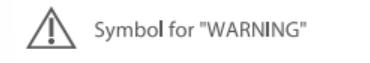
</td>
    <td>

</td>
    <td>
——
</td>
  </tr>
  <tr>
    <td>

</td>
    <td>
If there is insufficient space to place the affirmative statement together with the safety sign on the ME EQUIPMENT, it may be placed in the instructions for use./如果在ME设备上没有足够的空间将肯定性陈述和安全标识安置在一起，可将其放在使用说明书中。
</td>
    <td>
A
</td>
    <td>
检查铭牌及说明书
</td>
    <td>

</td>
    <td>

</td>
    <td>
signs and symbols
</td>
    <td>
——
</td>
  </tr>
  <tr>
    <td>

</td>
    <td>
The colours for safety signs are specified in ISO 3864-1 and it is important to use the specified colour/安全标识的颜色由ISO 3864-1规定，使用规定的颜色是重要的。
</td>
    <td>
NA
</td>
    <td>
——
</td>
    <td>
——
</td>
    <td>
——
</td>
    <td>
——
</td>
    <td>
建议此条不适用，因为1.彩色印刷成本高2.与风险分析暂时无关
</td>
  </tr>
  <tr>
    <td>

</td>
    <td>
A safety GENERAL SAFETY AND PRECAUTIONS should include the appropriate precautions or include instructions on how to reduce the RISK/安全须知应包括恰当的预防措施或如何降低风险的说明。
</td>
    <td>
A
</td>
    <td>
检查说明书是否有警告标识及警告内容
</td>
    <td>
OK
</td>
    <td>

</td>
    <td>

</td>
    <td>
列举几条有警告标识的内容
</td>
  </tr>
  <tr>
    <td>

</td>
    <td>
Safety signs, including any supplementary symbol or text, shall be explained in the instructions for use/安全标识、包括任何辅助符号或文本，均应在使用说明书中予以解释。
</td>
    <td>
A
</td>
    <td>
检查说明书是否有符号解释
</td>
    <td>
OK
</td>
    <td>

</td>
    <td>
signs and symbols
</td>
    <td>
——
</td>
  </tr>
  <tr>
    <td>

</td>
    <td>
如果安全符号附近有补充文本，补充文本应采用预期操作者可接受的语言 。注4：在某些国家，需要不止一种语言。
</td>
    <td>
NA
</td>
    <td>
——
</td>
    <td>
——
</td>
    <td>
——
</td>
    <td>
——
</td>
    <td>
安全符号附近无文本标识
</td>
  </tr>
  <tr>
    <td>
7.6
</td>
    <td>
Symbols/符号
</td>
    <td>
——
</td>
    <td>
——
</td>
    <td>
——
</td>
    <td>
——
</td>
    <td>
——
</td>
    <td>
——
</td>
  </tr>
  <tr>
    <td>
7.6.1
</td>
    <td>
Explanation of symbols/符号的说明
</td>
    <td>
——
</td>
    <td>
——
</td>
    <td>
——
</td>
    <td>
——
</td>
    <td>
——
</td>
    <td>
——
</td>
  </tr>
  <tr>
    <td>

</td>
    <td>
The meanings of the symbols used for marking shall be explained in the instructions for use./用作标记的符号含义应在使用说明书中予以解释。
</td>
    <td>
A
</td>
    <td>
检查说明书是否有符号解释
</td>
    <td>
OK
</td>
    <td>

</td>
    <td>
signs and symbols
</td>
    <td>
——
</td>
  </tr>
  <tr>
    <td>
7.6.2
</td>
    <td>
Symbols from Annex D/附录D的符号
</td>
    <td>
——
</td>
    <td>
——
</td>
    <td>
——
</td>
    <td>
——
</td>
    <td>
——
</td>
    <td>
——
</td>
  </tr>
  <tr>
    <td>

</td>
    <td>
Symbols required by this standard shall conform to the requirements in the referenced IEC or ISO publication./本标准所要求的符号应符合引用的IEC或ISO出版物的要求。
</td>
    <td>
A
</td>
    <td>
检查说明书
</td>
    <td>
OK
</td>
    <td>

</td>
    <td>
说明书中描述均采用摄氏华氏两种标注
</td>
    <td>
——
</td>
  </tr>
  <tr>
    <td>
7.6.3
</td>
    <td>
Symbols for controls and performance用于控制器和性能的符号
</td>
    <td>
——
</td>
    <td>
——
</td>
    <td>
——
</td>
    <td>
——
</td>
    <td>
——
</td>
    <td>
——
</td>
  </tr>
  <tr>
    <td>

</td>
    <td>
Symbols used for controls and performance shall conform to the requirements of the IEC or ISO publication where the symbol is defined, when applicable./用于控制器和性能的符号，适用时，应符合给出其定义的IEC或ISO出版物的要求。
</td>
    <td>
NA
</td>
    <td>
——
</td>
    <td>
——
</td>
    <td>
——
</td>
    <td>
——
</td>
    <td>
无用于控制器和性能的符号
</td>
  </tr>
  <tr>
    <td>
7.8
</td>
    <td>
Indicator lights and controls/指示灯和控制器
</td>
    <td>
——
</td>
    <td>
——
</td>
    <td>
——
</td>
    <td>
——
</td>
    <td>
——
</td>
    <td>
——
</td>
  </tr>
  <tr>
    <td>
7.8.1
</td>
    <td>
Colours of indicator lights/指示灯颜色
</td>
    <td>
——
</td>
    <td>
——
</td>
    <td>
——
</td>
    <td>
——
</td>
    <td>
——
</td>
    <td>
背光、分类灯不算指示灯
</td>
  </tr>
  <tr>
    <td>

</td>
    <td>
Red-Warning – immediate response by the OPERATOR is required/红色指示灯表示警告（要求操作者立即作出反应）
</td>
    <td>
NA
</td>
    <td>
——
</td>
    <td>
——
</td>
    <td>
——
</td>
    <td>
——
</td>
    <td>
——
</td>
  </tr>
  <tr>
    <td>

</td>
    <td>
Yellow-Caution – prompt response by the OPERATOR is required/黄色指示灯表示注意
</td>
    <td>
NA
</td>
    <td>
——
</td>
    <td>
——
</td>
    <td>
——
</td>
    <td>
——
</td>
    <td>
——
</td>
  </tr>
  <tr>
    <td>

</td>
    <td>
Green-Ready for use/绿色指示灯表示可以正常使用
</td>
    <td>
NA
</td>
    <td>
——
</td>
    <td>
——
</td>
    <td>
——
</td>
    <td>
——
</td>
    <td>
——
</td>
  </tr>
  <tr>
    <td>

</td>
    <td>
Any other colour-Meaning other than that of red, yellow or green/其它颜色指示灯
</td>
    <td>
NA
</td>
    <td>
——
</td>
    <td>
——
</td>
    <td>
——
</td>
    <td>
——
</td>
    <td>
——
</td>
  </tr>
  <tr>
    <td>

</td>
    <td>
Dot-matrix and other alphanumeric displays are not considered to be indicator lights./点阵和其他字母—数字显示不作为指示灯考虑 
</td>
    <td>
NA
</td>
    <td>
——
</td>
    <td>
——
</td>
    <td>
——
</td>
    <td>
——
</td>
    <td>
——
</td>
  </tr>
  <tr>
    <td>
7.8.2
</td>
    <td>
Colours of controls/控制器的颜色
</td>
    <td>
——
</td>
    <td>
——
</td>
    <td>
——
</td>
    <td>
——
</td>
    <td>
——
</td>
    <td>
——
</td>
  </tr>
  <tr>
    <td>

</td>
    <td>
The colour red shall be used only for a control by which a function is interrupted in case of emergency./红色应仅用于在紧急情况下中断功能的控制器
</td>
    <td>
NA
</td>
    <td>
——
</td>
    <td>
——
</td>
    <td>
——
</td>
    <td>
——
</td>
    <td>
——
</td>
  </tr>
  <tr>
    <td>
7.9
</td>
    <td>
ACCOMPANYING DOCUMENTS/随机文件
</td>
    <td>
——
</td>
    <td>

</td>
    <td>
——
</td>
    <td>
——
</td>
    <td>
——
</td>
    <td>
——
</td>
  </tr>
  <tr>
    <td>
7.9.1
</td>
    <td>
General/总则
</td>
    <td>
——
</td>
    <td>

</td>
    <td>
——
</td>
    <td>
——
</td>
    <td>
——
</td>
    <td>
——
</td>
  </tr>
  <tr>
    <td>

</td>
    <td>
ME EQUIPMENT shall be accompanied by documents containing at least the instructions for use and a technical description. The ACCOMPANYING DOCUMENTS shall be regarded as a part of the ME EQUIPMENT.The ACCOMPANYING DOCUMENTS shall identify the ME EQUIPMENT by including, as applicable, the following:/ME设备应附有至少包括使用说明书，技术说明书的文件。随机文件被认为是ME设备的一部分。如果适用，随机文件中应包括下述识别ME设备的信息：
</td>
    <td>
——
</td>
    <td>
——
</td>
    <td>
——
</td>
    <td>
——
</td>
    <td>
——
</td>
    <td>
——
</td>
  </tr>
  <tr>
    <td>

</td>
    <td>
– name or trade-name of the MANUFACTURER and contact information to which the RESPONSIBLE ORGANIZATION can refer;/—制造商名称或商标，可供责任组织查阅的制造商联系方式。
</td>
    <td>
A
</td>
    <td>
检查说明书
</td>
    <td>

</td>
    <td>

</td>
    <td>
九安公司名称及地址
</td>
    <td>
出口美国的有分销商客户名称、地址即可，无需九安信息
</td>
  </tr>
  <tr>
    <td>

</td>
    <td>
– MODEL OR TYPE REFERENCE/—型式标记
</td>
    <td>
A
</td>
    <td>
检查说明书中有无型式标记（即产品型号）
</td>
    <td>

</td>
    <td>

</td>
    <td>
说明书<strong>Product Introduction </strong>中最后一项
</td>
    <td>

</td>
  </tr>
  <tr>
    <td>

</td>
    <td>
If the ACCOMPANYING DOCUMENTS are provided electronically, the USABILITY ENGINEERING PROCESS shall include consideration of which information also needs to be provided as hard copy or as markings on the ME EQUIPMENT,/随机文件可以电子版的方式提供，如电子文件方式的光盘。如果随机文件以电子的方式提供，易用性工程中应考虑哪些信息需要以硬拷贝或ME设备上的标记的方式提供。
</td>
    <td>
NA
</td>
    <td>
检查设备标识或易用性工程文档
</td>
    <td>
——
</td>
    <td>
——
</td>
    <td>
——
</td>
    <td>
如有电子版说明书，此项适用
</td>
  </tr>
  <tr>
    <td>

</td>
    <td>
The ACCOMPANYING DOCUMENTS shall specify any special skills, training and knowledge required of the intended OPERATOR or the RESPONSIBLE ORGANIZATION and any restrictions on locations or environments in which the ME EQUIPMENT can be used./随机文件应详细说明对预期的操作者或责任组织要求的专业机技能、培训和知识，以及ME设备使用时在场所或环境等方面的限制。
</td>
    <td>
A
</td>
    <td>
检查说明书
</td>
    <td>

</td>
    <td>

</td>
    <td>
Notice
Maintenance
</td>
    <td>

</td>
  </tr>
  <tr>
    <td>
7.9.2
</td>
    <td>
Instructions for use/使用说明书
</td>
    <td>
——
</td>
    <td>
——
</td>
    <td>
——
</td>
    <td>
——
</td>
    <td>
——
</td>
    <td>
——
</td>
  </tr>
  <tr>
    <td>
7.9.2.1
</td>
    <td>
General/一般要求
</td>
    <td>
——
</td>
    <td>
——
</td>
    <td>
——
</td>
    <td>
——
</td>
    <td>
——
</td>
    <td>
——
</td>
  </tr>
  <tr>
    <td>

</td>
    <td>
The instructions for use shall document: – the use of the ME EQUIPMENT as intended by the MANUFACTURER/使用说明书应包括下列内容： — 制造商对ME设备的预期用途；
</td>
    <td>
A
</td>
    <td>
检查说明书是否有预期用途描述
</td>
    <td>
OK
</td>
    <td>

</td>
    <td>
INTENDED USE
</td>
    <td>
——
</td>
  </tr>
  <tr>
    <td>

</td>
    <td>
– the frequently used functions, and/— 经常使用的功能；
</td>
    <td>
A
</td>
    <td>
检查说明书是否有功能描述
</td>
    <td>
OK
</td>
    <td>

</td>
    <td>
Instruction for use
</td>
    <td>
——
</td>
  </tr>
  <tr>
    <td>

</td>
    <td>
– any known contraindication(s) to the use of the ME EQUIPMENT/— 已知的ME设备使用的任何禁忌症。
</td>
    <td>
A
</td>
    <td>
检查说明书有无禁忌症信息
</td>
    <td>
OK
</td>
    <td>

</td>
    <td>
 CONTRAINDICATION   
It isnot recommended for people whose measuringpart has local lesions,such as inflammation,trauma,postoperative,etc.                
</td>
    <td>
——
</td>
  </tr>
  <tr>
    <td>

</td>
    <td>
– those parts of the ME EQUIPMENT that shall not be serviced or maintained while in use witha PATIENT.– 在患者身体上使用时不能进行维护或服务的ME设备的部件。
</td>
    <td>
NA
</td>
    <td>
——
</td>
    <td>
——
</td>
    <td>
——
</td>
    <td>
——
</td>
    <td>
——
</td>
  </tr>
  <tr>
    <td>

</td>
    <td>
Where the PATIENT is an intended OPERATOR, the instructions for use shall indicate:如果患者是预期的操作者，使用说明应包含：
</td>
    <td>
_
</td>
    <td>
_
</td>
    <td>
_
</td>
    <td>
_
</td>
    <td>
_
</td>
    <td>
——
</td>
  </tr>
  <tr>
    <td>

</td>
    <td>
– the PATIENT is an intended OPERATOR;– 患者是一个预期的操作者
</td>
    <td>
A
</td>
    <td>
检查说明书
</td>
    <td>
OK
</td>
    <td>

</td>
    <td>
NOTICE 18
The patient is an intended operator.
</td>
    <td>
——
</td>
  </tr>
  <tr>
    <td>

</td>
    <td>
– a warning against servicing and MAINTENANCE while the ME EQUIPMENT is in use;– 针对ME设备在使用中进行服务和维护的警告。
</td>
    <td>
NA
</td>
    <td>
——
</td>
    <td>
——
</td>
    <td>
——
</td>
    <td>
——
</td>
    <td>
——
</td>
  </tr>
  <tr>
    <td>

</td>
    <td>
– which functions the PATIENT can safely use and, where applicable, which functions the PATIENT cannot safely use; and– 患者可以安全使用的功能，以及如果适用，患者不能安全使用的功能；
</td>
    <td>
NA
</td>
    <td>
——
</td>
    <td>
——
</td>
    <td>
——
</td>
    <td>
——
</td>
    <td>
——
</td>
  </tr>
  <tr>
    <td>

</td>
    <td>
– which MAINTENANCE the PATIENT can perform (e.g. changing batteries).– 患者可进行的维护（如充电）
</td>
    <td>
A
</td>
    <td>
检查说明书
</td>
    <td>
OK
</td>
    <td>

</td>
    <td>
Care and cleaning
</td>
    <td>
——
</td>
  </tr>
  <tr>
    <td>

</td>
    <td>
The instructions for use shall indicate: – the name or trademark and address of the MANUFACTURER 使用说明应指示： – 制造商的名称或商标，制造商的地址
</td>
    <td>
A
</td>
    <td>
检查说明书
</td>
    <td>
OK
</td>
    <td>

</td>
    <td>
九安公司名称及地址
</td>
    <td>
——
</td>
  </tr>
  <tr>
    <td>

</td>
    <td>
– the MODEL OR TYPE REFERENCE.–型号或型式标记
</td>
    <td>
A
</td>
    <td>
检查说明书
</td>
    <td>
OK
</td>
    <td>

</td>
    <td>
Product Introduction最后 Model: PT9S
</td>
    <td>
——
</td>
  </tr>
  <tr>
    <td>

</td>
    <td>
The instructions for use shall include all applicable classifications specified in Clause 6, all markings specified in 7.2, and the explanation of safety signs and symbols (marked on the ME EQUIPMENT)./使用说明书应包括在第6条中详细说明的所有适合的分类、7.2规定的标记以及（标记在ME设备上的）安全标识和符号的解释。
</td>
    <td>
A
</td>
    <td>
检查7.2是否符合，以及说明书中有无符号解释
</td>
    <td>
OK
</td>
    <td>

</td>
    <td>
见7.2回复和 signs and symbols
</td>
    <td>
——
</td>
  </tr>
  <tr>
    <td>

</td>
    <td>
The instructions for use shall be in a language that is acceptable to the intended OPERATOR/使用说明书使用的语言应该能被预期的操作者所接受。
</td>
    <td>
A
</td>
    <td>
检查说明书
</td>
    <td>
OK
</td>
    <td>

</td>
    <td>
语言为英语
</td>
    <td>
以出口国家为准
</td>
  </tr>
  <tr>
    <td>
7.9.2.2
</td>
    <td>
Warning and safety GENERAL SAFETY AND PRECAUTIONSs/警告和安全通告
</td>
    <td>
——
</td>
    <td>
——
</td>
    <td>
——
</td>
    <td>
——
</td>
    <td>
——
</td>
    <td>
——
</td>
  </tr>
  <tr>
    <td>

</td>
    <td>
The instructions for use shall include all warning and safety GENERAL SAFETY AND PRECAUTIONSs./使用说明书应该包括所有的警告和安全通告。
</td>
    <td>
A
</td>
    <td>
检查说明书中警告/注意标识及其内容，以及GENERAL SAFETY AND PRECAUTIONS
</td>
    <td>
OK
</td>
    <td>

</td>
    <td>
Notice
</td>
    <td>

</td>
  </tr>
  <tr>
    <td>

</td>
    <td>
For CLASS I ME EQUIPMENT, the instructions for use shall include a warning statement to the effect: “WARNING: To avoid the risk of electric shock, this equipment must only be connected to a supply mains with protective earth.”/对于Ⅰ类ME设备，使用说明书应包括警告性陈述“警告：为了避免电击风险，本设备只应与带有保护接地的电网相连接”。
</td>
    <td>
NA
</td>
    <td>
——
</td>
    <td>
——
</td>
    <td>
——
</td>
    <td>
——
</td>
    <td>
非一类设备
</td>
  </tr>
  <tr>
    <td>

</td>
    <td>
The instructions for use shall provide the OPERATOR or RESPONSIBLE ORGANIZATION with warnings regarding any significant RISKS of reciprocal interference posed by the presence of the ME EQUIPMENT during specific investigations or treatments.使用说明书应该向操作者或责任组织提供有关ME设备在具体的检查或治疗期间，由相互干扰所引起的任何重大风险的警告。
</td>
    <td>
A
</td>
    <td>
检查说明书中有无电磁兼容方面内容
</td>
    <td>
OK
</td>
    <td>

</td>
    <td>
Electromagnetic compatibility information 
</td>
    <td>

</td>
  </tr>
  <tr>
    <td>

</td>
    <td>
The instructions for use shall include information regarding potential electromagnetic or other interference between the ME EQUIPMENT and other devices together with advice on ways to avoid or minimize such interference.使用说明书应包括有关ME设备与其他器械之间潜在的电磁干扰或其他干扰的信息，并给出避免或减少该种干扰的建议措施。
</td>
    <td>
A
</td>
    <td>
检查说明书中有无电磁兼容方面内容
</td>
    <td>
OK
</td>
    <td>

</td>
    <td>
Electromagnetic compatibility information 
</td>
    <td>

</td>
  </tr>
  <tr>
    <td>

</td>
    <td>
If the ME EQUIPMENT is provided with an integral MULTIPLE SOCKET-OUTLET, the instructions for use shall provide a warning statement that connecting electrical equipment to the MSO effectively leads to creating an ME SYSTEM and the result can be a reduced level of safety. For the requirements that are applicable to an ME SYSTEM, the RESPONSIBLE ORGANIZATION shall be referred to this standard.如果ME设备配备一个集成的多联插座，使用说明书应有警告性说明：将电气设备连接到多联插座，会有效地导致生成一个ME系统，其结果将会降低安全水平。本要求适用于任何ME系统，责任方应参考本标准。
</td>
    <td>
NA
</td>
    <td>
——
</td>
    <td>
——
</td>
    <td>
——
</td>
    <td>
——
</td>
    <td>
无多联插座
</td>
  </tr>
  <tr>
    <td>
7.9.2.3
</td>
    <td>
ME EQUIPMENT specified for connection to a separate power supply/规定与独立电源连接的ME设备
</td>
    <td>
——
</td>
    <td>
——
</td>
    <td>
——
</td>
    <td>
——
</td>
    <td>
——
</td>
    <td>
——
</td>
  </tr>
  <tr>
    <td>

</td>
    <td>
If ME EQUIPMENT is intended for connection to a separate power supply, either the power supply shall be specified as part of the ME EQUIPMENT or the combination shall be specified as an ME SYSTEM. The instructions for use shall state this specification./如果ME设备预期与独立电源连接，那么该电源应被作为ME设备的一部分，或者该联合应被作为ME系统。
</td>
    <td>
NA
</td>
    <td>
——
</td>
    <td>
——
</td>
    <td>
——
</td>
    <td>
——
</td>
    <td>
无独立电源
</td>
  </tr>
  <tr>
    <td>
7.9.2.4
</td>
    <td>
Electrical power source/电源
</td>
    <td>
——
</td>
    <td>
——
</td>
    <td>
——
</td>
    <td>
——
</td>
    <td>
——
</td>
    <td>
——
</td>
  </tr>
  <tr>
    <td>

</td>
    <td>
For mains-operated ME EQUIPMENT with an additional power source not automatically maintained in a fully usable condition, the instructions for use shall include a warning statement referring to the necessity for periodic checking or replacement of such an additional power source/对由电网供电并带有附加电源的ME设备，若其附加电源不能自动地保持在完全可用的状态，使用说明书应提出警告，规定应对该附加电源进行定期检查和更换。
</td>
    <td>
NA
</td>
    <td>
——
</td>
    <td>
——
</td>
    <td>
——
</td>
    <td>
—— 
</td>
    <td>
无附加电源
</td>
  </tr>
  <tr>
    <td>

</td>
    <td>
If leakage from a battery would result in an unacceptable RISK, the instructions for use shallinclude a warning to remove the battery if the ME EQUIPMENT is not likely to be used for sometime./如果电池的漏液会导致不可接受的风险，使用说明书中应有警告性说明：若在一段时间内可能不使用ME设备时，应取出这些电池。
</td>
    <td>
A
</td>
    <td>
检查说明书
</td>
    <td>
OK
</td>
    <td>

</td>
    <td>
Remove the batteries if the device will not be used more than one month.
</td>
    <td>
——
</td>
  </tr>
  <tr>
    <td>

</td>
    <td>
If an INTERNAL ELECTRICAL POWER SOURCE is replaceable, the instructions for use shall state its specification./如果内部电源是可更换的，使用说明书应陈述其规格。
</td>
    <td>
A
</td>
    <td>
检查说明书是否有此描述
</td>
    <td>
OK
</td>
    <td>

</td>
    <td>
<strong>Product performance </strong>3.  
</td>
    <td>
必须要有直流符号
</td>
  </tr>
  <tr>
    <td>

</td>
    <td>
If loss of the power source would result in an unacceptable RISK, the instructions for use shall contain a warning that the ME EQUIPMENT must be connected to an appropriate power source./如果电源的损失会导致不可接受的风险，使用说明书应包括警告，要求ME设备必须连接到适合的电源上使用。
</td>
    <td>
NA
</td>
    <td>
——
</td>
    <td>
——
</td>
    <td>
——
</td>
    <td>
——
</td>
    <td>
——
</td>
  </tr>
  <tr>
    <td>
7.9.2.5
</td>
    <td>
ME EQUIPMENT description/ME设备描述
</td>
    <td>
——
</td>
    <td>
——
</td>
    <td>
——
</td>
    <td>
——
</td>
    <td>
——
</td>
    <td>
——
</td>
  </tr>
  <tr>
    <td>

</td>
    <td>
The instructions for use shall include: – a brief description of the ME EQUIPMENT; – how the ME EQUIPMENT functions; and – the significant physical and performance characteristics of the ME EQUIPMENT. If applicable, this description shall include the expected positions of the OPERATOR, PATIENT and other persons near the ME EQUIPMENT in NORMAL USE (see 9.2.2.3)./使用说明书应包括： — ME设备简要的描述； — ME设备的功能；和 — ME设备重要的物理和性能参数。 如果适用，应包括ME设备在正常使用时操作者、患者和靠近ME设备的其他人员的预期位置的描述。
</td>
    <td>
A
</td>
    <td>
检查说明书是否有此描述
</td>
    <td>
OK
</td>
    <td>

</td>
    <td>
Product performance
Instruction for use
</td>
    <td>
——
</td>
  </tr>
  <tr>
    <td>

</td>
    <td>
The instructions for use shall indicate any APPLIED PART./使用说明书应指示出任何一个应用部分。
</td>
    <td>
A
</td>
    <td>
检查说明书
</td>
    <td>
OK
</td>
    <td>

</td>
    <td>
Notice
22.The probe belongs to theapplied part
</td>
    <td>
——
</td>
  </tr>
  <tr>
    <td>
7.9.2.6
</td>
    <td>
Installation/安装
</td>
    <td>
——
</td>
    <td>
——
</td>
    <td>
——
</td>
    <td>
——
</td>
    <td>
——
</td>
    <td>
——
</td>
  </tr>
  <tr>
    <td>

</td>
    <td>
If installation of the ME EQUIPMENT or its parts is required, the instructions for use shall contain: – a reference to where the installation instructions are to be found (e.g. the technical description), or – contact information for persons designated by the MANUFACTURER as qualified to perform the installation./如果需要对ME设备或其部件进行安装，使用说明书应包括： — 可找到安装说明的参考资料（例如技术说明书）；或 — 与制造商指定的有资格执行安装的人员进行联系的信息。
</td>
    <td>
NA
</td>
    <td>
——
</td>
    <td>
——
</td>
    <td>
——
</td>
    <td>
——
</td>
    <td>
无需安装
</td>
  </tr>
  <tr>
    <td>
7.9.2.7
</td>
    <td>
Isolation from the SUPPLY MAINS/与供电网的分断
</td>
    <td>
——
</td>
    <td>
——
</td>
    <td>
——
</td>
    <td>
——
</td>
    <td>
——
</td>
    <td>
——
</td>
  </tr>
  <tr>
    <td>

</td>
    <td>
If an APPLIANCE COUPLER or MAINS PLUG or other separable plug is used as the isolation means to satisfy 8.11.1 a),the instructions for use shall contain an instruction not to position the ME EQUIPMENT so that it is difficult to operate the disconnection device./如果使用设备连接装置或网电源插头或可分离式插头来作为分断方法以满足8.11.1a)要求，则使用说明书中应包括以下说明：不要将ME设备安置在 难以操作断开装置的位置。
</td>
    <td>
NA
</td>
    <td>
——
</td>
    <td>
——
</td>
    <td>
——
</td>
    <td>
——
</td>
    <td>
——
</td>
  </tr>
  <tr>
    <td>
7.9.2.8
</td>
    <td>
Start-up PROCEDURE/启动程序
</td>
    <td>
——
</td>
    <td>
——
</td>
    <td>
——
</td>
    <td>
——
</td>
    <td>
——
</td>
    <td>
——
</td>
  </tr>
  <tr>
    <td>

</td>
    <td>
The instructions for use shall contain the necessary information for the OPERATOR to bring the ME EQUIPMENT into operation including such items as any initial control settings, connection to or positioning of the PATIENT, etc.The instructions for use shall detail any treatment or handling needed before the ME EQUIPMENT, its parts, or ACCESSORIES can be used.使用说明书应包括操作者启动运转ME设备的必要的信息，包括诸如任何初始控制的设置、患者的连接和定位等事项。 使用说明书应详细说明，在ME设备、其部件或附件可被使用之前必需的处理或操作。
</td>
    <td>
A
</td>
    <td>
检查说明书
</td>
    <td>
OK
</td>
    <td>

</td>
    <td>
 Instruction for use
</td>
    <td>
——
</td>
  </tr>
  <tr>
    <td>
7.9.2.9
</td>
    <td>
Operating instructions/操作说明
</td>
    <td>
——
</td>
    <td>
——
</td>
    <td>
——
</td>
    <td>
——
</td>
    <td>
——
</td>
    <td>
——
</td>
  </tr>
  <tr>
    <td>

</td>
    <td>
The instructions for use shall contain all information necessary to operate the ME EQUIPMENT in accordance with its specification. This shall include explanation of the functions of controls,displays and signals, the sequence of operation, and connection and disconnection of detachable parts and ACCESSORIES, and replacement of material that is consumed during operation./使用说明书应该包括对按照其技术条件运行ME设备的所有必要信息。应包括如控制器、显示器和信号的功能说明，操作顺序、可拆卸部件和附件的连接和拆卸方法以及使用过程中消耗材料的更换方法。
</td>
    <td>
A
</td>
    <td>
检查说明书
</td>
    <td>
OK
</td>
    <td>

</td>
    <td>
Instruction for use
</td>
    <td>
——
</td>
  </tr>
  <tr>
    <td>

</td>
    <td>
The meanings of figures, symbols, warning statements, abbreviations and indicator lights on ME EQUIPMENT shall be explained in the instructions for use./ME设备上的图形、符号、警告性声明，缩写和指示灯的含义，应在使用说明书中予以说明。
</td>
    <td>
A
</td>
    <td>
检查说明书
</td>
    <td>
OK
</td>
    <td>

</td>
    <td>
CONTENTS AND DISPLAY INDICATORS
 signs and symbols
</td>
    <td>
——
</td>
  </tr>
  <tr>
    <td>
7.9.2.10
</td>
    <td>
Messages/信息
</td>
    <td>
——
</td>
    <td>
——
</td>
    <td>
——
</td>
    <td>
——
</td>
    <td>
——
</td>
    <td>
——
</td>
  </tr>
  <tr>
    <td>

</td>
    <td>
The instructions for use shall list all system messages, error messages and fault messages that are generated, unless these messages are self-explanatory.                               The list shall include an explanation of messages including important causes, and possible action(s) by the OPERATOR, if any, that are necessary to resolve the situation indicated by the message./使用说明书应列出生成的所有系统信息、错误信息和故障信息。除非这些信息是不言自明的。 所列举的信息清单应包括重要起因的解释，并且如有信息指示需要解决的情况，操作者可能的行动。
</td>
    <td>
A
</td>
    <td>
检查说明书
</td>
    <td>
OK
</td>
    <td>

</td>
    <td>
Product errors and troubleshooting
</td>
    <td>
——
</td>
  </tr>
  <tr>
    <td>
7.9.2.11
</td>
    <td>
Shutdown PROCEDURE/关机程序
</td>
    <td>
——
</td>
    <td>
——
</td>
    <td>
——
</td>
    <td>
——
</td>
    <td>
——
</td>
    <td>
——
</td>
  </tr>
  <tr>
    <td>

</td>
    <td>
The instructions for use shall contain the necessary information for the OPERATOR to safely terminate the operation of the ME EQUIPMENT./使用说明书应包含用于操作者安全终止ME设备运行的必要的信息。
</td>
    <td>
A
</td>
    <td>
检查说明书有无此信息
</td>
    <td>

</td>
    <td>

</td>
    <td>
_x001F_If no more measuring is required, simply let the device sit idle for 8 seconds to power off_x001F_ automatically.
</td>
    <td>
——
</td>
  </tr>
  <tr>
    <td>
7.9.2.12
</td>
    <td>
Cleaning, disinfection and sterilization/清洗、消毒和灭菌
</td>
    <td>
——
</td>
    <td>
——
</td>
    <td>
——
</td>
    <td>
——
</td>
    <td>
——
</td>
    <td>
——
</td>
  </tr>
  <tr>
    <td>

</td>
    <td>
For ME EQUIPMENT parts or ACCESSORIES that can become contaminated through contact with the PATIENT or with body fluids or expired gases during NORMAL USE, the instructions for use shall contain: – details about cleaning and disinfection or sterilization methods that may be used; and – list the applicable parameters such as temperature, pressure, humidity, time limits and number of cycles that such ME EQUIPMENT parts or ACCESSORIES can tolerate./在正常使用期间与患者、体液或者呼气相接触的有可能被污染的ME设备部件或其附件，使用说明书应包括： — 可使用的清洗、消毒或灭菌方法的详细说明； — 列出该ME设备部件或其附件所能承受的适当的参数，如温度、压力、湿度、时间限制和运行循环次数。
</td>
    <td>
A
</td>
    <td>
检查说明书
</td>
    <td>
OK
</td>
    <td>

</td>
    <td>
Care and cleaning
</td>
    <td>
——
</td>
  </tr>
  <tr>
    <td>

</td>
    <td>
This requirement does not apply to any material, component, ACCESSORY or ME EQUIPMENT that is marked as intended for a single use unless the MANUFACTURER specifies that the material, component, ACCESSORY or ME EQUIPMENT is to be cleaned, disinfected or sterilized before use/该要求不适用于标记有“一次性使用”的任何材料、元件、附件或ME设备，除非制造商规定在使用这些材料、元件、附件或ME设备之前应进行清洗、消毒和灭菌
</td>
    <td>
NA
</td>
    <td>
——
</td>
    <td>
——
</td>
    <td>
——
</td>
    <td>
——
</td>
    <td>
——
</td>
  </tr>
  <tr>
    <td>
7.9.2.13
</td>
    <td>
MAINTENANCE/维护
</td>
    <td>
——
</td>
    <td>
——
</td>
    <td>
——
</td>
    <td>
——
</td>
    <td>
——
</td>
    <td>
——
</td>
  </tr>
  <tr>
    <td>

</td>
    <td>
The instructions for use shall instruct the OPERATOR or RESPONSIBLE ORGANIZATION in sufficient detail concerning preventive inspection, MAINTENANCE and calibration to be performed by them, including the frequency of such MAINTENANCE./使用说明书必须向操作者或服务人员详细说明由他们自己来进行的预防性检查保养和校验，以及保养的周期。
</td>
    <td>
A
</td>
    <td>
检查说明书有无使用者自己预防性检查保养和校验，以及保养的周期。
</td>
    <td>
OK
</td>
    <td>

</td>
    <td>
Care and cleaning
</td>
    <td>
——
</td>
  </tr>
  <tr>
    <td>

</td>
    <td>
The instructions for use shall provide information for the safe performance of such routine MAINTENANCE necessary to ensure the continued safe use of the ME EQUIPMENT./这类说明书必须提供安全地执行常规保养的资料以确保ME设备的继续安全使用。
</td>
    <td>
A
</td>
    <td>
检查说明书
</td>
    <td>
OK
</td>
    <td>

</td>
    <td>
Care and cleaning
</td>
    <td>
——
</td>
  </tr>
  <tr>
    <td>

</td>
    <td>
Additionally, the instructions for use shall identify the parts on which preventive inspection
and MAINTENANCE shall be performed by SERVICE PERSONNEL, including the periods to be
applied, but not necessarily including details about the actual performance of such
MAINTENANCE./此外，使用说明书还必须提出哪些部件必须由服务人员进行预防性检查和保养，以及适用的周期，但不必包括执行这种保养的具体细节。
</td>
    <td>
A
</td>
    <td>
检查说明书
</td>
    <td>
OK
</td>
    <td>

</td>
    <td>
Care and cleaning
</td>
    <td>
——
</td>
  </tr>
  <tr>
    <td>

</td>
    <td>
For ME EQUIPMENT containing rechargeable batteries that are intended to be maintained by
anyone other than SERVICE PERSONNEL, the instructions for use shall contain instructions to ensure adequate MAINTENANCE./对于配有预期由非服务人员维护的可充电电池的ME设备，使用说明书应包含相关说明，以确保其充分的维护。
</td>
    <td>
NA
</td>
    <td>
——
</td>
    <td>
——
</td>
    <td>
——
</td>
    <td>
——
</td>
    <td>
锂电池适用
</td>
  </tr>
  <tr>
    <td>
7.9.2.14
</td>
    <td>
ACCESSORIES, supplementary equipment, used material/附件、辅助设备、使用的材料
</td>
    <td>
——
</td>
    <td>
——
</td>
    <td>
——
</td>
    <td>
——
</td>
    <td>
——
</td>
    <td>
——
</td>
  </tr>
  <tr>
    <td>

</td>
    <td>
The instructions for use shall include a list of ACCESSORIES, detachable parts and materials that the MANUFACTURER has determined are intended for use with the ME EQUIPMENT./使用说明书中应包括制造商规定的、预期与ME设备一起使用的附件、可拆卸部件和材料的清单。
</td>
    <td>
A
</td>
    <td>
检查说明书
</td>
    <td>
OK
</td>
    <td>

</td>
    <td>
BOX CONTENTS 
</td>
    <td>
——
</td>
  </tr>
  <tr>
    <td>

</td>
    <td>
If ME EQUIPMENT is intended to receive its power from other equipment in an ME SYSTEM, the instructions for use shall sufficiently specify such other equipment to ensure compliance with the requirements of this standard (e.g. part number, RATED voltage, maximum or minimum power, protection class, intermittent or continuous service)./如果ME设备预期从一个ME系统中的其他设备获得电源，使用说明书应对该类设备做出充分的说明，以确保符合本标准的要求（如部件编号、额定电压、最大或最小功率、保护分类、间歇或连续服务等）。备注：在本标准第一版和第二版中所指的“指定电源”可认为是相同ME设备的另一部分或一 个ME系统中的其他设备。同理，一个电池充电器可认为是ME设备的一个部分或ME系统中的其 他设备。
</td>
    <td>
NA
</td>
    <td>
——
</td>
    <td>
——
</td>
    <td>
——
</td>
    <td>
——
</td>
    <td>
——
</td>
  </tr>
  <tr>
    <td>
7.9.2.15
</td>
    <td>
Environmental protection/环境保护
</td>
    <td>
——
</td>
    <td>
——
</td>
    <td>
——
</td>
    <td>
——
</td>
    <td>
——
</td>
    <td>
——
</td>
  </tr>
  <tr>
    <td>

</td>
    <td>
The instructions for use shall provide advice on the proper disposal of waste products, residues, etc. and of the ME EQUIPMENT and ACCESSORIES at the end of their EXPECTED SERVICE LIFE./使用说明应提供正确处理废弃物，残渣等以及在预期寿命末期的ME设备和 附件方面的建议。
</td>
    <td>
A
</td>
    <td>
检查说明书有无垃圾筒标识
</td>
    <td>
OK
</td>
    <td>

</td>
    <td>
Symbol for “ENVIRONMENT PROTECTION –Waste electrical products should not be disposed of with household waste. Please recycle where facilities exist. Check with your local Authority or retailer for recycling advice”.
</td>
    <td>
——
</td>
  </tr>
  <tr>
    <td>
7.9.2.16
</td>
    <td>
Reference to the technical description/引用技术说明书
</td>
    <td>
——
</td>
    <td>
——
</td>
    <td>
——
</td>
    <td>
——
</td>
    <td>
——
</td>
    <td>
——
</td>
  </tr>
  <tr>
    <td>

</td>
    <td>
The instructions for use shall contain the information specified in 7.9.3 or a reference to where the material specified in 7.9.3 is to be found (e.g. in a service manual)./使用说明书应包含7.9.3中规定的信息或引用可得到7.9.3中规定材料的文件（如在服务手册中）。
</td>
    <td>
A
</td>
    <td>
检查7.9.3是否符合，若都符合则OK,若有其中一条不符合则Fail
</td>
    <td>
OK
</td>
    <td>

</td>
    <td>

</td>
    <td>
见7.9.3回复
</td>
  </tr>
  <tr>
    <td>
7.9.2.19
</td>
    <td>
Unique version identifier唯一的版本识别号
</td>
    <td>
——
</td>
    <td>
——
</td>
    <td>
——
</td>
    <td>
——
</td>
    <td>
——
</td>
    <td>
——
</td>
  </tr>
  <tr>
    <td>

</td>
    <td>
The instructions for use shall contain a unique version identifier such as its date of issue.使用说明应包含一个唯一的版本号，如发布日期。
例 月和年
</td>
    <td>
A
</td>
    <td>
检查说明书
</td>
    <td>
OK
</td>
    <td>

</td>
    <td>
说明书最后一页
</td>
    <td>
——
</td>
  </tr>
  <tr>
    <td>
7.9.3
</td>
    <td>
Technical description/技术说明书
</td>
    <td>
——
</td>
    <td>
——
</td>
    <td>
——
</td>
    <td>
——
</td>
    <td>
——
</td>
    <td>
——
</td>
  </tr>
  <tr>
    <td>
7.9.3.1
</td>
    <td>
General/概述
</td>
    <td>
——
</td>
    <td>
——
</td>
    <td>
——
</td>
    <td>
——
</td>
    <td>
——
</td>
    <td>
——
</td>
  </tr>
  <tr>
    <td>

</td>
    <td>
The technical description shall provide all data that is essential for safe operation, transport and storage, and measures or conditions necessary for installing the ME EQUIPMENT, and preparing it for use. This shall include:/技术说明书应提供为安全运行、运输和贮存所必要的所有数据，以及安装ME设备所必须的方法和条件，为其使用做准备。应包括：
</td>
    <td>
——
</td>
    <td>
——
</td>
    <td>
——
</td>
    <td>
——
</td>
    <td>
——
</td>
    <td>
——
</td>
  </tr>
  <tr>
    <td>

</td>
    <td>
the information required in 7.2;/— 7.2的要求的信息；
</td>
    <td>
A
</td>
    <td>
检查7.2是否符合
</td>
    <td>
OK
</td>
    <td>

</td>
    <td>
详见7.2条款说明
</td>
    <td>
——
</td>
  </tr>
  <tr>
    <td>

</td>
    <td>
– the permissible environmental conditions of use including conditions for transport and storage. See also 7.2.17;/— 允许的使用环境条件，包括运输和贮存条件；
</td>
    <td>
A
</td>
    <td>
检查说明书有无工作、运输、储存条件
</td>
    <td>
OK
</td>
    <td>

</td>
    <td>
 Product performance 9、10
</td>
    <td>
——
</td>
  </tr>
  <tr>
    <td>

</td>
    <td>
– all characteristics of the ME EQUIPMENT, including range(s), accuracy, and precision of the displayed values or an indication where they can be found;/— ME设备的所有特性，包括范围、准确度和显示数值的精度，或在何处可获到这些数据；
</td>
    <td>
A
</td>
    <td>
检查说明书有无此信息
</td>
    <td>
OK
</td>
    <td>

</td>
    <td>
 Product performance 5、6、8
</td>
    <td>
——
</td>
  </tr>
  <tr>
    <td>

</td>
    <td>
– a description of the means of isolating the ME EQUIPMENT from the SUPPLY MAINS, if such means is not incorporated in the ME EQUIPMENT (see 8.11.1 b));/— ME 设备与供电网隔离措施的说明，若该措施与ME 设备不是一体的[见8.11.1 b）]
</td>
    <td>
NA
</td>
    <td>
——
</td>
    <td>
——
</td>
    <td>
——
</td>
    <td>
——
</td>
    <td>
——
</td>
  </tr>
  <tr>
    <td>

</td>
    <td>
– a warning statement that addresses the HAZARDS that can result from unauthorized modification of the ME EQUIPMENT, e.g. a statement to the effect:/— 警告性声明中要提出未经授权的改装ME 设备可能导致危险，例如：有效的声明：
</td>
    <td>
——
</td>
    <td>
——
</td>
    <td>
——
</td>
    <td>
——
</td>
    <td>
——
</td>
    <td>
——
</td>
  </tr>
  <tr>
    <td>

</td>
    <td>
• “WARNING: No modification of this equipment is allowed.”/警告：不允许对该设备进行修改；
</td>
    <td>
A
</td>
    <td>
检查说明书有无此警告
</td>
    <td>
OK
</td>
    <td>

</td>
    <td>
1.This company has not authorized any agency or individual to carry out product repairs or maintenance. Do not attempt to disassemble or modify the thermometer if you suspect functional issues with the device.
</td>
    <td>
——
</td>
  </tr>
  <tr>
    <td>

</td>
    <td>
• “WARNING: Do not modify this equipment without authorization of the manufacturer.”/警告：未经制造商允许，不得对该设备进行修改；
</td>
    <td>
NA
</td>
    <td>
——
</td>
    <td>
——
</td>
    <td>
——
</td>
    <td>
——
</td>
    <td>
——
</td>
  </tr>
  <tr>
    <td>

</td>
    <td>
• “WARNING: If this equipment is modified, appropriate inspection and testing must be conducted to ensure continued safe use of the equipment.”/警告：如果设备被修改，必须进行相应的检查和试验以确保设备可继续安全使用。
</td>
    <td>
NA
</td>
    <td>
——
</td>
    <td>
——
</td>
    <td>
——
</td>
    <td>
——
</td>
    <td>
——
</td>
  </tr>
  <tr>
    <td>

</td>
    <td>
information pertaining to ESSENTIAL PERFORMANCE and any necessary recurrent ESSENTIAL PERFORMANCE and BASIC SAFETY testing including details of the means, methods and recommended frequency.——基本性能，及任何需要周期性对基本性能和基本安全进行测试的相关信息，包括措施，方法及建议频率
</td>
    <td>
NA
</td>
    <td>
——
</td>
    <td>
——
</td>
    <td>
——
</td>
    <td>
——
</td>
    <td>
——
</td>
  </tr>
  <tr>
    <td>

</td>
    <td>
If the technical description is separable from the instructions for use, it shall contain:/如果技术说明书与使用说明书是分开的，那么它应该包括：
</td>
    <td>
NA
</td>
    <td>
——
</td>
    <td>
——
</td>
    <td>
——
</td>
    <td>
——
</td>
    <td>
我们技术说明书与使用说明书合在一起
</td>
  </tr>
  <tr>
    <td>

</td>
    <td>
– the information required in 7.2— 7.2要求的信息；
</td>
    <td>
NA
</td>
    <td>
——
</td>
    <td>
——
</td>
    <td>
——
</td>
    <td>
——
</td>
    <td>

</td>
  </tr>
  <tr>
    <td>

</td>
    <td>
— 第6章规定的所有适用的分类，警告和安全通告以及（标记在ME设备 上的）安全标记的解释；
</td>
    <td>
NA
</td>
    <td>
——
</td>
    <td>
——
</td>
    <td>
——
</td>
    <td>
——
</td>
    <td>

</td>
  </tr>
  <tr>
    <td>

</td>
    <td>
— ME设备的简介，ME设备的功能及其重要物理和性能参数。
</td>
    <td>
NA
</td>
    <td>
——
</td>
    <td>
——
</td>
    <td>
——
</td>
    <td>
——
</td>
    <td>

</td>
  </tr>
  <tr>
    <td>

</td>
    <td>
– 唯一的版本识别号如发布日期。 注3 技术说明预期供责任组织和服务人员使用。
</td>
    <td>
NA
</td>
    <td>
——
</td>
    <td>
——
</td>
    <td>
——
</td>
    <td>
——
</td>
    <td>

</td>
  </tr>
  <tr>
    <td>

</td>
    <td>
The MANUFACTURER may designate the minimum qualifications for SERVICE PERSONNEL. If present, these requirements shall be documented in the technical description./制造商可以规定服务人员的最低条件，如果作出了规定，这些要求应在技术说明书中形成文件。
</td>
    <td>
NA
</td>
    <td>
——
</td>
    <td>
——
</td>
    <td>
——
</td>
    <td>
——
</td>
    <td>
无需做规定，服务人员为公司指定人员
</td>
  </tr>
  <tr>
    <td>
7.9.3.2
</td>
    <td>
Replacement of fuses, POWER SUPPLY CORDS and other parts/熔断器、电源软电线和其他部件的更换
</td>
    <td>
——
</td>
    <td>
——
</td>
    <td>
——
</td>
    <td>
——
</td>
    <td>
——
</td>
    <td>
——
</td>
  </tr>
  <tr>
    <td>

</td>
    <td>
The technical description shall contain, as applicable, the following: 60601-1  IEC:2005+A1:2012(E) – 75 – – the required type and full rating of fuses used in the SUPPLY MAINS external to PERMANENTLY INSTALLED ME EQUIPMENT, if the type and rating of these fuses are not apparent from the information concerning RATED current and mode of operation of ME EQUIPMENT如果适用，技术说明书应包括下列信息： — 若不能根据ME 设备的额定电流和运行模式来决定熔断器型号和标称值时，对于永久性安装ME设备外部供电网中使用的熔断器型号和全部标称值
</td>
    <td>
NA
</td>
    <td>
——
</td>
    <td>
——
</td>
    <td>
——
</td>
    <td>
——
</td>
    <td>
——
</td>
  </tr>
  <tr>
    <td>

</td>
    <td>
– for ME EQUIPMENT having a non-DETACHABLE POWER SUPPLY CORD, a statement as to whether the POWER SUPPLY CORD is replaceable by SERVICE PERSONNEL, and if so,instructions for correct connection and anchoring to ensure that the requirements of 8.11.3 will continue to be met;— 对采用不可拆卸的电源软电线的ME设备，应说明电源软电线是否可由服务人员更换，如果可以，应有正确连接和固定的说明，以确保符合8.11.3的要求；
</td>
    <td>
NA
</td>
    <td>
——
</td>
    <td>
——
</td>
    <td>
——
</td>
    <td>
——
</td>
    <td>
——
</td>
  </tr>
  <tr>
    <td>

</td>
    <td>
instructions for correct replacement of interchangeable or detachable parts that the MANUFACTURER specifies as replaceable by SERVICE PERSONNEL; and/— 制造商指定由服务人员更换的可互换或可拆卸部件的正确更换的说明；
</td>
    <td>
NA
</td>
    <td>
——
</td>
    <td>
——
</td>
    <td>
——
</td>
    <td>
——
</td>
    <td>
——
</td>
  </tr>
  <tr>
    <td>

</td>
    <td>
where replacement of a component could result in an unacceptable RISK, appropriate warnings that identify the nature of the HAZARD and, if the MANUFACTURER specifies the component as replaceable by SERVICE PERSONNEL, all information necessary to safely replace the component./— 当某元件的更换会导致不可接受的风险，该元件处应有识别危害性质的相应警告，如果制造商规定该元件由服务人员更换，应给出安全更换该元件需要的全部信息。
</td>
    <td>
NA
</td>
    <td>
——
</td>
    <td>
——
</td>
    <td>
——
</td>
    <td>
——
</td>
    <td>
因为我们要求必须由厂家来维修
</td>
  </tr>
  <tr>
    <td>
7.9.3.3
</td>
    <td>
Circuit diagrams, component part lists, etc./电路图、元器件清单等
</td>
    <td>
——
</td>
    <td>
——
</td>
    <td>
——
</td>
    <td>
——
</td>
    <td>
——
</td>
    <td>
——
</td>
  </tr>
  <tr>
    <td>

</td>
    <td>
The technical description shall contain a statement that the MANUFACTURER will make available on request circuit diagrams, component part lists, descriptions, calibration instructions, or other information that will assist SERVICE PERSONNEL to repair those parts of ME EQUIPMENT that are designated by the MANUFACTURER as repairable by SERVICE PERSONNEL./技术说明书中应包含制造商声明可按要求提供电路图、元器件清单、图注、校正细则，或其它有助于服务人员维修那些由制造商指定可由服务人员维修的ME设备部件所必需的资料。
</td>
    <td>
NA
</td>
    <td>
——
</td>
    <td>
——
</td>
    <td>
——
</td>
    <td>
——
</td>
    <td>
维修由公司服务人员进行，不支持用户自行维修
</td>
  </tr>
  <tr>
    <td>
7.9.3.4
</td>
    <td>
Mains isolation/电网分断
</td>
    <td>
——
</td>
    <td>
——
</td>
    <td>
——
</td>
    <td>
——
</td>
    <td>
——
</td>
    <td>
——
</td>
  </tr>
  <tr>
    <td>

</td>
    <td>
The technical description shall clearly identify any means used to comply with the requirements of 8.11.1./技术说明书应清楚地说明依据8.11.1要求使用的任何方法。
</td>
    <td>
NA
</td>
    <td>
——
</td>
    <td>
——
</td>
    <td>
——
</td>
    <td>
——
</td>
    <td>
含适配器适用
</td>
  </tr>
</table>

<table>
  <tr>
    <th colspan="8">
标签检查报告（IEC 60601-1-2）
</th>
  </tr>
  <tr>
    <td colspan="8">
拟制:                        年  月  日 审核:                         年  月  日  
</td>
  </tr>
  <tr>
    <td colspan="8">
产品型号：  PT9L                  项目编号： 2024-002-WX02                     产品/项目名称：红外体温计
</td>
  </tr>
  <tr>
    <td colspan="8">
<strong>IEC 60601-1-2 Medical electrical equipment - Part 1-2:</strong><strong>General requirements for safety - Collateral standard: Electromagnetic compatibility - Requirements and tests</strong><strong> </strong>医用电气设备<strong> </strong>第<strong>1-2</strong>部分：医用电气设备一般安全要求—附带标准：电磁兼容性—要求和试验
</td>
  </tr>
  <tr>
    <td rowspan="2">
<strong>Clause NO. </strong>条款号
</td>
    <td rowspan="2">
<strong>Description, Requirement/</strong>描述或要求
</td>
    <td>
<strong>Applicable</strong>适用性
</td>
    <td rowspan="2">
<strong>Verification method </strong>验证方法
</td>
    <td colspan="2">
<strong>Compliance/</strong>符合性
</td>
    <td rowspan="2">
<strong>Verification annal </strong>验证记录
</td>
    <td rowspan="2">
<strong>Comments/</strong>备注
</td>
  </tr>
  <tr>
    <td>
A
</td>
    <td>
OK
</td>
    <td>
Fail
</td>
  </tr>
  <tr>
    <td>
5
</td>
    <td>
ME EQUIPMENT and ME SYSTEMS identification, marking and documents
</td>
    <td>
——
</td>
    <td>
——
</td>
    <td>

</td>
    <td>

</td>
    <td>
——
</td>
    <td>
——
</td>
  </tr>
  <tr>
    <td>
5.1
</td>
    <td>
Additional requirements for marking on the outside of ME EQUIPMENT and
ME SYSTEMS that are specified for use only in a shielded location SPECIAL
ENVIRONMENT
</td>
    <td>
——
</td>
    <td>
——
</td>
    <td>
——
</td>
    <td>
——
</td>
    <td>
——
</td>
    <td>
——
</td>
  </tr>
  <tr>
    <td>

</td>
    <td>
In addition to the requirements of 7.2 of the general standard, ME EQUIPMENT and ME SYSTEMS specified for use only in a shielded location SPECIAL ENVIRONMENT shall be labelled with a CLEARLY LEGIBLE warning that they should be used only in the specified type of shielded location.作为对IEC 60601-1 中7.2的补充，仅用于屏蔽场所的ME设备或ME系统，应清楚标识：只能用于指定类型的屏蔽场所。
</td>
    <td>
N/A
</td>
    <td>
——
</td>
    <td>
——
</td>
    <td>
——
</td>
    <td>
——
</td>
    <td>
——
</td>
  </tr>
  <tr>
    <td>
5.2
</td>
    <td>
A<strong>CCOMPANYING DOCUMENTS</strong>
</td>
    <td>
——
</td>
    <td>
——
</td>
    <td>
——
</td>
    <td>
——
</td>
    <td>
——
</td>
    <td>
——
</td>
  </tr>
  <tr>
    <td>
5.2.1
</td>
    <td>
Instructions for use
</td>
    <td>
——
</td>
    <td>
——
</td>
    <td>
——
</td>
    <td>
——
</td>
    <td>
——
</td>
    <td>
——
</td>
  </tr>
  <tr>
    <td>
5.2.1.1
</td>
    <td>
General
</td>
    <td>
——
</td>
    <td>
——
</td>
    <td>
——
</td>
    <td>
——
</td>
    <td>
——
</td>
    <td>
——
</td>
  </tr>
  <tr>
    <td>

</td>
    <td>
In addition to the requirements of 7.9.2 of the general standard, the instructions for use shall include the following:作为对IEC 60601-1中7.9.2的补充，使用说明中应包含如下内容：
</td>
    <td>
——
</td>
    <td>
——
</td>
    <td>
——
</td>
    <td>
——
</td>
    <td>
——
</td>
    <td>
——
</td>
  </tr>
  <tr>
    <td>

</td>
    <td>
a statement of the environments for which the ME EQUIPMENT or ME SYSTEM is suitable. Relevant exclusions, as determined by RISK ANALYSIS, shall also be listed, e.g. hospitals except for near active HF SURGICAL EQUIPMENT and the RF shielded room of an ME SYSTEM for magnetic resonance imaging, where the intensity of EM DISTURBANCES is high.a)对ME设备或ME系统适用的环境说明，应罗列通过风险分析确定的不能使用的环境，如：除了靠近有源高频手术设备的医院和用于核磁共振成像的具有高电磁干扰强度的RF屏蔽室。
</td>
    <td>
A
</td>
    <td>
检查说明书
</td>
    <td>
OK
</td>
    <td>

</td>
    <td>
<strong>Notice</strong> 13. Do not measure body temperature in an environment with strong EM interference (examples include places close to a working microwave, induction cooker, or cellphone in use) as EM interference may cause errors in the reading or even device failure.
</td>
    <td>
——
</td>
  </tr>
  <tr>
    <td>

</td>
    <td>
b) * the performance of the ME EQUIPMENT or ME SYSTEM that was determined to be ESSENTIAL PERFORMANCE and a description of what the OPERATOR can expect if the ESSENTIAL PERFORMANCE is lost or degraded due to EM DISTURBANCES (the defined term “ESSENTIAL PERFORMANCE” need not be used).ME设备或ME系统的基本性能以及，当由于电磁干扰使该关键性能缺失或下降时操作者可以进行的操作。（基本性能 “ESSENTIAL PERFORMANCE”可以不体现在描述中）。
</td>
    <td>
A
</td>
    <td>
检查说明书
</td>
    <td>
OK
</td>
    <td>

</td>
    <td>
Electromagnetic compatibility information
</td>
    <td>
——
</td>
  </tr>
  <tr>
    <td>

</td>
    <td>
c) * a warning statement to the effect that “WARNING: Use of this equipment adjacent to or stacked with other equipment should be avoided because it could result in improper operation. If such use is necessary, this equipment and the other equipment should be observed to verify that they are operating normally.” The MANUFACTURER of the ME EQUIPMENT or ME SYSTEM may provide a description or list of equipment with which the ME EQUIPMENT or ME SYSTEM has been tested in a stacked or adjacent configuration and with which stacked or adjacent use resulted in normal operation.c) 警告性声明：应避免此设备与其他设备连接,因为这可能导致设备的运行异常。如果这种使用是必须的，需要观察该设备及其他设备以确认他们是否能正常工作。ME设备或ME系统的制造商可以提供一份描述或设备清单，在此描述或清单中的设备已经完成与ME设备或ME系统的连接和测试且证明能正常工作。
</td>
    <td>
A
</td>
    <td>
检查说明书
</td>
    <td>
OK
</td>
    <td>

</td>
    <td>
<strong>Notice</strong> 13. Do not measure body temperature in an environment with strong EM interference (examples include places close to a working microwave, induction cooker, or cellphone in use) as EM interference may cause errors in the reading or even device failure.
</td>
    <td>
——
</td>
  </tr>
  <tr>
    <td>

</td>
    <td>
d) * a list of all cables and maximum lengths of cables (if applicable), transducers and other ACCESSORIES that are replaceable by the RESPONSIBLE ORGANIZATION and that are likely to affect compliance of the ME EQUIPMENT or ME SYSTEM with the requirements of Clause 7 (EMISSIONS) and Clause 8 (IMMUNITY). ACCESSORIES may be specified either generically (e.g. shielded cable, load impedance) or specifically (e.g. by MANUFACTURER and MODEL OR TYPE REFERENCE). Transducers and cables specified by the MANUFACTURER of the ME EQUIPMENT or ME SYSTEM as replacement parts for internal components need not be listed.应提供一份清单，清单应包含：所有的线缆以及线缆的最大长度（如果适用）、转换器和其它可被责任机构更换的且可能会影响ME设备或ME系统对本标准条款7和条款8的符合性的附件。可采用概括性语言（如屏蔽导线，负载电阻）或描述性的语言（如制造商或型号）来说明附件。制造商规定的，作为ME设备或ME系统可更换部件的内部转换器或内部线缆不用罗列。
</td>
    <td>
NA
</td>
    <td>
——
</td>
    <td>
——
</td>
    <td>
——
</td>
    <td>
——
</td>
    <td>
无线缆
</td>
  </tr>
  <tr>
    <td>

</td>
    <td>
e) * a warning statement to the effect that “WARNING: Use of accessories, transducers and cables other than those specified or provided by the manufacturer of this equipment could result in increased electromagnetic emissions or decreased electromagnetic immunity of this equipment and result in improper operation.”e) 警告性声明：使用制造商提供或要求以外的附件、转换器和线缆可能会导致ME设备电磁辐射增加和抗电磁干扰能力下降，并且会导致不正常的运行。
</td>
    <td>
NA
</td>
    <td>
——
</td>
    <td>
——
</td>
    <td>
——
</td>
    <td>
——
</td>
    <td>
有USB线的适用
</td>
  </tr>
  <tr>
    <td>

</td>
    <td>
f) * a warning statement to the effect that: “WARNING: Portable RF communications equipment (including peripherals such as antenna cables and external antennas) should be used no closer than 30 cm (12 inches) to any part of the [ME EQUIPMENT or ME SYSTEM], including cables specified by the manufacturer. Otherwise, degradation of the performance of this equipment could result.” In the above warning, “[ME EQUIPMENT or ME SYSTEM]” shall be replaced with the MODEL OR TYPE REFERENCE of the ME EQUIPMENT or ME SYSTEM.f) 警告性声明：可携带式射频通讯设备（包括包括外围设备，如天线、电缆和外接天线等）在使用时，应与ME设备或ME系统的任一部件（包括制造商要求的线缆）保持至少30cm(12 inches)的距离，否则可能会导致该设备性能下降。 在上述警告中“ME设备或ME系统”应被设备的型号替代。
</td>
    <td>
A
</td>
    <td>
检查说明书
</td>
    <td>
OK
</td>
    <td>

</td>
    <td>
Electromagnetic compatibility information
</td>
    <td>
——
</td>
  </tr>
  <tr>
    <td>

</td>
    <td>
If higher IMMUNITY TEST LEVELS than those specified in Table 9 are used, the minimum separation distance may be lowered. Lower minimum separation distances shall be calculated using the equation specified in 8.10.如果采用了比Table 9更高的抗扰测试等级,上述要求的最小距离可以降低。降低后的最小距离应按照8.10中罗列的公式计算。
</td>
    <td>
NA
</td>
    <td>
——
</td>
    <td>
——
</td>
    <td>
——
</td>
    <td>
——
</td>
    <td>
——
</td>
  </tr>
  <tr>
    <td>
5.2.1.2
</td>
    <td>
Requirements applicable to ME EQUIPMENT and ME SYSTEMS classified class A according to CISPR 11   对CISPR 11 A类ME设备和ME系统的要求
</td>
    <td>
——
</td>
    <td>
——
</td>
    <td>
——
</td>
    <td>
——
</td>
    <td>
——
</td>
    <td>
——
</td>
  </tr>
  <tr>
    <td>

</td>
    <td>
In addition to the requirements of 7.9.2 of the general standard, for ME EQUIPMENT and ME SYSTEMS that are classified class A according to CISPR 11, the instructions for use shall include the following note: NOTE The EMISSIONS characteristics of this equipment make it suitable for use in industrial areas and hospitals (CISPR 11 class A). If it is used in a residential environment (for which CISPR 11 class B is normally required) this equipment might not offer adequate protection to radio-frequency communication services. The user might need to take mitigation measures, such as relocating or re-orienting the equipment.作为对IEC 60601-1 7.9.2 的补充，CISPR 11中A类ME设备和ME系统，其使用说明中应包含以下备注： 备注：该设备的发射特性使其适合于工业环境和医院使用(CISPR 11 class A)。 如果在居住环境中使用该设备（此类设备需要符合CISPR 11 class B的要求），该设备可能无法对射频通讯服务提供足够的保护。使用者可能需要采取补救措施，如设备的搬迁或重新定向。
</td>
    <td>
NA
</td>
    <td>
——
</td>
    <td>
——
</td>
    <td>
——
</td>
    <td>
——
</td>
    <td>
——
</td>
  </tr>
  <tr>
    <td>
5.2.2
</td>
    <td>
Technical description
</td>
    <td>
——
</td>
    <td>
——
</td>
    <td>
——
</td>
    <td>
——
</td>
    <td>
——
</td>
    <td>
——
</td>
  </tr>
  <tr>
    <td>
5.2.2.1
</td>
    <td>
Requirements applicable to all ME EQUIPMENT and ME SYSTEMS对所有ME设备和ME系统的要求
</td>
    <td>
——
</td>
    <td>
——
</td>
    <td>
——
</td>
    <td>
——
</td>
    <td>
——
</td>
    <td>
——
</td>
  </tr>
  <tr>
    <td>

</td>
    <td>
In addition to the requirements of 7.9.3 of the general standard, the technical description shall describe precautions to be taken to prevent adverse events to the PATIENT and OPERATOR due to ELECTROMAGNETIC DISTURBANCES.For all ME EQUIPMENT and ME SYSTEMS, the technical description shall include the following information:作为对IEC 60601-1 7.9.3的补充，技术说明中应描述由电磁干扰引起对患者和操作者的不良事件的预防措施。对所有ME设备和ME系统，技术说明应包含如下信息：
</td>
    <td>
——
</td>
    <td>
——
</td>
    <td>
——
</td>
    <td>
——
</td>
    <td>
——
</td>
    <td>
——
</td>
  </tr>
  <tr>
    <td>

</td>
    <td>
a) the compliance for each EMISSIONS and IMMUNITY standard or test specified by this collateral standard, e.g. EMISSIONS class and group and IMMUNITY TEST LEVEL;符合本并列标准要求的所有辐射及抗扰标准，如发射等级和组别、抗扰测试等级；
</td>
    <td>
A
</td>
    <td>
检查说明书
</td>
    <td>
OK
</td>
    <td>

</td>
    <td>
Electromagnetic compatibility information
</td>
    <td>
——
</td>
  </tr>
  <tr>
    <td>

</td>
    <td>
b) any deviations from this collateral standard and allowances used;与本并列标准和允差值的任何偏离；
</td>
    <td>
A
</td>
    <td>
检查说明书
</td>
    <td>
OK
</td>
    <td>

</td>
    <td>
Electromagnetic compatibility information
</td>
    <td>
——
</td>
  </tr>
  <tr>
    <td>

</td>
    <td>
c) * all necessary instructions for maintaining BASIC SAFETY and ESSENTIAL PERFORMANCE with regard to ELECTROMAGNETIC DISTURBANCES for the EXPECTED SERVICE LIFE.所有维持基本安全性能所需的与预期使用寿命内电磁干扰相关的介绍。
</td>
    <td>
A
</td>
    <td>
检查说明书
</td>
    <td>
OK
</td>
    <td>

</td>
    <td>
Electromagnetic compatibility information
</td>
    <td>
——
</td>
  </tr>
  <tr>
    <td>
5.2.2.2
</td>
    <td>
Requirements applicable to ME EQUIPMENT and ME SYSTEMS specified for use only in a shielded location SPECIAL ENVIRONMENT仅用于屏蔽场所的ME设备和系统
</td>
    <td>
——
</td>
    <td>
——
</td>
    <td>
——
</td>
    <td>
——
</td>
    <td>
——
</td>
    <td>
——
</td>
  </tr>
  <tr>
    <td>

</td>
    <td>
In addition to the requirements of 7.9.3 of the general standard, for ME EQUIPMENT and ME SYSTEMS specified for use only in a shielded location (see 7.1.5), the technical description shall include the following information:作为对IEC 60601-1 7.9.3的补充，仅用于屏蔽场所的ME设备和ME系统（见7.1.5），其技术说明中应包含以下信息：
</td>
    <td>
——
</td>
    <td>
——
</td>
    <td>
——
</td>
    <td>
——
</td>
    <td>
——
</td>
    <td>
——
</td>
  </tr>
  <tr>
    <td>

</td>
    <td>
a) a warning to the effect that: “WARNING: Failure to use this equipment in the specified type of shielded location could result in degradation of the performance of this equipment, interference with other equipment or interference with radio services”;警告：在要求的屏蔽场所类型以外的环境中使用可能会导致设备性能下降、对其它设备或射频服务的干扰。
</td>
    <td>
NA
</td>
    <td>
——
</td>
    <td>
——
</td>
    <td>
——
</td>
    <td>
——
</td>
    <td>
——
</td>
  </tr>
  <tr>
    <td>

</td>
    <td>
b) specifications for the shielded location, including: – minimum RF shielding effectiveness; – for each cable that enters or exits the shielded location, the minimum RF filter attenuation; and – the frequency range(s) over which the specifications apply;对屏蔽场所的要求，包括： – 最低的射频屏蔽能力； – 对每个进出屏蔽场所线缆，最低的射频滤波衰减；和 – 以上要求的使用频率范围；
</td>
    <td>
NA
</td>
    <td>
——
</td>
    <td>
——
</td>
    <td>
——
</td>
    <td>
——
</td>
    <td>
——
</td>
  </tr>
  <tr>
    <td>

</td>
    <td>
c) recommended test methods for measurement of RF shielding effectiveness and RF filter attenuation;推荐的用于测量射频屏蔽能力的方法；
</td>
    <td>
NA
</td>
    <td>
——
</td>
    <td>
——
</td>
    <td>
——
</td>
    <td>
——
</td>
    <td>
——
</td>
  </tr>
  <tr>
    <td>

</td>
    <td>
d) one or more of the following and a recommendation that a notice containing this information be posted at the entrance(s) to the shielded location: – a specification of the EMISSIONS characteristics of other equipment allowed inside the shielded location with the ME EQUIPMENT or ME SYSTEM; – a list of specific equipment allowed; – a list of types of equipment prohibited.以下要求中的一条或多条，以及建议：包含此信息的通知应粘贴在在屏蔽场所入口： –描述屏蔽场所允许与该设备使用的其他设备的发射参数；  – 允许的设备清单； – 禁止使用的设备类型清单。
</td>
    <td>
NA
</td>
    <td>
——
</td>
    <td>
——
</td>
    <td>
——
</td>
    <td>
——
</td>
    <td>
——
</td>
  </tr>
  <tr>
    <td>
5.2.2.3
</td>
    <td>
Requirements applicable to ME EQUIPMENT that intentionally receives RF electromagnetic energy for the purpose of its operation对有意接收射频信号的（出于功能目的）ME设备的要求
</td>
    <td>
——
</td>
    <td>
——
</td>
    <td>
——
</td>
    <td>
——
</td>
    <td>
——
</td>
    <td>
——
</td>
  </tr>
  <tr>
    <td>

</td>
    <td>
In addition to the requirements of 7.9.3 of the general standard, for ME EQUIPMENT that intentionally receives RF electromagnetic energy for the purpose of its operation (RF receivers), the technical description shall include the following information: – each frequency or frequency band of reception; – the preferred frequency or frequency band, if applicable; and – the bandwidth of the receiving section of the ME EQUIPMENT in those bands.作为对IEC 60601-1 7.9.3的补充，对于出于功能目的而有意接收射频信号的ME设备，其技术说明中应包含以下信息： – 每个接收频率或频率范围； – 如果适用，优选的频率或频率范围；和 – ME设备接收部分在上述频段中带宽。
</td>
    <td>
——
</td>
    <td>
——
</td>
    <td>
——
</td>
    <td>
——
</td>
    <td>
——
</td>
    <td>
——
</td>
  </tr>
  <tr>
    <td>
5.2.2.4
</td>
    <td>
Requirements applicable to ME EQUIPMENT that includes RF transmitters对含有射频发射机的ME设备的要求
</td>
    <td>
——
</td>
    <td>
——
</td>
    <td>
——
</td>
    <td>
——
</td>
    <td>
——
</td>
    <td>
——
</td>
  </tr>
  <tr>
    <td>

</td>
    <td>
In addition to the requirements of 7.9.3 of the general standard, for ME EQUIPMENT that includes RF transmitters, the technical description shall include each frequency or frequency band of transmission, the type and frequency characteristics of the modulation and the EFFECTIVE RADIATED POWER.作为对IEC 60601-1 7.9.3的补充，含有射频发射机的ME设备，其技术说明中应包含所有的发射频率或频率范围，调制类型和频率特性以及有效辐射功率。
</td>
    <td>
——
</td>
    <td>
——
</td>
    <td>
——
</td>
    <td>
——
</td>
    <td>
——
</td>
    <td>
——
</td>
  </tr>
  <tr>
    <td>
5.2.2.5
</td>
    <td>
Requirements applicable to PERMANENTLY INSTALLED LARGE ME EQUIPMENT and LARGE ME SYSTEMS 对永久性安装大型ME设备和大型ME设备的要求
</td>
    <td>
——
</td>
    <td>
——
</td>
    <td>
——
</td>
    <td>
——
</td>
    <td>
——
</td>
    <td>
——
</td>
  </tr>
  <tr>
    <td>

</td>
    <td>
In addition to the requirements of 7.9.3 of the general standard, for PERMANENTLY INSTALLED LARGE ME EQUIPMENT and LARGE ME SYSTEMS for which the exemption specified in 8.6 from thetesting requirements of IEC 61000-4-3 is used, the technical description shall include the following information:作为对IEC 60601-1 7.9.3的补充，永久性安装大型ME设备和大型ME设备，如果采用了8.6中对IEC61000-4-3测试要求的豁免，其技术说明中应包含以下信息： 
</td>
    <td>
——
</td>
    <td>
——
</td>
    <td>
——
</td>
    <td>
——
</td>
    <td>
——
</td>
    <td>
——
</td>
  </tr>
  <tr>
    <td>

</td>
    <td>
a) a statement that an exemption has been used and that the equipment has not been tested for radiated RF IMMUNITY over the entire frequency range 80 MHz to 6 000 MHz;声明：适用了豁免，且设备没有在 80 MHz 到 6 000 MHz 的全部频率范围内进行射频辐射骚扰测试；
</td>
    <td>
NA
</td>
    <td>
——
</td>
    <td>
——
</td>
    <td>
——
</td>
    <td>
——
</td>
    <td>
——
</td>
  </tr>
  <tr>
    <td>

</td>
    <td>
b) a warning to the effect that “WARNING: This equipment has been tested for radiated RF immunity only at selected frequencies, and use nearby of emitters at other frequencies could result in improper operation”; and 警告：该设备在特定的频率范围内进行了射频辐射骚扰测试，设备附近适用的其它频段的发射器可能会导致设备不正确的运行。和
</td>
    <td>
NA
</td>
    <td>
——
</td>
    <td>
——
</td>
    <td>
——
</td>
    <td>
——
</td>
    <td>
——
</td>
  </tr>
  <tr>
    <td>

</td>
    <td>
c) a list of the frequencies and modulations used to test the IMMUNITY of the ME EQUIPMENT or ME SYSTEM.用于测试ME设备或ME系统抗扰性的频率和调制说明清单。
</td>
    <td>
NA
</td>
    <td>
——
</td>
    <td>
——
</td>
    <td>
——
</td>
    <td>
——
</td>
    <td>
——
</td>
  </tr>
  <tr>
    <td>
5.2.2.6
</td>
    <td>
Requirements applicable to ME EQUIPMENT and ME SYSTEMS that claim compatibility with HF SURGICAL EQUIPMENT对声称与高频手术设备兼容的ME设备或ME系统的要求
</td>
    <td>
——
</td>
    <td>
——
</td>
    <td>
——
</td>
    <td>
——
</td>
    <td>
——
</td>
    <td>
——
</td>
  </tr>
  <tr>
    <td>

</td>
    <td>
In addition to the requirements of 7.9.3 of the general standard, for ME EQUIPMENT and ME SYSTEMS that claim compatibility with HF SURGICAL EQUIPMENT, the technical description shall include a statement of HF SURGICAL EQUIPMENT compatibility and the conditions of INTENDED USE during HF surgery.作为对IEC 60601-1 7.9.3的补充，声称与高频手术设备兼容的ME设备或ME系统，其技术说明中应包含与高频手术设备兼容性的声明，且技术说明中应称述与高频手术设备的兼容性和在高频手术中预期的使用条件。
</td>
    <td>
NA
</td>
    <td>
——
</td>
    <td>
——
</td>
    <td>
——
</td>
    <td>
——
</td>
    <td>
——
</td>
  </tr>
</table>

<table>
  <tr>
    <th colspan="8">
标签检查报告（IEC 60601-1-2）
</th>
  </tr>
  <tr>
    <td colspan="8">
拟制:                        年  月  日 审核:                         年  月  日  
</td>
  </tr>
  <tr>
    <td colspan="8">
产品型号：  PT9L                  项目编号： 2024-002-WX02                     产品/项目名称：红外体温计
</td>
  </tr>
  <tr>
    <td colspan="8">
<strong>IEC 60601-1-2 Medical electrical equipment - Part 1-2:</strong><strong>General requirements for safety - Collateral standard: Electromagnetic compatibility - Requirements and tests</strong><strong> </strong>医用电气设备<strong> </strong>第<strong>1-2</strong>部分：医用电气设备一般安全要求—附带标准：电磁兼容性—要求和试验
</td>
  </tr>
  <tr>
    <td rowspan="2">
<strong>Clause NO. </strong>条款号
</td>
    <td rowspan="2">
<strong>Description, Requirement/</strong>描述或要求
</td>
    <td>
<strong>Applicable</strong>适用性
</td>
    <td rowspan="2">
<strong>Verification method </strong>验证方法
</td>
    <td colspan="2">
<strong>Compliance/</strong>符合性
</td>
    <td rowspan="2">
<strong>Verification annal </strong>验证记录
</td>
    <td rowspan="2">
<strong>Comments/</strong>备注
</td>
  </tr>
  <tr>
    <td>
A
</td>
    <td>
OK
</td>
    <td>
Fail
</td>
  </tr>
  <tr>
    <td>
5
</td>
    <td>
ME EQUIPMENT and ME SYSTEMS identification, marking and documents
</td>
    <td>
——
</td>
    <td>
——
</td>
    <td>

</td>
    <td>

</td>
    <td>
——
</td>
    <td>
——
</td>
  </tr>
  <tr>
    <td>
5.1
</td>
    <td>
Additional requirements for marking on the outside of ME EQUIPMENT and
ME SYSTEMS that are specified for use only in a shielded location SPECIAL
ENVIRONMENT
</td>
    <td>
——
</td>
    <td>
——
</td>
    <td>
——
</td>
    <td>
——
</td>
    <td>
——
</td>
    <td>
——
</td>
  </tr>
  <tr>
    <td>

</td>
    <td>
In addition to the requirements of 7.2 of the general standard, ME EQUIPMENT and ME SYSTEMS specified for use only in a shielded location SPECIAL ENVIRONMENT shall be labelled with a CLEARLY LEGIBLE warning that they should be used only in the specified type of shielded location.作为对IEC 60601-1 中7.2的补充，仅用于屏蔽场所的ME设备或ME系统，应清楚标识：只能用于指定类型的屏蔽场所。
</td>
    <td>
N/A
</td>
    <td>
——
</td>
    <td>
——
</td>
    <td>
——
</td>
    <td>
——
</td>
    <td>
——
</td>
  </tr>
  <tr>
    <td>
5.2
</td>
    <td>
A<strong>CCOMPANYING DOCUMENTS</strong>
</td>
    <td>
——
</td>
    <td>
——
</td>
    <td>
——
</td>
    <td>
——
</td>
    <td>
——
</td>
    <td>
——
</td>
  </tr>
  <tr>
    <td>
5.2.1
</td>
    <td>
Instructions for use
</td>
    <td>
——
</td>
    <td>
——
</td>
    <td>
——
</td>
    <td>
——
</td>
    <td>
——
</td>
    <td>
——
</td>
  </tr>
  <tr>
    <td>
5.2.1.1
</td>
    <td>
General
</td>
    <td>
——
</td>
    <td>
——
</td>
    <td>
——
</td>
    <td>
——
</td>
    <td>
——
</td>
    <td>
——
</td>
  </tr>
  <tr>
    <td>

</td>
    <td>
In addition to the requirements of 7.9.2 of the general standard, the instructions for use shall include the following:作为对IEC 60601-1中7.9.2的补充，使用说明中应包含如下内容：
</td>
    <td>
——
</td>
    <td>
——
</td>
    <td>
——
</td>
    <td>
——
</td>
    <td>
——
</td>
    <td>
——
</td>
  </tr>
  <tr>
    <td>

</td>
    <td>
a statement of the environments for which the ME EQUIPMENT or ME SYSTEM is suitable. Relevant exclusions, as determined by RISK ANALYSIS, shall also be listed, e.g. hospitals except for near active HF SURGICAL EQUIPMENT and the RF shielded room of an ME SYSTEM for magnetic resonance imaging, where the intensity of EM DISTURBANCES is high.a)对ME设备或ME系统适用的环境说明，应罗列通过风险分析确定的不能使用的环境，如：除了靠近有源高频手术设备的医院和用于核磁共振成像的具有高电磁干扰强度的RF屏蔽室。
</td>
    <td>
A
</td>
    <td>
检查说明书
</td>
    <td>
OK
</td>
    <td>

</td>
    <td>
<strong>Notice</strong> 13. Do not measure body temperature in an environment with strong EM interference (examples include places close to a working microwave, induction cooker, or cellphone in use) as EM interference may cause errors in the reading or even device failure.
</td>
    <td>
——
</td>
  </tr>
  <tr>
    <td>

</td>
    <td>
b) * the performance of the ME EQUIPMENT or ME SYSTEM that was determined to be ESSENTIAL PERFORMANCE and a description of what the OPERATOR can expect if the ESSENTIAL PERFORMANCE is lost or degraded due to EM DISTURBANCES (the defined term “ESSENTIAL PERFORMANCE” need not be used).ME设备或ME系统的基本性能以及，当由于电磁干扰使该关键性能缺失或下降时操作者可以进行的操作。（基本性能 “ESSENTIAL PERFORMANCE”可以不体现在描述中）。
</td>
    <td>
A
</td>
    <td>
检查说明书
</td>
    <td>
OK
</td>
    <td>

</td>
    <td>
Electromagnetic compatibility information
</td>
    <td>
——
</td>
  </tr>
  <tr>
    <td>

</td>
    <td>
c) * a warning statement to the effect that “WARNING: Use of this equipment adjacent to or stacked with other equipment should be avoided because it could result in improper operation. If such use is necessary, this equipment and the other equipment should be observed to verify that they are operating normally.” The MANUFACTURER of the ME EQUIPMENT or ME SYSTEM may provide a description or list of equipment with which the ME EQUIPMENT or ME SYSTEM has been tested in a stacked or adjacent configuration and with which stacked or adjacent use resulted in normal operation.c) 警告性声明：应避免此设备与其他设备连接,因为这可能导致设备的运行异常。如果这种使用是必须的，需要观察该设备及其他设备以确认他们是否能正常工作。ME设备或ME系统的制造商可以提供一份描述或设备清单，在此描述或清单中的设备已经完成与ME设备或ME系统的连接和测试且证明能正常工作。
</td>
    <td>
A
</td>
    <td>
检查说明书
</td>
    <td>
OK
</td>
    <td>

</td>
    <td>
<strong>Notice</strong> 13. Do not measure body temperature in an environment with strong EM interference (examples include places close to a working microwave, induction cooker, or cellphone in use) as EM interference may cause errors in the reading or even device failure.
</td>
    <td>
——
</td>
  </tr>
  <tr>
    <td>

</td>
    <td>
d) * a list of all cables and maximum lengths of cables (if applicable), transducers and other ACCESSORIES that are replaceable by the RESPONSIBLE ORGANIZATION and that are likely to affect compliance of the ME EQUIPMENT or ME SYSTEM with the requirements of Clause 7 (EMISSIONS) and Clause 8 (IMMUNITY). ACCESSORIES may be specified either generically (e.g. shielded cable, load impedance) or specifically (e.g. by MANUFACTURER and MODEL OR TYPE REFERENCE). Transducers and cables specified by the MANUFACTURER of the ME EQUIPMENT or ME SYSTEM as replacement parts for internal components need not be listed.应提供一份清单，清单应包含：所有的线缆以及线缆的最大长度（如果适用）、转换器和其它可被责任机构更换的且可能会影响ME设备或ME系统对本标准条款7和条款8的符合性的附件。可采用概括性语言（如屏蔽导线，负载电阻）或描述性的语言（如制造商或型号）来说明附件。制造商规定的，作为ME设备或ME系统可更换部件的内部转换器或内部线缆不用罗列。
</td>
    <td>
NA
</td>
    <td>
——
</td>
    <td>
——
</td>
    <td>
——
</td>
    <td>
——
</td>
    <td>
无线缆
</td>
  </tr>
  <tr>
    <td>

</td>
    <td>
e) * a warning statement to the effect that “WARNING: Use of accessories, transducers and cables other than those specified or provided by the manufacturer of this equipment could result in increased electromagnetic emissions or decreased electromagnetic immunity of this equipment and result in improper operation.”e) 警告性声明：使用制造商提供或要求以外的附件、转换器和线缆可能会导致ME设备电磁辐射增加和抗电磁干扰能力下降，并且会导致不正常的运行。
</td>
    <td>
NA
</td>
    <td>
——
</td>
    <td>
——
</td>
    <td>
——
</td>
    <td>
——
</td>
    <td>
有USB线的适用
</td>
  </tr>
  <tr>
    <td>

</td>
    <td>
f) * a warning statement to the effect that: “WARNING: Portable RF communications equipment (including peripherals such as antenna cables and external antennas) should be used no closer than 30 cm (12 inches) to any part of the [ME EQUIPMENT or ME SYSTEM], including cables specified by the manufacturer. Otherwise, degradation of the performance of this equipment could result.” In the above warning, “[ME EQUIPMENT or ME SYSTEM]” shall be replaced with the MODEL OR TYPE REFERENCE of the ME EQUIPMENT or ME SYSTEM.f) 警告性声明：可携带式射频通讯设备（包括包括外围设备，如天线、电缆和外接天线等）在使用时，应与ME设备或ME系统的任一部件（包括制造商要求的线缆）保持至少30cm(12 inches)的距离，否则可能会导致该设备性能下降。 在上述警告中“ME设备或ME系统”应被设备的型号替代。
</td>
    <td>
A
</td>
    <td>
检查说明书
</td>
    <td>
OK
</td>
    <td>

</td>
    <td>
Electromagnetic compatibility information
</td>
    <td>
——
</td>
  </tr>
  <tr>
    <td>

</td>
    <td>
If higher IMMUNITY TEST LEVELS than those specified in Table 9 are used, the minimum separation distance may be lowered. Lower minimum separation distances shall be calculated using the equation specified in 8.10.如果采用了比Table 9更高的抗扰测试等级,上述要求的最小距离可以降低。降低后的最小距离应按照8.10中罗列的公式计算。
</td>
    <td>
NA
</td>
    <td>
——
</td>
    <td>
——
</td>
    <td>
——
</td>
    <td>
——
</td>
    <td>
——
</td>
  </tr>
  <tr>
    <td>
5.2.1.2
</td>
    <td>
Requirements applicable to ME EQUIPMENT and ME SYSTEMS classified class A according to CISPR 11   对CISPR 11 A类ME设备和ME系统的要求
</td>
    <td>
——
</td>
    <td>
——
</td>
    <td>
——
</td>
    <td>
——
</td>
    <td>
——
</td>
    <td>
——
</td>
  </tr>
  <tr>
    <td>

</td>
    <td>
In addition to the requirements of 7.9.2 of the general standard, for ME EQUIPMENT and ME SYSTEMS that are classified class A according to CISPR 11, the instructions for use shall include the following note: NOTE The EMISSIONS characteristics of this equipment make it suitable for use in industrial areas and hospitals (CISPR 11 class A). If it is used in a residential environment (for which CISPR 11 class B is normally required) this equipment might not offer adequate protection to radio-frequency communication services. The user might need to take mitigation measures, such as relocating or re-orienting the equipment.作为对IEC 60601-1 7.9.2 的补充，CISPR 11中A类ME设备和ME系统，其使用说明中应包含以下备注： 备注：该设备的发射特性使其适合于工业环境和医院使用(CISPR 11 class A)。 如果在居住环境中使用该设备（此类设备需要符合CISPR 11 class B的要求），该设备可能无法对射频通讯服务提供足够的保护。使用者可能需要采取补救措施，如设备的搬迁或重新定向。
</td>
    <td>
NA
</td>
    <td>
——
</td>
    <td>
——
</td>
    <td>
——
</td>
    <td>
——
</td>
    <td>
——
</td>
  </tr>
  <tr>
    <td>
5.2.2
</td>
    <td>
Technical description
</td>
    <td>
——
</td>
    <td>
——
</td>
    <td>
——
</td>
    <td>
——
</td>
    <td>
——
</td>
    <td>
——
</td>
  </tr>
  <tr>
    <td>
5.2.2.1
</td>
    <td>
Requirements applicable to all ME EQUIPMENT and ME SYSTEMS对所有ME设备和ME系统的要求
</td>
    <td>
——
</td>
    <td>
——
</td>
    <td>
——
</td>
    <td>
——
</td>
    <td>
——
</td>
    <td>
——
</td>
  </tr>
  <tr>
    <td>

</td>
    <td>
In addition to the requirements of 7.9.3 of the general standard, the technical description shall describe precautions to be taken to prevent adverse events to the PATIENT and OPERATOR due to ELECTROMAGNETIC DISTURBANCES.For all ME EQUIPMENT and ME SYSTEMS, the technical description shall include the following information:作为对IEC 60601-1 7.9.3的补充，技术说明中应描述由电磁干扰引起对患者和操作者的不良事件的预防措施。对所有ME设备和ME系统，技术说明应包含如下信息：
</td>
    <td>
——
</td>
    <td>
——
</td>
    <td>
——
</td>
    <td>
——
</td>
    <td>
——
</td>
    <td>
——
</td>
  </tr>
  <tr>
    <td>

</td>
    <td>
a) the compliance for each EMISSIONS and IMMUNITY standard or test specified by this collateral standard, e.g. EMISSIONS class and group and IMMUNITY TEST LEVEL;符合本并列标准要求的所有辐射及抗扰标准，如发射等级和组别、抗扰测试等级；
</td>
    <td>
A
</td>
    <td>
检查说明书
</td>
    <td>
OK
</td>
    <td>

</td>
    <td>
Electromagnetic compatibility information
</td>
    <td>
——
</td>
  </tr>
  <tr>
    <td>

</td>
    <td>
b) any deviations from this collateral standard and allowances used;与本并列标准和允差值的任何偏离；
</td>
    <td>
A
</td>
    <td>
检查说明书
</td>
    <td>
OK
</td>
    <td>

</td>
    <td>
Electromagnetic compatibility information
</td>
    <td>
——
</td>
  </tr>
  <tr>
    <td>

</td>
    <td>
c) * all necessary instructions for maintaining BASIC SAFETY and ESSENTIAL PERFORMANCE with regard to ELECTROMAGNETIC DISTURBANCES for the EXPECTED SERVICE LIFE.所有维持基本安全性能所需的与预期使用寿命内电磁干扰相关的介绍。
</td>
    <td>
A
</td>
    <td>
检查说明书
</td>
    <td>
OK
</td>
    <td>

</td>
    <td>
Electromagnetic compatibility information
</td>
    <td>
——
</td>
  </tr>
  <tr>
    <td>
5.2.2.2
</td>
    <td>
Requirements applicable to ME EQUIPMENT and ME SYSTEMS specified for use only in a shielded location SPECIAL ENVIRONMENT仅用于屏蔽场所的ME设备和系统
</td>
    <td>
——
</td>
    <td>
——
</td>
    <td>
——
</td>
    <td>
——
</td>
    <td>
——
</td>
    <td>
——
</td>
  </tr>
  <tr>
    <td>

</td>
    <td>
In addition to the requirements of 7.9.3 of the general standard, for ME EQUIPMENT and ME SYSTEMS specified for use only in a shielded location (see 7.1.5), the technical description shall include the following information:作为对IEC 60601-1 7.9.3的补充，仅用于屏蔽场所的ME设备和ME系统（见7.1.5），其技术说明中应包含以下信息：
</td>
    <td>
——
</td>
    <td>
——
</td>
    <td>
——
</td>
    <td>
——
</td>
    <td>
——
</td>
    <td>
——
</td>
  </tr>
  <tr>
    <td>

</td>
    <td>
a) a warning to the effect that: “WARNING: Failure to use this equipment in the specified type of shielded location could result in degradation of the performance of this equipment, interference with other equipment or interference with radio services”;警告：在要求的屏蔽场所类型以外的环境中使用可能会导致设备性能下降、对其它设备或射频服务的干扰。
</td>
    <td>
NA
</td>
    <td>
——
</td>
    <td>
——
</td>
    <td>
——
</td>
    <td>
——
</td>
    <td>
——
</td>
  </tr>
  <tr>
    <td>

</td>
    <td>
b) specifications for the shielded location, including: – minimum RF shielding effectiveness; – for each cable that enters or exits the shielded location, the minimum RF filter attenuation; and – the frequency range(s) over which the specifications apply;对屏蔽场所的要求，包括： – 最低的射频屏蔽能力； – 对每个进出屏蔽场所线缆，最低的射频滤波衰减；和 – 以上要求的使用频率范围；
</td>
    <td>
NA
</td>
    <td>
——
</td>
    <td>
——
</td>
    <td>
——
</td>
    <td>
——
</td>
    <td>
——
</td>
  </tr>
  <tr>
    <td>

</td>
    <td>
c) recommended test methods for measurement of RF shielding effectiveness and RF filter attenuation;推荐的用于测量射频屏蔽能力的方法；
</td>
    <td>
NA
</td>
    <td>
——
</td>
    <td>
——
</td>
    <td>
——
</td>
    <td>
——
</td>
    <td>
——
</td>
  </tr>
  <tr>
    <td>

</td>
    <td>
d) one or more of the following and a recommendation that a notice containing this information be posted at the entrance(s) to the shielded location: – a specification of the EMISSIONS characteristics of other equipment allowed inside the shielded location with the ME EQUIPMENT or ME SYSTEM; – a list of specific equipment allowed; – a list of types of equipment prohibited.以下要求中的一条或多条，以及建议：包含此信息的通知应粘贴在在屏蔽场所入口： –描述屏蔽场所允许与该设备使用的其他设备的发射参数；  – 允许的设备清单； – 禁止使用的设备类型清单。
</td>
    <td>
NA
</td>
    <td>
——
</td>
    <td>
——
</td>
    <td>
——
</td>
    <td>
——
</td>
    <td>
——
</td>
  </tr>
  <tr>
    <td>
5.2.2.3
</td>
    <td>
Requirements applicable to ME EQUIPMENT that intentionally receives RF electromagnetic energy for the purpose of its operation对有意接收射频信号的（出于功能目的）ME设备的要求
</td>
    <td>
——
</td>
    <td>
——
</td>
    <td>
——
</td>
    <td>
——
</td>
    <td>
——
</td>
    <td>
——
</td>
  </tr>
  <tr>
    <td>

</td>
    <td>
In addition to the requirements of 7.9.3 of the general standard, for ME EQUIPMENT that intentionally receives RF electromagnetic energy for the purpose of its operation (RF receivers), the technical description shall include the following information: – each frequency or frequency band of reception; – the preferred frequency or frequency band, if applicable; and – the bandwidth of the receiving section of the ME EQUIPMENT in those bands.作为对IEC 60601-1 7.9.3的补充，对于出于功能目的而有意接收射频信号的ME设备，其技术说明中应包含以下信息： – 每个接收频率或频率范围； – 如果适用，优选的频率或频率范围；和 – ME设备接收部分在上述频段中带宽。
</td>
    <td>
——
</td>
    <td>
——
</td>
    <td>
——
</td>
    <td>
——
</td>
    <td>
——
</td>
    <td>
——
</td>
  </tr>
  <tr>
    <td>
5.2.2.4
</td>
    <td>
Requirements applicable to ME EQUIPMENT that includes RF transmitters对含有射频发射机的ME设备的要求
</td>
    <td>
——
</td>
    <td>
——
</td>
    <td>
——
</td>
    <td>
——
</td>
    <td>
——
</td>
    <td>
——
</td>
  </tr>
  <tr>
    <td>

</td>
    <td>
In addition to the requirements of 7.9.3 of the general standard, for ME EQUIPMENT that includes RF transmitters, the technical description shall include each frequency or frequency band of transmission, the type and frequency characteristics of the modulation and the EFFECTIVE RADIATED POWER.作为对IEC 60601-1 7.9.3的补充，含有射频发射机的ME设备，其技术说明中应包含所有的发射频率或频率范围，调制类型和频率特性以及有效辐射功率。
</td>
    <td>
——
</td>
    <td>
——
</td>
    <td>
——
</td>
    <td>
——
</td>
    <td>
——
</td>
    <td>
——
</td>
  </tr>
  <tr>
    <td>
5.2.2.5
</td>
    <td>
Requirements applicable to PERMANENTLY INSTALLED LARGE ME EQUIPMENT and LARGE ME SYSTEMS 对永久性安装大型ME设备和大型ME设备的要求
</td>
    <td>
——
</td>
    <td>
——
</td>
    <td>
——
</td>
    <td>
——
</td>
    <td>
——
</td>
    <td>
——
</td>
  </tr>
  <tr>
    <td>

</td>
    <td>
In addition to the requirements of 7.9.3 of the general standard, for PERMANENTLY INSTALLED LARGE ME EQUIPMENT and LARGE ME SYSTEMS for which the exemption specified in 8.6 from thetesting requirements of IEC 61000-4-3 is used, the technical description shall include the following information:作为对IEC 60601-1 7.9.3的补充，永久性安装大型ME设备和大型ME设备，如果采用了8.6中对IEC61000-4-3测试要求的豁免，其技术说明中应包含以下信息： 
</td>
    <td>
——
</td>
    <td>
——
</td>
    <td>
——
</td>
    <td>
——
</td>
    <td>
——
</td>
    <td>
——
</td>
  </tr>
  <tr>
    <td>

</td>
    <td>
a) a statement that an exemption has been used and that the equipment has not been tested for radiated RF IMMUNITY over the entire frequency range 80 MHz to 6 000 MHz;声明：适用了豁免，且设备没有在 80 MHz 到 6 000 MHz 的全部频率范围内进行射频辐射骚扰测试；
</td>
    <td>
NA
</td>
    <td>
——
</td>
    <td>
——
</td>
    <td>
——
</td>
    <td>
——
</td>
    <td>
——
</td>
  </tr>
  <tr>
    <td>

</td>
    <td>
b) a warning to the effect that “WARNING: This equipment has been tested for radiated RF immunity only at selected frequencies, and use nearby of emitters at other frequencies could result in improper operation”; and 警告：该设备在特定的频率范围内进行了射频辐射骚扰测试，设备附近适用的其它频段的发射器可能会导致设备不正确的运行。和
</td>
    <td>
NA
</td>
    <td>
——
</td>
    <td>
——
</td>
    <td>
——
</td>
    <td>
——
</td>
    <td>
——
</td>
  </tr>
  <tr>
    <td>

</td>
    <td>
c) a list of the frequencies and modulations used to test the IMMUNITY of the ME EQUIPMENT or ME SYSTEM.用于测试ME设备或ME系统抗扰性的频率和调制说明清单。
</td>
    <td>
NA
</td>
    <td>
——
</td>
    <td>
——
</td>
    <td>
——
</td>
    <td>
——
</td>
    <td>
——
</td>
  </tr>
  <tr>
    <td>
5.2.2.6
</td>
    <td>
Requirements applicable to ME EQUIPMENT and ME SYSTEMS that claim compatibility with HF SURGICAL EQUIPMENT对声称与高频手术设备兼容的ME设备或ME系统的要求
</td>
    <td>
——
</td>
    <td>
——
</td>
    <td>
——
</td>
    <td>
——
</td>
    <td>
——
</td>
    <td>
——
</td>
  </tr>
  <tr>
    <td>

</td>
    <td>
In addition to the requirements of 7.9.3 of the general standard, for ME EQUIPMENT and ME SYSTEMS that claim compatibility with HF SURGICAL EQUIPMENT, the technical description shall include a statement of HF SURGICAL EQUIPMENT compatibility and the conditions of INTENDED USE during HF surgery.作为对IEC 60601-1 7.9.3的补充，声称与高频手术设备兼容的ME设备或ME系统，其技术说明中应包含与高频手术设备兼容性的声明，且技术说明中应称述与高频手术设备的兼容性和在高频手术中预期的使用条件。
</td>
    <td>
NA
</td>
    <td>
——
</td>
    <td>
——
</td>
    <td>
——
</td>
    <td>
——
</td>
    <td>
——
</td>
  </tr>
</table>

<table>
  <tr>
    <th colspan="8">
标签检查报告（IEC 60601-1-11部分）
</th>
  </tr>
  <tr>
    <td colspan="8">
拟制:                           年  月  日          审核:                              年  月  日  
</td>
  </tr>
  <tr>
    <td colspan="8">
产品型号：  PT9L                  项目编号： 2024-002-WX02                     产品/项目名称：红外体温计
</td>
  </tr>
  <tr>
    <td colspan="8">
IEC 60601-1-11 Medical electrical equipment—Part 1-11:General Requirements for basic safety and essential performance - Collateral Standard: Requirements for medical electrical equipment and medical electrical systems used in the home healthcare envionment
</td>
  </tr>
  <tr>
    <td rowspan="2">
Clause NO.条款号
</td>
    <td rowspan="2">
Description, Requirement/描述或要求
</td>
    <td rowspan="2">
Applicable适用性
</td>
    <td rowspan="2">
Verification method 验证方法
</td>
    <td rowspan="2" colspan="2">
Compliance/符合性
</td>
    <td rowspan="2">
Verification annal 验证记录
</td>
    <td rowspan="2">
Comments/备注
</td>
  </tr>
  <tr>
  </tr>
  <tr>
    <td>

</td>
    <td>

</td>
    <td>
A
</td>
    <td>

</td>
    <td>
OK
</td>
    <td>
Fail
</td>
    <td>

</td>
    <td>

</td>
  </tr>
  <tr>
    <td>
4.2
</td>
    <td>
Environmental conditions for ME EQUIPMENTME设备的环境条件
</td>
    <td>
NA
</td>
    <td>
——
</td>
    <td>
——
</td>
    <td>
——
</td>
    <td>
——
</td>
    <td>
无供选择的构造
No alternative construction
</td>
  </tr>
  <tr>
    <td>
4.2.2
</td>
    <td>
Environmental conditions of transport and storage between uses 使用的运输和存储条件
</td>
    <td>
——
</td>
    <td>
——
</td>
    <td>
——
</td>
    <td>
——
</td>
    <td>
——
</td>
    <td>
——
</td>
  </tr>
  <tr>
    <td>

</td>
    <td>
The instructions for use shall indicate the permissible environmental conditions of transport and storage of ME EQUIPMENT after the ME EQUIPMENT has been removed from its protective packaging and subsequently between uses.  使用说明书应说明ME设备在去掉保护性包装后，使用允许的运输
</td>
    <td>
A
</td>
    <td>
检查使用说明书
</td>
    <td>
OK
</td>
    <td>

</td>
    <td>
Product performance 
</td>
    <td>
——
</td>
  </tr>
  <tr>
    <td>

</td>
    <td>
Unless otherwise indicated in the instructions for use or if the ME EQUIPMENT is STATIONARY, the ME EQUIPMENT shall comply with this standard and shall remain operational in NORMAL USE within its specification after transport or storage in the following environmental temperature range: 除非在说明书中另外规定或者ME设备是固定式的，ME设备应在以下的运输和存储之后，按本标准以及能按说明书正常操作
</td>
    <td>
NA
</td>
    <td>
a) 依据使用说明书为ME 设备运输和存储准备 Prepare the ME EQUIPMENT for transportation or storage according to instructions for use. b) 将ME 设备至于规定的最低运输和存储条件（温度： 0  -4℃）： Expose the ME EQUIPMENT at its lowest specified environmental transport and storage conditions (temperature   0  -4°C) for: ——最少24 h；或at least 24 h; or ——确保设备达到热稳态最少2 h  ensure that the ME EQUIPMENT reaches THERMAL STABILITY for at least 2 h. c) 将ME 设备至于规定的最高运输和存储条件（温度：+4  0℃，RH:±3%） Then expose the ME EQUIPMENT at its highest specified environmental transport and storage conditions (temperature  +4  0°C and relative humidity ± 3 %) for:
</td>
    <td>
——
</td>
    <td>
——
</td>
    <td>
————
</td>
    <td>
另有规定： -25~55℃ ≤95%
</td>
  </tr>
  <tr>
    <td>

</td>
    <td>
—— – 25 °C without relative humidity control; and -25℃，无温湿度控制
</td>
    <td>
NA
</td>
    <td>
——最少24 h；或at least 24 h; or
——确保设备达到热稳态最少2 h，由低温到高温的过度应当足够缓慢，以提供不结露的环境
ensure that the ME EQUIPMENT reaches THERMAL STABILITY for at least 2 h. 
The transition from low to high conditions should be made slowly enough to provide a noncondensing environment.
</td>
    <td>
——
</td>
    <td>
——
</td>
    <td>
——
</td>
    <td>
同上
</td>
  </tr>
  <tr>
    <td>

</td>
    <td>
—— + 70 °C at a relative humidity up to 93 %, non-condensing; +70℃，RH：93%不结露
</td>
    <td>
NA
</td>
    <td>
d) 在此条件结束后，ME 设备返回并稳定在正常操作条件下
At the end of this conditioning period, allow the ME EQUIPMENT to return and stabilize at the operating conditions of NORMAL USE.
e)评价ME设备的性能，并确保其人提供基本安全和基本性能
Evaluate the ME EQUIPMENT to its specifications and ensure that it provides BASIC SAFETY and ESSENTIAL ERFORMANCE.
</td>
    <td>
——
</td>
    <td>
——
</td>
    <td>
——
</td>
    <td>
同上
</td>
  </tr>
  <tr>
    <td>

</td>
    <td>
——marked on the ME EQUIPMENT, unless such marking is not practicable, in which case the more restricted range need only be disclosed in the instructions for use; and 标在ME上，除非不可行，如果标不上，必须在说明书中说明
</td>
    <td>
A
</td>
    <td>
检查ME设备或使用说明书
</td>
    <td>
OK
</td>
    <td>

</td>
    <td>
Product performance
</td>
    <td>
——
</td>
  </tr>
  <tr>
    <td>

</td>
    <td>
——marked on the carrying case, if the instructions for use indicate the ME EQUIPMENT is intended to be transported or stored in a carrying case between uses. 如果说明书规定了设备在使用中需要带运输箱运输和存储，标在运输箱上
</td>
    <td>
NA
</td>
    <td>
——
</td>
    <td>
——
</td>
    <td>
——
</td>
    <td>
——
</td>
    <td>
——
</td>
  </tr>
  <tr>
    <td>
4.2.3
</td>
    <td>
Environmental operating conditions环境操作条件
</td>
    <td>
——
</td>
    <td>
——
</td>
    <td>
——
</td>
    <td>
——
</td>
    <td>
——
</td>
    <td>
——
</td>
  </tr>
  <tr>
    <td>

</td>
    <td>
The instructions for use shall indicate the permissible environmental operating conditions of the ME EQUIPMENT. 使用说明书中应说明ME 设备的操作条件
</td>
    <td>
A
</td>
    <td>
检查使用说明书
</td>
    <td>

</td>
    <td>

</td>
    <td>
Product performance
</td>
    <td>

</td>
  </tr>
  <tr>
    <td>

</td>
    <td>
Unless otherwise indicated in the instructions for use, the ME EQUIPMENT shall comply with its specifications and all the requirements of this standard when operated in NORMAL USE under the following environmental operating conditions: 除非使用说明书中另有规定，否则ME 设备应在以下条件下操作符合其规格以及其他要求 ——   a temperature range of + 5 °C to + 40 °C; 温度范围：+5℃~40℃
</td>
    <td>
NA
</td>
    <td>
a) 将ME 设备至于环境（常态）条件：Expose the ME EQUIPMENT to the ambient conditions for
——最少6 h；或at least 6 h, or
——确保设备达到热稳态最少2 h ensure that the ME EQUIPMENT reaches THERMAL STABILITY for at least 2 h.
b) 评价ME 设备的性能规格并确定其提供BS和EP
Evaluate the ME EQUIPMENT to its specifications and ensure that it provides BASIC SAFETY and ESSENTIAL PERFORMANCE.
c) 当在最低大气压力条件下，评价ME 设备的性能规格并确定其提供提供BS和EP
 Evaluate the ME EQUIPMENT to its specifications and ensure that it provides BASIC SAFETY and ESSENTIAL PERFORMANCE while at the lowest specified atmospheric pressure.
d) 当在最高大气压力条件下，评价ME 设备的性能规格并确定其提供提供BS和EP
Evaluate the ME EQUIPMENT to its specifications and ensure that it provides BASIC SAFETY and ESSENTIAL PERFORMANCE while at the highest specified atmospheric pressure.
e) 冷却至最低环境操作条件，（温度： 0  -4℃，RH:≤15%）
Cool the ME EQUIPMENT to its lowest specified environmental operating conditions (temperature 0  -4 °C and relative humidity less than or equal to 15 %).
</td>
    <td>
——
</td>
    <td>
——
</td>
    <td>
——
</td>
    <td>
另有规定： -25~55℃ ≤95%
</td>
  </tr>
  <tr>
    <td>

</td>
    <td>
——   a relative humidity range of 15 % to 93 %, non-condensing; and 湿度范围：15%~93%，不结露
</td>
    <td>
NA
</td>
    <td>
f) 保持其在最低环境操作条件Hold the ME EQUIPMENT at its lowest specified environmental operating conditions:
——最少6 h；或for at least 6 h, or
——确保设备达到热稳态最少2 h
 ensure that the ME EQUIPMENT reaches THERMAL STABILITY for at least 2 h.
g) 评价ME 设备的性能规格并确定其提供提供BS和EP 
Evaluate the ME EQUIPMENT to its specifications and ensure that it provides BASIC SAFETY and ESSENTIAL PERFORMANCE.
h) 加热至最高环境操作条件，（温度：+4  0℃，RH:±3%）
Warm the ME EQUIPMENT to its highest specified environmental operating conditions (temperature  +4  0°C and relative humidity ± 3 %).
</td>
    <td>
——
</td>
    <td>
——
</td>
    <td>

</td>
    <td>
同上
</td>
  </tr>
  <tr>
    <td>

</td>
    <td>
——  an atmospheric pressure range of 700 hPa to 1 060 hPa. 大气压力：700hPa~1060hPa
</td>
    <td>
NA
</td>
    <td>
i) 保持其在最高环境操作条件Hold the ME EQUIPMENT at its highest specified environmental operating conditions:and ESSENTIAL PERFORMANCE.
——最少6 h；或for at least 6 h, or
——确保设备达到热稳态最少2 h ensure that the ME EQUIPMENT reaches THERMAL STABILITY for at least 2 h.
j) 评价ME 设备的性能规格并确定其提供提供BS和EP
 Evaluate the ME EQUIPMENT to its specifications and ensure that it provides BASIC SAFETY and ESSENTIAL PERFORMANCE.
</td>
    <td>
——
</td>
    <td>
——
</td>
    <td>
——
</td>
    <td>
同上
</td>
  </tr>
  <tr>
    <td>

</td>
    <td>
—— marked on the ME EQUIPMENT, unless such marking is not practicable, in which case the more restricted range need only be disclosed in the instructions for use; and 标在ME上，除非不可行，如果标不上，必须在说明书中说明
</td>
    <td>
A
</td>
    <td>
检查ME设备或使用说明书
</td>
    <td>
OK
</td>
    <td>

</td>
    <td>
Product performance
</td>
    <td>

</td>
  </tr>
  <tr>
    <td>

</td>
    <td>
—— marked on the carrying case if the instructions for use indicate the ME EQUIPMENT is intended to be operated in a carrying case. 如果说明书规定了设备在运输中可使用，标在运输箱上
</td>
    <td>
NA
</td>
    <td>
——
</td>
    <td>
——
</td>
    <td>
——
</td>
    <td>
——
</td>
    <td>
不预期在运输中操作
</td>
  </tr>
  <tr>
    <td>
6
</td>
    <td>
Classification of ME EQUIPMENT and ME SYSTEMS ME设备和ME系统的分类
</td>
    <td>
——
</td>
    <td>
——
</td>
    <td>
——
</td>
    <td>
——
</td>
    <td>
——
</td>
    <td>
——
</td>
  </tr>
  <tr>
    <td>
　
</td>
    <td>
unless the ME EQUIPMENT intended for the HOME HEALTHCARE ENVIRONMENT is PERMANENTLY INSTALLED, it: 除非预期在家庭医疗保健环境下的ME设备是永久性安装的设备，否则其：
</td>
    <td>
——
</td>
    <td>
——
</td>
    <td>
——
</td>
    <td>
——
</td>
    <td>
——
</td>
    <td>
——
</td>
  </tr>
  <tr>
    <td>
　
</td>
    <td>
——shall be CLASS II or INTERNALLY POWERED; 应是Ⅱ类设备或内部电源设备；
</td>
    <td>
A
</td>
    <td>
查看使用说明书
</td>
    <td>
OK
</td>
    <td>
　
</td>
    <td>
电源7号电池
</td>
    <td>
——
</td>
  </tr>
  <tr>
    <td>
　
</td>
    <td>
——shall not have a FUNCTIONAL EARTH TERMINAL; and 不应有功能接地端子；并且
</td>
    <td>
NA
</td>
    <td>
——
</td>
    <td>
——
</td>
    <td>
——
</td>
    <td>
——
</td>
    <td>
——
</td>
  </tr>
  <tr>
    <td>
　
</td>
    <td>
——if equipped with APPLIED PARTS, shall have either TYPE BF APPLIED PARTS or TYPE CF APPLIED PARTS 如果设备有应用部分，其应是BF或CF应用部分。
</td>
    <td>
A
</td>
    <td>
检查设备
</td>
    <td>
OK
</td>
    <td>
　
</td>
    <td>
为BF应用部分
</td>
    <td>
——
</td>
  </tr>
  <tr>
    <td>
7.2
</td>
    <td>
Additional requirements for marking of IP classification 对IP标示分类增加的要求
</td>
    <td>
——
</td>
    <td>
——
</td>
    <td>
——
</td>
    <td>
——
</td>
    <td>
——
</td>
    <td>
——
</td>
  </tr>
  <tr>
    <td>

</td>
    <td>
if some or all of the protection against the ingress of water or particulate matter is provided by a carrying case, then 如果是由运输箱提供部分或全部防止水或固体颗粒物的防护，那么
</td>
    <td>
NA
</td>
    <td>
——
</td>
    <td>
——
</td>
    <td>
——
</td>
    <td>
——
</td>
    <td>
——
</td>
  </tr>
  <tr>
    <td>

</td>
    <td>
– the ENCLOSURE of the ME EQUIPMENT shall be marked with its degree of protection and safety sign ISO 7010-W001 (see IEC 60601-1:2005, Table D.2, safety sign 2), • as well as with &#x27;keep dry&#x27;, or • the symbol ISO 15223-1:2012, 5.3.4 (ISO 7000-0626 (2004-01)) (see Table C.1, symbol 1). ME设备外壳应标记它的防护等级和安全标识ISO 7010-W001(见IEC60601-1：2005，表D.2,安全标识2) 和“keep dry”,或 符号ISO15223-1:2012,5.3.4(ISO 7000-0626)(2004-01)) (见表C.1，符号1) 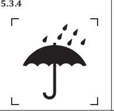
</td>
    <td>
N/A
</td>
    <td>
——
</td>
    <td>
——
</td>
    <td>
——
</td>
    <td>
——
</td>
    <td>
——
</td>
  </tr>
  <tr>
    <td>

</td>
    <td>
– the carrying case shall be marked with its degree of protection 运输箱应标记它的防护等级
</td>
    <td>
N/A
</td>
    <td>
——
</td>
    <td>
——
</td>
    <td>
——
</td>
    <td>
——
</td>
    <td>
——
</td>
  </tr>
  <tr>
    <td>

</td>
    <td>
A carrying case that is not intended to provide protection against the ingress of water or particulate matter need not be marked. 运输箱预期没有提供保护，不需要标识
</td>
    <td>
A
</td>
    <td>
检查外箱
</td>
    <td>
OK
</td>
    <td>

</td>
    <td>

</td>
    <td>

</td>
  </tr>
  <tr>
    <td>
7.3
</td>
    <td>
ACCOMPANYING DOCUMENTS随机文件
</td>
    <td>
——
</td>
    <td>
——
</td>
    <td>
——
</td>
    <td>
——
</td>
    <td>
——
</td>
    <td>
——
</td>
  </tr>
  <tr>
    <td>
7.3.1
</td>
    <td>
Contact information联系信息
</td>
    <td>
——
</td>
    <td>
——
</td>
    <td>
——
</td>
    <td>
——
</td>
    <td>
——
</td>
    <td>
——
</td>
  </tr>
  <tr>
    <td>

</td>
    <td>
the ACCOMPANYING DOCUMENTS shall indicate that the LAY OPERATOR or LAY RESPONSIBLE ORGANIZATION should contact the MANUFACTURER or the MANUFACTURER&#x27;S representative: 随机文件应说明非专业操作者及非专业组织机构能够联系制造商或者制造商代表： ——for assistance, if needed, in setting up, using or maintaining the ME EQUIPMENT or ME SYSTEM; or 若适用，寻求关于装配、使用、维护方面帮助；或者
</td>
    <td>
A
</td>
    <td>
检查使用说明书
</td>
    <td>
OK
</td>
    <td>

</td>
    <td>
Notice
</td>
    <td>

</td>
  </tr>
  <tr>
    <td>

</td>
    <td>
——to report unexpected operation or events 报告意外操作或事情
</td>
    <td>
A
</td>
    <td>
检查使用说明书
</td>
    <td>
OK
</td>
    <td>

</td>
    <td>
Product errors and troubleshooting 

</td>
    <td>

</td>
  </tr>
  <tr>
    <td>

</td>
    <td>
The ACCOMPANYING DOCUMENTS shall include a postal address and either a telephone number or web address through which the LAY OPERATOR or LAY RESPONSIBLE ORGANIZATION can contact the MANUFACTURER or the MANUFACTURER&#x27;S representative 随机文件应包括非专业操作者及非专业组织机构能联系到制造商或者制造商代表的邮政地址、电话号码或WEB地址
</td>
    <td>
A
</td>
    <td>
检查使用说明书
</td>
    <td>
OK
</td>
    <td>

</td>
    <td>
九安公司或者客户名称及地址和（电话或网址）
</td>
    <td>

</td>
  </tr>
  <tr>
    <td>
7.3.2
</td>
    <td>
 LAY OPERATOR briefing information非专业操作者情况介绍信息
</td>
    <td>
——
</td>
    <td>
——
</td>
    <td>
——
</td>
    <td>
——
</td>
    <td>
——
</td>
    <td>
——
</td>
  </tr>
  <tr>
    <td>

</td>
    <td>
the ACCOMPANYING DOCUMENTS shall include the details necessary for the healthcare professional to brief the LAY OPERATOR or LAY RESPONSIBLE ORGANIZATION on any known contraindication(s) to the use of the ME EQUIPMENT or ME SYSTEM and any precautions to be taken. This shall include: 随机文件应包括对非专业操作者及非专业组织机构介绍详细的必要的健康护理信息，已知的的任何禁忌以及预防措施，包括： —— precautions to be taken in the event of changes in the performance of the ME EQUIPMENT or ME SYSTEM; ME 设备性能改变的预防措施
</td>
    <td>
A
</td>
    <td>
检查使用说明书
</td>
    <td>
OK
</td>
    <td>

</td>
    <td>
Care and cleaning  
</td>
    <td>
——
</td>
  </tr>
  <tr>
    <td>

</td>
    <td>
—— precautions to be taken regarding the exposure of the ME EQUIPMENT or ME SYSTEM to reasonably foreseeable environmental conditions (e.g. to magnetic fields, electromagnetic fields, external electrical influences, ELECTROSTATIC DISCHARGE, pressure or variations in pressure, acceleration, thermal ignition sources) ME设备被带入合理可预见的环境的预防措施（eg. 电磁场、静电、压力、热源等）
</td>
    <td>
A
</td>
    <td>
检查使用说明书
</td>
    <td>
OK
</td>
    <td>

</td>
    <td>
Electromagnetic compatibility information
</td>
    <td>
——
</td>
  </tr>
  <tr>
    <td>

</td>
    <td>
—— adequate information regarding any medicinal substances that the ME EQUIPMENT is designed to administer, including any limitations in the choice of substances to be delivered 用来管理关于药物的ME 设备足够的信息，包括：药物的任何选择投送的限制
</td>
    <td>
NA
</td>
    <td>
检查使用说明书
</td>
    <td>
——
</td>
    <td>
——
</td>
    <td>
——
</td>
    <td>
设备不用来管理药物
</td>
  </tr>
  <tr>
    <td>

</td>
    <td>
—— information on any medicinal substances or human blood derivatives incorporated into the ME EQUIPMENT or ACCESSORIES as an integral part; and 任何药物或人血衍生物进入ME 设备或主要附件的信息
</td>
    <td>
NA
</td>
    <td>
检查使用说明书
</td>
    <td>
——
</td>
    <td>
——
</td>
    <td>
—— 
</td>
    <td>
同上
</td>
  </tr>
  <tr>
    <td>

</td>
    <td>
—— the degree of accuracy claimed for ME EQUIPMENT with a measuring FUNCTION. ME 设备测量功能的准确性
</td>
    <td>
A
</td>
    <td>
检查使用说明书
</td>
    <td>
OK
</td>
    <td>

</td>
    <td>
Product performance
</td>
    <td>
——
</td>
  </tr>
  <tr>
    <td>
7.4
</td>
    <td>
Instructions for use使用说明书
</td>
    <td>
——
</td>
    <td>
——
</td>
    <td>
——
</td>
    <td>
——
</td>
    <td>
——
</td>
    <td>
——
</td>
  </tr>
  <tr>
    <td>
7.4.1
</td>
    <td>
Additional requirements for warning and safety GENERAL SAFETY AND PRECAUTIONSs 警告和安全条款增加的要求
</td>
    <td>
——
</td>
    <td>
——
</td>
    <td>
——
</td>
    <td>
——
</td>
    <td>
——
</td>
    <td>
——
</td>
  </tr>
  <tr>
    <td>

</td>
    <td>
for each warning and safety sign, the instructions for use shall describe the nature of the HAZARD, likely consequences that could occur if the advice is not followed, and the precautions for reducing the RISK 每一个警告和安全符号，使用说明书应描述其危害的性质，如果不按照建议进行，或者降低风险控制措
</td>
    <td>
A
</td>
    <td>
检查使用说明书以及风险管理文档
</td>
    <td>
OK
</td>
    <td>

</td>
    <td>
注意事项处要有警告标识
</td>
    <td>
——
</td>
  </tr>
  <tr>
    <td>

</td>
    <td>
If applicable, the instructions for use shall address the issues of: 若适用，使用说明书应增加解决以下问题的信息： —— strangulation due to cables and hoses, particularly due to excessive length. 由于电线及软管的缠绕，尤其是过长的电线及软管
</td>
    <td>
NA
</td>
    <td>
检查使用说明书
</td>
    <td>
——
</td>
    <td>
——
</td>
    <td>
——
</td>
    <td>
无电线
</td>
  </tr>
  <tr>
    <td>

</td>
    <td>
——small parts being inhaled or swallowed 小部件的吸入及吞咽
</td>
    <td>
A
</td>
    <td>
检查使用说明书
</td>
    <td>
OK
</td>
    <td>

</td>
    <td>
2.Keep the thermometer out of reach of children. For accidental swallowing of the battery or other components, please contact emergency services immediately.
</td>
    <td>
——
</td>
  </tr>
  <tr>
    <td>

</td>
    <td>
—— potential allergic reactions to accessible materials used in the ME EQUIPMENT. 设备上可触及材料的潜在的过敏反应
</td>
    <td>
A
</td>
    <td>
检查使用说明书
</td>
    <td>
OK
</td>
    <td>

</td>
    <td>
16.If you are allergic to plastic/rubber, please don’t use this device.
</td>
    <td>
——
</td>
  </tr>
  <tr>
    <td>

</td>
    <td>
——contact injuries 接触伤害
</td>
    <td>
NA
</td>
    <td>
——
</td>
    <td>
——
</td>
    <td>
——
</td>
    <td>
——
</td>
    <td>
——
</td>
  </tr>
  <tr>
    <td>

</td>
    <td>
If applicable, the instructions for use shall include warnings to the effect that it can be unsafe to: 若适用，使用说明书应包括一些可能会产生不安全后果的警告信息 —— use ACCESSORIES, detachable parts and materials not described in the instructions for use (see 7.9.2.14 of the general standard). 使用说明书中未描述使用的附件，可拆卸部分以及一些材料
</td>
    <td>
NA
</td>
    <td>
——
</td>
    <td>
——
</td>
    <td>
——
</td>
    <td>
——
</td>
    <td>
无附件
</td>
  </tr>
  <tr>
    <td>

</td>
    <td>
——interconnect this equipment with other equipment not described in the instructions for use (see 16.2 c) indent 9) of the general standard). 使用说明书中未描述的互联设备
</td>
    <td>
A/NA
</td>
    <td>
——
</td>
    <td>
——
</td>
    <td>
——
</td>
    <td>
——
</td>
    <td>
带无线功能或带数据传输功能的适用
</td>
  </tr>
  <tr>
    <td>

</td>
    <td>
——modify the equipment.调试/修改设备
</td>
    <td>
A
</td>
    <td>
检查使用说明书
</td>
    <td>
OK
</td>
    <td>

</td>
    <td>
Warranty
</td>
    <td>

</td>
  </tr>
  <tr>
    <td>

</td>
    <td>
—— use the ME EQUIPMENT outside its carrying case if some part of the protection 如果本标准规定的保护部件由运输箱提供，使用了设备提供的以外的运输箱
</td>
    <td>
NA
</td>
    <td>
——
</td>
    <td>
——
</td>
    <td>
——
</td>
    <td>
——
</td>
    <td>
无预期由运输箱提供保护的部件
</td>
  </tr>
  <tr>
    <td>
7.4.2
</td>
    <td>
Additional requirements for an electrical power source对电源增加的要求
</td>
    <td>
——
</td>
    <td>
——
</td>
    <td>
——
</td>
    <td>
——
</td>
    <td>
——
</td>
    <td>
——
</td>
  </tr>
  <tr>
    <td>

</td>
    <td>
if ME EQUIPMENT is equipped with an INTERNAL ELECTRICAL POWER SOURCE and the BASIC SAFETY or ESSENTIAL PERFORMANCE is dependent on the INTERNAL ELECTRICAL POWER SOURCE, the instructions for use shall describe: 如果设备是内部电源，并且BS和EP取决于内部电源，使用说明书应描述： ——the typical operation time or number of procedures; 标准的操作时间和次数
</td>
    <td>
NA
</td>
    <td>
——
</td>
    <td>
——
</td>
    <td>
——
</td>
    <td>
——
</td>
    <td>
电源为7号电池
</td>
  </tr>
  <tr>
    <td>

</td>
    <td>
—— the typical service life; and标准的使用寿命，以及
</td>
    <td>
A
</td>
    <td>
检查使用说明书
</td>
    <td>
OK
</td>
    <td>

</td>
    <td>
Product performance
13.Expected service life: 5 years
</td>
    <td>
——
</td>
  </tr>
  <tr>
    <td>

</td>
    <td>
—— for a rechargeable INTERNAL ELECTRICAL POWER SOURCE, the behavior of the ME EQUIPMENT while the rechargeable INTERNAL ELECTRICAL POWER SOURCE is charging. 对于可充电的内部电源，当进行充电时，ME设备的指示（包括更换年限、报废周期）
</td>
    <td>
 A/ NA
</td>
    <td>
——
</td>
    <td>
——
</td>
    <td>
——
</td>
    <td>
——
</td>
    <td>
可充电电池适用
</td>
  </tr>
  <tr>
    <td>
7.4.3
</td>
    <td>
Additional requirements for ME EQUIPMENT description 对ME 设备的描述增加的要求
</td>
    <td>
——
</td>
    <td>
——
</td>
    <td>
——
</td>
    <td>
——
</td>
    <td>
——
</td>
    <td>
——
</td>
  </tr>
  <tr>
    <td>

</td>
    <td>
the instructions for use shall include easily understood diagrams, illustrations, or photographs of the fully assembled and ready-to-operate ME EQUIPMENT including all controls, visual INFORMATION SIGNALS, and indicators provided with the ME EQUIPMENT (see 7.1). 使用说明书应包含易理解的图表、插图以及完整的装配图、操作准备，包括ME设备的连接、视觉信息、指示器。
</td>
    <td>
A
</td>
    <td>
检查使用说明书
</td>
    <td>
OK
</td>
    <td>

</td>
    <td>
LCD screen instructions液晶显示图

</td>
    <td>
——
</td>
  </tr>
  <tr>
    <td>
7.4.4
</td>
    <td>
Additional requirements for ME EQUIPMENT start-up PROCEDURE对ME设备启动程序增加的要求
</td>
    <td>
——
</td>
    <td>
——
</td>
    <td>
——
</td>
    <td>
——
</td>
    <td>
——
</td>
    <td>
——
</td>
  </tr>
  <tr>
    <td>

</td>
    <td>
the instructions for use shall include: 使用说明书应包括： —— easily understood diagrams, illustrations, or photographs showing proper connection of the PATIENT to the ME EQUIPMENT, ACCESSORIES and other equipment (see 7.1); and 易理解的图表、插图、图片来指示连接患者与设备、可触及部件和其他设备；和
</td>
    <td>
A
</td>
    <td>
检查使用说明书
</td>
    <td>
OK
</td>
    <td>

</td>
    <td>
Instruction for use图示
</td>
    <td>
——
</td>
  </tr>
  <tr>
    <td>

</td>
    <td>
—— the time from switching “ON” until the ME EQUIPMENT is ready for NORMAL USE, if that time exceeds 15 s (see 15.4.4 of the general standard). 如果按“开”键后，正常工作需要的时间大于15秒，说明时间
</td>
    <td>
NA
</td>
    <td>
检查使用说明书
</td>
    <td>
——
</td>
    <td>
——
</td>
    <td>
——
</td>
    <td>
预期开启时间小于5s
</td>
  </tr>
  <tr>
    <td>

</td>
    <td>
the time required for the ME EQUIPMENT to warm from the minimum storage temperature between uses (4.2.2) until the ME EQUIPMENT is ready for its INTENDED USE when the ambient temperature is 20 °C; and 在正常使用中，ME设备从最小储存温度到当环境温度为20℃时设备准备好实现预期用途所需的升温时间
</td>
    <td>
NA
</td>
    <td>
——
</td>
    <td>
——
</td>
    <td>
——
</td>
    <td>
——
</td>
    <td>
——
</td>
  </tr>
  <tr>
    <td>

</td>
    <td>
– the time required for the ME EQUIPMENT to cool from the maximum storage temperature between uses (4.2.2) until the ME EQUIPMENT is ready for its INTENDED USE when the ambient temperature is 20 °C 在正常使用中，ME设备从最大储存温度到当环境温度为20℃时设备准备好实现预期用途所需的冷却时间
</td>
    <td>
NA
</td>
    <td>
——
</td>
    <td>
——
</td>
    <td>
——
</td>
    <td>
——
</td>
    <td>
——
</td>
  </tr>
  <tr>
    <td>
7.4.5
</td>
    <td>
Additional requirements for operating instructions对操作说明增加的要求
</td>
    <td>
——
</td>
    <td>
——
</td>
    <td>
——
</td>
    <td>
——
</td>
    <td>
——
</td>
    <td>
——
</td>
  </tr>
  <tr>
    <td>

</td>
    <td>
 the instructions for use shall include a description of generally known conditions in the HOME HEALTHCAREENVIRONMENT that can unacceptably affect the BASIC SAFETY and ESSENTIAL PERFORMANCE of the ME EQUIPMENT and the steps that can be taken by the LAY OPERATOR to identify and resolve these conditions, and shall include, 使用说明书应包含在家庭医疗保健环境下通常已知的条件对BS和EP能造成不可接受的影响的描述，以及非专业人士可以识别并解决的防范、步骤
</td>
    <td>
A
</td>
    <td>
检查风险管理文档
</td>
    <td>
——
</td>
    <td>
——
</td>
    <td>
——
</td>
    <td>
——
</td>
  </tr>
  <tr>
    <td>

</td>
    <td>
 at least the following issues 至少包括以下方面： ——棉绒、灰尘、光线的影响the effects of lint, dust, light (including sunlight), etc.
</td>
    <td>
A
</td>
    <td>
检查使用说明书以及风险管理文档
</td>
    <td>

</td>
    <td>

</td>
    <td>
Notice
</td>
    <td>

</td>
  </tr>
  <tr>
    <td>

</td>
    <td>
—— a list of known devices or other sources that can potentially cause interference problems 已知设备或其他源造成干扰问题的清单
</td>
    <td>
A
</td>
    <td>
检查使用说明书以及风险管理文档
</td>
    <td>

</td>
    <td>

</td>
    <td>
Notice
</td>
    <td>
如电磁场、高频设备
</td>
  </tr>
  <tr>
    <td>

</td>
    <td>
—— the effects of degraded sensors and electrodes, or loosened electrodes, that can degrade performance or cause other problems 传感器、电极的降低或松动的电极，引起性能降低或其他问题
</td>
    <td>
A
</td>
    <td>
检查使用说明书以及风险管理文档 说明书
</td>
    <td>

</td>
    <td>

</td>
    <td>
Product errors and troubleshooting
</td>
    <td>

</td>
  </tr>
  <tr>
    <td>

</td>
    <td>
—— the effects caused by pets, pests or children 宠物、害虫和儿童引起的影响
</td>
    <td>
A
</td>
    <td>
检查使用说明书以及风险管理文档
</td>
    <td>

</td>
    <td>

</td>
    <td>
2. Keep the thermometer out of reach of children.  For accidental swallowing of the battery or other components, please contact emergency services immediately.
</td>
    <td>

</td>
  </tr>
  <tr>
    <td>

</td>
    <td>
The instructions for use shall explain the meaning of the IP classification marked on the ME EQUIPMENT and, if applicable, on any carrying case provided with the ME EQUIPMENT. 使用说明书应解释设备上及运输箱上的IP分类的含义
</td>
    <td>
A
</td>
    <td>
检查使用说明书以及风险管理文档
</td>
    <td>

</td>
    <td>

</td>
    <td>
Signs and symbols
</td>
    <td>
IP22标识解释
</td>
  </tr>
  <tr>
    <td>
7.4.6
</td>
    <td>
Additional requirements for ME EQUIPMENT messages设备信息增加的要求
</td>
    <td>
——
</td>
    <td>
——
</td>
    <td>
——
</td>
    <td>
——
</td>
    <td>
——
</td>
    <td>
——
</td>
  </tr>
  <tr>
    <td>

</td>
    <td>
the instructions for use shall include a troubleshooting guide for use when there are indications of a ME EQUIPMENT malfunction during start-up or operation.  使用说明书应增加当设备在启动或操作中发生故障的指示以及修理指导。
</td>
    <td>
A
</td>
    <td>
检查使用说明书
</td>
    <td>
OK
</td>
    <td>

</td>
    <td>
Product errors and troubleshooting
</td>
    <td>
——
</td>
  </tr>
  <tr>
    <td>

</td>
    <td>
The troubleshooting guide shall disclose the necessary steps to be taken in the event of an ALARM CONDITION. 解决措施的指导应说明必要的来解除报警状态的步骤
</td>
    <td>
A
</td>
    <td>
——
</td>
    <td>
OK
</td>
    <td>
——
</td>
    <td>
Product errors and troubleshooting
</td>
    <td>
——
</td>
  </tr>
  <tr>
    <td>
7.4.7
</td>
    <td>
Additional requirements for cleaning, disinfection and sterilization对清洗、消毒和灭菌增加的要求
</td>
    <td>
——
</td>
    <td>
——
</td>
    <td>
——
</td>
    <td>
——
</td>
    <td>
——
</td>
    <td>
——
</td>
  </tr>
  <tr>
    <td>

</td>
    <td>
for ME EQUIPMENT, ME SYSTEMS, their parts or ACCESSORIES that are intended for other than single use and that can become contaminated through contact with the PATIENT or with body fluids or expired gases during INTENDED USE, the instructions for use shall: ME 设备的部件及附件，预期非单独使用并可能通过患者连接或体液、呼吸造成污染，使用说明书应： either, —— indicate the frequency of cleaning, cleaning and disinfection or cleaning and sterilization, as appropriate, of the ME EQUIPMENT, ME SYSTEMS, parts or ACCESSORIES used on the same PATIENT including methods for rinsing, drying, handling and storage between uses (see 8.1 and 8.2); and 说明ME 设备在同一患者上使用的部件或附件清洗、消毒和灭菌的频次，冲洗、烘干、搬运、存储的方法；（8.1和8.2）和
</td>
    <td>
A
</td>
    <td>
检查使用说明书
</td>
    <td>
OK
</td>
    <td>

</td>
    <td>
Care and cleaning
</td>
    <td>
——
</td>
  </tr>
  <tr>
    <td>

</td>
    <td>
—— if intended for multiple PATIENT use, indicate that it is necessary to clean and disinfect or clean and sterilize the ME EQUIPMENT, ME SYSTEMS, parts or ACCESSORIES between uses on different PATIENTS, including methods for rinsing, drying, handling and storage until re-use (see 8.1 and 8.2); 如果预期是多患者使用，应说明清洗、消毒和灭菌的必要性，以及冲洗、烘干、搬运、存储的方法。（8.1和8.2）
</td>
    <td>
NA
</td>
    <td>
——
</td>
    <td>
——
</td>
    <td>
——
</td>
    <td>
——
</td>
    <td>
预期非多患者使用
</td>
  </tr>
  <tr>
    <td>

</td>
    <td>
or,或者： —— indicate that the ME EQUIPMENT, ME SYSTEMS or ACCESSORIES require professional hygienic MAINTENANCE prior to re-use and provide contact details for the source of these services (see 7.5.2). 说明ME设备或附件要求再次使用前进行专业卫生维护，并提供之这些服务的联系方式（7.5.2）
</td>
    <td>
NA
</td>
    <td>
检查使用说明书
</td>
    <td>
——
</td>
    <td>
——
</td>
    <td>
——
</td>
    <td>
预期非由专业卫生维护
</td>
  </tr>
  <tr>
    <td>
7.4.8
</td>
    <td>
Additional requirements for MAINTENANCE对维护增加的要求
</td>
    <td>
——
</td>
    <td>
——
</td>
    <td>
——
</td>
    <td>
——
</td>
    <td>
——
</td>
    <td>
——
</td>
  </tr>
  <tr>
    <td>

</td>
    <td>
the instructions for use shall include: 使用说明书应包括： ——the EXPECTED SERVICE LIFE of the ME EQUIPMENT 产品预期使用寿命；
</td>
    <td>
A
</td>
    <td>
检查使用说明书
</td>
    <td>
OK
</td>
    <td>

</td>
    <td>
Expected service life: 5 years
</td>
    <td>
——
</td>
  </tr>
  <tr>
    <td>

</td>
    <td>
——the EXPECTED SERVICE LIFE of parts or ACCESSORIES shipped with the ME EQUIPMENT; an d 与设备相匹配的部件或附件的使用寿命；以及
</td>
    <td>
NA
</td>
    <td>
检查使用说明书
</td>
    <td>
——
</td>
    <td>
——
</td>
    <td>
——
</td>
    <td>
无此类部件
</td>
  </tr>
  <tr>
    <td>

</td>
    <td>
—— where the SHELF LIFE is less than the EXPECTED SERVICE LIFE, the SHELF LIFE of parts or ACCESSORIES shipped with the ME EQUIPMENT 当保质期小于预期使用寿命时，要说明与设备相匹配的部件或附件的保质期。
</td>
    <td>
NA
</td>
    <td>
检查使用说明书
</td>
    <td>
——
</td>
    <td>
——
</td>
    <td>
——
</td>
    <td>
无此类部件
</td>
  </tr>
  <tr>
    <td>
7.4.9
</td>
    <td>
Additional requirements for environmental protection 对环境保护增加的要求
</td>
    <td>
——
</td>
    <td>
——
</td>
    <td>
——
</td>
    <td>
——
</td>
    <td>
——
</td>
    <td>
——
</td>
  </tr>
  <tr>
    <td>

</td>
    <td>
I the instructions for use shall include:  使用说明书应包括： —— information concerning the proper disposal of the ME EQUIPMENT, its parts or ACCESSORIES (see IEC 60601-1-9); and 关于适当处理设备及设备部件或附件的信息（60601-1-9）；和
</td>
    <td>
A
</td>
    <td>
检查使用说明书
</td>
    <td>
OK
</td>
    <td>

</td>
    <td>
Warranty
</td>
    <td>
——
</td>
  </tr>
  <tr>
    <td>

</td>
    <td>
——where applicable, a statement to the effect that the LAY RESPONSIBLE ORGANIZATION must contact its local authorities to determine the proper method of disposal of potentially biohazardous parts and ACCESSORIES 若适用，非专业操作人员必须联系当局以确定处理部件或附件的方法的声明
</td>
    <td>
A
</td>
    <td>
检查使用说明书
</td>
    <td>
OK
</td>
    <td>

</td>
    <td>
Warranty
</td>
    <td>
——
</td>
  </tr>
  <tr>
    <td>
8.5
</td>
    <td>
Additional requirements for an INTERNAL ELECTRICAL POWER SOURCE对内部电源增加的要求
</td>
    <td>
——
</td>
    <td>
——
</td>
    <td>
——
</td>
    <td>
——
</td>
    <td>
——
</td>
    <td>
——
</td>
  </tr>
  <tr>
    <td>
8.5.1
</td>
    <td>
Indication of state状态指示
</td>
    <td>
——
</td>
    <td>
——
</td>
    <td>
——
</td>
    <td>
——
</td>
    <td>
——
</td>
    <td>
——
</td>
  </tr>
  <tr>
    <td>

</td>
    <td>
if the INTERNAL ELECTRICAL POWER SOURCE is essential to maintain BASIC SAFETY or maintain ESSENTIAL PERFORMANCE or control the RISKS associated with the loss of ESSENTIAL PERFORMANCE, the ME EQUIPMENT shall be equipped with a means for the OPERATOR to determine the state of the INTERNAL ELECTRICAL POWER SOURCE.  内部电源对保持BS及EP或控制风险是必不可少的，那么设备应为操作者配有一种确定内部电源状态的方法。
</td>
    <td>
A
</td>
    <td>
检查设备
</td>
    <td>
——
</td>
    <td>
——
</td>
    <td>
——
</td>
    <td>
——
</td>
  </tr>
  <tr>
    <td>

</td>
    <td>
The state of the INTERNAL ELECTRICAL POWER SOURCE may be indicated as: 内部电源的状态可以包括： —— a number of procedures remaining剩余电量的数量；
</td>
    <td>
A/NA
</td>
    <td>
检查设备
</td>
    <td>
——
</td>
    <td>
——
</td>
    <td>
——
</td>
    <td>
——
</td>
  </tr>
  <tr>
    <td>

</td>
    <td>
—— the remaining operating time;剩余操作时间；
</td>
    <td>
——
</td>
    <td>
——
</td>
    <td>
——
</td>
    <td>
——
</td>
    <td>
——
</td>
    <td>
——
</td>
  </tr>
  <tr>
    <td>

</td>
    <td>
——the percentage of the remaining operating time or energy; or 剩余操作时间或电量的百分比；或
</td>
    <td>
NA
</td>
    <td>
——
</td>
    <td>
——
</td>
    <td>
——
</td>
    <td>
——
</td>
    <td>

</td>
  </tr>
  <tr>
    <td>

</td>
    <td>
——a &quot;fuel&quot; gauge.（更换）充电指示
</td>
    <td>
NA
</td>
    <td>
——
</td>
    <td>
——
</td>
    <td>
——
</td>
    <td>
——
</td>
    <td>
适用可充电锂电池
</td>
  </tr>
  <tr>
    <td>

</td>
    <td>
The state of the INTERNAL ELECTRICAL POWER SOURCE may be indicated continuously or by OPERATOR action. 内部电源的状态可以连续指示，或由操作者进行操作
</td>
    <td>
NA
</td>
    <td>
——
</td>
    <td>
——
</td>
    <td>
——
</td>
    <td>
——
</td>
    <td>
——
</td>
  </tr>
  <tr>
    <td>

</td>
    <td>
The instructions for use shall describe how to determine the state of the INTERNAL ELECTRICAL POWER SOURCE. 使用说明书应描述如何确定内部电源状态
</td>
    <td>
A
</td>
    <td>
检查使用说明书
</td>
    <td>
OK
</td>
    <td>

</td>
    <td>
Product errors and troubleshooting
</td>
    <td>
低电符号的解释
</td>
  </tr>
</table>

<table>
  <tr>
    <th colspan="8">
标签检查报告（EN ISO 80601-2-56部分）
</th>
  </tr>
  <tr>
    <td colspan="8">
拟制:                         年  月  日      审核:                              年  月  日  
</td>
  </tr>
  <tr>
    <td colspan="8">
产品型号：  PT9L                  项目编号： 2024-002-WX02                     产品/项目名称：红外体温计
</td>
  </tr>
  <tr>
    <td colspan="8">
ISO 80601-2-56:2017
Medical electrical equipment — Part 2-56: Particular requirements for basic safety and essential performance of clinical thermometers for body temperature measurement
</td>
  </tr>
  <tr>
    <td rowspan="2">
<strong>Clause NO.</strong>条款号
</td>
    <td rowspan="2">
<strong>Description, Requirement/</strong>描述或要求
</td>
    <td rowspan="2">
Applicable适用性
</td>
    <td rowspan="2">
<strong>Verification method</strong> 验证方法
</td>
    <td rowspan="2" colspan="2">
<strong>Compliance/</strong>符合性
</td>
    <td rowspan="2">
Verification annal
验证记录
</td>
    <td rowspan="2">
<strong>Comments/</strong>备注
</td>
  </tr>
  <tr>
  </tr>
  <tr>
    <td>

</td>
    <td>

</td>
    <td>
A
</td>
    <td>

</td>
    <td>
OK
</td>
    <td>
Fail
</td>
    <td>

</td>
    <td>

</td>
  </tr>
  <tr>
    <td>
201.7
</td>
    <td>
ME设备识别、标识和文件 IEC 60601-1:2005+AI:2012第7节适用，除了以下：
</td>
    <td>
——
</td>
    <td>
——
</td>
    <td>
——
</td>
    <td>
——
</td>
    <td>
——
</td>
    <td>
——
</td>
  </tr>
  <tr>
    <td>
201.7.2.1
</td>
    <td>
ME设备或可更换部件的最小标识要求
</td>
    <td>
——
</td>
    <td>
——
</td>
    <td>
——
</td>
    <td>
——
</td>
    <td>
——
</td>
    <td>
——
</td>
  </tr>
  <tr>
    <td rowspan="7">
201.7.2.1.10
</td>
    <td>
1彩包装的附加要求体温计和探头的彩包装应包括以下内容：
</td>
    <td>
——
</td>
    <td>
——
</td>
    <td>
——
</td>
    <td>
——
</td>
    <td>
——
</td>
    <td>
——
</td>
  </tr>
  <tr>
    <td>
a) 测量部位和可调节模式的参考部位
</td>
    <td>
A
</td>
    <td>
检查彩包装
</td>
    <td>
OK
</td>
    <td>

</td>
    <td>
Measurement Site: Forehead
</td>
    <td>

</td>
  </tr>
  <tr>
    <td>
b) 体温计当前操作模式的辨别显示，包装内容物说明
</td>
    <td>
A
</td>
    <td>
检查彩包装
</td>
    <td>
OK
</td>
    <td>

</td>
    <td>
彩包装有此内容
</td>
    <td>

</td>
  </tr>
  <tr>
    <td>
c) 如果是无菌的，标识要符合ISO 15223-1;2016
</td>
    <td>
A
</td>
    <td>
检查彩包装
</td>
    <td>
OK
</td>
    <td>

</td>
    <td>
彩包装有此内容
</td>
    <td>

</td>
  </tr>
  <tr>
    <td>
d)如果存在有效期，则标识要符合ISO 15223-1;2016
</td>
    <td>
A
</td>
    <td>
检查彩包装
</td>
    <td>
OK
</td>
    <td>

</td>
    <td>
Expected service life: 5 years 
</td>
    <td>

</td>
  </tr>
  <tr>
    <td>
e) 存储，处置或操作说明
</td>
    <td>
A
</td>
    <td>
检查彩包装
</td>
    <td>
OK
</td>
    <td>

</td>
    <td>
彩包装有此内容
</td>
    <td>

</td>
  </tr>
  <tr>
    <td>
对于特殊型号，要标识“一次性使用”。
</td>
    <td>
NA
</td>
    <td>
——
</td>
    <td>
——
</td>
    <td>
——
</td>
    <td>
——
</td>
    <td>
非一次性
</td>
  </tr>
  <tr>
    <td>
201.7.2.2
</td>
    <td>
设备或部件标识
</td>
    <td>
——
</td>
    <td>
——
</td>
    <td>
——
</td>
    <td>
——
</td>
    <td>
——
</td>
    <td>
——
</td>
  </tr>
  <tr>
    <td rowspan="4">
201.7.2.10
</td>
    <td>
1设备或部件标识的附加要求，应清楚标识以下信息：
</td>
    <td>
——
</td>
    <td>
——
</td>
    <td>
——
</td>
    <td>
——
</td>
    <td>
——
</td>
    <td>
——
</td>
  </tr>
  <tr>
    <td>
a）如果显示的输出的温度后没有℃或ºF，则℃或ºF应刻在设备上，如果两种温度可以切换的话，此两个单位应清晰显示。
</td>
    <td>
A
</td>
    <td>
检查液晶显示
</td>
    <td>
OK
</td>
    <td>

</td>
    <td>
有此内容
</td>
    <td>

</td>
  </tr>
  <tr>
    <td>
b)预期测量部位
</td>
    <td>
A
</td>
    <td>
检查铭牌，彩包装，说明书
</td>
    <td>
OK
</td>
    <td>

</td>
    <td>
有此内容
</td>
    <td>

</td>
  </tr>
  <tr>
    <td>
c）探测器保护罩在每次测量前要更换新的，如果其对基本性能有影响的话
</td>
    <td>
NA
</td>
    <td>
——
</td>
    <td>
——
</td>
    <td>
——
</td>
    <td>
——
</td>
    <td>
不需更换
</td>
  </tr>
  <tr>
    <td>
201.7.4.3
</td>
    <td>
单位
</td>
    <td>
——
</td>
    <td>
——
</td>
    <td>
——
</td>
    <td>
——
</td>
    <td>
——
</td>
    <td>
——
</td>
  </tr>
  <tr>
    <td>
201.7.4.3.101
</td>
    <td>
测量单位的附加要求  体温计的测量单位应该是℃或ºF，或者两者都有。体温计应清晰显示测量单位。
</td>
    <td>
A
</td>
    <td>
检查液晶显示
</td>
    <td>
OK
</td>
    <td>

</td>
    <td>
有此内容
</td>
    <td>

</td>
  </tr>
  <tr>
    <td>
201.7.9
</td>
    <td>
随机文件
</td>
    <td>
——
</td>
    <td>
——
</td>
    <td>
——
</td>
    <td>
——
</td>
    <td>
——
</td>
    <td>
——
</td>
  </tr>
  <tr>
    <td rowspan="4">
201.7.9.1
</td>
    <td>
附加通用要
随机文件应该识别出机器的以下信息：
</td>
    <td>
——
</td>
    <td>
——
</td>
    <td>
——
</td>
    <td>
——
</td>
    <td>
——
</td>
    <td>
——
</td>
  </tr>
  <tr>
    <td>
-名称或商标
</td>
    <td>
A
</td>
    <td>
检查铭牌，彩包装，说明书
</td>
    <td>
OK
</td>
    <td>

</td>
    <td>
有此内容
</td>
    <td>

</td>
  </tr>
  <tr>
    <td>
-制造商地址
</td>
    <td>
A
</td>
    <td>
检查铭牌，彩包装，说明书
</td>
    <td>
OK
</td>
    <td>

</td>
    <td>
有此内容
</td>
    <td>

</td>
  </tr>
  <tr>
    <td>
-如果制造商在境内没有地址，写本地授权代表地址
</td>
    <td>
A
</td>
    <td>
检查铭牌，彩包装，说明书
</td>
    <td>
OK
</td>
    <td>

</td>
    <td>
有此内容
</td>
    <td>

</td>
  </tr>
  <tr>
    <td>
201.7.9.2
</td>
    <td>
使用说明书的附加要求，使用说明书应包括：
</td>
    <td>
——
</td>
    <td>
——
</td>
    <td>
——
</td>
    <td>
——
</td>
    <td>
——
</td>
    <td>
——
</td>
  </tr>
  <tr>
    <td rowspan="13">
201.7.9.2.101
</td>
    <td>
a）IEC 62366-1:2015里的USE specification
</td>
    <td>
A
</td>
    <td>
检查说明书
</td>
    <td>
OK
</td>
    <td>

</td>
    <td>
有此内容
</td>
    <td>

</td>
  </tr>
  <tr>
    <td>
b）体温计的测量部位和参考身体部位
</td>
    <td>
A
</td>
    <td>
检查说明书
</td>
    <td>
OK
</td>
    <td>

</td>
    <td>
有此内容
</td>
    <td>

</td>
  </tr>
  <tr>
    <td>
c）如果适用，每个预期测量部位的最小的测量时间和测量间隔
</td>
    <td>
A
</td>
    <td>
检查说明书
</td>
    <td>
OK
</td>
    <td>

</td>
    <td>
有此内容
</td>
    <td>

</td>
  </tr>
  <tr>
    <td>
d）每个预期的参考身体部位的额定输出范围。
</td>
    <td>
A
</td>
    <td>
检查说明书
</td>
    <td>
OK
</td>
    <td>

</td>
    <td>
有此内容
</td>
    <td>

</td>
  </tr>
  <tr>
    <td>
e）额定输出范围下的精度，如果有额定扩展输出范围，其精度。
</td>
    <td>
A
</td>
    <td>
检查说明书
</td>
    <td>
OK
</td>
    <td>

</td>
    <td>
有此内容
</td>
    <td>

</td>
  </tr>
  <tr>
    <td>
f）如果有探头保护套：
</td>
    <td>
A
</td>
    <td>
检查说明书
</td>
    <td>
OK
</td>
    <td>

</td>
    <td>
有此内容
</td>
    <td>

</td>
  </tr>
  <tr>
    <td>
1）如何使用保护套
</td>
    <td>
A
</td>
    <td>
检查说明书
</td>
    <td>
OK
</td>
    <td>

</td>
    <td>
有此内容
</td>
    <td>

</td>
  </tr>
  <tr>
    <td>
2）当没有使用保护套测量时的相关信息。
</td>
    <td>
A
</td>
    <td>
检查说明书
</td>
    <td>
OK
</td>
    <td>

</td>
    <td>
有此内容
</td>
    <td>

</td>
  </tr>
  <tr>
    <td>
g）体温计是否有校准模式或可调节模式
</td>
    <td>
A
</td>
    <td>
检查说明书
</td>
    <td>
OK
</td>
    <td>

</td>
    <td>
有此内容
</td>
    <td>

</td>
  </tr>
  <tr>
    <td>
h）如果适用，如何选择和替换内部电源的方法（例如换电池）
</td>
    <td>
A
</td>
    <td>
检查说明书
</td>
    <td>
OK
</td>
    <td>

</td>
    <td>
有此内容
</td>
    <td>

</td>
  </tr>
  <tr>
    <td>
i）保证体温计安全有效的维护和校准的信息及频率。
</td>
    <td>
A
</td>
    <td>
检查说明书
</td>
    <td>
OK
</td>
    <td>

</td>
    <td>
有此内容
</td>
    <td>

</td>
  </tr>
  <tr>
    <td>
j）体温计及其部件的处理信息（电池或保护套的丢弃）
</td>
    <td>
A
</td>
    <td>
检查说明书
</td>
    <td>
OK
</td>
    <td>

</td>
    <td>
有此内容
</td>
    <td>

</td>
  </tr>
  <tr>
    <td>
k）如果体温计或附件预期一次性使用，当重复使用时其性能或技术参数可能会存在的风险。
</td>
    <td>
A
</td>
    <td>
检查说明书
</td>
    <td>
OK
</td>
    <td>

</td>
    <td>
有此内容
</td>
    <td>

</td>
  </tr>
  <tr>
    <td>
201.7.9.101
</td>
    <td>
随机文件的附加要求  如果没有配备校准模式或测试模式，随机文件应该说明在调节模式下，从测量的输出温度推导出非可调节温度的修正方法。
</td>
    <td>
NA
</td>
    <td>
——
</td>
    <td>
——
</td>
    <td>
——
</td>
    <td>
——
</td>
    <td>
——
</td>
  </tr>
</table>

<table>
  <tr>
    <th colspan="8">
标签检查报告（ASTM E1965-98部分）
</th>
  </tr>
  <tr>
    <td colspan="8">
拟制:                        年  月  日      审核:                            年  月  日  
</td>
  </tr>
  <tr>
    <td colspan="8">
产品型号：  PT9L                  项目编号： 2024-002-WX02                     产品/项目名称：红外体温计
</td>
  </tr>
  <tr>
    <td colspan="8">
ASTM E1965-98 Standard Specification for Electronic Thermometer for Intermittent Determination of Patient Temperature
</td>
  </tr>
  <tr>
    <td rowspan="2">
<strong>Clause NO.</strong>条款号
</td>
    <td rowspan="2">
<strong>Description, Requirement/</strong>描述或要求
</td>
    <td rowspan="2">
Applicable适用性
</td>
    <td rowspan="2">
<strong>Verification method</strong> 验证方法
</td>
    <td rowspan="2" colspan="2">
<strong>Compliance/</strong>符合性
</td>
    <td rowspan="2">
Verification annal
验证记录
</td>
    <td rowspan="2">
<strong>Comments/</strong>备注
</td>
  </tr>
  <tr>
  </tr>
  <tr>
    <td>

</td>
    <td>

</td>
    <td>
A
</td>
    <td>

</td>
    <td>
OK
</td>
    <td>
Fail
</td>
    <td>

</td>
    <td>

</td>
  </tr>
  <tr>
    <td>
 5.10 Labeling and Marking (Instruments and Accessories): 包装和标记（机器和附件）：
</td>
    <td>
——
</td>
    <td>
——
</td>
    <td>
——
</td>
    <td>
——
</td>
    <td>
——
</td>
    <td>
——
</td>
    <td>
——
</td>
  </tr>
  <tr>
    <td rowspan="3">
5.10.1 Thermometer and Accessories: 体温计及附件
</td>
    <td>
5.10.1.1 A thermometer shall clearly indicate the units of its temperature scale. 温度计应清楚标明其温标单位。
</td>
    <td>
A
</td>
    <td>
检查说明书，
彩包装
</td>
    <td>
OK
</td>
    <td>

</td>
    <td>
说明书和彩包装均采用摄氏和华氏温标
</td>
    <td>
——
</td>
  </tr>
  <tr>
    <td>
5.10.1.2 An  IR  thermometer  housing  shall  be  clearly marked with the trade name or type of the device, or both, model designation, name of the manufacturer or distributor, and lot number or serial number. 红外温度计外壳应清楚地标明设备的商品名称或类型，或两者，型号名称，制造商或分销商的名称，批号或序列号。
</td>
    <td>
A
</td>
    <td>
检查铭牌
</td>
    <td>
OK
</td>
    <td>
——
</td>
    <td>

</td>
    <td>
——
</td>
  </tr>
  <tr>
    <td>
5.10.1.3 An IR thermometer intended for professional use shall be conspicuously labeled with indication of the unad- justed or adjusted mode(s), or both, that correspond to the temperature value(s) capable of being displayed by the instru- ment. Such labeling is optional for IR thermometers that display only one mode and are intended for non-professional use. However, as required in 7.2.1.3, the instruction manual for both professional and non-professional use IR thermometers shall specify the body site(s) (that is, oral, rectal, core) used to reference the adjusted temperature value(s) displayed. 用于专业用途的红外温度计应醒目地贴上标签，标明与仪器能够显示的温度值相对应的未调整或调整模式或两者。这种标签对于只显示一种模式的非专业用途的红外温度计是可选的。但是，根据7.2.1.3的要求，专业和非专业使用红外温度计的说明书应规定用于参考显示的调整温度值的身体部位（即口腔、直肠、核心部位）。
</td>
    <td>
NA
</td>
    <td>
——
</td>
    <td>
——
</td>
    <td>
——
</td>
    <td>
——
</td>
    <td>
非专业用途
</td>
  </tr>
  <tr>
    <td rowspan="3">
7.1鉴定
</td>
    <td>
Identification  标识
</td>
    <td>
——
</td>
    <td>
——
</td>
    <td>
——
</td>
    <td>
——
</td>
    <td>
——
</td>
    <td>
——
</td>
  </tr>
  <tr>
    <td>
7.1.1 In order that purchasers may identify products con- forming to requirements of this specification, producers and distributors may include a statement of compliance in conjunc- tion with their name and address on product labels or associ- ated printed materials, or both, such as invoices, sales litera- ture, and the like. The following statement is suggested: “This infrared thermometer meets requirements established in ASTM Standard (E1965-98). Full responsibility for the conformance of  this  product to  the  standard is  assumed by  (name  and address of producer or distributor).” In the event one or more provisions of this standard are not met, a cautionary statement shall be included. 为了使采购商能够识别符合本规范要求的产品，生产商和分销商可以在产品标签或相关印刷材料上，或同时在发票、销售文件等上附上与其名称和地址相关的合规声明。建议使用以下语句：“该红外温度计符合ASTM标准（E1965-98）的要求。（生产商或经销商的名称和地址）对本产品是否符合本标准承担全部责任。“如果不符合本标准的一项或多项规定，应包括警告声明。
</td>
    <td>
A
</td>
    <td>
检查说明书
</td>
    <td>
OK
</td>
    <td>

</td>
    <td>
Notice
</td>
    <td>
——
</td>
  </tr>
  <tr>
    <td>
7.1.2 The IR thermometer shall be identified as intended for professional or consumer use, or both, as applicable. 红外温度计应标识为用于专业或消费用途，或两者兼用（如适用）。
</td>
    <td>
A
</td>
    <td>
检查说明书
</td>
    <td>
OK
</td>
    <td>
——
</td>
    <td>
Intended use
</td>
    <td>
——
</td>
  </tr>
  <tr>
    <td>
7.2
</td>
    <td>
Detailed Instructions —— Detailed instructions for use shall be provided. these instructions shall contain sufficient detail to provide a means for training in the operation, application, care, and biological and physical cleaning of the instrument and accessories.  详细说明——应提供详细的使用说明。这些说明应包含足够的细节，以提供操作、应用、护理以及仪器和附件的生物和物理清洁方面的培训方法。
</td>
    <td>
——
</td>
    <td>
——
</td>
    <td>
——
</td>
    <td>
——
</td>
    <td>
——
</td>
    <td>
——
</td>
  </tr>
  <tr>
    <td rowspan="8">
7.2.1规格
</td>
    <td>
Specifications—An instruction manual shall be pro- vided and contain the system specifications, including but not limited to the following: 规格应提供一份说明手册，并包含系统规范，包括但不限于以下内容：
</td>
    <td>
——
</td>
    <td>
——
</td>
    <td>
——
</td>
    <td>
——
</td>
    <td>
——
</td>
    <td>
——
</td>
  </tr>
  <tr>
    <td>
7.2.1.1 Displayed temperature range. 显示温度范围。
</td>
    <td>
A
</td>
    <td>
检查说明书
</td>
    <td>
OK
</td>
    <td>

</td>
    <td>
Measurement range: 93.2℉-109.4℉(34.0℃-43.0℃))
</td>
    <td>

</td>
  </tr>
  <tr>
    <td>
7.2.1.2 Maximum laboratory error. 最大实验室误差
</td>
    <td>
A
</td>
    <td>
检查说明书
</td>
    <td>
OK
</td>
    <td>

</td>
    <td>
Measurement precision: ±0.4℉(±0.2℃) within 95℉-105.8℉(35.0℃-41.0℃), outside this measurement range: ±0.5℉(±0.3℃)
</td>
    <td>

</td>
  </tr>
  <tr>
    <td>
7.2.1.3 Body site(s) used as a reference for adjusting the displayed temperature value. 身体部位用作调整显示温度值的参考。
</td>
    <td>
A
</td>
    <td>
检查说明书
</td>
    <td>
OK
</td>
    <td>

</td>
    <td>
1.Body temperature runs approximately from 95.9°F to 99.5°F(35.5℃-37.5℃).To determine if one has a fever, compare the temperature detected with the person&#x27;s normal temperature. A rise over the reference body temperature of 1°F or more is generally an indication of fever.
</td>
    <td>

</td>
  </tr>
  <tr>
    <td>
7.2.1.4 Applicable subject categories for each display mode.适用于每种显示模式的主题类别。
</td>
    <td>
A
</td>
    <td>
检查说明书
</td>
    <td>
OK
</td>
    <td>

</td>
    <td>
Operation mode: Adjusted mode: forehead 
</td>
    <td>

</td>
  </tr>
  <tr>
    <td>
7.2.1.5 Required period of recalibration or reverification, if applicable. 所需的重新校准或再验证时间（如适用）。
</td>
    <td>
A
</td>
    <td>
检查说明书
</td>
    <td>
OK
</td>
    <td>

</td>
    <td>

</td>
    <td>

</td>
  </tr>
  <tr>
    <td>
7.2.1.6 Environmental characteristics (operating and storage ranges for temperature and humidity). 环境特性（温度和湿度的操作和储存范围）。
</td>
    <td>
A
</td>
    <td>
检查说明书
</td>
    <td>
OK
</td>
    <td>

</td>
    <td>
9.Product performance:
Temperature: 59℉-104℉(15℃-40℃)
Humidity: ≤95%RH, non-condensing
Atmospheric Pressure: 70KPa~106KPa
10.Transportation / storage conditions
Temperature: -13℉-131℉( -25℃-55℃)
Humidity: ≤95%RH, non-condensing
Atmospheric Pressure: 70KPa~106KPa
</td>
    <td>

</td>
  </tr>
  <tr>
    <td>
7.2.1.7 Statement informing that clinical accuracy charac- teristics and procedures are available from the manufacturer on request. 声明，告知制造商可根据要求提供临床准确性特征和程序。
</td>
    <td>
A
</td>
    <td>
检查说明书
</td>
    <td>
OK
</td>
    <td>

</td>
    <td>

</td>
    <td>

</td>
  </tr>
  <tr>
    <td rowspan="8">
7.2.2详细说明
</td>
    <td>
Detailed instructions—The instruction manual shall contain adequate instructions for use with sufficient detail for training in the operation, application, care, and biological and physical  cleaning  of  the  instrument  and  accessories.  The instruction manual shall include warnings if performance of the instrument may be adversely affected should one or more of the following occur:
</td>
    <td>
——
</td>
    <td>
——
</td>
    <td>
——
</td>
    <td>
——
</td>
    <td>
——
</td>
    <td>
——
</td>
  </tr>
  <tr>
    <td>
7.2.2.1 Operation  outside  of  the  manufacturer  specified subject temperature range. 在制造商规定的受试温度范围之外的操作。
</td>
    <td>
——
</td>
    <td>
——
</td>
    <td>
——
</td>
    <td>
——
</td>
    <td>
——
</td>
    <td>
——
</td>
  </tr>
  <tr>
    <td>
7.2.2.2 Operation  outside  of  the  manufacturer  specified operating temperature and humidity ranges.在制造商规定的工作温度和湿度范围外操作。
</td>
    <td>
——
</td>
    <td>
——
</td>
    <td>
——
</td>
    <td>
——
</td>
    <td>
——
</td>
    <td>
——
</td>
  </tr>
  <tr>
    <td>
7.2.2.3 Storage outside of the manufacturer specified ambi- ent temperature and humidity ranges.储存在制造商规定的环境温度和湿度范围之外。
</td>
    <td>
——
</td>
    <td>
——
</td>
    <td>
——
</td>
    <td>
——
</td>
    <td>
——
</td>
    <td>
——
</td>
  </tr>
  <tr>
    <td>
7.2.2.4 Mechanical shock.机械冲击
</td>
    <td>
——
</td>
    <td>
——
</td>
    <td>
——
</td>
    <td>
——
</td>
    <td>
——
</td>
    <td>
——
</td>
  </tr>
  <tr>
    <td>
7.2.2.5 Manufacturer defined soiled or  damaged infrared optical components. 制造商定义的污染或损坏的红外光学元件。
</td>
    <td>
——
</td>
    <td>
——
</td>
    <td>
——
</td>
    <td>
——
</td>
    <td>
——
</td>
    <td>
——
</td>
  </tr>
  <tr>
    <td>
7.2.2.6 Absent, defective, or soiled probe cover (if appli- cable).探头盖缺失、有缺陷或脏污（如适用）。
</td>
    <td>
——
</td>
    <td>
——
</td>
    <td>
——
</td>
    <td>
——
</td>
    <td>
——
</td>
    <td>
——
</td>
  </tr>
  <tr>
    <td>
7.2.2.7 Use of unspecified probe covers. 使用未指定的探头盖。
</td>
    <td>
——
</td>
    <td>
——
</td>
    <td>
——
</td>
    <td>
——
</td>
    <td>
——
</td>
    <td>
——
</td>
  </tr>
  <tr>
    <td>
7.2.3黑体
</td>
    <td>
Blackbody—The instruction manual shall indicate the type and availability of a blackbody recommended for verify- ing laboratory or clinical accuracy, or both, if only such type is required by the manufacturer as addressed in 6.1.3.3. 黑体-如果制造商仅要求6.1.3.3中所述的黑体类型，说明手册应说明建议用于验证实验室或临床准确性或两者的黑体类型和可用性。 
</td>
    <td>

</td>
    <td>

</td>
    <td>

</td>
    <td>

</td>
    <td>
ASTM laboratory accuracy requirements in the display range of 37 to 39 °C (98 to 102 °F) for IR thermometers is ±0.2 °C (±0.4 °F), whereas for mercury-in-glass and electronic thermometers, the requirement per ASTM Standards E667-86 and E1112-86 is ± 0.1 °C (±0.2 °F).

</td>
    <td>

</td>
  </tr>
  <tr>
    <td>
7.2.4
</td>
    <td>
The  instruction  manual  shall  specify  whether  the probe  cover  is  intended for  single  use  or  multiple use.  If multiple use is allowed, cleaning instructions and criteria for determining when a probe cover should be discarded shall be specified. Cleaning instructions shall be adequate to prevent cross-contamination between patients. 说明书应规定探头盖是一次性使用还是多次使用。如果允许多次使用，应规定清洁说明和确定何时应丢弃探头盖的标准。清洁说明应足以防止患者之间的交叉污染。
</td>
    <td>
——
</td>
    <td>
——
</td>
    <td>
——
</td>
    <td>
——
</td>
    <td>
——
</td>
    <td>
——
</td>
  </tr>
  <tr>
    <td>
7.2.5
</td>
    <td>
The  instruction  manual  shall  inform  the  user  of differences in the accuracy of measurements obtained with IR thermometers versus contact thermometers (that is, mercury- in-glass and electronic thermometers). Such differences shall include, whenever applicable, a description of the anticipated error  sources  associated with  disposable or  reusable probe covers and  sleeves, operators’ technique, anatomical variations, earwax buildups, subject cooperation, etc. In addition, this section of the instruction manual that explains differences in the accuracy of measurements obtained with IR thermom- eters versus contact thermometers shall conspicuously include the following statement: “ASTM laboratory accuracy require- ments in the display range of 37 to 39 °C (98 to 102 °F) for IR thermometers is 6 0.2 °C (6  0.4 °F), whereas for mercury- in-glass and electronic thermometers, the requirement per ASTM Standards E667-86 and E1112-86 is 6 0.1 °C (6 0.2°F).” 说明书应告知用户红外温度计与接触式温度计（即玻璃水银温度计和电子温度计）测量精度的差异。如适用，此类差异应包括与一次性或可重复使用的探头盖和套管相关的预期误差源的描述、操作人员的技术、解剖变异、耳垢积聚、受试者合作等，说明红外温度计与接触式温度计测量精度差异的说明手册的本节应明显包括以下声明：“ASTM实验室精度要求显示范围为37至39°C（98至102°F） 对于红外温度计是6 0.2°C（60.4）°F） 而对于玻璃水银温度计和电子温度计，ASTM标准E667-86和E1112-86的要求为6 0.1 °C (6 0.2°F)。
</td>
    <td>
A
</td>
    <td>
检查说明书
</td>
    <td>
OK
</td>
    <td>

</td>
    <td>
The following are typical temperatures for adults, based on different measurement sites: Rectal	97.9°F-99.1°F	36.6℃ to 38℃ Axillary	94.5°F-99.1°F	34.7℃ to 37.3℃ Oral	95.9°F-99.5°F	35.5℃ to 37.5℃ Auricular	96.4°F-100.4°F	35.8℃ to 38℃  Notice ASTM laboratory accuracy requirements in the display range of 37 to 39 °C (98 to 102 °F) for IR thermometers is ±0.2 °C (±0.4 °F), whereas for mercury-in-glass and electronic thermometers, the requirement per ASTM Standards E667-86 and E1112-86 is ± 0.1 °C (±0.2 °F). 
</td>
    <td>

</td>
  </tr>
  <tr>
    <td rowspan="3">
7.3 Service and Repair Manual: 维修手册：
</td>
    <td>
7.3.1 A detailed service manual shall be made available if user service or repair is permitted by the manufacturer.如果制造商允许用户维修或修理，则应提供详细的维修手册。
</td>
    <td>
NA
</td>
    <td>

</td>
    <td>

</td>
    <td>

</td>
    <td>

</td>
    <td>
不支持用户自己维修
</td>
  </tr>
  <tr>
    <td>
7.3.2 A service manual shall disclose values of instrumen- tation or combined site offsets, or both. 维修手册应披露仪表值或组合现场偏移量，或两者。
</td>
    <td>
NA
</td>
    <td>

</td>
    <td>

</td>
    <td>

</td>
    <td>

</td>
    <td>
不支持用户自己维修
</td>
  </tr>
  <tr>
    <td>
7.3.3 A service manual shall provide a method of arriving to unadjusted readings from temperatures displayed in an ad- justed mode.维修手册应提供一种方法，使以调整模式显示的温度达到未调整的读数。
</td>
    <td>
A
</td>
    <td>
检查说明书
</td>
    <td>
OK
</td>
    <td>

</td>
    <td>
If you need to enter the calibration mode, you can do the following: load the battery while holding down the measurement key. After the CAL appears on the screen, release the measurement key, and --- ℃ appears on the screen to enter calibration mode. 
</td>
    <td>

</td>
  </tr>
</table>

<table>
  <tr>
    <th colspan="8">
标签检查报告（EN ISO 20417:2021部分）
</th>
  </tr>
  <tr>
    <td colspan="8">
拟制:                         年  月  日      审核:                            年  月  日  
</td>
  </tr>
  <tr>
    <td colspan="8">
产品型号：  PT9L                  项目编号： 2024-002-WX02                     产品/项目名称：红外体温计
</td>
  </tr>
  <tr>
    <td rowspan="2">
<strong>Clause NO. </strong>条款号
</td>
    <td rowspan="2">
<strong>Description, Requirement/</strong>描述或要求
</td>
    <td>
<strong>Applicable</strong>适用性
</td>
    <td rowspan="2">
<strong>Verification method </strong>验证方法
</td>
    <td colspan="2">
<strong>Compliance/</strong>符合性
</td>
    <td rowspan="2">
<strong>Verification annal </strong>验证记录
</td>
    <td rowspan="2">
<strong>Comments/</strong>备注
</td>
  </tr>
  <tr>
    <td>
A
</td>
    <td>
OK
</td>
    <td>
Fail
</td>
  </tr>
  <tr>
    <td>
5
</td>
    <td>
Information elements to be established
</td>
    <td>
——
</td>
    <td>
——
</td>
    <td>
——
</td>
    <td>
——
</td>
    <td>
——
</td>
    <td>
——
</td>
  </tr>
  <tr>
    <td>
5.1
</td>
    <td>
Units of measurement
</td>
    <td>
A
</td>
    <td>
检查是否符合要求
</td>
    <td>
OK
</td>
    <td>

</td>
    <td>
均符合
</td>
    <td>
——
</td>
  </tr>
  <tr>
    <td>
5.2
</td>
    <td>
Graphical information
</td>
    <td>
A
</td>
    <td>
检查是否符合要求
</td>
    <td>
OK
</td>
    <td>

</td>
    <td>
均符合
</td>
    <td>
——
</td>
  </tr>
  <tr>
    <td>
5.3
</td>
    <td>
Language and country identifiers
</td>
    <td>
——
</td>
    <td>
——
</td>
    <td>
——
</td>
    <td>
——
</td>
    <td>
——
</td>
    <td>
——
</td>
  </tr>
  <tr>
    <td>
5.3.1
</td>
    <td>
Language identifiers
</td>
    <td>
A
</td>
    <td>
检查是否符合要求
</td>
    <td>
OK
</td>
    <td>

</td>
    <td>
均符合
</td>
    <td>
——
</td>
  </tr>
  <tr>
    <td>
5.3.2
</td>
    <td>
Country identifiers
</td>
    <td>
A
</td>
    <td>
检查是否符合要求
</td>
    <td>
OK
</td>
    <td>

</td>
    <td>
均符合
</td>
    <td>
——
</td>
  </tr>
  <tr>
    <td>
5.4
</td>
    <td>
Dates
</td>
    <td>
A
</td>
    <td>
检查是否符合要求
</td>
    <td>
OK
</td>
    <td>

</td>
    <td>
均符合
</td>
    <td>
——
</td>
  </tr>
  <tr>
    <td>
5.5
</td>
    <td>
Full   address
</td>
    <td>
A
</td>
    <td>
检查是否符合要求
</td>
    <td>
OK
</td>
    <td>

</td>
    <td>
均符合
</td>
    <td>
——
</td>
  </tr>
  <tr>
    <td>
5.6
</td>
    <td>
Commercial product name
</td>
    <td>
A
</td>
    <td>
检查是否符合要求
</td>
    <td>
OK
</td>
    <td>

</td>
    <td>
均符合
</td>
    <td>
——
</td>
  </tr>
  <tr>
    <td>
5.7
</td>
    <td>
Model number
</td>
    <td>
A
</td>
    <td>
检查是否符合要求
</td>
    <td>
OK
</td>
    <td>

</td>
    <td>
均符合
</td>
    <td>
——
</td>
  </tr>
  <tr>
    <td>
5.8
</td>
    <td>
Catalogue number
</td>
    <td>
NA
</td>
    <td>
——
</td>
    <td>
——
</td>
    <td>
——
</td>
    <td>
——
</td>
    <td>
——
</td>
  </tr>
  <tr>
    <td>
5.9
</td>
    <td>
Production controls
</td>
    <td>
A
</td>
    <td>
检查是否符合要求
</td>
    <td>
OK
</td>
    <td>

</td>
    <td>
均符合
</td>
    <td>
——
</td>
  </tr>
  <tr>
    <td>
5.1
</td>
    <td>
Unique device identifier
</td>
    <td>
A
</td>
    <td>
检查是否符合要求
</td>
    <td>
OK
</td>
    <td>

</td>
    <td>
均符合
</td>
    <td>
——
</td>
  </tr>
  <tr>
    <td>
5.11
</td>
    <td>
Types of use/reuse
</td>
    <td>
A
</td>
    <td>
检查是否符合要求
</td>
    <td>
OK
</td>
    <td>

</td>
    <td>
均符合
</td>
    <td>
——
</td>
  </tr>
  <tr>
    <td>
5.12
</td>
    <td>
Sterile
</td>
    <td>
NA
</td>
    <td>
——
</td>
    <td>
——
</td>
    <td>
——
</td>
    <td>
——
</td>
    <td>
——
</td>
  </tr>
  <tr>
    <td>
6.1
</td>
    <td>
Requirements for information to be supplied on the label
</td>
    <td>
A
</td>
    <td>
检查是否符合要求
</td>
    <td>
OK
</td>
    <td>

</td>
    <td>
均符合
</td>
    <td>
——
</td>
  </tr>
  <tr>
    <td>
6.1.1
</td>
    <td>
Minimum requirements for the label
</td>
    <td>
A
</td>
    <td>
检查是否符合要求
</td>
    <td>
OK
</td>
    <td>

</td>
    <td>
均符合
</td>
    <td>
——
</td>
  </tr>
  <tr>
    <td>
6.1.2
</td>
    <td>
Identification of the manufacturer
</td>
    <td>
A
</td>
    <td>
检查是否符合要求
</td>
    <td>
OK
</td>
    <td>

</td>
    <td>
均符合
</td>
    <td>
——
</td>
  </tr>
  <tr>
    <td>
6.1.3
</td>
    <td>
Identification of the medical device or accessory
</td>
    <td>
A
</td>
    <td>
检查是否符合要求
</td>
    <td>
OK
</td>
    <td>

</td>
    <td>
均符合
</td>
    <td>
——
</td>
  </tr>
  <tr>
    <td>
6.1.4
</td>
    <td>
Other label requirements
</td>
    <td>
A
</td>
    <td>
检查是否符合要求
</td>
    <td>
OK
</td>
    <td>

</td>
    <td>
均符合
</td>
    <td>
——
</td>
  </tr>
  <tr>
    <td>
6.1.5
</td>
    <td>
Consult instructions for use
</td>
    <td>
A
</td>
    <td>
检查是否符合要求
</td>
    <td>
OK
</td>
    <td>

</td>
    <td>
均符合
</td>
    <td>
——
</td>
  </tr>
  <tr>
    <td>
6.1.6
</td>
    <td>
Safety signs
</td>
    <td>
A
</td>
    <td>
检查是否符合要求
</td>
    <td>
OK
</td>
    <td>

</td>
    <td>
均符合
</td>
    <td>
——
</td>
  </tr>
  <tr>
    <td>
6.2
</td>
    <td>
Identification requirements for detachable components of a medical device or accessory
</td>
    <td>
A
</td>
    <td>
检查是否符合要求
</td>
    <td>
OK
</td>
    <td>

</td>
    <td>
均符合
</td>
    <td>
——
</td>
  </tr>
  <tr>
    <td>
6.3
</td>
    <td>
Legibility of the label
</td>
    <td>
A
</td>
    <td>
检查是否符合要求
</td>
    <td>
OK
</td>
    <td>

</td>
    <td>
均符合
</td>
    <td>
——
</td>
  </tr>
  <tr>
    <td>
6.4
</td>
    <td>
Durability of markings
</td>
    <td>
A
</td>
    <td>
检查是否符合要求
</td>
    <td>
OK
</td>
    <td>

</td>
    <td>
均符合
</td>
    <td>
——
</td>
  </tr>
  <tr>
    <td>
6.5
</td>
    <td>
Information to be provided on the packaging
</td>
    <td>
A
</td>
    <td>
检查是否符合要求
</td>
    <td>
OK
</td>
    <td>

</td>
    <td>
均符合
</td>
    <td>
——
</td>
  </tr>
  <tr>
    <td>
6.5.1
</td>
    <td>
General information
</td>
    <td>
A
</td>
    <td>
检查是否符合要求
</td>
    <td>
OK
</td>
    <td>

</td>
    <td>
均符合
</td>
    <td>
——
</td>
  </tr>
  <tr>
    <td>
6.5.2
</td>
    <td>
Packaging for the lay user
</td>
    <td>
A
</td>
    <td>
检查是否符合要求
</td>
    <td>
OK
</td>
    <td>

</td>
    <td>
均符合
</td>
    <td>
——
</td>
  </tr>
  <tr>
    <td>
6.5.3
</td>
    <td>
Special conditions indicated on the packaging
</td>
    <td>
A
</td>
    <td>
检查是否符合要求
</td>
    <td>
OK
</td>
    <td>

</td>
    <td>
均符合
</td>
    <td>
——
</td>
  </tr>
  <tr>
    <td>
6.6
</td>
    <td>
Requirements for information in the instructions for use and technical description
</td>
    <td>
A
</td>
    <td>
检查是否符合要求
</td>
    <td>
OK
</td>
    <td>

</td>
    <td>
均符合
</td>
    <td>
——
</td>
  </tr>
  <tr>
    <td>
6.6.1
</td>
    <td>
General
</td>
    <td>
A
</td>
    <td>
检查是否符合要求
</td>
    <td>
OK
</td>
    <td>

</td>
    <td>
均符合
</td>
    <td>
——
</td>
  </tr>
  <tr>
    <td>
6.6.2
</td>
    <td>
Requirements for instructions for use
</td>
    <td>
A
</td>
    <td>
检查是否符合要求
</td>
    <td>
OK
</td>
    <td>

</td>
    <td>
均符合
</td>
    <td>
——
</td>
  </tr>
  <tr>
    <td>
6.6.3
</td>
    <td>
Additional requirements for the instructions for use for a lay user
</td>
    <td>
A
</td>
    <td>
检查是否符合要求
</td>
    <td>
OK
</td>
    <td>

</td>
    <td>
均符合
</td>
    <td>
——
</td>
  </tr>
  <tr>
    <td>
6.6.4
</td>
    <td>
Requirements for technical description
</td>
    <td>
A
</td>
    <td>
检查是否符合要求
</td>
    <td>
OK
</td>
    <td>

</td>
    <td>
均符合
</td>
    <td>
——
</td>
  </tr>
  <tr>
    <td>
6.6.5
</td>
    <td>
Requirements for e-documentation
</td>
    <td>
A
</td>
    <td>
检查是否符合要求
</td>
    <td>
OK
</td>
    <td>

</td>
    <td>
均符合
</td>
    <td>
——
</td>
  </tr>
</table>

<table>
  <tr>
    <th colspan="8">
标签检查报告（ISO15223-1部分）
</th>
  </tr>
  <tr>
    <td colspan="8">
拟制:                         年  月  日              审核:                            年  月  日  
</td>
  </tr>
  <tr>
    <td colspan="8">
产品型号：  PT9L                  项目编号： 2024-002-WX02                     产品/项目名称：红外体温计
</td>
  </tr>
  <tr>
    <td colspan="8">
<strong>ISO 15223-1  Medical devices — Symbols to be used with medical device labels, labelling and information to be supplied —Part 1:General requirements </strong>医疗器械<strong> </strong>用于医疗器械标签、标记和提供信息的符号 第1部分：通用要求
</td>
  </tr>
  <tr>
    <td rowspan="2">
<strong>Clause NO. </strong>条款号
</td>
    <td rowspan="2">
<strong>Description, Requirement/</strong>描述或要求
</td>
    <td>
<strong>Applicable</strong>适用性
</td>
    <td rowspan="2">
<strong>Verification method </strong>验证方法
</td>
    <td colspan="2">
<strong>Compliance/</strong>符合性
</td>
    <td rowspan="2">
<strong>Verification annal </strong>验证记录
</td>
    <td rowspan="2">
<strong>Comments/</strong>备注
</td>
  </tr>
  <tr>
    <td>
A
</td>
    <td>
OK
</td>
    <td>
Fail
</td>
  </tr>
  <tr>
    <td>
1
</td>
    <td>
<strong> Scop/e</strong>范围
</td>
    <td>
——
</td>
    <td>
——
</td>
    <td>
——
</td>
    <td>
——
</td>
    <td>
——
</td>
    <td>
——
</td>
  </tr>
  <tr>
    <td>
2
</td>
    <td>
<strong>Normative references/</strong>规范性引用文件
</td>
    <td>
——
</td>
    <td>
——
</td>
    <td>
——
</td>
    <td>
——
</td>
    <td>
——
</td>
    <td>
——
</td>
  </tr>
  <tr>
    <td>
3
</td>
    <td>
<strong>Terms and definitions/</strong>术语和定义
</td>
    <td>
——
</td>
    <td>
——
</td>
    <td>
——
</td>
    <td>
——
</td>
    <td>
——
</td>
    <td>
——
</td>
  </tr>
  <tr>
    <td>
4
</td>
    <td>
<strong>General requirements/</strong>通用要求
</td>
    <td>
——
</td>
    <td>
——
</td>
    <td>
——
</td>
    <td>
——
</td>
    <td>
——
</td>
    <td>
——
</td>
  </tr>
  <tr>
    <td>
4.1
</td>
    <td>
Proposal for symbols for adoption/采用符号的提议
</td>
    <td>
——
</td>
    <td>
——
</td>
    <td>
——
</td>
    <td>
——
</td>
    <td>
——
</td>
    <td>
——
</td>
  </tr>
  <tr>
    <td>
4.2
</td>
    <td>
Requirements for usage/使用要求
</td>
    <td>
——
</td>
    <td>
——
</td>
    <td>
——
</td>
    <td>
——
</td>
    <td>
——
</td>
    <td>
——
</td>
  </tr>
  <tr>
    <td>
5
</td>
    <td>
<strong> Symbols/</strong>符号 
</td>
    <td>
——
</td>
    <td>
——
</td>
    <td>
——
</td>
    <td>
——
</td>
    <td>
——
</td>
    <td>
——
</td>
  </tr>
  <tr>
    <td>
5.1.1
</td>
    <td>
制造商 
</td>
    <td>
A
</td>
    <td>
检查说明书、彩盒、铭牌
</td>
    <td>
OK
</td>
    <td>

</td>
    <td>
说明书、彩盒、铭牌此标识符合要求
</td>
    <td>
——
</td>
  </tr>
  <tr>
    <td>

</td>
    <td>

</td>
    <td>
——
</td>
    <td>
——
</td>
    <td>
——
</td>
    <td>
——
</td>
    <td>
——
</td>
    <td>
——
</td>
  </tr>
  <tr>
    <td>
5.1.2
</td>
    <td>
欧盟授权代表 
</td>
    <td>
A
</td>
    <td>
检查说明书、彩盒、铭牌
</td>
    <td>
OK
</td>
    <td>

</td>
    <td>
说明书、彩盒、铭牌此标识符合要求
</td>
    <td>
——
</td>
  </tr>
  <tr>
    <td>

</td>
    <td>

</td>
    <td>
——
</td>
    <td>
——
</td>
    <td>
——
</td>
    <td>
——
</td>
    <td>
——
</td>
    <td>
——
</td>
  </tr>
  <tr>
    <td>
5.1.3
</td>
    <td>
生产日期 
</td>
    <td>
NA
</td>
    <td>
——
</td>
    <td>
——
</td>
    <td>
——
</td>
    <td>
——
</td>
    <td>
——
</td>
  </tr>
  <tr>
    <td>

</td>
    <td>

</td>
    <td>
——
</td>
    <td>
——
</td>
    <td>
——
</td>
    <td>
——
</td>
    <td>
——
</td>
    <td>
——
</td>
  </tr>
  <tr>
    <td>
5.1.4
</td>
    <td>
有效期 
</td>
    <td>
NA
</td>
    <td>
——
</td>
    <td>
——
</td>
    <td>
——
</td>
    <td>
——
</td>
    <td>
——
</td>
  </tr>
  <tr>
    <td>

</td>
    <td>

</td>
    <td>
——
</td>
    <td>
——
</td>
    <td>
——
</td>
    <td>
——
</td>
    <td>
——
</td>
    <td>
——
</td>
  </tr>
  <tr>
    <td>
5.1.5
</td>
    <td>
批次代码 
</td>
    <td>
A
</td>
    <td>
检查铭牌
</td>
    <td>
OK
</td>
    <td>

</td>
    <td>
铭牌此标识符合要求
</td>
    <td>
——
</td>
  </tr>
  <tr>
    <td>

</td>
    <td>

</td>
    <td>
——
</td>
    <td>
——
</td>
    <td>
——
</td>
    <td>
——
</td>
    <td>
——
</td>
    <td>
——
</td>
  </tr>
  <tr>
    <td>
5.1.6
</td>
    <td>
产品编号 
</td>
    <td>
NA
</td>
    <td>
——
</td>
    <td>
——
</td>
    <td>
——
</td>
    <td>
——
</td>
    <td>
——
</td>
  </tr>
  <tr>
    <td>

</td>
    <td>

</td>
    <td>
——
</td>
    <td>
——
</td>
    <td>
——
</td>
    <td>
——
</td>
    <td>
——
</td>
    <td>
——
</td>
  </tr>
  <tr>
    <td>
5.1.7
</td>
    <td>
序列编号 
</td>
    <td>
A
</td>
    <td>
检查说明书
</td>
    <td>
OK
</td>
    <td>

</td>
    <td>
说明书此标识符合要求
</td>
    <td>
——
</td>
  </tr>
  <tr>
    <td>

</td>
    <td>

</td>
    <td>
——
</td>
    <td>
——
</td>
    <td>
——
</td>
    <td>
——
</td>
    <td>
——
</td>
    <td>
——
</td>
  </tr>
  <tr>
    <td>
5.1.8
</td>
    <td>
进口国 
</td>
    <td>
NA
</td>
    <td>
——
</td>
    <td>
——
</td>
    <td>
——
</td>
    <td>
——
</td>
    <td>
——
</td>
  </tr>
  <tr>
    <td>

</td>
    <td>

</td>
    <td>
——
</td>
    <td>
——
</td>
    <td>
——
</td>
    <td>
——
</td>
    <td>
——
</td>
    <td>
——
</td>
  </tr>
  <tr>
    <td>
5.1.9
</td>
    <td>
经销商
</td>
    <td>
NA
</td>
    <td>
——
</td>
    <td>
——
</td>
    <td>
——
</td>
    <td>
——
</td>
    <td>
——
</td>
  </tr>
  <tr>
    <td>

</td>
    <td>

</td>
    <td>
——
</td>
    <td>
——
</td>
    <td>
——
</td>
    <td>
——
</td>
    <td>
——
</td>
    <td>
——
</td>
  </tr>
  <tr>
    <td>
5.1.10
</td>
    <td>
型号
</td>
    <td>
NA
</td>
    <td>
——
</td>
    <td>
——
</td>
    <td>
——
</td>
    <td>
——
</td>
    <td>
——
</td>
  </tr>
  <tr>
    <td>

</td>
    <td>

</td>
    <td>
——
</td>
    <td>
——
</td>
    <td>
——
</td>
    <td>
——
</td>
    <td>
——
</td>
    <td>
——
</td>
  </tr>
  <tr>
    <td>
5.1.11
</td>
    <td>
制造国
</td>
    <td>
NA
</td>
    <td>
——
</td>
    <td>
——
</td>
    <td>
——
</td>
    <td>
——
</td>
    <td>
——
</td>
  </tr>
  <tr>
    <td>

</td>
    <td>

</td>
    <td>
——
</td>
    <td>
——
</td>
    <td>
——
</td>
    <td>
——
</td>
    <td>
——
</td>
    <td>
——
</td>
  </tr>
  <tr>
    <td>
5.2
</td>
    <td>
Sterile/无菌 
</td>
    <td>
NA
</td>
    <td>
——
</td>
    <td>
——
</td>
    <td>
——
</td>
    <td>
——
</td>
    <td>
——
</td>
  </tr>
  <tr>
    <td>
5.3
</td>
    <td>
存储 
</td>
    <td>
——
</td>
    <td>
——
</td>
    <td>
——
</td>
    <td>
——
</td>
    <td>
——
</td>
    <td>
——
</td>
  </tr>
  <tr>
    <td>
5.3.1
</td>
    <td>
易碎物品，小心搬运 
</td>
    <td>
A
</td>
    <td>
检查外箱
</td>
    <td>
OK
</td>
    <td>

</td>
    <td>
外箱此标识符合要求
</td>
    <td>
——
</td>
  </tr>
  <tr>
    <td>
5.3.2
</td>
    <td>
怕晒 
</td>
    <td>
NA
</td>
    <td>
——
</td>
    <td>
——
</td>
    <td>
——
</td>
    <td>
——
</td>
    <td>
——
</td>
  </tr>
  <tr>
    <td>
5.3.3
</td>
    <td>
怕热和辐射 
</td>
    <td>
NA
</td>
    <td>
——
</td>
    <td>
——
</td>
    <td>
——
</td>
    <td>
——
</td>
    <td>
——
</td>
  </tr>
  <tr>
    <td>
5.3.4
</td>
    <td>
怕雨 
</td>
    <td>
A
</td>
    <td>
检查外箱
</td>
    <td>
OK
</td>
    <td>

</td>
    <td>
外箱此标识符合要求
</td>
    <td>
——
</td>
  </tr>
  <tr>
    <td>
5.3.5
</td>
    <td>
温度下限 
</td>
    <td>
NA
</td>
    <td>
——
</td>
    <td>
——
</td>
    <td>
——
</td>
    <td>
——
</td>
    <td>
——
</td>
  </tr>
  <tr>
    <td>

</td>
    <td>

</td>
    <td>
——
</td>
    <td>
——
</td>
    <td>
——
</td>
    <td>
——
</td>
    <td>
——
</td>
    <td>
——
</td>
  </tr>
  <tr>
    <td>
5.3.6
</td>
    <td>
温度上限 
</td>
    <td>
NA
</td>
    <td>
——
</td>
    <td>
——
</td>
    <td>
——
</td>
    <td>
——
</td>
    <td>
——
</td>
  </tr>
  <tr>
    <td>

</td>
    <td>

</td>
    <td>
——
</td>
    <td>
——
</td>
    <td>
——
</td>
    <td>
——
</td>
    <td>
——
</td>
    <td>
——
</td>
  </tr>
  <tr>
    <td>
5.3.7
</td>
    <td>
温度极限 
</td>
    <td>
A
</td>
    <td>
检查外箱
</td>
    <td>
OK
</td>
    <td>

</td>
    <td>
外箱此标识符合要求
</td>
    <td>
——
</td>
  </tr>
  <tr>
    <td>

</td>
    <td>

</td>
    <td>
——
</td>
    <td>
——
</td>
    <td>
——
</td>
    <td>
——
</td>
    <td>
——
</td>
    <td>
——
</td>
  </tr>
  <tr>
    <td>
5.3.8
</td>
    <td>
湿度极限 
</td>
    <td>
NA
</td>
    <td>
——
</td>
    <td>
——
</td>
    <td>
——
</td>
    <td>
——
</td>
    <td>
——
</td>
  </tr>
  <tr>
    <td>
5.3.9
</td>
    <td>
大气压力极限
</td>
    <td>
A
</td>
    <td>
检查外箱
</td>
    <td>
OK
</td>
    <td>

</td>
    <td>
外箱此标识符合要求
</td>
    <td>
——
</td>
  </tr>
  <tr>
    <td>
5.4
</td>
    <td>
安全使用 
</td>
    <td>
——
</td>
    <td>
——
</td>
    <td>
——
</td>
    <td>
——
</td>
    <td>
——
</td>
    <td>
——
</td>
  </tr>
  <tr>
    <td>
5.4.1
</td>
    <td>
生物风险 
</td>
    <td>
NA
</td>
    <td>
——
</td>
    <td>
——
</td>
    <td>
——
</td>
    <td>
——
</td>
    <td>
——
</td>
  </tr>
  <tr>
    <td>
5.4.2
</td>
    <td>
不得二次使用 
</td>
    <td>
A/NA
</td>
    <td>
——
</td>
    <td>
——
</td>
    <td>
——
</td>
    <td>
——
</td>
    <td>
——
</td>
  </tr>
  <tr>
    <td>
5.4.3
</td>
    <td>
查阅使用说明 
</td>
    <td>
NA
</td>
    <td>
——
</td>
    <td>
——
</td>
    <td>
——
</td>
    <td>
——
</td>
    <td>
——
</td>
  </tr>
  <tr>
    <td>
5.4.4
</td>
    <td>
警告 
</td>
    <td>
A
</td>
    <td>
检查说明书
</td>
    <td>

</td>
    <td>

</td>
    <td>
说明书此标识符合要求
</td>
    <td>
——
</td>
  </tr>
  <tr>
    <td>
5.4.5
</td>
    <td>
包含或存在天然橡胶胶乳
</td>
    <td>
NA
</td>
    <td>
——
</td>
    <td>
——
</td>
    <td>
——
</td>
    <td>
——
</td>
    <td>
——
</td>
  </tr>
  <tr>
    <td>
5.4.6
</td>
    <td>
含有人血或血浆衍生物
</td>
    <td>
NA
</td>
    <td>
——
</td>
    <td>
——
</td>
    <td>
——
</td>
    <td>
——
</td>
    <td>
——
</td>
  </tr>
  <tr>
    <td>
5.4.7
</td>
    <td>
含有药用物质
</td>
    <td>
NA
</td>
    <td>
——
</td>
    <td>
——
</td>
    <td>
——
</td>
    <td>
——
</td>
    <td>
——
</td>
  </tr>
  <tr>
    <td>
5.4.8
</td>
    <td>
含有动物来源的生物材料
</td>
    <td>
NA
</td>
    <td>
——
</td>
    <td>
——
</td>
    <td>
——
</td>
    <td>
——
</td>
    <td>
——
</td>
  </tr>
  <tr>
    <td>
5.4.9
</td>
    <td>
含有源自人类的生物物质
</td>
    <td>
NA
</td>
    <td>
——
</td>
    <td>
——
</td>
    <td>
——
</td>
    <td>
——
</td>
    <td>
——
</td>
  </tr>
  <tr>
    <td>
5.4.10
</td>
    <td>
含有有害物质
</td>
    <td>
NA
</td>
    <td>
——
</td>
    <td>
——
</td>
    <td>
——
</td>
    <td>
——
</td>
    <td>
——
</td>
  </tr>
  <tr>
    <td>
5.4.11
</td>
    <td>
含纳米材料
</td>
    <td>
NA
</td>
    <td>
——
</td>
    <td>
——
</td>
    <td>
——
</td>
    <td>
——
</td>
    <td>
——
</td>
  </tr>
  <tr>
    <td>
5.4.12
</td>
    <td>
单病人多用
</td>
    <td>
NA
</td>
    <td>
——
</td>
    <td>
——
</td>
    <td>
——
</td>
    <td>
——
</td>
    <td>
——
</td>
  </tr>
  <tr>
    <td>
5.5
</td>
    <td>
IVD专用
</td>
    <td>
NA
</td>
    <td>
——
</td>
    <td>
——
</td>
    <td>
——
</td>
    <td>
——
</td>
    <td>
——
</td>
  </tr>
  <tr>
    <td>
5.6
</td>
    <td>
输液/输注
</td>
    <td>
NA
</td>
    <td>
——
</td>
    <td>
——
</td>
    <td>
——
</td>
    <td>
——
</td>
    <td>
——
</td>
  </tr>
  <tr>
    <td>
5.7
</td>
    <td>
其他 
</td>
    <td>
——
</td>
    <td>
——
</td>
    <td>
——
</td>
    <td>
——
</td>
    <td>
——
</td>
    <td>
——
</td>
  </tr>
  <tr>
    <td>
5.7.1
</td>
    <td>
患者编号 
</td>
    <td>
NA
</td>
    <td>
——
</td>
    <td>
——
</td>
    <td>
——
</td>
    <td>
——
</td>
    <td>
——
</td>
  </tr>
  <tr>
    <td>
5.7.2
</td>
    <td>
患者名字
</td>
    <td>
NA
</td>
    <td>
——
</td>
    <td>
——
</td>
    <td>
——
</td>
    <td>
——
</td>
    <td>
——
</td>
  </tr>
  <tr>
    <td>
5.7.3
</td>
    <td>
患者身份
</td>
    <td>
NA
</td>
    <td>
——
</td>
    <td>
——
</td>
    <td>
——
</td>
    <td>
——
</td>
    <td>
——
</td>
  </tr>
  <tr>
    <td>
5.7.4
</td>
    <td>
患者信息网
</td>
    <td>
NA
</td>
    <td>
——
</td>
    <td>
——
</td>
    <td>
——
</td>
    <td>
——
</td>
    <td>
——
</td>
  </tr>
  <tr>
    <td>
5.7.5
</td>
    <td>
医疗中心或护士
</td>
    <td>
NA
</td>
    <td>
——
</td>
    <td>
——
</td>
    <td>
——
</td>
    <td>
——
</td>
    <td>
——
</td>
  </tr>
  <tr>
    <td>
5.7.6
</td>
    <td>
数据
</td>
    <td>
NA
</td>
    <td>
——
</td>
    <td>
——
</td>
    <td>
——
</td>
    <td>
——
</td>
    <td>
——
</td>
  </tr>
  <tr>
    <td>
5.7.7
</td>
    <td>
医疗设备
</td>
    <td>
NA
</td>
    <td>
——
</td>
    <td>
——
</td>
    <td>
——
</td>
    <td>
——
</td>
    <td>
——
</td>
  </tr>
  <tr>
    <td>
5.7.8
</td>
    <td>
翻译
</td>
    <td>
NA
</td>
    <td>
——
</td>
    <td>
——
</td>
    <td>
——
</td>
    <td>
——
</td>
    <td>
——
</td>
  </tr>
  <tr>
    <td>
5.7.9
</td>
    <td>
重新包装
</td>
    <td>
NA
</td>
    <td>
——
</td>
    <td>
——
</td>
    <td>
——
</td>
    <td>
——
</td>
    <td>
——
</td>
  </tr>
  <tr>
    <td>
5.7.10
</td>
    <td>
唯一码
</td>
    <td>
NA
</td>
    <td>
——
</td>
    <td>
——
</td>
    <td>
——
</td>
    <td>
——
</td>
    <td>
——
</td>
  </tr>
</table>

<table>
  <tr>
    <th colspan="8">
标签检查报告（801部分）
</th>
  </tr>
  <tr>
    <td colspan="8">
拟制:                         年  月  日       审核:                             年  月  日  
</td>
  </tr>
  <tr>
    <td colspan="8">
产品型号：  PT9L                  项目编号： 2024-002-WX02                     产品/项目名称：红外体温计
</td>
  </tr>
  <tr>
    <td>
Clause
NO
</td>
    <td>
Description, Requirement
</td>
    <td>
适应性
</td>
    <td>
验证方法
</td>
    <td colspan="2">
符合性
</td>
    <td>
验证记录
</td>
    <td>
备注
</td>
  </tr>
  <tr>
    <td>

</td>
    <td>

</td>
    <td>
A
</td>
    <td>

</td>
    <td>
OK
</td>
    <td>
Fail
</td>
    <td>

</td>
    <td>

</td>
  </tr>
  <tr>
    <td>
801.1
</td>
    <td>
Medical devices; name and place of business of manufacturer, packer or distributor.医疗器械，制造商、包装商或分销商的经营名称和地址
</td>
    <td>
——
</td>
    <td>
——
</td>
    <td>
——
</td>
    <td>
——
</td>
    <td>
——
</td>
    <td>
——
</td>
  </tr>
  <tr>
    <td>
(a)
</td>
    <td>
The label of a device in package form shall specify conspicuously the name and place of business of the manufacturer, packer, or distributor.器械包装的标标识上应醒目地标明制造商、包装商或分销商的经营名称和地址。
</td>
    <td>
A
</td>
    <td>
检查彩包装是否有醒目标明制造商等的经营名称和地址
</td>
    <td>

</td>
    <td>

</td>
    <td>
九安公司名称及地址
</td>
    <td>

</td>
  </tr>
  <tr>
    <td>
(b)
</td>
    <td>
 The requirement for declaration of the name of the manufacturer, packer, or distributor shall be deemed to be satisfied, in the case of a corporation, only by the actual corporate name which may be preceded or followed by the name of the particular division of the corporation. Abbreviations for &quot;Company,&quot; &quot;Incorporated,&quot; etc., may be used and &quot;The&quot; may be omitted. In the case of an individual, partnership, or association, the name under which the business is conducted shall be used.对于制造商、包装商或分销商的名称，要提供公司的真实名称，在公司名称的前后可列出该公司特定部门的名称。公司名称可以使用&quot;Company&quot;,&quot;Incorporated&quot;等的缩写，其中的&quot;The&quot;可以省略。对于个体企业、合伙企业、或社团法人来说，应当给出开展经营活动时使用的名称。
</td>
    <td>
A
</td>
    <td>
检查彩包装上的公司名称
</td>
    <td>

</td>
    <td>

</td>
    <td>
彩包装上有此信息
</td>
    <td>

</td>
  </tr>
  <tr>
    <td>
(c)
</td>
    <td>
 Where a device is not manufactured by the person whose name appears on the label, the name shall be qualified by a phrase that reveals the connection such person has with such device; such as, &quot;Manufactured for ___&quot;, &quot;Distributed by _____&quot;, or any other wording that expresses the facts.如果包装标识的单位名称不是制造单位，则应当对此名称加以限制，以表明与此标识上的单位与该产品的关系，可使用&quot;Manufactured for ___&quot;,或 &quot;Distributed by _____&quot;说明。
</td>
    <td>
NA
</td>
    <td>
——
</td>
    <td>
——
</td>
    <td>
——
</td>
    <td>
——
</td>
    <td>
不是制造单位的此条适用
</td>
  </tr>
  <tr>
    <td>
(d)
</td>
    <td>
 The statement of the place of business shall include the street address, city, State, and Zip Code; however, the street address may be omitted if it is shown in a current city directory or telephone directory. The requirement for inclusion of the ZIP Code shall apply only to consumer commodity labels developed or revised after the effective date of this section. In the case of nonconsumer packages, the ZIP Code shall appear on either the label or the labeling (including the invoice).经营地址的陈述应该包括州、市、街道和邮编，（如果该地址在当前的城市或电话名录里可以查到，则可以省略）。对于在本节内容生效之后开发或修改的消费品，标签上要印有邮编，对于非消费品的包装来说，邮编可以印在外包装上，也可以印在其他地方，如发票上。
</td>
    <td>
A
</td>
    <td>
检查彩包装上的地址是否详细到可以邮寄
</td>
    <td>

</td>
    <td>

</td>
    <td>
九安公司名称及地址
</td>
    <td>

</td>
  </tr>
  <tr>
    <td>
(e)
</td>
    <td>
(e) If a person manufactures, packs, or distributes a device at a place other than his principal place of business, the label may state the principal place of business in lieu of the actual place where such device was manufactured or packed or is to be distributed, unless such statement would be misleading如果某人不在经营地址生产、包装或分销器械，为了不引起误解，外包装上要陈述主要的经营地址，而不是实际生产、包装及分销地址。
</td>
    <td>
A
</td>
    <td>
检查彩包装上的地址，若产品不在生产地址经营，要写明经营地址，而不是生产地址
</td>
    <td>

</td>
    <td>

</td>
    <td>
九安公司名称及地址
</td>
    <td>

</td>
  </tr>
  <tr>
    <td>
801.4
</td>
    <td>
Meaning of intended uses.预期用途的含义The words<em>intended uses</em> or words of similar import in 801.5, 801.119, and 801.122 refer to the objective intent of the persons legally responsible for the labeling of devices. The intent is determined by such persons&#x27; expressions or may be shown by the circumstances surrounding the distribution of the article. This objective intent may, for example, be shown by labeling claims, advertising matter, or oral or written statements by such persons or their representatives. It may be shown by the circumstances that the article is, with the knowledge of such persons or their representatives, offered and used for a purpose for which it is neither labeled nor advertised. The intended uses of an article may change after it has been introduced into interstate commerce by its manufacturer. If, for example, a packer, distributor, or seller intends an article for different uses than those intended by the person from whom he received the devices, such packer, distributor, or seller is required to supply adequate labeling in accordance with the new intended uses. But if a manufacturer knows, or has knowledge of facts that would give him notice that a device introduced into interstate commerce by him is to be used for conditions, purposes, or uses other than the ones for which he offers it, he is required to provide adequate labeling for such a device which accords with such other uses to which the article is to be put。预期用途一词或者801.8，801.119和801.122中类似的表述，是指对器械labeling负法律责任的人的客观意图。此意图由此法律负责人的表述或者由销售环境来决定。此客户意图可能由labeling上的声明，广告媒体，负责人或其口头或书面陈述。根据法律负责人及其代表的知识，即使一些使用目的并没有在包装和广告上提到，这些目的也可以由产品所处使用环境显示。产品被生产商引入到跨州的商业区后预期用途可能会改变。例如，如果包装商、分销商或零售商希望改变产品的预期用途时，他们需要提供新预期用途的充分的labeling。但是如果制造商知道，或者有知识了解到，跨州销售后会改变预期用途，则要提供充分的其他用途的labeling的信息。
</td>
    <td>
A
</td>
    <td>
检查彩包装上的预期用途
</td>
    <td>
OK
</td>
    <td>

</td>
    <td>
符合
</td>
    <td>

</td>
  </tr>
  <tr>
    <td>
801.5
</td>
    <td>
Medical devices; adequate directions for use 医疗器械；充分的使用说明<em>Adequate directions for use</em> means directions under which the layman can use a device safely and for the purposes for which it is intended. Section 801.4 defines<em>intended use.</em> Directions for use may be inadequate because, among other reasons, of omission, in whole or in part, or incorrect specification of:充分的使用说明是指，外行人可以参照此说明按照预期目的安全的使用器械（801.4部分定义了预期用途）。使用说明可能在以下原因产生的遗漏，或不正确导致使用说明不充分：
</td>
    <td>
——
</td>
    <td>
——
</td>
    <td>
——
</td>
    <td>
——
</td>
    <td>
——
</td>
    <td>
——
</td>
  </tr>
  <tr>
    <td>
(a)
</td>
    <td>
Statements of all conditions, purposes, or uses for which such device is intended, including conditions, purposes, or uses for which it is prescribed, recommended, or suggested in its oral, written, printed, or graphic advertising, and conditions, purposes, or uses for which the device is commonly used; except that such statements shall not refer to conditions, uses, or purposes for which the device can be safely used only under the supervision of a practitioner licensed by law and for which it is advertised solely to such practitioner.关于此器械所预期的所有条件、目的或者用途的陈述，包括以口头、书面、印刷或图表广告的方式来规定、推荐或者建议的器械条件、目的或用途，以及器械一般的条件、目的或用途；但不包括那些只在法律许可的专业人员监督指导下才能安全使用的条件、用途、目的的陈述，也不包括在广告中仅对这类专业人员宣传的器械的条件、用途或目的。
</td>
    <td>
A
</td>
    <td>
检查彩包装或说明书，只要其中有一个符合即可，但彩包装上要尽量写。
</td>
    <td>

</td>
    <td>

</td>
    <td>
见说明书
</td>
    <td>
（适用条件：适用人群、环境、禁忌症）
</td>
  </tr>
  <tr>
    <td>
(b)
</td>
    <td>
Quantity of dose, including usual quantities for each of the uses for which it is intended and usual quantities for persons of different ages and different physical conditions.使用剂量，包括每次预期用途的一般剂量，和不同年龄及不同身体条件的人的剂量
</td>
    <td>
NA
</td>
    <td>
——
</td>
    <td>
——
</td>
    <td>
——
</td>
    <td>
——
</td>
    <td>
——
</td>
  </tr>
  <tr>
    <td>
(c)
</td>
    <td>
Frequency of administration or application.使用或敷用频率
</td>
    <td>
NA
</td>
    <td>
——
</td>
    <td>
——
</td>
    <td>
——
</td>
    <td>
——
</td>
    <td>
——
</td>
  </tr>
  <tr>
    <td>
(d)
</td>
    <td>
Duration of administration or application.使用或敷用时间长度
</td>
    <td>
NA
</td>
    <td>
——
</td>
    <td>
——
</td>
    <td>
——
</td>
    <td>
——
</td>
    <td>
——
</td>
  </tr>
  <tr>
    <td>
(e)
</td>
    <td>
Time of administration or application, in relation to time of meals, time of onset of symptoms, or other time factors.使用或敷用时间，与用餐、症状发作或其他时间因素的关系。
</td>
    <td>
A
</td>
    <td>
检查说明书
</td>
    <td>

</td>
    <td>

</td>
    <td>
NOTICE
</td>
    <td>

</td>
  </tr>
  <tr>
    <td>
(f)
</td>
    <td>
Route or method of administration or application.使用或敷用的途径和方法
</td>
    <td>
A
</td>
    <td>
检查说明书
</td>
    <td>

</td>
    <td>

</td>
    <td>
Instruction for use 
</td>
    <td>

</td>
  </tr>
  <tr>
    <td>
(g)
</td>
    <td>
Preparation for use, i.e., adjustment of temperature, or other manipulation or process使用准备，如温度调节，或其他操作或处理
</td>
    <td>
A
</td>
    <td>
检查说明书
</td>
    <td>

</td>
    <td>

</td>
    <td>
Instruction for use 
</td>
    <td>

</td>
  </tr>
  <tr>
    <td>
801.6
</td>
    <td>
Medical devices; misleading statements.医疗器械；误导的陈述Among representations in the labeling of a device which render such device misbranded is a false or misleading representation with respect to another device or a drug or food or cosmetic.医疗器械的Labeling中，有些误导的陈述，他们有意指向另外一种器械或者药品及食品，使之混淆以引起误导。
</td>
    <td>
A
</td>
    <td>
检查彩包装上的信息是否有误导
</td>
    <td>

</td>
    <td>

</td>
    <td>
没有误导
</td>
    <td>

</td>
  </tr>
  <tr>
    <td>
801.15
</td>
    <td>
Medical devices; prominence of required label statements.医疗器械；外包装上的突出陈述
</td>
    <td>
——
</td>
    <td>
——
</td>
    <td>
——
</td>
    <td>
——
</td>
    <td>
——
</td>
    <td>
——
</td>
  </tr>
  <tr>
    <td>
(a)
</td>
    <td>
A word, statement, or other information required by or under authority of the act to appear on the label may lack that prominence and conspicuousness required by section 502(c) of the act by reason, among other reasons, of:法规中要求在外包装上出现的词句，陈述或者其他信息有可能因为以下原因，不能按*502（C）条款的要求突出的显示出来：
</td>
    <td>
——
</td>
    <td>
——
</td>
    <td>
——
</td>
    <td>
——
</td>
    <td>
——
</td>
    <td>
——
</td>
  </tr>
  <tr>
    <td>
1）
</td>
    <td>
The failure of such word, statement, or information to appear on the part or panel of the label which is presented or displayed under customary conditions of purchase;这些词句、陈述或信息出现的部位不明显，在用户通常购买的条件下不容易暴露给用户；
</td>
    <td>
——
</td>
    <td>
——
</td>
    <td>
——
</td>
    <td>
——
</td>
    <td>
——
</td>
    <td>
——
</td>
  </tr>
  <tr>
    <td>
2)
</td>
    <td>
The failure of such word, statement, or information to appear on two or more parts or panels of the label, each of which has sufficient space therefor, and each of which is so designed as to render it likely to be, under customary conditions of purchase, the part or panel displayed;这些词句，陈述或信息出现的部位达不到两处或两处以上，或者所显现的位置所在的空间不够大，以致他们不明显，而以上这两种不足都是因为设计时故意如此造成的；（举例显示空间太小不是由于像包装盒本身小这种客观原因造成的）
</td>
    <td>
——
</td>
    <td>
——
</td>
    <td>
——
</td>
    <td>
——
</td>
    <td>
——
</td>
    <td>
——
</td>
  </tr>
  <tr>
    <td>
3）
</td>
    <td>
The failure of the label to extend over the area of the container or package available for such extension, so as to provide sufficient label space for the prominent placing of such word, statement, or information;外包装的标识部分没有充分占用包装盒上的空间，导致没有突出显示法规要求的词句，陈述或信息；（包装盒上有空间，但包装标识未占用，导致标识空间不足）
</td>
    <td>
——
</td>
    <td>
——
</td>
    <td>
——
</td>
    <td>
——
</td>
    <td>
——
</td>
    <td>
——
</td>
  </tr>
  <tr>
    <td>
4）
</td>
    <td>
Insufficiency of label space for the prominent placing of such word, statement, or information, resulting from the use of label space for any word, statement, design, or device which is not required by or under authority of the act to appear on the label;由于包装空间被其他法规不要求的信息占用，从而导致法规要求的信息空间不足未突出显示；
</td>
    <td>
——
</td>
    <td>
——
</td>
    <td>
——
</td>
    <td>
——
</td>
    <td>
——
</td>
    <td>
——
</td>
  </tr>
  <tr>
    <td>
5)
</td>
    <td>
Insufficiency of label space for the placing of such word, statement, or information, resulting from the use of label space to give materially greater conspicuousness to any other word, statement, or information, or to any design or device; or由于包装空间用于过度强调了其他的信息，导致空间不足，法规要求的信息未突出显示；
</td>
    <td>
——
</td>
    <td>
——
</td>
    <td>
——
</td>
    <td>
——
</td>
    <td>
——
</td>
    <td>
——
</td>
  </tr>
  <tr>
    <td>
6）
</td>
    <td>
Smallness or style of type in which such word, statement, or information appears, insufficient background contrast, obscuring designs or vignettes, or crowding with other written, printed, or graphic matter.法规要求的这些词句、陈述或信息字体太小，风格不好，或者与背景对比不明显，设计模糊，或者与其他文字图案等混杂导致不显示不突出。
</td>
    <td>
——
</td>
    <td>
——
</td>
    <td>
——
</td>
    <td>
——
</td>
    <td>
——
</td>
    <td>
——
</td>
  </tr>
  <tr>
    <td>
(b)
</td>
    <td>
No exemption depending on insufficiency of label space, as prescribed in regulations promulgated under section 502(b) of the act, shall apply if such insufficiency is caused by:如502(b)法案中规定，不能因为以下原因省略包装上的标识：
</td>
    <td>
A
</td>
    <td>
检查彩包装上所有标准要求的标识，只要少一个，此项就不合格
</td>
    <td>

</td>
    <td>

</td>
    <td>
所述项目均符合
</td>
    <td>

</td>
  </tr>
  <tr>
    <td>
1)
</td>
    <td>
The use of label space for any word, statement, design, or device which is not required by or under authority of the act to appear on the label;在包装标识空间上填充了法规未要求的词句、陈述、设计或图样；
</td>
    <td>
——
</td>
    <td>
——
</td>
    <td>
——
</td>
    <td>
——
</td>
    <td>
——
</td>
    <td>
——
</td>
  </tr>
  <tr>
    <td>
2)
</td>
    <td>
The use of label space to give greater conspicuousness to any word, statement, or other information than is required by section 502(c) of the act; or包装标识空间上过分突出显示了502(c)中不要求的信息；
</td>
    <td>
——
</td>
    <td>
——
</td>
    <td>
——
</td>
    <td>
——
</td>
    <td>
——
</td>
    <td>
——
</td>
  </tr>
  <tr>
    <td>
3）
</td>
    <td>
The use of label space for any representation in a foreign language.包装标识的空间被用作了外文的表述
</td>
    <td>
——
</td>
    <td>
——
</td>
    <td>
——
</td>
    <td>
——
</td>
    <td>
——
</td>
    <td>
——
</td>
  </tr>
  <tr>
    <td>
(c)
</td>
    <td>
 
</td>
    <td>
——
</td>
    <td>
——
</td>
    <td>
——
</td>
    <td>
——
</td>
    <td>
——
</td>
    <td>
——
</td>
  </tr>
  <tr>
    <td>
1)
</td>
    <td>
 All words, statements, and other information required by or under authority of the act to appear on the label or labeling shall appear thereon in the English language: Provided, however, That in the case of articles distributed solely in the Commonwealth of Puerto Rico or in a Territory where the predominant language is one other than English, the predominant language may be substituted for English.法规要求的所有的词句、陈述和其他信息都要用英文表述。但是，如果产品只卖向波多黎各共和国或者其他非英语的美国边境国家，可以用当地的语言代替英语。
</td>
    <td>
A
</td>
    <td>
检查彩包装上的语言若有一种语言，则必须为英语
</td>
    <td>

</td>
    <td>

</td>
    <td>
英语
</td>
    <td>

</td>
  </tr>
  <tr>
    <td>
2)
</td>
    <td>
If the label contains any representation in a foreign language, all words, statements, and other information required by or under authority of the act to appear on the label shall appear thereon in the foreign language.如果包装上的标识包含非英语的描述，那么所有的法规要求的词句、陈述和其他的信息都要用这种语言表达。
</td>
    <td>
NA
</td>
    <td>
——
</td>
    <td>
——
</td>
    <td>
——
</td>
    <td>
——
</td>
    <td>
——
</td>
  </tr>
  <tr>
    <td>
3）
</td>
    <td>
If the labeling contains any representation in a foreign language, all words, statements, and other information required by or under authority of the act to appear on the label or labeling shall appear on the labeling in the foreign language如果labeling中含有非英文的表述，那么所有的法规要求的词句、陈述和其他的信息都要在labeling中用这种语言表达。
</td>
    <td>
NA
</td>
    <td>
——
</td>
    <td>
——
</td>
    <td>
——
</td>
    <td>
——
</td>
    <td>

</td>
  </tr>
  <tr>
    <td>
801.16
</td>
    <td>
Medical devices; Spanish-language version of certain required statements医疗器械；特别要求陈述的西班牙语版本If devices restricted to prescription use only are labeled solely in Spanish for distribution in the Commonwealth of Puerto Rico where Spanish is the predominant language, such labeling is authorized under 801.15(c).如果医疗器械只限于处方器械，且只用西班牙语在波多黎各共和国销售，labeling遵从801.15。
</td>
    <td>
NA
</td>
    <td>
——
</td>
    <td>
——
</td>
    <td>
——
</td>
    <td>
——
</td>
    <td>
——
</td>
  </tr>
  <tr>
    <td>
801.6
</td>
    <td>
Principal display panel.主显示区域The termprincipal display panel, as it applies to over-the-counter devices in package form and as used in this part, means the part of a label that is most likely to be displayed, presented, shown, or examined under customary conditions of display for retail sale. The principal display panel shall be large enough to accommodate all the mandatory label information required to be placed thereon by this part with clarity and conspicuousness and without obscuring designs, vignettes, or crowding. Where packages bear alternate principal display panels, information required to be placed on the principal display panel shall be duplicated on each principal display panel. For the purpose of obtaining uniform type size in declaring the quantity of contents for all packages of substantially the same size, the termarea of the principal display panel means the area of the side or surface that bears the principal display panel, which area shall be:术语主要显示区域，是指在零售条件下，包装标识中最需要展示，显现，显示或检查的部分，如非处方器械的包装形式。主要显示区域一定要有足够的空间容纳801中所有强制的标识信息，并且这些信息要突出，不能有模糊的图案花样，亦不能杂乱无章。如果包装上有两个以上主要显示区域，则这些在主要显示区域上的信息要复制到其他的区域内。为了统一包装上主要显示区域上内容的格式和尺寸，主要显示区域的面积规定为主要显示区域的侧面或表面面积，这个面积应当：
</td>
    <td>
A
</td>
    <td>
检查彩包装的主显示区域上的信息、图案是否清晰
</td>
    <td>

</td>
    <td>

</td>
    <td>
主显示区域上的信息、图案清晰
</td>
    <td>

</td>
  </tr>
  <tr>
    <td>
(a)
</td>
    <td>
In the case of a rectangular package where one entire side properly can be considered to be the principal display panel side, the product of the height times the width of that side;对于矩形包装，一个完整的侧面可以被看作主显示区域，侧面的高度乘以宽度是面积； 
</td>
    <td>
A
</td>
    <td>
检查彩包装
</td>
    <td>

</td>
    <td>

</td>
    <td>
包装为矩形
</td>
    <td>

</td>
  </tr>
  <tr>
    <td>
(b)
</td>
    <td>
 In the case of a cylindrical or nearly cylindrical container, 40 percent of the product of the height of the container times the circumference; and对于圆柱形或近似圆柱形的包装，包装的高乘上圆周再乘40%为主显示区域的面积；
</td>
    <td>
NA
</td>
    <td>
——
</td>
    <td>
——
</td>
    <td>
——
</td>
    <td>
——
</td>
    <td>
——
</td>
  </tr>
  <tr>
    <td>
(c)
</td>
    <td>
In the case of any other shape of container, 40 percent of the total surface of the container: Provided, however, That where such container presents an obvious &quot;principal display panel&quot; such as the top of a triangular or circular package, the area shall consist of the entire top surface.In determining the area of the principal display panel, exclude tops, bottoms, flanges at the tops and bottoms of cans, and shoulders and necks of bottles or jars. In the case of cylindrical or nearly cylindrical containers, information required by this part to appear on the principal display panel shall appear within that 40 percent of the circumference which is most likely to be displayed, presented, shown, or examined under customary conditions of display for retail sale.对于其他形状的包装，整个包装表面积的40%为主显示区域的面积。但是如果包装有一个明显的“主要显示区域”，如三角形或圆形包装的顶部，整个上部表面积都认为是主要显示区域。在决定主要显示区域的面积时，要排除顶部、底部、边缘、以及罐子的顶部和底部，瓶子的颈部和肩部。如果是圆柱形或者近似圆柱形的包装，这些信息要显示在零售条件下最显著的40%的主要显示区域内。
</td>
    <td>
NA
</td>
    <td>
——
</td>
    <td>
——
</td>
    <td>
——
</td>
    <td>
——
</td>
    <td>
——
</td>
  </tr>
  <tr>
    <td>
801.61
</td>
    <td>
Statement of identity.身份陈述（识别陈述）
</td>
    <td>
——
</td>
    <td>
——
</td>
    <td>
——
</td>
    <td>
——
</td>
    <td>
——
</td>
    <td>
——
</td>
  </tr>
  <tr>
    <td>
(a)
</td>
    <td>
The principal display panel of an over-the-counter device in package form shall bear as one of its principal features a statement of the identity of the commodity.以包装形式销售的非处方器械，包装的主要显示区域内要有器械主要特征的身份陈述。
</td>
    <td>
A
</td>
    <td>
检查彩包装上是否有体温计完整名称
</td>
    <td>
OK
</td>
    <td>

</td>
    <td>
见名称
</td>
    <td>
我们体温计的名称即为身份陈述
</td>
  </tr>
  <tr>
    <td>
(b)
</td>
    <td>
Such statement of identity shall be in terms of the common name of the device followed by an accurate statement of the principal intended action(s) of the device. Such statement shall be placed in direct conjunction with the most prominent display of the name and shall employ terms descriptive of the principal intended action(s). The indications for use shall be included in the directions for use of the device, as required by section 502(f)(1)of the act and by the regulations in this part.此身份陈述应该用产品通用名称表述，通用名称后面跟上主要预期功能的精确描述。身份陈述应该紧跟在器械名称后面，放在最显著的位置，并且要用描述性术语描述主要预期功能。根据502(f)(1)和本部分法规的要求，适应症也要包含在器械的使用指导中。
</td>
    <td>
A
</td>
    <td>
检查彩包装上是否有体温计名称
</td>
    <td>
OK
</td>
    <td>

</td>
    <td>
见名称
</td>
    <td>

</td>
  </tr>
  <tr>
    <td>
(c)
</td>
    <td>
The statement of identity shall be presented in bold face type on the principal display panel, shall be in a size reasonably related to the most prominent printed matter on such panel, and shall be in lines generally parallel to the base on which the package rests as it is designed to be displayed.身份陈述要用粗体字在主要显示区域中陈述，字体大小要合理且醒目，成行排列，且与设计包装盒时展示面的基底平行。
</td>
    <td>
A
</td>
    <td>
检查彩包装上的完整标题是否与盒的基底平行且成行排列
</td>
    <td>
OK
</td>
    <td>

</td>
    <td>
平行排列
</td>
    <td>

</td>
  </tr>
  <tr>
    <td>
801.62
</td>
    <td>
 
</td>
    <td>
——
</td>
    <td>
——
</td>
    <td>
——
</td>
    <td>
——
</td>
    <td>
——
</td>
    <td>
——
</td>
  </tr>
  <tr>
    <td>
(a)
</td>
    <td>
The label of an over-the-counter device in package form shall bear a declaration of the net quantity of contents. This shall be expressed in the terms of weight, measure, numerical count, or a combination of numerical count and weight, measure, or size: Provided, That:非处方器械的包装标识中要包含内容物净量的表达。并且用重量、尺寸、数量或者他们的组合来表示。即：
</td>
    <td>
A
</td>
    <td>
检查彩包装上数量的描述
</td>
    <td>

</td>
    <td>

</td>
    <td>
有数量描述
</td>
    <td>
我们体温计的内容物净量的表达就是数量
</td>
  </tr>
  <tr>
    <td>
1）
</td>
    <td>
In the case of a firmly established general consumer usage and trade custom of declaring the quantity of a device in terms of linear measure or measure of area, such respective term may be used. Such term shall be augmented when necessary for accuracy of information by a statement of the weight, measure, or size of the individual units or of the entire device.如果器械在常规应用时用线性或者面积表达器械的数量信息，则也要用此类术语表达。如果需要准确地表达整个器械某单位的重量、尺寸或大小的信息，则这类术语要有详细的解说。
</td>
    <td>
NA
</td>
    <td>
——
</td>
    <td>
——
</td>
    <td>
——
</td>
    <td>
——
</td>
    <td>
——
</td>
  </tr>
  <tr>
    <td>
2）
</td>
    <td>
If the declaration of contents for a device by numerical count does not give accurate information as to the quantity of the device in the package, it shall be augmented by such statement of weight, measure, or size of the individual units or of the total weight, measure, or size of the device as will give such information; for example, &quot;100 tongue depressors, adult size&quot;, &quot;1 rectal syringe, adult size&quot;, etc. Whenever the Commissioner determines for a specific packaged device that an existing practice of declaring net quantity of contents by weight, measure, numerical count, or a combination of these does not facilitate value comparisions by consumers, he shall by regulation designate the appropriate term or terms to be used for such article.如果用数字不能给出准确的数量信息时，要用重量、尺寸或型号来详细描述器械整体或者局部。例如“100支压舌板，成人用”，“一套直肠注射器，成人用”等等。如果专员认为某个特定的器械包装上面内容物净含量的的描述（如重量、尺寸、数量或他们的组合），不便于客户对其价值进行比较，那么他要通过法规的途径来指定适当的术语来描述。
</td>
    <td>
NA
</td>
    <td>
——
</td>
    <td>
——
</td>
    <td>
——
</td>
    <td>
——
</td>
    <td>
——
</td>
  </tr>
  <tr>
    <td>
(b)
</td>
    <td>
Statements of weight of the contents shall be expressed in terms of avoirdupois pound and ounce. A statement of liquid measure of the contents shall be expressed in terms of the U.S. gallon of 231 cubic inches and quart, pint, and fluid-ounce subdivisions thereof, and shall express the volume at 68 deg. F (20 deg. C). See also paragraph (p) of this section.对于内容物重量的描述应该用常衡制（英制）磅和盎司来表示。液体内容量的描述应该用美国术语如加仑，夸脱、品脱和液态盎司的分数值来表达。并且要在68°F（20°C）时测试液态的体积。也可参考本部分（p）段。
</td>
    <td>
NA
</td>
    <td>
——
</td>
    <td>
——
</td>
    <td>
——
</td>
    <td>
——
</td>
    <td>
——
</td>
  </tr>
  <tr>
    <td>
(c)
</td>
    <td>
The declaration may contain common or decimal fractions. A common fraction shall be in terms of halves, quarters, eighths, sixteenths, or thirty-seconds; except that if there exists a firmly established, general consumer usage and trade custom of employing different common fractions in the net quantity declaration of a particular commodity, they may be employed. A common fraction shall be reduced to its lowest terms; a decimal fraction shall not be carried out to more than two places. A statement that includes small fractions of an ounce shall be deemed to permit smaller variations than one which does not include such fractions.内容物净含量的陈述可以包含分数制或者小数制的数值。分数制数值采用二分之一、四分之一、八分之一、十六分之一或三十二分之一等；但是，对于内容物净含量的描述，如果有常规的分数描述方法，则采用此常规方法描述。分数值应当采用最简方式，小数值后面最多跟两位小数。一个带有小数描述的盎司值要比不含小数描述的要准确一些。
</td>
    <td>
NA
</td>
    <td>
——
</td>
    <td>
——
</td>
    <td>
——
</td>
    <td>
——
</td>
    <td>
——
</td>
  </tr>
  <tr>
    <td>
(d)
</td>
    <td>
The declaration shall be located on the principal display panel of the label, and with respect to packages bearing alternate principal panels it shall be duplicated on each principal display panel.内容物净含量的陈述要在外包装的主要显示区域中，如果有多个主要显示区域，那么每个主要显示区域上面都要复制上该陈述。
</td>
    <td>
A
</td>
    <td>
检查彩包装上的数量描述是否在所有的主显示区域
</td>
    <td>

</td>
    <td>

</td>
    <td>
见彩包装
</td>
    <td>

</td>
  </tr>
  <tr>
    <td>
(e)
</td>
    <td>
The declaration shall appear as a distinct item on the principal display panel, shall be separated, by at least a space equal to the height of the lettering used in the declaration, from other printed label information appearing above or below the declaration and, by at least a space equal to twice the width of the letter &quot;N&quot; of the style of type used in the quantity of contents statement, from other printed label information appearing to the left or right of the declaration. It shall not include any term qualifying a unit of weight, measure, or count, such as &quot;giant pint&quot; and &quot;full quart&quot;, that tends to exaggerate. It shall be placed on the principal display panel within the bottom 30 percent of the area of the label panel in lines generally parallel to the base on which the package rests as it is designed to be displayed:Provided, That:内容物净含量的陈述作为独立内容要出现在主要显示区域内，且与上下侧的其他信息要保持一定的距离，这个距离至少要与内容物净含量字体的高度相同， 同时与左右两侧的其他信息也要保持一定距离，此距离至少为内容物净含量字体显示的字母“N”的宽度的两倍相同。内容物净含量不应该包括任何修饰单位的词语，如不能说“巨大的品脱”“足量的夸脱”等。内容物净含量应该置于主要显示区域靠下的30%处，与包装的基底平行的排列。
</td>
    <td>
A
</td>
    <td>
检查彩包装上数量的字体与上下侧的其他信息的距离应和内容物净含量的字体高度相同，与左右两侧的距离应有“N”的字体宽度的两倍相同。体温计名称应位于主显示区域靠下的30%处
</td>
    <td>
OK
</td>
    <td>

</td>
    <td>
见彩包装
</td>
    <td>

</td>
  </tr>
  <tr>
    <td>
1)
</td>
    <td>
On packages having a principal display panel of 5 square inches or less the requirement for placement within the bottom 30 percent of the area of the label panel shall not apply when the declaration of net quantity of contents meets the other requirements of this part; and当包装的主要显示区域不足5平方英寸时，“内容物净含量的陈述于主显示区域下30%处”的要求不适用。但内容物净含量的陈述要符合本法规的其它要求。
</td>
    <td>
NA
</td>
    <td>
——
</td>
    <td>
——
</td>
    <td>
——
</td>
    <td>
——
</td>
    <td>
——
</td>
  </tr>
  <tr>
    <td>
2）
</td>
    <td>
In the case of a device that is marketed with both outer and inner retail containers bearing the mandatory label information required by this part and the inner container is not intended to be sold separately, the net quantity of contents placement requirement of this section applicable to such inner container is waived.器械带有内外两层包装零售的情况下，内外两层包装都带有本法案强制性的要求，如果产品不会单独带着内包装出售，那么内包装上内容物净含量的位置信息不受本部分的约束。
</td>
    <td>
NA
</td>
    <td>
——
</td>
    <td>
——
</td>
    <td>
——
</td>
    <td>
——
</td>
    <td>
——
</td>
  </tr>
  <tr>
    <td>
3）
</td>
    <td>
The principal display panel of a device marketed on a display card to which the immediate container is affixed may be considered to be the display panel of the card, and the type size of the net quantity of contents statement is governed by the dimensions of the display card.如果器械销售时将其包装盒固定在一张显示卡上，那么主要显示区域可以认为是是显示卡的区域，净含量的描述的尺寸由显示卡的尺寸决定。
</td>
    <td>
NA
</td>
    <td>
——
</td>
    <td>
——
</td>
    <td>
——
</td>
    <td>
——
</td>
    <td>
——
</td>
  </tr>
  <tr>
    <td>
(f)
</td>
    <td>
(f) The declaration shall accurately reveal the quantity of device in the package exclusive of wrappers and other material packed therewith.内容物净含量的陈述要准确的揭示包装中器械的数量，不包括包装纸和其他附带的包装材料。
</td>
    <td>
A
</td>
    <td>
检查彩包装上是否有数量描述
</td>
    <td>
OK
</td>
    <td>

</td>
    <td>
见彩包装
</td>
    <td>

</td>
  </tr>
  <tr>
    <td>
(g)
</td>
    <td>
The declaration shall appear in conspicuous and easily legible boldface print or type in distinct contrast (by typography, layout, color, embossing, or molding) to other matter on the package; except that a declaration of net quantity blown, embossed, or molded on a glass or plastic surface is permissible when all label information is so formed on the surface. Requirements of conspicuousness and legibility shall include the specifications that:内容物净含量的陈述要清晰易见，用粗体字或者与周围对比明显的字体表示；如果标识的信息都是通过在玻璃或塑料表面上吹塑、压纹或模塑方式形成的，那么此时内容物净含量的陈述也可以采用相同的形式。突出显示的要求如下：
</td>
    <td>
A
</td>
    <td>
检查彩包装上包装清单中的数量是否清晰易见
</td>
    <td>
OK
</td>
    <td>

</td>
    <td>
见彩包装
</td>
    <td>

</td>
  </tr>
  <tr>
    <td>
1)
</td>
    <td>
The ratio of height to width of the letter shall not exceed a differential of 3 units to 1 unit, i.e., no more than 3 times as high as it is wide.字体高度和宽度的比例不应该超过3比1，即高度不能超过宽度的3倍。
</td>
    <td>
A
</td>
    <td>
检查彩包装上数量的字体是否高度不超过宽度的3倍
</td>
    <td>
OK
</td>
    <td>

</td>
    <td>
见彩包装
</td>
    <td>

</td>
  </tr>
  <tr>
    <td>
2）
</td>
    <td>
Letter heights pertain to upper case or capital letters. When upper and lower case or all lower case letters are used, it is the lower case letter &quot;o&quot; or its equivalent that shall meet the minimum standards.字体高度适用于大写字母。如果是大写和小写混合或者只有小写，那么小写字母“o”或者与其等同的字母为最小尺寸的标准字母。
</td>
    <td>
A
</td>
    <td>
检查彩包装上数量的字体高度是否与大写字母相同
</td>
    <td>
OK
</td>
    <td>

</td>
    <td>
见彩包装
</td>
    <td>

</td>
  </tr>
  <tr>
    <td>
3）
</td>
    <td>
When fractions are used, each component numeral shall meet one-half the minimum height standards.如果用分数制，则分子和分母的大小应该达到最小高度的一半。
</td>
    <td>
A
</td>
    <td>
检查彩包装
</td>
    <td>
OK
</td>
    <td>

</td>
    <td>
见彩包装
</td>
    <td>
分数制适用
</td>
  </tr>
  <tr>
    <td>
(h)
</td>
    <td>
The declaration shall be in letters and numerals in a type size established in relationship to the area of the principal display panel of the package and shall be uniform for all packages of substantially the same size by complying with the following type specifications:内容物净含量的陈述的字母和数字的大小应该与主显示区域的相匹配，并且应该按照以下规格进行统一：
</td>
    <td>
——
</td>
    <td>
——
</td>
    <td>
——
</td>
    <td>
——
</td>
    <td>
——
</td>
    <td>
——
</td>
  </tr>
  <tr>
    <td>
1）
</td>
    <td>
Not less than one-sixteenth inch in height on packages the principal display panel of which has an area of 5 square inches or less.主显示区域的面积等于或小于5平方英寸时，主显示区域上的字体高度不能小于十六分之一英寸。
</td>
    <td>
NA
</td>
    <td>
——
</td>
    <td>
——
</td>
    <td>
——
</td>
    <td>
——
</td>
    <td>
——
</td>
  </tr>
  <tr>
    <td>
2）
</td>
    <td>
Not less than one-eighth inch in height on packages the principal display panel of which has an area of more than 5 but not more than 25 square inches.主显示区域面积大于5平方英寸，不大于于25平方英寸时，主显示区域上的字体高度不能小于八分之一英寸。
</td>
    <td>
NA
</td>
    <td>
——
</td>
    <td>
——
</td>
    <td>
——
</td>
    <td>
——
</td>
    <td>

</td>
  </tr>
  <tr>
    <td>
3）
</td>
    <td>
Not less than three-sixteenths inch in height on packages the principal display panel of which has an area of more than 25 but not more than 100 square inches.主显示区域面积大于25平方英寸，不大于100平方英寸时，主显示区域上的字体高度不能小于十六分之三英寸。
</td>
    <td>
NA
</td>
    <td>
——
</td>
    <td>
——
</td>
    <td>
——
</td>
    <td>
——
</td>
    <td>

</td>
  </tr>
  <tr>
    <td>
4）
</td>
    <td>
Not less than one-fourth inch in height on packages the principal display panel of which has an area of more than 100 square inches, except not less than one-half inch in height if the area is more than 400 square inches.主显示区域面积大于100平方英寸，不大于400平方英寸时，主显示区域上的字体高度不能小于四分之一英寸；如果大于400平方英寸，则主显示区域上的字体高度不能小于二分一英寸。Where the declaration is blown, embossed, or molded on a glass or plastic surface rather than by printing, typing, or coloring, the lettering sizes specified in paragraphs (h)(1) through (4) of this section shall be increased by one-sixteenth of an inch.如果内容物净含量的陈述采用的不是用印刷、打印或彩绘等形式，而是在玻璃或塑料上用吹塑、压纹或模塑方式形成的，那么字体的大小在该部分的(h)(1)到 (4)条基础上每英寸再增加十六分之一英寸。 
</td>
    <td>
NA
</td>
    <td>
——
</td>
    <td>
——
</td>
    <td>
——
</td>
    <td>
——
</td>
    <td>
——
</td>
  </tr>
  <tr>
    <td>
(i)
</td>
    <td>
On packages containing less than 4 pounds or 1 gallon and labeled in terms of weight or fluid measure:内容物小于4磅或1加仑时，包装上用重量或流量标注：
</td>
    <td>
NA
</td>
    <td>
——
</td>
    <td>
——
</td>
    <td>
——
</td>
    <td>
——
</td>
    <td>
——
</td>
  </tr>
  <tr>
    <td>
1）
</td>
    <td>
The declaration shall be expressed both in ounces, with identification by weight or by liquid measure and, if applicable (1 pound or 1 pint or more) followed in parentheses by a declaration in pounds for weight units, with any remainder in terms of ounces or common or decimal fractions of the pound (see examples set forth in paragraphs (k) (1) and (2) of this section), or in the case of liquid measure, in the largest whole units (quarts, quarts and pints, or pints, as appropriate) with any remainder in terms of fluid ounces or common or decimal fractions of the pint or quart (see examples set forth in paragraphs (k) (3) and (4) of this section). If the net weight of the package is less than 1 ounce avoirdupois or the net fluid measure is less than 1 fluid ounce, the declaration shall be in terms of common or decimal fractions of the respective ounce and not in terms of drams.内容物净含量的陈述中重量和液量要用盎司表示，如果适用的话（大于1磅或1品脱），后面用括号标注出磅的单位，后面的部分用用盎司或者磅的小数或分数表示，（参见本部分下面(k)(1)和(2)中的举例）。如果是液量，则用最大的整数单位表示（如夸脱，夸脱和品脱，或品脱），后面的部分用液量盎司表示，或者用品夸或夸脱的小数或分数部分表示（见本部分下面(k)(3)和(4)的举例）。如果包装内容物小于1常衡盎司，或者净流量小于1液量盎司，那么，内容物净含量的陈述要用各自盎司的分数或小数值表示，但不能用dram（药量单位）
</td>
    <td>
NA
</td>
    <td>
——
</td>
    <td>
——
</td>
    <td>
——
</td>
    <td>
——
</td>
    <td>
——
</td>
  </tr>
  <tr>
    <td>
2）
</td>
    <td>
The declaration may appear in more than one line. The term &quot;net weight&quot; shall be used when stating the net quantity of contents in terms of weight. Use of the terms &quot;net&quot; or &quot;net contents&quot; in terms of fluid measure or numerical count is optional. It is sufficient to distinguish avoirdupois ounce from fluid ounce through association of terms; for example, &quot;Net wt. 6 oz&quot; or &quot;6 oz net wt.,&quot; and &quot;6 fl oz&quot; or &quot;net contents 6 fl oz.&quot;内容物净含量的陈述可以用多行表示。当用重量术语来描述内容物的净含量时，要用“net weight”这个术语。在度量液态或者数量时，要用术语&quot;net&quot;和&quot;net contents&quot;。通过相关的术语能把重量盎司和流量盎司充分的区分开。例如， &quot;Net wt. 6 oz &quot;或&quot;6oz net wt.&quot;是重量盎司的表示，而 &quot;6 fl oz&quot;或 &quot;net contents 6 fl oz.&quot;是流量盎司的表示。
</td>
    <td>
NA
</td>
    <td>
——
</td>
    <td>
——
</td>
    <td>
——
</td>
    <td>
——
</td>
    <td>
——
</td>
  </tr>
  <tr>
    <td>
(j)
</td>
    <td>
On packages containing 4 pounds or 1 gallon or more and labeled in terms of weight or fluid measure, the declaration shall be expressed in pounds for weight units with any remainder in terms of ounces or common or decimal fractions of the pound; in the case of fluid measure, it shall be expressed in the largest whole unit, i.e., gallons, followed by common or decimal fractions of a gallon or by the next smaller whole unit or units (quarts or quarts and pints), with any remainder in terms of fluid ounces or common or decimal fractions of the pint or quart; see paragraph (k)(5) of this section.如果包装中包内容物达到4磅或者超过1加仑，并且内容物用重量或者流量来标记。如果用重量标记，那么内容物净含量的陈述要用磅描述，整数外剩余部分用盎司表示，或者用磅的小数或分数制表示；如果用液量标记，那么用最大的整数单位表示，如加仑，后面用加仑的小数或分数表示，或者用下一级单位的整数表示（夸脱或口品脱），然后夸脱或品脱后面的再他们的小数或分数值表示。参见本部分的(k)(5)
</td>
    <td>
NA
</td>
    <td>
——
</td>
    <td>
——
</td>
    <td>
——
</td>
    <td>
——
</td>
    <td>
——
</td>
  </tr>
  <tr>
    <td>
(k)
</td>
    <td>
Examples:举例
</td>
    <td>
NA
</td>
    <td>
——
</td>
    <td>
——
</td>
    <td>
——
</td>
    <td>
——
</td>
    <td>
——
</td>
  </tr>
  <tr>
    <td>
1）
</td>
    <td>
A declaration of 11/2pounds weight shall be expressed as &quot;net wt. 24 oz (1 lb 8 oz),&quot; or &quot;Net wt. 24 oz (11/2lb)&quot; or &quot;Net wt. 24 oz (1.5 lb).&quot;
</td>
    <td>
NA
</td>
    <td>
——
</td>
    <td>
——
</td>
    <td>
——
</td>
    <td>
——
</td>
    <td>
——
</td>
  </tr>
  <tr>
    <td>
2）
</td>
    <td>
A declaration of three-fourths pound avoirdupois weight shall be expressed as &quot;Net wt. 12 oz.&quot;.
</td>
    <td>
NA
</td>
    <td>
——
</td>
    <td>
——
</td>
    <td>
——
</td>
    <td>
——
</td>
    <td>
——
</td>
  </tr>
  <tr>
    <td>
3）
</td>
    <td>
A declaration of 1 quart liquid measure shall be expressed as &quot;Net contents 32 fl oz (1 qt)&quot; or &quot;32 fl oz (1 qt).&quot;
</td>
    <td>
NA
</td>
    <td>
——
</td>
    <td>
——
</td>
    <td>
——
</td>
    <td>
——
</td>
    <td>
——
</td>
  </tr>
  <tr>
    <td>
4）
</td>
    <td>
A declaration of 13/4quarts liquid measure shall be expressed as, &quot;Net contents 56 fl oz (1 qt 1 pt 8 oz)&quot; or &quot;Net contents 56 fl oz (1 qt 1.5 pt),&quot; but not in terms of quart and ounce such as &quot;Net contents 56 fl oz (1 qt 24 oz).&quot;
</td>
    <td>
NA
</td>
    <td>
——
</td>
    <td>
——
</td>
    <td>
——
</td>
    <td>
——
</td>
    <td>

</td>
  </tr>
  <tr>
    <td>
5)
</td>
    <td>
A declaration of 21/2gallons liquid measure shall be expressed as &quot;Net contents 2 gal 2 qt&quot;, &quot;Net contents 2.5 gallons,&quot; or &quot;Net contents 21/2gal&quot; but not as &quot;2 gal 4 pt&quot;
</td>
    <td>
NA
</td>
    <td>
——
</td>
    <td>
——
</td>
    <td>
——
</td>
    <td>
——
</td>
    <td>

</td>
  </tr>
  <tr>
    <td>
(l)
</td>
    <td>
For quantities, the following abbreviations and none other may be employed. Periods and plural forms are optional:对于含量，要用下面的缩写，周期和复数是可选择的
</td>
    <td>
A
</td>
    <td>
检查彩包装上使用的单位
</td>
    <td>
OK
</td>
    <td>

</td>
    <td>
见彩包装
</td>
    <td>
一般我们用到in,cm,mm
</td>
  </tr>
  <tr>
    <td>
(m)
</td>
    <td>
On packages labeled in terms of linear measure, the declaration shall be expressed both in terms of inches and, if applicable (1 foot or more), the largest whole units (yards, yards and feet, feet). The declaration in terms of the largest whole units shall be in parentheses following the declaration in terms of inches and any remainder shall be in terms of inches or common or decimal fractions of the foot or yard; if applicable, as in the case of adhesive tape, the initial declaration in linear inches shall be preceded by a statement of the width. Examples of linear measure are &quot;86 inches (2 yd 1 ft 2 in)&quot;, &quot;90 inches (21/2yd)&quot;, &quot;30 inches (2.5 ft)&quot;, &quot;3/4inch by 36 in (1 yd)&quot;, etc.在用线性度量的包装标记时，净含量的陈述要用英寸表示，如果大于1英尺的话，要用最大的单位表示（码，码和英尺，英尺）。净含量描述最大的单位要在括号后面跟上英寸，后面的部分要用英寸或者英尺或码的小数或分数表示；如果适用的话，最初的线性英寸的描述要跟上宽度的描述。线性描述的举例：&quot;86 inches (2 yd 1 ft 2 in)&quot;, &quot;90 inches (21/2yd)&quot;, &quot;30 inches (2.5 ft)&quot;, &quot;3/4inch by 36 in (1 yd)&quot;,
</td>
    <td>
A
</td>
    <td>
检查外箱上使用的单位
</td>
    <td>
OK
</td>
    <td>

</td>
    <td>
见外箱
</td>
    <td>
一般我们用到in,cm,mm
</td>
  </tr>
  <tr>
    <td>
(n)
</td>
    <td>
On packages labeled in terms of area measure, the declaration shall be expressed both in terms of square inches and, if applicable (1 square foot or more), the largest whole square unit (square yards, square yards and square feet, square feet). The declaration in terms of the largest whole units shall be in parentheses following the declaration in terms of square inches and any remainder shall be in terms of square inches or common or decimal fractions of the square foot or square yard; for example, &quot;158 sq inches (1 sq ft 14 sq in)&quot;.在用面积度量包装标识时，净含量的陈述要用平方英寸表示，如果不小于1平方英尺的话，要用最大的平方单位（平方码，平方英尺）表示。最大单位表示的净含量描述要标注在括号中，并跟在平方英寸的表述后面，后面的要用平方英寸表示，或者平方英尺或平方码的小数或分数单位；举例： &quot;158 sq inches (1 sq ft 14 sq in)&quot;。
</td>
    <td>
NA
</td>
    <td>
——
</td>
    <td>
——
</td>
    <td>
——
</td>
    <td>
——
</td>
    <td>
——
</td>
  </tr>
  <tr>
    <td>
(o)
</td>
    <td>
Nothing in this section shall prohibit supplemental statements at locations other than the principal display panel(s) describing in nondeceptive terms the net quantity of contents, provided that such supplemental statements of net quantity of contents shall not include any term qualifying a unit of weight, measure, or count that tends to exaggerate the amount of the device contained in the package; for example, &quot;giant pint&quot; and &quot;full quart&quot;. Dual or combination declarations of net quantity of contents as provided for in paragraphs (a) and (i) of this section are not regarded as supplemental net quantity statements and shall be located on the principal display panel.本部分中的所有条款都不禁止在主要显示区域之外的位置添加关于内容物净含量的补充说明，但这些内容物的补充说明不能包含任何的对重量、度量或计数等单位的夸张修饰，如&quot;giant pint&quot; and &quot;full quart&quot;。关于内容物净含量的双重或者复合描述，不能算是内容物净含量的补充说明，如本段(a)和(i)所述的就不是补充说明，因此这些内容要放在主要显示区域。
</td>
    <td>
A
</td>
    <td>
检查彩包装上是否有夸张的修饰词语
</td>
    <td>
OK
</td>
    <td>

</td>
    <td>
无夸张词语
</td>
    <td>

</td>
  </tr>
  <tr>
    <td>
(p)
</td>
    <td>
A separate statement of net quantity of contents in terms of the metric system of weight or measure is not regarded as a supplemental statement and an accurate statement of the net quantity of contents in terms of the metric system of weight or measure may also appear on the principal display panel or on other panels.用公制的重量和度量对内容物净含量的单独陈述，也不认为是补充说明；重量和度量公制表示的内容物净含量的准确描述可以出现在主要显示区域上，也可以在其他地方显示。
</td>
    <td>
NA
</td>
    <td>
——
</td>
    <td>
——
</td>
    <td>
——
</td>
    <td>
——
</td>
    <td>
——
</td>
  </tr>
  <tr>
    <td>
(q)
</td>
    <td>
The declaration of net quantity of contents shall express an accurate statement of the quantity of contents of the package. Reasonable variations caused by loss or gain of moisture during the course of good distribution practice or by unavoidable deviations in good manufacturing practice will be recognized. Variations from stated quantity of contents shall not be unreasonably large.内容物净含量的陈述要对包装中的内容物数量进行准确的描述。在良好销售规范下由于温度的上下波动引起的误差，或者在良好生产规范下不可避免的误差，都是可以接受的。但是内容物净含量的误差不可以无理由的被扩大。
</td>
    <td>
A
</td>
    <td>
检查彩包装上包装清单中物品的数量
</td>
    <td>
OK
</td>
    <td>

</td>
    <td>
数量均为1
</td>
    <td>

</td>
  </tr>
  <tr>
    <td>
801.63
</td>
    <td>
Medical devices; warning statements for devices containing or manufactured with chlorofluorocarbons and other class I ozone-depleting substances.医疗器械；有关含有或生产中采用氯氟化碳及其它破坏臭氧层1类物质的警告性陈述。
</td>
    <td>
NA
</td>
    <td>
——
</td>
    <td>
——
</td>
    <td>
——
</td>
    <td>
——
</td>
    <td>
——
</td>
  </tr>
  <tr>
    <td>
801.109
</td>
    <td>
Prescription devices.处方器械
</td>
    <td>
NA
</td>
    <td>
——
</td>
    <td>
——
</td>
    <td>
——
</td>
    <td>
——
</td>
    <td>
——
</td>
  </tr>
  <tr>
    <td>
801.11
</td>
    <td>
Retail exemption for prescription devices处方器械零售豁免
</td>
    <td>
NA
</td>
    <td>
——
</td>
    <td>
——
</td>
    <td>
——
</td>
    <td>
——
</td>
    <td>
——
</td>
  </tr>
  <tr>
    <td>
801.116
</td>
    <td>
Medical devices having commonly known directions.众所周知的器械
</td>
    <td>
NA
</td>
    <td>
——
</td>
    <td>
——
</td>
    <td>
——
</td>
    <td>
——
</td>
    <td>
——
</td>
  </tr>
  <tr>
    <td>
801.119
</td>
    <td>
In vitro diagnostic products.体外诊断产品
</td>
    <td>
NA
</td>
    <td>
——
</td>
    <td>
——
</td>
    <td>
——
</td>
    <td>
——
</td>
    <td>
——
</td>
  </tr>
  <tr>
    <td>
801.122
</td>
    <td>
Medical devices for processing, repacking, or manufacturing.用于重加工，重包装或生产线的医疗器械
</td>
    <td>
NA
</td>
    <td>
——
</td>
    <td>
——
</td>
    <td>
——
</td>
    <td>
——
</td>
    <td>
——
</td>
  </tr>
  <tr>
    <td>
801.125
</td>
    <td>
Medical devices for use in teaching, law enforcement, research, and analysis.用于教学，执法，研究和分析的医疗器械
</td>
    <td>
NA
</td>
    <td>
——
</td>
    <td>
——
</td>
    <td>
——
</td>
    <td>
——
</td>
    <td>
——
</td>
  </tr>
  <tr>
    <td>
801.127
</td>
    <td>
Medical devices; expiration of exemptions.医疗器械豁免的终止
</td>
    <td>
NA
</td>
    <td>
——
</td>
    <td>
——
</td>
    <td>
——
</td>
    <td>
——
</td>
    <td>
——
</td>
  </tr>
  <tr>
    <td>
801.128
</td>
    <td>
Exceptions or alternatives to labeling requirements for medical devices held by the Strategic National Stockpile.国家战略储备的医疗器械对labeling要求的排除或警示
</td>
    <td>
NA
</td>
    <td>
——
</td>
    <td>
——
</td>
    <td>
——
</td>
    <td>
——
</td>
    <td>
——
</td>
  </tr>
  <tr>
    <td>
801.15
</td>
    <td>
Medical devices; processing, labeling, or repacking医疗器械；加工，标或重包装
</td>
    <td>
NA
</td>
    <td>
——
</td>
    <td>
——
</td>
    <td>
——
</td>
    <td>
——
</td>
    <td>
——
</td>
  </tr>
  <tr>
    <td>
801.405
</td>
    <td>
Labeling of articles intended for lay use in the repairing and/or refitting of dentures.非专业人员使用的假牙修护和/或重安装的labeling
</td>
    <td>
NA
</td>
    <td>
——
</td>
    <td>
——
</td>
    <td>
——
</td>
    <td>
——
</td>
    <td>
——
</td>
  </tr>
  <tr>
    <td>
801.41
</td>
    <td>
Use of impact-resistant lenses in eyeglasses and sunglasses.眼镜和太阳镜的冲击镜片的使用
</td>
    <td>
NA
</td>
    <td>
——
</td>
    <td>
——
</td>
    <td>
——
</td>
    <td>
——
</td>
    <td>
——
</td>
  </tr>
  <tr>
    <td>
801.415
</td>
    <td>
Maximum acceptable level of ozone.最大可接收的臭氧水平
</td>
    <td>
NA
</td>
    <td>
——
</td>
    <td>
——
</td>
    <td>
——
</td>
    <td>
——
</td>
    <td>
——
</td>
  </tr>
  <tr>
    <td>
801.417
</td>
    <td>
Chlorofluorocarbon propellants.氯氟化碳推进剂
</td>
    <td>
NA
</td>
    <td>
——
</td>
    <td>
——
</td>
    <td>
——
</td>
    <td>
——
</td>
    <td>
——
</td>
  </tr>
  <tr>
    <td>
801.42
</td>
    <td>
Hearing aid devices; professional and patient labeling.助听器；专业人员和病人的labeling
</td>
    <td>
NA
</td>
    <td>
——
</td>
    <td>
——
</td>
    <td>
——
</td>
    <td>
——
</td>
    <td>
——
</td>
  </tr>
  <tr>
    <td>
801.421
</td>
    <td>
Hearing aid devices; conditions for sale.助听器；销售条件
</td>
    <td>
NA
</td>
    <td>
——
</td>
    <td>
——
</td>
    <td>
——
</td>
    <td>
——
</td>
    <td>
——
</td>
  </tr>
  <tr>
    <td>
801.43
</td>
    <td>
User labeling for menstrual tampons.卫生巾的使用labeing
</td>
    <td>
NA
</td>
    <td>
——
</td>
    <td>
——
</td>
    <td>
——
</td>
    <td>
——
</td>
    <td>
——
</td>
  </tr>
  <tr>
    <td>
801.433
</td>
    <td>
Warning statements for prescription and restricted device products containing or manufactured with chlorofluorocarbons or other ozone-depleting substances.对含有或者生产时采用氯氟化碳或者其他破坏臭氧层的物质的产品，处方和限制产品的警示
</td>
    <td>
NA
</td>
    <td>
——
</td>
    <td>
——
</td>
    <td>
——
</td>
    <td>
——
</td>
    <td>
——
</td>
  </tr>
  <tr>
    <td>
801.435
</td>
    <td>
User labeling for latex condoms.避孕套的使用说明
</td>
    <td>
NA
</td>
    <td>
——
</td>
    <td>
——
</td>
    <td>
——
</td>
    <td>
——
</td>
    <td>
——
</td>
  </tr>
  <tr>
    <td>
801.437
</td>
    <td>
User labeling for devices that contain natural rubber.含有天然橡胶的器械labeling
</td>
    <td>
NA
</td>
    <td>
——
</td>
    <td>
——
</td>
    <td>
——
</td>
    <td>
——
</td>
    <td>
——
</td>
  </tr>
  <tr>
    <td>

</td>
    <td>

</td>
    <td>

</td>
    <td>

</td>
    <td>

</td>
    <td>

</td>
    <td>

</td>
    <td>

</td>
  </tr>
  <tr>
    <td>
补充以下内容
</td>
    <td>

</td>
    <td>

</td>
    <td>

</td>
    <td>

</td>
    <td>

</td>
    <td>

</td>
    <td>

</td>
  </tr>
  <tr>
    <td>

</td>
    <td>

</td>
    <td>

</td>
    <td>

</td>
    <td>

</td>
    <td>

</td>
    <td>

</td>
    <td>

</td>
  </tr>
  <tr>
    <td>
801.18
</td>
    <td>
§801.18   Format of dates provided on a medical device label. (a) In general. Whenever the label of a medical device includes a printed expiration date, date of manufacture, or any other date intended to be brought to the attention of the user of the device, the date must be presented in the following format: The year, using four digits; followed by the month, using two digits; followed by the day, using two digits; each separated by hyphens. For example, January 2, 2014, must be presented as 2014-01-02. 医疗器械标签上的日期格式 如产品标签上包括任何印刷的有效期、生产日期或其他引起用户关注的器械日期，则日期的格式必须以YYYY-MM-DD的格式体现，如2014年1月2日，则显示为2014-01-02。
</td>
    <td>
A
</td>
    <td>
如果有日期，检查日期格式是否为YYYY-MM-DD
</td>
    <td>

</td>
    <td>

</td>
    <td>

</td>
    <td>

</td>
  </tr>
  <tr>
    <td>

</td>
    <td>

</td>
    <td>

</td>
    <td>

</td>
    <td>

</td>
    <td>

</td>
    <td>

</td>
    <td>

</td>
  </tr>
  <tr>
    <td colspan="2">
801.20-801.57 UDI
</td>
    <td>

</td>
    <td>

</td>
    <td>

</td>
    <td>

</td>
    <td>

</td>
    <td>

</td>
  </tr>
  <tr>
    <td>
801.20 
</td>
    <td>
Label to bear a unique device identifier.
</td>
    <td>

</td>
    <td>

</td>
    <td>

</td>
    <td>

</td>
    <td>

</td>
    <td>

</td>
  </tr>
  <tr>
    <td>

</td>
    <td>
(a) In general. 
(1) The label of every medical device shall bear a unique device identifier (UDI) that meets the requirements of this subpart and part 830 of this chapter.
</td>
    <td>

</td>
    <td>

</td>
    <td>

</td>
    <td>

</td>
    <td>

</td>
    <td>

</td>
  </tr>
  <tr>
    <td>

</td>
    <td>
(2) Every device package shall bear a UDI that meets the requirements of this subpart and part 830 of this chapter
</td>
    <td>

</td>
    <td>

</td>
    <td>

</td>
    <td>

</td>
    <td>

</td>
    <td>

</td>
  </tr>
  <tr>
    <td>

</td>
    <td>
(b) Exceptions. Exceptions to the general rule of paragraph (a) of this section are provided by §§801.30, 801.45, and 801.128(f)(2), and §801.55 provides a means to request an exception or alternative not provided by those provisions.
</td>
    <td>

</td>
    <td>

</td>
    <td>

</td>
    <td>

</td>
    <td>

</td>
    <td>

</td>
  </tr>
  <tr>
    <td>
801.30
</td>
    <td>
§801.30   General exceptions from the requirement for the label of a device to bear a unique device identifier.
</td>
    <td>

</td>
    <td>

</td>
    <td>

</td>
    <td>

</td>
    <td>

</td>
    <td>

</td>
  </tr>
  <tr>
    <td>

</td>
    <td>
(a) In general. The following types of devices are excepted from the requirement of §801.20; a device within one or more of the following exceptions is not required to bear a unique device identifier (UDI):
(1) A finished device manufactured and labeled prior to the compliance date established by FDA for §801.20 regarding the device. This exception expires with regard to a particular device 3 years after the compliance date established by FDA for the device.
(2) A class I device that FDA has by regulation exempted from the good manufacturing practice requirements of part 820 of this chapter, exclusive of any continuing requirement for recordkeeping under §§820.180 and 820.198.
(3) Individual single-use devices, all of a single version or model, that are distributed together in a single device package, intended to be stored in that device package until removed for use, and which are not intended for individual commercial distribution. This exception is not available for any implantable device. The device package containing these individual devices is not excepted from the requirement of §801.20, and must bear a UDI.
(4) A device used solely for research, teaching, or chemical analysis, and not intended for any clinical use.
(5) A custom device within the meaning of §812.3(b) of this chapter.
(6) An investigational device within the meaning of part 812 of this chapter.
(7) A veterinary medical device not intended for use in the diagnosis of disease or other conditions in man, in the cure, mitigation, treatment, or prevention of disease in man, or intended to affect the structure or any function of the body of man.
(8) A device intended for export from the United States.
(9) A device held by the Strategic National Stockpile and granted an exception or alternative under §801.128(f)(2).
(10) A device for which FDA has established a performance standard under section 514(b) of the Federal Food, Drug, and Cosmetic Act and has provided therein an exception from the requirement of §801.20, or for which FDA has recognized all or part of a performance standard under section 514(c) of the Federal Food, Drug, and Cosmetic Act and has included an exception from the requirement of §801.20 within the scope of that recognition.
(11) A device packaged within the immediate container of a combination product or convenience kit, provided that the label of the combination product or convenience kit bears a UDI.
</td>
    <td>

</td>
    <td>

</td>
    <td>

</td>
    <td>

</td>
    <td>

</td>
    <td>

</td>
  </tr>
  <tr>
    <td>

</td>
    <td>
(b) National Drug Code (NDC) Numbers. If a combination product properly bears an NDC number on its label—
(1) The combination product is not subject to the requirements of §801.20.
(2) A device constituent of such a combination product whose components are physically, chemically, or otherwise combined or mixed and produced as a single entity as described by §3.2(e)(1) of this chapter is not subject to the requirements of §801.20.
(3) Each device constituent of such a combination product, other than one described by §3.2(e)(1) of this chapter, must bear a UDI on its label unless paragraph (a)(11) of this section applies.
</td>
    <td>

</td>
    <td>

</td>
    <td>

</td>
    <td>

</td>
    <td>

</td>
    <td>

</td>
  </tr>
  <tr>
    <td>

</td>
    <td>
(c) Exception for shipping containers. This rule does not require a UDI to be placed on any shipping container.
</td>
    <td>

</td>
    <td>

</td>
    <td>

</td>
    <td>

</td>
    <td>

</td>
    <td>

</td>
  </tr>
  <tr>
    <td>

</td>
    <td>
(d) The UDI of a class I device is not required to include a production identifier.
</td>
    <td>

</td>
    <td>

</td>
    <td>

</td>
    <td>

</td>
    <td>

</td>
    <td>

</td>
  </tr>
  <tr>
    <td>
801.35
</td>
    <td>
§801.35   Voluntary labeling of a device with a unique device identifier.
</td>
    <td>

</td>
    <td>

</td>
    <td>

</td>
    <td>

</td>
    <td>

</td>
    <td>

</td>
  </tr>
  <tr>
    <td>

</td>
    <td>
(a) The labeler of a device that is not required to bear a unique device identifier (UDI) may voluntarily comply with §801.20. If a labeler voluntarily includes a UDI for a device, the labeler may voluntarily provide information concerning the device under subpart E of part 830 of this chapter.
</td>
    <td>

</td>
    <td>

</td>
    <td>

</td>
    <td>

</td>
    <td>

</td>
    <td>

</td>
  </tr>
  <tr>
    <td>

</td>
    <td>
(b) A device may bear both a Universal Product Code (UPC) and a UDI on its label and packages.
</td>
    <td>

</td>
    <td>

</td>
    <td>

</td>
    <td>

</td>
    <td>

</td>
    <td>

</td>
  </tr>
  <tr>
    <td>
801.40
</td>
    <td>
§801.40   Form of a unique device identifier
</td>
    <td>

</td>
    <td>

</td>
    <td>

</td>
    <td>

</td>
    <td>

</td>
    <td>

</td>
  </tr>
  <tr>
    <td>

</td>
    <td>
(a) Every unique device identifier (UDI) must meet the technical requirements of §830.20 of this chapter. The UDI must be presented in two forms: (1) Easily readable plain-text, and (2) Automatic identification and data capture (AIDC) technology. UDI的形式：可读的文本信息；AIDC（自动识别和数据抓取）技术
</td>
    <td>
A
</td>
    <td>

</td>
    <td>

</td>
    <td>

</td>
    <td>

</td>
    <td>

</td>
  </tr>
  <tr>
    <td>

</td>
    <td>
(b) The UDI must include a device identifier segment. Whenever a device label includes a lot or batch number, a serial number, a manufacturing date, an expiration date, or for a human cell, tissue, or cellular or tissue-based product (HCT/P) regulated as a device, a distinct identification code as required by §1271.290(c) of this chapter, the UDI must include a production identifier segment that conveys such information. UDI必须包括产品标识符（DI）
</td>
    <td>
A
</td>
    <td>

</td>
    <td>

</td>
    <td>

</td>
    <td>

</td>
    <td>

</td>
  </tr>
  <tr>
    <td>

</td>
    <td>
(c) If the AIDC technology is not evident upon visual examination of the label or device package, the label or device package must disclose the presence of AIDC technology. 如果在标签或产品包装上目视检查不能明显的看到AIDC技术，那么在标签或产品包装上必须披露说明有AIDC技术
</td>
    <td>
A
</td>
    <td>

</td>
    <td>

</td>
    <td>

</td>
    <td>

</td>
    <td>

</td>
  </tr>
  <tr>
    <td>

</td>
    <td>
(d) A class I device that bears a Universal Product Code (UPC) on its label and device packages is deemed to meet all requirements of subpart B of this part. The UPC will serve as the unique device identifier required by §801.20. I类产品标签或产品包装上有UPC则被视为符合本节B分部的所有要求。UPC会视为是801.20要求的UDI
</td>
    <td>

</td>
    <td>
I类产品适用
</td>
    <td>

</td>
    <td>

</td>
    <td>

</td>
    <td>

</td>
  </tr>
  <tr>
    <td>
801.45
</td>
    <td>
§801.45   Devices that must be directly marked with a unique device identifier.
</td>
    <td>

</td>
    <td>
产品上直接标记UDI
</td>
    <td>

</td>
    <td>

</td>
    <td>

</td>
    <td>
此项待确认
（附在产品上的铭牌上的内容符合要求）
</td>
  </tr>
  <tr>
    <td>

</td>
    <td>
(a) In general. A device that must bear a unique device identifier (UDI) on its label must also bear a permanent marking providing the UDI on the device itself if the device is intended to be used more than once and intended to be reprocessed before each use.
</td>
    <td>

</td>
    <td>

</td>
    <td>

</td>
    <td>

</td>
    <td>

</td>
    <td>

</td>
  </tr>
  <tr>
    <td>

</td>
    <td>
(b) UDI for direct marking. The UDI provided through a direct marking on a device may be:
(1) Identical to the UDI that appears on the label of the device, or
(2) A different UDI used to distinguish the unpackaged device from any device package containing the device.
</td>
    <td>

</td>
    <td>

</td>
    <td>

</td>
    <td>

</td>
    <td>

</td>
    <td>

</td>
  </tr>
  <tr>
    <td>

</td>
    <td>
(c) Form of a UDI when provided as a direct marking. When a device must bear a UDI as a direct marking, the UDI may be provided through either or both of the following:
(1) Easily readable plain-text;
(2) Automatic identification and data capture (AIDC) technology, or any alternative technology, that will provide the UDI of the device on demand.
</td>
    <td>

</td>
    <td>

</td>
    <td>

</td>
    <td>

</td>
    <td>

</td>
    <td>

</td>
  </tr>
  <tr>
    <td>

</td>
    <td>
(d) Exceptions. The requirement of paragraph (a) of this section shall not apply to any device that meets any of the following criteria:
(1) Any type of direct marking would interfere with the safety or effectiveness of the device;
(2) The device cannot be directly marked because it is not technologically feasible;
(3) The device is a single-use device and is subjected to additional processing and manufacturing for the purpose of an additional single use.
(4) The device has been previously marked under paragraph (a) of this section.
</td>
    <td>
NA
</td>
    <td>

</td>
    <td>

</td>
    <td>

</td>
    <td>

</td>
    <td>

</td>
  </tr>
  <tr>
    <td>

</td>
    <td>
(e) Exception to be noted in design history file. A labeler that decides to make use of an exception under paragraph (d of this section) must document the basis of that decision in the design history file required by §820.30(j) of this chapter.
</td>
    <td>
NA
</td>
    <td>

</td>
    <td>

</td>
    <td>

</td>
    <td>

</td>
    <td>

</td>
  </tr>
  <tr>
    <td>
801.50
</td>
    <td>
§801.50   Labeling requirements for stand-alone software.
</td>
    <td>
NA
</td>
    <td>

</td>
    <td>

</td>
    <td>

</td>
    <td>

</td>
    <td>

</td>
  </tr>
  <tr>
    <td>
801.55
</td>
    <td>
§801.55   Request for an exception from or alternative to a unique device identifier requirement.
</td>
    <td>
NA
</td>
    <td>

</td>
    <td>

</td>
    <td>

</td>
    <td>

</td>
    <td>

</td>
  </tr>
  <tr>
    <td>

</td>
    <td>
(a) A labeler may submit a request for an exception from or alternative to the requirement of §801.20 or any other requirement of this subpart for a specified device or a specified type of device. A written request for an exception or alternative must:
(1) Identify the device or devices that would be subject to the exception or alternative;
(2) Identify the provisions of this subpart that are the subject of the request for an exception or alternative;
(3) If requesting an exception, explain why you believe the requirements of this subpart are not technologically feasible;
(4) If requesting an alternative, describe the alternative and explain why it would provide for more accurate, precise, or rapid device identification than the requirements of this subpart or how the alternative would better ensure the safety or effectiveness of the device that would be subject to the alternative;
(5) Provide, if known, the number of labelers and the number of devices that would be affected if we grant the requested exception or alternative; and
(6) Provide other requested information that the Center Director needs to clarify the scope and effects of the requested exception or alternative.
</td>
    <td>
NA
</td>
    <td>

</td>
    <td>

</td>
    <td>

</td>
    <td>

</td>
    <td>

</td>
  </tr>
  <tr>
    <td>

</td>
    <td>
(b) A written request for an exception or alternative must be submitted by sending it:
(1) If the device is regulated by the Center for Biologics Evaluation and Research (CBER), by email to: cberudirequests@fda.hhs.gov or by correspondence to: Food and Drug Administration, Center for Biologics Evaluation and Research, Document Control Center, 10903 New Hampshire Ave., Bldg. 71, Rm. G112, Silver Spring, MD 20993.
(2) In all other cases, by email to: GUDIDSupport@fda.hhs.gov, or by correspondence to: UDI Regulatory Policy Support, Center for Devices and Radiological Health, Food and Drug Administration, 10903 New Hampshire Ave., Bldg. 32, Rm. 3293, Silver Spring, MD 20993-0002
</td>
    <td>
NA
</td>
    <td>

</td>
    <td>

</td>
    <td>

</td>
    <td>

</td>
    <td>

</td>
  </tr>
  <tr>
    <td>

</td>
    <td>
(c) The Center Director may grant an exception or alternative, either in response to a request or on his or her own initiative, if the Center Director determines that an exception is appropriate because the requirements of this subpart are not technologically feasible, or that an alternative would provide for more accurate, precise, or rapid device identification than the requirements of this subpart or would better ensure the safety or effectiveness of the device that would be subject to the alternative. If we grant an exception or alternative, we may include any safeguards or conditions deemed appropriate to ensure the adequate identification of the device through its distribution and use. Any labeler may make use of an exception or alternative granted under this section, provided that such use satisfies all safeguards or conditions that are part of the exception or alternative.
</td>
    <td>
NA
</td>
    <td>

</td>
    <td>

</td>
    <td>

</td>
    <td>

</td>
    <td>

</td>
  </tr>
  <tr>
    <td>

</td>
    <td>
(d) FDA may initiate and grant an exception or alternative if we determine that the exception or alternative is in the best interest of the public health. Any such exception or alternative will remain in effect only so long as there remains a public health need for the exception or alternative.
</td>
    <td>
NA
</td>
    <td>

</td>
    <td>

</td>
    <td>

</td>
    <td>

</td>
    <td>

</td>
  </tr>
  <tr>
    <td>

</td>
    <td>
(e) The Center Director may rescind an exception or alternative granted under this section if, after providing an opportunity for an informal hearing as defined in section 201(x) of the Federal Food, Drug, and Cosmetic Act and under part 16 of this chapter, the Center Director determines that the exception or alternative no longer satisfies the criteria described in this paragraph (e) or that any safeguard or condition required under this paragraph (e) has not been met.
</td>
    <td>
NA
</td>
    <td>

</td>
    <td>

</td>
    <td>

</td>
    <td>

</td>
    <td>

</td>
  </tr>
  <tr>
    <td>

</td>
    <td>
§801.57   Discontinuation of legacy FDA identification numbers assigned to devices.
</td>
    <td>
NA
</td>
    <td>

</td>
    <td>

</td>
    <td>

</td>
    <td>

</td>
    <td>

</td>
  </tr>
</table>

<table>
  <tr>
    <th colspan="8">
标签检查报告（ISO780部分）
</th>
  </tr>
  <tr>
    <td colspan="8">
拟制:                   年  月  日      审核:                         年  月  日  
</td>
  </tr>
  <tr>
    <td colspan="8">
产品型号：  PT9L                  项目编号： 2024-002-WX02                     产品/项目名称：红外体温计
</td>
  </tr>
  <tr>
    <td rowspan="2">
<strong>Clause NO. </strong>条款号
</td>
    <td rowspan="2">
<strong>Description, Requirement/</strong>描述或要求
</td>
    <td>
<strong>Applicable</strong>适用性
</td>
    <td rowspan="2">
Verification method 验证方法
</td>
    <td colspan="2">
<strong>Compliance/</strong>符合性
</td>
    <td rowspan="2">
Verification annal 验证记录
</td>
    <td rowspan="2">
<strong>Comments/</strong>备注
</td>
  </tr>
  <tr>
    <td>
A
</td>
    <td>
OK
</td>
    <td>
Fail
</td>
  </tr>
  <tr>
    <td>
1
</td>
    <td>
<strong> Scop/e</strong>范围
</td>
    <td>
——
</td>
    <td>
——
</td>
    <td>
——
</td>
    <td>
——
</td>
    <td>
——
</td>
    <td>
——
</td>
  </tr>
  <tr>
    <td>
2
</td>
    <td>
Symbols
</td>
    <td>
——
</td>
    <td>
——
</td>
    <td>
——
</td>
    <td>
——
</td>
    <td>
——
</td>
    <td>
——
</td>
  </tr>
  <tr>
    <td>
2.1
</td>
    <td>
Display of symbols
</td>
    <td>
——
</td>
    <td>
——
</td>
    <td>
——
</td>
    <td>
——
</td>
    <td>
——
</td>
    <td>
——
</td>
  </tr>
  <tr>
    <td>

</td>
    <td>
Symbols should preferably be stencilled directly on the package or may appear on a label. It is recommended that the symbols be painted, printed or otherwise reproduced as specified in this International Standard. They need not be framed by border lines.
The graphical design of each symbol shall have only one meaning; symbols are purposely designed so that they can also be stencilled without changing the graphics.
</td>
    <td>
A
</td>
    <td>
检查外箱
</td>
    <td>

</td>
    <td>

</td>
    <td>
外箱符合要求
</td>
    <td>

</td>
  </tr>
  <tr>
    <td>
2.2
</td>
    <td>
Colour of symbols/标志颜色
</td>
    <td>
——
</td>
    <td>
——
</td>
    <td>
——
</td>
    <td>
——
</td>
    <td>
——
</td>
    <td>
——
</td>
  </tr>
  <tr>
    <td>

</td>
    <td>
The colour used for symbols shall be black. If the colour of the package is such that the black symbol would not show clearly, a panel of a suitable contrasting colour, preferably white, shall be provided as a background. Care shall be taken to avoid the use of colours which could result in confusion with the labelling of dangerous goods. The use of red, orange or yellow shall be avoided unless regional or national regulations require such use./标志颜色一般为黑色。如果包装的颜色使得标志显得不清晰，则应在印刷面上用适当的对比色，黑色标志最好以白色作为标志的底色。必要时，标志也可使用其他颜色，除非另有规定，一般应避免采用红色、橙色或黄色，以避免同危险品标志相混淆。
</td>
    <td>
A
</td>
    <td>
检查外箱标志颜色
</td>
    <td>

</td>
    <td>

</td>
    <td>
颜色为黑色，符合
</td>
    <td>

</td>
  </tr>
  <tr>
    <td>
2.3
</td>
    <td>
Size of symbols/标志尺寸
</td>
    <td>
——
</td>
    <td>
——
</td>
    <td>
——
</td>
    <td>
——
</td>
    <td>
——
</td>
    <td>
——
</td>
  </tr>
  <tr>
    <td>

</td>
    <td>
For normal purposes the overall height of the symbols shall be 100 mm, 150 mm or 200 mm. The size or shape of the package may, however, necessitate use of larger or smaller sizes for the symbols./正常的标志高度应该是100mm,150mm或200mm.如果包装尺寸过大或过小，可等比例放大或缩小。
</td>
    <td>
A
</td>
    <td>
检查外箱的标志高度
</td>
    <td>

</td>
    <td>

</td>
    <td>
外箱符合要求
</td>
    <td>

</td>
  </tr>
  <tr>
    <td>
2.4
</td>
    <td>
Number, location and position of symbols/标志的数目和位置
</td>
    <td>
——
</td>
    <td>
——
</td>
    <td>
——
</td>
    <td>
——
</td>
    <td>
——
</td>
    <td>
——
</td>
  </tr>
  <tr>
    <td>
2.4.1
</td>
    <td>
The number of identical symbols to be used for any one package depends on its size and shape./一个包装件上使用相同标志的数目，应根据包装件的尺寸和形状确定。
</td>
    <td>
——
</td>
    <td>
——
</td>
    <td>
——
</td>
    <td>
——
</td>
    <td>
——
</td>
    <td>
——
</td>
  </tr>
  <tr>
    <td>
a)
</td>
    <td>
 Symbol “Fragile”, shall be shown near the left-hand upper corner on all four upright sides of the packages/“易碎物品”应标在包装件所有的端面和侧面的左上角处 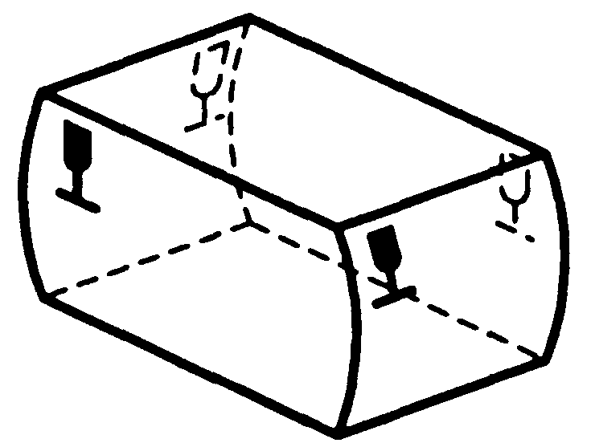
</td>
    <td>
A
</td>
    <td>
检查外箱易碎标志的位置
</td>
    <td>

</td>
    <td>

</td>
    <td>
外箱符合要求
</td>
    <td>

</td>
  </tr>
  <tr>
    <td>
b)
</td>
    <td>
Symbol No. 3.3, “This way up”, shall appear in the same position as required for symbol No. 3.1 [see example of a) under No.3. 3 in Table 1]. Where both symbols are required, symbol No. 3 shall appear nearer to the corner/标志3.3“向上”应标在与标志3.1相同的位置。当标志3.1和标志3.3同时使用时，标志3.3应更接近包装箱角
</td>
    <td>
A
</td>
    <td>
检查外箱向上标志的位置
</td>
    <td>

</td>
    <td>

</td>
    <td>
外箱符合要求
</td>
    <td>

</td>
  </tr>
  <tr>
    <td>
c)
</td>
    <td>
Symbol No.3. 7, Where possible, “Centre of gravity” shall be placed on all six sides but at least on the four lateral sides relating to the actual location of the centre of gravity/标志3.7“重心”应尽可能标在包装所有六个面的中心位置上，否则至少也应标在包装件2个侧面和2个端面上 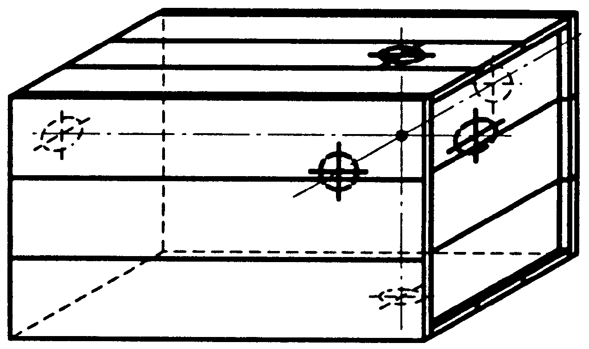
</td>
    <td>
NA
</td>
    <td>
——
</td>
    <td>
——
</td>
    <td>
——
</td>
    <td>
——
</td>
    <td>
——
</td>
  </tr>
  <tr>
    <td>
d)
</td>
    <td>
Symbol No. 11, “Clamp as indicated”./由此夹起
</td>
    <td>
NA
</td>
    <td>
——
</td>
    <td>
——
</td>
    <td>
——
</td>
    <td>
——
</td>
    <td>
——
</td>
  </tr>
  <tr>
    <td>
1)
</td>
    <td>
Only appropriately marked packages should be handled by clamps./只能用于可夹持的包装件上
</td>
    <td>
——
</td>
    <td>
——
</td>
    <td>
——
</td>
    <td>
——
</td>
    <td>
——
</td>
    <td>
——
</td>
  </tr>
  <tr>
    <td>
2)
</td>
    <td>
The symbol shall be positioned on two opposite faces of the package so that it is in the visual range of the clamp truck operator when approaching to carry out operation./标注位置应为可夹持位置的两个相对面上，以确保作业时标志在作业人员的实现范围内
</td>
    <td>
——
</td>
    <td>
——
</td>
    <td>
——
</td>
    <td>
——
</td>
    <td>
——
</td>
    <td>
——
</td>
  </tr>
  <tr>
    <td>

</td>
    <td>
The symbol shall not be marked on those faces of
the package intended to be gripped by the
clamps.
</td>
    <td>
——
</td>
    <td>
——
</td>
    <td>
——
</td>
    <td>
——
</td>
    <td>
——
</td>
    <td>
——
</td>
  </tr>
  <tr>
    <td>
e)
</td>
    <td>
Symbol No.3. 16, “Sling here”, shall be placed on at least two opposite faces of the package/标志3.16“由此吊起”至少应标注在包装件的两个相对面上 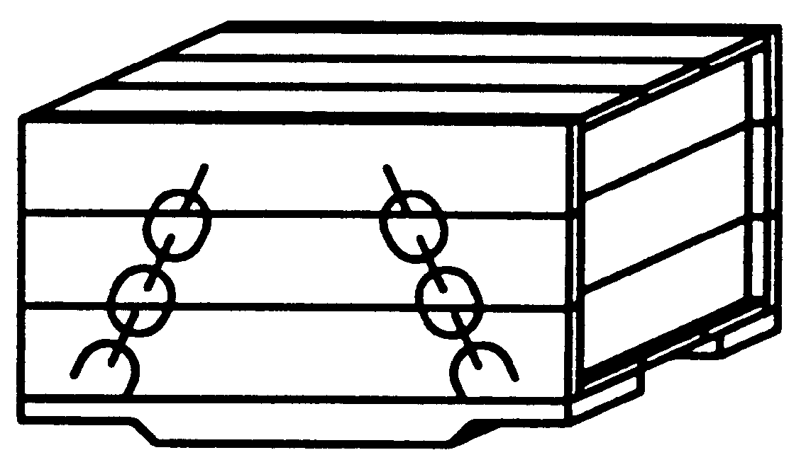
</td>
    <td>
NA
</td>
    <td>
——
</td>
    <td>
——
</td>
    <td>
——
</td>
    <td>
——
</td>
    <td>
——
</td>
  </tr>
  <tr>
    <td>
2.4.2
</td>
    <td>
When transport packages are formed into a
unit load, symbols shall be located so as to ensure
they are visible.
</td>
    <td>
A
</td>
    <td>
检查外箱的标志是否明显
</td>
    <td>

</td>
    <td>

</td>
    <td>
外箱符合要求
</td>
    <td>

</td>
  </tr>
  <tr>
    <td>
2.4.3
</td>
    <td>
Particular attention shall be paid to the correct application of the symbols, as faulty application may lead to misinterpretation./特别注意的是一定要正确应用标志，错误应用可能会导致误解
</td>
    <td>
A
</td>
    <td>
检查外箱的标志是否使用正确
</td>
    <td>

</td>
    <td>

</td>
    <td>
外箱符合要求
</td>
    <td>

</td>
  </tr>
  <tr>
    <td>

</td>
    <td>
Symbols No. 7 and No. 16 shall be applied in their
correct respective positions and in appropriate
respective places in order to convey the meaning
clearly and fully.
</td>
    <td>
——
</td>
    <td>
——
</td>
    <td>
——
</td>
    <td>
——
</td>
    <td>
——
</td>
    <td>
——
</td>
  </tr>
  <tr>
    <td>
2.4.4
</td>
    <td>
In symbol No. 3.14, “Stacking limitations by number”, n indicates the maximum number of packages stacked./标志3.14，“堆码层数极限”，n表示包装堆叠的最大数
</td>
    <td>
A
</td>
    <td>
——
</td>
    <td>
——
</td>
    <td>
——
</td>
    <td>
——
</td>
    <td>
——
</td>
  </tr>
  <tr>
    <td>
3
</td>
    <td>
Handling instructions 
</td>
    <td>
——
</td>
    <td>
——
</td>
    <td>
——
</td>
    <td>
——
</td>
    <td>
——
</td>
    <td>
——
</td>
  </tr>
  <tr>
    <td>
3.1
</td>
    <td>
FRAGILE /易碎物品 
</td>
    <td>
A
</td>
    <td>
检查外箱
</td>
    <td>

</td>
    <td>

</td>
    <td>
外箱有此标识
</td>
    <td>

</td>
  </tr>
  <tr>
    <td>
3.2
</td>
    <td>
USE NO HAND HOOKS / 禁用手钩 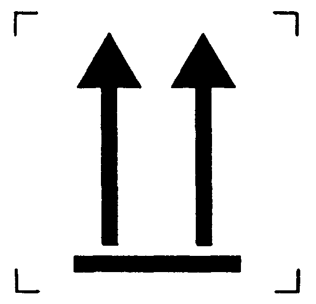
</td>
    <td>
NA
</td>
    <td>
——
</td>
    <td>
——
</td>
    <td>
——
</td>
    <td>
——
</td>
    <td>
——
</td>
  </tr>
  <tr>
    <td>
3.3
</td>
    <td>
THIS WAY UP /向上 
</td>
    <td>
A
</td>
    <td>
检查外箱
</td>
    <td>

</td>
    <td>

</td>
    <td>
外箱有此标识
</td>
    <td>

</td>
  </tr>
  <tr>
    <td>
3.4
</td>
    <td>
KEEP AWAY FROM SUNLIGHT/ 怕晒
</td>
    <td>
NA
</td>
    <td>
——
</td>
    <td>
——
</td>
    <td>
——
</td>
    <td>
——
</td>
    <td>
——
</td>
  </tr>
  <tr>
    <td>
3.5
</td>
    <td>
PROTECT FROM RADIOACTIVE SOURCES/怕辐射  
</td>
    <td>
NA
</td>
    <td>
——
</td>
    <td>
——
</td>
    <td>
——
</td>
    <td>
——
</td>
    <td>
——
</td>
  </tr>
  <tr>
    <td>
3.6
</td>
    <td>
KEEP AWAY FROM RAIN/ 怕雨 
</td>
    <td>
A
</td>
    <td>
检查外箱
</td>
    <td>

</td>
    <td>

</td>
    <td>
外箱有此标识
</td>
    <td>

</td>
  </tr>
  <tr>
    <td>
3.7
</td>
    <td>
CENTRE OF GRAVITY/重心 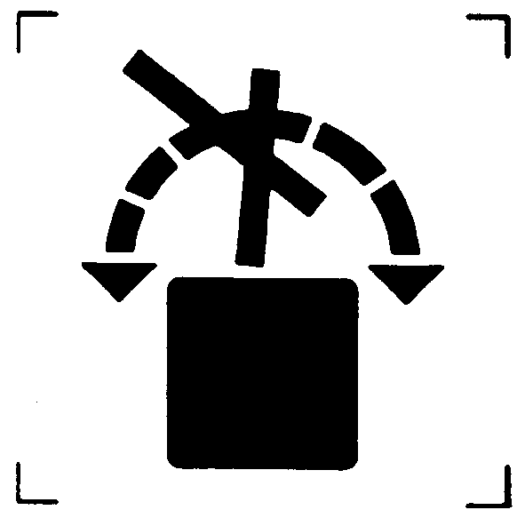
</td>
    <td>
NA
</td>
    <td>
——
</td>
    <td>
——
</td>
    <td>
——
</td>
    <td>
——
</td>
    <td>
——
</td>
  </tr>
  <tr>
    <td>
3.8
</td>
    <td>
DO NOT ROLL/禁止翻滚
</td>
    <td>
NA
</td>
    <td>
——
</td>
    <td>
——
</td>
    <td>
——
</td>
    <td>
——
</td>
    <td>
——
</td>
  </tr>
  <tr>
    <td>
3.9
</td>
    <td>
DO NOT USE HAND TRUCK HERE/此面禁用手推车  
</td>
    <td>
NA
</td>
    <td>
——
</td>
    <td>
——
</td>
    <td>
——
</td>
    <td>
——
</td>
    <td>
——
</td>
  </tr>
  <tr>
    <td>
3.1
</td>
    <td>
USE NO FORKS/禁用叉车 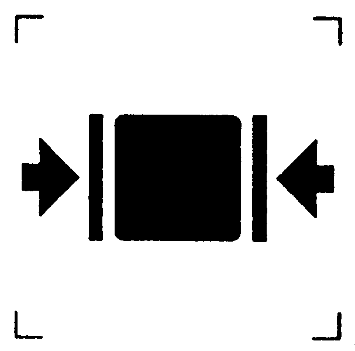
</td>
    <td>
NA
</td>
    <td>
——
</td>
    <td>
——
</td>
    <td>
——
</td>
    <td>
——
</td>
    <td>
——
</td>
  </tr>
  <tr>
    <td>
3.11
</td>
    <td>
CLAMP AS INDICATED/由此夹起 
</td>
    <td>
NA
</td>
    <td>
——
</td>
    <td>
——
</td>
    <td>
——
</td>
    <td>
——
</td>
    <td>
——
</td>
  </tr>
  <tr>
    <td>
3.12
</td>
    <td>
DO NOT CLAMP AS INDICATED/此处不能卡夹 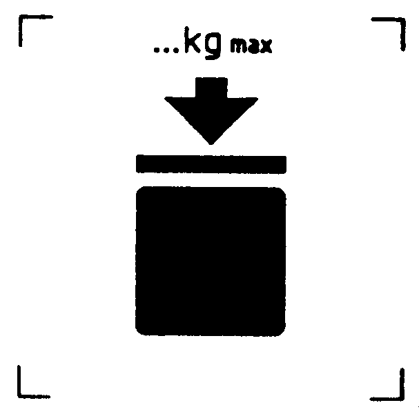
</td>
    <td>
NA
</td>
    <td>
——
</td>
    <td>
——
</td>
    <td>
——
</td>
    <td>
——
</td>
    <td>
——
</td>
  </tr>
  <tr>
    <td>
3.13
</td>
    <td>
STACKING LIMIT BY MASS/堆码质量极限
</td>
    <td>
NA
</td>
    <td>
——
</td>
    <td>
——
</td>
    <td>
——
</td>
    <td>
——
</td>
    <td>
——
</td>
  </tr>
  <tr>
    <td>
3.14
</td>
    <td>
STACKING LIMIT BY NUMBER/堆码层数极限 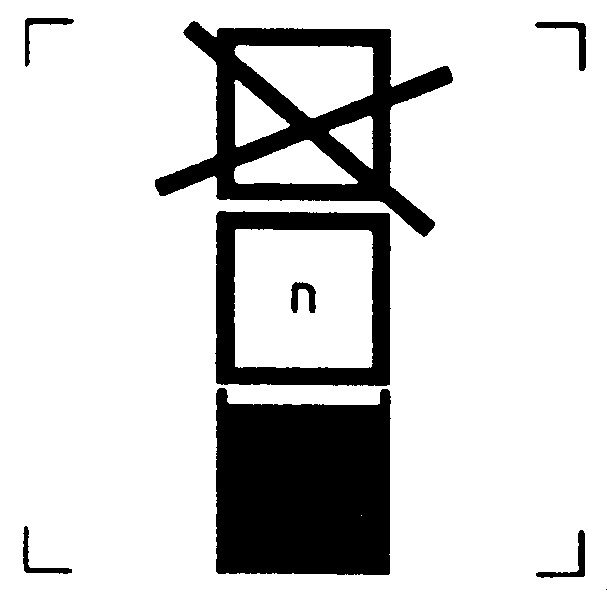
</td>
    <td>
A
</td>
    <td>
检查外箱
</td>
    <td>

</td>
    <td>

</td>
    <td>
外箱有此标识
</td>
    <td>

</td>
  </tr>
  <tr>
    <td>
3.15
</td>
    <td>
DO NOT STACK/禁止堆码 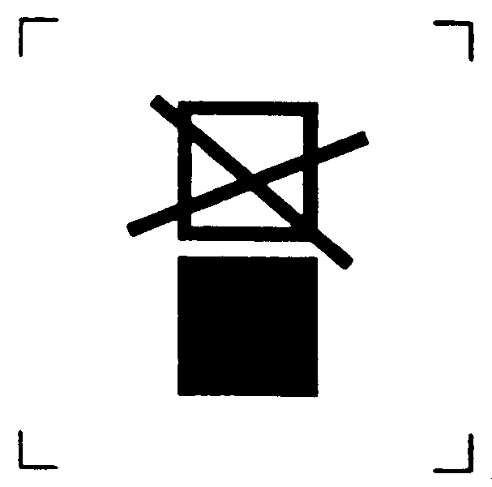 
</td>
    <td>
NA
</td>
    <td>
——
</td>
    <td>
——
</td>
    <td>
——
</td>
    <td>
——
</td>
    <td>
——
</td>
  </tr>
  <tr>
    <td>
3.16
</td>
    <td>
SLING HERE/由此吊起 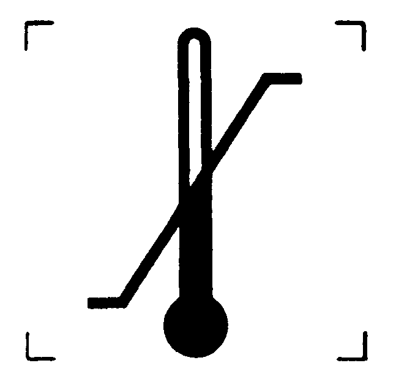
</td>
    <td>
NA
</td>
    <td>
——
</td>
    <td>
——
</td>
    <td>
——
</td>
    <td>
——
</td>
    <td>
——
</td>
  </tr>
  <tr>
    <td>
3.17
</td>
    <td>
TEMPERATURE LIMITS/温度极限
</td>
    <td>
A
</td>
    <td>
检查外箱
</td>
    <td>

</td>
    <td>

</td>
    <td>
外箱有此标识
</td>
    <td>

</td>
  </tr>
</table>

<table>
  <tr>
    <th colspan="8">
标签检查报告（FCC PART 15部分）
</th>
  </tr>
  <tr>
    <td colspan="8">
拟制:                         年  月  日         审核:                               年  月  日  
</td>
  </tr>
  <tr>
    <td colspan="8">
产品型号：  PT9L                  项目编号： 2024-002-WX02                     产品/项目名称：红外体温计
</td>
  </tr>
  <tr>
    <td colspan="8">
TITLE 47--Telecommunication CHAPTER I--FEDERAL COMMUNICATIONS COMMISSION
SUBCHAPTER A--GENERAL     FCC PART 15 --RADIO FREQUENCY DEVICES
</td>
  </tr>
  <tr>
    <td rowspan="2">
<strong>Clause NO. </strong>条款号
</td>
    <td rowspan="2">
<strong>Description, Requirement/</strong>描述或要求
</td>
    <td>
<strong>Applicable</strong>适用性
</td>
    <td rowspan="2">
<strong>Verification method </strong>验证方法
</td>
    <td colspan="2">
<strong>Compliance/</strong>符合性
</td>
    <td rowspan="2">
<strong>Verification annal </strong>验证记录
</td>
    <td rowspan="2">
<strong>Comments/</strong>备注
</td>
  </tr>
  <tr>
    <td>
A
</td>
    <td>
OK
</td>
    <td>
Fail
</td>
  </tr>
  <tr>
    <td>
15.19
</td>
    <td>
 Labelling requirements 标签要求
</td>
    <td>
——
</td>
    <td>
——
</td>
    <td>
——
</td>
    <td>
——
</td>
    <td>
——
</td>
    <td>

</td>
  </tr>
  <tr>
    <td>
(a)
</td>
    <td>
 In addition to the requirements in part 2 of this chapter, a device subject to certification, or verification shall be labelled as follows:
除本章第2部分的要求外，需认证或验证的装置应贴上如下标签：
</td>
    <td>
——
</td>
    <td>
——
</td>
    <td>
——
</td>
    <td>
——
</td>
    <td>
——
</td>
    <td>
非DOC认证方式均需要符合
</td>
  </tr>
  <tr>
    <td>

</td>
    <td>
(1) Receivers associated with the operation of a licensed radio service, e.g., FM broadcast under part 73 of this chapter, land mobile operation under part 90, etc., shall bear the following statement in a conspicuous location on the device:
This device complies with part 15 of the FCC Rules. Operation is subject to the condition that this device does not cause harmful interference.
</td>
    <td>
N/A
</td>
    <td>
——
</td>
    <td>
——
</td>
    <td>
——
</td>
    <td>
——
</td>
    <td>
——
</td>
  </tr>
  <tr>
    <td>

</td>
    <td>
(2) A stand-alone cable input selector switch, shall bear the following statement in a conspicuous location on the device:
This device is verified to comply with part 15 of the FCC Rules for use with cable television service.
</td>
    <td>
N/A
</td>
    <td>
——
</td>
    <td>
——
</td>
    <td>
——
</td>
    <td>
——
</td>
    <td>
——
</td>
  </tr>
  <tr>
    <td>

</td>
    <td>
(3) All other devices shall bear the following statement in a conspicuous location on the device:
This device complies with part 15 of the FCC Rules. Operation is subject to the following two conditions: (1) This device may not cause harmful interference, and (2) this device must accept any interference received, including interference that may cause undesired operation.
</td>
    <td>
A
</td>
    <td>
检查说明书
</td>
    <td>
OK
</td>
    <td>

</td>
    <td>
Notice
19
</td>
    <td>
FCC警示语
</td>
  </tr>
  <tr>
    <td>

</td>
    <td>
(4) Where a device is constructed in two or more sections connected by wires and marketed together, the statement specified under paragraph (a) of this section is required to be affixed only to the main control unit.
</td>
    <td>
N/A
</td>
    <td>
——
</td>
    <td>
——
</td>
    <td>
——
</td>
    <td>
——
</td>
    <td>
——
</td>
  </tr>
  <tr>
    <td>

</td>
    <td>
(5) When the device is so small or for such use that it is not practicable to place the statement specified under paragraph (a) of this section on it, the information required by this paragraph shall be placed in a prominent location in the instruction manual or pamphlet supplied to the user or, alternatively, shall be placed on the container in which the device is marketed. However, the FCC identifier or the unique identifier, as appropriate, must be displayed on the device.
</td>
    <td>
N/A
</td>
    <td>
——
</td>
    <td>
——
</td>
    <td>
——
</td>
    <td>
——
</td>
    <td>
——
</td>
  </tr>
  <tr>
    <td>
(b) 
</td>
    <td>
Products subject to authorization under a Declaration of Conformity shall be labelled as follows:
符合性声明授权的产品应贴上如下标签：
</td>
    <td>
——
</td>
    <td>
——
</td>
    <td>

</td>
    <td>

</td>
    <td>
——
</td>
    <td>
仅DOC方式适用,目前USB功能的测试机构均按此方式进行
</td>
  </tr>
  <tr>
    <td>

</td>
    <td>
(1) The label shall be located in a conspicuous location on the device and shall contain the unique identification described in §2.1074 of this chapter and the following logo:
</td>
    <td>
——
</td>
    <td>
——
</td>
    <td>

</td>
    <td>

</td>
    <td>
——
</td>
    <td>
——
</td>
  </tr>
  <tr>
    <td>

</td>
    <td>
(i) If the product is authorized based on testing of the product or system; or

 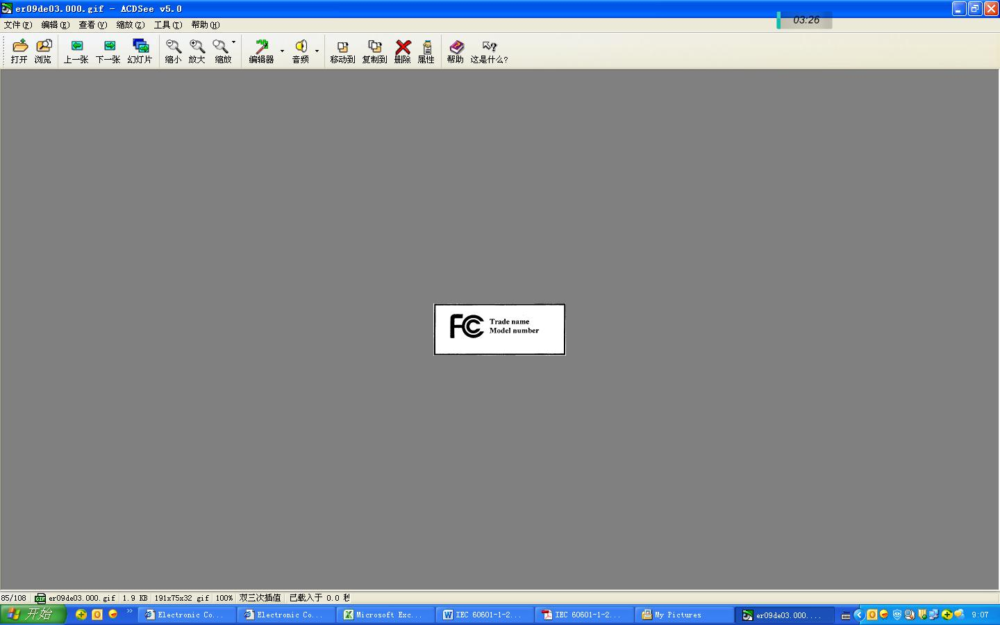
</td>
    <td>
N/A
</td>
    <td>
——
</td>
    <td>

</td>
    <td>

</td>
    <td>
——
</td>
    <td>
——
</td>
  </tr>
  <tr>
    <td>

</td>
    <td>
(ii) If a personal computer is authorized based on assembly using separately authorized components, in accordance with §15.101(c)(2) or (c)(3), and the resulting product is not separately tested:

 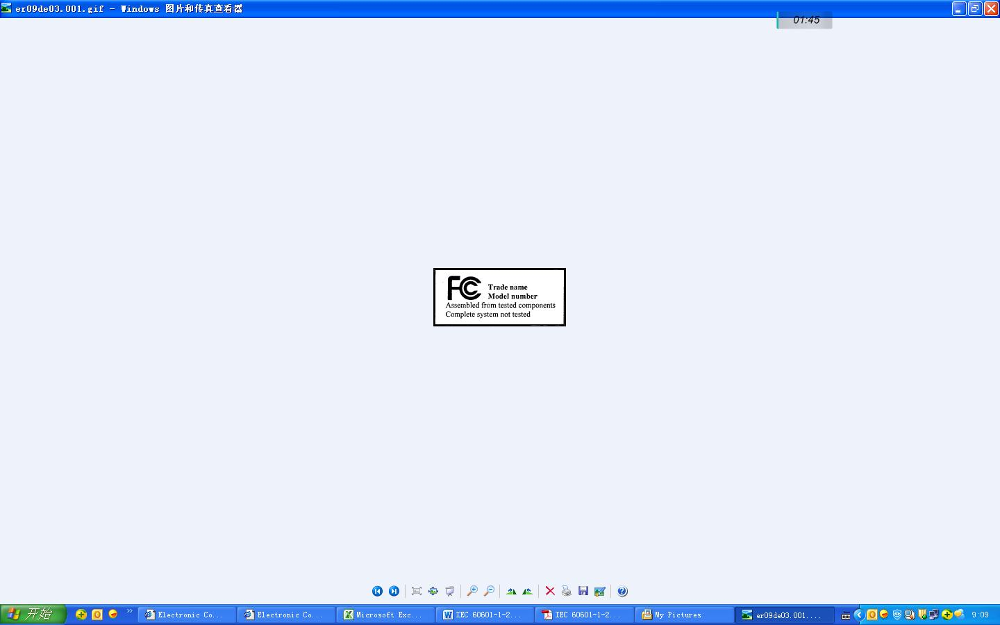
</td>
    <td>
N/A
</td>
    <td>
——
</td>
    <td>

</td>
    <td>

</td>
    <td>
——
</td>
    <td>
——
</td>
  </tr>
  <tr>
    <td>

</td>
    <td>
(2) Label text and information should be in a size of type large enough to be readily legible, consistent with the dimensions of the equipment and the label. However, the type size for the text is not required to be larger than eight point.
</td>
    <td>
N/A
</td>
    <td>
——
</td>
    <td>

</td>
    <td>

</td>
    <td>
——
</td>
    <td>
——
</td>
  </tr>
  <tr>
    <td>

</td>
    <td>
(3) When the device is so small or for such use that it is not practicable to place the statement specified under paragraph (b)(1) of this section on it, such as for a CPU board or a plug-in circuit board peripheral device, the text associated with the logo may be placed in a prominent location in the instruction manual or pamphlet supplied to the user. However, the unique identification (trade name and model number) and the logo must be displayed on the device.
</td>
    <td>
N/A
</td>
    <td>
——
</td>
    <td>

</td>
    <td>

</td>
    <td>
——
</td>
    <td>
——
</td>
  </tr>
  <tr>
    <td>

</td>
    <td>
(4) The label shall not be a stick-on, paper label. The label on these products shall be permanently affixed to the product and shall be readily visible to the purchaser at the time of purchase, as described in §2.925(d) of this chapter. “Permanently affixed” means that the label is etched, engraved, stamped, silkscreened, indelibly printed, or otherwise permanently marked on a permanently attached part of the equipment or on a nameplate of metal, plastic, or other material fastened to the equipment by welding, riveting, or a permanent adhesive. The label must be designed to last the expected lifetime of the equipment in the environment in which the equipment may be operated and must not be readily detachable.
标签不得为粘贴式纸质标签。这些产品上的标签应永久贴在产品上，并应在购买时随时可见，如中所述§本章第2.925（d）款。”永久粘贴”是指标签蚀刻、雕刻、压印、丝网印刷、不可擦除印刷或以其他方式永久标记在设备的永久连接部分或金属、塑料或其他材料的铭牌上，通过焊接、铆接或永久粘合剂固定在设备上。标签的设计必须确保在设备可能运行的环境中，设备的预期使用寿命，并且不得轻易拆卸。
</td>
    <td>
A
</td>
    <td>
检查铭牌
</td>
    <td>
OK
</td>
    <td>

</td>
    <td>

</td>
    <td>
材质为PET
</td>
  </tr>
  <tr>
    <td>
©
</td>
    <td>
 [Reserved]
</td>
    <td>
——
</td>
    <td>
——
</td>
    <td>

</td>
    <td>

</td>
    <td>
——
</td>
    <td>
——
</td>
  </tr>
  <tr>
    <td>
(d)
</td>
    <td>
 Consumer electronics TV receiving devices, including TV receivers, videocassette recorders, and similar devices, that incorporate features intended to be used with cable television service, but do not fully comply with the technical standards for cable ready equipment set forth in §15.118, shall not be marketed with terminology that describes the device as “cable ready” or “cable compatible,” or that otherwise conveys the impression that the device is fully compatible with cable service. Factual statements about the various features of a device that are intended for use with cable service or the quality of such features are acceptable so long as such statements do not imply that the device is fully compatible with cable service. Statements relating to product features are generally acceptable where they are limited to one or more specific features of a device, rather than the device as a whole. This requirement applies to consumer TV receivers, videocassette recorders and similar devices manufactured or imported for sale in this country on or after October 31, 1994.
</td>
    <td>
N/A
</td>
    <td>
——
</td>
    <td>

</td>
    <td>

</td>
    <td>
——
</td>
    <td>
——
</td>
  </tr>
  <tr>
    <td>
15.21
</td>
    <td>
The users manual or instruction manual for an intentional or unintentional radiator shall caution the user that changes or modifications not expressly approved by the party responsible for compliance could void the user&#x27;s authority to operate the equipment. In cases where the manual is provided only in a form other than paper, such as on a computer disk or over the Internet, the information required by this section may be included in the manual in that alternative form, provided the user can reasonably be expected to have the capability to access information in that form.有意或无意散热器的用户手册或说明手册应提醒用户，未经合规责任方明确批准的更改或修改可能会使用户失去操作设备的权限。如果手册仅以纸张以外的形式提供，例如在计算机磁盘或互联网上提供，则本节要求的信息可以该替代形式包含在手册中，前提是可以合理预期用户能够访问该形式的信息。
</td>
    <td>
N/A
</td>
    <td>
——
</td>
    <td>

</td>
    <td>

</td>
    <td>
——
</td>
    <td>
——
</td>
  </tr>
  <tr>
    <td>

</td>
    <td>
For a Class B digital device or peripheral, the instructions furnished the user shall include the following or similar statement, placed in a prominent location in the text of the manual: 
NOTE: This equipment has been tested and found to comply with the limits for a Class B digital device, pursuant to part 15 of the FCC Rules. These limits are designed to provide reasonable protection against harmful interference in a residential installation. 
This equipment generates, uses and can radiate radio frequency energy and, if not installed and used in accordance with the instructions, may cause harmful interference to radio communications. However, there is no guarantee that interference will not occur in a particular installation. If this equipment does cause harmful interference to radio or television reception, which can be determined by turning the equipment off and on, the user is encouraged to try to correct the interference by one or more of the following measures: 
—Reorient or relocate the receiving antenna. 
—Increase the separation between the equipment and receiver. 
—Connect the equipment into an outlet on a 
circuit different from that to which the receiver is connected. 
—Consult the dealer or an experienced radio/ 
TV technician for help.
</td>
    <td>
N/A
</td>
    <td>
——
</td>
    <td>

</td>
    <td>

</td>
    <td>
——
</td>
    <td>
——
</td>
  </tr>
</table>