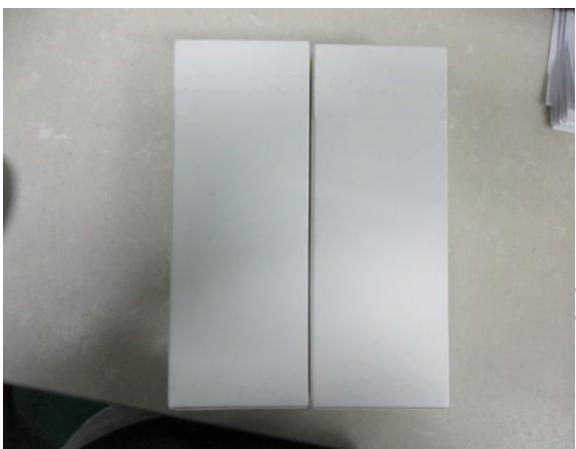

送检公司：东莞市上合旺盈印刷有限公司营业七部高志

送检公司地址：东莞市东城区主山振兴路329号旺盈工业园

以下测试样品是由申请者提供及确认：红外体温计

样品编号 :NA

批号 :NA

订单/工程单号 :NA

供应商 :NA

送检数量 :2PCS

客户名称/代码 :A1939

样品接收日期 :2017.06.05

测试周期 :2017.06.05-2017.06.08

测试方法 :请参见下一页

<table><tr><td colspan="3">测试要求</td><td rowspan="2">结果</td></tr><tr><td colspan="2">参考标准</td><td>测试项目</td></tr><tr><td>1</td><td>客户要求</td><td>冷热循环</td><td>合格</td></tr></table>

更多测试细节请参考以下页面

\*\*\*\*\*\*\*\*\*\*\*\*\*\*\*\*\*\*\*\*\*\*\*\*\*\*\*\*\*\*\*\*\*\*\*\*\*\*\*\*\*\*\*\*\*\*\*\*\*\*\*\*\*\*\*\*\*\*\*\*\*\*\*\*\*\*\*\*\*\*\*\*\*\*\*\*\*\*\*\*\*\*\*\*\*\*\*\*\*\*

旺盈彩盒纸品有限公司实验室授权以下人员测试并签核本报告

测试：段礼鹏

text_image

旺盈彩盒纸品有限公司
审核 朱刚
物理实验室

# 1、冷热循环测试

将测试产品放置恒温恒湿试验机内，温度56℃，湿度85%RH测试48小时，然后温度为-30℃，测试24小时，测试完毕后的样品取出置于室温25℃±5℃，湿度50-85%中回温4H后评估产品。

判定标准：测试后样品表面无起泡、无假粘、无开胶、无变形或其它不良。

样品数量: 2PCS

结果描述：按照标准测试后样品无开胶、无假粘现象、测试结果判定为合格。

测试图片:

natural_image

Two plain white rectangular panels placed on a light surface, no text or symbols visible.

\*\*\*\*\*\*\*\*\*\*\*\*\*\*\*\*\*\*\*\*\*\*\*\*\*\*\*\*\*\*报告结束\*\*\*\*\*\*\*\*\*\*\*\*\*\*\*\*\*\*\*\*\*\*\*\*\*\*\*\*\*\*