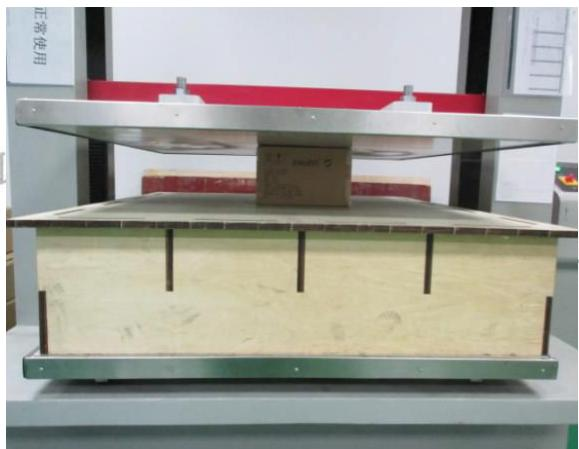
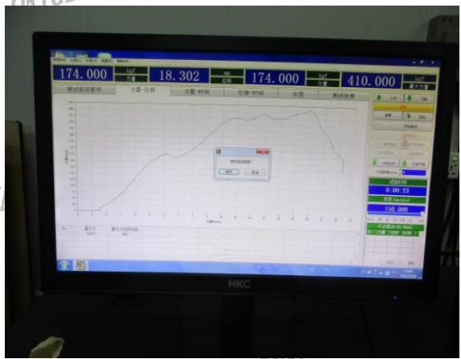

送检公司：东莞市上合旺盈印刷有限公司营业七部付汉清

送检公司地址：东莞市东城区主山振兴路329号旺盈工业园

以下测试样品是由申请者提供及确认：红外体温计

样品编号 :NA

批号 :NA

订单/工程单号 :NA

供应商 :NA

送检数量 :1PCS

客户名称/代码 :A1939

样品接收日期 :2017.07.18

测试周期 :2017.07.18-2017.07.18

测试方法 :请参见下一页

<table><tr><td colspan="3">测试要求</td><td rowspan="2">结果</td></tr><tr><td colspan="2">参考标准</td><td>测试项目</td></tr><tr><td>1</td><td>客户要求</td><td>抗压</td><td>合格</td></tr></table>

更多测试细节请参考以下页面

旺盈彩盒纸品有限公司实验室授权以下人员测试并签核本报告

测试: 蔡建川

text_image

XinXin Paper Co., Ltd.
审核: 许刚
物理实验室

报告日期：2017.07.18

Test Report

Report No:VQA2017071822

# 1、抗压测试：

# 参数:

试验设备：微电脑抗压试验仪; 型号: HD-A505S-1500

压力方向：顶面—底面

速度 : 12.7mm/min

试验环境： $25 \pm 5^{\circ} \mathrm{C}$ ； $65 \pm 15 \% \mathrm{RH}$

测试结果: 

<table><tr><td>样品编号</td><td>标准值(KGF)</td><td>测试值(KGF)</td><td>判定</td></tr><tr><td>1</td><td>130</td><td>410</td><td>合格</td></tr></table>

测试图片:  

natural_image

Experimental setup with a metal frame and a cardboard box on a wooden base, no visible text or symbols

line

| 时间       | 数值   |
| ---------- | ------ |
| 0          | 174.000 |
| 1          | 18.302 |
| 2          | 174.000 |
| 3          | 410.000 |
| 4          |        |

\*\*\*\*\*\*\*\*\*\*\*\*\*\*\*\*\*\*\*\*\*\*\*\*\*\*\*\*\*\*\*\*\*\*\*\*\*\*\*\*\*\*\*\*\*\*\*\*\*\*\*\*\*\*\*\*\*\*\*\*\*\*\*\*\*\*\*\*\*\*报告结束\*\*\*\*\*\*\*\*\*\*\*\*\*\*\*\*\*\*\*\*\*\*\*\*\*\*\*\*\*\*\*\*\*\*\*\*\*\*\*\*\*\*\*\*\*\*\*\*\*\*\*\*\*\*\*\*\*\*\*\*\*\*\*\*\*\*\*\*\*\*