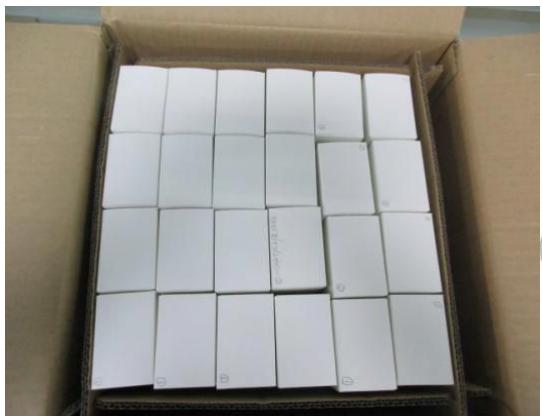
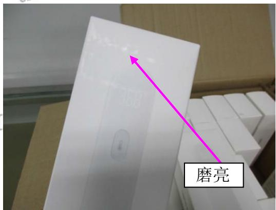

报告日期：2017.06.27

Test Report

Report No:2017062725

送检公司：东莞市上合旺盈印刷有限公司营业七部付汉清

送检公司地址：东莞市东城区主山振兴路329号旺盈工业园

以下测试样品是由申请者提供及确认：红外体温计

样品编号 :NA

批号 :NA

订单/工程单号 :NA

供应商 : NA

送检数量 :1箱

客户名称/代码 :A1939

样品接收日期 :2017.06.27

测试周期 :2017.06.27-2017.06.27

测试方法 :请参见下一页

<table><tr><td colspan="3">测试要求</td><td rowspan="2">结果</td></tr><tr><td colspan="2">参考标准</td><td>测试项目</td></tr><tr><td>1</td><td>客户要求</td><td>模拟运输</td><td>供参考</td></tr></table>

更多测试细节请参考以下页面

\*\*\*\*\*\*\*\*\*\*\*\*\*\*\*\*\*\*\*\*\*\*\*\*\*\*\*\*\*\*\*\*\*\*\*\*\*\*\*\*\*\*\*\*\*\*\*\*\*\*\*\*\*\*\*\*\*\*\*\*\*\*\*\*\*\*\*\*\*\*\*\*\*\*\*\*\*\*\*\*\*\*\*\*\*\*\*\*\*\*

旺盈彩盒纸品有限公司实验室授权以下人员测试并签核本报告

测试：杨汝圭

text_image

Box Plot Paper Co., Ltd.
审核:宋刚
物理实验室

报告日期：2017.06.27

Test Report

Report No:2017062725

1、模拟运输测试：

<table><tr><td colspan="2">测试条件</td><td>重量</td><td>备注</td></tr><tr><td>环境</td><td>25±5°C;65±15%RH</td><td rowspan="3">NA</td><td rowspan="3">/</td></tr><tr><td>频率</td><td>200cycles</td></tr><tr><td>时间</td><td>3个面每个面测试1小时。</td></tr></table>

判定标准：测试后包装表面无擦花、掉色现象，产品无破损现象。

样品数量: 1箱

结果描述：按照标准测试后箱内样品出现磨花现象，测试结果仅供参考。

测试图片:

natural_image

Open cardboard box containing a grid of white rectangular blocks (no visible text or symbols)

text_image

磨亮

\*\*\*\*\*\*\*\*\*\*\*\*\*\*\*\*\*\*\*\*\*\*\*\*\*\*\*\*\*\*报告结束\*\*\*\*\*\*\*\*\*\*\*\*\*\*\*\*\*\*\*\*\*\*\*\*\*\*\*\*\*\*