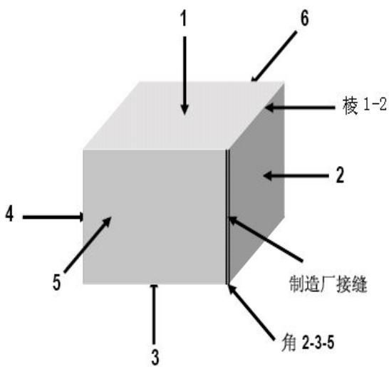
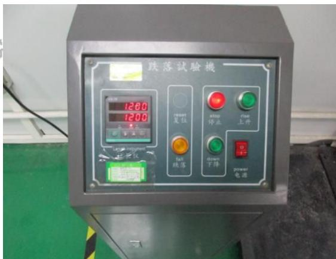
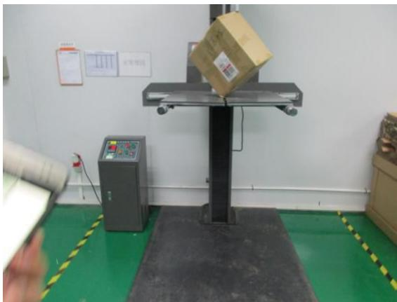
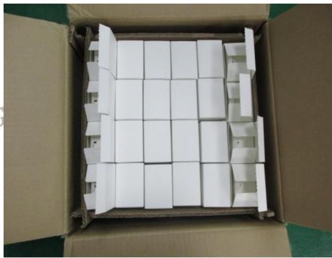
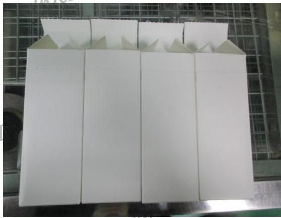
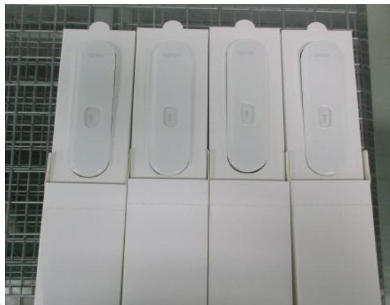
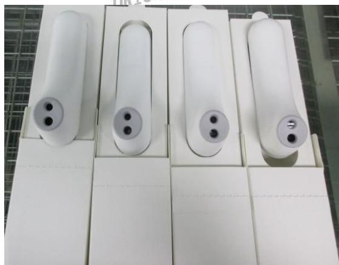

送检公司：东莞市上合旺盈印刷有限公司营业七部高志

送检公司地址：东莞市东城区主山振兴路329号旺盈工业园

以下测试样品是由申请者提供及确认：红外体温计

样品编号 :NA

批号 :NA

订单/工程单号 :NA

供应商 :NA

送检数量 :1箱

客户名称/代码 :A1939

样品接收日期 :2017.06.13

测试周期 :2017.06.13-2017.06.13

测试方法 :请参见下一页

<table><tr><td colspan="3">测试要求</td><td rowspan="2">结果</td></tr><tr><td colspan="2">参考标准</td><td>测试项目</td></tr><tr><td>1</td><td>客户要求</td><td>跌落</td><td>合格</td></tr></table>

更多测试细节请参考以下页面

旺盈彩盒纸品有限公司实验室授权以下人员测试并签核本报告

测试：杨汝圭

text_image

任盈彩盒纸品有限公司
Voion
审核:宋刚
物理实验室

# 1、跌落测试：

测试方法:

将样品放置跌落测试仪上，根据产品毛重选择所需高度，依次顺序测试。测试结束后检查产纸箱及内卡、客户产品。

<table><tr><td>测试顺序</td><td>高度</td><td>重量</td><td>测试部位描述</td></tr><tr><td>角</td><td>1200MM</td><td rowspan="10">NA</td><td rowspan="10"></td></tr><tr><td>棱1</td><td>1200MM</td></tr><tr><td>棱2</td><td>1200MM</td></tr><tr><td>棱3</td><td>1200MM</td></tr><tr><td>面1</td><td>1200MM</td></tr><tr><td>面2</td><td>1200MM</td></tr><tr><td>面3</td><td>1200MM</td></tr><tr><td>面4</td><td>1200MM</td></tr><tr><td>面5</td><td>1200MM</td></tr><tr><td>面6</td><td>1200MM</td></tr></table>

判定标准：测试后样品包装不存在破损现象，产品结构功能无损坏。

样品数量: 1箱

结果描述：按照标准测试后箱内样品无破损现象，测试结果判定为合格。

测试图片:

text_image

跌落試驗機
1200
1200
reset
复位
stop
停止
rise
上升
down
下降
power
电源

natural_image

Interior view of a warehouse or testing facility showing a cardboard box on a platform, with no visible text or symbols.

报告日期：2017.06.13

Test Report

Report No:2017061324

natural_image

Open cardboard box containing a grid of white paper blocks (no text or symbols visible)

natural_image

White paper box with folded paper sheets arranged in a grid pattern (no text or symbols visible)

natural_image

Four white electronic devices mounted on white rectangular bases, arranged in a row against a grid-patterned background (no visible text or symbols)

natural_image

Four white cylindrical electronic devices with three black buttons, arranged on white rectangular bases (no visible text or symbols)

\*\*\*\*\*\*\*\*\*\*\*\*\*\*\*\*\*\*\*\*\*\*\*\*\*\*\*\*\*\*报告结束\*\*\*\*\*\*\*\*\*\*\*\*\*\*\*\*\*\*\*\*\*\*\*\*\*\*\*\*\*\*