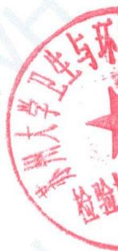
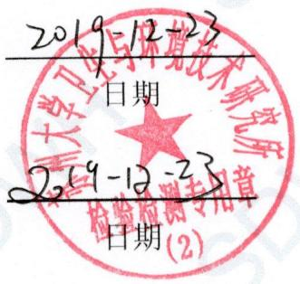
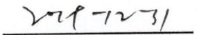
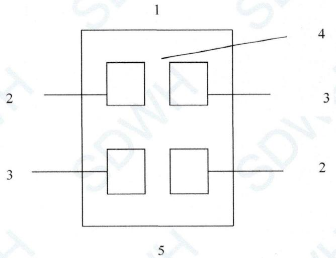
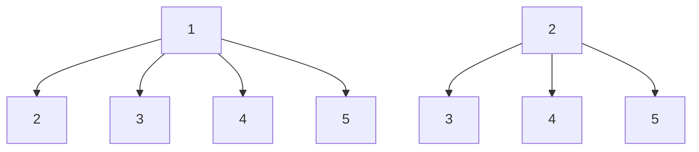
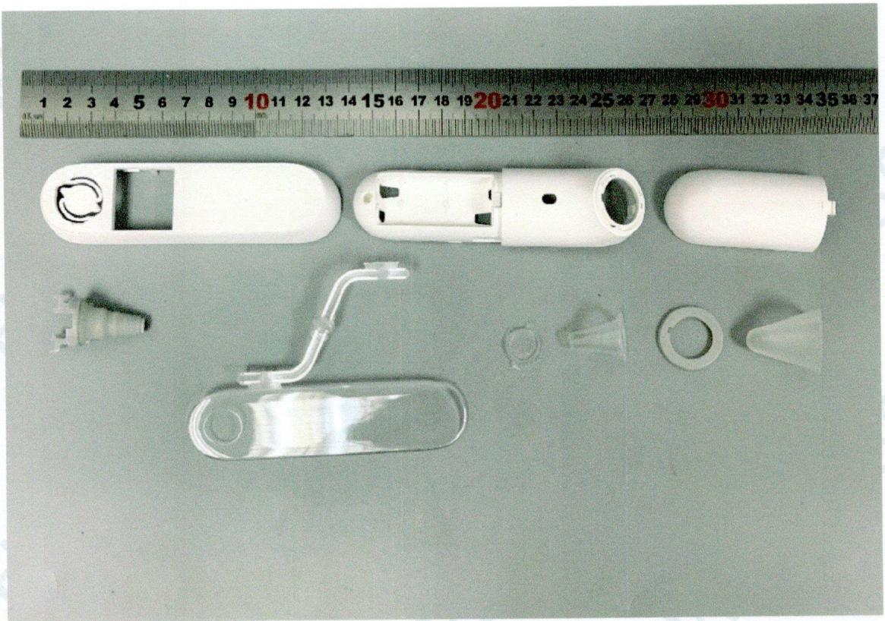
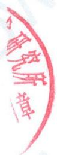

# 最终报告

# 报告编号：SDWH-M201905262-4

# 红外耳温计

# 皮肤刺激试验

# 参照 GB/T 16886.10-2017 0.9%氯化钠注射液浸提

委托单位：天津九安医疗电子股份有限公司

地址：天津市南开区雅安道金平路3号

text_image

中国大学卫生与环保
检验

# 目录

# 检测报告说明....3

# 日期确认 4

# 报告摘要 5

# 检测报告正文 …… 6

1 目的 ……6  
2 参考标准 …… 6  
3 执行规范 ……6   
4 试验和对照样品确定 ……6

4.1 试验样品....6   
4.2 对照样品....6

4.2.1 阴性对照样品 ..... 6  
4.2.2 阳性对照样品 6

5 仪器和试剂 ....7

5.1 仪器设备....7  
5.2 试剂....7

6 试验系统鉴别 ……7  
7 饲养和护理 …… 7  
8 试验系统和给药途径确认 ……7   
9 试验设计 ....8

9.1 浸提液制备 8

9.1.1 样品前处理 8  
9.1.2 样品浸提 8

9.2 试验步骤.....8   
9.3 结果观察....8   
9.4 结果评价....9

10 试验结果 ..... 9

11 结论 9  
12 记录存储....9   
13 保密协议....9  
14 试验偏离声明 ..... 9

附录一 试验数据 ..... 10  
附录二 试验样品照片 …… 11  
附录三 客户提供的资料 …… 12

# 检测报告说明

一、对本报告有异议者，请于收到报告之日起十五天内提出复核申请。   
二、检测报告涂改或无检验检测专用章无效。  
三、检测报告无编制人、审核人及检测报告签发人签字无效。  
四、送样委托检验，本检验检测机构仅对来样负责。  
五、未经本检验检测机构同意，不得部分复制本报告。

日期确认

<table><tr><td>接样日期</td><td>2019-12-04</td></tr><tr><td>试验计划书生效日期</td><td>2019-12-06</td></tr><tr><td>试验操作开始日期</td><td>2019-12-06</td></tr><tr><td>试验操作结束日期</td><td>2019-12-13</td></tr><tr><td>报告完成日期</td><td>2019-12-23</td></tr></table>

编制：陈荣荣

审核：\_\_\_\_
试验负责人

签发：

授权签字人

text_image

2019-12-23
日期
2019-12-23
日期
（2）

日期

苏州大学卫生与环境技术研究所

# 报告摘要

1 试验样品

<table><tr><td>样品名称</td><td>红外耳温计</td></tr><tr><td>制造商</td><td>柯顿(天津)电子医疗器械有限公司</td></tr><tr><td>地址</td><td>天津自贸试验区(空港经济区)航宇路26号</td></tr><tr><td>型号</td><td>PT5</td></tr><tr><td>批号</td><td>未提供</td></tr></table>

# 2 主要参考标准

GB/T 16886.10-2017 医疗器械生物学评价 第 10 部分：刺激与皮肤致敏试验

# 3 试验方法

依据 GB/T 16886.10-2017 医疗器械的生物学评价 第 10 部分：刺激与皮肤致敏试验试验，该试验系统用新西兰兔来检测试验样品浸提液与试验系统直接接触引起的皮肤刺激反应，评价样品潜在的皮肤刺激反应。

试验计划书编号：SDWH-PROTOCOL-M201905262-4。

# 4 结论

在本次试验条件下，试验样品的极性浸提液在兔皮肤反应类型为无刺激作用。

# 检测报告正文

# 1 目的

该试验系统用新西兰兔来检测试验样品浸提液与试验系统直接接触引起的皮肤刺激反应，并类推到人类，但试验结果并不代表样品真正的皮肤刺激反应危险性。

# 2 参考标准

GB/T 16886.10-2017 医疗器械生物学评价 第10部分：刺激与皮肤致敏试验

GB/T 16886.12-2017 医疗器械生物学评价 第 12 部分：样品制备与参照材料

GB/T 16886.2-2011 医疗器械生物学评价 第2部分：动物福利要求

# 3 执行规范

ISO/IEC 17025:2005 检测和校准实验室能力的通用要求（CNAS—CL01《检测和校准实验室能力认可准则》）中国合格评定国家认可委员会 实验室认可 注册号：CNAS L2954。

RB/T 214—2017《检验检测机构资质认定能力评价 检验检测机构通用要求》中国国家认证认可监督管理委员会 检验检测机构资质认定 证书编号：CMA 180015144061。

# 4 试验和对照样品确定

4.1 试验样品

<table><tr><td>样品名称</td><td>红外耳温计</td></tr><tr><td>制造商</td><td>柯顿(天津)电子医疗器械有限公司</td></tr><tr><td>制造商地址</td><td>天津自贸试验区(空港经济区)航宇路26号</td></tr><tr><td>来样原始状态</td><td>未灭菌</td></tr><tr><td>CAS编号</td><td>未提供</td></tr><tr><td>型号</td><td>PT5</td></tr><tr><td>规格</td><td>未提供</td></tr><tr><td>批号</td><td>未提供</td></tr><tr><td>样品材料</td><td>ABS,TPU,PMMA,PP</td></tr><tr><td>包装材质</td><td>塑料袋</td></tr><tr><td>性状</td><td>固体</td></tr><tr><td>颜色</td><td>白色,灰色,透明</td></tr><tr><td>密度</td><td>未提供</td></tr><tr><td>稳定性</td><td>未提供</td></tr><tr><td>溶解度</td><td>不溶于水</td></tr><tr><td>保存条件</td><td>室温</td></tr><tr><td>预期临床用途</td><td>体温测量</td></tr></table>

试验样品信息是由样品委托单位提供。

# 4.2 对照样品

# 4.2.1 阴性对照样品

0.9%氯化钠注射液（SC），保存条件：室温。

# 4.2.2 阳性对照样品

十二烷基硫酸钠（SDS），保存条件：室温。

# 5 仪器和试剂

# 5.1 仪器设备

<table><tr><td>仪器名称</td><td>仪器编号</td><td>校正有效期</td></tr><tr><td>电子秤</td><td>SDWH442</td><td>2020-05-04</td></tr><tr><td>卧式大容量恒温振荡器</td><td>SDWH897</td><td>2020-05-04</td></tr><tr><td>钢直尺</td><td>SDWH463</td><td>2020-07-29</td></tr><tr><td>立式压力蒸汽灭菌器</td><td>SDWH2097</td><td>2020-04-16</td></tr></table>

# 5.2 试剂

<table><tr><td>试剂名称</td><td>供应商</td><td>批号</td></tr><tr><td>0.9%氯化钠注射液(SC)</td><td>广西裕源药业有限公司</td><td>H19082605</td></tr><tr><td>十二烷基硫酸钠</td><td>国药集团化学试剂有限公司</td><td>20181210</td></tr></table>

# 6 试验系统鉴别

种属：新西兰白色纯种大白兔

数量：3 只

性别：雌性

重量：试验开始体重不低于2.0kg

健康状况：健康未使用、初成年，未产且无孕

饲养：按组饲养在笼子内，做好标识编号、试验代号、试验开始日期。

动物鉴别：染色标记

笼子：不锈钢笼子

适应期：在实验环境下7天。

# 7 饲养和护理

动物来源: 苏州高新区镇湖实验动物科技有限公司 [许可证号: SCXK(苏)2015-0007]。

垫料：NA

饲料：实验兔全价颗粒饲料，苏州高新区镇湖实验动物科技有限公司

水：自来水（符合 GB 5749-2006 卫生标准）

室温：18-26℃

相对湿度：30%-70%

光照：每天需要 12 小时光照，全光谱日光灯

人员：检测人员有相应检测资质。

选择：选择健康未使用过的动物。

食物、水中无干扰试验数据污染物存在。

# 8 试验系统和给药途径确认

依据现行试验标准, 新西兰大白兔被指定作为评价原发性皮肤刺激作用合适的动物模型。该试验采用 20% 的十二烷基硫酸钠作为皮肤刺激反应的阳性对照已经在苏州大学卫生与环境技术研究所试验得到证实（表 3）。

将试验样品浸提液 0.5mL 滴到 2.5cm×2.5cm 大小的吸收性纱布片，然后将纱布片直接与兔背部皮肤接触，被认为是最佳接触方式。

# 9 试验设计

# 9.1 浸提液制备

# 9.1.1 样品前处理

无需前处理程序。

# 9.1.2 样品浸提

无菌条件下取样，等数量取图中所有组件，混合浸提。（见附录二图片），使用委托方提供的样品总表面积为 $222.684 \, cm^{2}$ ，并按 $3 \, cm^{2} : 1 \, mL$ 浸提比例（样品：浸提介质）在密闭的惰性容器内震荡浸提。浸提介质为 0.9% 氯化钠注射液。

<table><tr><td rowspan="2">样品</td><td rowspan="2">实际取样</td><td colspan="3">浸提过程</td><td rowspan="2">最终浸提液</td></tr><tr><td>浸提比例</td><td>浸提体积</td><td>浸提条件</td></tr><tr><td>样品极性浸提液</td><td>表面积222.684 $cm^2$ </td><td>3 $cm^2$ :1mL</td><td>74.2 mL</td><td>37°C, 72h</td><td>澄清</td></tr><tr><td>极性阴性对照液</td><td>/</td><td>/</td><td>10.0 mL</td><td>37°C, 72h</td><td>澄清</td></tr></table>

浸提前后浸提液状态未发生改变。浸提完成后 $4^{\circ}$ C 保存，24h 内用于测试。浸提液 pH 值未经调整，未经过滤、离心、稀释等处理。不加供试品，同条件制备阴性对照液。

# 9.2 试验步骤

试验前 4-24 小时将动物背部脊柱两侧被毛除去（约 $10cm \times 15cm$ ），作为试验和观察部位。

将试验样品浸提液和溶剂对照液各 0.5mL 分别滴到 $2.5cm \times 2.5cm$ 大小的吸收性纱布片上备用。按图 1 所示，分别将浸透样品浸提液和溶剂对照液的纱布片直接接触兔脊柱两侧的皮肤，然后用绷带固定贴敷至少 4 小时。接触期结束后取下敷贴片。

flowchart

1—头部；2—试验部位；3—对照部位；4—去毛的背部区域；5—尾部

图 1 皮肤应用部位

# 9.3 结果观察

取下敷贴片后 $(1\pm0.1)$ h, $(24\pm2)$ h, $(48\pm2)$ h 和 $(72\pm2)$ h 观察敷贴部位及周围皮肤组织反应，包括红斑、水肿和坏死等记录之。根据红斑、水肿发生情况可记分为 0、1、2、3、4 标准记分等级。详见表 1。

# 表 1 皮肤刺激反应记分系统

<table><tr><td>皮肤反应</td><td>刺激评分</td></tr><tr><td>红斑和焦痂形成</td><td></td></tr><tr><td>无红斑</td><td>0</td></tr><tr><td>极轻微红斑(勉强可见)</td><td>1</td></tr><tr><td>清晰红斑</td><td>2</td></tr><tr><td>中度红斑</td><td>3</td></tr><tr><td>重度红斑(紫红色)至无法进行红斑分级的焦痂形成</td><td>4</td></tr><tr><td>水肿形成</td><td></td></tr><tr><td>无水肿</td><td>0</td></tr><tr><td>极轻微水肿(勉强可见)</td><td>1</td></tr><tr><td>清晰水肿(隆起边缘清晰)</td><td>2</td></tr><tr><td>中度水肿(隆起约1mm)</td><td>3</td></tr><tr><td>重度水肿(隆起超过1mm并超出接触区)</td><td>4</td></tr><tr><td>刺激最高记分</td><td>8</td></tr><tr><td colspan="2">注:其它副反应出现在皮肤刺激区域的应予记录和报告</td></tr></table>

# 9.4 结果评价

仅使用 $(24\pm2)$ h, $(48\pm2)$ h 和 $(72\pm2)$ h 的观察数据进行计算。

将每只动物在每一规定时间的红斑和水肿刺激记分相加后再除以观察总数 6（2 个试验点×3 个观察时间），即为每只动物原发性刺激记分。

三只试验动物原发性刺激记分的平均数即为原发性刺激指数。

计算出对照原发性刺激记分，将试验样品原发性刺激记分减去该记分，即得出原发性刺激记分。该值即为试验样品的原发性刺激指数。根据表 2 评价样品的刺激反应指数类型。

表 2 兔原发性或累积性刺激指数类型

<table><tr><td>平均记分</td><td>反应类型</td></tr><tr><td>0~0.4</td><td>极轻微</td></tr><tr><td>0.5~1.9</td><td>轻度</td></tr><tr><td>2~4.9</td><td>中度</td></tr><tr><td>5~8</td><td>重度</td></tr></table>

# 10 试验结果

实验过程中动物未出现异常症状或死亡。据观察，试验组一侧皮肤反应未超过对照组一侧皮肤反应，最终记分均为0。见表4。

# 11 结论

在本次试验条件下，试验样品的极性浸提液在兔皮肤反应类型为无刺激作用。

# 12 记录存储

所有与本次试验有关的原始数据和记录都被保存在指定的 SDWH 档案文件中。

# 13 保密协议

签订检测委托合同即认为双方接受保密协议。

# 14 试验偏离声明

本次试验严格按照计划书执行，未发生影响实验数据有效性的偏离。

# 附录一 试验数据

表 3 皮肤刺激反应阳性对照

<table><tr><td rowspan="2">介质</td><td rowspan="2">动物编号</td><td rowspan="2">分组</td><td rowspan="2">反应</td><td colspan="3">间隔时间(小时)/记分=左侧/右侧</td></tr><tr><td>24±2</td><td>48±2</td><td>72±2</td></tr><tr><td rowspan="4">SC</td><td rowspan="4">1</td><td rowspan="2">阳性对照组</td><td>红斑</td><td>2/2</td><td>3/3</td><td>4/3</td></tr><tr><td>水肿</td><td>2/2</td><td>3/2</td><td>4/3</td></tr><tr><td rowspan="2">阴性对照组</td><td>红斑</td><td>0/0</td><td>0/0</td><td>0/0</td></tr><tr><td>水肿</td><td>0/0</td><td>0/0</td><td>0/0</td></tr><tr><td rowspan="4">SC</td><td rowspan="4">2</td><td rowspan="2">阳性对照组</td><td>红斑</td><td>1/2</td><td>2/3</td><td>3/4</td></tr><tr><td>水肿</td><td>2/2</td><td>3/3</td><td>4/4</td></tr><tr><td rowspan="2">阴性对照组</td><td>红斑</td><td>0/0</td><td>0/0</td><td>0/0</td></tr><tr><td>水肿</td><td>0/0</td><td>0/0</td><td>0/0</td></tr><tr><td rowspan="4">SC</td><td rowspan="4">3</td><td rowspan="2">阳性对照组</td><td>红斑</td><td>2/2</td><td>3/3</td><td>4/4</td></tr><tr><td>水肿</td><td>2/2</td><td>3/3</td><td>4/3</td></tr><tr><td rowspan="2">阴性对照组</td><td>红斑</td><td>0/0</td><td>0/0</td><td>0/0</td></tr><tr><td>水肿</td><td>0/0</td><td>0/0</td><td>0/0</td></tr><tr><td colspan="5">极性最终记分</td><td>5.6</td><td></td></tr></table>

注：皮肤刺激阳性对照每六个月进行一次，数据引用 SDWH-M201902526-1（完成日期：2019-06-28）。

表 4 皮肤刺激反应结果观察

<table><tr><td rowspan="2">浸提液</td><td rowspan="2">动物编号</td><td rowspan="2">分组</td><td rowspan="2">反应</td><td colspan="3">间隔时间(小时)/记分=左侧/右侧</td></tr><tr><td>24±2</td><td>48±2</td><td>72±2</td></tr><tr><td rowspan="4">SC</td><td rowspan="4">1</td><td rowspan="2">试验样品组</td><td>红斑</td><td>0/0</td><td>0/0</td><td>0/0</td></tr><tr><td>水肿</td><td>0/0</td><td>0/0</td><td>0/0</td></tr><tr><td rowspan="2">阴性对照组</td><td>红斑</td><td>0/0</td><td>0/0</td><td>0/0</td></tr><tr><td>水肿</td><td>0/0</td><td>0/0</td><td>0/0</td></tr><tr><td rowspan="4">SC</td><td rowspan="4">2</td><td rowspan="2">试验样品组</td><td>红斑</td><td>0/0</td><td>0/0</td><td>0/0</td></tr><tr><td>水肿</td><td>0/0</td><td>0/0</td><td>0/0</td></tr><tr><td rowspan="2">阴性对照组</td><td>红斑</td><td>0/0</td><td>0/0</td><td>0/0</td></tr><tr><td>水肿</td><td>0/0</td><td>0/0</td><td>0/0</td></tr><tr><td rowspan="4">SC</td><td rowspan="4">3</td><td rowspan="2">试验样品组</td><td>红斑</td><td>0/0</td><td>0/0</td><td>0/0</td></tr><tr><td>水肿</td><td>0/0</td><td>0/0</td><td>0/0</td></tr><tr><td rowspan="2">阴性对照组</td><td>红斑</td><td>0/0</td><td>0/0</td><td>0/0</td></tr><tr><td>水肿</td><td>0/0</td><td>0/0</td><td>0/0</td></tr><tr><td colspan="4">极性最终记分</td><td colspan="3">0</td></tr></table>

附录二 试验样品照片  

natural_image

Disassembled white plastic electronic device components laid out on a surface, with a ruler for scale (no text or symbols visible)

# 附录三 客户提供的资料

# 1 工艺流程

未提供。

# 2 其他信息

未提供。

以下空白

