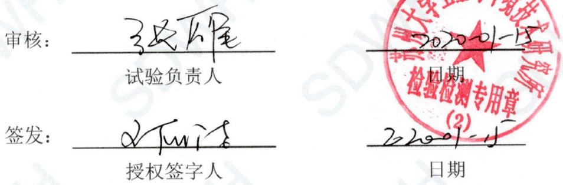
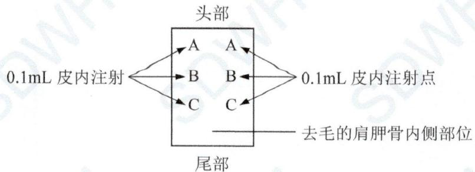
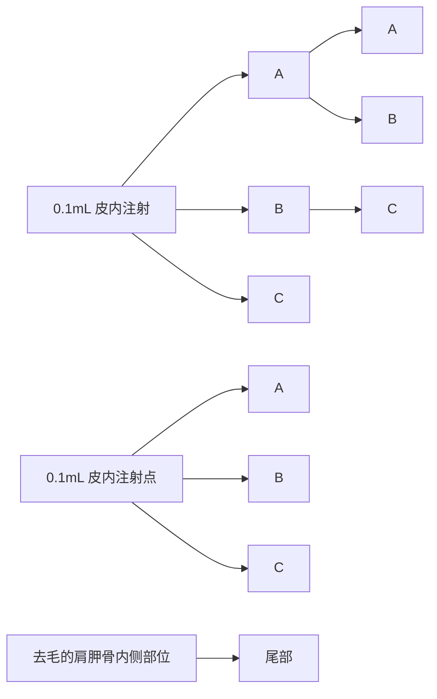
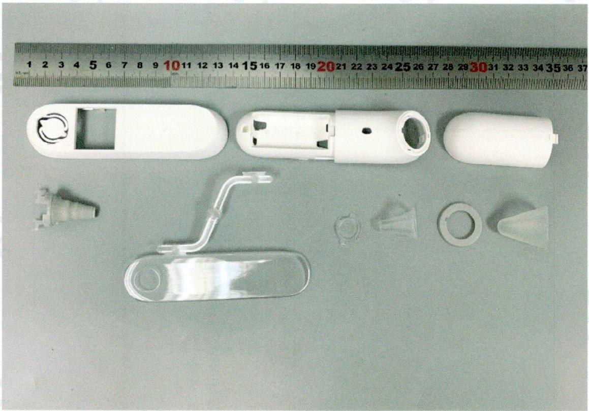
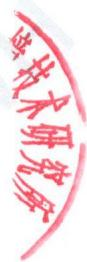

# 最终报告

# 报告编号：SDWH-M201905262-3

# 红外耳温计

# 皮肤致敏试验

参照 GB/T 16886.10-2017

豚鼠最大剂量试验

芝麻油浸提

委托单位：天津九安医疗电子股份有限公司

地址：天津市南开区雅安道金平路3号

# 目录

# 检测报告说明 ....3

# 日期确认 4

# 报告摘要 5

# 检测报告正文....6

# 1 目的 ....6

# 2 参考标准....6

# 3 执行规范....6

# 4 试验和对照样品确定....6

4.1 试验样品....6   
4.2 对照样品 6

4.2.1 阴性对照样品 ..... 6  
4.2.2 阳性对照样品 ..... 7

# 5 仪器和试剂 ....7

5.1 仪器设备....7  
5.2 试剂....7

# 6 试验系统鉴别 ....7

# 7 饲养和护理 .... 7

# 8 试验系统和给药途径确认 ....8

# 9 试验设计 ....8

9.1 浸提液制备 8

9.1.1 样品前处理 8  
9.1.2 样品浸提 8

9.2 试验步骤.....8

9.2.1 动物准备与分组 8  
9.2.2 皮内诱导阶段 I....8  
9.2.3 局部诱导阶段 II 9  
9.2.4 激发阶段....9

9.3 结果观察....9   
9.4 结果评价....9

# 10 试验结果 .... 10

# 11 结论 .... 10

# 12 记录存储 .... 10

# 13 保密协议 .... 10

# 14 试验偏离声明 ..... 10

# 附录一 试验数据 …… 11

# 附录二 试验样品照片....13

# 附录三 客户提供的资料....14

# 检测报告说明

一、对本报告有异议者，请于收到报告之日起十五天内提出复核申请。   
二、检测报告涂改或无检验检测专用章无效。  
三、检测报告无编制人、审核人及检测报告签发人签字无效。  
四、送样委托检验，本检验检测机构仅对来样负责。  
五、未经本检验检测机构同意，不得部分复制本报告。

日期确认

<table><tr><td>接样日期</td><td>2019-12-04</td></tr><tr><td>试验计划书生效日期</td><td>2019-12-06</td></tr><tr><td>试验操作开始日期</td><td>2019-12-06</td></tr><tr><td>试验操作结束日期</td><td>2020-01-02</td></tr><tr><td>报告完成日期</td><td>2020-01-15</td></tr></table>

编制：王焕衡 2020.01.15

text_image

审核： 张成雄
试验负责人
签发： 史丽洁
授权签字人
日期
2020-01-15
日期
检验检测专用章
(2)

苏州大学卫生与环境技术研究所

# 报告摘要

# 1 试验样品

<table><tr><td>样品名称</td><td>红外耳温计</td></tr><tr><td>制造商</td><td>柯顿(天津)电子医疗器械有限公司</td></tr><tr><td>地址</td><td>天津自贸试验区(空港经济区)航宇路26号</td></tr><tr><td>型号</td><td>PT5</td></tr><tr><td>批号</td><td>未提供</td></tr></table>

# 2 主要参考标准

GB/T 16886.10-2017 医疗器械生物学评价 第 10 部分：刺激与皮肤致敏试验

# 3 试验方法

依据 GB/T 16886.10-2017 医疗器械的生物学评价 第 10 部分：刺激与皮肤致敏试验，采用豚鼠最大剂量试验，评价样品潜在的皮肤致敏反应。

试验计划书编号：SDWH-PROTOCOL-M201905262-3。

# 4 结论

在本次试验条件下，样品红外耳温计的浸提液在豚鼠皮肤未发现皮肤致敏反应，致敏阳性率为0%，未见对豚鼠引起皮肤致敏反应的证据。

# 检测报告正文

# 1 目的

采用豚鼠最大剂量试验，评价样品的皮肤致敏反应。该试验系统用豚鼠来检测表面接触引起的接触性致敏反应，并类推到人类，但试验结果并不代表样品真正的致敏危险性。

# 2 参考标准

GB/T 16886.10-2017 医疗器械生物学评价 第 10 部分：刺激与皮肤致敏试验

GB/T 16886.12-2017 医疗器械生物学评价 第 12 部分：样品制备与参照材料

GB/T 16886.2-2011 医疗器械生物学评价 第 2 部分：动物福利要求

# 3 执行规范

ISO/IEC 17025:2005 检测和校准实验室能力的通用要求（CNAS—CL01《检测和校准实验室能力认可准则》）中国合格评定国家认可委员会 实验室认可 注册号：CNAS L2954。

RB/T 214—2017《检验检测机构资质认定能力评价 检验检测机构通用要求》中国国家认证认可监督管理委员会 检验检测机构资质认定 证书编号：CMA 180015144061。

# 4 试验和对照样品确定

4.1 试验样品

<table><tr><td>样品名称</td><td>红外耳温计</td></tr><tr><td>制造商</td><td>柯顿(天津)电子医疗器械有限公司</td></tr><tr><td>制造商地址</td><td>天津自贸试验区(空港经济区)航宇路26号</td></tr><tr><td>来样原始状态</td><td>未灭菌</td></tr><tr><td>CAS编号</td><td>未提供</td></tr><tr><td>型号</td><td>PT5</td></tr><tr><td>规格</td><td>未提供</td></tr><tr><td>批号</td><td>未提供</td></tr><tr><td>样品材料</td><td>ABS,TPU,PMMA,PP</td></tr><tr><td>包装材质</td><td>塑料袋</td></tr><tr><td>性状</td><td>固体</td></tr><tr><td>颜色</td><td>白色,灰色,透明</td></tr><tr><td>密度</td><td>未提供</td></tr><tr><td>稳定性</td><td>未提供</td></tr><tr><td>溶解度</td><td>不溶于水</td></tr><tr><td>保存条件</td><td>室温</td></tr><tr><td>预期临床用途</td><td>体温测量</td></tr></table>

试验样品信息是由样品委托单位提供。

# 4.2 对照样品

# 4.2.1 阴性对照样品

样品名称：芝麻油（SO）

制造商：吉安市青原区绿源天然香料油提炼厂

规格：5kg

批号：20190108

性状：油状液体

颜色：淡黄色

保存条件：室温

# 4.2.2 阳性对照样品

样品名称：2,4-二硝基氯苯（DNCB）

制造商：成都艾科达化学试剂有限公司

规格：100g

批号：201904101

诱导浓度：0.5%

激发浓度：0.1%

溶剂：芝麻油

配制日期：2019-12-02

性状：液体

颜色：浅黄色

保存条件：室温

# 5 仪器和试剂

# 5.1 仪器设备

<table><tr><td>仪器名称</td><td>仪器编号</td><td>校正有效期</td></tr><tr><td>卧式大容量恒温振荡器</td><td>SDWH897</td><td>2020-05-04</td></tr><tr><td>立式压力蒸汽灭菌器</td><td>SDWH2097</td><td>2020-04-16</td></tr><tr><td>钢直尺</td><td>SDWH463</td><td>2020-07-29</td></tr><tr><td>电子秤</td><td>SDWH442</td><td>2020-05-04</td></tr></table>

# 5.2 试剂

<table><tr><td>试剂名称</td><td>供应商</td><td>批号</td></tr><tr><td>弗氏完全佐剂</td><td>SIGMA</td><td>SLBX3240</td></tr><tr><td>十二烷基硫酸钠</td><td>国药集团化学试剂有限公司</td><td>20181210</td></tr></table>

# 6 试验系统鉴别

种属：哈特兰豚鼠（天竺鼠）

数量：15（试验组 10 只、对照组 5 只）

性别：不限定

试验初体重：300～500g

健康状况：健康未使用过的动物

饲养：豚鼠按组饲养在笼子内，做好标识编号、试验代号、试验开始日期等信息

动物鉴别：染色标记

笼子：塑料笼子

适应期：在实验环境下7天

# 7 饲养和护理

动物来源：苏州高新区镇湖实验动物科技有限公司 SCXK（苏）2015-0007

垫料：玉米芯垫料，苏州双狮实验动物饲料科技有限公司

饲料：实验豚鼠全价颗粒饲料，苏州高新区镇湖实验动物科技有限公司

水：自来水（符合 GB 5749-2006 卫生标准）

室温：18\~26℃

相对湿度：30%\~70%

光照：每天需要 12h 光照，全光谱日光灯

人员：检测人员有相应检测资质

选择：选择健康未使用过的动物

食物、水、垫料中无干扰试验数据污染物存在

# 8 试验系统和给药途径确认

白色豚鼠历史上曾用于致敏研究（Magnusson 和 Kligman，1970）。在该类试验研究中，豚鼠被认为是最敏感的动物模型。该试验采用 2,4-二硝基氯苯（DNCB）作为豚鼠致敏物已经在苏州大学卫生与环境技术研究所得到试验证实（表 1 和表 2）。

试验样品通过浸提液（用一种与试验系统相容的载体浸提）与试验系统接触，被认为是最佳给药途径。

# 9 试验设计

# 9.1 浸提液制备

# 9.1.1 样品前处理

无需前处理程序。

# 9.1.2 样品浸提

无菌条件下取样，等数量取图中所有组件（激发阶段取样去掉塑料件料把），混合浸提。（见附录二图片），使用委托方提供的样品总表面积为 $222.684 \, cm^{2}$ ，并按 $3 \, cm^{2} : 1 \, mL$ 浸提比例（样品：浸提介质）在密闭的惰性容器内震荡浸提。浸提介质为芝麻油。

<table><tr><td rowspan="2">试验阶段</td><td rowspan="2">实际取样</td><td colspan="3">浸提过程</td><td rowspan="2">最终浸提液</td></tr><tr><td>浸提比例</td><td>芝麻油体积</td><td>浸提条件</td></tr><tr><td>皮内诱导阶段I</td><td>表面积222.684 $cm^2$ </td><td>3 $cm^2$ :1mL</td><td>74.2 mL</td><td>37°C, 72h</td><td>澄清</td></tr><tr><td>局部诱导阶段II</td><td>表面积222.684 $cm^2$ </td><td>3 $cm^2$ :1mL</td><td>74.2 mL</td><td>37°C, 72h</td><td>澄清</td></tr><tr><td>激发阶段</td><td>表面积222.684 $cm^2$ </td><td>3 $cm^2$ :1mL</td><td>74.2 mL</td><td>37°C, 72h</td><td>澄清</td></tr></table>

浸提前后浸提液状态未发生改变。浸提完成后 $4^{\circ}$ C 保存，24h 内用于测试。浸提液 pH 值未经调整，未经过滤、离心、稀释等处理。不加供试品，同条件制备对照液。

# 9.2 试验步骤

# 9.2.1 动物准备与分组

在试验首日, 将对 15 只豚鼠进行称重和染色, 并用电动剃刀除去动物背部区域的毛发。分组如下:

<table><tr><td>分组</td><td>动物数量</td><td>动物性别</td></tr><tr><td>试验组</td><td>10</td><td>不限定</td></tr><tr><td>阴性对照组</td><td>5</td><td>不限定</td></tr></table>

# 9.2.2 皮内诱导阶段 I

按图 1 所示（A、B 和 C），在每只动物去毛的肩胛骨内侧部位成对皮内注射 0.1mL。

部位 A：注射弗氏完全佐剂与选定的溶剂以 50:50（V/V）比例混合配制成的稳定性乳化剂。

部位 B: 试验组动物注射试验样品（未经稀释的浸提液）；对照组动物仅注射相应溶剂。

部位 C：试验组动物按部位 B 中采用的浸提液浓度，以 50:50（V/V）的比例与弗氏完全佐剂与溶剂配制成的乳化剂混合后进行皮内注射；对照组动物注射溶剂与佐剂和溶剂配制成的乳化剂。

flowchart

图 1 皮内注射点部位

# 9.2.3 局部诱导阶段Ⅱ

按注射部位 B 的最大浓度未产生刺激反应，在局部敷贴应用前（24±2）h，试验区用10%十二烷基硫酸钠（溶剂：蒸馏水，配制日期：2019-09-30）进行预处理，按摩导入皮肤。

皮内注射后 7d，将约 $8cm^{2}$ 大小的吸收性纱布块用 0.5mL 供试品浸提液浸透后局部贴敷于每个动物的肩胛骨内侧部位，覆盖诱导注射点。用封闭式包扎带固定样品，并于 $(48\pm2)$ h 后除去包扎带和样品。

对照组动物使用对照液同法操作。

# 9.2.4 激发阶段

于局部诱导后 $14 \pm 1d$ ，用试验样品对全部试验组动物和对照组动物进行激发。用 0.5mL 供试品浸提液和对照液浸透后的 $2.5cm \times 2.5cm$ 大小吸收性纱布块分别局部贴敷于诱导阶段未试验部位，用封闭式包扎带固定，并于 $(24 \pm 2)h$ 后除去包扎带和贴敷片。

# 9.3 结果观察

除去样品后（24±2）h 和（48±2）h，分别观察供试品组和对照组动物激发部位皮肤情况，在全光谱光线下观察皮肤反应。按下表 Magnusson 和 Kligman 分级标准对每一激发部位和每一观察时间皮肤红斑和水肿反应进行描述并分级。

Magnusson 和 Kligman 分级

<table><tr><td>贴敷试验反应</td><td>等级</td></tr><tr><td>无明显改变</td><td>0</td></tr><tr><td>散发性或斑点状红斑</td><td>1</td></tr><tr><td>中度融合性红斑</td><td>2</td></tr><tr><td>重度红斑和水肿</td><td>3</td></tr></table>

# 9.4 结果评价

按 Magnusson 和 Kligman 分级标准，如果对照组动物等级小于 1，而试验组中等级大于或等于 1 时一般提示致敏。

如对照组动物等级大于或等于 1 时，试验组动物反应超过对照组中最严重的反应则认为致敏。如为疑似反应，推荐进行再激发以确认首次激发结果。

试验结果显示为试验和对照动物中的阳性激发结果的发生率。

# 10 试验结果

激发后皮肤反应结果列于表 3，样品红外耳温计的浸提液在豚鼠皮肤未发现皮肤致敏反应，致敏阳性率为 0%。

阳性对照组的致敏阳性率为 100%，见表 1。

豚鼠临床观察和体重变化列于表 4。

# 11 结论

在本试验条件下，样品红外耳温计的浸提液未见对豚鼠引起皮肤致敏反应的证据。

# 12 记录存储

所有与本次试验有关的原始数据和记录都被保存在指定的 SDWH 档案文件中。

# 13 保密协议

签订检测委托合同即认为双方接受保密协议。

# 14 试验偏离声明

本次试验严格按照计划书执行，未发生影响实验数据有效性的偏离。

# 附录一 试验数据

表 1 阳性对照致敏皮肤反应

<table><tr><td rowspan="2">分组</td><td rowspan="2">动物编号</td><td colspan="2">阶段II局部敷贴应用前(24±2)h</td><td colspan="2">激发斑贴移去后(24±2)h</td><td colspan="2">激发斑贴移去后(48±2)h</td><td rowspan="2">激发后阳性发生率</td></tr><tr><td>左</td><td>右</td><td>试验部位</td><td>对照部位</td><td>试验部位</td><td>对照部位</td></tr><tr><td rowspan="5">阳性对照组</td><td>1</td><td>2</td><td>3</td><td>2</td><td>0</td><td>2</td><td>0</td><td rowspan="5">100%</td></tr><tr><td>2</td><td>2</td><td>2</td><td>2</td><td>0</td><td>2</td><td>0</td></tr><tr><td>3</td><td>2</td><td>2</td><td>1</td><td>0</td><td>2</td><td>0</td></tr><tr><td>4</td><td>3</td><td>2</td><td>2</td><td>0</td><td>3</td><td>0</td></tr><tr><td>5</td><td>3</td><td>3</td><td>3</td><td>0</td><td>3</td><td>0</td></tr><tr><td rowspan="5">阴性对照组</td><td>6</td><td>0</td><td>0</td><td>0</td><td>0</td><td>0</td><td>0</td><td rowspan="5">-</td></tr><tr><td>7</td><td>0</td><td>0</td><td>0</td><td>0</td><td>0</td><td>0</td></tr><tr><td>8</td><td>0</td><td>0</td><td>0</td><td>0</td><td>0</td><td>0</td></tr><tr><td>9</td><td>0</td><td>0</td><td>0</td><td>0</td><td>0</td><td>0</td></tr><tr><td>10</td><td>0</td><td>0</td><td>0</td><td>0</td><td>0</td><td>0</td></tr></table>

注：阳性对照引用 SDWH-M201905116-2（完成日期：2019-12-26）

表 2 阳性对照豚鼠临床观察和体重变化

<table><tr><td rowspan="2">分组</td><td rowspan="2">动物编号</td><td colspan="2">体重(g)</td><td rowspan="2">皮肤反应外的临床表现</td></tr><tr><td>初体重</td><td>终体重</td></tr><tr><td rowspan="5">阳性对照组</td><td>1</td><td>340</td><td>415</td><td>正常</td></tr><tr><td>2</td><td>308</td><td>367</td><td>正常</td></tr><tr><td>3</td><td>316</td><td>383</td><td>正常</td></tr><tr><td>4</td><td>314</td><td>386</td><td>正常</td></tr><tr><td>5</td><td>308</td><td>369</td><td>正常</td></tr><tr><td rowspan="5">阴性对照组</td><td>6</td><td>310</td><td>373</td><td>正常</td></tr><tr><td>7</td><td>345</td><td>425</td><td>正常</td></tr><tr><td>8</td><td>313</td><td>382</td><td>正常</td></tr><tr><td>9</td><td>337</td><td>416</td><td>正常</td></tr><tr><td>10</td><td>309</td><td>371</td><td>正常</td></tr></table>

注：阳性对照引用 SDWH-M201905116-2（完成日期：2019-12-26）

表 3 豚鼠致敏皮肤反应

<table><tr><td rowspan="2">分组</td><td rowspan="2">动物编号</td><td colspan="2">阶段II局部敷贴应用前(24±2)h</td><td colspan="2">激发斑贴移去后(24±2)h</td><td colspan="2">激发斑贴移去后(48±2)h</td><td rowspan="2">激发后阳性发生率</td></tr><tr><td>左</td><td>右</td><td>试验部位</td><td>对照部位</td><td>试验部位</td><td>对照部位</td></tr><tr><td rowspan="10">试验组</td><td>1</td><td>0</td><td>0</td><td>0</td><td>0</td><td>0</td><td>0</td><td rowspan="10">0%</td></tr><tr><td>2</td><td>0</td><td>0</td><td>0</td><td>0</td><td>0</td><td>0</td></tr><tr><td>3</td><td>0</td><td>0</td><td>0</td><td>0</td><td>0</td><td>0</td></tr><tr><td>4</td><td>0</td><td>0</td><td>0</td><td>0</td><td>0</td><td>0</td></tr><tr><td>5</td><td>0</td><td>0</td><td>0</td><td>0</td><td>0</td><td>0</td></tr><tr><td>6</td><td>0</td><td>0</td><td>0</td><td>0</td><td>0</td><td>0</td></tr><tr><td>7</td><td>0</td><td>0</td><td>0</td><td>0</td><td>0</td><td>0</td></tr><tr><td>8</td><td>0</td><td>0</td><td>0</td><td>0</td><td>0</td><td>0</td></tr><tr><td>9</td><td>0</td><td>0</td><td>0</td><td>0</td><td>0</td><td>0</td></tr><tr><td>10</td><td>0</td><td>0</td><td>0</td><td>0</td><td>0</td><td>0</td></tr><tr><td rowspan="5">阴性对照组</td><td>11</td><td>0</td><td>0</td><td>0</td><td>0</td><td>0</td><td>0</td><td rowspan="5">-</td></tr><tr><td>12</td><td>0</td><td>0</td><td>0</td><td>0</td><td>0</td><td>0</td></tr><tr><td>13</td><td>0</td><td>0</td><td>0</td><td>0</td><td>0</td><td>0</td></tr><tr><td>14</td><td>0</td><td>0</td><td>0</td><td>0</td><td>0</td><td>0</td></tr><tr><td>15</td><td>0</td><td>0</td><td>0</td><td>0</td><td>0</td><td>0</td></tr></table>

表 4 豚鼠临床观察和体重变化

<table><tr><td rowspan="2">分组</td><td rowspan="2">动物编号</td><td colspan="2">体重(g)</td><td rowspan="2">皮肤反应外的临床表现</td></tr><tr><td>初体重</td><td>终体重</td></tr><tr><td rowspan="10">试验组</td><td>1</td><td>353</td><td>439</td><td>正常</td></tr><tr><td>2</td><td>315</td><td>382</td><td>正常</td></tr><tr><td>3</td><td>327</td><td>400</td><td>正常</td></tr><tr><td>4</td><td>328</td><td>402</td><td>正常</td></tr><tr><td>5</td><td>326</td><td>399</td><td>正常</td></tr><tr><td>6</td><td>310</td><td>375</td><td>正常</td></tr><tr><td>7</td><td>304</td><td>366</td><td>正常</td></tr><tr><td>8</td><td>356</td><td>444</td><td>正常</td></tr><tr><td>9</td><td>351</td><td>436</td><td>正常</td></tr><tr><td>10</td><td>301</td><td>361</td><td>正常</td></tr><tr><td rowspan="5">阴性对照组</td><td>11</td><td>305</td><td>367</td><td>正常</td></tr><tr><td>12</td><td>352</td><td>438</td><td>正常</td></tr><tr><td>13</td><td>334</td><td>411</td><td>正常</td></tr><tr><td>14</td><td>316</td><td>384</td><td>正常</td></tr><tr><td>15</td><td>329</td><td>403</td><td>正常</td></tr></table>

# 附录二 试验样品照片

natural_image

Disassembled white plastic electronic device components laid out on a surface, with a ruler for scale (no text or symbols visible)

# 附录三 客户提供的资料

# 1 工艺流程

未提供。

# 2 其他信息

未提供。

以下空白

