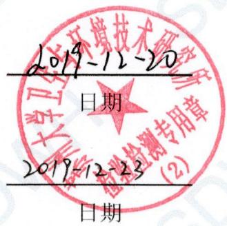
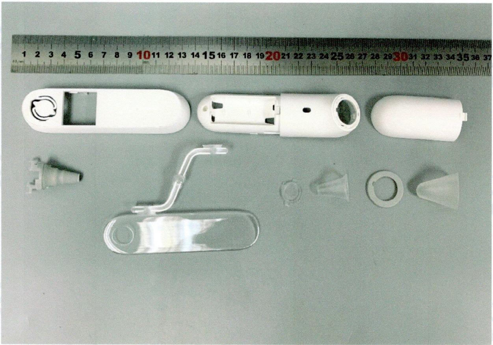

# 最终报告

# 报告编号：SDWH-M201905262-1

# 红外耳温计

# 细胞毒性试验

参照 GB/T 16886.5—2017

MTT

含 10% 胎牛血清的 MEM 浸提

委托单位：天津九安医疗电子股份有限公司

地址：天津市南开区雅安道金平路3号

# 目录

# 检测报告说明 ....3

# 日期确认 4

# 报告摘要 5

# 检测报告正文....6

# 1 目的 ……6

# 2 参考标准 …… 6

# 3 执行规范 ……6

# 4 试验和对照样品确定 ……6

4.1 试验样品....6   
4.2 对照样品 6

4.2.1 阴性对照样品 ..... 6  
4.2.2 阳性对照样品 ..... 7  
4.2.3 空白对照....7

# 5 仪器和试剂 ....7

5.1 仪器设备....7  
5.2 试剂 ..... 7

# 6 试验系统鉴别 ……7

# 7 试验系统和给药途径确认 ....8

# 8 试验设计 ....8

8.1 浸提液制备 8

8.1.1 样品前处理....8  
8.1.2 样品浸提....8

8.2 试验步骤.....8   
8.3 结果.....8   
8.4 质量检查....9   
8.5 数据分析 ..... 9   
8.6 评价标准....9

# 9 结论 9

# 10 记录存储 ..... 9

# 11 保密协议....9

# 12 试验偏离声明 ..... 9

# 附录一 结果 …… 10

# 附录二 试验样品照片 …… 11

# 附录三 客户提供的资料 …… 12

# 检测报告说明

一、对本报告有异议者，请于收到报告之日起十五天内提出复核申请。   
二、检测报告涂改或无检验检测专用章无效。  
三、检测报告无编制人、审核人及检测报告签发人签字无效。  
四、送样委托检验，本检验检测机构仅对来样负责。  
五、未经本检验检测机构同意，不得部分复制本报告。

日期确认

<table><tr><td>接样日期</td><td>2019-12-04</td></tr><tr><td>试验计划书生效日期</td><td>2019-12-06</td></tr><tr><td>试验操作开始日期</td><td>2019-12-06</td></tr><tr><td>试验操作结束日期</td><td>2019-12-13</td></tr><tr><td>报告完成日期</td><td>2019-12-20</td></tr></table>

编制： 葛淑霞

text_image

2019-12-20
日期
2019-12-23
日期

审核： 李佳

2019-12-23
日期

苏州大学卫生与环境技术研究所

# 报告摘要

1 试验样品

<table><tr><td>样品名称</td><td>红外耳温计</td></tr><tr><td>制造商</td><td>柯顿(天津)电子医疗器械有限公司</td></tr><tr><td>地址</td><td>天津自贸试验区(空港经济区)航宇路26号</td></tr><tr><td>型号</td><td>PT5</td></tr><tr><td>批号</td><td>未提供</td></tr></table>

# 2 主要参考标准

GB/T 16886.5—2017 医疗器械的生物学评价 第 5 部分：细胞毒性测试-体外法

# 3 试验方法

依据 GB/T 16886.5—2017 医疗器械的生物学评价 第 5 部分：细胞毒性测试-体外法，采用 MTT 法，评价样品潜在的细胞毒性。

试验计划书编号：SDWH-PROTOCOL-M201905262-1。

# 4 结论

在本次试验条件下，样品红外耳温计的浸提液对 L929 细胞无潜在毒性影响。

# 检测报告正文

# 1 目的

该试验目的是为了评价试验样品对 L929 哺乳动物成纤维细胞的生物学反应。该测试是根据样品浸提液而设计的。

# 2 参考标准

GB/T 16886.5—2017 医疗器械的生物学评价 第 5 部分：细胞毒性测试-体外法

GB/T 16886.12—2017 医疗器械的生物学评价 第 12 部分：样品制备与参照材料

# 3 执行规范

ISO/IEC 17025:2005 检测和校准实验室能力的通用要求（CNAS—CL01《检测和校准实验室能力认可准则》）中国合格评定国家认可委员会 实验室认可 注册号：CNAS L2954。

RB/T 214—2017《检验检测机构资质认定能力评价 检验检测机构通用要求》中国国家认证认可监督管理委员会 检验检测机构资质认定 证书编号：CMA 180015144061。

# 4 试验和对照样品确定

# 4.1 试验样品

<table><tr><td>样品名称</td><td>红外耳温计</td></tr><tr><td>制造商</td><td>柯顿(天津)电子医疗器械有限公司</td></tr><tr><td>制造商地址</td><td>天津自贸试验区(空港经济区)航宇路26号</td></tr><tr><td>来样原始状态</td><td>未灭菌</td></tr><tr><td>CAS编号</td><td>未提供</td></tr><tr><td>型号</td><td>PT5</td></tr><tr><td>规格</td><td>未提供</td></tr><tr><td>批号</td><td>未提供</td></tr><tr><td>样品材料</td><td>ABS,TPU,PMMA,PP</td></tr><tr><td>包装材质</td><td>塑料袋</td></tr><tr><td>性状</td><td>固体</td></tr><tr><td>颜色</td><td>白色,灰色,透明</td></tr><tr><td>密度</td><td>未提供</td></tr><tr><td>稳定性</td><td>未提供</td></tr><tr><td>溶解度</td><td>不溶于水</td></tr><tr><td>保存条件</td><td>室温</td></tr><tr><td>预期临床用途</td><td>体温测量</td></tr></table>

试验样品信息是由样品委托单位提供。

# 4.2 对照样品

# 4.2.1 阴性对照样品

名称：高密度聚乙烯

制造商：美国药典委员会

规格：3 片装

批号：K0M357

性状：固体

颜色：白色

稳定性：室温下稳定

保存条件：室温

浸提介质：含 10% 胎牛血清的 MEM 培养液

# 4.2.2 阳性对照样品

阳性对照样品名称：Zinc diethyldithiocarbamate

制造商：Sigma

规格：25 g

批号：MKCB2943V

浓度：1%

溶剂：10%胎牛血清的 MEM 培养液

性状：固体

颜色：白色

# 4.2.3 空白对照

空白对照样品名称：含 10% 胎牛血清的 MEM 培养液

性状：液体

颜色：粉红色

保存条件： $4 \pm 2^{\circ}C$

# 5 仪器和试剂

# 5.1 仪器设备

<table><tr><td>仪器名称</td><td>仪器编号</td><td>校正有效期</td></tr><tr><td>高压灭菌器</td><td>SDWH2204</td><td>2020-04-16</td></tr><tr><td>恒温摇床</td><td>SDWH2109</td><td>2020-10-28</td></tr><tr><td>钢直尺</td><td>SDWH463</td><td>2020-07-29</td></tr><tr><td>电子天平</td><td>SDWH2601</td><td>2020-06-19</td></tr><tr><td>电子天平</td><td>SDWH230</td><td>2020-05-04</td></tr><tr><td> $CO_2$ 培养箱</td><td>SDWH021</td><td>2020-04-16</td></tr><tr><td>倒置显微镜</td><td>SDWH037</td><td>2020-05-04</td></tr><tr><td>超净工作台</td><td>SDWH454</td><td>2020-05-06</td></tr><tr><td>酶联免疫检测仪</td><td>SDWH2386</td><td>2020-07-04</td></tr></table>

# 5.2 试剂

<table><tr><td>试剂名称</td><td>供应商</td><td>批号</td></tr><tr><td>MTT(3-(4,5-二甲基噻唑-2)-2,5-二苯基四氮唑溴盐)</td><td>SIGMA</td><td>MKCD8033</td></tr><tr><td>胎牛血清</td><td>CORNING</td><td>35081006</td></tr><tr><td>MEM</td><td>HyClone</td><td>AE29246282</td></tr><tr><td>胰酶</td><td>GiBco</td><td>2048080</td></tr><tr><td>青霉素链霉素</td><td>GiBco</td><td>2087432</td></tr><tr><td>PBS</td><td>CORNING</td><td>05418005</td></tr><tr><td>99.9%异丙醇</td><td>国药集团化学试剂有限公司</td><td>20190227</td></tr></table>

# 6 试验系统鉴别

该试验用小鼠成纤维细胞 L929, 细胞系来自美国菌种保存中心。

# 7 试验系统和给药途径确认

小鼠成纤维细胞 L929 用来检测细胞毒性试验是因为其对试验样品浸提液反应灵敏。

试验样品通过浸提液（用一种与试验系统相容的载体浸提）与试验系统接触，被认为是最佳给药途径，也是为标准推荐的。

# 8 试验设计

# 8.1 浸提液制备

# 8.1.1 样品前处理

# 8.1.1.1 试验样品灭菌

辐照灭菌 25 kGy Cobalt-60。

# 8.1.1.2 对照样品灭菌

与试验样品相同。

# 8.1.2 样品浸提

无菌条件下取样：等数量取图中所有组件，混合浸提。使用委托方提供的样品的总表面积数据 $222.684 \, cm^{2}$ ，并按下表的浸提比例（样品：浸提介质）在密闭的惰性容器内震荡浸提。浸提介质为含 10% 胎牛血清的 MEM 培养液。浸提完成后，记录浸提液状态和浸提介质的任何变化（提取前和提取后）。提取液立即用于测试。

<table><tr><td rowspan="2">试验阶段</td><td rowspan="2">实际取样</td><td colspan="3">浸提过程</td><td rowspan="2">最终浸提液</td></tr><tr><td>浸提比例</td><td>浸提介质体积</td><td>浸提条件</td></tr><tr><td>试验样品</td><td> $222.684cm^2$ </td><td>3  $cm^2$ :1 mL</td><td>74.2 mL</td><td>37°C, 24 h</td><td>澄清</td></tr><tr><td>阴性对照</td><td> $30 cm^2$ </td><td>3  $cm^2$ :1 mL</td><td>10.0 mL</td><td>37°C, 24 h</td><td>澄清</td></tr><tr><td>空白对照</td><td>/</td><td>/</td><td>10.0 mL</td><td>37°C, 24 h</td><td>澄清</td></tr><tr><td>阳性对照</td><td>0.5 g</td><td>1.0 g:100 mL</td><td>50.0 ml</td><td>37°C, 24 h</td><td>浑浊</td></tr></table>

浸提前后浸提液状态未发生改变。浸提液 pH 值未经调整，未经过滤、离心、稀释等处理。
阳性浸提液经过滤后使用

# 8.2 试验步骤

试验过程无菌操作；

将 L929 细胞培养在含 10% 胎牛血清和抗生素（青霉素 100 U/mL, 链霉素 100 μg/mL）的 MEM 培养液中，置于 37℃，5% CO₂ 培养箱中培养。用 0.25% 胰酶（含 EDTA）消化细胞制备成单细胞悬液，细胞悬液离心（200 G, 3 min），然后将细胞重新分散于培养基中，调整细胞密度为 $1 \times 10^{5}$ 个/mL 的细胞悬液；

接种上述细胞悬液到 1 个 96 孔培养板中，每孔 100 μL，置 37°C 培养箱中（5% CO₂，37°C，>90% 湿度）培养 24 h；

待细胞长成单层后，吸出原来的培养液，分别加入 $100 \mu L$ 不同浓度的试验样品浸提液（100%、75%、50%、25%）、空白对照液、阳性对照（100%）和阴性对照液（100%）， $37^{\circ}C$ ， $5\% CO_{2}$ 培养 24 h。每组做 5 个平行样；

培养 24 h 后，取出 96 孔板先做细胞形态学观察，然后吸出原来的培养液，每孔加 50 $\mu$ L MTT（1 mg/mL），置于 37°C，5% CO $_{2}$ 培养箱中培养 2 h，吸弃上清，加 100 $\mu$ L 99.9% 纯度的异丙醇溶解结晶；

在酶标仪上以 570 nm 为主吸收波长，650 nm 为参考波长测定吸光度值。

# 8.3 结果

样品红外耳温计的 100% 浸提液组细胞活力值为 80.1%，具体结果详见附录一，表 1，表 2。

# 8.4 质量检查

阴性对照无细胞毒性影响，阳性对照造成细胞毒性影响。

在两天的试验过程中, 未经处理的空白对照的光密度绝对值 $\mathrm{OD}_{570}$ 表明了每个孔接种的 $1 \times 10^{4}$ 个细胞以正常倍增时间成指数增长。

空白对照的 $OD_{570}$ 平均值不能小于 0.2。

检查系统的细胞接种误差，96孔板的左侧（第2列）和右侧（第11列）作为空白对照（第1列和第12列不用作空白对照）。左右两侧空白对照的平均值不能与所有空白的平均值相差超过15%。

# 8.5 数据分析

使用 SPSS 16.0 计算各组测定的光密度值的均数±标准差(Mean ± SD)。

$$
\text{细胞活力（\(\%\)）} = 100 \times \left. \overline{\left(O D_{570}-OD_{650}\right)}_ {\text{样品组}} \right/ \left( \overline{\left(O D_{570}-OD_{650}\right)}_ {\text{空白对照组}} \right.
$$

50%浓度的样品浸提液与100%浓度的样品浸提液相比，细胞活力%应至少相同或更高，否则应重复试验。

细胞活力%越低，表明受试样品潜在的细胞毒性越大。

# 8.6 评价标准

50%的样品浸提液至少和100%的细胞活力相同或者比100%的细胞活力更高，否则应该重复试验。

细胞活力%越低，潜在的细胞毒性越大；

细胞活力<空白组 70%，说明样品具有潜在的细胞毒性；

100%试验样品浸提液的细胞活力%为最终结果。

# 9 结论

在本试验条件下，样品红外耳温计的浸提液对 L929 细胞无潜在毒性影响。

# 10 记录存储

所有与本次试验有关的原始数据和记录都被保存在指定的 SDWH 档案文件中。

# 11 保密协议

签订检测委托合同即认为双方接受保密协议。

# 12 试验偏离声明

本次试验严格按照计划书执行，未发生影响实验数据有效性的偏离。

# 附录一 结果

表 1 细胞形态学观察

<table><tr><td>组别</td><td>接种细胞后</td><td>加浸提液前</td><td>加浸提液24h后</td></tr><tr><td>空白对照</td><td rowspan="3">个别细胞有颗粒,细胞无裂解,生长状态良好。</td><td>个别细胞有颗粒,细胞无裂解,生长状态良好。</td><td rowspan="3">个别细胞有颗粒,细胞无裂解,生长状态良好。</td></tr><tr><td>阴性对照</td><td>个别细胞有颗粒,细胞无裂解,生长状态良好。</td></tr><tr><td>阳性对照</td><td>细胞裂解死亡。</td></tr><tr><td>100%样品浸提液</td><td rowspan="4">胞无裂解,生长状态良好。</td><td>个别细胞有颗粒,细胞无裂解,生长状态良好。</td><td rowspan="4">个别细胞有颗粒,细胞无裂解,生长状态良好。</td></tr><tr><td>75%样品浸提液</td><td>个别细胞有颗粒,细胞无裂解,生长状态良好。</td></tr><tr><td>50%样品浸提液</td><td>个别细胞有颗粒,细胞无裂解,生长状态良好。</td></tr><tr><td>25%样品浸提液</td><td>个别细胞有颗粒,细胞无裂解,生长状态良好。</td></tr></table>

表 2 细胞活力%

<table><tr><td>组别</td><td>吸光度值Mean±SD</td><td>细胞活力%</td></tr><tr><td>空白对照</td><td>0.6142±0.053</td><td>100.0%</td></tr><tr><td>阴性对照</td><td>0.6624±0.051</td><td>107.8%</td></tr><tr><td>阳性对照</td><td>0.1292±0.016</td><td>21.0%</td></tr><tr><td>100%样品浸提液</td><td>0.4922±0.057</td><td>80.1%</td></tr><tr><td>75%样品浸提液</td><td>0.5020±0.042</td><td>81.7%</td></tr><tr><td>50%样品浸提液</td><td>0.5084±0.070</td><td>82.8%</td></tr><tr><td>25%样品浸提液</td><td>0.498±0.034</td><td>81.1%</td></tr></table>

# 附录二 试验样品照片

natural_image

Disassembled white electronic devices with plastic components and a ruler for scale (no text or symbols on the devices themselves)

# 附录三 客户提供的资料

# 1 工艺流程

未提供。

# 2 其他信息

未提供。

以下空白