<table><tr><td colspan="10">文档清单</td></tr><tr><td colspan="10">产品型号:PT9L</td></tr><tr><td colspan="10">提交: 审核: 批准:</td></tr><tr><td colspan="10"></td></tr><tr><td>版本</td><td>图纸号</td><td>板层</td><td colspan="7">版本</td></tr><tr><td>V1.0</td><td>PT9L-HFXS01 V1.0</td><td></td><td colspan="7">V1.0</td></tr><tr><td rowspan="8">V1.0</td><td rowspan="8">PT9L-HFMP01 V1.0</td><td>Top Layer 层</td><td colspan="7" rowspan="8">V1.0</td></tr><tr><td colspan="7">Top Overlay 层</td></tr><tr><td colspan="7">Bottom Layer 层</td></tr><tr><td colspan="7">Bottom Overlay 层</td></tr><tr><td colspan="7">Drill Layer 层</td></tr><tr><td colspan="7">拼板示意图(顶层)</td></tr><tr><td colspan="7">拼板示意图(底层)</td></tr><tr><td colspan="7">尺寸图</td></tr><tr><td colspan="4">POWER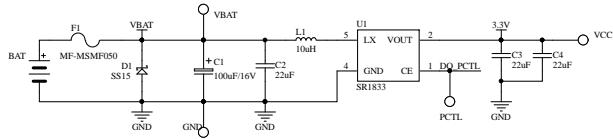DO_PCTL低电平:3.3V OFFDO_PCTL高电平:3.3V ON</td><td colspan="2">LVD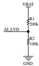</td><td colspan="2">MUTE KEY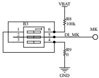</td><td colspan="2">KEY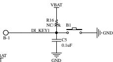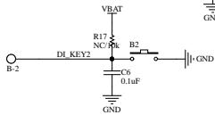</td></tr><tr><td colspan="5" rowspan="4">MCU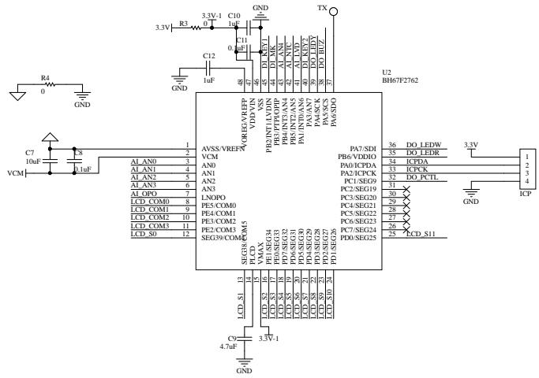</td><td colspan="2">LED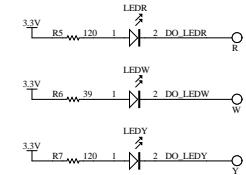高电平:LED变低电平:LED亮</td><td colspan="3" rowspan="2">SENSOR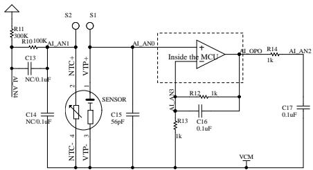</td></tr><tr><td colspan="2" rowspan="3">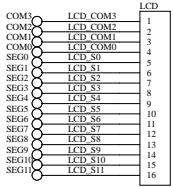</td></tr><tr><td colspan="3">NTC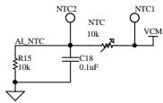</td></tr><tr><td colspan="3">BEEP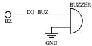Buzzer Frequency:4kHz</td></tr><tr><td>1</td><td>2</td><td>3</td><td colspan="2">4</td><td>5</td><td colspan="2">6</td><td>7</td><td>8</td></tr></table>

<table><tr><td>3</td><td></td><td></td><td>产品名称 红外体温计</td><td colspan="2">产品型号 PT9L</td><td>版本 V1.0</td><td rowspan="3"></td></tr><tr><td>2</td><td></td><td></td><td colspan="3">原理图编号 PT9L-HFXS01 V1.0</td><td></td></tr><tr><td>1</td><td></td><td></td><td>设计</td><td>审核</td><td>批准</td><td>第1页 共1页</td></tr><tr><td>NO.</td><td>更改记录</td><td>更改时间</td><td>日期</td><td>日期</td><td>日期</td><td></td><td></td></tr></table>

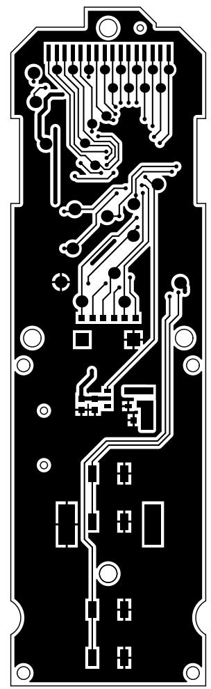

natural_image

Pure electrical circuit lines without any symbols

<table><tr><td>3</td><td></td><td></td><td>产品名称 红外体温计</td><td colspan="2">产品型号 PT9L</td><td>版本 V1.0</td><td rowspan="3"></td></tr><tr><td>2</td><td></td><td></td><td colspan="3">PCB编号 PT9L-HFMP01 V1.0</td><td>Top Layer 层</td></tr><tr><td>1</td><td></td><td></td><td>设计</td><td>审核</td><td>批准</td><td>第 1 页 共 7 页</td></tr><tr><td>NO.</td><td>更改记录</td><td>更改时间</td><td>日期</td><td>日期</td><td>日期</td><td></td><td></td></tr></table>

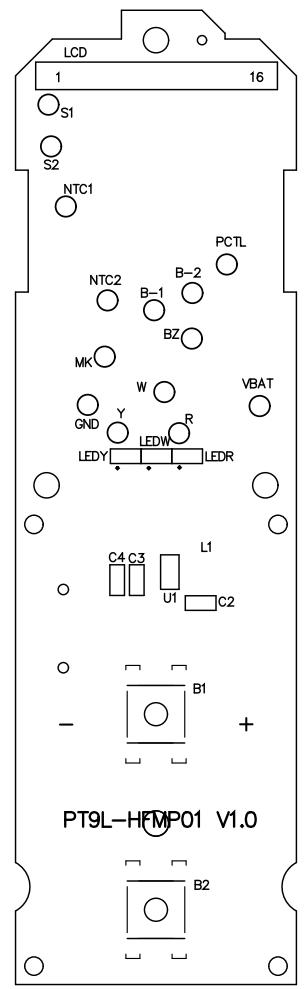

text_image

LCD
1 16
S1
S2
NTC1
PCTL
NTC2 B-1 B-2
BZ
MK W VBAT
GND Y R
LEDY LEDR
C4 C3 L1
U1 C2
B1
-
+
PT9L-HFMP01 V1.0
B2

<table><tr><td>3</td><td></td><td></td><td colspan="2">产品名称 红外体温计</td><td colspan="2">产品型号 PT9L</td><td>版本 V1.0</td><td rowspan="3"></td></tr><tr><td>2</td><td></td><td></td><td colspan="4">PCB编号 PT9L-HFMP01 V1.0</td><td>Top Overlay 层</td></tr><tr><td>1</td><td></td><td></td><td>设计</td><td colspan="2">审核</td><td>批准</td><td>第 2页 共 7页</td></tr><tr><td>NO.</td><td>更改记录</td><td>更改时间</td><td>日期</td><td colspan="2">日期</td><td>日期</td><td></td><td></td></tr></table>

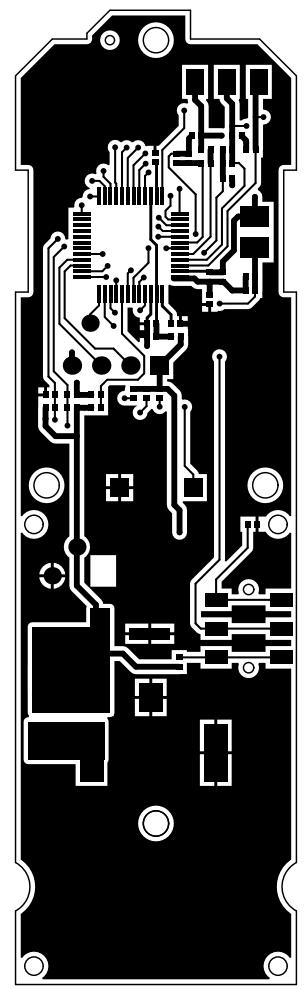

natural_image

Pure electrical circuit lines without any symbols

<table><tr><td>3</td><td></td><td></td><td colspan="2">产品名称 红外体温计</td><td colspan="2">产品型号 PT9L</td><td>版本 V1.0</td><td rowspan="3"></td></tr><tr><td>2</td><td></td><td></td><td colspan="4">PCB编号 PT9L-HFMP01 V1.0</td><td>Bottom layer 层</td></tr><tr><td>1</td><td></td><td></td><td>设计</td><td colspan="2">审核</td><td>批准</td><td>第 3页 共 7页</td></tr><tr><td>NO.</td><td>更改记录</td><td>更改时间</td><td>日期</td><td colspan="2">日期</td><td>日期</td><td></td><td></td></tr></table>

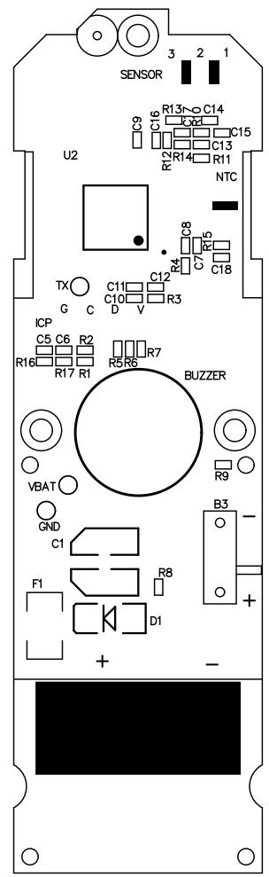

text_image

SENSOR
U2
C16
R13
C14
C15
C13
R12
R14
R11
NTC
TX
G C
C8
C7
C5
C12
C10
D V
R3
C18
ICP
C5 C6 R2
R16 R17 R1
R5 R6
BUZZER
VBAT
GND
C1
F1
R8
D1
B3
-
+
-
-

<table><tr><td>3</td><td></td><td></td><td colspan="2">产品名称 红外体温计</td><td colspan="2">产品型号 PT9L</td><td>版本 V1.0</td><td rowspan="3"></td></tr><tr><td>2</td><td></td><td></td><td colspan="4">PCB编号 PT9L-HFMP01 V1.0</td><td>Bottom Overlay 层</td></tr><tr><td>1</td><td></td><td></td><td>设计</td><td colspan="2">审核</td><td>批准</td><td>第 4页 共 7页</td></tr><tr><td>NO.</td><td>更改记录</td><td>更改时间</td><td>日期</td><td colspan="2">日期</td><td>日期</td><td></td><td></td></tr></table>

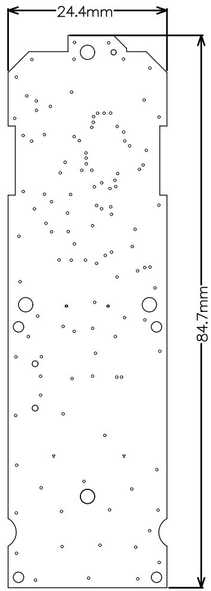

other

| Dimension | Value   |
| --------- | ------- |
| Top Width | 24.4mm  |
| Bottom Width | 84.7mm  |

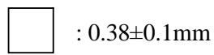

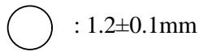

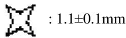

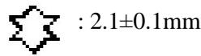

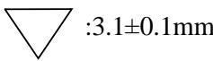

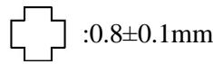

双面板

材质：FR4

颜色：绿油

表面处理：喷锡

所有过孔不开窗

<table><tr><td>3</td><td></td><td></td><td colspan="2">产品名称 红外体温计</td><td colspan="2">产品型号 PT9L</td><td>版本 V1.0</td><td rowspan="3"></td></tr><tr><td>2</td><td></td><td></td><td colspan="4">PCB编号 PT9L-HFMP01 V1.0</td><td>Drill Layer 层</td></tr><tr><td>1</td><td></td><td></td><td>设计</td><td colspan="2">审核</td><td>批准</td><td>第5页 共7页</td></tr><tr><td>NO.</td><td>更改记录</td><td>更改时间</td><td>日期</td><td colspan="2">日期</td><td>日期</td><td></td><td></td></tr></table>

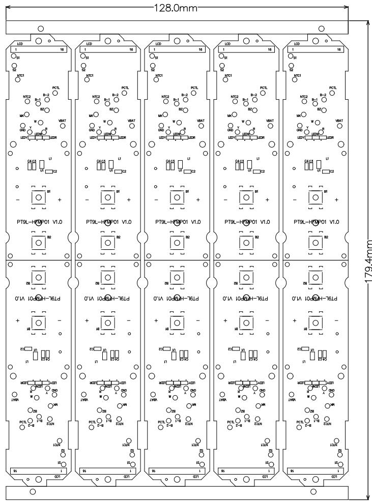

text_image

128.0mm
179.4mm
LCD
LCD
LCD
LCD
LCD
LCD
LCD
PT9L-HFP01 V1.0
PT9L-HFP01 V1.0
PT9L-HFP01 V1.0
PT9L-HFP01 V1.0
PT9L-HFP01 V1.0
PT9L-HFP01 V1.0
PT9L-HFP01 V1.0
PT9L-HFP01 V1.0
PT9L-HFP01 V1.0
PT9H-76Ld
PT9H-76Ld
PT9H-76Ld
PT9H-76Ld
PT9H-76Ld
PT9H-76Ld
PT9H-76Ld
PT9H-76Ld
PT9H-76Ld
PT9H-76Ld
PT9H-76Ld
PT9H-76Ld

<table><tr><td>3</td><td></td><td></td><td colspan="2">产品名称 红外体温计</td><td colspan="2">产品型号 PT9L</td><td>版本 V1.0</td></tr><tr><td>2</td><td></td><td></td><td colspan="3">PCB编号 PT9L-HFMP01 V1.0</td><td colspan="2">拼板示意图(顶层)</td></tr><tr><td>1</td><td></td><td></td><td>设计</td><td>审核</td><td>批准</td><td colspan="2">第6页 共7页</td></tr><tr><td>NO.</td><td>更改记录</td><td>更改时间</td><td>日期</td><td>日期</td><td>日期</td><td colspan="2"></td></tr></table>

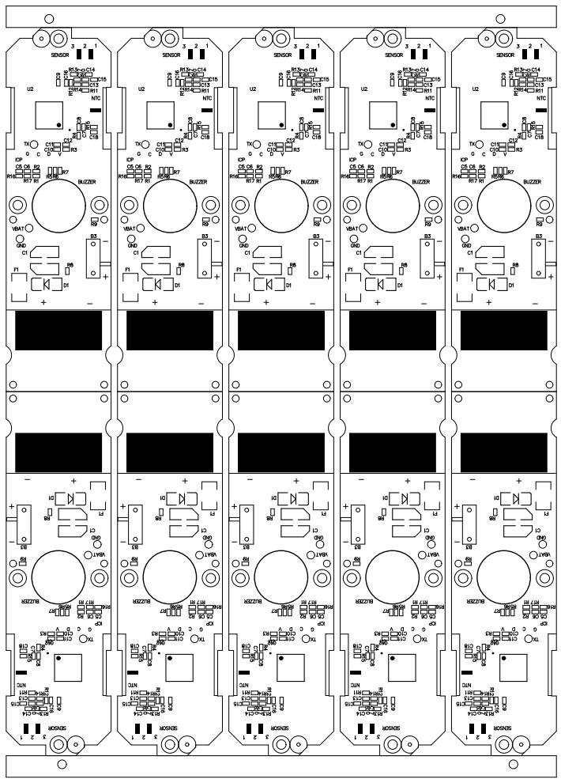

text_image

Circuit board layout diagram with labeled components including sensors, relays, and ICs

<table><tr><td>3</td><td></td><td></td><td colspan="2">产品名称 红外体温计</td><td colspan="2">产品型号 PT9L</td><td>版本 V1.0</td></tr><tr><td>2</td><td></td><td></td><td colspan="3">PCB编号 PT9L-HFMP01 V1.0</td><td colspan="2">拼板示意图(底层)</td></tr><tr><td>1</td><td></td><td></td><td>设计</td><td>审核</td><td>批准</td><td colspan="2">第7页 共7页</td></tr><tr><td>NO.</td><td>更改记录</td><td>更改时间</td><td>日期</td><td>日期</td><td>日期</td><td colspan="2"></td></tr></table>

尺寸序号

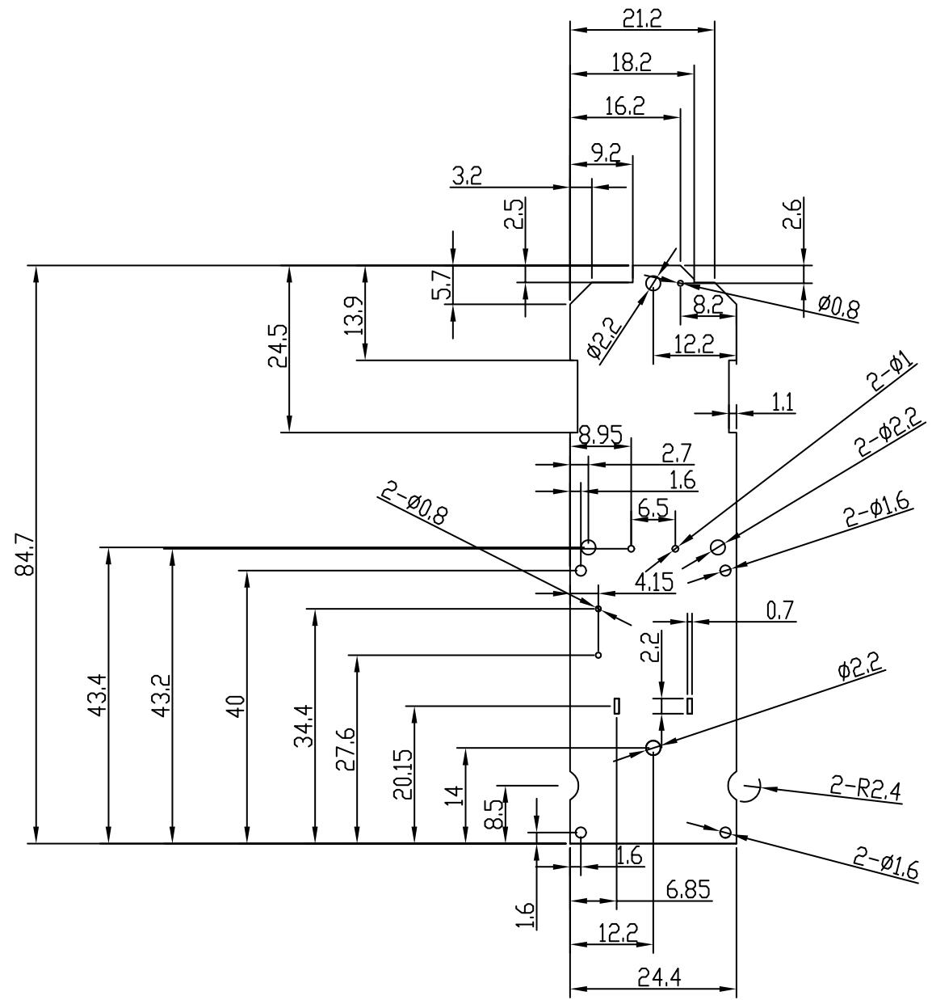

other

| Dimension | Value |
| --------- | ----- |
| Length    | 84.7  |
| Width     | 43.4  |
| Height    | 43.2  |
| Base      | 40    |
| Width     | 34.4  |
| Height    | 27.6  |
| Width     | 20.15 |
| Base      | 14    |
| Width     | 8.5   |
| Height    | 1.6   |
| Width     | 1.6   |
| Base      | 1.2   |
| Width     | 6.85  |
| Height    | 24.4  |
| Width     | 2.2   |
| Height    | 2.7   |
| Width     | 1.6   |
| Base      | 0.7   |
| Width     | 0.7   |
| Height    | 4.15  |
| Width     | 8.95  |
| Base      | 12.2  |
| Width     | 12.2  |
| Height    | 8.2   |
| Width     | 9.2   |
| Base      | 5.7   |
| Width     | 13.9  |
| Height    | 24.5  |
| Width     | 2.5   |
| Height    | 21.2  |
| Width     | 18.2  |
| Height    | 16.2  |
| Width     | 2.6   |
| Base      | 2-Φ0.8|
| Width     | 2-Φ1.6|
| Height    | 2-Φ1.6|
| Width     | 2-Φ2.4|
| Height    | 2-Φ2.4|
| Width     | 2-Φ1.6|
| Base      | 2-Φ0.8|
| Width     | 0.7   |
| Height    | 6.85  |
| Width     | 1.6   |
| Height    | 1.6   |
| Width     | 1.6   |
| Height    | 12.2  |
| Width     | 1.6   |
| Height    | 8.5   |
| Width     | 8.5   |
| Height    | 6.85  |
| Width     | 6.85  |
| Height    | 6.85  |
| Width     | 6.85  |
| Height    | 6.85  |
| Width     | 6.85  |
| Height    | 6.85  |
| Width     | 6.85  |
| Height    | 6.85  |
| Width     | 6.85  |
| Height    | 6.85  |

技术要求：

1 . TH . = 1 . 0 ± 0 . 1   
2 . 产 品 符合roh s 2 . 0

<table><tr><td rowspan="2">DTM\LEVEL</td><td colspan="3">GENERAL TOLERANCE</td></tr><tr><td>A</td><td>B</td><td>C</td></tr><tr><td>&lt; 5</td><td>±0.03</td><td>±0.1</td><td>±0.15</td></tr><tr><td>&gt; 5~15</td><td>±0.05</td><td>±0.1</td><td>±0.15</td></tr><tr><td>&gt; 15~50</td><td>±0.05</td><td>±0.1</td><td>±0.2</td></tr><tr><td>&gt; 50~100</td><td>±0.08</td><td>±0.2</td><td>±0.3</td></tr><tr><td>&gt;100</td><td>±0.1%</td><td>±0.2%</td><td>±0.3%</td></tr><tr><td>ANGULAR</td><td>±0.1°</td><td>±0.5°</td><td>±0.5°</td></tr><tr><td colspan="2">SELECT LEVEL</td><td rowspan="2"></td><td rowspan="2"></td></tr><tr><td colspan="2">B</td></tr></table>

<table><tr><td>3</td><td></td><td></td><td></td><td>Signature</td><td>Date</td><td colspan="2">Tolerance</td><td>Pro material</td><td>环氧树脂板</td><td>Model NO.</td><td colspan="2">T-Z1</td></tr><tr><td>2</td><td></td><td></td><td>Design</td><td></td><td></td><td>.X</td><td></td><td>Surf dispose</td><td></td><td>Part name</td><td colspan="2">PCB</td></tr><tr><td>1</td><td></td><td></td><td>Checkup</td><td></td><td></td><td>.XX</td><td></td><td>Scale</td><td>1:1</td><td>Drawing NO.</td><td colspan="2">T-Z1-P13</td></tr><tr><td>No.</td><td>更改记录</td><td>更改时间</td><td>Approve</td><td></td><td></td><td>.X°</td><td></td><td>Units</td><td>mm</td><td></td><td>Edition</td><td>V1.0</td></tr></table>