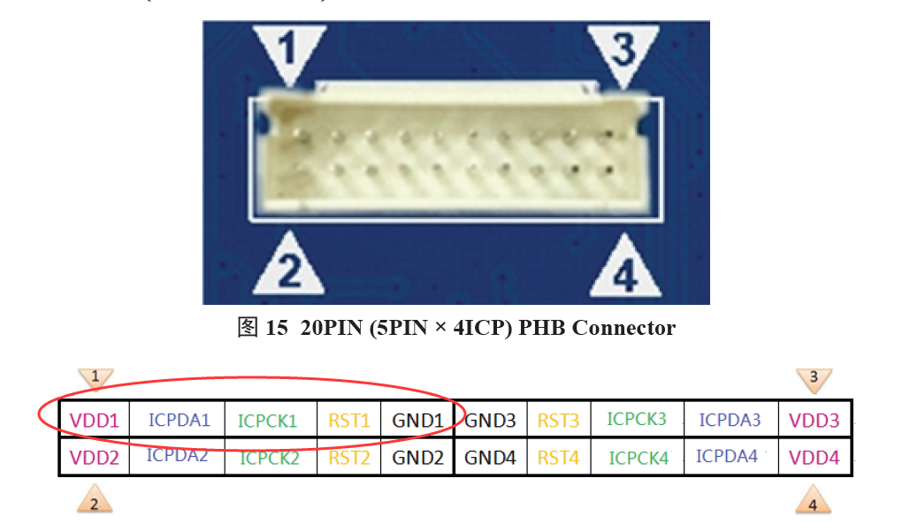
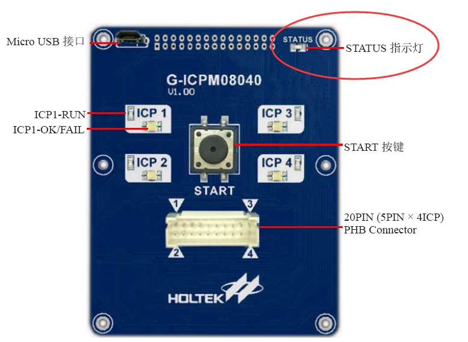
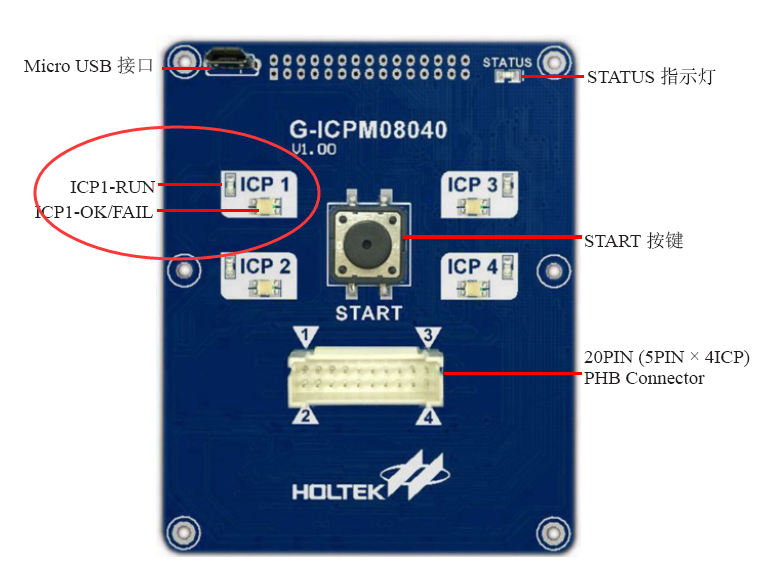

**工装操作说明**

**（V1.0）**

产品/项目名称：    <u>红外体温计</u>    

产  品  型  号：        <u>PT9L</u>       

项  目  编  号：     <u>30000078</u>      

**编    制**：                     <u>年   月   日</u>

**审    核**：                     <u>年   月   日</u>

**批    准**：                     <u>年   月   日</u>

**历史版本记录** 

<table><tr><td>
<strong>序号</strong>
</td><td>
<strong>修改日期</strong>
</td><td>
<strong>修改描述</strong>
</td><td>
<strong>版本</strong>
</td><td>
<strong>编制</strong>
</td><td>
<strong>批准</strong>
</td></tr><tr><td>
1
</td><td>
2024年4月20日
</td><td>
起草
</td><td>
V1.0
</td><td>
万龙
</td><td>
侯广伟
</td></tr><tr><td></td><td></td><td></td><td></td><td></td><td></td></tr><tr><td></td><td></td><td></td><td></td><td></td><td></td></tr><tr><td></td><td></td><td></td><td></td><td></td><td></td></tr><tr><td></td><td></td><td></td><td></td><td></td><td></td></tr><tr><td></td><td></td><td></td><td></td><td></td><td></td></tr><tr><td></td><td></td><td></td><td></td><td></td><td></td></tr><tr><td></td><td></td><td></td><td></td><td></td><td></td></tr><tr><td></td><td></td><td></td><td></td><td></td><td></td></tr><tr><td></td><td></td><td></td><td></td><td></td><td></td></tr><tr><td></td><td></td><td></td><td></td><td></td><td></td></tr><tr><td></td><td></td><td></td><td></td><td></td><td></td></tr><tr><td></td><td></td><td></td><td></td><td></td><td></td></tr><tr><td></td><td></td><td></td><td></td><td></td><td></td></tr><tr><td></td><td></td><td></td><td></td><td></td><td></td></tr><tr><td></td><td></td><td></td><td></td><td></td><td></td></tr></table>

**工装名称：**

1、机芯检测工装：PT9L-CESHI

2、烧写工装：PT9L-SHAOXIE

- **芯片烧写**

需要的工装和工具：烧写工装PT9L-SHAOXIE，合泰Gang-Writer8-8烧写器（需事先下载好要烧写的程序），J-LINK。

<table><tr><td>
<strong>步骤</strong>
</td><td>
<strong>具体操作</strong>
</td><td>
<strong>测试现象</strong>
</td><td>
<strong>备注</strong>
</td></tr><tr><td>
1
</td><td>
工装准备：

1、使用杜邦线连接工装的ICP端子和合泰烧写器的烧写端口：

工装ICP“V”脚连烧写器VDD1脚；

工装ICP“D”脚连烧写器ICPDA1脚；

工装ICP“C”脚连烧写器ICPCK1脚；

工装ICP“G”脚连烧写器GND1脚；
</td><td></td><td></td></tr><tr><td>
2
</td><td>
合泰烧写器上电
</td><td>
烧写器的STATUS灯亮；
</td><td></td></tr><tr><td>
3
</td><td>
烧写主MCU
</td><td><ol><li>按下烧写器的烧写键，此时烧写器的ICP1灯闪烁；</li><li>烧写器的ICP1灯点亮则烧写成功；</li><li>烧写器的ICP1灯熄灭则烧写失败。</li></ol></td><td></td></tr><tr><td>
4
</td><td>
更换主板。
</td><td>
重复步骤3操作。
</td><td></td></tr></table>

- **机芯检测**

需要的工装和工具：机芯检测工装：PT9L-CESHI，直流稳压电源。

<table><tr><td>
<strong>步骤</strong>
</td><td>
<strong>具体操作</strong>
</td><td>
<strong>测试现象</strong>
</td><td>
<strong>备注</strong>
</td></tr><tr><td>
1
</td><td>
工装准备：

直流稳压电源调成5V输出，分正负极接入工装的电源端子
</td><td></td><td></td></tr><tr><td>
2
</td><td>
把待测主板压入工装的夹具上，拨动开关B1工装上电
</td><td>
1、上电后两个LED灯D1和D2全亮，屏幕显示CB1，然后显示软件版本号，2s后进入休眠，两个LED灯熄灭，显示黑屏，操作人员查看休眠电流，应小于50uA；

2、按下按键B1唤醒，两个LED点亮，LCD全显，再次按下按键保存，CB1完成；

3、若自检未通过，屏幕显示Er1。
</td><td>
程序自动检测电池电压，外部NTC，红外传感器的贴片情况，应该满足如下条件：

a． 电池电压在2.7V到3.3V之间

b． 红外传感器测温应在10℃到40℃之间

否则，LCD会显示Er1错误提示，此时按下按键会循环显示上面两个测量结果供查找问题。
</td></tr><tr><td>
3
</td><td>
测试都通过，机芯为良品，更换机芯，重复步骤2
</td><td></td><td></td></tr></table>