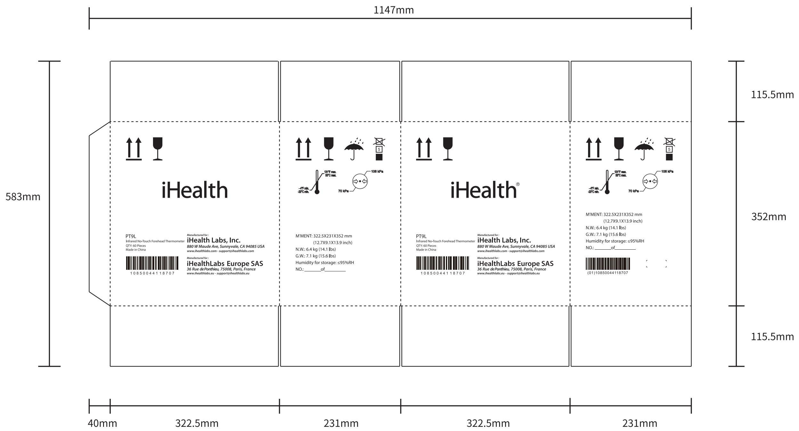

andon

⑧ 尺寸序号

外箱尺寸示意图  
  
技术要求：  
1. 标注尺寸为外径尺寸：322.5 X 231 X 352 mm 公差：±5mm  
2. 箱型代号：0201(GB/T 6543-2008)，上下摇盖  
3.材质: 190g牛皮面纸+170g(A)楞+80g芯纸+130g(B)楞+200g牛皮里纸   
4. 箱体连接使用粘合剂, 不得使用金属钉线  
5.印刷颜色为黑色  
6.本件要求通过RoHS测试

<table><tr><td>3</td><td></td><td></td><td>K04010001435</td><td>Signature</td><td>Date</td><td colspan="2">Tolerance</td><td>Pro material</td><td></td><td>Model NO.</td><td colspan="2">PT9L</td></tr><tr><td>2</td><td></td><td></td><td>Design</td><td></td><td></td><td>.X</td><td></td><td>Surf dispose</td><td></td><td>Part name</td><td colspan="2">外箱</td></tr><tr><td>1</td><td></td><td></td><td>Checkup</td><td></td><td></td><td>.XX</td><td></td><td>Scale</td><td>1:1</td><td>Drawing NO.</td><td colspan="2">PT9L-F01</td></tr><tr><td>No.</td><td>更改记录</td><td>更改时间</td><td>Approve</td><td></td><td></td><td>.X°</td><td></td><td>Units</td><td>mm</td><td></td><td>Edition</td><td>V1.0</td></tr></table>