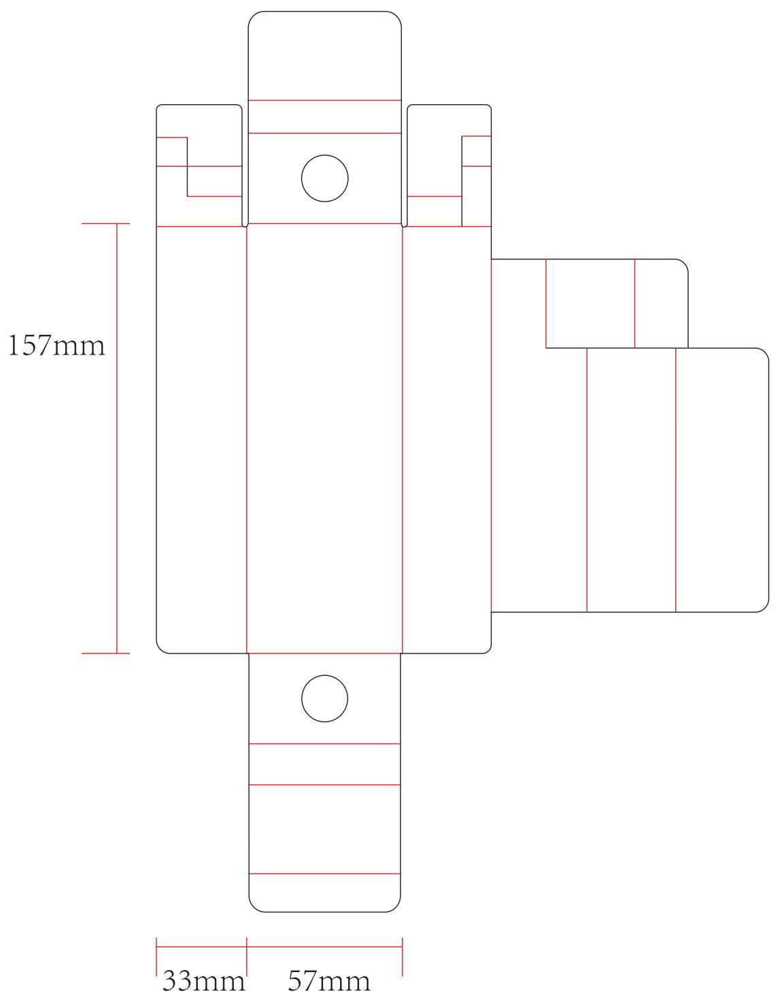

andon

⑧ 尺寸序号

text_image

157mm
33mm 57mm

本件要求通过RoHS测试

说明：材质为：350g白卡纸，覆哑膜

尺寸:57\*33\*157mm，公差:+1-1

印刷颜色: 无印刷

<table><tr><td>3</td><td></td><td></td><td>K04050000271</td><td>Signature</td><td>Date</td><td colspan="2">Tolerance</td><td>Pro material</td><td></td><td>Model NO.</td><td colspan="2">PT9L</td></tr><tr><td>2</td><td></td><td></td><td>Design</td><td></td><td></td><td>.X</td><td></td><td>Surf dispose</td><td></td><td>Part name</td><td colspan="2">纸托</td></tr><tr><td>1</td><td></td><td></td><td>Checkup</td><td></td><td></td><td>.XX</td><td></td><td>Scale</td><td>1:1</td><td>Drawing NO.</td><td colspan="2">PT9L-F04</td></tr><tr><td>No.</td><td>更改记录</td><td>更改时间</td><td>Approve</td><td></td><td></td><td>.X°</td><td></td><td>Units</td><td>mm</td><td></td><td>Edition</td><td>V1.0</td></tr></table>