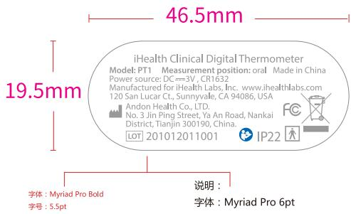

andon

text_image

46.5mm
19.5mm
iHealth Clinical Digital Thermometer
Model: PT1 Measurement position: oral Made in China
Power source: DC=3V, CR1632
Manufactured for iHealth Labs, Inc. www.ihealthlabs.com
120 San Lucar Ct., Sunnyvale, CA 94086, USA
Andon Health Co., LTD.
No. 3 Jin Ping Street, Ya An Road, Nankai
District, Tianjin 300190, China.
LOT 201012011001 IP22
说明：
字体：Myriad Pro Bold
字号：5.5pt
字体：Myriad Pro 6pt

# 46.5mm

比例 1:1

# 19.5mm

本件要求通过RoHS测试

说明：材质为25#透明PET覆哑胶

印刷颜色：C+M+PANTONE Cool gray 7c 三色印刷

iHealth Clinical Digital Thermometer

Model: PT1 Measurement position: oral Made in China

Power source: DC==3V, CR1632

Manufactured for iHealth Labs, Inc. www.ihealthlabs.com

120 San Lucar Ct., Sunnyvale, CA 94086, USA

Andon Health Co., LTD.

No. 3 Jin Ping Street, Ya An Road, Nankai

District, Tianjin 300190, China.

LOT 201012011001

IP22

FC

<table><tr><td>3</td><td></td><td></td><td>K04080002146</td><td>Signature</td><td>Date</td><td colspan="2">Tolerance</td><td>Pro material</td><td></td><td>Model NO.</td><td colspan="2">PT1</td></tr><tr><td>2</td><td></td><td></td><td>Design</td><td></td><td></td><td>.X</td><td></td><td>Surf dispose</td><td></td><td>Part name</td><td colspan="2">铭牌</td></tr><tr><td>1</td><td></td><td></td><td>Checkup</td><td></td><td></td><td>.XX</td><td></td><td>Scale</td><td>1:1</td><td>Drawing NO.</td><td colspan="2">PT1-F05</td></tr><tr><td>No.</td><td>更改记录</td><td>更改时间</td><td>Approve</td><td></td><td></td><td> $X^{\circ}$ </td><td></td><td>Units</td><td>mm</td><td></td><td>Edition</td><td>V1.0</td></tr></table>