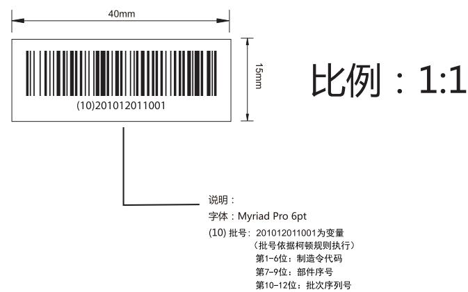
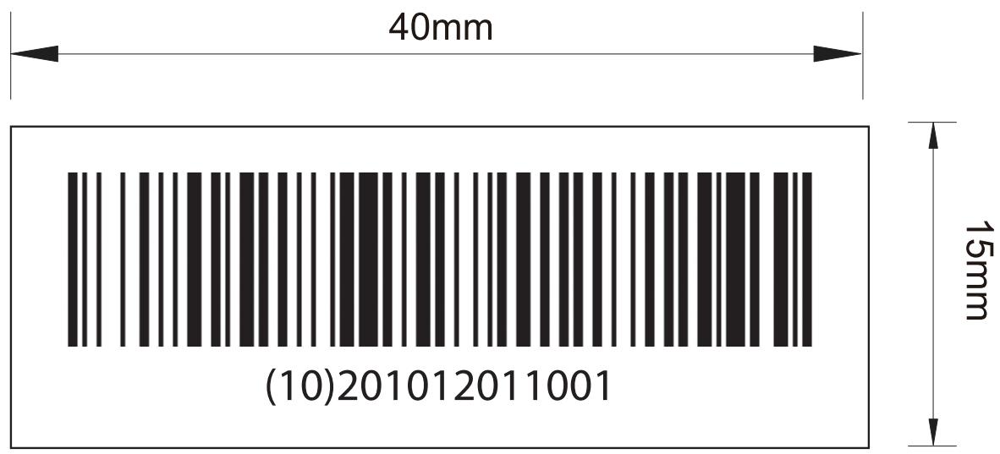
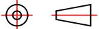

andon   

text_image

40mm
15mm
(10)201012011001
比例：1:1
说明：
字体：Myriad Pro 6pt
(10) 批号：201012011001为变量
（批号依据柯顿规则执行）
第1-6位：制造令代码
第7-9位：部件序号
第10-12位：批次序列号

bar

| Size (mm) | Label         |
| --------- | ------------- |
| 40        | 40mm          |
| 15        | (10)201012011001 |

本件要求通过RoHS测试

说明：80g不干胶铜版纸 覆膜

印刷颜色: 单黑

<table><tr><td>3</td><td></td><td></td><td>K04080002148</td><td>Signature</td><td>Date</td><td colspan="2">Tolerance</td><td>Pro material</td><td></td><td>Model NO.</td><td colspan="2">PT1</td></tr><tr><td>2</td><td></td><td></td><td>Design</td><td></td><td></td><td>.X</td><td>±0.3</td><td>Surf dispose</td><td></td><td>Part name</td><td colspan="2">条码标签</td></tr><tr><td>1</td><td></td><td></td><td>Checkup</td><td></td><td></td><td>.XX</td><td></td><td>Scale</td><td>1:1</td><td>Drawing NO.</td><td colspan="2">PT1-F07</td></tr><tr><td>No.</td><td>更改记录</td><td>更改时间</td><td>Approve</td><td></td><td></td><td>.X°</td><td></td><td>Units</td><td>mm</td><td></td><td>Edition</td><td>V1.0</td></tr></table>