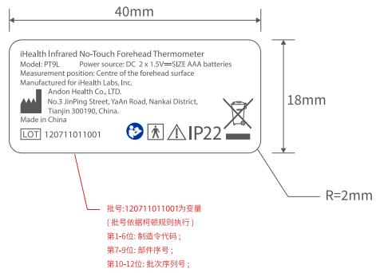
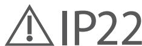

andon

text_image

iHealth Infrared No-Touch Forehead Thermometer
Model: PT9L Power source: DC 2 x 1.5V=5IZE AAA batteries
Measurement position: Centre of the forehead surface
Manufactured for iHealth Labs, Inc.
Andon Health Co., LTD.
No.3 JinPing Street, YoYan Road, Nankai District,
Tianjin 300190, China.
Made in China
LOT 120711011001
IP22
批号:120711011001为变量
（批号依据柯朝规则执行）
第1-6位：制造令代码；
第7-9位：邮件序号；
第10-12位：批次序列号；
R=2mm

比例1:1

iHealth Infrared No-Touch Forehead Thermometer

Model: PT9L Power source: DC 2 x 1.5V=SIZE AAA batteries

Measurement position: Centre of the forehead surface

Manufactured for iHealth Labs, Inc.

Andon Health Co., LTD.

No.3 JinPing Street, YaAn Road, Nankai District, Tianjin 300190, China.

Made in China

LOT

120711011001

批号:120711011001为变量

(批号依据柯顿规则执行)

第1-6位: 制造令代码；

第7-9位: 部件序号；

第10-12位: 批次序列号；

本件要求通过RoHS测试

说明：材质为：25#透明PET覆哑胶

尺寸：40X18mm

印刷颜色：k+1专色

PANTONE 286 C

<table><tr><td>3</td><td></td><td></td><td>K04080002502</td><td>Signature</td><td>Date</td><td colspan="2">Tolerance</td><td>Pro material</td><td></td><td>Model NO.</td><td colspan="2">PT9L</td></tr><tr><td>2</td><td></td><td></td><td>Design</td><td></td><td></td><td>.X</td><td></td><td>Surf dispose</td><td></td><td>Part name</td><td colspan="2">铭牌</td></tr><tr><td>1</td><td></td><td></td><td>Checkup</td><td></td><td></td><td>.XX</td><td></td><td>Scale</td><td>1:1</td><td>Drawing NO.</td><td colspan="2">PT9L-F02</td></tr><tr><td>No</td><td>更改记录</td><td>更改时间</td><td>Approve</td><td></td><td></td><td> $X^{\circ}$ </td><td></td><td>Units</td><td>mm</td><td></td><td>Edition</td><td>V1.0</td></tr></table>