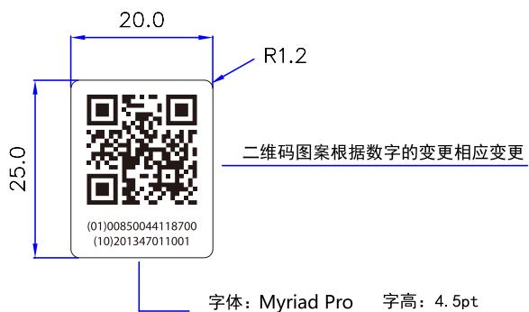
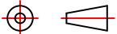

text_image

20.0
R1.2
25.0
(01)00850044118700
(10)201347011001
二维码图案根据数字的变更相应变更
字体：Myriad Pro 字高：4.5pt

字体：Myriad Pro 字高：4.5pt  
第二行编码为批号：201347011001为变量  
(批号依据柯顿规则执行)   
第1-6位：制造令代码  
第7-9位：部件序号  
第10-12位：批次序列号  
(01)00850044118700 (10) 批号 (11) 生产日期 (17) 有效期  
批号、生产日期和有效期的信息内容按照生产现有规则执行  
并根据评审要求以上内容生成二维码

text_image

QR code image containing encoded data, no visible human-readable text

(01)00850044118700   
(10)201347011001

# 技术要求

1. 材质：80g白色不干胶铜版纸  
2. 印刷颜色：单黑印刷   
3. 表面覆亮膜  
4. 本件要求通过RoHS测试

<table><tr><td>3</td><td></td><td></td><td>K04080002503</td><td>Signature</td><td>Date</td><td colspan="2">Tolerance</td><td>Pro material</td><td></td><td>Model NO.</td><td colspan="2">PT9L</td></tr><tr><td>2</td><td></td><td></td><td>Design</td><td></td><td></td><td>.X</td><td>±0.5</td><td>Surf dispose</td><td></td><td>Part name</td><td colspan="2">彩包装标签</td></tr><tr><td>1</td><td></td><td></td><td>Checkup</td><td></td><td></td><td>.XX</td><td></td><td>Scale</td><td>1:1</td><td>Drawing NO.</td><td colspan="2">PT9L-F03</td></tr><tr><td>No.</td><td>更改记录</td><td>更改时间</td><td>Approve</td><td></td><td></td><td>.X°</td><td></td><td>Units</td><td>mm</td><td></td><td>Edition</td><td>V1.0</td></tr></table>