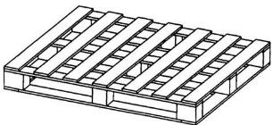
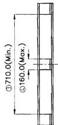
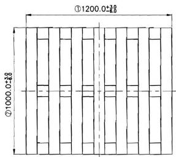
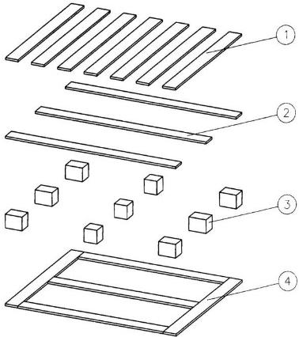

⑧ 尺寸序号

andon   

natural_image

Isometric line drawing of a multi-story building facade with slatted windows (no text or symbols)

text_image

③710.0(Min.)
④160.0(Max.)

text_image

①1200.028
Ø1000.00

text_image

Diagram showing four labeled components of a mechanical or architectural structure, including slats, cubes, and a panel.

# 技术要求

1. 底铺板支承面积不小于 0.42m²  
2. 托盘两对角线长度之差不大于 15.6  
3. 平面度：顶铺板偏离预定水平面垂直偏差不大于 7.0  
4. 托盘动载不小于 1000kg  
5. 若构件使用钉紧固，要求钉端头、钉尖不得伸出构件  
6. 托盘要求通过《联运通用平托盘试验方法》（GB/T 4996-1996）测试

<table><tr><td>4</td><td>底铺板</td><td>胶合板</td><td></td></tr><tr><td>3</td><td>垫块</td><td>刨花板</td><td></td></tr><tr><td>2</td><td>纵梁板</td><td>胶合板</td><td></td></tr><tr><td>1</td><td>顶铺板</td><td>胶合板</td><td></td></tr><tr><td>序号</td><td>构件名称</td><td>材料</td><td>备注</td></tr></table>

<table><tr><td>3</td><td></td><td></td><td></td><td>Signature</td><td>Date</td><td colspan="2">Tolerance</td><td>Pro material</td><td></td><td>Model NO.</td><td colspan="2">KD-931D</td></tr><tr><td>2</td><td></td><td></td><td>Design</td><td></td><td>20/07/5</td><td>.X</td><td></td><td>Surf dispose</td><td></td><td>Part name</td><td colspan="2">托盘</td></tr><tr><td>1</td><td></td><td></td><td>Checkup</td><td></td><td>20/7/5</td><td>.XX</td><td></td><td>Scale</td><td>1:20</td><td>Drawing NO.</td><td colspan="2">KD-931D-F01</td></tr><tr><td>No.</td><td>更改记录</td><td>更改时间</td><td>Approve</td><td></td><td>2/5</td><td>.X°</td><td></td><td>Units</td><td>mm</td><td></td><td>Edition</td><td>V1.0</td></tr></table>