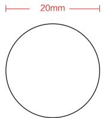

<table><tr><td>商品ID</td><td>SKU编码</td><td>商品名称</td><td>69码</td><td>产品型号</td></tr><tr><td>108237</td><td>3017452</td><td>iHealth 非接触式红外体温仪</td><td>6971177140117</td><td>PT3</td></tr></table>

text_image

20mm

背面有VOID防拆字样

图纸提供单位

北京爱和健康科技有限公司

项目名称

防拆签

版本号

V1.0

规格

PT3-F21

设计时间

2019.04.03

设计师

李杰

材质工艺要求

材质要求: 透明PET 0.025不干胶

制作工序： 模切

工艺要求: 色相正确、印迹牢固、

套印准确、各色套印、

不露杂色，套印误差≤0.1mm

模切走位≤±0.5mm

本件要求通过RoHS测试

颜色及专色：无

纹理要求

纹理方向

选择正确的

方向图标拖

动到图纸里

