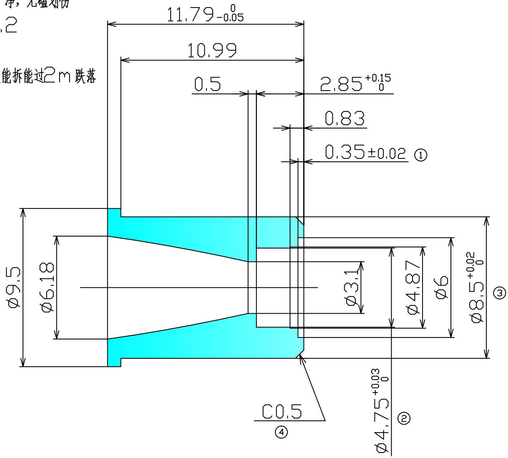

# 技术要求:

1. 材质为黄铜，表面电泳高光黑色，清洗干净，无磕划伤   
2. 未注公差 ±0.1，未注倒角 C0.2  
3. 带编号尺寸为重点检测尺寸   
4.3，4号尺寸与散热器压块套配能装能拆能过2m跌落

other

| Dimension | Value     |
| --------- | --------- |
| Ø9.5      | 11.79 ± 0.05 |
| Ø6.18     | 10.99     |
| Ø3.1      | 0.5       |
| Ø4.87     | 2.85 ± 0.15 |
| Ø6        | 0.83      |
| Ø8.5      | 0.35 ± 0.02 |
| Ø4.75     | 0.03 ± 0.03 |
| Ø4.75     | 0         |
| Ø4.75     | ②        |

<table><tr><td rowspan="5">订正记录</td><td>记号</td><td>日期</td><td>更改内容</td><td>担当</td><td rowspan="5">订正记录</td><td>记号</td><td>日期</td><td>更改内容</td><td>担当</td><td rowspan="5">批准</td><td rowspan="5">审核</td><td rowspan="5">编制</td><td>材质</td><td>黄铜</td><td rowspan="3">名称 散热器金属套</td></tr><tr><td></td><td></td><td></td><td></td><td></td><td></td><td></td><td></td><td rowspan="2">处理</td><td rowspan="2">电泳黑色</td></tr><tr><td></td><td></td><td></td><td></td><td></td><td></td><td></td><td></td></tr><tr><td></td><td></td><td></td><td></td><td></td><td></td><td></td><td></td><td rowspan="2">时间</td><td rowspan="2">2018.9.17</td><td rowspan="2">图番 5B44C</td></tr><tr><td></td><td></td><td></td><td></td><td></td><td></td><td></td><td></td></tr></table>