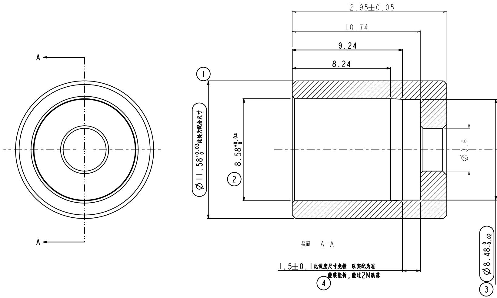

<table><tr><td>REV.</td><td>ZONE</td><td>NOTES</td><td>DRAWN</td><td>DATE</td><td>CHKD&amp;APP.</td><td>DATE</td></tr><tr><td>I.</td><td></td><td></td><td></td><td></td><td></td><td></td></tr><tr><td></td><td></td><td></td><td></td><td></td><td></td><td></td></tr></table>

text_image

A
12.95±0.05
10.74
9.24
8.24
Ø11.58⁺⁰°³此处为配合尺寸
Ø58⁺⁰°⁴
②
Ø3.6
截面 A-A
1.5±0.1此深度尺寸免检 以实配为准
能装能拆,能过2M跌落
④
Ø8.48⁺⁰°⁰²
③

注

1：材质为黄铜，表面光  
2：未注尺寸请以电子档为准,未  
3: 带编号尺寸为重点检测尺寸!但4号尺   
4：3、4号尺寸需与散热金属 能过2M跌

机密

(2017.07.14

iHealth

<table><tr><td rowspan="2">LEVELOTM</td><td colspan="3">GENERAL TOLERANCE</td><td rowspan="2">PART NAME(零件名称)散热器压块</td><td rowspan="4" colspan="4">Famidoc</td></tr><tr><td>A</td><td>B</td><td>C</td></tr><tr><td>&lt;5</td><td>±0.03</td><td>±0.1</td><td>±0.15</td><td rowspan="2">MAT&#x27;L(材料)黄铜</td></tr><tr><td>&gt;5~15</td><td>±0.05</td><td>±0.1</td><td>±0.15</td></tr><tr><td>&gt;15-50</td><td>±0.05</td><td>±0.1</td><td>±0.2</td><td rowspan="2">PRODUCTION NAME体温计</td><td rowspan="2">PRODUCTION NO FDIR-VI4</td><td rowspan="3">DRAWING(设计)</td><td rowspan="3">DATE.(日期)</td><td rowspan="3">2017628</td></tr><tr><td>&gt;50-100</td><td>±0.08</td><td>±0.2</td><td>±0.3</td></tr><tr><td>&gt;100</td><td>±0.1%</td><td>±0.2%</td><td>±0.3%</td><td rowspan="2">FILE NUMBER文件编号</td><td rowspan="2"></td></tr><tr><td>ANGULAR</td><td>±0.1°</td><td>±0.5°</td><td>±0.5°</td><td rowspan="3">AUDITING(审核)</td><td rowspan="3">DATE.(日期)</td><td rowspan="3"></td></tr><tr><td colspan="2">SELECT LEVEL</td><td rowspan="2"></td><td rowspan="2"></td><td rowspan="2" colspan="2">表单编号 QR-12-118</td></tr><tr><td colspan="2">B</td></tr><tr><td>SCALE&lt;比例&gt;</td><td>UNITS&lt;单位&gt;</td><td>REV.&lt;版本&gt;</td><td>SHEET&lt;页数&gt;</td><td rowspan="2" colspan="2">版次 VI.0</td><td rowspan="2">CONFIRM(批准)</td><td rowspan="2">DATE.(日期)</td><td rowspan="2"></td></tr><tr><td></td><td>MM</td><td></td><td>I off</td></tr></table>