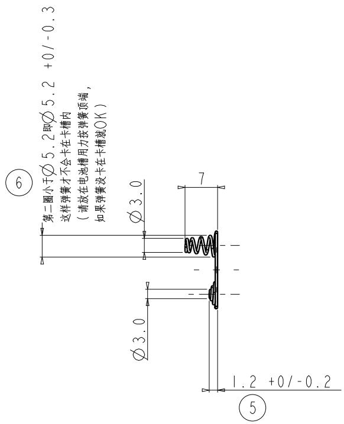
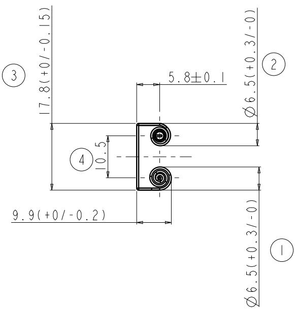
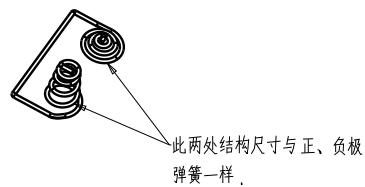
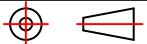

# andon

text_image

第二圈小于Ø5.2即Ø5.2 +0/-0.3
这样弹簧才不会卡在卡槽内
（请放在电池槽用力按弹簧顶端，
如果弹簧没卡在卡槽就OK）
Ø3.0
Ø3.0
1.2 +0/-0.2
⑥
⑤

text_image

17.8(+0/-0.15)
5.8±0.1
6.5(+0.3/-0)
③
②
④
10.5
9.9(+0/-0.2)
Ø6.5(+0.3/-0)
Ø6.5(+0.3/-0)

text_image

此两处结构尺寸与正、负极
弹簧一样。

注

|：产品外观良好，无毛刺 利角。包装良好。  
2：带编号尺寸为重点检测尺寸   
3：未标注尺寸请以样板为准！未注公差依图纸公差为准！   
品质部检验结构时 请以结构签板和组装 实配 为准。  
4；材质符合RHOS.

通过通用的GB2423.17-2008

盐雾测试报告（温度35度 盐水浓度5% 24H 后无生锈）!

<table><tr><td>3</td><td></td><td></td><td></td><td>Signature</td><td>Date</td><td colspan="2">Tolerance</td><td>Pro material</td><td>弹簧钢</td><td>Model NO.</td><td colspan="2">PT3</td></tr><tr><td>2</td><td></td><td></td><td>Design</td><td></td><td></td><td>.X</td><td></td><td>Surf dispose</td><td></td><td>Part name</td><td colspan="2">双联弹簧</td></tr><tr><td>1</td><td></td><td></td><td>Checkup</td><td></td><td></td><td>.XX</td><td></td><td>Scale</td><td>1:1</td><td>Drawing NO.</td><td colspan="2">PT3-P10</td></tr><tr><td>No.</td><td>更改记录</td><td>更改时间</td><td>Approve</td><td></td><td></td><td>.X°</td><td></td><td>Units</td><td>mm</td><td></td><td>Edition</td><td>V1.0</td></tr></table>