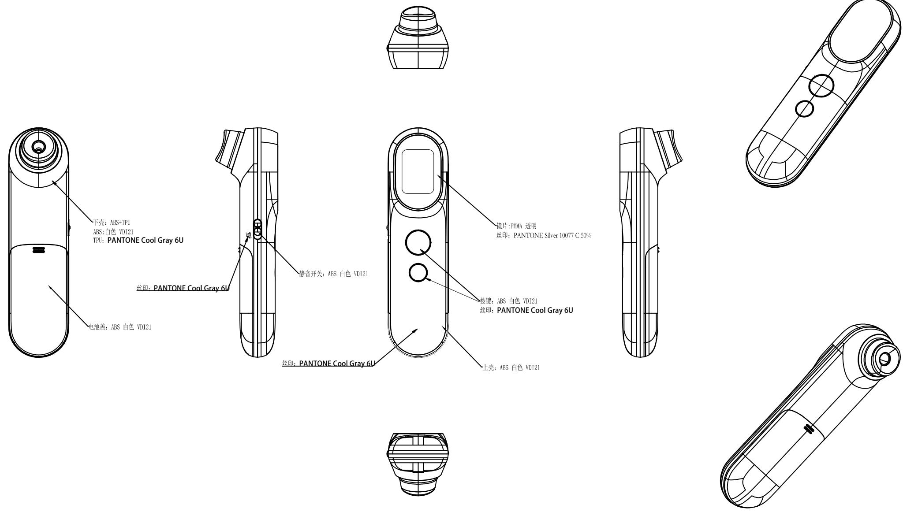

andon

<table><tr><td>6</td><td></td><td></td><td>3</td><td></td><td></td><td></td><td>Signature</td><td>Date</td><td colspan="2">Tolerance</td><td>Pro material</td><td>ABS</td><td>Model NO.</td><td colspan="2">PT9L</td></tr><tr><td>5</td><td></td><td></td><td>2</td><td></td><td></td><td>Design</td><td></td><td></td><td>.X</td><td></td><td>Surf dispose</td><td></td><td>Part name</td><td colspan="2">外观图</td></tr><tr><td>4</td><td></td><td></td><td>1</td><td></td><td></td><td>Checkup</td><td></td><td></td><td>.XX</td><td></td><td>Scale</td><td>1:1</td><td>Drawing NO.</td><td colspan="2">PT9L-F01</td></tr><tr><td>No.</td><td>更改记录</td><td>更改时间</td><td>No.</td><td>更改记录</td><td>更改时间</td><td>Approve</td><td></td><td></td><td>.X°</td><td></td><td>Units</td><td>mm</td><td></td><td>Edition</td><td>V1.0</td></tr></table>