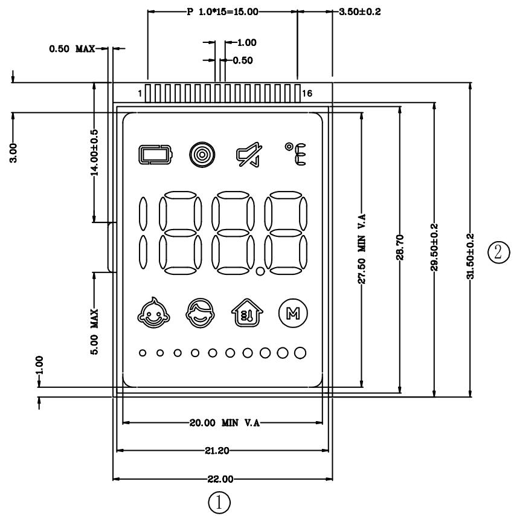
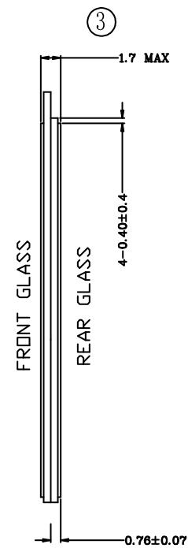
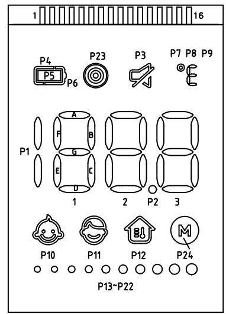

尺寸序号

andon   

text_image

P 1.0*15=15.00
3.50±0.2
0.50 MAX
1
16
3.00
14.00±0.5
1.00
0.50
MAX
5.00
-1.00
27.50 MIN V.A
28.70
29.50±0.2
31.50±0.2
20.00 MIN V.A
21.20
22.00
①

text_image

FRONT GLASS
REAR GLASS
1.7 MAX
4-0.40±0.4
0.76±0.07

text_image

1
16
P4
P23
P3
P7 P8 P9
P5
P6
E
A
F
B
G
C
D
1
2
P2
3
P10
P11
P12
M
P24
P13-P22

P7 P8 P9 邮 0 0

分段代码图

<table><tr><td>PIN</td><td>1</td><td>2</td><td>3</td><td>4</td><td>5</td><td>6</td><td>7</td><td>8</td><td>9</td><td>10</td><td>11</td><td>12</td><td>13</td><td>14</td><td>15</td><td>16</td></tr><tr><td></td><td></td><td></td><td></td><td></td><td>S0</td><td>S1</td><td>S2</td><td>S3</td><td>S4</td><td>S5</td><td>S6</td><td>S7</td><td>S8</td><td>S9</td><td>S10</td><td>S11</td></tr><tr><td>COM0</td><td></td><td></td><td></td><td>COM0</td><td>P1</td><td>1A</td><td>P2</td><td>2A</td><td>P3</td><td>3A</td><td>P4</td><td>P8</td><td>P12</td><td>P16</td><td>P20</td><td>P24</td></tr><tr><td>COM1</td><td></td><td></td><td>COM1</td><td></td><td>1F</td><td>1B</td><td>2F</td><td>2B</td><td>3F</td><td>3B</td><td>P5</td><td>P9</td><td>P13</td><td>P17</td><td>P21</td><td>-</td></tr><tr><td>COM2</td><td></td><td>COM2</td><td></td><td></td><td>1G</td><td>1C</td><td>2G</td><td>2C</td><td>3G</td><td>3C</td><td>P6</td><td>P10</td><td>P14</td><td>P18</td><td>P22</td><td>-</td></tr><tr><td>COM3</td><td>COM3</td><td></td><td></td><td></td><td>1E</td><td>1D</td><td>2E</td><td>2D</td><td>3E</td><td>3D</td><td>P7</td><td>P11</td><td>P15</td><td>P19</td><td>P23</td><td>-</td></tr></table>

# 技术要求：

1. 带编号为重要尺寸, 需要IQC测量；  
2 产 品 符合roh s 2 0

<table><tr><td rowspan="3">DISPLAY TYPE</td><td>TN</td></tr><tr><td>POSITIVE</td></tr><tr><td>TRANSMISSIVE</td></tr><tr><td>FRONT POLARIZER</td><td>NORMAL</td></tr><tr><td rowspan="2">OPERATING METHOD</td><td>1/4 DUTY</td></tr><tr><td>1/3 BIAS</td></tr><tr><td>OPERATION VOLTAGE(VOP)</td><td>3.0V</td></tr><tr><td>VIEWING ANGLE</td><td>6:00</td></tr><tr><td>OPERATION TEMPERATURE</td><td>0°C TO 55°C</td></tr><tr><td>STORAGE TEMPERATURE</td><td>-20°C TO 65°C</td></tr><tr><td>HIGH TEMP./HUMIDITY STROAGE</td><td>/</td></tr><tr><td>CONNECTOR TYPE</td><td>ZEBRA</td></tr><tr><td>LCD CONTROLLER/DRIVER</td><td>/</td></tr><tr><td>BACKLIGHT COLOR</td><td>/</td></tr></table>

<table><tr><td>3</td><td></td><td></td><td></td><td>Signature</td><td>Date</td><td colspan="2">Tolerance</td><td>Pro material</td><td>ITO</td><td>Model NO.</td><td colspan="2">PT9L</td></tr><tr><td>2</td><td></td><td></td><td>Design</td><td></td><td></td><td>.X</td><td></td><td>Surf dispose</td><td></td><td>Part name</td><td colspan="2">液晶</td></tr><tr><td>1</td><td></td><td></td><td>Checkup</td><td></td><td></td><td>.XX</td><td></td><td>Scale</td><td>2:1</td><td>Drawing NO.</td><td colspan="2">PT9L-L01</td></tr><tr><td>No.</td><td>更改记录</td><td>更改时间</td><td>Approve</td><td></td><td></td><td>.X°</td><td></td><td>Units</td><td>mm</td><td></td><td>Edition</td><td>V1.0</td></tr></table>