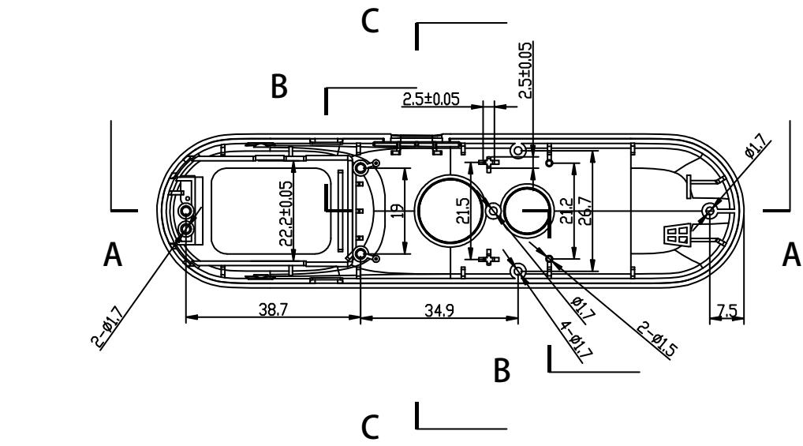
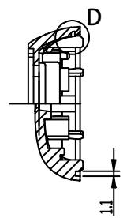
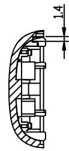
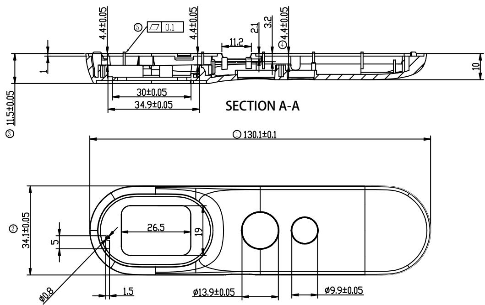
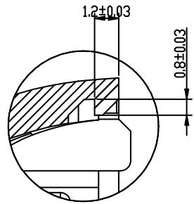
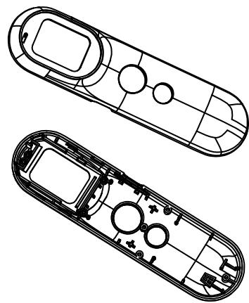

andon

text_image

C
B
2.5±0.05
2.5±0.05
φ1.7
A
22.2±0.05
19
21.5
21.2
26.7
φ1.7
4-φ1.7
2-φ1.5
38.7
34.9
7.5
B
C

SECTION B-B   

text_image

D
1:1

SECTION C-C   

text_image

SECTION A-A
11.5±0.05
30±0.05
34.9±0.05
11.2
4.4±0.05
4.4±0.05
2.1
3.2
4.4±0.05
10
③
① 130.1±0.1
②
34.1±0.05
5
26.5
19
φ0.8
1.5
φ13.9±0.05
φ9.9±0.05

text_image

1.2±0.03
0.8±0.03

DETAIL D
SCALE 5:1

natural_image

Technical line drawing of two elongated electronic components with internal circuitry (no text or symbols)

产品技术要求：

1. 带编号为重要尺寸, 需要IQC测量;

2. 材质为ABS（白色）；产品外观良好、无拉伤，变形，批锋，熔接痕，气纹，顶白，缺胶，缩水等不良现象；

3. 须试装产品，并能顺利装入产品。未标注尺寸以样板为准；品质部检验结构时，请以结构签板和组装（实配）为准

4. 产品符合ROHS 2.0

<table><tr><td rowspan="2">DTM\LEVEL</td><td colspan="3">GENERAL TOLERANCE</td></tr><tr><td>A</td><td>B</td><td>C</td></tr><tr><td>&lt; 5</td><td>±0.03</td><td>±0.1</td><td>±0.15</td></tr><tr><td>&gt; 5~15</td><td>±0.05</td><td>±0.1</td><td>±0.15</td></tr><tr><td>&gt; 15~50</td><td>±0.05</td><td>±0.1</td><td>±0.2</td></tr><tr><td>&gt; 50~100</td><td>±0.08</td><td>±0.2</td><td>±0.3</td></tr><tr><td>&gt;100</td><td>±0.1%</td><td>±0.2%</td><td>±0.3%</td></tr><tr><td>ANGULAR</td><td>±0.1°</td><td>±0.5°</td><td>±0.5°</td></tr><tr><td colspan="2">SELECT LEVEL</td><td rowspan="2"></td><td rowspan="2"></td></tr><tr><td colspan="2">B</td></tr></table>

<table><tr><td>6</td><td></td><td></td><td>3</td><td></td><td></td><td></td><td>Signature</td><td>Date</td><td colspan="2">Tolerance</td><td>Pro material</td><td>ABS</td><td>Model NO.</td><td colspan="2">T-Z1</td></tr><tr><td>5</td><td></td><td></td><td>2</td><td></td><td></td><td>Design</td><td></td><td></td><td>.X</td><td></td><td>Surf dispose</td><td></td><td>Part name</td><td colspan="2">上盖</td></tr><tr><td>4</td><td></td><td></td><td>1</td><td></td><td></td><td>Checkup</td><td></td><td></td><td>.XX</td><td></td><td>Scale</td><td>1:1</td><td>Drawing NO.</td><td colspan="2">T-Z1-P01</td></tr><tr><td>No.</td><td>更改记录</td><td>更改时间</td><td>No.</td><td>更改记录</td><td>更改时间</td><td>Approve</td><td></td><td></td><td>.X°</td><td></td><td>Units</td><td>mm</td><td></td><td>Edition</td><td>V3.0</td></tr></table>