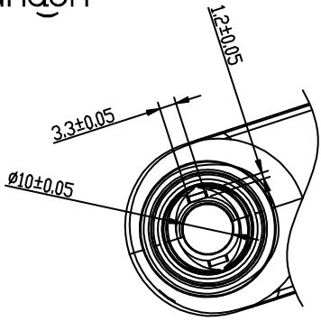
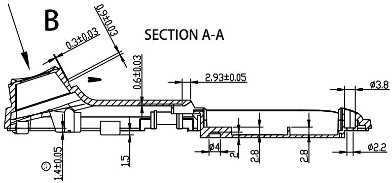
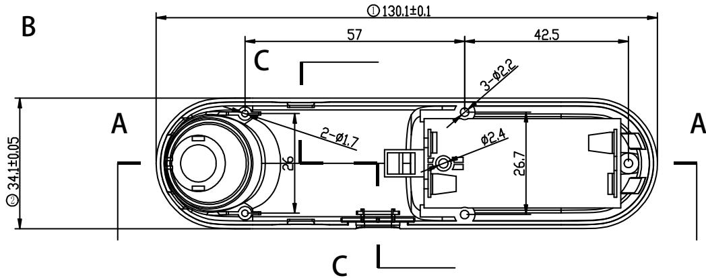
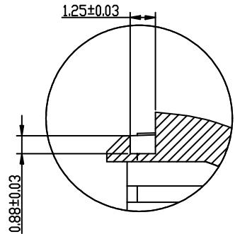
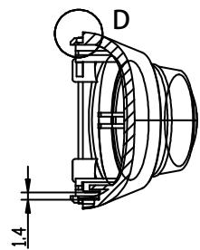
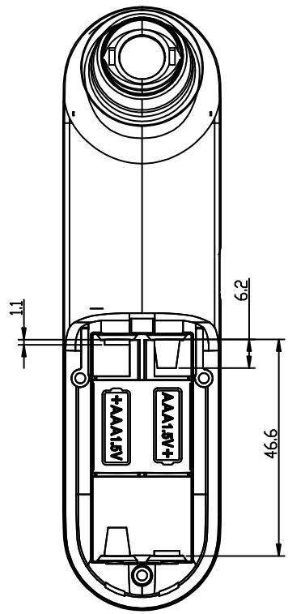
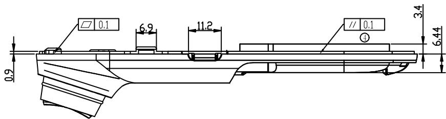
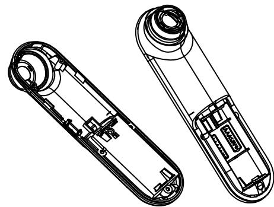

andon   

text_image

12±0.05
3.3±0.05
Ø10±0.05

PROJECTED

text_image

B
SECTION A-A
0.3±0.03
0.9±0.03
0.6±0.03
2.93±0.05
φ3.8
φ4
2.8
2.8
φ2.2
1.4±0.05
1.5

text_image

B
①130.1±0.1
57
42.5
C
3-Ø2.2
2-Ø1.7
Ø2.4
26.7
A
②34.1±0.05
C
A

DETAIL D   
SCALE 5:1   

text_image

1.25±0.03
0.88±0.03

SECTION C-C

text_image

D
1.4

text_image

1.1
6.2
46.6

text_image

0.1
6.9
11.2
// 0.1
3.4
6.44
0.9

产品技术要求：  
1. 带编号为重要尺寸, 需要IQC测量;  
2.材质为ABS（白色）；产品外观良好、无拉伤，变形，批锋，熔接痕，  
气纹，顶白，缺胶，缩水等不良现象；  
3. 须试装产品，并能顺利装入产品。未标注尺寸以样板为准；  
品质部检验结构时，请以结构签板和组装（实配）为准  
4. 产品符合ROHS 2.0

natural_image

Technical line drawing of two mechanical components with internal cutouts and mounting holes (no text or symbols)

<table><tr><td rowspan="2">DTM\LEVEL</td><td colspan="3">GENERAL TOLERANCE</td></tr><tr><td>A</td><td>B</td><td>C</td></tr><tr><td>&lt; 5</td><td>±0.03</td><td>±0.1</td><td>±0.15</td></tr><tr><td>&gt; 5~15</td><td>±0.05</td><td>±0.1</td><td>±0.15</td></tr><tr><td>&gt; 15~50</td><td>±0.05</td><td>±0.1</td><td>±0.2</td></tr><tr><td>&gt; 50~100</td><td>±0.08</td><td>±0.2</td><td>±0.3</td></tr><tr><td>&gt;100</td><td>±0.1%</td><td>±0.2%</td><td>±0.3%</td></tr><tr><td>ANGULAR</td><td>±0.1*</td><td>±0.5*</td><td>±0.5*</td></tr><tr><td colspan="2">SELECT LEVEL</td><td rowspan="2"></td><td rowspan="2"></td></tr><tr><td colspan="2">B</td></tr></table>

<table><tr><td>6</td><td></td><td></td><td>3</td><td></td><td></td><td></td><td>Signature</td><td>Date</td><td colspan="2">Tolerance</td><td>Pro material</td><td>ABS</td><td>Model NO.</td><td colspan="2">T-Z1</td></tr><tr><td>5</td><td></td><td></td><td>2</td><td></td><td></td><td>Design</td><td></td><td></td><td>.X</td><td></td><td>Surf dispose</td><td></td><td>Part name</td><td colspan="2">下盖</td></tr><tr><td>4</td><td></td><td></td><td>1</td><td></td><td></td><td>Checkup</td><td></td><td></td><td>.XX</td><td></td><td>Scale</td><td>1:1</td><td>Drawing NO.</td><td colspan="2">T-Z1-P02</td></tr><tr><td>No.</td><td>更改记录</td><td>更改时间</td><td>No.</td><td>更改记录</td><td>更改时间</td><td>Approve</td><td></td><td></td><td>.X°</td><td></td><td>Units</td><td>mm</td><td></td><td>Edition</td><td>V2.0</td></tr></table>