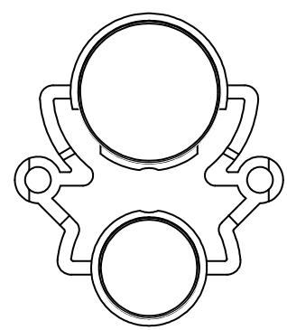
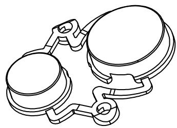
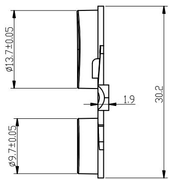
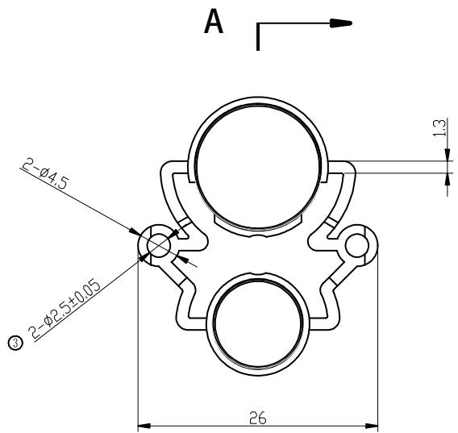
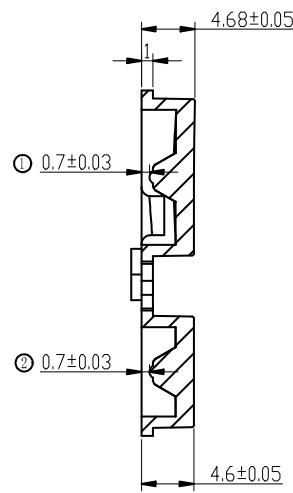

andon

natural_image

Simple line drawing of a symmetrical mechanical or architectural component with two circular ends and three curved arms (no text or symbols)

natural_image

Line drawing of a mechanical device with two cylindrical components connected by rods (no text or symbols)

text_image

Ø13,7±0,05
Ø9,7±0,05
1,9
30,2

text_image

A
2-φ4.5
2-φ2.5±0.05
①
1.3
26

text_image

4.68±0.05
1
① 0.7±0.03
② 0.7±0.03
4.6±0.05

SECTION A-A

# 产品技术要求：

1. 带编号为重要尺寸, 需要IQC测量;  
2.材质为ABS（白色）；产品外观良好、无拉伤，变形，批锋，熔接痕，气纹，顶白，缺胶，缩水等不良现象；  
3. 须试装产品，并能顺利装入产品。未标注尺寸以样板为准；品质部检验结构时，请以结构签板和组装（实配）为准  
4.产品符合ROHS 2.0

<table><tr><td rowspan="2">DTM\LEVEL</td><td colspan="3">GENERAL TOLERANCE</td></tr><tr><td>A</td><td>B</td><td>C</td></tr><tr><td>&lt; 5</td><td>±0.03</td><td>±0.1</td><td>±0.15</td></tr><tr><td>&gt; 5~15</td><td>±0.05</td><td>±0.1</td><td>±0.15</td></tr><tr><td>&gt; 15~50</td><td>±0.05</td><td>±0.1</td><td>±0.2</td></tr><tr><td>&gt; 50~100</td><td>±0.08</td><td>±0.2</td><td>±0.3</td></tr><tr><td>&gt;100</td><td>±0.1%</td><td>±0.2%</td><td>±0.3%</td></tr><tr><td>ANGULAR</td><td>±0.1*</td><td>±0.5*</td><td>±0.5*</td></tr><tr><td colspan="2">SELECT LEVEL</td><td rowspan="2"></td><td rowspan="2"></td></tr><tr><td colspan="2">B</td></tr></table>

<table><tr><td>6</td><td></td><td></td><td>3</td><td></td><td></td><td></td><td>Signature</td><td>Date</td><td colspan="2">Tolerance</td><td>Pro material</td><td>ABS</td><td>Model NO.</td><td colspan="2">T-Z1</td></tr><tr><td>5</td><td></td><td></td><td>2</td><td></td><td></td><td>Design</td><td></td><td></td><td>.X</td><td></td><td>Surf dispose</td><td></td><td>Part name</td><td colspan="2">按键</td></tr><tr><td>4</td><td></td><td></td><td>1</td><td></td><td></td><td>Checkup</td><td></td><td></td><td>.XX</td><td></td><td>Scale</td><td>2:1</td><td>Drawing NO.</td><td colspan="2">T-Z1-P05</td></tr><tr><td>No.</td><td>更改记录</td><td>更改时间</td><td>No.</td><td>更改记录</td><td>更改时间</td><td>Approve</td><td></td><td></td><td>.X°</td><td></td><td>Units</td><td>mm</td><td></td><td>Edition</td><td>V3.0</td></tr></table>