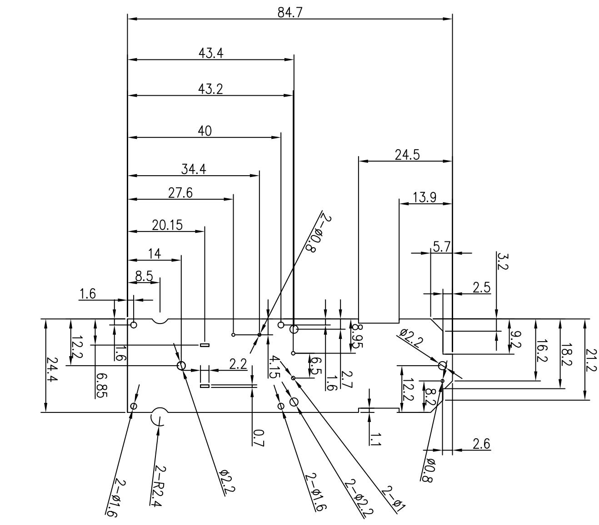

<table><tr><td>3</td><td></td><td>Signature</td><td>Date</td><td>Tolerance</td><td>Pro material</td><td>坏品树脂板</td><td>Model NO.</td><td>T-Z1</td></tr><tr><td>2</td><td></td><td>Design</td><td></td><td>X</td><td></td><td>Surf dispose</td><td></td><td>PCB</td></tr><tr><td>1</td><td></td><td>Chuckup</td><td></td><td>XX</td><td></td><td>Scale</td><td>1:1</td><td>Drawing NO.</td></tr><tr><td>No.</td><td>更改记录</td><td>Approve</td><td></td><td></td><td>X°</td><td></td><td>Unit&#x27;s</td><td>mm</td></tr></table>

text_image

24.4
12.2
6.85
1.6
1.6
8.5
14
20.15
27.6
34.4
40
43.2
43.4
84.7
2-R2.4
φ2.2
φ2.6
0.7
4.15
6.5
2.7
1.6
2-φ2.2
2-φ1.6
2-φ0.8
8.95
1.1
2-φ1
12.2
φ0.8
2.6
3.2
9.2
16.2
18.2
24.5
5.7
13.9
φ0.8

<table><tr><td rowspan="2">LEVEL</td><td colspan="3">GENERAL TOLERANCE</td></tr><tr><td>A</td><td>B</td><td>C</td></tr><tr><td>DIM</td><td colspan="3"></td></tr><tr><td>&lt; 5</td><td>≠003</td><td>≠01</td><td>≠015</td></tr><tr><td>&gt; 5~50</td><td>≠005</td><td>≠01</td><td>≠02</td></tr><tr><td>&lt; 50~100</td><td>≠008</td><td>≠02</td><td>≠03</td></tr><tr><td>&gt;100</td><td>≠0.1%</td><td>≠0.2%</td><td>≠0.3%</td></tr><tr><td>ANSULFAR</td><td>≠0.10</td><td>≠0.5</td><td>≠0.5</td></tr><tr><td>SELECT LEVEL</td><td colspan="3"></td></tr></table>

$⑧$ 尺寸序号