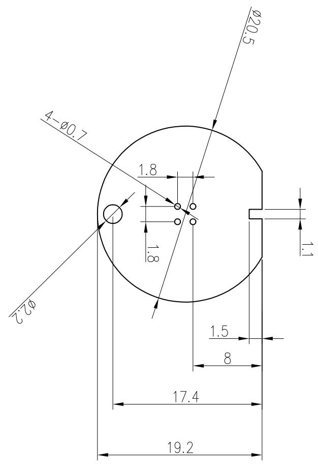

<table><tr><td>3</td><td></td><td>Signature</td><td>Date</td><td>Tolerance</td><td>Pro material</td><td>坏真树脂板</td><td>Model NO.</td><td>T-Z1</td></tr><tr><td>2</td><td></td><td>Design</td><td></td><td>X</td><td></td><td>Surf dispose</td><td></td><td>PCB</td></tr><tr><td>1</td><td></td><td>Chuckup</td><td></td><td>XX</td><td></td><td>Scale</td><td>2:1</td><td>Drawing NO.</td></tr><tr><td>No.</td><td>更改记录</td><td>Approve</td><td></td><td>X°</td><td></td><td>Units</td><td>mm</td><td></td></tr></table>

text_image

φ20.5
19.2
17.4
8
1.5
1.1
1.8
-0.07
φ3.2

技术要求：1.TH=1.0±0.12.产品符合rohs 2.0

<table><tr><td colspan="2">LEVEL</td><td colspan="3">GENERAL TOLERANCE</td></tr><tr><td>DTM</td><td>A</td><td>B</td><td>C</td><td></td></tr><tr><td>&lt; 5</td><td>≠0.03</td><td>≠0.1</td><td>≠0.15</td><td></td></tr><tr><td>&gt; 5~50</td><td>≠0.05</td><td>≠0.1</td><td>≠0.2</td><td></td></tr><tr><td>&gt; 50~100</td><td>≠0.08</td><td>≠0.2</td><td>≠0.3</td><td></td></tr><tr><td>&gt;100</td><td>≠0.1%</td><td>≠0.2%</td><td>≠0.3%</td><td></td></tr><tr><td>ANSULFAR</td><td>≠0.10</td><td>≠0.5</td><td>≠0.5</td><td></td></tr><tr><td colspan="5">SELECTT LEVEL</td></tr></table>