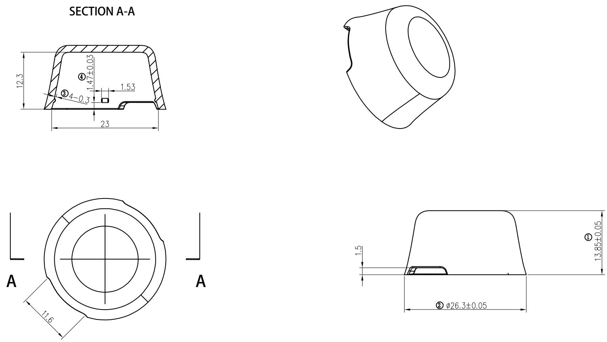

⑧ 尺寸序号

# 产品技术要求：

1. 带编号为重要尺寸, 需要IQC测量;  
2. 材质为PC(半透明)；产品外观良好、无拉伤，变形，批锋，熔接痕，气纹，顶白，缺胶，缩水等不良现象；  
3. 须试装产品，并能顺利装入产品。未标注尺寸以样板为准；品质部检验结构时，请以结构签板和组装（实配）为准  
4. 产品符合ROHS 2.0

<table><tr><td>6</td><td></td><td></td><td>3</td><td></td><td></td><td></td><td>Signature</td><td>Date</td><td colspan="2">Tolerance</td><td>Pro material</td><td>PC</td><td>Model NO.</td><td colspan="2">T-Z1</td></tr><tr><td>5</td><td></td><td></td><td>2</td><td></td><td></td><td>Design</td><td></td><td></td><td>.X</td><td></td><td>Surf dispose</td><td></td><td>Part name</td><td colspan="2">保护盖</td></tr><tr><td>4</td><td></td><td></td><td>1</td><td></td><td></td><td>Checkup</td><td></td><td></td><td>.XX</td><td></td><td>Scale</td><td>2:1</td><td>Drawing NO.</td><td colspan="2">T-Z1-P08</td></tr><tr><td>No.</td><td>更改记录</td><td>更改时间</td><td>No.</td><td>更改记录</td><td>更改时间</td><td>Approve</td><td></td><td></td><td>.X°</td><td></td><td>Units</td><td>mm</td><td></td><td>Edition</td><td>V1.0</td></tr></table>

<table><tr><td rowspan="2">DTM\LEVEL</td><td colspan="3">GENERAL TOLERANCE</td></tr><tr><td>A</td><td>B</td><td>C</td></tr><tr><td>&lt; 5</td><td> $\pm 0.03$ </td><td> $\pm 0.1$ </td><td> $\pm 0.15$ </td></tr><tr><td>&gt; 5~15</td><td> $\pm 0.05$ </td><td> $\pm 0.1$ </td><td> $\pm 0.15$ </td></tr><tr><td>&gt; 15~50</td><td> $\pm 0.05$ </td><td> $\pm 0.1$ </td><td> $\pm 0.2$ </td></tr><tr><td>&gt; 50~100</td><td> $\pm 0.08$ </td><td> $\pm 0.2$ </td><td> $\pm 0.3$ </td></tr><tr><td>&gt;100</td><td> $\pm 0.1\%$ </td><td> $\pm 0.2\%$ </td><td> $\pm 0.3\%$ </td></tr><tr><td>ANGUL-R</td><td> $\pm 0.1^{\circ}$ </td><td> $\pm 0.5^{\circ}$ </td><td> $\pm 0.5^{\circ}$ </td></tr><tr><td colspan="2">SELECT LEVEL</td><td rowspan="2"></td><td rowspan="2"></td></tr><tr><td colspan="2">B</td></tr></table>