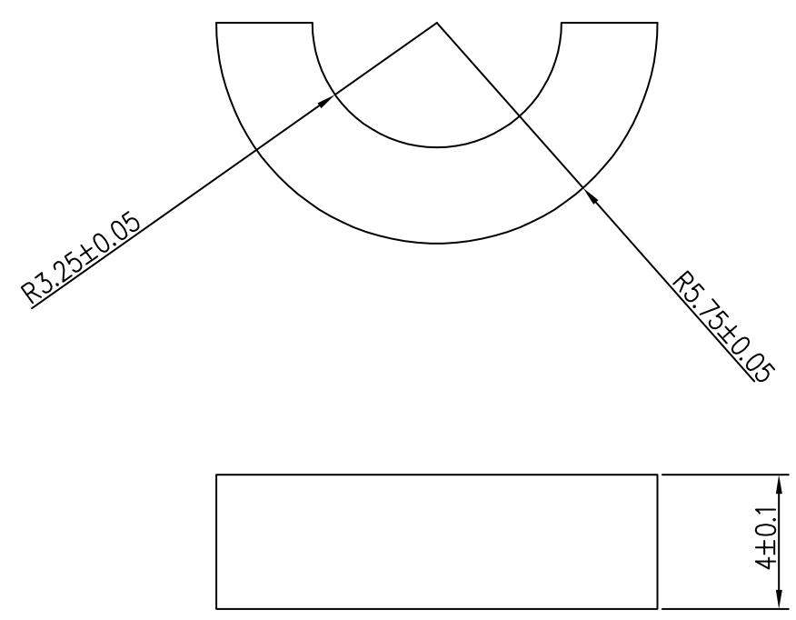

⑧ 尺寸序号

text_image

R3.25±0.05
R5.75±0.05
4±0.1

# 技术要求

1. 标注厚度不包含背胶  
2.材质：聚氨酯   
3. 颜色：黑色  
4. 单面背胶，背胶厚度0.05\~0.1mm，背胶牢固，不可出现背胶分离的情况  
5.邵氏硬度:50±5度  
6. 出货排版需要方便生产加工取放  
7. 本件要求通过RoHS测试

<table><tr><td rowspan="2">DTM\LEVEL</td><td colspan="3">GENERAL TOLERANCE</td></tr><tr><td>A</td><td>B</td><td>C</td></tr><tr><td>&lt; 5</td><td>±0.03</td><td>±0.1</td><td>±0.15</td></tr><tr><td>&gt; 5~15</td><td>±0.05</td><td>±0.1</td><td>±0.15</td></tr><tr><td>&gt; 15~50</td><td>±0.05</td><td>±0.1</td><td>±0.2</td></tr><tr><td>&gt; 50~100</td><td>±0.08</td><td>±0.2</td><td>±0.3</td></tr><tr><td>&gt;100</td><td>±0.1%</td><td>±0.2%</td><td>±0.3%</td></tr><tr><td>ANGULAR</td><td>±0.1°</td><td>±0.5°</td><td>±0.5°</td></tr><tr><td colspan="2">SELECT LEVEL</td><td rowspan="2"></td><td rowspan="2"></td></tr><tr><td colspan="2">B</td></tr></table>

<table><tr><td>3</td><td></td><td></td><td>K03020002129</td><td>Signature</td><td>Date</td><td colspan="2">Tolerance</td><td>Pro material</td><td>聚氨酯</td><td>Model NO.</td><td colspan="2">T-Z1</td></tr><tr><td>2</td><td></td><td></td><td>Design</td><td></td><td></td><td>.X</td><td></td><td>Surf dispose</td><td></td><td>Part name</td><td colspan="2">支撑垫</td></tr><tr><td>1</td><td></td><td></td><td>Checkup</td><td></td><td></td><td>.XX</td><td></td><td>Scale</td><td></td><td>Drawing NO.</td><td colspan="2">T-Z1-P15</td></tr><tr><td>No.</td><td>更改记录</td><td>更改时间</td><td>Approve</td><td></td><td></td><td>.X°</td><td></td><td>Units</td><td>mm</td><td></td><td>Edition</td><td>V1.0</td></tr></table>