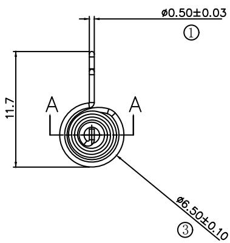
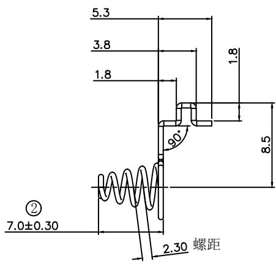
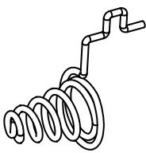
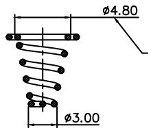
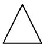

text_image

Ø0.50±0.03
①
11.7
A
A
Ø6.50±0.10
③

text_image

5.3
3.8
1.8
1.8
90°
8.5
②
7.0±0.30
2.30 螺距

text_image

Ø4.80
Ø3.00

请放在电池槽用力按弹簧顶端，不卡槽及无异响就OK

<table><tr><td rowspan="2">DTM\LEVEL</td><td colspan="3">GENERAL TOLERANCE</td></tr><tr><td>A</td><td>B</td><td>C</td></tr><tr><td>&lt; 5</td><td>±0.03</td><td>±0.1</td><td>±0.15</td></tr><tr><td>&gt; 5~15</td><td>±0.05</td><td>±0.1</td><td>±0.15</td></tr><tr><td>&gt; 15~50</td><td>±0.05</td><td>±0.1</td><td>±0.2</td></tr><tr><td>&gt; 50~100</td><td>±0.08</td><td>±0.2</td><td>±0.3</td></tr><tr><td>≥100</td><td>±0.1%</td><td>±0.2%</td><td>±0.3%</td></tr><tr><td>ANGUL/R</td><td>±0.1°</td><td>±0.5°</td><td>±0.5°</td></tr><tr><td colspan="2">SELECT LEVEL</td><td rowspan="2"></td><td rowspan="2"></td></tr><tr><td colspan="2">B</td></tr></table>

技术要求：  
1、弹簧小径3.2MM，大径6.5mm，  
2、材料：线径0.5mm 镀镍不锈钢线。  
3、弹簧要求能上锡焊接。  
4、弹簧表面要求不能有油污。  
5、未注公差尺寸按±0.2mm，角度按±2   
6、须过盐雾浓度为5%（±0.5%）24h   
7、弹簧在压缩5mm时,压力≥0.5kgf。  
8、标示序号的尺寸为检验尺寸。

<table><tr><td></td><td></td><td></td><td colspan="3"></td><td></td><td></td><td rowspan="4" colspan="2">图名:正极弹簧</td><td rowspan="4" colspan="5">图号:PT5-M02</td></tr><tr><td></td><td></td><td></td><td colspan="3"></td><td></td><td></td></tr><tr><td></td><td></td><td></td><td colspan="3"></td><td></td><td></td></tr><tr><td></td><td></td><td></td><td colspan="3"></td><td></td><td></td></tr><tr><td></td><td></td><td></td><td colspan="3"></td><td></td><td></td><td colspan="2">P/No.:</td><td colspan="3">阶段标记</td><td>单位</td><td>比例</td></tr><tr><td>1.0</td><td></td><td></td><td colspan="3">量产管控</td><td>刘钊</td><td>190715</td><td rowspan="2">关键尺寸*</td><td rowspan="2"></td><td rowspan="2"></td><td rowspan="2">A</td><td rowspan="2"></td><td rowspan="2">mm</td><td rowspan="2">2:1</td></tr><tr><td>版本</td><td>标记</td><td>处数</td><td colspan="3">更改描述</td><td>签名</td><td>日期</td></tr><tr><td colspan="2">设计</td><td colspan="2"></td><td>工艺</td><td colspan="3"></td><td rowspan="3" colspan="2">材料:</td><td colspan="5">共 张 第 张</td></tr><tr><td colspan="2">审核</td><td colspan="2"></td><td>标准化</td><td colspan="3"></td><td rowspan="2" colspan="5">iHealth</td></tr><tr><td colspan="2">批准</td><td colspan="2"></td><td>批准</td><td colspan="3"></td></tr></table>