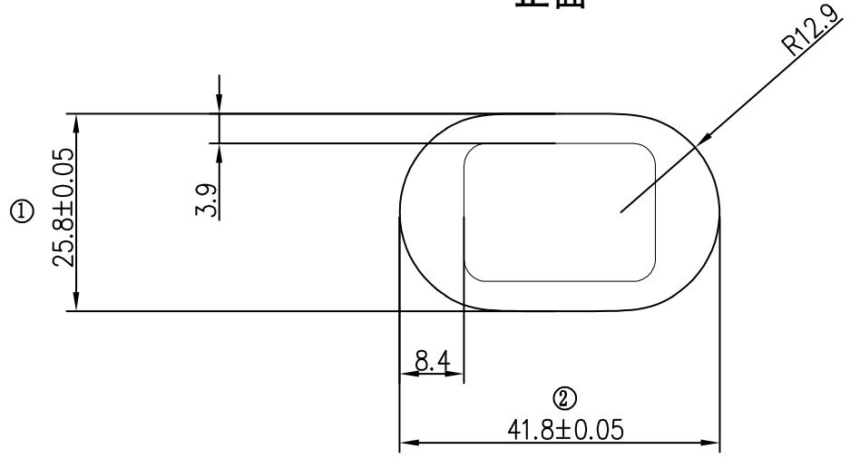
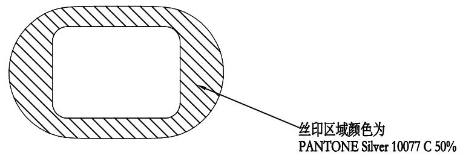
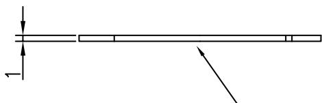
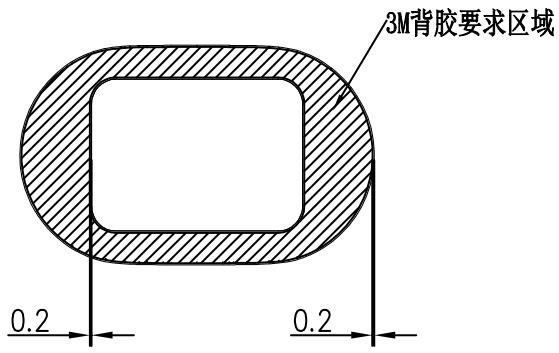

⑧ 尺寸序号

正面  

text_image

正面
R12.9
25.8±0.05
3.9
①
8.4
②
41.8±0.05

背面  

text_image

丝印区域颜色为
PANTONE Silver 10077 C 50%

natural_image

Pure mechanical diagram showing a shaft with a horizontal bar and an arrow indicating direction (no text or symbols)

印刷后，背面附3M背胶，贴胶后产品整体厚度1.1-1.2之间

3M背胶   

text_image

3M背胶要求区域
0.2
0.2

# 产品技术要求：

1.材质：透明PMMA   
2. 毛刺、飞边不大于0.1   
3.厚度含背胶，不含离型纸及保护膜  
4.要求背胶牢固、均匀、无缺失,与被粘物粘贴牢固   
5.透镜上表面需有保护膜  
6.内外表面铅笔硬度不小于4H   
7.本件要求通过RoHS 2.0测试

<table><tr><td rowspan="2">DTM\LEVEL</td><td colspan="3">GENERAL TOLERANCE</td></tr><tr><td>A</td><td>B</td><td>C</td></tr><tr><td>&lt; 5</td><td>±0.03</td><td>±0.1</td><td>±0.15</td></tr><tr><td>&gt; 5~15</td><td>±0.05</td><td>±0.1</td><td>±0.15</td></tr><tr><td>&gt; 15~50</td><td>±0.05</td><td>±0.1</td><td>±0.2</td></tr><tr><td>&gt; 50~100</td><td>±0.08</td><td>±0.2</td><td>±0.3</td></tr><tr><td>&gt;100</td><td>±0.1%</td><td>±0.2%</td><td>±0.3%</td></tr><tr><td>ANGULAR</td><td>±0.1°</td><td>±0.5°</td><td>±0.5°</td></tr><tr><td colspan="2">SELECT LEVEL</td><td rowspan="2"></td><td rowspan="2"></td></tr><tr><td colspan="2">B</td></tr></table>

<table><tr><td>3</td><td></td><td></td><td></td><td>Signature</td><td>Date</td><td colspan="2">Tolerance</td><td>Pro material</td><td>PMMA</td><td>Model NO.</td><td colspan="2">T-Z1</td></tr><tr><td>2</td><td></td><td></td><td>Design</td><td></td><td></td><td>.X</td><td></td><td>Surf dispose</td><td></td><td>Part name</td><td colspan="2">透镜</td></tr><tr><td>1</td><td></td><td></td><td>Checkup</td><td></td><td></td><td>.XX</td><td></td><td>Scale</td><td>1:1</td><td>Drawing NO.</td><td colspan="2">T-Z1-P09</td></tr><tr><td>No.</td><td>更改记录</td><td>更改时间</td><td>Approve</td><td></td><td></td><td>.X°</td><td></td><td>Units</td><td>mm</td><td></td><td>Edition</td><td>V1.0</td></tr></table>