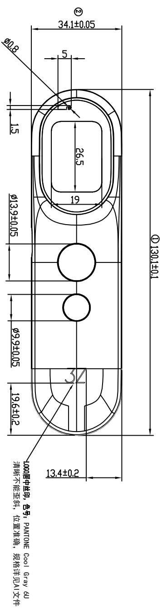
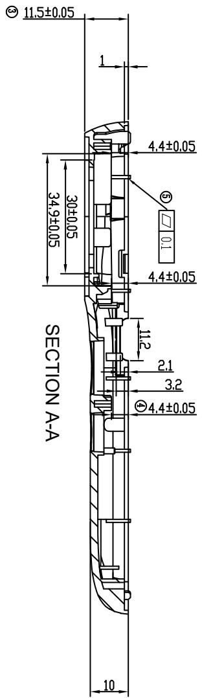
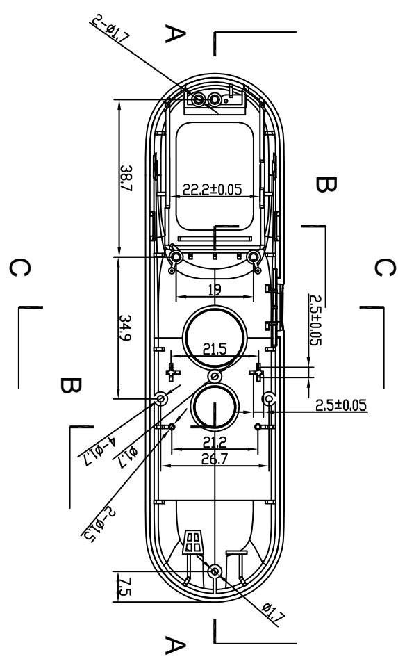
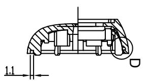
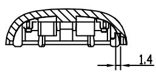
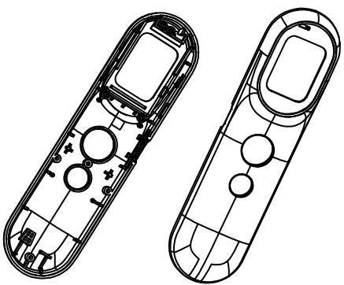
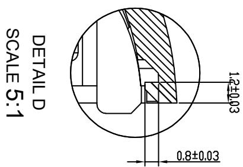

<table><tr><td>6</td><td></td><td>3</td><td></td><td>Signature</td><td>Date</td><td>Tolerance</td><td>Pro material</td><td>ABS</td><td>Model NO.</td><td>T-Z1</td></tr><tr><td>5</td><td></td><td>2</td><td></td><td>Design</td><td></td><td></td><td>X</td><td></td><td>Part name</td><td>上盖</td></tr><tr><td>4</td><td></td><td>1</td><td>初版制作</td><td>2021.07.15</td><td>Checkkup</td><td></td><td></td><td>.XX</td><td></td><td>Scale</td></tr><tr><td>No.</td><td>更改记录</td><td>更改时间</td><td>No.</td><td>更改记录</td><td>更改时间</td><td>Approve</td><td></td><td></td><td>.X°</td><td></td></tr></table>

text_image

130.1±0.1
①
②
134±0.2
26.5
19
34.1±0.05
5
15
φ9,9±0.05
φ13,9±0.05
196±0.2
1000层中丝用，包号：PANTONE COOL GRAY GU
清晰不能歪斜，位置准确，规格详见A1文件

text_image

SECTION A-A
30±0.05
34.9±0.05
11.2
21
3.2
4.4±0.05
4.4±0.05
4.4±0.05
①
②
③
④
⑤
⑥
11.5±0.05

text_image

A
2-φ17
38.7
34.9
22.2±0.05
25±0.05
21.5
26.7
φ12
φ11
φ10
2-φ15
2-φ17
7.5
B
C

natural_image

Technical cross-sectional diagram of a mechanical assembly (no visible text or labels)

ECTION B

  
ECTION C

natural_image

Technical line drawing of two elongated electronic components with internal circuitry (no text or symbols)

text_image

DETAIL D
SCALE 5:1
0.8±0.03
1.2±0.03

1.带编号为重要尺寸，需要IQC测量；2.材质为ABS（白色）；产品外观良好、无拉伤，变形，批锋，熔接痕，气纹，顶白，缺胶，缩水等不良现象；3.须试装产品，并能顺利装入产品.未标注尺寸以样板为准；品质部检验结构时，请以结构签板和组装（实配）为准4.产品符合ROHS2.0

<table><tr><td rowspan="2">LEVEL</td><td colspan="4">GENERAL TOLERANCE</td></tr><tr><td>A</td><td>B</td><td>C</td><td></td></tr><tr><td>DTM</td><td>A</td><td>B</td><td>C</td><td></td></tr><tr><td>DTM</td><td>&gt;5-15</td><td>≤0.05</td><td>≤0.1</td><td>≤0.15</td></tr><tr><td>&gt;5-50</td><td>≤0.05</td><td>≤0.1</td><td>≤0.2</td><td>≤0.3</td></tr><tr><td>&gt;50~100</td><td>≤0.08</td><td>≤0.2</td><td>≤0.3</td><td></td></tr><tr><td>&gt;100</td><td>≤0.1%</td><td>≤0.2%</td><td>≤0.3%</td><td></td></tr><tr><td>AGLWR</td><td>≤0.1%</td><td>≤0.2%</td><td>≤0.3%</td><td></td></tr><tr><td colspan="5">SELECT LEVEL</td></tr></table>