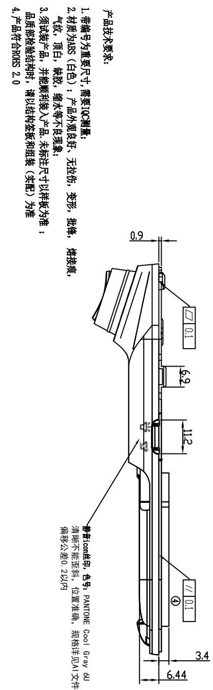
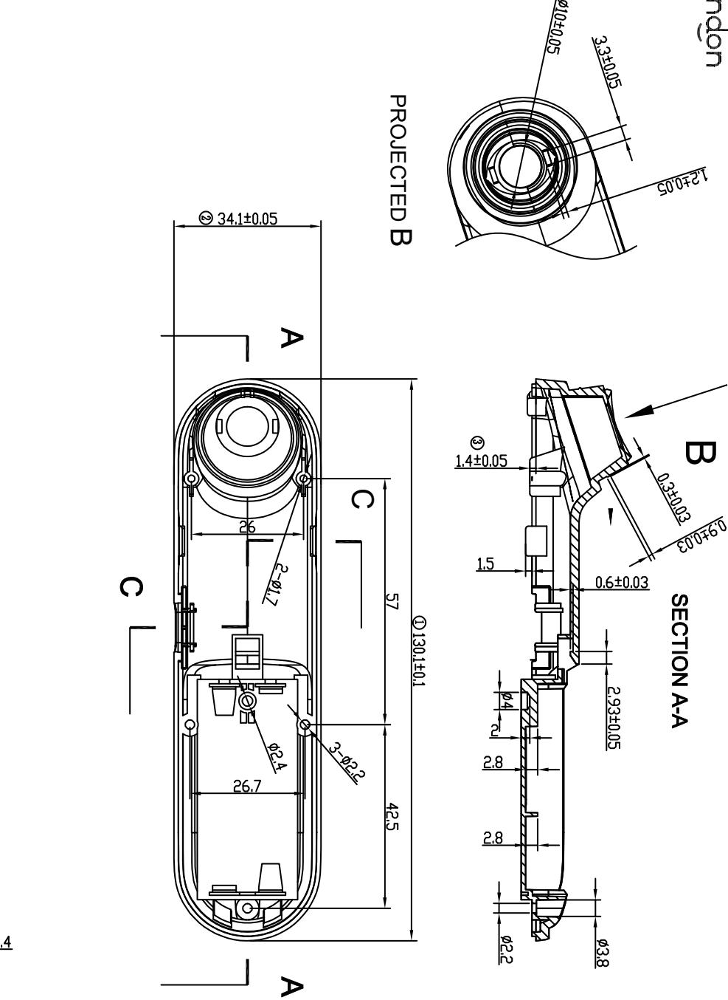
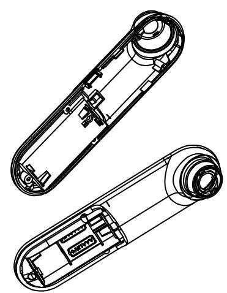
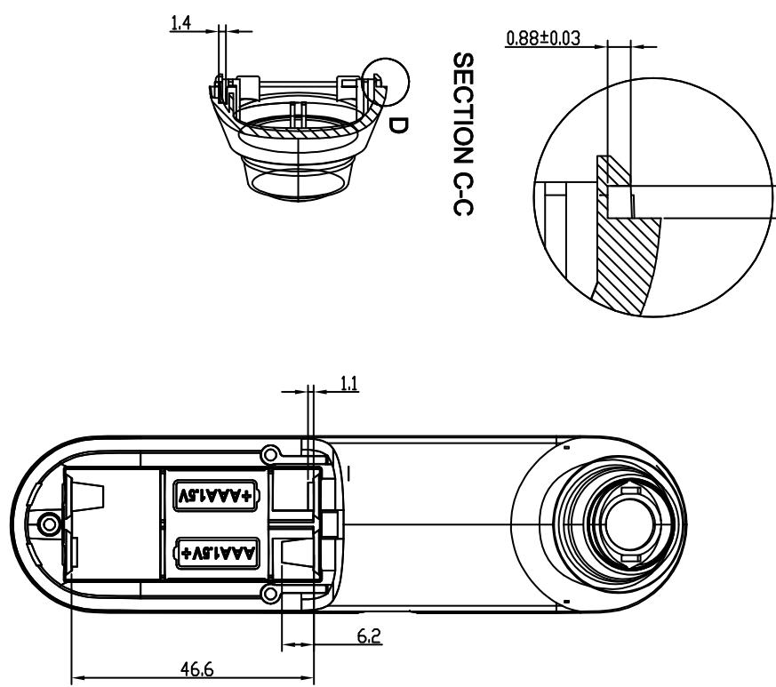
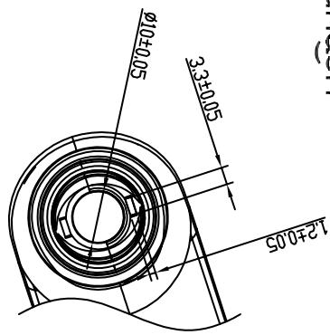
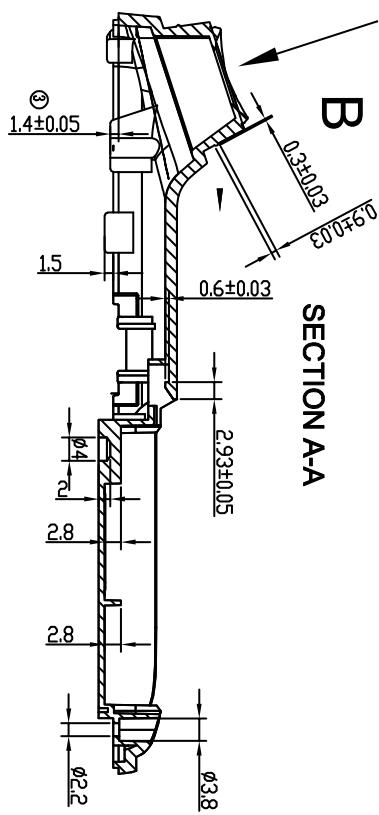

<table><tr><td>6</td><td></td><td>3</td><td></td><td>Signature</td><td>Date</td><td>Tolerance</td><td>Pro material</td><td>ABS</td><td>Model NO.</td><td>T-Z1</td></tr><tr><td>5</td><td></td><td>2</td><td></td><td>Design</td><td></td><td></td><td>X</td><td></td><td>Part name</td><td>下盖</td></tr><tr><td>4</td><td></td><td>1</td><td>初版制作</td><td>2021.07.15</td><td>Checkkup</td><td></td><td>.XX</td><td></td><td>Scale</td><td>1:1 Drawing NO.</td></tr><tr><td>No.</td><td>更改记录</td><td>更改时间</td><td>No.</td><td>更改记录</td><td>更改时间</td><td>Approve</td><td></td><td></td><td>.X°</td><td></td></tr></table>

text_image

产品技术要求:
1.带编号为重要尺寸,需要IGC测量;
2.材质为ABS(白色);产品外观良好、无拉伤,变形,批牌,熔接痕,
气改,顶白,铁改,缩水等不良现象;
3.项试装产品,并能顺利装入产品,未标注尺寸以样板为准;
品质控检验结构时,请以结构面板和组装(实现)为准;
4.产品符合ROHS 2.0;
5.44
6.9
11.2
// 0.1
偏移公差0.2以内
静音Icon丝印,各号:PANTONE COOL GRAY 6u
清除不能连斜,位置准确,规格详见A1文件
静音显示印,各号:PANTONE COOL GRAY 6u

text_image

PROJECTED B
SECTION A-A
B
3.2+0.05
Ø10±0.05
Ø10±0.05
Ø2±0.05
Ø3±0.05
Ø4±0.05
Ø5±0.05
Ø6±0.05
Ø7±0.05
Ø8±0.05
Ø9±0.05
Ø10±0.05
Ø11±0.05
Ø12±0.05
Ø13±0.05
Ø14±0.05
Ø15±0.05
Ø16±0.05
Ø17±0.05
Ø18±0.05
Ø19±0.05
Ø20±0.05
Ø21±0.05
Ø22±0.05
Ø23±0.05
Ø24±0.05
Ø25±0.05
Ø26±0.05
Ø27±0.05
Ø28±0.05
Ø29±0.05
Ø30±0.05
Ø31±0.05
Ø32±0.05
Ø33±0.05
Ø34±0.05
① 130,1±0,1
② 34,1±0,05
C
A

natural_image

Technical line drawing of two mechanical components with internal mechanisms (no text or symbols)

text_image

46.6
6.2
1.1
AAA1.5V+
+AAA1.5V
1.4
D
SECTION C-C
0.88±0.03

DETAIL D SCALE 5:1

text_image

φ10±0.05
3.3±0.05
12±0.05

text_image

SECTION A-A
B

<table><tr><td rowspan="2">LEVEL</td><td colspan="4">GENERAL TOLERANCE</td></tr><tr><td>A</td><td>B</td><td>C</td><td></td></tr><tr><td>DTM</td><td colspan="4">A</td></tr><tr><td>&lt; 5</td><td>≠03</td><td>≠01</td><td>≠0.5</td><td></td></tr><tr><td>&gt; 5-50</td><td>≠005</td><td>≠01</td><td>≠02</td><td></td></tr><tr><td>&gt; 50-100</td><td>≠008</td><td>≠02</td><td>≠03</td><td></td></tr><tr><td>&gt;100</td><td>≠01%</td><td>≠02%</td><td>≠03%</td><td></td></tr><tr><td>AGRICULAR</td><td>R</td><td>≠0.7</td><td>≠0.5</td><td>≠0.5</td></tr><tr><td>SLEETCT</td><td>L</td><td>LEVEL</td><td></td><td></td></tr></table>