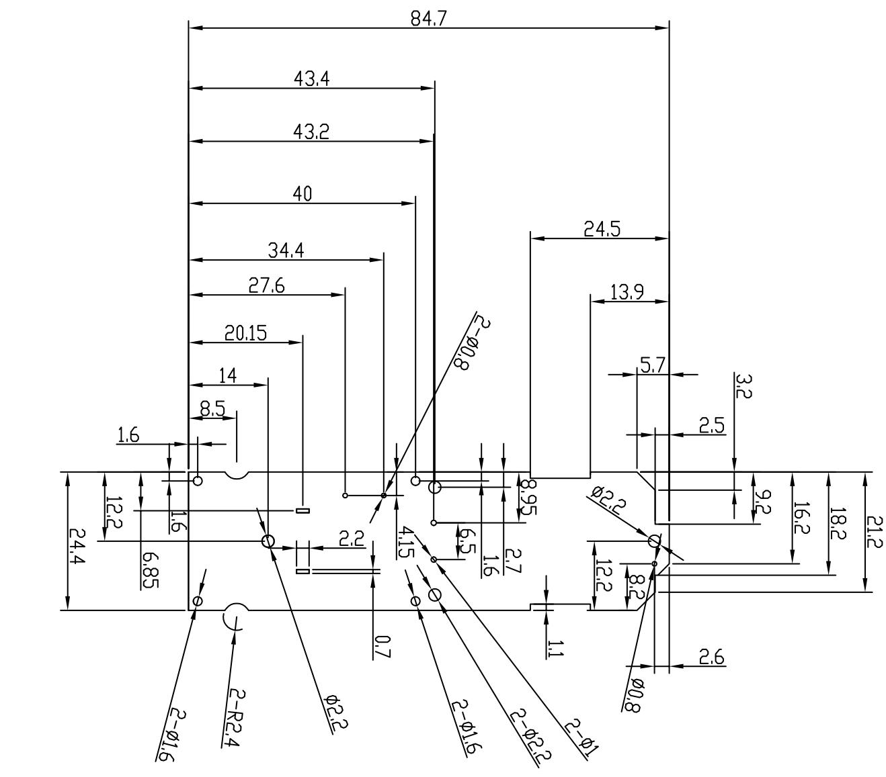

<table><tr><td>3</td><td></td><td>Signature</td><td>Date</td><td>Tolerance</td><td>Pro material</td><td>环氧树脂板</td><td>Model NO.</td><td>T-Z1</td></tr><tr><td>2</td><td></td><td>Design</td><td></td><td>.X</td><td></td><td>Surf dispose</td><td></td><td>Part name</td></tr><tr><td>1</td><td>初版制作</td><td></td><td></td><td>.XX</td><td></td><td>Scale</td><td>1:1</td><td>Drawing NO.</td></tr><tr><td>No.</td><td>更改时间</td><td>Approve</td><td></td><td></td><td>.X°</td><td></td><td>Units</td><td>mm</td></tr></table>

text_image

24.4
12.2
6.85
1.6
8.5
14
20.15
27.6
34.4
40
43.2
43.4
84.7
2-R2.4
2-Ø1.6
Ø2.2
Ø1.5
Ø9.5
2.7
1.6
2-Ø2.2
2-Ø0.8
11
12.2
8.2
3.2
9.2
5.7
13.9
24.5
2.5
2.6
18.2
21.2

产品符合ro TH.=1.0±0 术要求 2.0   
andon

<table><tr><td rowspan="2">LEVEL</td><td colspan="3">GENERAL TOLERANCE</td></tr><tr><td>A</td><td>B</td><td>C</td></tr><tr><td>DIM</td><td colspan="3"></td></tr><tr><td>&lt; 5</td><td>≠003</td><td>≠01</td><td>≠015</td></tr><tr><td>&gt; 5~50</td><td>≠005</td><td>≠01</td><td>≠02</td></tr><tr><td>&lt; 50~100</td><td>≠008</td><td>≠02</td><td>≠03</td></tr><tr><td>&gt;100</td><td>≠0.1%</td><td>≠0.2%</td><td>≠0.3%</td></tr><tr><td>ANSULFAR</td><td>≠0.10</td><td>≠0.5</td><td>≠0.5</td></tr><tr><td>SELECT LEVEL</td><td colspan="3"></td></tr></table>