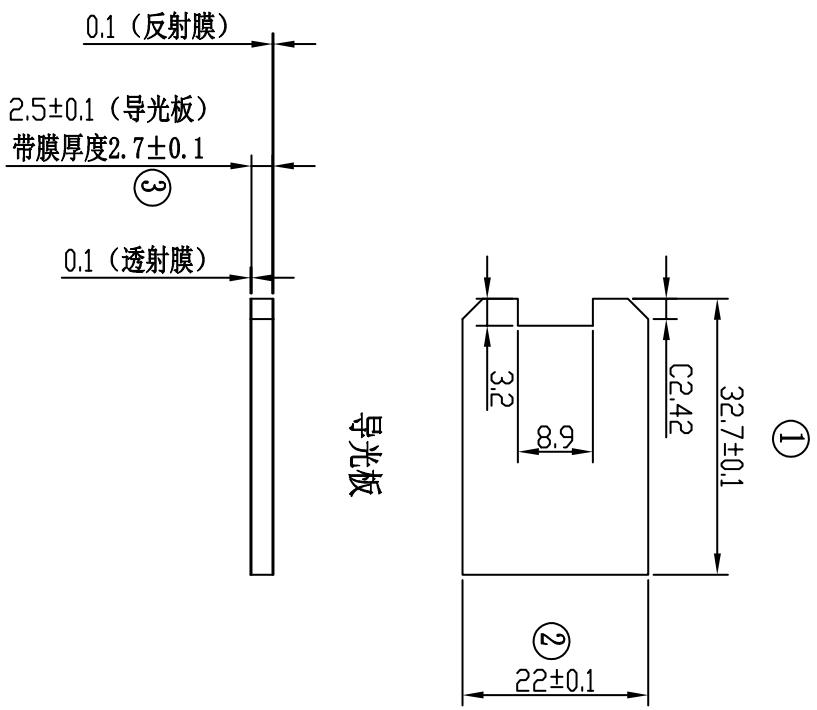
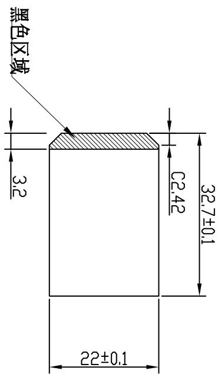
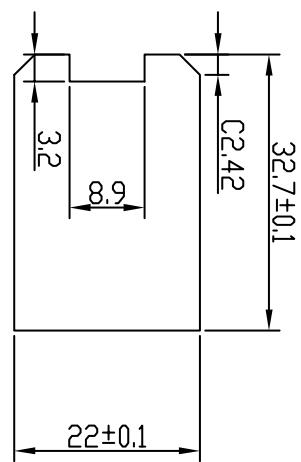

<table><tr><td>3</td><td></td><td>Signature</td><td>Date</td><td>Tolerance</td><td>Pro material</td><td>PMMA</td><td>Model NO.</td><td>T-Z1</td></tr><tr><td>2</td><td>Design</td><td></td><td></td><td>.X</td><td></td><td>Surf dispose</td><td></td><td>Part name</td></tr><tr><td>1</td><td>初版制作</td><td></td><td></td><td></td><td>.XX</td><td></td><td>Scale</td><td>1:1</td></tr><tr><td>No.</td><td>更改时间</td><td>Approve</td><td></td><td></td><td></td><td>.X°</td><td></td><td>Units</td></tr></table>

andon

术要求带编号为重要尺 需要IQC测产品符合rohs

透射膜   

text_image

黑色区域
3.2
22±0.1
32.7±0.1
C2.42

反射膜  

text_image

22±0.1
32.7±0.1
8.9
3.2
C2.42

<table><tr><td rowspan="2">LEVEL</td><td colspan="3">GENERAL TOLERANCE</td></tr><tr><td>A</td><td>B</td><td>C</td></tr><tr><td>DTM</td><td>A</td><td></td><td></td></tr><tr><td>&lt; 5</td><td>≠003</td><td>≠01</td><td>≠015</td></tr><tr><td>&gt; 5~50</td><td>≠005</td><td>≠01</td><td>≠02</td></tr><tr><td>&lt; 50~100</td><td>≠008</td><td>≠02</td><td>≠03</td></tr><tr><td>&gt;100</td><td>≠0%</td><td>≠02%</td><td>≠03%</td></tr><tr><td>ANGULFR</td><td>≠0.10</td><td>≠0.50</td><td>≠0.50</td></tr><tr><td>SELECT LEVEL</td><td></td><td></td><td></td></tr></table>