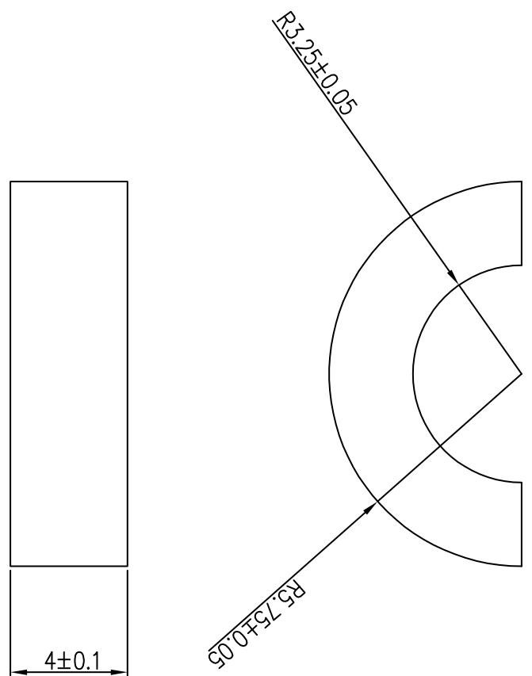

<table><tr><td>3</td><td></td><td>Signature</td><td>Date</td><td>Tolerance</td><td>Pro material</td><td>PMMA</td><td>Model NO.</td><td>T-Z1</td></tr><tr><td>2</td><td>Design</td><td></td><td></td><td>X</td><td></td><td>Surf dispose</td><td></td><td>Part name</td></tr><tr><td>1</td><td>初版制作</td><td></td><td></td><td>XX</td><td></td><td>Scale</td><td></td><td>Drawing NO.</td></tr><tr><td>No.</td><td>更改时间</td><td>Approve</td><td></td><td></td><td>X°</td><td></td><td>Units</td><td>mm</td></tr></table>

uōpūn

text_image

4±0.1
R515+0.05
R32540.05

4. 单面背散，背胶厚度0.05\~0.1mm，背胶牢固，
不可出现背胶分离的情况
5. 部氏硬度：50±5度
6. 出货排脱需要方便生产加工取放
7. 本件要求通过R0HS测试

1. 标注厚度不包含骨胶
2. 材质：聚氨酯

<table><tr><td rowspan="2">LEVEL</td><td colspan="3">GENERAL TOLERANCE</td></tr><tr><td>A</td><td>B</td><td>C</td></tr><tr><td>DTM</td><td>A</td><td></td><td></td></tr><tr><td>&lt; 5</td><td>≠003</td><td>≠01</td><td>≠015</td></tr><tr><td>&gt; 5~50</td><td>≠005</td><td>≠01</td><td>≠02</td></tr><tr><td>&lt; 50~100</td><td>≠008</td><td>≠02</td><td>≠03</td></tr><tr><td>&gt;100</td><td>≠0%</td><td>≠02%</td><td>≠03%</td></tr><tr><td>ANGULFR</td><td>≠0.10</td><td>≠0.50</td><td>≠0.50</td></tr><tr><td colspan="4">SLEELT LEVEL</td></tr></table>