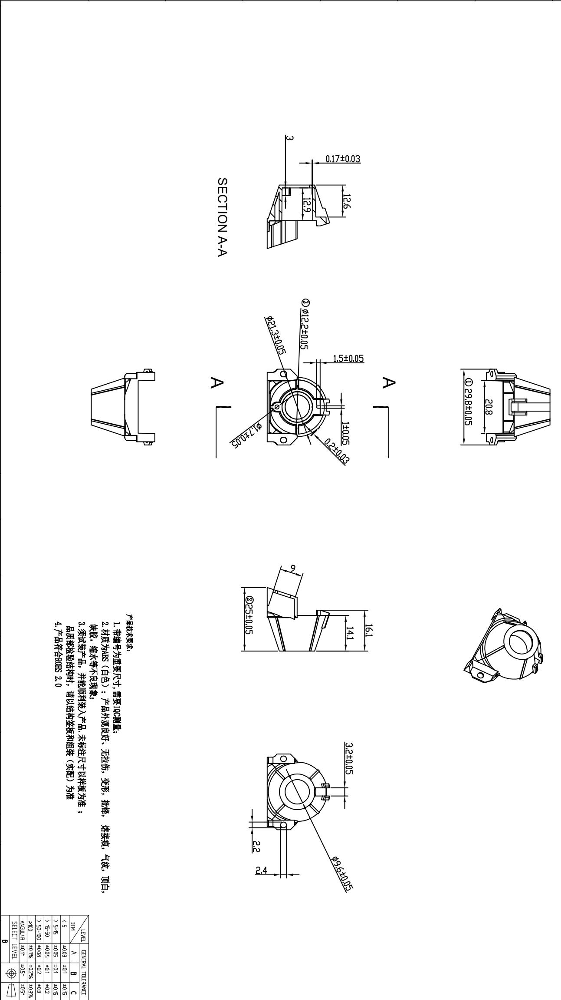

<table><tr><td>6</td><td></td><td>3</td><td></td><td></td><td>Signature</td><td>Date</td><td>Tolerance</td><td>Pro material</td><td>ABS</td><td>Model NO.</td><td>T-Z1</td></tr><tr><td>5</td><td></td><td>2</td><td></td><td></td><td>Design</td><td></td><td></td><td>X</td><td></td><td>Part name</td><td>支架</td></tr><tr><td>4</td><td></td><td>1</td><td></td><td>初版制作</td><td>2021.07.15</td><td>Checkkup</td><td></td><td>.XX</td><td></td><td>Scale</td><td>2:1 Drawing NO.</td></tr><tr><td>No.</td><td>更改记录</td><td>更改时间</td><td>No.</td><td>更改记录</td><td>更改时间</td><td>Approve</td><td></td><td></td><td>.X°</td><td></td><td>Unit/s</td></tr></table>

uopup

  
The Ground Truth image displays a single, solid horizontal line. According to Rule 2 (UNDERSCORE & LINE RULES), this is a stylistic or background line, not a placeholder underscore. Therefore, the OCR result must ignore it and output nothing or only meaningful text. The provided OCR content is "\_\_\_\_", which consists of four underscores. This is an incorrect interpretation of the line as a fill-in-the-blank placeholder, violating the rule that stylistic lines must be ignored. The OCR has hallucinated underscores where none should exist based on the GT's visual context. Hence, the OCR result is inconsistent with the Ground Truth.   
[Non-Text]   
[Non-Text]   
[Non-Text]   
[Non-Text]   
[Non-Text]   
[Non-Text]   
[Non-Text]   
[Non-Text]   
[Non-Text]   
[Non-Text]   
[Non-Text]   
[Non-Text]   
$\overline{\varepsilon}$   
—   
- 0.17±0.03   
—   
S
—
—  
3   
C. 2017   
6. 1910   
。  
N
II
III   
∀
≡
∈   
√-
F   
•   
[Non-Text]   
[Non-Text]   
[Non-Text]   
⑧   
$\overline{\phi}$   
$\overline{z} \phi$ $\overline{z} \tau$   
$\frac{3}{12}$   
$\frac{04}{60^{\circ}C}$   
50 s   
1.5±0.05   
=   
A
V
V
V
①   
15   
——
——
——
——
——
——
——
——
——   
——
——
——
——
——
——
——
——
——
——
——
——
——
——
——
——
——
——
——
——
——
——
——
——
——
——
——
——
——
——
——
——
——
——
——
——
——
——
——
——
——
——
——
——
——
——
——
——
——
——
——   
Z
—
A
—
—
—
05
—
H  
10   
- 500
- 1/25
- 50   
1.   
.   
[Non-Text]   
[Non-Text]   
[Non-Text]   
[Non-Text]   
[Non-Text]   
[Non-Text]   
[Non-Text]   
[Non-Text]   
[Non-Text]   
10   
$\overline{1}$   
L   
3   
，  
$\overline{F}$ S   
品把
1.；
2.；
3.；
4.；
5.；
6.   
求带有财务风险、税收、货币资产   
原号为，安装零部件
Ⅱ（）  
为水产品实验合和  
SHOU
(1)   
只自不良并能  
于，现能  
需要，额外满足   
装订   
(1) $\lambda_{0}$ (2) $\lambda_{1}$ (3)   
· 感知，观良  
：好未和  
3.5 标注组  
拉伸 封尺 要( )  
1.05   
，以有  
形板为  
，考为准  
此转  
“1   
1   
$\frac{1}{2}$   
，  
$= \sqrt{5\phi}$   
24 || 6   
项 $\sqrt{U^{2}}$   
，自  
[Non-Text]   
[Non-Text]   
S
V
<
<
<
<
>   
13
100
5\~5
5\~5
5
17
13   
B
T
1
B
0
0
0
0
0
0
0
0
0   
EVE
=0.1
=0.5
=0.0
=0.0
=0.0
=0.0
A
E   
NERP
= .%
= 8
= 5
= 5
= 8   
B
L TL   
1   
NCI C
0.5
0.75
0.15
0.2
0.3
0.39
0.5