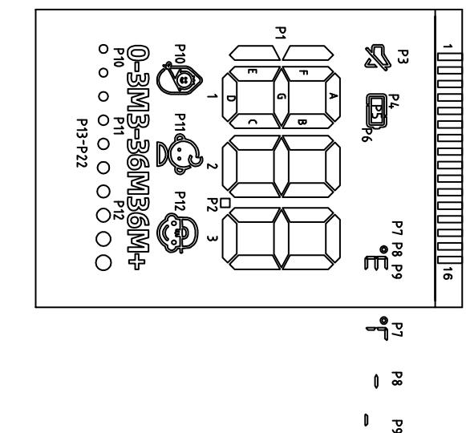
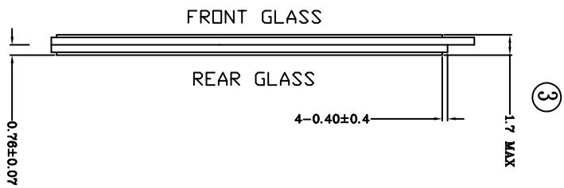
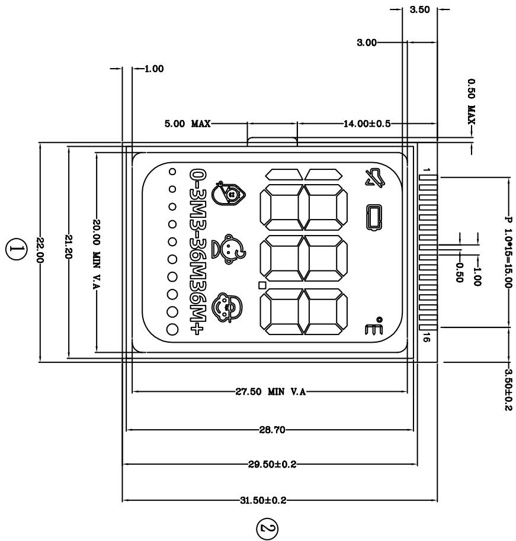

<table><tr><td>3</td><td></td><td>Signature</td><td>Date</td><td>Tolerance</td><td>Pro material</td><td>IT0</td><td>Model NO.</td><td>T-Z1</td></tr><tr><td>2</td><td></td><td>Design</td><td></td><td>.X</td><td></td><td>Surf dispose</td><td></td><td>Part name</td></tr><tr><td>1</td><td>初版制作</td><td>Checkup</td><td></td><td>.XX</td><td></td><td>Scale</td><td>2:1</td><td>Drawing NO.</td></tr><tr><td>No.</td><td>更改时间</td><td>Approve</td><td></td><td></td><td>.X°</td><td></td><td>Unit5</td><td>mm</td></tr></table>

产品符合rohs

术要求 ：

<table><tr><td>P1N</td><td>1</td><td>2</td><td>3</td><td>4</td><td>5</td><td>6</td><td>7</td><td>8</td><td>9</td><td>10</td><td>11</td><td>12</td><td>13</td><td>14</td><td>15</td><td>16</td></tr><tr><td></td><td></td><td></td><td></td><td>50</td><td>51</td><td>52</td><td>53</td><td>54</td><td>55</td><td>56</td><td>57</td><td>58</td><td>59</td><td>510</td><td>511</td><td></td></tr><tr><td>COM1</td><td></td><td>COM1</td><td></td><td>IF</td><td>1B</td><td>2F</td><td>2B</td><td>3F</td><td>3B</td><td>P5</td><td>P9</td><td>P13</td><td>P17</td><td>P21</td><td>-</td><td></td></tr><tr><td>COM2</td><td></td><td>COM2</td><td></td><td>1G</td><td>1G</td><td>2G</td><td>2C</td><td>3G</td><td>3C</td><td>P6</td><td>P10</td><td>P14</td><td>P18</td><td>P22</td><td>-</td><td></td></tr><tr><td>COM3</td><td>COM3</td><td></td><td></td><td>IE</td><td>1D</td><td>2E</td><td>2D</td><td>3E</td><td>3D</td><td>P7</td><td>P11</td><td>P15</td><td>P19</td><td>-</td><td>-</td><td></td></tr></table>

分段代码图  

text_image

0-3M3-36M6M+
p13-p22
p10 p11 p12
p10 p12 p13
p2 p2 3
1
2
3
4
5
6
7
8
9
10
11
12
13
14
15
16
17
18
19
20
21
22
23
24
25
26
27
28
29
30
31
32
33
34
35
36
37
38
39
40
41
42
43
44
45
46
47
48
49
50
51
52
53

text_image

0.76±0.07
REAR GLASS
+0.40±0.4
FRONT GLASS
1.7 MAX
③

text_image

22.00
21.20
20.00 MIN V.A
20.00 MIN V.A
31.50±0.2
28.50±0.2
28.70
27.50 MIN V.A
0-3M3-36M36M+
5.00 MAX
14.00±0.5
3.00
3.50
1
1.00
0.50 MAX
P 1.0*15=15.00
3.50±0.2

andon