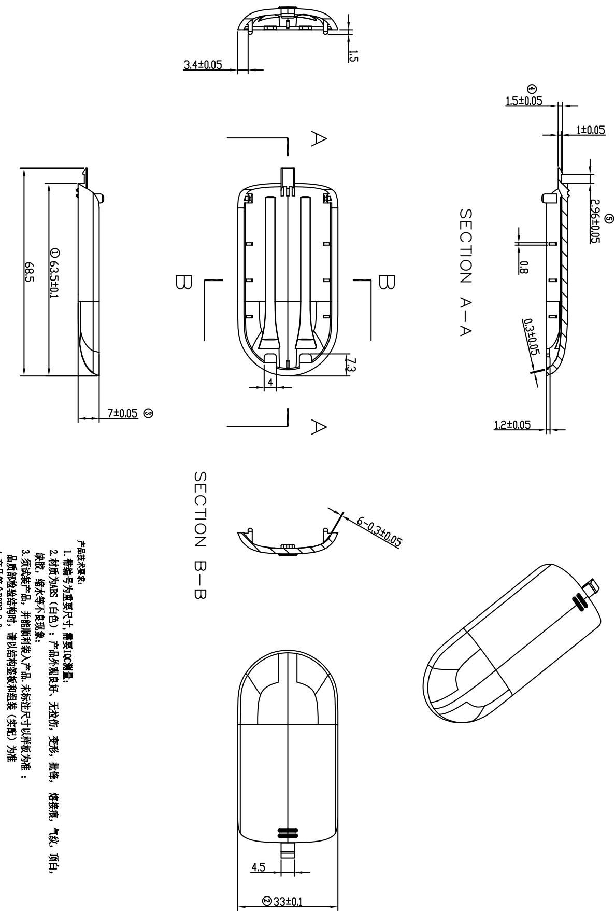

<table><tr><td>6</td><td></td><td>3</td><td></td><td>Signature</td><td>Date</td><td>Tolerance</td><td>Pro material</td><td>ABS</td><td>Model NO.</td><td>T-Z1</td></tr><tr><td>5</td><td></td><td>2</td><td></td><td>Design</td><td></td><td></td><td>X</td><td></td><td>Part name</td><td>电池盖</td></tr><tr><td>4</td><td></td><td>1</td><td>初版制作</td><td>2021.07.15</td><td>Checkup</td><td></td><td></td><td>.XX</td><td></td><td>Td Wringing NO.</td></tr><tr><td>No.</td><td>更改记录</td><td>更改时间</td><td>No.</td><td>更改记录</td><td>更改时间</td><td>Approve</td><td></td><td></td><td>.X°</td><td></td></tr></table>

uōpūn

4.产品符合ROHS 2.0
品质部检验结构时，请以结构垫板和组装（实配）为准

3. 须试装产品，并能顺利装入产品，未标注尺寸以样板为准；

2. 材质为ABS（白色）；产品外观良好、无拉伤、变形、批样、熔接痕、气软、顶白，钢板、缩水等不良现象。

1. 带编号为重要尺寸，需要10C测量；

产品技术要求：

<table><tr><td rowspan="2">LEVEL</td><td colspan="4">GENERAL PERFORMANCE</td></tr><tr><td>A</td><td>B</td><td>C</td><td></td></tr><tr><td>DTM</td><td>&gt;5-15</td><td>≤0.05</td><td>≤0.1</td><td>≤0.15</td></tr><tr><td>&gt;50</td><td>≤0.50</td><td>≤0.1</td><td>≤0.2</td><td>≤0.3</td></tr><tr><td>&gt;50~100</td><td>≤0.08</td><td>≤0.2</td><td>≤0.3</td><td></td></tr><tr><td>&gt;100</td><td>≤0.76</td><td>≤0.2%</td><td>≤0.3%</td><td></td></tr><tr><td>AGULAR</td><td>≤0.76</td><td>≤0.5</td><td>≤0.5</td><td>≤0.5</td></tr><tr><td colspan="5">SELECT LEVEL</td></tr></table>