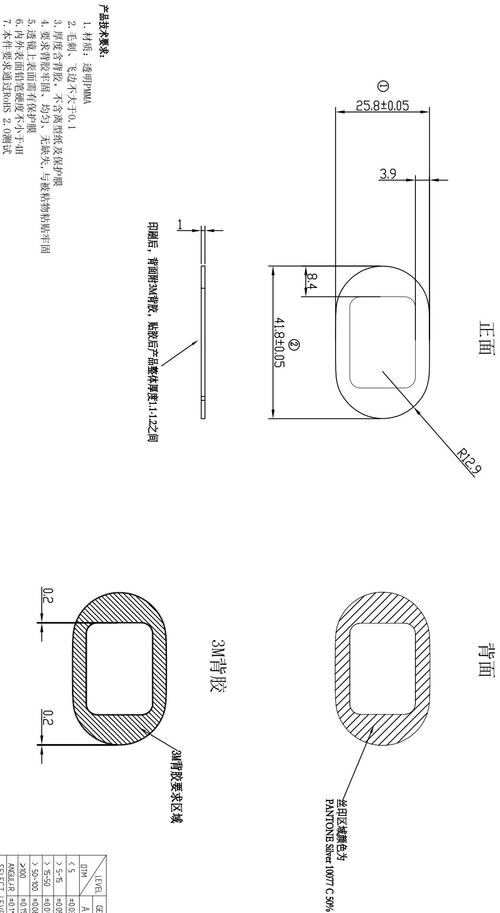

<table><tr><td>3</td><td></td><td>Signature</td><td>Date</td><td>Tolerance</td><td>Pro material</td><td>PMMA</td><td>Model NO.</td><td>T-Z1</td></tr><tr><td>2</td><td></td><td>Design</td><td></td><td>.X</td><td></td><td>Surf dispose</td><td></td><td>Part name</td></tr><tr><td>1</td><td></td><td>初版制作</td><td></td><td></td><td>.XX</td><td></td><td>Scale</td><td>1:1</td></tr><tr><td>No.</td><td>更改时间</td><td>Approve</td><td></td><td></td><td>.X°</td><td></td><td>Units</td><td>mm</td></tr></table>

  
andon

<table><tr><td rowspan="2">LEVEL</td><td colspan="3">GENERAL TOLERANCE</td></tr><tr><td>A</td><td>B</td><td>C</td></tr><tr><td>DIM</td><td>5</td><td>$ \pm0.03 $</td><td>$ \pm0.1 $</td></tr><tr><td>&lt; 5~5</td><td>$ \pm0.05 $</td><td>$ \pm0.1 $</td><td>$ \pm0.15 $</td></tr><tr><td>&gt; 15~50</td><td>$ \pm0.05 $</td><td>$ \pm0.1 $</td><td>$ \pm0.2 $</td></tr><tr><td>&lt; 50~100</td><td>$ \pm0.08 $</td><td>$ \pm0.2 $</td><td>$ \pm0.3 $</td></tr><tr><td>&gt;100</td><td>$ \pm0.1\% $</td><td>$ \pm0.2\% $</td><td>$ \pm0.3\% $</td></tr><tr><td>ANGUL4R</td><td>$ \pm0.1\circ $</td><td>$ \pm0.5\circ $</td><td>$ \pm0.5\circ $</td></tr><tr><td colspan="4">SELECTT LEVEL</td></tr></table>