<table><tr><td colspan="2">TEST REPORT NO.:ETX202303-07-078-01</td></tr><tr><td>Standard</td><td>IEC 60601-1-2:2014+A1:2020</td></tr><tr><td>ClientAddress</td><td>Andon Health Co., Ltd.No.3 JinPing Street, Ya An Road, nankai District, Tianjin, China</td></tr><tr><td>Trade Mark</td><td>N/A</td></tr><tr><td>Test Item</td><td>Infrared No-Touch Forehead Thermometer</td></tr><tr><td>Model/type reference</td><td>PT9L</td></tr><tr><td>Serial Number</td><td>KE04(LOT)</td></tr><tr><td>Test laboratoryAddress</td><td>Tianxu(Tianjin)Testing Technology Service Co.,LTD101, First floor, Building L,No.3 JinPing Street,Ya An Road, Nankai District, Tianjin,China</td></tr><tr><td>Testing period</td><td>2024.07.05-2024.07.29</td></tr><tr><td>Test Result</td><td>The test item passed the test specification(s).</td></tr><tr><td>Prepared byReviewed by</td><td>2024-08-15 Sun LiangDate Name2024-08-15 Zhang LeDate Name</td></tr><tr><td>Other aspects</td><td>N/A</td></tr><tr><td colspan="2">AbbreviationP(ass):passed F(ail):failedN/A: not applicable N/T: not tested</td></tr><tr><td colspan="2">NoteThis test report relates to the a. m. test sample. Without permission of the test center this test report is not permitted to be duplicated in extracts. This test report does not entitle to carry any safety mark on this or similar products.</td></tr></table>

1 Test Summary 

<table><tr><td colspan="4">Electromagnetic Interference(EMI)</td></tr><tr><td>Test</td><td>Requirement</td><td>Test Method</td><td>Result</td></tr><tr><td>Conducted Emission (150 kHz to 30 MHz)</td><td>IEC 60601-1-2:2014+A1:2020</td><td>CISPR11group 1, class B</td><td>N/A</td></tr><tr><td>Radiated Emission (30MHz to 1000MHz)</td><td>IEC 60601-1-2:2014+A1:2020</td><td>CISPR11 group 1, class B</td><td>PASS</td></tr><tr><td colspan="4">Electromagnetic Susceptibility(EMS)</td></tr><tr><td>Test</td><td>Requirement</td><td>Test Method</td><td>Result</td></tr><tr><td>Electrostatic Discharge (ESD)</td><td>IEC 60601-1-2:2014+A1:2020</td><td>IEC 61000-4-2</td><td>PASS</td></tr><tr><td>Radiated RF Electromagnetic Fields</td><td>IEC 60601-1-2:2014+A1:2020</td><td>IEC 61000-4-3</td><td>PASS</td></tr><tr><td>Proximity field from RF wireless communication equipment.</td><td>IEC 60601-1-2:2014+A1:2020</td><td>IEC 61000-4-3</td><td>PASS</td></tr><tr><td>Electrical Fast Transients and Bursts (EFT/B)</td><td>IEC 60601-1-2:2014+A1:2020</td><td>IEC 61000-4-4</td><td>N/A</td></tr><tr><td>Surges</td><td>IEC 60601-1-2:2014+A1:2020</td><td>IEC 61000-4-5</td><td>N/A</td></tr><tr><td>Conducted Disturbance, Induced by RF Fields (150 kHz to 80 MHz)</td><td>IEC 60601-1-2:2014+A1:2020</td><td>IEC 61000-4-6</td><td>N/A</td></tr><tr><td>Voltage Dips, Short Interruptions and Voltage Variations</td><td>IEC 60601-1-2:2014+A1:2020</td><td>IEC 61000-4-11</td><td>N/A</td></tr><tr><td>Power Frequency Magnetic Field</td><td>IEC 60601-1-2:2014+A1:2020</td><td>IEC 61000-4-8</td><td>Exemption, see annex</td></tr></table>

# 声明

致天旭（天津）检测技术服务有限公司：

我司生产的PT9L红外体温计（含主机、随机附件）符合IEC60601-1-2:2014/AMD1:2020中8.11a条款中的豁免条件，外壳内不包含磁敏感元器件及电路，故特此声明。

天津九安医

text_image

天津
九安医疗电子股份有限公司
医疗电子股份有限公司
2024年07月29日

# 2 General Product Information

# 2.1 General Description of E.U.T.

<table><tr><td>Product Name:</td><td>Infrared No-Touch Forehead Thermometer</td></tr><tr><td>Sample type:</td><td>Client providedRandom sampling</td></tr><tr><td>Model No.(EUT):</td><td>PT9L</td></tr><tr><td>Dimensions (W x H x D)</td><td>5.15 in x 1.37 in x 1.49 in</td></tr><tr><td>Applicant:</td><td>Andon Health Co., Ltd.</td></tr><tr><td>Address of Applicant:</td><td>No. 3 JinPing Street, YaAn Road, nankai District, Tianjin 300190, China</td></tr><tr><td>Manufacturer:</td><td>Andon Health Co., Ltd.</td></tr><tr><td>Address of Manufacturer:</td><td>No. 3 JinPing Street, YaAn Road, nankai District, Tianjin 300190, China</td></tr><tr><td>Rated Input:</td><td>DC 3V, 2*AAA battery</td></tr><tr><td>AC-DC adapter</td><td>N/A</td></tr><tr><td>Attachment</td><td>N/A</td></tr><tr><td>Software version</td><td>PT-HT2762-V00029-1.0.0</td></tr><tr><td>Firmware version</td><td>PT9L-HFMP01 V1.0</td></tr><tr><td>Intended healthcare environment</td><td>Professional healthcare facility environment and HOME HEALTHCARE ENVIRONMENT as described in IEC 60601-1-2 (ed.4.1)</td></tr></table>

# 2.2 Product Intended Use and intended environments

INTENDED USE:

This product is a high-tech infra-red (IR) thermometer designed to take human body temperature by measuring the energy of IR emitted from the forehead. The product will help you to assess you and your family members’ health conditions easily and quickly.

Intended environments:

Professional healthcare facility environment and HOME HEALTHCARE ENVIRONMENT as described in IEC 60601-1-2 (ed.4.1)

# 2.3 Submitted Documents

Circuit diagram, PCB layout, components list, user’s manual and label.

# 2.4 Deviation from Standards

None.

# 2.5 Abnormalities from Standard Conditions

None.

# 2.6 Modification/Retest record

None.

# 2.7 Countermeasures to achieve EMC Compliance

None.

# 3 Test Set-up and Operation Mode

# 3.1 E.U.T Mode

<table><tr><td>Mode item</td><td>Mode Name</td><td>Mode description</td></tr><tr><td>Mode 1</td><td>Battery power Standby mode</td><td>Install battery to the EUT and keep the EUT in standby state</td></tr><tr><td>Mode 2</td><td>Battery power Test mode</td><td>PT9L is powered by the internal battery. Hold down the power button to install the battery and set PT9L in UE1 mode. During the radiation disturbance test, PT9L detects the air and carries out continuous measurement. During the immunity test, the temperature sensor detection is point to the blackbody,and the blackbody is set to 37°C.The temperature is continuously measured and compared with the blackbody temperature. The measurement accuracy is ±0.2°C.</td></tr></table>

Emission: The equipment under test (EUT) was configured to measure its highest possible emission level. The test conditions were adapted accordingly in reference to the instructions for use.

Immunity: The equipment under test (EUT) was configured to have its highest possible susceptibility against the tested phenomena. The test conditions were adapted accordingly in reference to the instructions for use.

Refer to the related paragraph of this report for more information.

# 3.2 Description of Support Units and Auxiliary Equipment

<table><tr><td>Equipment</td><td>Manufacturer</td><td>Model NO.</td></tr><tr><td>BDB Series Precision Temperature Controllers &amp; Blackbody Radiation Source</td><td>Beijing Boda Changzheng Technology Development Co., LTD</td><td>BDB15</td></tr></table>

# 3.3 Test setup electrical and physical diagrams （Block diagram of the ME equipment and ME system and all peripherals and auxiliary equipment used）

Connection diagram   
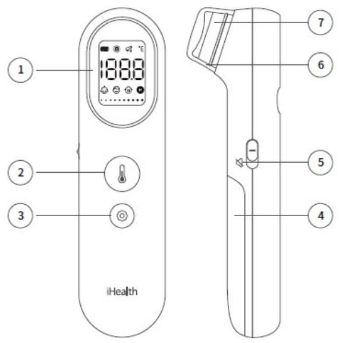

text_image

1
18.88
2
3
iHealth
7
6
5
4

① LCD display   
②Measurement button   
③ Settings button   
④Battery cover   
③Mute switch   
⑥Protective cap   
Probe

# 3.4 Measurement Uncertainty

According to CISPR 16-4-2. 

<table><tr><td>Test Item</td><td>Frequency Range</td><td>Measurement Uncertainty</td><td> $U_{cispr}$ </td></tr><tr><td>Conducted Emission at mains port using AMN</td><td>150kHz-30MHz</td><td>3.2dB</td><td>3.4dB</td></tr><tr><td>Radiated Emission</td><td>30MHz-1000MHz</td><td>3.9dB</td><td>6.3dB</td></tr><tr><td>Radiated Emission</td><td>1GHz-6GHz</td><td>5.1dB</td><td>5.2dB</td></tr><tr><td colspan="4">Remark:AMN – Artificial Mains Network</td></tr></table>

Note: The measurement uncertainty represents an expanded uncertainty expressed at approximately the 95% confidence level using a coverage factor of k=2.

# 4 Equipment List

Radiated Emission 

<table><tr><td>Item</td><td>Test Equipment</td><td>Manufacturer</td><td>Model No.</td><td>Serial No.</td><td>Cal. Date</td><td>Cal.Due date</td></tr><tr><td>1</td><td>Test receiver</td><td>Agilent</td><td>N9038A-508</td><td>MY54130074</td><td>2024-12-30</td><td>2025-12-29</td></tr><tr><td>2</td><td>310 Low Noise Amplifier</td><td>SONOMA</td><td>310N</td><td>344218</td><td>2024-01-08</td><td>2026-01-07</td></tr><tr><td>3</td><td>BiConiLog Antenna</td><td>ETS-Lindgren</td><td>3142E</td><td>166231</td><td>2024-05-11</td><td>2027-05-10</td></tr></table>

Electrostatic Discharge 

<table><tr><td>Item</td><td>Test Equipment</td><td>Manufacturer</td><td>Model No.</td><td>Serial No.</td><td>Cal. Date</td><td>Cal.Due date</td></tr><tr><td>1</td><td>ESD simulator</td><td>EMTEST</td><td>Dito</td><td>P1420134242</td><td>2024-04-28</td><td>2025-04-27</td></tr></table>

Radiated RF Electromagnetic Fields 

<table><tr><td>Item</td><td>Test Equipment</td><td>Manufacturer</td><td>Model No.</td><td>Serial No.</td><td>Cal. Date</td><td>Cal.Due date</td></tr><tr><td>1</td><td>Signal generator</td><td>Agilent</td><td>N5171B-506</td><td>MY53050921</td><td>2024-12-30</td><td>2025-12-29</td></tr><tr><td>2</td><td>RF power amplifier</td><td>Milmega</td><td>80RF1000-250</td><td>1066643</td><td>2024-01-08</td><td>2027-01-07</td></tr><tr><td>3</td><td>Directional coupler</td><td>Werlatone(HDC)</td><td>C5982-12</td><td>106464</td><td>NA</td><td>NA</td></tr><tr><td>4</td><td>RF power amplifier</td><td>Milmega</td><td>AS0827-55</td><td>1066644</td><td>2023-12-28</td><td>2026-12-27</td></tr><tr><td>5</td><td>Directional coupler</td><td>Werlatone(HDC)</td><td>C6148-12</td><td>106400</td><td>NA</td><td>NA</td></tr><tr><td>6</td><td>Power meter</td><td>Agilent</td><td>N1914A</td><td>MY54466075</td><td>2024-12-30</td><td>2025-12-29</td></tr><tr><td>7</td><td>Power sensor(2 set)</td><td>Agilent</td><td>E9304A</td><td>MY54370020/MY54370019</td><td>2024-12-30</td><td>2025-12-29</td></tr><tr><td>8</td><td>Isotropic field probe</td><td>ETS-Lindgren</td><td>HI6105-USB</td><td>168988</td><td>2024-05-24</td><td>2025-05-23</td></tr><tr><td>9</td><td>Log periodic antenna</td><td>Schwarzbeck</td><td>STLP9128D</td><td>9128D088</td><td>NA</td><td>NA</td></tr><tr><td>10</td><td>Log periodic antenna</td><td>Schwarzbeck</td><td>STLP9149</td><td>9149-465</td><td>NA</td><td>NA</td></tr><tr><td>11</td><td>RF power amplifier</td><td>BONN</td><td>BLMA 2060-100S</td><td>1610981</td><td>2023-01-14</td><td>2026-01-13</td></tr></table>

Environment 

<table><tr><td>Item</td><td>Test Equipment</td><td>Manufacturer</td><td>Model No.</td><td>Serial No.</td><td>Cal. Date</td><td>Cal.Due date</td></tr><tr><td>1</td><td>semi-anechoic chamber</td><td>TDK</td><td>SAC-3</td><td>N/A</td><td>2024-01-05</td><td>2029-01-04</td></tr></table>

# 5 Electromagnetic Interference Test Results

# 5.1 Conducted Emissions on Mains Terminals, 150 kHz to 30 MHz

Test Requirement: IEC 60601-1-2:2014+A1:2020

Test Method: N/A

Test Date: N/A

Temperature and Humidity: N/A

Power Supply: N/A

Frequency Range: N/A

Class / Severity: N/A

Detector: N/A

Limit: 

<table><tr><td rowspan="2">Frequency range(MHz)</td><td colspan="2">At mains Terminals (dB μV)</td></tr><tr><td>Quasi-peak</td><td>Average</td></tr><tr><td>0.15 to 0.50</td><td>66-56</td><td>56-46</td></tr><tr><td>0.50 to 5</td><td>56</td><td>46</td></tr><tr><td>5 to 30</td><td>60</td><td>50</td></tr><tr><td colspan="3">Note1: The lower limit is applicable at the transition frequency.</td></tr></table>

Note: The EUT is powered by batteries , and does not apply to this clause.

# 5.2 Radiated Emissions, 30MHz to 1GHz

Test Requirement: IEC 60601-1-2:2014+A1:2020

Test Method: CISPR11

Test Date: 2024-07-05

Temperature and Humidity: 28℃ 52%

Power Supply: DC 3V

Frequency Range: 30 MHz to 1 GHz

Test site: 3m Semi-anechoic chamber

Class: Group 1, Class B

Detector: Peak for pre-scan (120 kHz resolution bandwidth)

Limit: 

<table><tr><td>Frequency range(MHz)</td><td>Quasi-peak limits dB (μV/m)</td></tr><tr><td>30 to 230</td><td>40</td></tr><tr><td>230 to 1000</td><td>47</td></tr><tr><td colspan="2">At transitional frequencies the lower limit applies.</td></tr></table>

# 5.2.1 E.U.T. Operation

Test mode: Mode1,Mode2

Pre-scan was performed with peak detector on the EUT. Quasi-peak measurements were performed at the frequencies at which maximum peak emission level were detected. During the tests, the EUT were tested at different working modes to find the maxium emission results.

Please see the attached Quasi-peak test results.

For radiated emission: Level = Read Level + Antenna Factor + Cable Loss – Preamp Factor.

# 5.2.2 Test Setup and Procedure

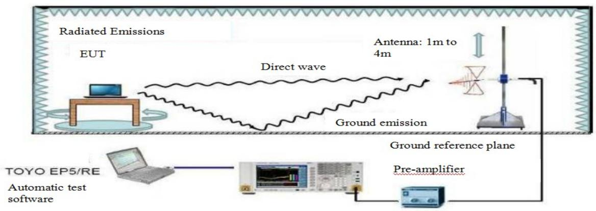

flowchart

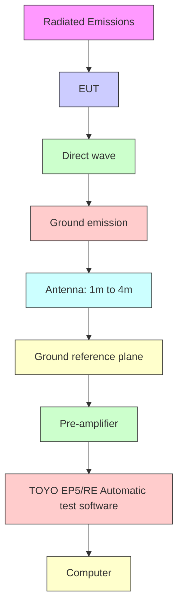

1. The radiated emission test was conducted in a semi-anechoic chamber.   
2. The tabletop EUT was placed upon a non-metallic table 0.8m above the ground reference plane. And for floor-standing arrangement, the EUT was placed on the horizontal ground reference plane, but separated from metallic contact with the ground reference plane by 0.1m of insulation.   
3. Before final measurements of radiated emissions, a pre-scan was performed in the spectrum mode with the peak detector to find out the maximum emission spectrum signature data plots of the EUT.   
4. The frequencies of maximum emission were determined in the final radiated emissions measurement, the physical arrangement of the test system and associated cabling was varied in order to determine the effect on the EUT's emissions in amplitude, direction and frequency. At each frequency, the EUT was rotated 360°, and the Antenna was raised and lowered from 1 to 4 meters in order to determine the maximum disturbance. Measurements were performed for both horizontal and vertical Antenna polarization.

# 5.2.3 Measurement Data

Figure 1: Measurement results of radiated emission, Mode 1   
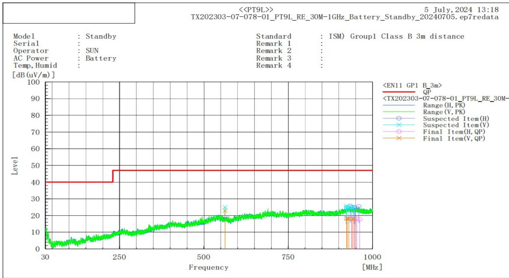

line

| Frequency [MHz] | Level (dB) |
| --------------- | ---------- |
| 30              | ~5         |
| 250             | ~10        |
| 500             | ~18        |
| 750             | ~22        |
| 1000            | ~23        |

Final Result 

<table><tr><td colspan="10">--- Horizontal Polarization (QP)---</td></tr><tr><td>No.</td><td>Frequency [MHz]</td><td>Reading [dB(uV)]</td><td>c.f [dB(1/m)]</td><td>Result [dB(uV/m)]</td><td>Limit [dB(uV/m)]</td><td>Margin [dB]</td><td>Height [cm]</td><td>Angle [deg]</td><td>Remark</td></tr><tr><td>1</td><td>923.291</td><td>21.90</td><td>-3.74</td><td>18.16</td><td>47.00</td><td>28.84</td><td>180.50</td><td>222.80</td><td></td></tr><tr><td>2</td><td>937.960</td><td>21.54</td><td>-3.37</td><td>18.17</td><td>47.00</td><td>28.83</td><td>308.20</td><td>84.60</td><td></td></tr><tr><td>3</td><td>937.601</td><td>21.44</td><td>-3.36</td><td>18.08</td><td>47.00</td><td>28.92</td><td>214.50</td><td>44.10</td><td></td></tr><tr><td>4</td><td>946.606</td><td>21.87</td><td>-3.60</td><td>18.27</td><td>47.00</td><td>28.73</td><td>387.50</td><td>359.30</td><td></td></tr><tr><td>5</td><td>952.726</td><td>21.82</td><td>-3.74</td><td>18.08</td><td>47.00</td><td>28.92</td><td>364.80</td><td>71.30</td><td></td></tr><tr><td>6</td><td>961.464</td><td>21.51</td><td>-3.87</td><td>17.64</td><td>47.00</td><td>29.36</td><td>399.60</td><td>86.30</td><td></td></tr><tr><td colspan="10">--- Vertical Polarization (QP)---</td></tr><tr><td>No.</td><td>Frequency [MHz]</td><td>Reading [dB(uV)]</td><td>c.f [dB(1/m)]</td><td>Result [dB(uV/m)]</td><td>Limit [dB(uV/m)]</td><td>Margin [dB]</td><td>Height [cm]</td><td>Angle [deg]</td><td>Remark</td></tr><tr><td>1</td><td>562.548</td><td>33.14</td><td>-10.29</td><td>22.85</td><td>47.00</td><td>24.15</td><td>180.80</td><td>222.60</td><td></td></tr><tr><td>2</td><td>923.755</td><td>21.99</td><td>-3.72</td><td>18.27</td><td>47.00</td><td>28.73</td><td>399.70</td><td>341.20</td><td></td></tr><tr><td>3</td><td>924.418</td><td>21.92</td><td>-3.69</td><td>18.23</td><td>47.00</td><td>28.77</td><td>396.40</td><td>330.80</td><td></td></tr><tr><td>4</td><td>929.585</td><td>21.64</td><td>-3.53</td><td>18.11</td><td>47.00</td><td>28.89</td><td>139.90</td><td>86.10</td><td></td></tr><tr><td>5</td><td>940.070</td><td>21.27</td><td>-3.41</td><td>17.86</td><td>47.00</td><td>29.14</td><td>392.10</td><td>80.30</td><td></td></tr><tr><td>6</td><td>945.031</td><td>21.50</td><td>-3.55</td><td>17.95</td><td>47.00</td><td>29.05</td><td>267.60</td><td>33.00</td><td></td></tr></table>

Figure 2: Measurement results of radiated emission, Mode 2   
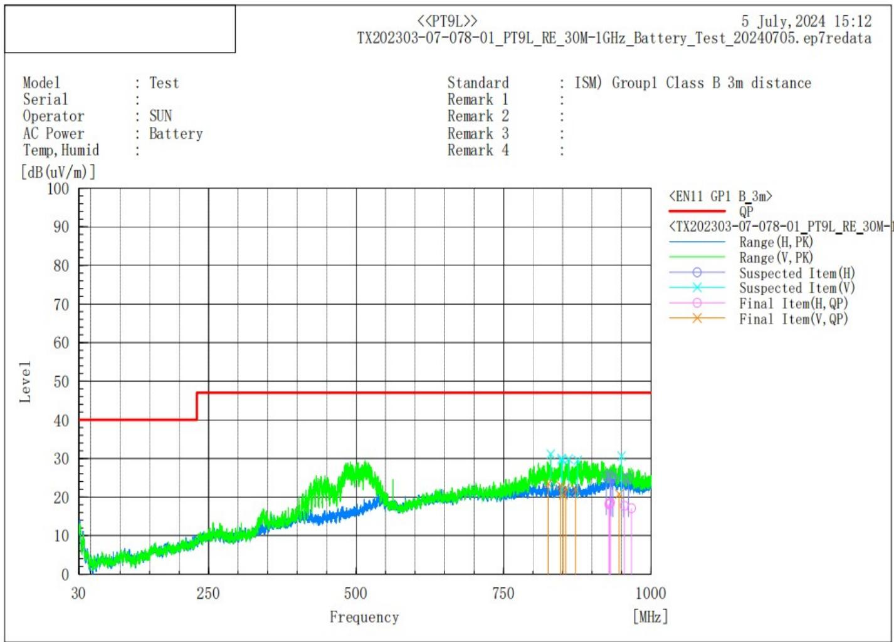

line

| Frequency [MHz] | QP Level | Range (H, PK) | Range (V, PK) | Suspected Item(H) | Suspected Item(V) | Final Item(H, QP) | Final Item(V, QP) |
| --------------- | -------- | ------------- | ------------- | ----------------- | ----------------- | ------------------ | ------------------ |
| 30              | 40       | ~5            | ~5            | -                 | -                 | -                  | -                  |
| 250             | 48       | ~10           | ~10           | -                 | -                 | -                  | -                  |
| 500             | 48       | ~15           | ~25           | -                 | -                 | -                  | -                  |
| 750             | 48       | ~20           | ~25           | -                 | -                 | -                  | -                  |
| 1000            | 48       | ~25           | ~25           | -                 | -                 | ~20                | ~20                |

Final Result

<table><tr><td colspan="10">--- Horizontal Polarization (QP)---</td></tr><tr><td>No.</td><td>Frequency [MHz]</td><td>Reading [dB(uV)]</td><td>c.f [dB(1/m)]</td><td>Result [dB(uV/m)]</td><td>Limit [dB(uV/m)]</td><td>Margin [dB]</td><td>Height [cm]</td><td>Angle [deg]</td><td>Remark</td></tr><tr><td>1</td><td>928.671</td><td>21.67</td><td>-3.56</td><td>18.11</td><td>47.00</td><td>28.89</td><td>212.80</td><td>0.90</td><td></td></tr><tr><td>2</td><td>929.430</td><td>21.82</td><td>-3.54</td><td>18.28</td><td>47.00</td><td>28.72</td><td>135.10</td><td>264.60</td><td></td></tr><tr><td>3</td><td>929.968</td><td>21.93</td><td>-3.52</td><td>18.41</td><td>47.00</td><td>28.59</td><td>238.00</td><td>310.50</td><td></td></tr><tr><td>4</td><td>931.203</td><td>22.00</td><td>-3.47</td><td>18.53</td><td>47.00</td><td>28.47</td><td>107.50</td><td>79.50</td><td></td></tr><tr><td>5</td><td>954.813</td><td>21.45</td><td>-3.75</td><td>17.70</td><td>47.00</td><td>29.30</td><td>396.70</td><td>58.60</td><td></td></tr><tr><td>6</td><td>966.678</td><td>21.22</td><td>-4.14</td><td>17.08</td><td>47.00</td><td>29.92</td><td>160.00</td><td>217.40</td><td></td></tr><tr><td colspan="10">--- Vertical Polarization (QP)---</td></tr><tr><td>No.</td><td>Frequency [MHz]</td><td>Reading [dB(uV)]</td><td>c.f [dB(1/m)]</td><td>Result [dB(uV/m)]</td><td>Limit [dB(uV/m)]</td><td>Margin [dB]</td><td>Height [cm]</td><td>Angle [deg]</td><td>Remark</td></tr><tr><td>1</td><td>825.502</td><td>29.77</td><td>-6.25</td><td>23.52</td><td>47.00</td><td>23.48</td><td>116.80</td><td>258.20</td><td></td></tr><tr><td>2</td><td>851.196</td><td>27.00</td><td>-6.39</td><td>20.61</td><td>47.00</td><td>26.39</td><td>116.50</td><td>33.90</td><td></td></tr><tr><td>3</td><td>846.354</td><td>29.27</td><td>-6.34</td><td>22.93</td><td>47.00</td><td>24.07</td><td>111.90</td><td>110.80</td><td></td></tr><tr><td>4</td><td>855.596</td><td>28.68</td><td>-6.36</td><td>22.32</td><td>47.00</td><td>24.68</td><td>112.90</td><td>116.10</td><td></td></tr><tr><td>5</td><td>872.003</td><td>28.21</td><td>-6.16</td><td>22.05</td><td>47.00</td><td>24.95</td><td>112.50</td><td>103.10</td><td></td></tr><tr><td>6</td><td>945.991</td><td>24.37</td><td>-3.58</td><td>20.79</td><td>47.00</td><td>26.21</td><td>107.70</td><td>184.70</td><td></td></tr></table>

# 6 Electromagnetic Susceptibility Test Results

# 6.1 Performance Criteria Description in IEC 60601-1-2

The following are examples that can be used to develop pass/fail criteria. For ME EQUIPMENT and ME SYSTEMS with multiple functions, the pass/fail criteria should be applied to each function, parameter and channel.

Examples of test failures:

– malfunction;   
– non-operation when operation is required;   
– unwanted operation when no operation is required;   
– deviation from normal operation that poses an unacceptable RISK to the PATIENT or OPERATOR;

– component failures;

– change in programmable parameters;

– reset to factory defaults (MANUFACTURER’s presets);

– change of operating mode;

– a FALSE POSITIVE ALARM CONDITION;

– a FALSE NEGATIVE ALARM CONDITION (failure to alarm);

– cessation or interruption of any intended operation, even if accompanied by an ALARM signal;

– initiation of any unintended operation, including unintended or uncontrolled motion, even if accompanied by an ALARM signal;

– error of a displayed numerical value sufficiently large to affect diagnosis or treatment;

– noise on a waveform in which the noise would interfere with diagnosis, treatment or monitoring;

– artefact or distortion in an image in which the artefact would interfere with diagnosis, treatment or monitoring;

– failure of automatic diagnosis or treatment ME EQUIPMENT or ME SYSTEM to diagnose or treat, even if accompanied by an ALARM signal.

Example of performance during and after the applied testing stimulus required to pass the test:

– for a mammography system, the compression full release and associated command remains fully operational;

– for ULTRASOUND DIAGNOSTIC EQUIPMENT, the probe heating, dissipative power and temperature shall remain within specifications;

– safety-related functions perform as intended;

– false operation of alarms, “fail safe” modes and similar functions do not occur.

NOTE This might require performing the test twice – once to ensure the functions occur as expected and again to ensure they do not occur falsely.

Examples of acceptable degradation:

# Report No.:ETX202303-07-078-01

– an imaging system displays an image that could be altered, but in a way that would not affect the diagnosis or treatment;   
– a heart rate monitor displays a heart rate that could be in error, but by an amount that is not clinically significant;   
– a PATIENT monitor exhibits a small amount of noise or a transient on a waveform and the noise or transient would not affect diagnosis, treatment or monitoring.

Examples of ME EQUIPMENT and ME SYSTEMS with multiple functions:

– multi-parameter monitors;   
– anaesthesia system with monitors;   
– ventilators with monitors;

– multiple instances of the same function (e.g. multiple invasive blood pressure sensors).

Failure of therapy equipment to terminate a treatment at the intended time can be considered cessation or interruption of an intended operation related to ESSENTIAL PERFORMANCE. If the effect of the test signal on an ME EQUIPMENT or ME SYSTEM is so brief as to be transparent to the PATIENT or OPERATOR and does not affect diagnosis, monitoring or treatment of the PATIENT, this can be considered not to be cessation or interruption of an intended operation. For example, if in response to the IMMUNITY TEST LEVEL a ventilator stops pumping for 50 ms and then resumes operation such that accuracy is within acceptable limits, this would not be considered cessation or interruption of an intended operation.

Note that it might be necessary to test the ME EQUIPMENT or ME SYSTEM multiple times, e.g. under one set of conditions to assure that it sounds an ALARM signal when it should, within the MANUFACTURER’s specifications for sensitivity and response time, and under another set of conditions to assure that it does not sound an ALARM signal when it should not.

# Description of the BASIC SAFETY and ESSENTIAL PERFORMANCE including a description how the BASIC SAFETY and ESSENTIAL PERFORMANCE will be monitored against the pass/fail criteria during each test

BASIC SAFETY and ESSENTIAL PERFORMANCE:

This product is a high-tech infra-red (IR) thermometer designed to take human body temperature by measuring the energy of IR emitted from the forehead. The product helps you to assess you and your family members’ forehead temperature easily and quickly.

# IMMUNITY pass/fail criteria

For each immunity test, the EUT should meet following criteria during and after the test.

<table><tr><td colspan="3">immunity Pass/Fail Criteria</td></tr><tr><td>Test Description</td><td>Pass/Fail Criteria description</td><td>Means of monitoring</td></tr><tr><td>Electrostatic Discharges</td><td rowspan="3">During the immunity tests, the EUT is tested in UE1 mode. The basic safety performance of the tested product: Measurement accuracy: ±0.2°C at ranges 35.0°C ~ 42.0°C, other ranges ±0.3°C. The working condition of the EUT is visually inspected by the engineer, which is set at 37°C. The temperature is continuously measured and compared with the blackbody temperature. The accuracy of the display temperature of the EUT does not exceed ±0.2°C.</td><td rowspan="3">Visual</td></tr><tr><td>Radiated RF EM Fields</td></tr><tr><td>Proximity fields from RF wireless communications</td></tr><tr><td colspan="3">Note 1: Specific, detailed immunity pass/fail criteria, shall be based on applicable part two standards or risk management, for immunity with regard to em disturbances. These pass/fail criteria shall be included in the risk management file</td></tr></table>

# 6.2 ESD

Test Requirement: IEC 60601-1-2:2014+A1:2020

Test Method: IEC 61000-4-2

Test Date: 2024-07-29

Temperature and Humidity: 28℃ 44% 101kPa

Power Supply: DC 3V

Discharge Voltage: Air Discharge: ±2, 4, 8,15kV

Contact Discharge: ±8 kV

VCP, HCP: ±8 kV

Polarity: Positive / Negative

Number of Discharge: Minimum 10 times at each test point

Discharge Mode: Single Discharge

Discharge Period: 1 second minimum

# 6.2.1 Test Setup and Procedure

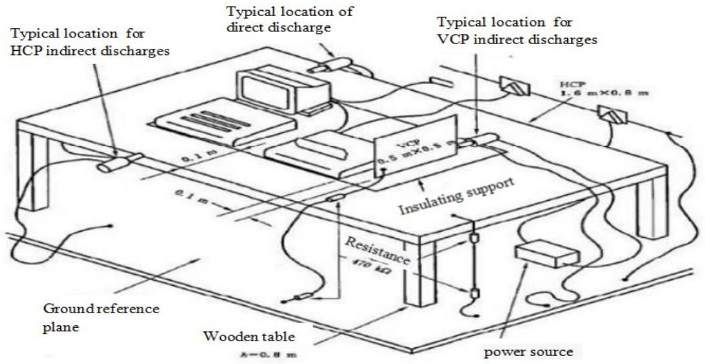

text_image

Typical location for
HCP indirect discharges
Typical location of
direct discharge
Typical location for
VCP indirect discharges
HVCP
0.5 m×0.5 m
Insulating support
Resistance
470 kΩ
Ground reference
plane
Wooden table
A=0.8 m
power source

1. Contact discharge was applied only to conductive surfaces of the EUT. Air discharge was applied only to non-conducted surfaces of the EUT. 2. The EUT was put on a 0.8m high wooden table for table-top equipment or 0.1m high for floor standing equipment standing on the ground reference plane (GRP).   
3. A horizontal coupling plane(HCP) 1.6m by 0.8m in size was placed on the table, and the EUT with its cables were isolated from the HCP by an insulating support thick than 0.5mm. The VCP 0.5m by 0.5m in size while HCP were constructed from the same material type and thickness as that of the GRP, and connected to the GRP via a 470kΩ resistor at each end. The distance between EUT and any of the other metallic surfaces except the GRP, HCP and VCP was greater than 1m.   
4. During the contact discharges, the tip of the discharge electrode touched the EUT before the discharge switch is operated. During the air discharges, the round discharge tip of the discharge electrode was approached as fast as possible to touch the EUT.   
5. After each discharge, the ESD generator was removed from the EUT, the generator is then retriggered for a new single discharge. For ungrounded product, a discharge cable with two resistances was used after each discharge to remove remnant electrostatic voltage. 10 times of each polarity single discharge were applied to HCP and VCP.

# 6.2.2 Test Results

Test Point:

1. All insulated enclosure / seams, e.g.: Key-press, nonmetallic enclosure of adaptor and main unit,LCD display, seams around enclosure and cables(Refer to the A started arrow in the test setup photo).   
2. All accessible metal parts of the enclosure, e.g.: metallic part of the cuff (Refer to the C started arrow in the test setup photo).

Test mode: Mode 1,Mode 2

<table><tr><td rowspan="2">Air Discharge</td><td colspan="9">Discharge Level (kV)</td><td rowspan="3">interval (s)</td><td rowspan="3">Test Results</td></tr><tr><td colspan="2">2</td><td colspan="2">4</td><td colspan="2">8</td><td colspan="3">15</td></tr><tr><td>Test Point</td><td>+</td><td>-</td><td>+</td><td>-</td><td>+</td><td>-</td><td>+</td><td>-</td><td></td></tr><tr><td>A1</td><td>ND</td><td>ND</td><td>ND</td><td>ND</td><td>ND</td><td>ND</td><td>ND</td><td>ND</td><td>ND</td><td>1</td><td>A</td></tr><tr><td>A2</td><td>ND</td><td>ND</td><td>ND</td><td>ND</td><td>ND</td><td>ND</td><td>ND</td><td>ND</td><td>ND</td><td>1</td><td>A</td></tr><tr><td>A3</td><td>ND</td><td>ND</td><td>ND</td><td>ND</td><td>ND</td><td>ND</td><td>ND</td><td>ND</td><td>ND</td><td>1</td><td>A</td></tr><tr><td>A4</td><td>ND</td><td>ND</td><td>ND</td><td>ND</td><td>ND</td><td>ND</td><td>ND</td><td>ND</td><td>ND</td><td>1</td><td>A</td></tr><tr><td>A5</td><td>ND</td><td>ND</td><td>ND</td><td>ND</td><td>ND</td><td>ND</td><td>ND</td><td>ND</td><td>ND</td><td>1</td><td>A</td></tr><tr><td>A6</td><td>-</td><td>-</td><td>-</td><td>-</td><td>-</td><td>-</td><td>-</td><td>-</td><td>-</td><td>-</td><td>-</td></tr><tr><td colspan="12">Remark: √: Pass; ×: Fail; ND: No Discharge; -: Non-test</td></tr></table>

<table><tr><td rowspan="2">Contact Discharge</td><td colspan="9">Discharge Level (kV)</td><td rowspan="3">interval (s)</td><td rowspan="3">Test Results</td></tr><tr><td colspan="2">2</td><td colspan="2">4</td><td colspan="2">6</td><td colspan="3">8</td></tr><tr><td>Test Point</td><td>+</td><td>-</td><td>+</td><td>-</td><td>+</td><td>-</td><td>+</td><td>-</td><td></td></tr><tr><td>C1</td><td>-</td><td>-</td><td>-</td><td>-</td><td>-</td><td>-</td><td>-</td><td>-</td><td>-</td><td>-</td><td>-</td></tr><tr><td>C2</td><td>-</td><td>-</td><td>-</td><td>-</td><td>-</td><td>-</td><td>-</td><td>-</td><td>-</td><td>-</td><td>-</td></tr><tr><td>C3</td><td>-</td><td>-</td><td>-</td><td>-</td><td>-</td><td>-</td><td>-</td><td>-</td><td>-</td><td>-</td><td>-</td></tr><tr><td colspan="12">Remark: √: Pass; ×: Fail; ND: No Discharge; -: Non-test</td></tr></table>

<table><tr><td rowspan="2">Indirect Application</td><td colspan="8">Discharge Level (kV)</td><td rowspan="3">interval (s)</td><td rowspan="3">Test Results</td></tr><tr><td colspan="2">2</td><td colspan="2">4</td><td colspan="2">6</td><td colspan="2">8</td></tr><tr><td>Coupling plate - sample direction</td><td>+</td><td>-</td><td>+</td><td>-</td><td>+</td><td>-</td><td>+</td><td>-</td></tr><tr><td>Horizontally coupled plate - Front</td><td>-</td><td>-</td><td>-</td><td>-</td><td>-</td><td>-</td><td>√</td><td>√</td><td>1</td><td>A</td></tr><tr><td>Horizontally coupled plate - Left</td><td>-</td><td>-</td><td>-</td><td>-</td><td>-</td><td>-</td><td>√</td><td>√</td><td>1</td><td>A</td></tr><tr><td>Horizontally coupled plate - Rear</td><td>-</td><td>-</td><td>-</td><td>-</td><td>-</td><td>-</td><td>√</td><td>√</td><td>1</td><td>A</td></tr><tr><td>Horizontally coupled plate - Right</td><td>-</td><td>-</td><td>-</td><td>-</td><td>-</td><td>-</td><td>√</td><td>√</td><td>1</td><td>A</td></tr><tr><td>Vertical coupling plate - Front</td><td>-</td><td>-</td><td>-</td><td>-</td><td>-</td><td>-</td><td>√</td><td>√</td><td>1</td><td>A</td></tr><tr><td>Vertical coupling plate - Left</td><td>-</td><td>-</td><td>-</td><td>-</td><td>-</td><td>-</td><td>√</td><td>√</td><td>1</td><td>A</td></tr><tr><td>Vertical coupling plate - Rear</td><td>-</td><td>-</td><td>-</td><td>-</td><td>-</td><td>-</td><td>√</td><td>√</td><td>1</td><td>A</td></tr><tr><td>Vertical coupling plate - Right</td><td>-</td><td>-</td><td>-</td><td>-</td><td>-</td><td>-</td><td>√</td><td>√</td><td>1</td><td>A</td></tr><tr><td colspan="11">Remark: √: Pass; ×: Fail; ND: No Discharge; −: Non-test</td></tr></table>

# Remarks:

A: During and after test, The EUT is tested in UE1 mode,the collection point of the temperature sensor is aligned with the blackbody, which is set at 37℃.The temperature is continuously measured and compared with the blackbody temperature. The accuracy of the display temperature of the EUT does not exceed ± 0.2℃.

During and after test, the EUT could operate as intended and no disturbance of function. The EUT could meet the requirements of clause 6.1.

N/A: Not applicable (floor mounted EUT or not requested by Standard).

# 6.3 Radiated Immunity

Test Requirement: IEC 60601-1-2:2014+A1:2020

Test Method: IEC 61000-4-3

Test Date: 2024-07-09/10/24-26

Temperature and Humidity: 25-31℃ 32%-50%

Power Supply: DC 3V

Frequency Range: 80 MHz to 2.7 GHz

Antenna Polarization: Horizontal / Vertical

Test level: 10 V/m

Modulation: 80%, 1KHz Amplitude Modulation

# 6.3.1 Test Setup and Procedure

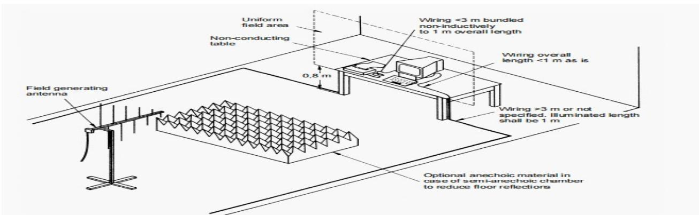

text_image

Uniform field area
Non-conducting table
0.8 m
Field generating antenna
Wiring <3 m bundled non-inductively to 1 m overall length
Wiring overall length <1 m as is
Wiring >3 m or not specified. Illuminated length shall be 1 m
Optional anechoic material in case of semi-anechoic chamber to reduce floor reflections

1. For table-top equipment, the EUT was placed in the chamber on a non-conductive table 0.8m high. For arrangement of floor-standing equipment, the EUT was mounted on a non-conductive support 0.1m above the supporting plane.

2. If possible, a minimum of 1 m of cable is exposed to the electromagnetic field. Excess length of cables interconnecting units of the EUT shall be bundled low-inductively in the approximate center of the cable to form a bundle 30 cm to 40 cm in length.   
3. The EUT was initially placed with one face coincident with the calibration plane. The EUT face being illuminated was contained within the UFA (Uniform Field Area).   
4. The frequency ranges to be considered were swept with the signal modulated and pausing to adjust the RF signal level or to switch oscillators and Antennas as necessary. Here the frequency range was swept incrementally, the step size was not exceed 1% of the preceding frequency value.   
5. The dwell time of the amplitude modulated carrier at each frequency was not be less than the time necessary for the EUT to be exercised and to respond, and was not less than 0.5 s.   
6. The test normally was performed with the generating Antenna facing each side of the EUT.   
7. The polarization of the field generated by each Antenna necessitates testing each selected side twice, once with the Antenna positioned vertically and again with the Antenna positioned horizontally.   
8. The EUT was performed in a configuration to actual installation conditions, a video camera and/or a audio monitor were used to monitor the performance of the EUT.

# 6.3.2 Test Results

<table><tr><td>Frequency</td><td>Level</td><td>Modulation</td><td>Test Mode</td><td>Antenna Polarization</td><td>EUT Face</td><td>Result / Observations</td></tr><tr><td rowspan="12">80 MHz to 2.7GHz</td><td rowspan="12">10 V/m</td><td rowspan="12">1KHz 80% Amp.Mod, 1% increment</td><td rowspan="12">Mode 1,2.</td><td>V</td><td rowspan="2">Front</td><td>A</td></tr><tr><td>H</td><td>A</td></tr><tr><td>V</td><td rowspan="2">Rear</td><td>A</td></tr><tr><td>H</td><td>A</td></tr><tr><td>V</td><td rowspan="2">Left</td><td>A</td></tr><tr><td>H</td><td>A</td></tr><tr><td>V</td><td rowspan="2">Right</td><td>A</td></tr><tr><td>H</td><td>A</td></tr><tr><td>N/A</td><td rowspan="2">Top*</td><td>N/A</td></tr><tr><td>N/A</td><td>N/A</td></tr><tr><td>N/A</td><td rowspan="2">Bottom*</td><td>N/A</td></tr><tr><td>N/A</td><td>N/A</td></tr></table>

# Remarks:

Front: the front of the EUT faces to transmitting Antenna (refer to Radiated Immunity test setup photo)

A: During and after test,The EUT is tested in UE1 mode,the collection point of the temperature sensor is aligned with the blackbody, which is set at 37℃.The temperature is continuously measured and compared with the blackbody temperature. The accuracy of the display temperature of the EUT does not exceed ± 0.2℃.

During and after test, the EUT could operate as intended and no disturbance of function. The EUT could meet the requirements of clause 6.1.

\*: Tests against top side and bottom side are only for adaptor.

The EUT does meet the Radiated Immunity requirements of the Standard.

# 6.4 Proximity Fields from RF Wireless Communications Equipment

Test Requirement: IEC 60601-1-2:2014+A1:2020

Test Method: IEC 61000-4-3

Test Date: 2024-07-09/10/24-26

Temperature and Humidity: 25-31℃ 32%-50%

Power Supply: DC 3V

Test Level: Table 9 of IEC 60601-1-2

Antenna Polarization: Horizontal / Vertical

Modulation: Pulse Modulation,18Hz or 217Hz

# 6.4.1 Test Setup and Procedure

1. For table-top equipment, the EUT was placed in the chamber on a non-conductive table 0.8m high. For arrangement of floor-standing equipment, the EUT was mounted on a non-conductive support 0.1m above the supporting plane.   
2. If possible, a minimum of 1 m of cable is exposed to the electromagnetic field. Excess length of cables interconnecting units of the EUT shall be bundled low-inductively in the approximate center of the cable to form a bundle 30 cm to 40 cm in length.   
3. The EUT was initially placed with one face coincident with the calibration plane. The EUT face being illuminated was contained within the UFA (Uniform Field Area).   
4. The test distances between Antenna and EUT are 3m for the frequencies between 1970MHz and 5785MHz and 2.5m for the frenquencies between 385MHz and 1970MHz .   
5. The dwell time of the amplitude modulated carrier at each frequency was not be less than the time necessary for the EUT to be exercised and to respond, and was not less than 1s.   
6. The test normally was performed with the generating Antenna facing each side of the EUT.   
7. The polarization of the field generated by each Antenna necessitates testing each selected side twice, once with the Antenna positioned vertically and again with the Antenna positioned horizontally.   
8. The EUT was performed in a configuration to actual installation conditions, a video camera and/or a audio monitor were used to monitor the performance of the EUT.

6.4.2 Test result 

<table><tr><td>Frequency (MHz)</td><td>Band (MHz)</td><td>Level</td><td>Modulation</td><td>Test mode</td><td>Antenna Polarization</td><td>EUT face</td><td>Result/ observations</td></tr><tr><td>385</td><td>380-390</td><td>27</td><td rowspan="2">Pulse modulation 18Hz</td><td rowspan="15">Mode 1,2.</td><td rowspan="15">Horizontal / Vertical</td><td rowspan="15">Front, Rear, Left, Right,</td><td rowspan="15">A</td></tr><tr><td>450</td><td>430-470</td><td>28</td></tr><tr><td>710</td><td rowspan="3">704-787</td><td rowspan="3">9</td><td rowspan="3">Pulse modulation 217Hz</td></tr><tr><td>745</td></tr><tr><td>780</td></tr><tr><td>810</td><td rowspan="3">800-960</td><td rowspan="3">28</td><td rowspan="3">Pulse modulation 18Hz</td></tr><tr><td>870</td></tr><tr><td>930</td></tr><tr><td>1720</td><td rowspan="3">1700-1990</td><td rowspan="3">28</td><td rowspan="7">Pulse modulation 217Hz</td></tr><tr><td>1845</td></tr><tr><td>1970</td></tr><tr><td>2450</td><td>2400-2570</td><td>28</td></tr><tr><td>5240</td><td rowspan="3">5100-5800</td><td rowspan="3">9</td></tr><tr><td>5500</td></tr><tr><td>5785</td></tr></table>

# Remarks:

A: During and after test, The EUT is tested in UE1 mode,the collection point of the temperature sensor is aligned with the blackbody, which is set at 37 ℃ .The temperature is continuously measured and compared with the blackbody temperature. The accuracy of the display temperature of the EUT does not exceed ±0.2℃.

During and after test, the EUT could operate as intended and no disturbance of function. The EUT could meet the requirements of clause 6.1.

\*: Tests against top side and bottom side are only for adaptor.

The EUT does meet the immunity requirements of Proximity Fields from RF Wireless Communications Equipment.

# 6.5 Electrical Fast Transients (EFT)

Test Requirement: IEC 60601-1-2:2014+A1:2020

Test Method: N/A

Test Date: N/A

Temperature and Humidity: N/A

Power Supply: N/A

Test Level: N/A

Polarity: N/A

Repetition Frequency: N/A

Burst Duration: N/A

Test Duration: N/A

# 6.5.1 Test Setup and Procedure

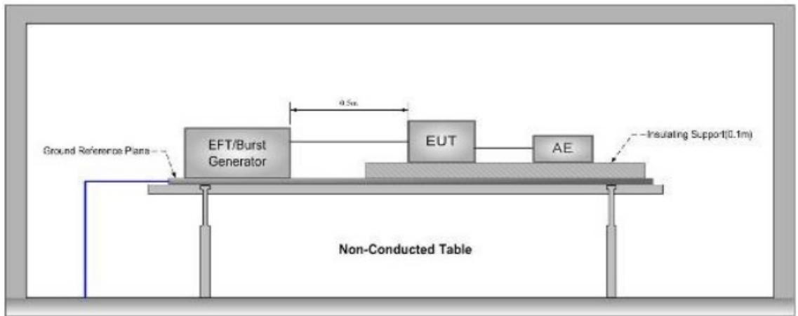

text_image

Ground Reference Plans
EFT/Burst
Generator
4.5m
EUT
AE
Insulating Support(0.1m)
Non-Conducted Table

Ground Reference Plane

1. The EUT was placed on a ground reference plane(GRP) insulated by an insulating support 0.1m thick and the GRP was placed on a 0.8m high wooden table for table-top equipment. For floor standing equipment, the EUT was placed on a 0.1m high wooden support above the GRP.   
2. The GRP shall project beyond the EUT and the clamp by at least 0.1m on all sides. The distance between the EUT and any other of the metallic surface except the GRP was greater than 0.5m. All cables to the EUT was placed on the insulation support 0.1m above GRP. Cables not subject to EFT was routed as far as possible from cable under test to minimize the coupling between the cables.   
3. The length of signal and power cable between the EUT and EFT generator was 0.5m. If the cable is a nondetachable supply cable more than 0.5m, the excess length of this cable shall be folded to avoid a flat coil and situated at a distance of 0.1m above the GRP.   
4. The EUT was conducted the below specified level voltage test for line to neutral or line to neutral to earth(for clamp coupling is for the signal line), 120 seconds duration. If the equipment contains identical ports, only one was tested; multiconductor cables, such as a 50-pair telecommunication cable, was tested as a single cable. Cables did not be split or divided into groups of conductors for this test; interface ports, which were intended by the manufacturer to be connected to data cables not longer than 3 m, did not be tested.   
5. During the test, the EUT was tested with the hand-held parts terminated with artificial hand.

# 6.5.2 Test Results

Note: The EUT is powered by batteries , and does not apply to this clause.

# 6.6 Surge

<table><tr><td>Test Requirement:</td><td>IEC 60601-1-2:2014+A1:2020</td></tr><tr><td>Test Method:</td><td>N/A</td></tr><tr><td>Test Date:</td><td>N/A</td></tr><tr><td>Temperature and Humidity:</td><td>N/A</td></tr><tr><td>Power Supply:</td><td>N/A</td></tr><tr><td>Test Level:</td><td>N/A</td></tr><tr><td>Polarity:</td><td>N/A</td></tr><tr><td>Generator source impedance:</td><td>N/A</td></tr><tr><td>Trigger Mode:</td><td>N/A</td></tr><tr><td>No. of surges:</td><td>N/A</td></tr></table>

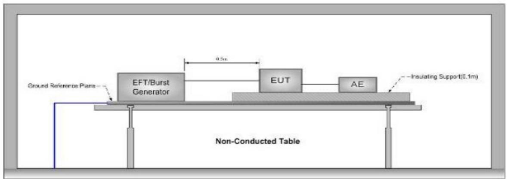

text_image

Ground Reference Plans
EFT/Burst
Generator
4.5m
EUT
AE
Insulating Support(0.1m)
Non-Conducted Table

Ground Reference Plane

1. The EUT was placed on a ground reference plane(GRP) insulated by an insulating support 0.1m thick and the GRP was placed on a 0.8m high wooden table for table-top equipment. For floor standing equipment, the EUT was placed on a 0.1m high wooden support above the GRP.   
2. The 1.2/50 µs surge was to be applied to the EUT power supply Terminals via the capacitive coupling network .Decoupling networks were required in order to avoid possible adverse effects on equipment not under test that may be powered by the same lines and to provide sufficient decoupling impedance to the surge wave so that the specified wave may be applied on the lines under test.   
3. The power cord between the EUT and the coupling/decoupling network do not exceed 2m in length. The interconnection line between the EUT and the coupling/ decoupling network shall not exceed 2m in length.   
4. The EUT was conducted 1kV Test voltage: for line to line and line to neutral and conducted 2kV Test voltage: for line to earth and neutral to earth, five positive pulses and five negative pulses each at 90° and 270° for AC power ports and five positive pulses and five negative surge pulses for DC power ports. The test levels were applied on the EUT with a 2Ω generator source impedance for power supply Terminals and 40Ω output impedance for interconnection lines. The tests were done at repetition rate 1 per minute.

# 6.6.2 Test Results

Note: The EUT is powered by batteries , and does not apply to this clause.

# 6.7 Conducted Immunity 0.15 MHz to 80 MHz

<table><tr><td>Test Requirement:</td><td>IEC 60601-1-2:2014+A1:2020</td></tr><tr><td>Test Method:</td><td>N/A</td></tr><tr><td>Test Date:</td><td>N/A</td></tr><tr><td>Temperature and Humidity:</td><td>N/A</td></tr><tr><td>Power Supply:</td><td>N/A</td></tr><tr><td>Frequency Range:</td><td>N/A</td></tr><tr><td>Test level:</td><td>N/A</td></tr><tr><td>Modulation:</td><td>N/A</td></tr><tr><td>Dwell Time:</td><td>N/A</td></tr></table>

# 6.7.1 Test Setup and Procedure

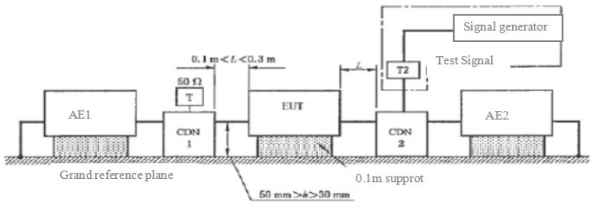

flowchart

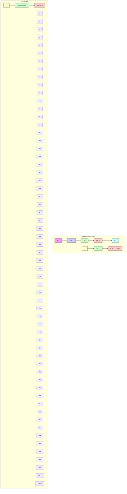

1. The EUT was placed on an insulating support of 0.1m height above a ground reference Plane,arranged and connected to satisfy its functional requirement. All cables exiting the EUT was supported at a height of at least 30 mm above the ground reference plane.   
2. The coupling and decoupling devices were required, they were located between 0.1m and 0.3m from the EUT. This distance was to be measured horizontally from the projection of the EUT on to the ground reference plane to the coupling and decoupling device.   
3. Each AE, used with clamp injection, shall be placed on an insulating support 0.1m above the ground reference plane. A decoupling network shall be installed on each cable between the EUT and AE except the cable under test. All cables connected to each AE, other than those being connected to the EUT, shall be provided with decoupling networks. The decoupling networks connected to each AE (except those on cables between the EUT and AE) shall be applied no further than 0.3m from the AE. The cable(s) between the AE and the decoupling network (s) or in between the AE and the injection clamp shall not be bundled nor wrapped and shall be kept between 30 mm and 50 mm above the ground reference plane.   
4. The frequency range was swept from 150 kHz to 80 MHz, using the signal levels established during the setting process, and with the disturbance signal 80% amplitude modulated with a 1kHz sine wave, pausing to adjust the RF signal level or to change coupling devices as necessary. Where the frequency was swept incrementally, the step size do not exceed 1% of the preceding frequency value. The dwell time of the amplitude modulated carrier at each frequency was not less than the time necessary for the EUT to be exercised and to respond, and was not less than 0.5 s.   
5. During the test, the EUT was tested with the hand-held parts terminated with artificial hand.

# 6.7.2 Test Results

Note: The EUT is powered by batteries , and does not apply to this clause.

# 6.8 Voltage Dips and Interruptions

<table><tr><td>Test Requirement:</td><td>IEC 60601-1-2:2014+A1:2020</td></tr><tr><td>Test Method:</td><td>N/A</td></tr><tr><td>Test Date:</td><td>N/A</td></tr><tr><td>Temperature and Humidity:</td><td>N/A</td></tr><tr><td>Power Supply:</td><td>N/A</td></tr><tr><td>Test Level:</td><td>N/A</td></tr><tr><td>No. of Dips / Interruptions:</td><td>N/A</td></tr></table>

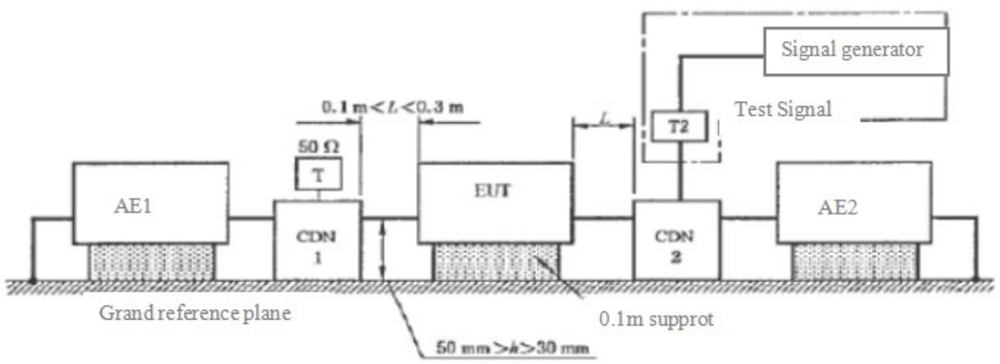

flowchart

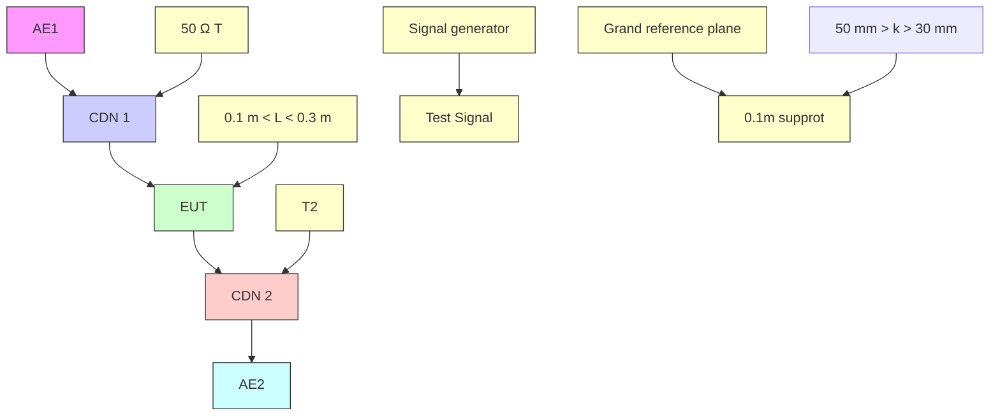

1. The EUT was placed on a ground reference plane(GRP) insulated by an insulating support 0.1m thick and the GRP was placed on a 0.8m high wooden table for table-top equipment. For floor standing equipment, the EUT was placed on a 0.1m high wooden support above the GRP.   
2. The test was performed with the EUT connected to the test generator with the shortest power supply cable as specified by the EUT manufacturer.   
3. The EUT was tested for each selected combination of test level and duration with a sequence of three dips/interruptions with intervals of 10 s minimum. Each representative mode of operation was tested.   
4. For EUT with more than one power cord, each power cord was tested individually.

# 6.8.2 Test Results

Note: The EUT is powered by batteries , and does not apply to this clause.

# 6.9 Power Frequency Magnetic Field Immunity

Test Requirement: IEC 60601-1-2:2014+A1:2020

Test Method: N/A

Test Date: N/A

Temperature and Humidity: N/A

Power Supply: N/A

Field frequency: N/A

Face under Test: N/A

Test level: N/A

# 6.9.1 Test Setup and Procedure

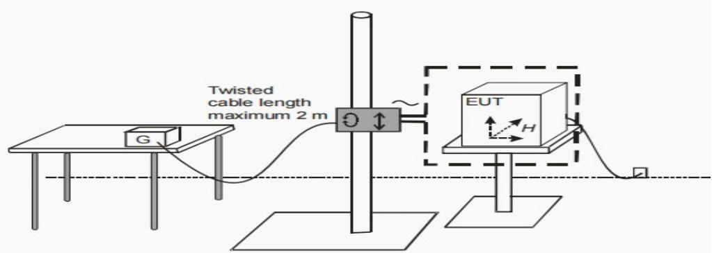

text_image

Twisted
cable length
maximum 2 m
G
EUT
H

# Report No.:ETX202303-07-078-01

1. The EUT was placed on a ground reference plane(GRP) insulated by an insulating support 0.1m thick and the GRP was placed on a 0.8m high wooden table for table-top equipment. For floor standing equipment, the EUT was placed on a 0.1m high wooden support above the GRP.   
2. The EUT was configured and connected to satisfy its functional requirements. The power supply, input and output circuits was connected to the sources of power supply, control and signal. The cables supplied or recommended by the equipment manufacturer were used. In absence of any recommendation, unshielded cables were adopted, of a type appropriate for the signals involved. All cables were exposed to the magnetic field for 1m of their length.   
3. The EUT was subjected to the test magnetic field by using the induction coil of standard dimensions (1m×1m) by the immersion method.   
4. The induction coil was then be rotated by $9 0 ^ { 0 }$ in order to expose the EUT to the test field with different orientations. For floor-standing equipment the test was repeated by moving and shifting the induction coils, in order to test the whole volume of the EUT for each orthogonal direction.

# 6.9.2 Test Results

IEC 60601-1-2:2014+A1:2020/EN 60601-1-2:2015+A1:2021 Table 4 Remark d Applies only to ME EQUIPMENT and ME SYSTEMS with magnetically sensitive components or circuitry.

The EUT does not contain magnetic sensing components or circuits (see Annex statement) and exempt from this test

# 7 Identifiers, tags, and files

<table><tr><td colspan="4">IEC 60601-1-2:2014+A1:2020</td></tr><tr><td>Clause</td><td>Requirement + Test</td><td>Result - Remark</td><td>Verdict</td></tr></table>

<table><tr><td>4</td><td colspan="3">GENERAL REQUIREMENTS</td></tr><tr><td>4.1</td><td>risks resulting from reasonably foreseeable electromagnetic disturbances taken into account in the risk management process.</td><td>RMF Reference Document: PT9L-FXPJ01 V1.0</td><td>P</td></tr><tr><td>4.2</td><td>Non-me equipment used in an me system</td><td></td><td>N/A</td></tr><tr><td></td><td>Check 16.1 of general standard, checked by inspection of therisk management file and objective evidence of compliance with the respective emc standards, or by the tests of this collateral standard</td><td>EUT does not contain non-ME equipment.</td><td>N/A</td></tr><tr><td></td><td>non-me equipment used in an me system complies with iec andiso emc standards applicable to that equipment, checked by inspection of the risk management file and objective evidenceof compliance with the respective emc standards, or by the tests of this collateral standard</td><td>EUT does not contain non-ME equipment.</td><td>N/A</td></tr><tr><td colspan="4">IEC 60601-1-2:2014+A1:2020</td></tr><tr><td>Clause</td><td>Requirement + Test</td><td>Result - Remark</td><td>Verdict</td></tr></table>

<table><tr><td></td><td>non- me equipment used in an me system for which the intendedem environment could result in the loss of basic safety oressential performance of the me system due to the non-me equipment tested according to the requirements of this collateral standard, checked by inspection of the RISKmanagement file and objective evidence of compliance with the respective EMC standards, or by the tests of this collateral standard</td><td>EUT does not contain non-ME equipment.</td><td>N/A</td></tr><tr><td>4.3.1</td><td>Configurations</td><td></td><td>P</td></tr><tr><td></td><td>me equipment and me systems tested in representative configurations, consistent with intended use, that are most likely to result in unacceptable risk as determined by themanufacturer (This was determined using risk analysis, experience, engineering analysis, or pretesting). Compliance checked by inspection of the test report and the risk management file.</td><td>See Chapter 5.3 and RMF Reference Document: PT9L-FXPJ01 V1.0</td><td>P</td></tr><tr><td>4.3.3</td><td>Power input and frequencies</td><td>See Chapter 5.2 for reference</td><td>P</td></tr><tr><td>5</td><td colspan="3">IDENTIFICATION, MARKING AND DOCUMENTS</td></tr><tr><td>5.1</td><td colspan="2">Additional requirements for marking on the outside of me equipment and me systemsspecified for use only in a shielded location special environment</td><td>N/A</td></tr><tr><td></td><td>me equipment and me systems specified for use only in a shielded location special environment labelled with a clearly legible warning that they should be used only in the specified type of shielded location</td><td>The EUT does not specified for use only in a shielded location special environment</td><td>N/A</td></tr><tr><td>5.2</td><td colspan="3">ACCOMPANYING DOCUMENTS</td></tr><tr><td>5.2.1</td><td colspan="3">Instructions for use</td></tr><tr><td>5.2.1.1</td><td colspan="3">General</td></tr><tr><td>a)</td><td>A statement of the environments for which the me equipment orme system is suitable. Relevant exclusions determined byrisk analysis, are listed.</td><td>Reference Document: PT9L-SMSY01 V1.0</td><td>P</td></tr><tr><td>b)</td><td>The essential performance of me equipment and a description of what the operator can expect if the essential performanceis lost or degraded due to EM disturbances.</td><td>Reference Document: PT9L-SMSY01 V1.0</td><td>P</td></tr><tr><td>c)</td><td>A warning regarding stacking and location close to otherequipment</td><td>Reference Document: PT9L-SMSY01 V1.0</td><td>P</td></tr><tr><td colspan="4">IEC 60601-1-2:2014+A1:2020</td></tr><tr><td>Clause</td><td>Requirement + Test</td><td>Result - Remark</td><td>Verdict</td></tr></table>

<table><tr><td>d)</td><td>List of cables, transducers and accessories</td><td>Reference Document: PT9L-SMSY01 V1.0</td><td>P</td></tr><tr><td>e)</td><td>A warning that other cables and accessories may negatively affect EMC performance</td><td>Reference Document: PT9L-SMSY01 V1.0</td><td>P</td></tr><tr><td>f)</td><td>A statement that portable RF communications equipment including Antennas, can effect medical electrical equipment. The warning includes a use distance such as “...be used no closer than 30 cm (12 inches) to any part of the [me equipment or me system], including cables specified by manufacturer”</td><td>Reference Document: PT9L-SMSY01 V1.0</td><td>P</td></tr><tr><td>5.2.1.2</td><td colspan="2">Requirements applicable to me equipment and me systems classified class A according to CISPR 11</td><td>N/A</td></tr><tr><td></td><td>For me equipment and me systems that are classified as class A according to CISPR 11, the instructions for use include the following note:note: “The emissions characteristics of this equipment make it suitable for use in industrial areas and hospitals (CISPR 11 class A). If it is used in a residential environment (for which CISPR 11 class B is normally required) this equipment might not offer adequate protection to radio-frequency communication services. The user might need to take mitigation measures, such as relocating or re-orienting the equipment.”</td><td>The EUT complaints class B limit</td><td>N/A</td></tr><tr><td>5.2.2</td><td colspan="3">Technical description</td></tr><tr><td>5.2.2.1</td><td colspan="3">Requirements applicable to all me equipment and me systems</td></tr><tr><td></td><td>The technical description describes precautions to be taken to prevent adverse events to the patient and Operator due to electromagnetic disturbances</td><td>Reference Document: Instructions for Use PT9L-SMSY01 V1.0</td><td>P</td></tr><tr><td>a)</td><td>Compliance for each emissions and immunity standard or test specified by this collateral standard, e.g. emissions class and group and immunity test level</td><td>Reference Document: Instructions for Use PT9L-SMSY01 V1.0</td><td>P</td></tr><tr><td colspan="4">IEC 60601-1-2:2014+A1:2020</td></tr><tr><td>Clause</td><td>Requirement + Test</td><td>Result - Remark</td><td>Verdict</td></tr></table>

<table><tr><td>b)</td><td>Any deviations from this collateral standard and allowances used</td><td>Reference Document: N/A.Full tests were performed on the EUT.No deviation from this collateral standard and allowances used.</td><td>N/A</td></tr><tr><td>c)</td><td>All necessary instructions for maintaining basic safety andessential performance with regard to electromagnetic disturbances for the expected service life</td><td>Reference Document: Instructions for Use PT9L-SMSY01 V1.0</td><td>P</td></tr><tr><td>5.2.2.2</td><td colspan="3">Requirements applicable to me equipment specified for use only in shielded location Special Environment</td></tr><tr><td></td><td colspan="3">The technical description includes the following information:</td></tr><tr><td>a)</td><td>A warning to the effect that:WARNING: Failure to use this equipment in the specified type of shielded location could result in degradation of performance, interference with other equipment or interference with radio services</td><td>The EUT does not intend to use only in shielded location Special Environment.</td><td>N/A</td></tr><tr><td>b)</td><td>Specifications for shielded location including:- minimum RF shielding effectiveness;- for each cable that enters or exits the shielded location, the minimum RF filter attenuation; and- the frequency range(s) over which the specifications apply</td><td>Reference Document: N/A.The EUT does not intend to use only in shielded location Special Environment.</td><td>N/A</td></tr><tr><td>c)</td><td>Test methods for measurement of RF shielding effectiveness and RF filter attenuation</td><td>The EUT does not intend to use only in shielded location Special Environment.</td><td>N/A</td></tr><tr><td>d)</td><td>One or more of the following and a recommendation that a notice containing this information be posted at the entrance(s) to the shielded location:- a specification of the emissions characteristics of otherequipment allowed inside the shielded location with the me equipment or me system;- a list of specific equipment allowed;- a list of types of equipment prohibited.</td><td>Reference Document: N/A.The EUT does not intend to use only in shielded location Special Environment.</td><td>N/A</td></tr><tr><td colspan="4">IEC 60601-1-2:2014+A1:2020</td></tr><tr><td>Clause</td><td>Requirement + Test</td><td>Result - Remark</td><td>Verdict</td></tr></table>

<table><tr><td>5.2.2.3</td><td>Requirements applicable to me equipment that intentionally receive RF electromagnetic energy include the following information......:- each frequency or frequency of reception,- the preferred frequency or frequency band, if applicable, and- the bandwidth of the receiving section of the ME Equipment in those bands</td><td>Reference Document: N/A Equipment does not intentionally receive RF electromagnetic energy</td><td>N/A</td></tr><tr><td>5.2.2.4</td><td>Requirements applicable to the me equipment that include RF transmitters the technical description includes the frequency or frequency band of transmission, the type and frequency characteristics of the modulation and the effective radiated power(ERP)......:</td><td>EUT does not include RF emission</td><td>N/A</td></tr><tr><td>5.2.2.5</td><td colspan="3">Requirements applicable to Permanently Installed Large me equipment and large me systems</td></tr><tr><td></td><td colspan="3">The technical description includes the following information:</td></tr><tr><td>a)</td><td>A statement that an exemption has been used and that theequipment has not been tested for radiated rf immunity over the entire frequency range 80 MHz to 6 GHz</td><td>The EUT is not a permanently installed large ME systems.</td><td>N/A</td></tr><tr><td>b)</td><td>WARNING: “This equipment has been tested for radiated rf immunity only at selected frequencies, and use nearby of emitters at other frequencies could result in improper operation”</td><td>The EUT is not a permanently installed large ME systems.</td><td>N/A</td></tr><tr><td>c)</td><td>A list of the frequencies and modulations used to test theimmunity of the me equipment or me systems</td><td>The EUT is not a permanently installed large ME systems.</td><td>N/A</td></tr><tr><td>5.2.2.6</td><td colspan="2">Requirements applicable to me equipment that claim compatibility with HF Surgicalequipment</td><td>N/A</td></tr><tr><td></td><td>Technical description includes a statement of HF Surgical Equipment compatibility and the conditions of intended useduring HF Surgery</td><td>Reference Document: N/A The EUT does not claim compatibility with HF Surgical equipment</td><td>N/A</td></tr></table>

# 8 Photographs

# 8.1 Radiated Emission Test Setup

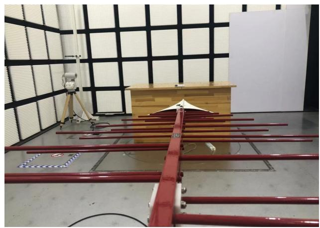

natural_image

Interior of an anechoic chamber with red metal beams, a wooden box, and a camera setup (no visible text or symbols)

Mode 1

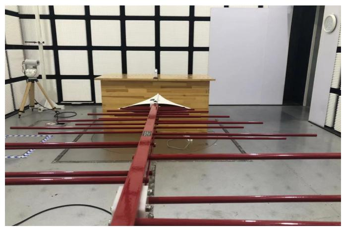

natural_image

Interior of a laboratory setup with red metal rods, wooden box, and measurement instruments (no visible text or symbols)

Mode 2

# 8.2 ESD Test Setup

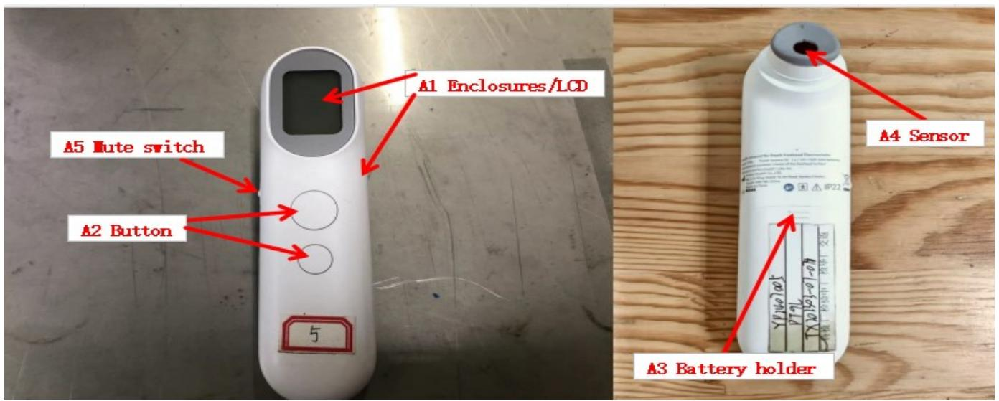

text_image

A5 Mute switch
A2 Button
5
A1 Enclosures/LCD
A4 Sensor
A3 Battery holder

Discharge position

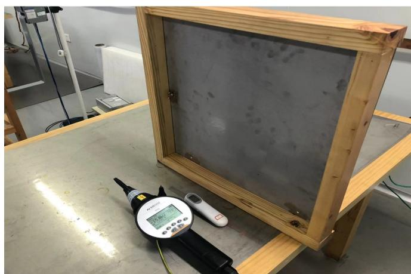

natural_image

Laboratory setup with a wooden frame containing a transparent material sample and a digital measuring device on a workbench (no visible text or symbols)

Mode1

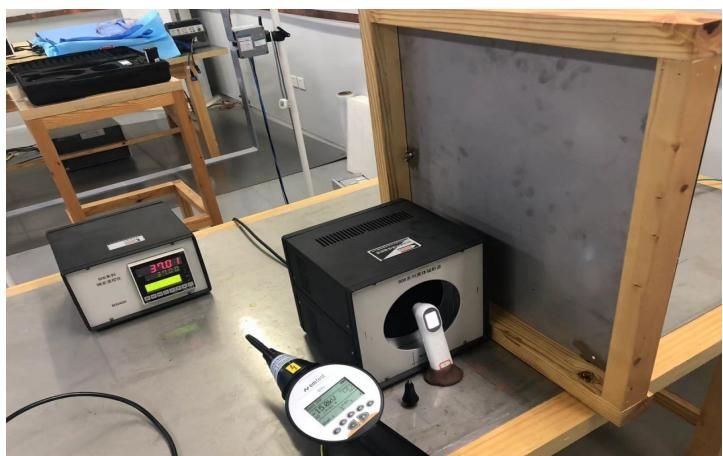

natural_image

Laboratory setup with digital display, instrument, and measurement tools on a wooden frame (no visible text or symbols)

Mode 2

# 8.3 Radiated Immunity Test Setup

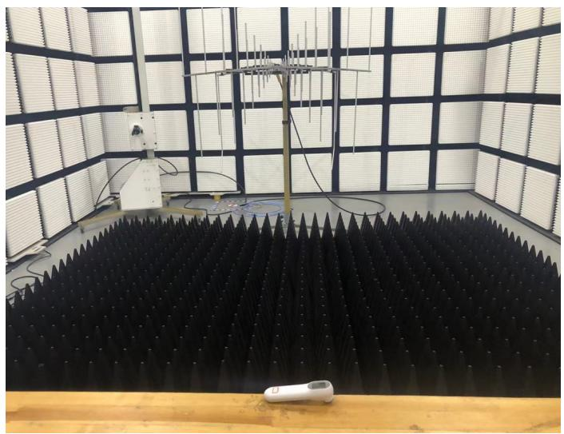

natural_image

Interior of an anechoic chamber with a large black acoustic foam chamber and grid-patterned acoustic panels (no visible text or symbols)

Mode 1

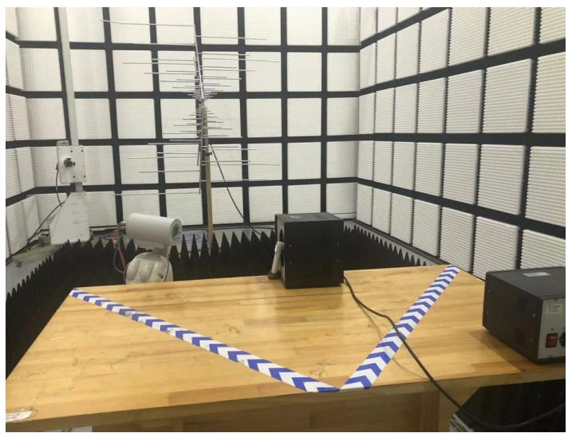

natural_image

Interior of an anechoic chamber with a central display table, no visible text or symbols

Mode 2

# 8.4 Proximity Fields from RF Wireless Communications Equipment Test Setup

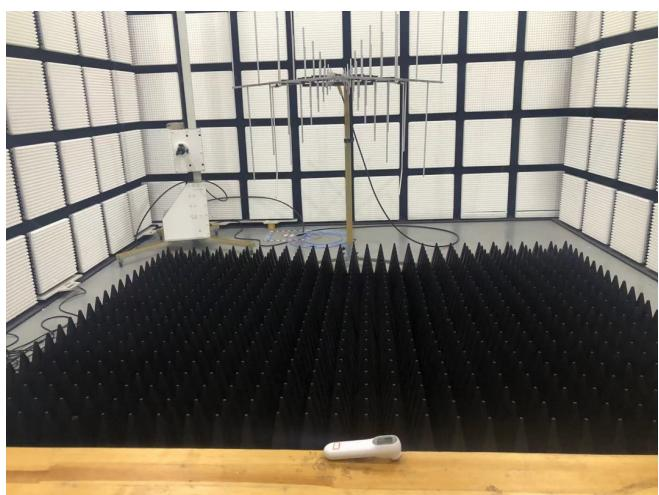

natural_image

Interior of an anechoic chamber with a large black acoustic foam chamber and grid-patterned acoustic panels (no visible text or symbols)

Battery Power 385MHz\~1970MHz

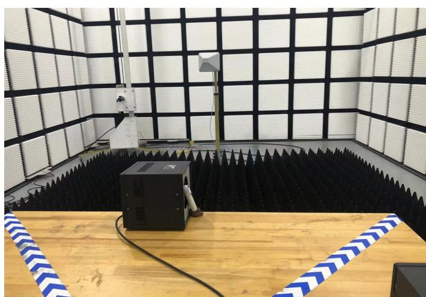

natural_image

Interior of an anechoic chamber with acoustic foam acoustic foam and a central speaker unit (no visible text or symbols)

Battery Power 2450MHz\~5785MHz

# 8.5 EUT

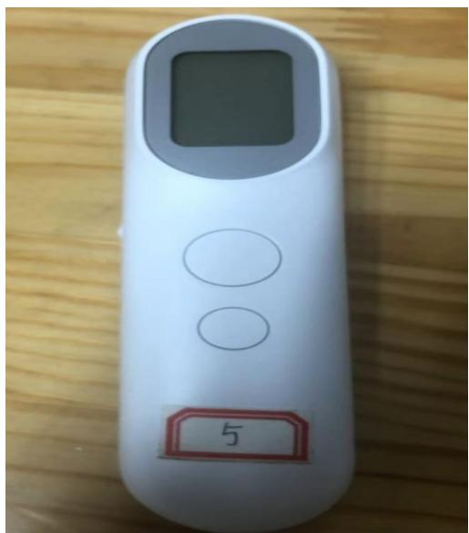

text_image

5

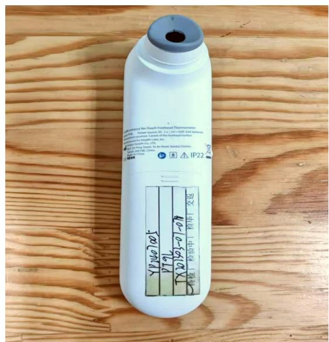

text_image

Water-Isolated Two-Depth-Functional Thermometers
Power Source DC (a 1.25V/100A) Air Systemes
Air Pressure Center of the Technical Surface
Air Pressure Strength Co., (7)
Air Pressure Strength Co., (7)
Air Pressure Strength Co., (7)
Air Pressure Strength Co., (7)
IP22
YP22005
PT9L
TX20301-0-07
标准 | 检验中 | 简毕 | 交通

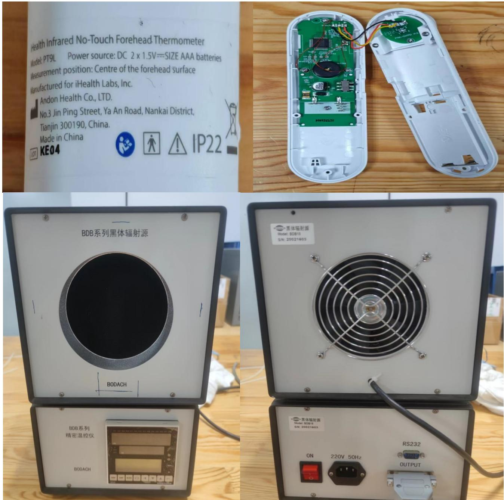

text_image

Health Infrared No-Touch Forehead Thermometer
Model: PT9L Power source: DC 2 x 1.5V==SIZE AAA batteries
Measurement position: Centre of the forehead surface
Manufactured for iHealth Labs, Inc.
Andon Health Co., LTD.
No.3 Jin Ping Street, Ya An Road, Nankai District,
Tianjin 300190, China.
Made in China
LEIT KE04 IP22
BDB系列黑体辐射源
BODACH
BDB系列
精密温控仪
BODACH
黑体辐射源
Model: BDB15
SN: 20021603
黑体辐射源
Model: BDB15
SN: 20021603
RS232
ON 220V 50Hz OUTPUT

--End of the Report--