<table><tr><td colspan="2">TEST REPORTIEC 60601 -1Medical electrical equipmentPart 1: General requirements for basic safety and essential performanceIEC 60601-1-11MEDICAL ELECTRICAL EQUIPMENT –Part 1-11: General requirements for basic safety and essential performance – Collateral Standard: Requirements for medical electrical equipment and medical electrical systems used in the home healthcare environment</td></tr><tr><td>Date of issue......:</td><td>2024-09-30</td></tr><tr><td>Standard......:</td><td>IEC 60601-1: 2005+AMD1: 2012+ AMD2:2020IEC 60601-1-11:2015 + A1:2020</td></tr><tr><td>Procedure deviation......:</td><td>N/A</td></tr><tr><td>Non-standard test method......:</td><td>N/A</td></tr><tr><td>Type of test object......:</td><td>Infrared No-Touch Forehead Thermometer</td></tr><tr><td>Trademark......:</td><td>N/A</td></tr><tr><td>Model/type reference......:</td><td>PT9L</td></tr><tr><td>ReportNo ......:</td><td>ETX202303-07-078-02</td></tr><tr><td>Testing period......:</td><td>2024.07.08-2024.08.01</td></tr><tr><td>Manufacturer......:</td><td>Andon Health Co., Ltd.</td></tr><tr><td>Address......:</td><td>No.3 JinPing Street, Ya An Road, Nankai District, Tianjin,China</td></tr><tr><td>Test laboratory......Address......</td><td>Tianxu(Tianjin)Testing Technology Service Co.,LTD101, First floor, Building L,No.3 JinPing Street,Ya An Road,Nankai District, Tianjin,China</td></tr></table>

(Guan Qingxiang）Date:2029.30

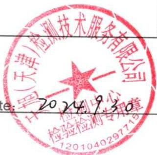

text_image

天津(天津)检测技术服务有限公司
2024.9.30
检验检测专用章

<table><tr><td colspan="2">GENERAL INFORMATION</td></tr><tr><td colspan="2">Test item particulars (see also Clause 6):</td></tr><tr><td colspan="2">Classification of installation and use ...... : Hand-held</td></tr><tr><td>Device type (component/sub-assembly/ equipment/ system) ...... :</td><td>Equipment</td></tr><tr><td>Intended use (Including type of patient, application Thermometer location)...... :</td><td>Infrared No-Touch Forehead</td></tr><tr><td></td><td>The Infrared No-Touch Forehead Thermometer is intended for the intermittent measurement of body temperature from the forehead skin surface on people of all ages. It can be used by consumers in the household environment and by healthcare providers.</td></tr><tr><td>Mode of operation ...... :</td><td>Continuous</td></tr><tr><td>Supply connection ...... :</td><td>Internally powered</td></tr><tr><td>Accessories and detachable parts included ...... :</td><td>N/A</td></tr><tr><td>Other options include ...... :</td><td>N/A</td></tr><tr><td colspan="2">Possible test case verdicts:- test case does not apply to the test object ...... : N/A- test object does meet the requirement ...... : Pass (P)- test object was not evaluated for the requirement...... : N/E- test object does not meet the requirement ...... : Fail (F)</td></tr><tr><td colspan="2">Abbreviations used in the report:- normal condition ...... : N.C. - single fault condition...... : S.F.C.- means of Operator protection ...... : MOOP - means of Patient protection ...... : MOPP</td></tr><tr><td colspan="2">General remarks:&quot;(see Attachment #)&quot; refers to additional information appended to the report.&quot;&quot;(see appended table)&quot; refers to a table appended to the report.The tests results presented in this report relate only to the object tested.This report shall not be reproduced except in full without the written approval of the testing laboratory.List of test equipment must be kept on file and available for review.Additional test data and/or information provided in the attachments to this report.Throughout this report a □ comma / ☒ point is used as the decimal separator.</td></tr></table>

# General product information:

This product is a high-tech infra-red (IR) thermometer designed to take human body temperature by measuring the energy of IR emitted from the forehead. The product will help you to assess you and your family members’ health conditions easily and quickly.

Tests performed for IEC 60601 -1 (name of test and test clause): 

<table><tr><td>-</td><td>4 General requirements;</td></tr><tr><td>-</td><td>5 General requirements for testing ME EQUIPMENT;</td></tr><tr><td>-</td><td>6 Classification Of ME EQUIPMENT and ME SYSTEMS;</td></tr><tr><td>-</td><td>7 ME EQUIPMENT identification, marking and documents;</td></tr><tr><td>-</td><td>8 Protection against electrical HAZARDS frOm ME EQUIPMENT</td></tr><tr><td>-</td><td>9 Protection against MECHANICAL HAZARDS of ME EQUIPMENT and ME SYSTEMS;</td></tr><tr><td>-</td><td>11 Protection against excessive temperatures and other HAZARDS;</td></tr><tr><td>-</td><td>12 Accuracy of controls and instruments and protection against hazardous outputs;</td></tr><tr><td>-</td><td>13 HAZARDOUS SITUATIONS and fault conditions for ME EQUIPMENT;</td></tr><tr><td>-</td><td>14 PROGRAMMABLE ELECTRICAL MEDICAL SYSTEMS(PEMS);</td></tr><tr><td>-</td><td>15 Construction of ME EQUIPMENT.</td></tr></table>

Tests performed for IEC 60601 -1-11 (name of test and test clause): 

<table><tr><td>-</td><td>4 General requirements;</td></tr><tr><td>-</td><td>5 GENERAL REQUIREMENTS FOR TESTING ME EQUIPMENT;</td></tr><tr><td>-</td><td>6 Classificaton of ME EQUIPMENT and ME SYSTEMS;</td></tr><tr><td>-</td><td>7 ME EQUIPMENT identification, marking and documents;</td></tr><tr><td>-</td><td>8 Protection against electrical HAZARDS frOm ME EQUIPMENT</td></tr><tr><td>-</td><td>9 Protection against MECHANICAL HAZARDS of ME EQUIPMENT and ME SYSTEMS;</td></tr><tr><td>-</td><td>10 Construction of ME EQUIPMENT.</td></tr></table>

# Test result:

The test item passed the test specification(s). All apply to the test object does meet the requirement.

# General disclaimer：

The test results presented in this report relate only to the object tested.

Without permission of the Report department this test report is not permitted to be duplicated in extracts.

# Condition of acceptability for IEC 60601 -1:

1) Clause 11.7 biocompatibility according to ISO 10993 is not evaluate in this report.   
2) Clause 12.3 ALARM SYSTEM that complies with IEC 60601-1-8 is not evaluate in this report.   
3) Clause 17 EMC according to IEC 60601-1-2 is not evaluate in this report.

# Condition of acceptability for IEC 60601 -1-11:

1) Clause 12 ADDITIONAL REQUIREMENTS FOR ELECTROMAGNETIC EMISSIONS OF ME EQUIPMENT AND ME SYSTEMS according to IEC 60601-1-2 is not evaluate in this report.   
2) Clause 13 ADDITIONAL REQUIREMENTS FOR ALARM SYSTEMS that complies with IEC 60601-1-8 is not evaluate in this report.

# Label of the Core：

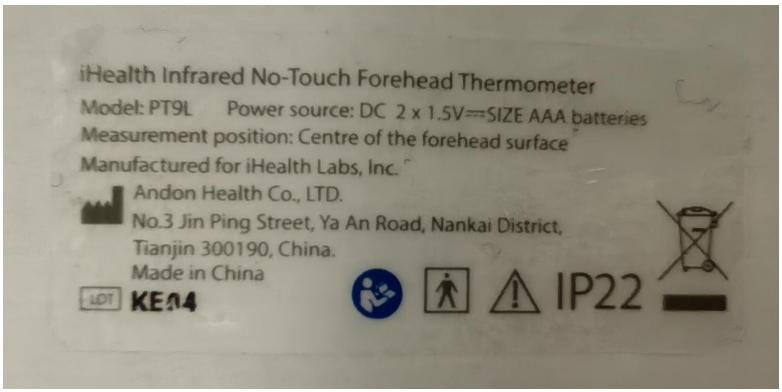

text_image

iHealth Infrared No-Touch Forehead Thermometer
Model: PT9L Power source: DC 2 x 1.5V==SIZE AAA batteries
Measurement position: Centre of the forehead surface
Manufactured for iHealth Labs, Inc.
Andon Health Co., LTD.
No.3 Jin Ping Street, Ya An Road, Nankai District,
Tianjin 300190, China.
Made in China
LEDT KE04 IP22

INSULATION DIAGRAM   
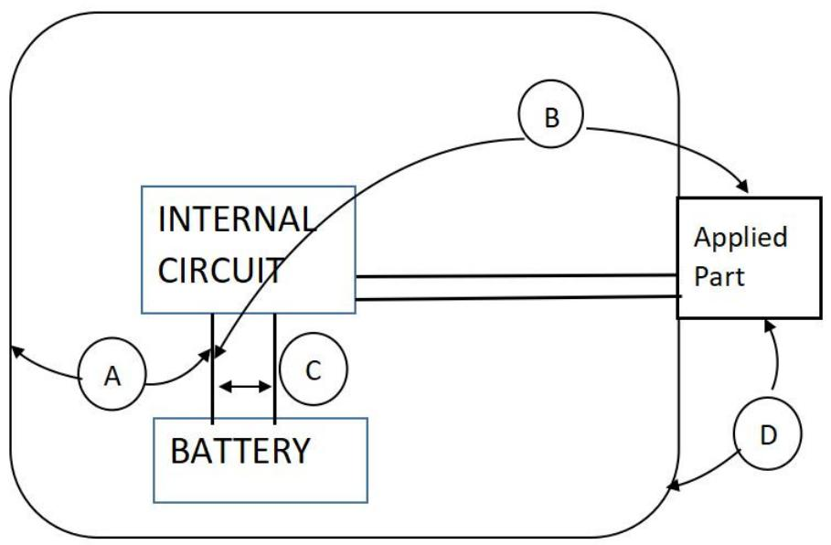

flowchart

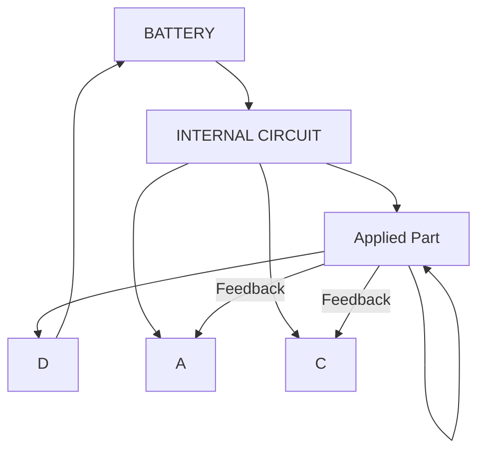

<table><tr><td colspan="10">TABLE: To insulation diagram</td><td>P</td></tr><tr><td rowspan="4" colspan="4">Pollution degree ...... :Overvoltage category ...... :Altitude...... :Additional details on parts considered as applied parts ...... :</td><td rowspan="4" colspan="6">IINo overvoltage category&lt; 2000☒None ☐ Areas ____ (See Clause 4.6 for details)</td><td>—</td></tr><tr><td>—</td></tr><tr><td>—</td></tr><tr><td>—</td></tr><tr><td rowspan="2">Area</td><td rowspan="2">Number and type of Means of Protection:MOOP, MOPP</td><td rowspan="2">CTI(IIIb,unless is known)</td><td colspan="2">Working voltage</td><td rowspan="2">Required creepage(mm)</td><td rowspan="2">Required clearance(mm)</td><td rowspan="2">Measured creepage(mm)</td><td rowspan="2">Measured clearance(mm)</td><td rowspan="2" colspan="2">Remarks</td></tr><tr><td>Vrms</td><td>Vpk</td></tr><tr><td>A</td><td>2MOOP</td><td>IIIb</td><td>3V d.c.</td><td>--</td><td>3.4</td><td>1.6</td><td>&gt;3.4</td><td>&gt;1.6</td><td colspan="2">RI: Batteries electrode to non-metallic enclosure</td></tr><tr><td>B</td><td>2MOOP</td><td>IIIb</td><td>3V d.c.</td><td>--</td><td>3.4</td><td>1.6</td><td>&gt;3.4</td><td>&gt;1.6</td><td colspan="2">RI: Batteries electrode to the probe</td></tr><tr><td>C</td><td>2MOPP</td><td>IIIb</td><td>3V d.c.</td><td>--</td><td>1.0</td><td>0.8</td><td>&gt;1.0</td><td>&gt;0.8</td><td colspan="2">RI: From the positive battery terminal to the negative power</td></tr><tr><td>D</td><td>1MOPP</td><td>IIIb</td><td>AC 339</td><td>AC240</td><td>4.0</td><td>2.5</td><td>&gt;4.0</td><td>&gt;2.5</td><td colspan="2">RI: From monitor enclosure to the probe</td></tr><tr><td colspan="11">Supplementary information:1) No any electrical circuit in the probe (Applied part).2) No protective earthing in ME equipment.</td></tr></table>

# INSULATION DIAGRAM CONVENTIONS and GUIDANCE:

A measured value must be provided in the value columns for the device under evaluation. The symbol > (greater than sign) must not be used. Switch-mode power supplies must be re-evaluated in the device under evaluation therefore N/A must not be used with a generic statement that the component is certified.

Insulation diagram is a graphical representation of equipment insulation barriers, protective impedance and protective earthing. If feasible, use the following conventions to generate the diagram:

- All isolation barriers are identified by letters between separate parts of diagram, for example separate transformer windings, optocouplers, wire insulation, creepage and clearance distances.   
- Parts connected to earth with large dots are protectively earthed. Other connections to earth are functional   
- Applied parts are extended beyond the equipment enclosure and terminated with an arrow.   
- Parts accessible to the operator only are extended outside of the enclosure, but are not terminated with an arrow.

Report No.: ETX202303-07-078-02 

<table><tr><td colspan="4">IEC60601-1:2005+AMD1:2012+AMD2:2020/EN60601-1:2006+AC:2010+A1:2013+A12:2014+AC:2016+A2:2021</td></tr><tr><td>Clause</td><td>Requirement + Test</td><td>Result - Remark</td><td>Verdict</td></tr><tr><td colspan="4"></td></tr><tr><td>4</td><td colspan="2">GENERAL REQUIREMENTS</td><td>P</td></tr><tr><td>4.1</td><td>Requirements of this standard applied in NORMAL USE and reasonably foreseeable misuse</td><td>Normal use and reasonably foreseeable misuse were concerned</td><td>P</td></tr><tr><td>4.2</td><td colspan="2">RISK MANAGEMENT PROCESS FOR ME EQUIPMENT OR ME SYSTEMS</td><td>P</td></tr><tr><td>4.2.2</td><td>General requirement for RISK MANAGEMENT - PROCESS complies with ISO14971 (2019) ......:</td><td>See Appended RM Results</td><td>P</td></tr><tr><td>4.2.3</td><td colspan="2">Evaluating RISK</td><td>P</td></tr><tr><td>4.2.3.1</td><td>a) Compliance with the standard reduces residual risk to an acceptable level</td><td>See Appended RM Results</td><td>P</td></tr><tr><td></td><td>b) Manufacturer has defined risk acceptability criteria in the RISK MANAGEMENT PLAN ......:</td><td></td><td>P</td></tr><tr><td></td><td>c) When no specific technical requirements provided manufacturer has determined HAZARDS or HAZARDOUS SITUATIONS exists.</td><td></td><td>P</td></tr><tr><td></td><td>- HAZARDS OR HAZARDOUS SITUATIONS have been evaluated using the RISK MANAGEMENT PROCESS.</td><td></td><td>N/A</td></tr><tr><td>4.2.3.2</td><td>MANUFACTURER has addressed HAZARDS or HAZARDOUS SITUATIONS not specifically addressed in the IEC 60601-1 series.</td><td></td><td>N/A</td></tr><tr><td>4.3</td><td>Performance of clinical functions necessary to achieve INTENDED USE or that could affect the safety of the ME EQUIPMENT or ME SYSTEM were identified during RISK ANALYSIS.</td><td>Limits of the error of the thermometer</td><td>P</td></tr><tr><td></td><td>- Performance limits were identified in both NORMAL CONDITION and SINGLE FAULT CONDITION.</td><td>Essential performance considered.</td><td>P</td></tr><tr><td></td><td>- Loss or degradation of performance beyond the limits specified by the MANUFACTURER were evaluated</td><td></td><td>P</td></tr><tr><td></td><td>- Functions with unacceptable risks are identified as ESSENTIAL PERFORMANCE......:</td><td></td><td>P</td></tr><tr><td></td><td>- RISK CONTROL measures implemented</td><td></td><td>P</td></tr><tr><td></td><td>- Methods used to verify the effectiveness of RISK CONTROL measures implemented</td><td></td><td>P</td></tr><tr><td>4.4</td><td>EXPECTED SERVICE LIFE stated in RISK MANAGEMENT FILE ......:</td><td>Described in risk management file. 5 years.</td><td>P</td></tr><tr><td>4.5</td><td>Alternative means of addressing particular RISKS considered acceptable based on MANUFACTURERS justification that RESIDUAL RISKS resulting from application of alternative means are comparable to the RESIDUAL RISKS resulting from requirements of this standard ......:</td><td>No alternative means provided</td><td>N/A</td></tr></table>

Report No.: ETX202303-07-078-02 

<table><tr><td colspan="4">IEC60601-1:2005+AMD1:2012+AMD2:2020/EN60601-1:2006+AC:2010+A1:2013+A12:2014+AC:2016+A2:2021</td></tr><tr><td>Clause</td><td>Requirement + Test</td><td>Result - Remark</td><td>Verdict</td></tr><tr><td colspan="4"></td></tr><tr><td></td><td>Alternative means based scientific data or clinical opinion or comparative studies ......:</td><td>No alternative means used</td><td>N/A</td></tr><tr><td>4.6</td><td>RISK MANAGEMENT PROCESS identifies parts that can come into contact with PATIENT but not defined as APPLIED PARTS, subjected to the requirements for APPLIED PARTS, except for Clause 7.2.10......:</td><td></td><td>N/A</td></tr><tr><td></td><td>Assessment identified the APPLIED PART TYPE requirements......:</td><td></td><td>N/A</td></tr><tr><td>4.7</td><td>ME EQUIPMENT remained SINGLE FAULT SAFE, or the RISK remained acceptable as determined by Clause 4.2......:</td><td>Hazards are addressed.</td><td>P</td></tr><tr><td></td><td>Failure of any one component at a time that could result in a HAZARDOUS SITUATION, including those in 13.1, simulated physically or theoretically ......:</td><td>Considered in the RM files</td><td>P</td></tr><tr><td></td><td>RISK associated with failure of component during EXPECTED SERVICE LIFE of ME EQUIPMENT taken into account to evaluate if a component should be subjected to failure simulation</td><td>Considered in the RM files</td><td>P</td></tr><tr><td>4.8</td><td>All components and wiring whose failure could result in a HAZARDOUS SITUATION used according to their applicable ratings, unless specified ....:</td><td>II components and wiring are used within their specified ratings</td><td>P</td></tr><tr><td></td><td>Components and wiring exception in the standard or by RISK MANAGEMENT PROCESS</td><td>See Appended RM Results</td><td>P</td></tr><tr><td></td><td>Reliability of components used as MEANS OF PROTECTION assessed for conditions of use in ME EQUIPMENT, and they complied with one of the following</td><td>See below</td><td>P</td></tr><tr><td></td><td>a) Applicable safety requirements of a relevant IEC or ISO standard</td><td>See appended table 8.10</td><td>P</td></tr><tr><td></td><td>b) Requirements of this standard applied in the absence of a relevant IEC or ISO standard</td><td>See appended table 8.10</td><td>P</td></tr><tr><td>4.9</td><td>A COMPONENT WITH HIGH-INTEGRITY CHARACTERISTICS provided because a fault in a particular component can generate an unacceptable RISK ......:</td><td>No component with high-integrity characteristics used</td><td>N/A</td></tr><tr><td></td><td>COMPONENTS WITH HIGH-INTEGRITY CHARACTERISTICS selected and evaluated consistent with their conditions of use and reasonable foreseeable misuse during EXPECTED SERVICE LIFE of ME EQUIPMENT by reviewing RISK MANAGEMENT FILE ......:</td><td>See above</td><td>N/A</td></tr><tr><td>4.10</td><td colspan="2">Power supply</td><td>P</td></tr></table>

Report No.: ETX202303-07-078-02 

<table><tr><td colspan="4">IEC60601-1:2005+AMD1:2012+AMD2:2020/EN60601-1:2006+AC:2010+A1:2013+A12:2014+AC:2016+A2:2021</td></tr><tr><td>Clause</td><td>Requirement + Test</td><td>Result - Remark</td><td>Verdict</td></tr><tr><td colspan="4"></td></tr><tr><td>4.10.1</td><td>ME EQUIPMENT is suitable for connection to a SUPPLY MAINS, specified to be connected to a separate power supply, can be powered by an INTERNAL ELECTRICAL POWER SOURCE, or a combination of the three ......:</td><td>Internal power supply</td><td>P</td></tr><tr><td>4.10.2</td><td>Maximum rated voltage for ME EQUIPMENT intended to be connected to SUPPLY MAINS:</td><td></td><td>N/A</td></tr><tr><td></td><td>- 250 V for HAND-HELD ME EQUIPMENT (V)...... :</td><td></td><td>N/A</td></tr><tr><td></td><td>- 250 V d.c. or single-phase a.c., or 500 V poly-phase a.c. for ME EQUIPMENT and ME SYSTEMS with a RATED input ≤4 kVA (V)...... :</td><td></td><td>N/A</td></tr><tr><td></td><td>- 500 V for all other ME EQUIPMENT and ME SYSTEMS</td><td></td><td>N/A</td></tr><tr><td>4.11</td><td colspan="2">Power input</td><td>N/A</td></tr><tr><td></td><td>Steady-state measured input of ME EQUIPMENT or ME SYSTEM at RATED voltage and at operating settings indicated in instructions for use didn&#x27;t exceed marked rating by more than 10% ...... :</td><td></td><td>N/A</td></tr><tr><td></td><td>- Measurements on ME EQUIPMENT or a ME SYSTEM marked with one or more RATED voltage ranges made at both upper and lower limits of the range......:</td><td></td><td>N/A</td></tr><tr><td></td><td>Measurements made at a voltage equal to the mean value of the range when each marking of RATED input was related to the mean value of relevant voltage range</td><td></td><td>N/A</td></tr><tr><td></td><td>Power input, expressed in volt-amperes, measured with a volt-ampere meter or calculated as the product of steady state current (measured as described above) and supply voltage ......:</td><td></td><td>N/A</td></tr><tr><td>5</td><td colspan="2">GENERAL REQUIREMENTS FOR TESTING ME EQUIPMENT</td><td>P</td></tr><tr><td>5.1</td><td>TYPE TESTS determined in consideration of Clause 4, in particular 4.2</td><td></td><td>P</td></tr><tr><td></td><td>Test not performed when analysis indicated condition being tested was adequately evaluated by other tests or methods ......:</td><td>No other test or methods</td><td>N/A</td></tr><tr><td></td><td>RISK MANAGEMENT FILE identified combinations of simultaneous independent faults that could result in a HAZARDOUS SITUATION.</td><td></td><td>N/A</td></tr><tr><td></td><td>- Testing determined BASIC SAFETY and ESSENTIAL PERFORMANCE were maintained.</td><td></td><td>N/A</td></tr></table>

Report No.: ETX202303-07-078-02 

<table><tr><td colspan="4">IEC60601-1:2005+AMD1:2012+AMD2:2020/EN60601-1:2006+AC:2010+A1:2013+A12:2014+AC:2016+A2:2021</td></tr><tr><td>Clause</td><td>Requirement + Test</td><td>Result - Remark</td><td>Verdict</td></tr><tr><td colspan="4"></td></tr><tr><td>5.2</td><td>TYPE TESTS conducted on one representative sample under investigation; multiple samples used simultaneously when validity of results was not significantly affected......:</td><td>Only one sample used</td><td>P</td></tr><tr><td>5.3</td><td>a) Tests conducted within the environmental conditions specified in technical description</td><td>Test were conducted within the environment specified as bellows:</td><td>P</td></tr><tr><td></td><td>Temperature (°C), Relative Humidity (%) ......:</td><td>Temperature: 10°C-40°C; Humidity: 15%RH-95%RH;</td><td>P</td></tr><tr><td></td><td>Atmospheric Pressure (kPa) ......:</td><td>Atmospheric pressure: 700hPa-1060hPa</td><td>P</td></tr><tr><td></td><td>b) ME EQUIPMENT shielded from other influences that might affect the validity of tests</td><td>Test lab environment under controlled</td><td>P</td></tr><tr><td></td><td>c) Test conditions modified and results adjusted accordingly when ambient temperature could not be maintained ......:</td><td>Test results of excessive temperature were adjusted to ambient temperature 40°C</td><td>P</td></tr><tr><td>5.4</td><td>a) ME EQUIPMENT tested under least favourable working conditions specified in instructions for use......:</td><td></td><td>N/A</td></tr><tr><td></td><td>b) ME EQUIPMENT with adjustable or controlled operating values by anyone other than SERVICE PERSONNEL adjusted to values least favourable for the relevant test per instructions for use</td><td></td><td>N/A</td></tr><tr><td></td><td>c) When test results influenced by inlet pressure and flow or chemical composition of a cooling liquid, tests performed within the limits in technical description......:</td><td></td><td>N/A</td></tr><tr><td></td><td>d) Potable water used for cooling</td><td></td><td>N/A</td></tr><tr><td>5.5</td><td>a) Supply voltage during tests was the least favourable of the voltages specified in 4.10.2 or voltages marked on ME EQUIPMENT (V) ......:</td><td></td><td>N/A</td></tr><tr><td></td><td>b) ME EQUIPMENT marked with a RATED frequency range tested at the least favourable frequency within the range (Hz)......:</td><td></td><td>N/A</td></tr><tr><td></td><td>c) ME EQUIPMENT with more than one RATED voltage, both a.c./ d.c. or both external power and INTERNAL ELECTRICAL POWER SOURCE tested in conditions (see 5.4) related ......:</td><td></td><td>N/A</td></tr><tr><td></td><td>d) ME EQUIPMENT intended for only d.c. supply connection tested with d.c. and influence of polarity considered......:</td><td></td><td>N/A</td></tr></table>

Report No.: ETX202303-07-078-02 

<table><tr><td colspan="4">IEC60601-1:2005+AMD1:2012+AMD2:2020/EN60601-1:2006+AC:2010+A1:2013+A12:2014+AC:2016+A2:2021</td></tr><tr><td>Clause</td><td>Requirement + Test</td><td>Result - Remark</td><td>Verdict</td></tr><tr><td></td><td>e)ME EQUIPMENT tested with alternative ACCESSORIES and components specified in ACCOMPANYING DOCUMENTS to result in the least favourable conditions...... :</td><td></td><td>N/A</td></tr><tr><td></td><td>f) ME EQUIPMENT connected to a separate power supply as specified in instructions for use</td><td></td><td>N/A</td></tr><tr><td>5.7</td><td>ME EQUIPMENT or parts thereof affected by climatic conditions were set up completely, or partially, with covers detached and subjected to a humidity preconditioning prior to tests of Clauses 8.7.4 and 8.8.3...... :</td><td>Humidity preconditioning: 25°C, RH=93%, 168 hours</td><td>P</td></tr><tr><td></td><td>Manually detachable parts removed and treated concurrently with major parts and manually removable ACCESS COVERS were opened and detached</td><td></td><td>P</td></tr><tr><td></td><td>ME EQUIPMENT heated to a temperature between T and T + 4°C for at least 4 h and placed in a humidity chamber (relative humidity 93%±3%) and an ambient within 2 °C of T in the range of + 20 °C to + 32 °C for 48 h for units rated IPX0</td><td></td><td>P</td></tr><tr><td></td><td>- For units rated higher than IPX0 test time extended to 168 h...... :</td><td>Humidity preconditioning: 25°C, RH=93%, 168 hours</td><td>P</td></tr><tr><td>5.8</td><td>Unless stated otherwise, tests in this standard sequenced as in Annex B to prevent influencing results of any subsequent test</td><td></td><td>P</td></tr><tr><td>5.9</td><td colspan="2">Determination of APPLIED PARTS and ACCESSIBLE PARTS</td><td>P</td></tr><tr><td>5.9.1</td><td>APPLIED PARTS identified by inspection and reference to ACCOMPANYING DOCUMENTS...... :</td><td>The probe is identified as applied parts.</td><td>P</td></tr><tr><td>5.9.2</td><td colspan="2">ACCESSIBLE PARTS</td><td>P</td></tr><tr><td>5.9.2.1</td><td>Accessibility, when necessary, determined using standard test finger of Fig 6 applied in a bent or straight position</td><td>See Appended Table 5.9.2</td><td>P</td></tr><tr><td></td><td>Openings preventing entry of test finger of Fig. 6 mechanically tested with a straight un-jointed test finger of the same dimensions with a force of 30 N</td><td>No opening</td><td>P</td></tr><tr><td></td><td>When the straight un-jointed test finger entered, test with the standard test finger (Fig 6) was repeated, if necessary, by pushing the finger through the opening</td><td>See above.</td><td>P</td></tr><tr><td>5.9.2.2</td><td>Test hook of Fig. 7 inserted in all openings of ME EQUIPMENT and pulled with a force of 20 N for 10 s</td><td></td><td>N/A</td></tr><tr><td></td><td>All additional parts that became accessible checked using standard test finger and by inspection</td><td></td><td>N/A</td></tr></table>

Report No.: ETX202303-07-078-02 

<table><tr><td colspan="4">IEC60601-1:2005+AMD1:2012+AMD2:2020/EN60601-1:2006+AC:2010+A1:2013+A12:2014+AC:2016+A2:2021</td></tr><tr><td>Clause</td><td>Requirement + Test</td><td>Result - Remark</td><td>Verdict</td></tr><tr><td colspan="4"></td></tr><tr><td>5.9.2.3</td><td>Conductive parts of actuating mechanisms of electrical controls accessible after removal of handles, knobs, levers and the like regarded as ACCESSIBLE PARTS...... :</td><td>No such conductive part.</td><td>N/A</td></tr><tr><td></td><td>Conductive parts of actuating mechanisms not considered ACCESSIBLE PARTS when removal of handles, knobs, etc. required use of a TOOL .:</td><td>See above.</td><td>N/A</td></tr><tr><td>6</td><td colspan="2">CLASSIFICATION OF ME EQUIPMENT AND ME SYSTEMS</td><td>P</td></tr><tr><td>6.2</td><td>CLASS I ME EQUIPMENT, externally powered</td><td></td><td>N/A</td></tr><tr><td></td><td>CLASS II ME EQUIPMENT, externally powered</td><td>CLASS II</td><td>P</td></tr><tr><td></td><td>INTERNALLY POWERED ME EQUIPMENT</td><td>INTERNALLY POWERED ME EQUIPMENT</td><td>P</td></tr><tr><td></td><td>EQUIPMENT with means of connection to a SUPPLY MAINS complied with CLASS I or CLASS II ME EQUIPMENT requirements when so connected, and when not connected to SUPPLY MAINS with INTERNALLY POWERED ME EQUIPMENT requirements</td><td></td><td>P</td></tr><tr><td></td><td>TYPE B APPLIED PART</td><td></td><td>N/A</td></tr><tr><td></td><td>TYPE BF APPLIED PART</td><td>TYPE BF APPLIED PART</td><td>P</td></tr><tr><td></td><td>TYPE CF APPLIED PART</td><td></td><td>N/A</td></tr><tr><td></td><td>DEFIBRILLATION-PROOF APPLIED PARTS</td><td></td><td>N/A</td></tr><tr><td>6.3</td><td>ENCLOSURES classified according to degree of protection against ingress of water and particulate matter (IPN1N2) as per IEC 60529 .... :</td><td>IP22</td><td>P</td></tr><tr><td>6.4</td><td>ME EQUIPMENT or its parts intended to be sterilized classified according to method(s) of sterilization in instructions for use...... :</td><td>No sterilization need.</td><td>N/A</td></tr><tr><td>6.5</td><td>ME EQUIPMENT and ME SYSTEMS intended for use in an OXYGEN RICH ENVIRONMENT classified for such use and complied with 11.2.2</td><td>Not used in an OXYGEN RICH ENVIRONMENT</td><td>N/A</td></tr><tr><td>6.6</td><td>CONTINUOUS or Non-CONTINUOUS OPERATION ...... :</td><td>CONTINUOUS OPERATION.</td><td>P</td></tr><tr><td>7</td><td colspan="2">ME EQUIPMENT IDENTIFICATION, MARKING, AND DOCUMENTS</td><td>P</td></tr><tr><td>7.1.2</td><td>Legibility of Markings Test for Markings specified in Clause 7.2-7.6...... :</td><td>See Appended Table 7.1.2</td><td>P</td></tr><tr><td>7.1.3</td><td>Required markings can be removed only with a TOOL or by appreciable force, are durable and remain CLEARLY LEGIBLE during EXPECTED SERVICE LIFE of ME EQUIPMENT in NORMAL USE</td><td>Can be removed only with appreciable force</td><td>P</td></tr></table>

Report No.: ETX202303-07-078-02 

<table><tr><td colspan="4">IEC60601-1:2005+AMD1:2012+AMD2:2020/EN60601-1:2006+AC:2010+A1:2013+A12:2014+AC:2016+A2:2021</td></tr><tr><td>Clause</td><td>Requirement + Test</td><td>Result - Remark</td><td>Verdict</td></tr><tr><td></td><td>a) After tests, adhesive labels didn&#x27;t loosen up or curl up at edges and markings complied with requirements in Clause 7.1.2...... :</td><td>See appended Tables 7.1.3 and 8.10</td><td>P</td></tr><tr><td></td><td>b) Markings required by 7.2-7.6 remained CLEARLY LEGIBLE after marking durability test ... :</td><td>See appended Tables 7.1.3 and 8.10</td><td>P</td></tr><tr><td>7.2</td><td colspan="2">Marking on the outside of ME EQUIPMENT or ME EQUIPMENT parts</td><td>P</td></tr><tr><td>7.2.1</td><td>At least markings in 7.2.2, 7.2.5, 7.2.6 (not for PERMANENTLY INSTALLED ME EQUIPMENT), 7.2.10, and 7.2.13 were applied when size of EQUIPMENT, its part, an ACCESSORY, or ENCLOSURE did not permit application of all required markings ...... :</td><td>See attached copy of Marking Plate</td><td>P</td></tr><tr><td></td><td>Remaining markings fully recorded in ACCOMPANYING DOCUMENTS ...... :</td><td>See Operation guide</td><td>P</td></tr><tr><td></td><td>Markings applied to individual packaging when impractical to apply to ME EQUIPMENT</td><td>No such marking</td><td>N/A</td></tr><tr><td></td><td>A material, component, ACCESSORY, or ME EQUIPMENT intended for a single use, or its packaging marked &quot;Single Use Only&quot;, —Do Not Reusell or with symbol 28 of Table D.1 (ISO 7000-1051, DB:2004-01)...... :</td><td>No such material and component are provided.</td><td>N/A</td></tr><tr><td>7.2.2</td><td>ME EQUIPMENT marked with:</td><td></td><td>P</td></tr><tr><td></td><td>– the name or trademark and contact information of the MANUFACTURER</td><td>See attached copy of Marking Plate</td><td>P</td></tr><tr><td></td><td>– a MODEL OR TYPE REFERENCE</td><td>See above</td><td>P</td></tr><tr><td></td><td>– a serial number or lot or batch identifier; and</td><td>See above</td><td>P</td></tr><tr><td></td><td>– the date of manufacture or use by date</td><td></td><td>N/A</td></tr><tr><td></td><td>Detachable components of the ME EQUIPMENT not marked; misidentification does not present an unacceptable risk, or</td><td>No detachable components</td><td>N/A</td></tr><tr><td></td><td>Detachable components of the ME EQUIPMENT are marked with the name or trademark of the MANUFACTURER, and</td><td></td><td>N/A</td></tr><tr><td></td><td>– a MODEL OR TYPE REFERENCE</td><td></td><td>N/A</td></tr><tr><td></td><td>Software forming part of a PEMS identified with a unique identifier, such as revision level or date of release/issue, and identification are available to designated persons ...... :</td><td></td><td>P</td></tr><tr><td>7.2.3</td><td>Symbol 11 on Table D.1 used, optionally, advice to operator to consult accompanying DOCUMENTS</td><td></td><td>N/A</td></tr><tr><td></td><td>SAFETY SIGN 10 on Table D.2) used, advising OPERATOR that ACCOMPANYING DOCUMENTS must be consulted</td><td>used.</td><td>P</td></tr></table>

Report No.: ETX202303-07-078-02 

<table><tr><td colspan="4">IEC60601-1:2005+AMD1:2012+AMD2:2020/EN60601-1:2006+AC:2010+A1:2013+A12:2014+AC:2016+A2:2021</td></tr><tr><td>Clause</td><td>Requirement + Test</td><td>Result - Remark</td><td>Verdict</td></tr></table>

<table><tr><td>7.2.4</td><td>ACCESSORIES marked with name or trademark and contact information of their MANUFACTURER, and......:</td><td>No such parts.</td><td>N/A</td></tr><tr><td></td><td>- with a MODEL or TYPE REFERENCE</td><td></td><td>N/A</td></tr><tr><td></td><td>- a serial number or lot or batch identifier</td><td></td><td>N/A</td></tr><tr><td></td><td>- the date of manufacture or use by date</td><td></td><td>N/A</td></tr><tr><td></td><td>Markings applied to individual packaging when not practical to apply to ACCESSORIES</td><td></td><td>N/A</td></tr><tr><td>7.2.5</td><td>ME EQUIPMENT intended to receive power from other electrical equipment in an ME SYSTEM and compliance with the requirements of this standard is dependent on that other equipment, one of the following is provided:</td><td></td><td>N/A</td></tr><tr><td></td><td>- the name or trademark of the manufacturer of the other electrical equipment and type reference marked adjacent to the relevant connection point; or</td><td></td><td>N/A</td></tr><tr><td></td><td>-SAFETY SIGN ISO 7010-M002 (see Table D.2, SAFETY SIGN 10) adjacent to the relevant connection point and listing of the required details in the instructions for use; or</td><td></td><td>N/A</td></tr><tr><td></td><td>- Special connector style used that is not commonly available on the market and listing of the required details in the instructions for use.</td><td></td><td>N/A</td></tr><tr><td>7.2.6</td><td colspan="2">Connection to the Supply Mains</td><td>N/A</td></tr><tr><td></td><td>Except for PERMANENTLY INSTALLED ME EQUIPMENT, marking appearing on the outside of part containing SUPPLY MAINS connection and, adjacent to connection point</td><td></td><td>N/A</td></tr><tr><td></td><td>For PERMANENTLY INSTALLED ME EQUIPMENT, NOMINAL supply voltage or range marked inside or outside of ME EQUIPMENT, preferably, adjacent to SUPPLY MAINS connection</td><td></td><td>N/A</td></tr><tr><td></td><td>- RATED supply voltage(s) or RATED voltage range(s) with a hyphen (-) between minimum and maximum voltages (V, V-V)............:</td><td></td><td>N/A</td></tr><tr><td></td><td>Multiple RATED supply voltages or multiple RATED supply voltage ranges are separated by (V/V)...:</td><td></td><td>N/A</td></tr><tr><td></td><td>- Nature of supply (e.g., No. of phases, except single-phase) and type of current............:</td><td></td><td>N/A</td></tr><tr><td></td><td>Symbols 1-5, Table D.1 (symbols of IEC 60417-5032, 5032-1, 5032-2, 5031, and 5033, all 2002-10) used, optionally, for same parameters............:</td><td></td><td>N/A</td></tr><tr><td></td><td>- RATED supply frequency or RATED frequency range in hertz............:</td><td></td><td>N/A</td></tr></table>

Report No.: ETX202303-07-078-02 

<table><tr><td colspan="4">IEC60601-1:2005+AMD1:2012+AMD2:2020/EN60601-1:2006+AC:2010+A1:2013+A12:2014+AC:2016+A2:2021</td></tr><tr><td>Clause</td><td>Requirement + Test</td><td>Result - Remark</td><td>Verdict</td></tr><tr><td></td><td>– Symbol 9 of Table D.1 (symbol IEC 60417-5172, 2003-02) used for CLASS II ME EQUIPMENT....:</td><td></td><td>N/A</td></tr><tr><td>7.2.7</td><td>RATED input in amps or volt-amps, (A, VA) ......:</td><td></td><td>N/A</td></tr><tr><td></td><td>RATED input in amps or volt-amps, or in watts when power factor exceeds 0.9 (A, VA, W) ......:</td><td></td><td>N/A</td></tr><tr><td></td><td>RATED input for one or more RATED voltage ranges provided for upper and lower limits of the range or ranges when the range(s) is/are greater than ±10 % of the mean value of specified range (A, VA,W)......:</td><td></td><td>N/A</td></tr><tr><td></td><td>Input at mean value of range marked when range limits do not differ by more than 10 % from mean value (A, VA, W) ......:</td><td></td><td>N/A</td></tr><tr><td></td><td>Marking includes long-time and most relevant momentary volt-ampere ratings when provided, each plainly identified and indicated in ACCOMPANYING DOCUMENTS (VA)......:</td><td></td><td>N/A</td></tr><tr><td></td><td>Marked input of ME EQUIPMENT provided with means for connection of supply conductors of other electrical equipment includes RATED and marked output of such means (A, VA, W) ......:</td><td></td><td>N/A</td></tr><tr><td>7.2.8</td><td colspan="2">Output connectors</td><td>N/A</td></tr><tr><td>7.2.8.1</td><td>See 16.9.2.1 b) for MULTIPLE SOCKET-OUTLETS integral with ME EQUIPMENT</td><td>No socket-outlet</td><td>N/A</td></tr><tr><td>7.2.8.2</td><td>Output connectors are marked, except for MULTIPLE SOCKET-OUTLETS or connectors intended for specified ACCESSORIES or equipment</td><td></td><td>N/A</td></tr><tr><td></td><td>Rated Voltage (V), Rated Current (A)......:</td><td></td><td>N/A</td></tr><tr><td></td><td>Rated Power (W), Output Frequency (Hz) ......:</td><td></td><td>N/A</td></tr><tr><td>7.2.9</td><td>ME EQUIPMENT or its parts marked with the IP environmental Code per IEC 60529 according to classification in 6.3 (Table D.3, Code 2), marking optional for ME EQUIPMENT or parts rated IPX0....:</td><td>Classified IP22</td><td>P</td></tr><tr><td>7.2.10</td><td>Degrees of protection against electric shock as classified in 6.2 for all APPLIED PARTS marked with relevant symbols as follows (not applied to parts identified according to 4.6)......:</td><td>Type BF applied part</td><td>P</td></tr><tr><td></td><td>TYPE B APPLIED PARTS with symbol 19 of Table D.1 (IEC 60417-5840, 2002-10), not applied in such a way as to give the impression of being inscribed within a square in order to......:</td><td>No type B applied part</td><td>N/A</td></tr><tr><td></td><td>TYPE BF APPLIED PARTS with symbol 20 of Table D.1 (IEC 60417-5333, 2002-10)......:</td><td>Symbol 20 used</td><td>P</td></tr></table>

Report No.: ETX202303-07-078-02 

<table><tr><td colspan="4">IEC60601-1:2005+AMD1:2012+AMD2:2020/EN60601-1:2006+AC:2010+A1:2013+A12:2014+AC:2016+A2:2021</td></tr><tr><td>Clause</td><td>Requirement + Test</td><td>Result - Remark</td><td>Verdict</td></tr><tr><td></td><td>TYPE CF APPLIED PARTS with symbol 21 of Table D.1 (IEC 60417-5335, 2002-10)......:</td><td>No type CF applied part</td><td>N/A</td></tr><tr><td></td><td>DEFIBRILLATION-PROOF APPLIED PARTS marked with symbols 25-27 of Table D.1 (IEC 60417-5841, IEC 60417-5334, or IEC 60417-5336, all 2002-10)......:</td><td></td><td>N/A</td></tr><tr><td></td><td>Proper symbol marked adjacent to or on connector for APPLIED PART, except marked on APPLIED PART when there is no connector, or connector used for more than one APPLIED PART and different APPLIED PARTS with different classifications ......:</td><td></td><td>N/A</td></tr><tr><td></td><td>SAFETY SIGN 2 of Table D.2 (ISO 7010-W001) placed near relevant outlet when protection against effect of discharge of a cardiac defibrillator is partly in the PATIENT cable ......:</td><td>No such protection.</td><td>N/A</td></tr><tr><td></td><td>An explanation indicating protection of ME EQUIPMENT against effects of discharge of a cardiac defibrillator depends on use of proper cables included in instructions for use ......:</td><td>See above</td><td>N/A</td></tr><tr><td>7.2.11</td><td>ME EQUIPMENT not marked to the contrary assumed to be suitable for CONTINUOUS OPERATION</td><td>Continuous operation</td><td>P</td></tr><tr><td></td><td>DUTY CYCLE for ME EQUIPMENT intended for non-CONTINUOUS OPERATION appropriately marked to provide maximum —onll and —offll time ......:</td><td>See above</td><td>N/A</td></tr><tr><td>7.2.12</td><td>Type and full rating of a fuse marked adjacent to ACCESSIBLE fuse-holder</td><td>No accessible fuse-holder</td><td>N/A</td></tr><tr><td></td><td>Fuse type......:</td><td>See above</td><td>N/A</td></tr><tr><td></td><td>Voltage (V) and Current (A) rating ......:</td><td>See above</td><td>N/A</td></tr><tr><td></td><td>Operating speed (s) and Breaking capacity......:</td><td>See above</td><td>N/A</td></tr><tr><td>7.2.13</td><td>A SAFETY SIGN CLEARLY LEGIBLE and visible after INSTALLATION in NORMAL USE applied to a prominent location of EQUIPMENT that produce physiological effects capable of causing HARM to PATIENT or OPERATOR not obvious to OPERATOR ..:</td><td>No physiological effects.</td><td>N/A</td></tr><tr><td></td><td>Nature of HAZARD and precautions for avoiding or minimizing the associated RISK described in instructions for use ......:</td><td>See above</td><td>N/A</td></tr><tr><td>7.2.14</td><td>HIGH VOLTAGE TERMINAL DEVICES on the outside of ME EQUIPMENT accessible without the use of a TOOL marked with symbol 24 of Table D.1 (symbol IEC 60417-5036, 2002-10)</td><td>No high voltage terminal devices.</td><td>N/A</td></tr><tr><td>7.2.15</td><td>Requirements for cooling provisions marked (e.g., supply of water or air)......:</td><td>No special requirements for cooling provisions.</td><td>N/A</td></tr><tr><td>7.2.16</td><td>ME EQUIPMENT with limited mechanical stability</td><td>refer to 9.4 for detail.</td><td>P</td></tr><tr><td>7.2.17</td><td>Packaging marked with special handling instructions for transport and/or storage......:</td><td>No special instruction</td><td>N/A</td></tr></table>

Report No.: ETX202303-07-078-02 

<table><tr><td colspan="4">IEC60601-1:2005+AMD1:2012+AMD2:2020/EN60601-1:2006+AC:2010+A1:2013+A12:2014+AC:2016+A2:2021</td></tr><tr><td>Clause</td><td>Requirement + Test</td><td>Result - Remark</td><td>Verdict</td></tr><tr><td></td><td>Permissible environmental conditions for transport and storage marked on outside of packaging...... :</td><td></td><td>P</td></tr><tr><td></td><td>Packaging marked with a suitable SAFETY SIGN indicating premature unpacking of ME EQUIPMENT could result in an unacceptable RISK ......:</td><td>See above</td><td>N/A</td></tr><tr><td></td><td>Packaging of sterile ME EQUIPMENT or ACCESSORIES marked sterile and indicates the methods of sterilization</td><td></td><td>N/A</td></tr><tr><td>7.2.18</td><td>RATED maximum supply pressure from an external source marked on ME EQUIPMENT adjacent to each input connector, and ......:</td><td>No external pressure</td><td>N/A</td></tr><tr><td></td><td>- where required to maintain BASIC SAFETY or ESSENTIAL PERFORMANCE, the RATED flow rate also marked</td><td></td><td>N/A</td></tr><tr><td>7.2.19</td><td>Symbol 7 of Table D.1 (IEC 60417-5017, 2002-10) marked on FUNCTIONAL EARTH TERMINAL......:</td><td>No functional earth terminal.</td><td>N/A</td></tr><tr><td>7.2.20</td><td>Protective means, required to be removed to use a particular function of ME EQUIPMENT with alternate applications, marked to indicate the necessity for replacement when the function is no longer needed......:</td><td>No such means</td><td>N/A</td></tr><tr><td></td><td>No marking applied when an interlock provided</td><td></td><td>N/A</td></tr><tr><td>7.2.21</td><td>MOBILE ME EQUIPMENT marked with its mass including its SAFE WORKING LOAD in kilograms.....:</td><td>PORTABLE equipment</td><td>N/A</td></tr><tr><td></td><td>- The marking is obvious that it applies to the whole of the MOBILE ME EQUIPMENT when loaded with its SAFE WORKING LOAD and</td><td></td><td>N/A</td></tr><tr><td></td><td>- is separate and distinct from any markings related to maximum bin, shelf or drawer loading requirements.</td><td></td><td>N/A</td></tr><tr><td>7.3</td><td colspan="2">Marking on the inside of ME EQUIPMENT or ME EQUIPMENT parts</td><td>P</td></tr><tr><td>7.3.1</td><td>Maximum power loading of heating elements or lamp-holders designed for use with heating lamps marked near or in the heater (W) ......:</td><td>No such heating elements.</td><td>N/A</td></tr><tr><td></td><td>A marking referring to ACCOMPANYING DOCUMENTS provided for heating elements or lamp-holders designed for heating lamps that can be changed only by SERVICE PERSONNEL using a TOOL</td><td></td><td>N/A</td></tr><tr><td>7.3.2</td><td>Symbol 24 of Table D.1 (symbol IEC 60417-5036, 2002-10), or SAFETY SIGN 3 of Table D.2 used to mark presence of HIGH VOLTAGE</td><td>No such high voltage.</td><td>N/A</td></tr><tr><td>7.3.3</td><td>Type of battery and mode of insertion marked..:</td><td>Marked in the battery compartment.</td><td>P</td></tr><tr><td></td><td>An identifying marking provided referring to instructions in ACCOMPANYING DOCUMENTS for batteries intended to be changed only by SERVICE PERSONNEL using a TOOL......:</td><td>No such batteries</td><td>N/A</td></tr></table>

Report No.: ETX202303-07-078-02 

<table><tr><td colspan="4">IEC60601-1:2005+AMD1:2012+AMD2:2020/EN60601-1:2006+AC:2010+A1:2013+A12:2014+AC:2016+A2:2021</td></tr><tr><td>Clause</td><td>Requirement + Test</td><td>Result - Remark</td><td>Verdict</td></tr><tr><td></td><td>A warning provided indicating replacement of lithium batteries or fuel cells when incorrect replacement would result in an unacceptable RISK</td><td>No lithium batteries or fuel cells used</td><td>N/A</td></tr><tr><td></td><td>RISK MANAGEMENT FILE includes an assessment to determine the replacement of lithium batteries or fuel cells leads to an HAZARDOUS SITUATION if replaced incorrectly...... (ISO 14971 CI. 5.2-5.5, 6, 7.2)</td><td>No lithium batteries or fuel cells used</td><td>N/A</td></tr><tr><td></td><td>ACCOMPANYING DOCUMENTS contain a warning indicating the replacement of lithium batteries or fuel cells by inadequately trained personnel could result in a HAZARDOUS SITUATION......</td><td>No such batteries</td><td>N/A</td></tr><tr><td>7.3.4</td><td>Fuses, replaceable THERMAL CUT-OUTS and OVER-CURRENT RELEASES, accessible by use of a TOOL</td><td>No such means</td><td>N/A</td></tr><tr><td></td><td>Identified by specification adjacent to the component, or</td><td></td><td>N/A</td></tr><tr><td></td><td>by reference to ACCOMPANYING DOCUMENTS</td><td></td><td>N/A</td></tr><tr><td></td><td>Voltage (V) and Current (A) rating ......:</td><td></td><td>N/A</td></tr><tr><td></td><td>Operating speed(s), size &amp; breaking capacity.:</td><td></td><td>N/A</td></tr><tr><td>7.3.5</td><td>PROTECTIVE EARTH TERMINAL marked with symbol 6 of Table D.1 (IEC 60417-5019, 2002-10), except for the PROTECTIVE EARTH TERMINAL in an APPLIANCE INLET according to IEC 60320-1</td><td>No protective earth terminal used</td><td>N/A</td></tr><tr><td></td><td>Markings on or adjacent to PROTECTIVE EARTH TERMINALS not applied to parts requiring removal to make the connection, and remained visible after connection made</td><td>No need, see above</td><td>N/A</td></tr><tr><td>7.3.6</td><td>Symbol 7 of Table D.1 (IEC 60417-5017, 2002 -10) marked on FUNCTIONAL EARTH TERMINALS</td><td>No functional earth terminal</td><td>N/A</td></tr><tr><td>7.3.7</td><td>Terminals for supply conductors marked adjacent to terminals, except when no unacceptable RISK would result when interchanging connections ......:</td><td>No terminals for supply conductors</td><td>N/A</td></tr><tr><td></td><td>Terminal markings included in ACCOMPANYING DOCUMENTS when ME EQUIPMENT too small to accommodate markings</td><td></td><td>N/A</td></tr><tr><td></td><td>Terminals exclusively for neutral supply conductor in PERMANENTLY INSTALLED ME EQUIPMENT marked with Code 1 of Table D.3 (Code in IEC 60445)</td><td></td><td>N/A</td></tr><tr><td></td><td>Marking for connection to a 3-phase supply, if necessary, complies with IEC 60445</td><td></td><td>N/A</td></tr><tr><td></td><td>Markings on or adjacent to electrical connection points not applied to parts requiring removal to make connection, and remained visible after connection made</td><td></td><td>N/A</td></tr></table>

Report No.: ETX202303-07-078-02 

<table><tr><td colspan="4">IEC60601-1:2005+AMD1:2012+AMD2:2020/EN60601-1:2006+AC:2010+A1:2013+A12:2014+AC:2016+A2:2021</td></tr><tr><td>Clause</td><td>Requirement + Test</td><td>Result - Remark</td><td>Verdict</td></tr><tr><td colspan="4"></td></tr><tr><td>7.3.8</td><td>—For supply connections, use wiring materials suitable for at least X °CI (where X &gt; than max temperature measured in terminal box or wiring compartment under NORMAL USE), or equivalent, marked at the point of supply connections</td><td>No terminals for supply conductors</td><td>N/A</td></tr><tr><td></td><td>Statement not applied to parts requiring removal to make the connection, and CLEARLY LEGIBLE after connections made</td><td></td><td>N/A</td></tr><tr><td>7.4</td><td colspan="2">Marking of controls and instruments</td><td>P</td></tr><tr><td>7.4.1</td><td>Switches used to control power to ME EQUIPMENT, including mains switches, shall have their &quot;on&quot; and &quot;off&quot; positions:</td><td></td><td>N/A</td></tr><tr><td></td><td>– marked with symbols IEC 60417-5007(2002-10)and IEC 60417-5008(2002-10)(see Table D.1,symbols 12 and 13); or</td><td></td><td>N/A</td></tr><tr><td></td><td>– indicated by an adjacent indicator light;</td><td></td><td>N/A</td></tr><tr><td></td><td>– indicated by other unambiguous means.</td><td></td><td>N/A</td></tr><tr><td></td><td>Switches used to control power to parts of ME EQUIPMENT shall have their &quot;on&quot; and &quot;off positions:</td><td></td><td>N/A</td></tr><tr><td></td><td>– marked with symbols as specified above; or</td><td></td><td>N/A</td></tr><tr><td></td><td>– with IEC 60417-5264 (2002-10)and IEC60417-5265 (2002-10)(see Table D.1. symbols16 and 17); or</td><td></td><td>N/A</td></tr><tr><td></td><td>– indicated by an adjacent indicator light; or</td><td></td><td>N/A</td></tr><tr><td></td><td>– indicated by other unambiguous means.</td><td></td><td>N/A</td></tr><tr><td></td><td>A switch that brings the ME EQUIPMENT into the &quot;stand-by&quot; condition may be indicated by useof symbol IEC 60417-5009(2015-03)(see Table D.1, Symbol 29).</td><td></td><td>N/A</td></tr><tr><td></td><td>If a push button with bistable positions is used:</td><td></td><td>N/A</td></tr><tr><td></td><td>– it shall be marked with symbol IEC 60417-5010 (2002-10)(see Table D.1, symbol 14); and</td><td></td><td>N/A</td></tr><tr><td></td><td>– the status shall be indicated by an adjacent indicator light; or</td><td></td><td>N/A</td></tr><tr><td></td><td>– the status shall be indicated by other unambiguous means.</td><td></td><td>N/A</td></tr><tr><td></td><td>If a push button with momentary on position is used:</td><td></td><td>N/A</td></tr><tr><td></td><td>–it shall be marked with symbol 60417-5011 (08:2002-10) (see Table D.1, symbol 15); or</td><td></td><td>N/A</td></tr><tr><td></td><td>– the status shall be indicated by an adjacent indicator light; or</td><td></td><td>N/A</td></tr></table>

Report No.: ETX202303-07-078-02 

<table><tr><td colspan="4">IEC60601-1:2005+AMD1:2012+AMD2:2020/EN60601-1:2006+AC:2010+A1:2013+A12:2014+AC:2016+A2:2021</td></tr><tr><td>Clause</td><td>Requirement + Test</td><td>Result - Remark</td><td>Verdict</td></tr><tr><td></td><td>– the status shall be indicated by other unambiguous means.</td><td></td><td>N/A</td></tr><tr><td>7.4.2</td><td>Different positions of control devices/switches indicated by figures, letters, or other visual means</td><td></td><td>N/A</td></tr><tr><td></td><td>Controls provided with an associated indicating device when change of setting of a control could result in an unacceptable RISK to PATIENT in NORMAL USE......:</td><td>No unacceptable risk.</td><td>N/A</td></tr><tr><td></td><td>– or an indication of direction in which magnitude of the function changes</td><td></td><td>N/A</td></tr><tr><td>7.4.3</td><td>Numeric indications of parameters on ME EQUIPMENT expressed in SI units according to ISO 80000-1 except the base quantities listed in Table 1 expressed in the indicated units</td><td></td><td>P</td></tr><tr><td></td><td>ISO 80000-1 applied for application of SI units, their multiples, and certain other units</td><td></td><td>N/A</td></tr><tr><td></td><td>All Markings in Sub-clause 7.4 complied with tests and criteria of 7.1.2 and 7.1.3......:</td><td>See Appended Tables 7.1.2 and 7.1.3.</td><td>P</td></tr><tr><td>7.5</td><td colspan="2">SAFETY SIGNS</td><td>P</td></tr><tr><td></td><td>SAFETY SIGN with established meaning used.</td><td></td><td>P</td></tr><tr><td></td><td>RISK MANAGEMENT PROCESS identifies markings used to convey a warning, prohibition or mandatory action that mitigate a RISK not obvious to the OPERATOR......(ISO 14971 CI. 52-5.5, 6, 7.2)</td><td>ISO 7010-M002 provided to indicate to follow instruction for use.See Appended RM Results</td><td>P</td></tr><tr><td></td><td>Affirmative statement together with SAFETY SIGN placed in instructions for use if insufficient space on ME EQUIPMENT</td><td></td><td>P</td></tr><tr><td></td><td>Specified colours in ISO 3864-1 used for SAFETY SIGNS......:</td><td></td><td>P</td></tr><tr><td></td><td>Safety notices include appropriate precautions or instructions on how to reduce RISK(S)</td><td></td><td>P</td></tr><tr><td></td><td>SAFETY SIGNS including any supplementary text or symbols described in instructions for use</td><td></td><td>P</td></tr><tr><td></td><td>- and in a language acceptable to the intended OPERATOR</td><td></td><td>P</td></tr><tr><td>7.6</td><td colspan="2">Symbols</td><td>P</td></tr><tr><td>7.6.1</td><td>Meanings of symbols used for marking described in instructions for use......:</td><td>See operation guide</td><td>P</td></tr><tr><td>7.6.2</td><td>Symbols required by this standard conform to IEC or ISO publication referenced</td><td>complied</td><td>P</td></tr><tr><td>7.6.3</td><td>Symbols used for controls and performance conform to the IEC or ISO publication where symbols are defined, as applicable</td><td></td><td>N/A</td></tr></table>

Report No.: ETX202303-07-078-02 

<table><tr><td colspan="4">IEC60601-1:2005+AMD1:2012+AMD2:2020/EN60601-1:2006+AC:2010+A1:2013+A12:2014+AC:2016+A2:2021</td></tr><tr><td>Clause</td><td>Requirement + Test</td><td>Result - Remark</td><td>Verdict</td></tr><tr><td colspan="4"></td></tr><tr><td>7.7</td><td colspan="2">Colors of the insulation of conductors</td><td>N/A</td></tr><tr><td>7.7.1</td><td>PROTECTIVE EARTH CONDUCTOR identified by green and yellow insulation</td><td>No protective earth conductor</td><td>N/A</td></tr><tr><td>7.7.2</td><td>Insulation on conductors inside ME EQUIPMENT forming PROTECTIVE EARTH CONNECTIONS identified by green and yellow at least at terminations</td><td></td><td>N/A</td></tr><tr><td>7.7.3</td><td>Green and yellow insulation identify only following conductors:</td><td></td><td>N/A</td></tr><tr><td></td><td>- PROTECTIVE EARTH CONDUCTORS</td><td></td><td>N/A</td></tr><tr><td></td><td>- conductors specified in 7.7.2</td><td></td><td>N/A</td></tr><tr><td></td><td>- POTENTIAL EQUALIZATION CONDUCTORS</td><td></td><td>N/A</td></tr><tr><td></td><td>- FUNCTIONAL EARTH CONDUCTORS</td><td></td><td>N/A</td></tr><tr><td>7.7.4</td><td>Neutral conductors of POWER SUPPLY CORDS are -light bluel specified in IEC 60227-1 or IEC 60245-1</td><td></td><td>N/A</td></tr><tr><td>7.7.5</td><td>Colours of conductors in POWER SUPPLY CORDS in accordance with IEC 60227-1 or IEC 60245-1</td><td></td><td>N/A</td></tr><tr><td>7.8</td><td colspan="2">Indicator lights and controls</td><td>N/A</td></tr><tr><td>7.8.1</td><td>Red indicator lights mean: Warning (i.e., immediate response by OPERATOR required)</td><td></td><td>N/A</td></tr><tr><td></td><td>Yellow indicator lights mean: Caution (i.e., prompt response by OPERATOR required)</td><td></td><td>N/A</td></tr><tr><td></td><td>Green indicator lights mean: Ready for use</td><td></td><td>N/A</td></tr><tr><td></td><td>Other colours, if used: Meaning other than red, yellow, or green (colour, meaning) ...... :</td><td></td><td>N/A</td></tr><tr><td>7.8.2</td><td>Red used only for emergency control</td><td></td><td>N/A</td></tr><tr><td>7.9</td><td colspan="2">ACCOMPANYING DOCUMENTS</td><td>P</td></tr><tr><td>7.9.1</td><td>ME EQUIPMENT accompanied by documents containing at least instructions for use, and a technical description</td><td>Refer to operation guide</td><td>P</td></tr><tr><td></td><td>ACCOMPANYING DOCUMENTS identify ME EQUIPMENT by the following, as applicable:</td><td>Refer to operation guide</td><td>P</td></tr><tr><td></td><td>- Name or trade-name of MANUFACTURER and contact information for the RESPONSIBLE ORGANIZATION can be referred to ...... :</td><td>ANDON HEALTH CO., LTD. No. 3 Jinping Street, Ya An Road, Nankai District, Tianjin 300190, China</td><td>P</td></tr><tr><td></td><td>- MODEL OR TYPE REFERENCE ...... :</td><td>MODEL: PT9L</td><td>P</td></tr></table>

Report No.: ETX202303-07-078-02 

<table><tr><td colspan="4">IEC60601-1:2005+AMD1:2012+AMD2:2020/EN60601-1:2006+AC:2010+A1:2013+A12:2014+AC:2016+A2:2021</td></tr><tr><td>Clause</td><td>Requirement + Test</td><td>Result - Remark</td><td>Verdict</td></tr><tr><td></td><td>When ACCOMPANYING DOCUMENTS provided electronically (e.g., on CD ROM), USABILITY ENGINEERING PROCESS includes instructions as to what is required in hard copy or as markings on ME EQUIPMENT (for emergency operation)</td><td>Provided on paper</td><td>N/A</td></tr><tr><td></td><td>ACCOMPANYING DOCUMENTS specify special skills, training, and knowledge required of OPERATOR or RESPONSIBLE ORGANIZATION and environmental restrictions on locations of use</td><td></td><td>P</td></tr><tr><td></td><td>ACCOMPANYING DOCUMENTS written at a level consistent with education, training, and other needs of individuals for whom they are intended</td><td></td><td>P</td></tr><tr><td>7.9.2</td><td colspan="2">Instructions for use include the required information</td><td>P</td></tr><tr><td>7.9.2.1</td><td>- use of ME EQUIPMENT as intended by the MANUFACTURER:</td><td>See “INTENDED USE”</td><td>P</td></tr><tr><td></td><td>- frequently used functions,</td><td></td><td>P</td></tr><tr><td></td><td>- known contraindication(s) to use of ME EQUIPMENT</td><td>See “contraindication” part of the Operation guide</td><td>P</td></tr><tr><td></td><td>- parts of the ME EQUIPMENT that are not serviced or maintained while in use with the patient</td><td>See the operation guide</td><td>P</td></tr><tr><td></td><td>- name or trademark and address of the MANUFACTURER</td><td></td><td>P</td></tr><tr><td></td><td>- MODEL OR TYPE REFERENCE</td><td></td><td>P</td></tr><tr><td></td><td>Instruction for use included the following when the PATIENT is an intended OPERATOR:</td><td>See the Operation guide</td><td>P</td></tr><tr><td></td><td>- the PATIENT is an intended OPERATOR</td><td></td><td>P</td></tr><tr><td></td><td>- warning against servicing and maintenance while the ME EQUIPMENT is in use</td><td></td><td>P</td></tr><tr><td></td><td>- functions the PATIENT can safely use and, where applicable, which functions the PATIENT cannot safely use; and</td><td></td><td>P</td></tr><tr><td></td><td>-maintenance the PATIENT can perform</td><td></td><td>P</td></tr><tr><td></td><td>Classifications as in Clause 6, all markings per Clause 7.2, and explanation of SAFETY SIGNS and symbols marked on ME EQUIPMENT</td><td></td><td>P</td></tr><tr><td></td><td>Instructions for use are in a language acceptable to the intended operator</td><td>English</td><td>P</td></tr><tr><td>7.9.2.2</td><td>Instructions for use include all warning and safety notices</td><td></td><td>P</td></tr><tr><td></td><td>Warning statement for CLASS I ME EQUIPMENT indicating: —WARNING: To avoid risk of electric shock, this equipment must only be connected to a supply mains with protective earthl</td><td>Not Class I equipment</td><td>N/A</td></tr></table>

Report No.: ETX202303-07-078-02 

<table><tr><td colspan="4">IEC60601-1:2005+AMD1:2012+AMD2:2020/EN60601-1:2006+AC:2010+A1:2013+A12:2014+AC:2016+A2:2021</td></tr><tr><td>Clause</td><td>Requirement + Test</td><td>Result - Remark</td><td>Verdict</td></tr><tr><td></td><td>Warnings regarding significant RISKS of reciprocal interference posed by ME EQUIPMENT during specific investigations or treatments</td><td></td><td>P</td></tr><tr><td></td><td>Information on potential electromagnetic or other interference and advice on how to avoid or minimize such interference</td><td>See “NOTICE ”section of the operation guide</td><td>P</td></tr><tr><td></td><td>Warning statement for ME EQUIPMENT supplied with an integral MULTIPLE SOCKET-OUTLET indicating, —connecting electrical equipment to MSO effectively leads to creating an ME SYSTEM, and can result in a reduced level of safetyll</td><td>Not supplied with an integral multiple socket-outlet</td><td>N/A</td></tr><tr><td></td><td>The RESPONSIBLE ORGANIZATION is referred to this standard for the requirements applicable to ME SYSTEMS</td><td></td><td>N/A</td></tr><tr><td>7.9.2.3</td><td>Statement on ME EQUIPMENT for connection to a separate power supply indicating —power supply is specified as a part of ME EQUIPMENT or combination is specified as a ME SYSTEMll</td><td>No such part used.</td><td>N/A</td></tr><tr><td>7.9.2.4</td><td>Warning statement for mains- operated ME EQUIPMENT with additional power source not automatically maintained in a fully usable condition indicating the necessity for periodic checking or replacement of power source</td><td>No such part used.</td><td>N/A</td></tr><tr><td></td><td>Warning to remove primary batteries when ME EQUIPMENT is not likely to be used for some time when leakage from battery would result in an unacceptable RISK...... :</td><td>Refer to section “ Setup and operating procedures” of the operation guide</td><td>P</td></tr><tr><td></td><td>Specifications of replaceable INTERNAL ELECTRICAL POWER SOURCE when provided ...... :</td><td>Refer to chapter “ Setup and operating procedures” of the operation guide</td><td>P</td></tr><tr><td></td><td>Warning indicating ME EQUIPMENT must be connected to an appropriate power source when loss of power source would result in an unacceptable RISK...... :</td><td></td><td>N/A</td></tr><tr><td>7.9.2.5</td><td>Instructions for use include a description of ME EQUIPMENT, its functions, significant physical and performance characteristics together with the expected positions of OPERATOR, PATIENT, or other persons near ME EQUIPMENT in NORMAL USE</td><td></td><td>P</td></tr><tr><td></td><td>Information provided on materials and ingredients PATIENT or OPERATOR is exposed to when such exposure can constitute an unacceptable RISK</td><td>Refer to chapter “NOTICE ”</td><td>P</td></tr><tr><td></td><td>Restrictions specified on other equipment or NETWORK/DATA COUPLINGS, other than those forming part of an ME SYSTEM, to which a SIGNAL INPUT/OUTPUT PART may be connected</td><td>No signal input/output part used</td><td>N/A</td></tr><tr><td></td><td>APPLIED PARTS specified</td><td></td><td>P</td></tr></table>

Report No.: ETX202303-07-078-02 

<table><tr><td colspan="4">IEC60601-1:2005+AMD1:2012+AMD2:2020/EN60601-1:2006+AC:2010+A1:2013+A12:2014+AC:2016+A2:2021</td></tr><tr><td>Clause</td><td>Requirement + Test</td><td>Result - Remark</td><td>Verdict</td></tr><tr><td colspan="4"></td></tr><tr><td>7.9.2.6</td><td>Information provided indicating where the installation instructions may be found or information on qualified personnel who can perform the installation</td><td></td><td>N/A</td></tr><tr><td>7.9.2.7</td><td>Instructions provided indicating not to position ME EQUIPMENT to make it difficult to operate the disconnection device when an APPLIANCE COUPLER or MAINS PLUG or other separable plug is used as isolation means to meet 8.11.1 a)</td><td></td><td>N/A</td></tr><tr><td>7.9.2.8</td><td>Necessary information provided for OPERATOR to bring ME EQUIPMENT into operation including initial control settings, and connection to or positioning of PATIENT prior to use of ME EQUIPMENT, its parts, or ACCESSORIES</td><td>Refer to section “SETUP AND OPERATING PROCEDURES” of the Operation guide</td><td>P</td></tr><tr><td>7.9.2.9</td><td>Information provided to operate ME EQUIPMENT including explanation of controls, displays and signals, sequence of operation, connection of detachable parts or ACCESSORIES, replacement of material consumed during operation</td><td>Refer to chapter “SETUP AND OPERATING PROCEDURES” of the Operation guide</td><td>P</td></tr><tr><td></td><td>Meanings of figures, symbols, warning statements, abbreviations and indicator lights described in instructions for use</td><td>Refer to chapter “SETUP AND OPERATING PROCEDURES” of the Operation guide</td><td>P</td></tr><tr><td>7.9.2.10</td><td>A list of all system messages, error messages, and fault messages provided with an explanation of messages including important causes and possible action(s) to be taken to resolve the problem indicated by the message</td><td>Refer to “Product errors and troubleshooting” of the Operation guide</td><td>P</td></tr><tr><td>7.9.2.11</td><td>Information provided for the OPERATOR to safely terminate operation of ME EQUIPMENT</td><td>Refer to chapter “SETUP AND OPERATING PROCEDURES” of the Operation guide</td><td>P</td></tr><tr><td>7.9.2.12</td><td>Information provided on cleaning, disinfection, and sterilization methods, and applicable parameters that can be tolerated by ME EQUIPMENT parts or ACCESSORIES specified</td><td>Refer to section “MAINTENANCE” of the Operation guide</td><td>P</td></tr><tr><td></td><td>Components, ACCESSORIES OR ME EQUIPMENT marked for single use, except when required by MANUFACTURER to be cleaned, disinfected, or sterilized prior to use</td><td>Not for single use</td><td>N/A</td></tr><tr><td>7.9.2.13</td><td>Instructions provided on preventive inspection, calibration, maintenance and its frequency</td><td>Refer to “MAINTENANCE” part of the Operation guide</td><td>P</td></tr><tr><td></td><td>Information provided for safe performance of routine maintenance necessary to ensure continued safe use of ME EQUIPMENT</td><td>See above.</td><td>P</td></tr></table>

Report No.: ETX202303-07-078-02 

<table><tr><td colspan="4">IEC60601-1:2005+AMD1:2012+AMD2:2020/EN60601-1:2006+AC:2010+A1:2013+A12:2014+AC:2016+A2:2021</td></tr><tr><td>Clause</td><td>Requirement + Test</td><td>Result - Remark</td><td>Verdict</td></tr><tr><td></td><td>Parts requiring preventive inspection and maintenance to be performed by SERVICE PERSONNEL identified including periods of application</td><td></td><td>N/A</td></tr><tr><td></td><td>Instructions provided to ensure adequate maintenance of ME EQUIPMENT containing rechargeable batteries to be maintained by anyone other than SERVICE PERSONNEL</td><td></td><td>N/A</td></tr><tr><td>7.9.2.14</td><td>A list of ACCESSORIES, detachable parts, and materials for use with ME EQUIPMENT provided</td><td>No such parts.</td><td>N/A</td></tr><tr><td></td><td>Other equipment providing power to ME SYSTEM sufficiently described (e.g. part number, RATED VOLTAGE, max or min power, protection class, intermittent or continuous duty)</td><td></td><td>N/A</td></tr><tr><td>7.9.2.15</td><td>Disposal of waste products, residues, etc., and of ME EQUIPMENT and ACCESSORIES at the end of their EXPECTED SERVICE LIFE are identified in the instruction for use......:</td><td>Refer to “Maintenance” part of the Operation guide</td><td>P</td></tr><tr><td>7.9.2.16</td><td>Instructions for use include information specified in 7.9.3 or identify where it can be found (e.g. in a service manual)</td><td></td><td>P</td></tr><tr><td>7.9.2.17</td><td>Instruction for use for ME EQUIPMENT emitting radiation for medical purposes, indicate the nature, type, intensity and distribution of this radiation</td><td></td><td>N/A</td></tr><tr><td>7.9.2.18</td><td>The instructions for use for ME EQUIPMENT or ACCESSORIES supplied sterile indicate that they have been sterilized and the method of sterilization</td><td></td><td>N/A</td></tr><tr><td></td><td>The instructions for use indicate the necessary instructions in the event of damage to the sterile packaging, and where appropriate, details of the appropriate methods of re-sterilization</td><td></td><td>N/A</td></tr><tr><td>7.9.2.19</td><td>The instructions for use contain a unique version identifier......:</td><td></td><td>P</td></tr><tr><td>7.9.3</td><td colspan="2">Technical description</td><td>P</td></tr><tr><td>7.9.3.1</td><td>All essential data provided for safe operation, transport, storage, and measures or conditions necessary for installing ME EQUIPMENT, and preparing it for use including the following:</td><td></td><td>P</td></tr><tr><td></td><td>– permissible environmental conditions of use including conditions for transport ......:</td><td>Refer to “Product specifications” of Operation guide</td><td>P</td></tr><tr><td></td><td>– all characteristics of ME EQUIPMENT including range(s), accuracy, and ......:</td><td>Refer to “Product specifications” of Operation guide</td><td>P</td></tr></table>

Report No.: ETX202303-07-078-02 

<table><tr><td colspan="4">IEC60601-1:2005+AMD1:2012+AMD2:2020/EN60601-1:2006+AC:2010+A1:2013+A12:2014+AC:2016+A2:2021</td></tr><tr><td>Clause</td><td>Requirement + Test</td><td>Result - Remark</td><td>Verdict</td></tr><tr><td></td><td>- special installation requirements such as maximum permissible apparent impedance of SUPPLY MAINS</td><td></td><td>N/A</td></tr><tr><td></td><td>- permissible range of values of inlet pressure and flow, and chemical composition of cooling liquid used for cooling</td><td>No such liquid used</td><td>N/A</td></tr><tr><td></td><td>- a description of means of isolating ME EQUIPMENT from SUPPLY MAINS, when such means not in ME EQUIPMENT</td><td></td><td>N/A</td></tr><tr><td></td><td>- a description of means for checking oil level in ......:</td><td>No oil used</td><td>N/A</td></tr><tr><td></td><td>- a warning statement addressing HAZARDS that can result from unauthorized modification ......:</td><td>Refer to “Maintenance” section of the Operation guide</td><td>P</td></tr><tr><td></td><td>—WARNING: No modification of this equipment is allowedll</td><td></td><td>P</td></tr><tr><td></td><td>—WARNING: Do not modify this equipment without authorization of the manufacturerll</td><td></td><td>P</td></tr><tr><td></td><td>—WARNING: If this equipment is modified, appropriate inspection and testing must be conducted to ensure continued safe use of equipmentll</td><td></td><td>P</td></tr><tr><td></td><td>- information pertaining to ESSENTIAL PERFORMANCE and any necessary recurrent ESSENTIAL PERFORMANCE and BASIC SAFETY testing including details of the means, methods and recommended frequency</td><td>Refer to “ELECTROMAGNETIC COMPATIBILITY INFORMATION” of Operation guide</td><td>P</td></tr><tr><td></td><td colspan="2">Technical description separable from instructions for use contains required information, as follows</td><td>N/A</td></tr><tr><td></td><td>- information as in clause 7.2</td><td>Technical description merged with operation guide</td><td>N/A</td></tr><tr><td></td><td>- all applicable classifications in Clause 6, warning and safety notices, and explanation of SAFETY SIGNS marked on ME EQUIPMENT</td><td></td><td>N/A</td></tr><tr><td></td><td>- a brief description of the ME EQUIPMENT, how the ME EQUIPMENT functions and its significant physical and performance characteristics; and</td><td></td><td>N/A</td></tr><tr><td></td><td>a unique version identifier......:</td><td></td><td>N/A</td></tr><tr><td></td><td>MANUFACTURER&#x27;S optional requirements for minimum qualifications of ......:</td><td></td><td>N/A</td></tr><tr><td>7.9.3.2</td><td colspan="2">The technical description contains the following required information</td><td>P</td></tr></table>

Report No.: ETX202303-07-078-02 

<table><tr><td colspan="4">IEC60601-1:2005+AMD1:2012+AMD2:2020/EN60601-1:2006+AC:2010+A1:2013+A12:2014+AC:2016+A2:2021</td></tr><tr><td>Clause</td><td>Requirement + Test</td><td>Result - Remark</td><td>Verdict</td></tr><tr><td></td><td>-type and full rating of fuses used in SUPPLY MAINS external to PERMANENTLY INSTALLED ME EQUIPMENT, when type and rating of fuses are not apparent from information on RATED current and mode of operation of ME EQUIPMENT...... :</td><td>NOT PERMANENTLY INSTALLED ME EQUIPMENT</td><td>N/A</td></tr><tr><td></td><td>- a statement for ME EQUIPMENT with a non-DETACHABLE POWER SUPPLY CORD if POWER SUPPLY CORD is replaceable by SERVICE PERSONNEL, and if so, instructions for correct connection and anchoring to ensure compliance with 8.11.3</td><td>No non-detachable power supply cord</td><td>N/A</td></tr><tr><td></td><td>- instructions for correct replacement of interchangeable or detachable parts specified by MANUFACTURER as replaceable by SERVICE PERSONNEL, and</td><td></td><td>N/A</td></tr><tr><td></td><td>- warnings identifying nature of HAZARD when replacement of a component could result in an unacceptable RISK, and when replaceable by SERVICE PERSONNEL all information necessary to safely replace the component</td><td>No related parts.</td><td>N/A</td></tr><tr><td>7.9.3.3</td><td>Technical description indicates, MANUFACTURER will provide circuit diagrams, component part lists, descriptions, calibration instructions to assist to SERVICE PERSONNEL in parts repair</td><td>Refer to “MAINTENANCE” section of the Operation guide</td><td>P</td></tr><tr><td>7.9.3.4</td><td>Means used to comply with requirements of 8.11.1 clearly identified in technical description</td><td></td><td>N/A</td></tr><tr><td>8</td><td colspan="2">PROTECTION AGAINST ELECTRICAL HAZARDS FROM ME EQUIPMENT</td><td>P</td></tr><tr><td>8.1</td><td>Limits specified in Clause 8.4 not exceeded for ACCESSIBLE PARTS and APPLIED PARTS in NORMAL OR SINGLE FAULT CONDITIONS</td><td>The limits are not exceeded.</td><td>N/A</td></tr><tr><td></td><td>NORMAL CONDITION considered as simultaneous occurrence of situations identified in 8.1a)</td><td>considered</td><td>N/A</td></tr><tr><td></td><td>SINGLE FAULT CONDITION considered to include the occurrences as specified in Clause 8.1b)... :</td><td>See Appended RM Results</td><td>N/A</td></tr><tr><td></td><td>ACCESSIBLE PARTS determined according to 5.9</td><td>Refer to clause 5.9</td><td>N/A</td></tr><tr><td></td><td>LEAKAGE CURRENTS measured according to 8.7</td><td>Refer to table 8.7</td><td>N/A</td></tr><tr><td>8.2</td><td colspan="2">Requirements related to power sources</td><td>N/A</td></tr><tr><td>8.2.1</td><td colspan="2">Connection to a separate power source</td><td>N/A</td></tr><tr><td></td><td>When ME EQUIPMENT specified for connection to a separate power source other than SUPPLY MAINS, separate power source considered as part of ME EQUIPMENT or combination considered as an ME SYSTEM</td><td>No connection to external d.c. source.</td><td>N/A</td></tr><tr><td></td><td>Tests performed with ME EQUIPMENT connected to separate power supply when one specified</td><td></td><td>N/A</td></tr><tr><td></td><td>When a generic separate power supply specified, specification in ACCOMPANYING DOCUMENTS examined</td><td></td><td>N/A</td></tr></table>

Report No.: ETX202303-07-078-02 

<table><tr><td colspan="4">IEC60601-1:2005+AMD1:2012+AMD2:2020/EN60601-1:2006+AC:2010+A1:2013+A12:2014+AC:2016+A2:2021</td></tr><tr><td>Clause</td><td>Requirement + Test</td><td>Result - Remark</td><td>Verdict</td></tr><tr><td colspan="4"></td></tr><tr><td>8.2.2</td><td colspan="2">Connection to an external d.c. power source</td><td>N/A</td></tr><tr><td></td><td>No HAZARDOUS SITUATION as described in 13.1 developed when a connection with wrong polarity made for ME EQUIPMENT from an external d.c. source</td><td>No connection to external d.c. source.</td><td>N/A</td></tr><tr><td></td><td>ME EQUIPMENT connected with correct polarity maintained BASIC SAFETY and ESSENTIAL PERFORMANCE</td><td></td><td>N/A</td></tr><tr><td></td><td>Protective devices that can be reset by anyone without a TOOL returns to NORMAL CONDITION on reset</td><td></td><td>N/A</td></tr><tr><td>8.3</td><td colspan="2">Classification of APPLIED PARTS</td><td>P</td></tr><tr><td></td><td>a) APPLIED PART specified in ACCOMPANYING DOCUMENTS as suitable for DIRECT CARDIAC APPLICATION is TYPE CF</td><td>Not suitable for direct cardiac application</td><td>N/A</td></tr><tr><td></td><td>b) An APPLIED PART provided with a PATIENT CONNECTION intended to deliver electrical energy or an electrophysiological signal to or from PATIENT is TYPE BF or CF APPLIED PART</td><td></td><td>P</td></tr><tr><td></td><td>c) An APPLIED PART not covered by a) or b) is a TYPE B, BF, or CF</td><td>Type BF applied part</td><td>N/A</td></tr><tr><td>8.4</td><td colspan="2">Limitation of voltage, current or energy</td><td>P</td></tr><tr><td>8.4.1</td><td colspan="2">PATIENT CONNECTIONS intended to deliver Current</td><td>N/A</td></tr><tr><td></td><td>Limits in 8.4.2 not applied to currents intended to flow through body of PATIENT to produce a physiological effect during NORMAL USE</td><td>No such patient connection</td><td>N/A</td></tr><tr><td>8.4.2</td><td colspan="2">ACCESSIBLE PARTS and APPLIED PARTS</td><td>P</td></tr><tr><td></td><td>a) Currents from, to, or between PATIENT CONNECTIONS did not exceed limits for PATIENT LEAKAGE CURRENT and PATIENT AUXILIARY CURRENT per Tables 3 and 4 when measured according to Clause 8.7.4...... :</td><td>See appended Table 8.7</td><td>P</td></tr><tr><td></td><td>b) LEAKAGE CURRENTS from, to, or between ACCESSIBLE PARTS did not exceed limits for TOUCH CURRENT in CI. 8.7.3 c) when measured per Clause 8.7.4 (mA)...... :</td><td>See appended Table 8.7</td><td>P</td></tr><tr><td></td><td>c) Limits specified in b) not applied to parts when probability of a connection to a PATIENT, directly or through body of OPERATOR, is negligible in NORMAL USE, and the OPERATOR is appropriately instructed</td><td></td><td>N/A</td></tr><tr><td></td><td>- accessible contacts of connectors</td><td>No such connector</td><td>N/A</td></tr><tr><td></td><td>- contacts of fuseholders accessible during replacement of fuse</td><td>No fuse holder used</td><td>N/A</td></tr><tr><td></td><td>- contacts of lampholders accessible after removal of lamp</td><td>No lamp holder used</td><td>N/A</td></tr></table>

Report No.: ETX202303-07-078-02 

<table><tr><td colspan="4">IEC60601-1:2005+AMD1:2012+AMD2:2020/EN60601-1:2006+AC:2010+A1:2013+A12:2014+AC:2016+A2:2021</td></tr><tr><td>Clause</td><td>Requirement + Test</td><td>Result - Remark</td><td>Verdict</td></tr><tr><td></td><td>- parts inside an ACCESS COVER that can be opened without a TOOL, or where a TOOL is needed but the instructions for use instruct an OPERATOR other than SERVICE PERSONNEL to open the relevant ACCESS COVER</td><td></td><td>N/A</td></tr><tr><td></td><td>Voltage to earth or to other ACCESSIBLE PARTS did not exceed 42.4 V peak a.c. or 60 V d.c. for above parts in NORMAL or single fault condition (V a.c. or d.c.) ...... :</td><td></td><td>N/A</td></tr><tr><td></td><td>Limit of 60 V d.c. applied with no more than 10% peak-to-peak ripple, and when ripple larger than specified value, 42.4 V peak limit applied (V d.c.) ...... :</td><td></td><td>N/A</td></tr><tr><td></td><td>Energy did not exceed 240 VA for longer than 60 s or stored energy available did not exceed 20 J at a potential of 2 V or more (VA or J) ...... :</td><td></td><td>N/A</td></tr><tr><td></td><td>LEAKAGE CURRENT limits referred to in 8.4.2 b) applied when voltages higher than limits in 8.4.2 c) were present (mA) ...... :</td><td>Not higher than limits in 8.4.2 c).</td><td>N/A</td></tr><tr><td></td><td>d) Voltage and energy limits specified in c) above also applied to the following:</td><td></td><td>N/A</td></tr><tr><td></td><td>- internal parts, other than contacts of plugs, connectors and socket-outlets, touchable by test pin in Fig 8 inserted through an opening in an ENCLOSURE; and</td><td>No such internal parts</td><td>N/A</td></tr><tr><td></td><td>- internal parts touchable by a metal test rod with a diameter of 4 mm and a length 100 mm, inserted through any opening on top of ENCLOSURE or through any opening provided for adjustment of pre-set controls by the RESPONSIBLE ORGANIZATION in NORMAL USE using a TOOL</td><td>No such internal parts</td><td>N/A</td></tr><tr><td></td><td>Test pin or the test rod inserted through relevant openings with minimal force of no more than 1 N</td><td></td><td>N/A</td></tr><tr><td></td><td>Test rod inserted in every possible position through openings provided for adjustment of pre-set controls that can be adjusted in NORMAL USE, with a force of 10 N</td><td></td><td>N/A</td></tr><tr><td></td><td>Test repeated with a TOOL specified in instructions for use</td><td></td><td>N/A</td></tr><tr><td></td><td>Test rod freely and vertically suspended through openings on top of ENCLOSURE</td><td></td><td>N/A</td></tr><tr><td></td><td>e) Devices used to de-energize parts when an ACCESS COVER opened without a TOOL gives access to parts at voltages above levels permitted by this Clause comply with 8.11.1 for mains isolating switches and remain effective in SINGLE FAULT CONDITION</td><td>No such part</td><td>N/A</td></tr></table>

Report No.: ETX202303-07-078-02 

<table><tr><td colspan="4">IEC60601-1:2005+AMD1:2012+AMD2:2020/EN60601-1:2006+AC:2010+A1:2013+A12:2014+AC:2016+A2:2021</td></tr><tr><td>Clause</td><td>Requirement + Test</td><td>Result - Remark</td><td>Verdict</td></tr><tr><td></td><td>A TOOL is required when it is possible to prevent the devices from operating</td><td></td><td>N/A</td></tr><tr><td>8.4.3</td><td>Worst case voltage between pins of plug and between either supply pin and ENCLOSURE did not exceed 60 V one sec after disconnecting the plug of ME EQUIPMENT or its parts (V)...... :</td><td></td><td>N/A</td></tr><tr><td></td><td>When voltage exceeded 60 V, calculated or measured stored charge didn&#x27;t exceed 45 μC.. :</td><td></td><td>N/A</td></tr><tr><td>8.5</td><td colspan="2">Separation of parts</td><td>P</td></tr><tr><td>8.5.1</td><td colspan="2">MEANS OF PROTECTION (MOP)</td><td>P</td></tr><tr><td>8.5.1.1</td><td>Two MEANS of PROTECTION provided for ME EQUIPMENT to prevent APPLIED and other ACCESSIBLE PARTS from exceeding limits in 8.4</td><td>See insulation diagram.</td><td>P</td></tr><tr><td></td><td>A MEANS OF PROTECTION protecting APPLIED PARTS or parts identified by 4.6 as parts subject to the same requirements, considered as MEANS OF PATIENT PROTECTION :</td><td></td><td>P</td></tr><tr><td></td><td>Each MEANS OF PROTECTION categorized as a MEANS OF PATIENT PROTECTION or a MEANS OF OPERATOR PROTECTION, taking into account Clause 4.6, and flow chart in Fig A.12</td><td>MOPP is provided.</td><td>P</td></tr><tr><td></td><td>Varnishing, enamelling, oxidation, and similar protective finishes and coatings with sealing compounds re-plasticizing at temperatures expected during operation and sterilization disregarded as MEANS OF PROTECTION</td><td></td><td>N/A</td></tr><tr><td></td><td>Components and wiring forming a MEANS OF PROTECTION comply with 8.10</td><td></td><td>P</td></tr><tr><td></td><td>Insulation, CREEPAGE, CLEARANCES, components or earth connections not complying with 8.5.1.2 and 8.5.1.3 not considered as MEANS OF PROTECTION, and failure of these parts regarded as NORMAL CONDITION</td><td>Insulation, CREEPAGE, CLEARANCES, components complying with 8.5.1.2 and 8.5.1.3</td><td>P</td></tr><tr><td>8.5.1.2</td><td>MEANS OF PATIENT PROTECTION (MOPP)</td><td></td><td>P</td></tr><tr><td></td><td>Solid insulation forming a MEANS OF PATIENT PROTECTION complied with dielectric strength test of Clause 8.8 at test voltage of Table 6</td><td>See Appended Tables 8.8.3</td><td>P</td></tr><tr><td></td><td>CREEPAGE and CLEARANCES forming a MEANS OF PATIENT PROTECTION complied with Table 12</td><td>Complied.</td><td>P</td></tr><tr><td></td><td>PROTECTIVE EARTH CONNECTIONS forming a MEANS OF PATIENT PROTECTION complied with Cl. 8.6</td><td>No protective earth connections.</td><td>N/A</td></tr><tr><td></td><td>A Y (Y1 or Y2) capacitor complying with IEC 60384-14 considered one MEANS OF PATIENT PROTECTION ......:</td><td>No Y1 capacitor.</td><td>N/A</td></tr><tr><td></td><td>Single Y1 capacitor used for two MEANS OF PATIENT PROTECTION when the working voltage is less than 42,4 V peak a.c. or 60 V d.c. ......:</td><td></td><td>N/A</td></tr></table>

Report No.: ETX202303-07-078-02 

<table><tr><td colspan="4">IEC60601-1:2005+AMD1:2012+AMD2:2020/EN60601-1:2006+AC:2010+A1:2013+A12:2014+AC:2016+A2:2021</td></tr><tr><td>Clause</td><td>Requirement + Test</td><td>Result - Remark</td><td>Verdict</td></tr><tr><td></td><td>Two capacitors used in series, each RATED for total WORKING VOLTAGE across the pair and have the same NOMINAL capacitance</td><td></td><td>N/A</td></tr><tr><td></td><td>Voltage Total Working (V) and C Nominal ( F)......:</td><td></td><td>N/A</td></tr><tr><td>8.5.1.3</td><td>MEANS OF OPERATOR PROTECTION (MOOP)</td><td>Complied.</td><td>P</td></tr><tr><td></td><td>Solid insulation forming a MEANS OF OPERATOR PROTECTION complied with:</td><td></td><td>P</td></tr><tr><td></td><td>- dielectric strength test of 8.8 at test voltage of Table 6; or</td><td></td><td>P</td></tr><tr><td></td><td>- requirements of IEC 60950-1 for INSULATION CO-ORDINATION-requirements of IEC 60950-1:2005, IEC 60950-1:2005/A1:2009 and IEC 60950:2005/A2:2013 or requirements of IEC 62368-1:2018 for INSULATION CO-ORDINATION</td><td></td><td>N/A</td></tr><tr><td></td><td>CREEPAGE and CLEARANCES forming a MEANS OF OPERATOR PROTECTION complied with:</td><td></td><td>P</td></tr><tr><td></td><td>- limits of Tables 13 to 16 (inclusive); or</td><td></td><td>P</td></tr><tr><td></td><td>-requirements of IEC 60950-1:2005, IEC 60950-1:2005/A1:2009 and IEC 60950:2005/A2:2013 or requirements of IEC 62368-1:2018 for INSULATION CO-ORDINATION</td><td></td><td>N/A</td></tr><tr><td></td><td>PROTECTIVE EARTH CONNECTIONS forming a MEANS OF OPERATOR PROTECTION complied with CI. 8.6</td><td></td><td>N/A</td></tr><tr><td></td><td>-or with requirements and tests of IEC 60950-1:2005, IEC 60950-1:2005/A1:2009 and IEC 60950:2005/A2:2013 or requirements of IEC 62368-1:2018 for protective earthing</td><td></td><td>N/A</td></tr><tr><td></td><td>A Y2 (IEC 60384-14) capacitor is considered one MEANS OF OPERATOR PROTECTION......:</td><td>No Y2 capacitor.</td><td>N/A</td></tr><tr><td></td><td>A Y1 (IEC 60384-14 ) capacitor is considered two MEANS OF OPERATOR PROTECTION......:</td><td>No Y1 capacitor.</td><td>N/A</td></tr><tr><td></td><td>Two capacitors used in series each RATED for total WORKING VOLTAGE across the pair and have the same NOMINAL capacitance</td><td></td><td>N/A</td></tr><tr><td></td><td>Voltage Total Working (V) and C Nominal ( F)......:</td><td></td><td>N/A</td></tr><tr><td></td><td>Optocouplers complying with IEC 60747-5- 5:2007, or a later edition. Considered equivalent to requirements in 8.8.2 and 8.9.3</td><td></td><td>N/A</td></tr><tr><td></td><td>Measurement of Air Clearance and Creepage distance on the outside</td><td></td><td>N/A</td></tr><tr><td></td><td>Dielectric strength test across optocoupler</td><td></td><td>N/A</td></tr></table>

Report No.: ETX202303-07-078-02 

<table><tr><td colspan="4">IEC60601-1:2005+AMD1:2012+AMD2:2020/EN60601-1:2006+AC:2010+A1:2013+A12:2014+AC:2016+A2:2021</td></tr><tr><td>Clause</td><td>Requirement + Test</td><td>Result - Remark</td><td>Verdict</td></tr><tr><td></td><td>Points at which impedances of components, CREEPAGE, CLEARANCES, PROTECTIVE EARTH CONNECTIONS or insulation, prevent ACCESSIBLE PARTS from exceeding limits in 8.4 examined whether a failure at any of these points is to be regarded as a NORMAL or SINGLE FAULT CONDITION</td><td></td><td>N/A</td></tr><tr><td></td><td>A MEANS OF PROTECTION protecting APPLIED PARTS, or parts identified by 4.6 as parts subject to the same requirements, considered MEANS OF PATIENT PROTECTION...... :</td><td></td><td>N/A</td></tr><tr><td></td><td>A MEANS OF PROTECTION protecting other parts considered MEANS OF OPERATOR PROTECTION .... :</td><td></td><td>N/A</td></tr><tr><td>8.5.2</td><td colspan="2">Separation of PATIENT CONNECTIONS</td><td>P</td></tr><tr><td>8.5.2.1</td><td>PATIENT CONNECTIONS of F-TYPE APPLIED PART separated from all other parts by equivalent to one MEANS OF PATIENT PROTECTION for a WORKING VOLTAGE equal to maximum MAINS VOLTAGE and complied with limit for PATIENT LEAKAGE CURRENT at 110 % of max. M</td><td>See appended Table 8.7.</td><td>P</td></tr><tr><td></td><td>Separation requirement not applied between multiple functions of a single F-TYPE APPLIED PART</td><td>Not multiple functions</td><td>N/A</td></tr><tr><td></td><td>PATIENT CONNECTIONS treated as one APPLIED PART in the absence of electrical separation between PATIENT CONNECTIONS of same or another function</td><td></td><td>N/A</td></tr><tr><td></td><td>MANUFACTURER has defined if multiple functions are to be considered as all within one APPLIED PART or as multiple APPLIED PARTS ...... :</td><td></td><td>N/A</td></tr><tr><td></td><td>Classification as TYPE BF, CF, or DEFIBRILLATION-PROOF applied to one entire APPLIED PART</td><td></td><td>P</td></tr><tr><td></td><td>LEAKAGE CURRENT tests conducted per 8.7.4 .... :</td><td>See appended Table 8.7</td><td>P</td></tr><tr><td></td><td>Dielectric strength test conducted per 8.8.3.... :</td><td>See appended Table 8.8.3</td><td>P</td></tr><tr><td></td><td>CREEPAGE and CLEARANCES measured per 8.9 and Tables 11 to 16 as applicable</td><td></td><td>P</td></tr><tr><td></td><td>A protective device connected between PATIENT CONNECTIONS of an F-TYPE APPLIED PART and ENCLOSURE to protect against excessive voltages did not operate below 500 V r.m.s</td><td>No such protective device</td><td>N/A</td></tr><tr><td>8.5.2.2</td><td>PATIENT CONNECTIONS of a TYPE B APPLIED PART not PROTECTIVELY EARTHED are separated by one MEANS OF PATIENT PROTECTION from metal ACCESSIBLE PARTS not PROTECTIVELY EARTHED .... :</td><td>No type B applied part</td><td>N/A</td></tr><tr><td></td><td>- except when metal ACCESSIBLE PART is physically close to APPLIED PART and can be regarded as a part of APPLIED PART; and</td><td></td><td>N/A</td></tr></table>

Report No.: ETX202303-07-078-02 

<table><tr><td colspan="4">IEC60601-1:2005+AMD1:2012+AMD2:2020/EN60601-1:2006+AC:2010+A1:2013+A12:2014+AC:2016+A2:2021</td></tr><tr><td>Clause</td><td>Requirement + Test</td><td>Result - Remark</td><td>Verdict</td></tr><tr><td></td><td>- RISK that metal ACCESSIBLE PART will make contact with a source of voltage or LEAKAGE CURRENT above permitted limits is acceptably low</td><td></td><td>N/A</td></tr><tr><td></td><td>LEAKAGE CURRENT tests conducted per 8.7.4.... :</td><td></td><td>N/A</td></tr><tr><td></td><td>Dielectric strength test conducted per 8.8.3.... :</td><td></td><td>N/A</td></tr><tr><td></td><td>Relevant CREEPAGE and CLEARANCES measured per 8.9 and Tables 11 to 16 as applicable</td><td></td><td>N/A</td></tr><tr><td></td><td>The RISK MANAGEMENT FILE reviewed</td><td></td><td>N/A</td></tr><tr><td>8.5.2.3</td><td colspan="2">A connector on a PATIENT lead or PATIENT cable located at the end of the lead or cable remote from PATIENT, with conductive part not separated from all PATIENT CONNECTIONS by one MEANS OF PATIENT PROTECTION for a WORKING VOLTAGE equal to MAXIMUM MAINS VOLTAGE</td><td>N/A</td></tr><tr><td></td><td>- cannot be connected to earth or hazardous voltage while the PATIENT CONNECTIONS are in contact with PATIENT ...... :</td><td>No patient leads.</td><td>N/A</td></tr><tr><td></td><td>- conductive part of connector not separated from all PATIENT CONNECTIONS did not come into contact with a flat conductive plate of not less than 100 mm diameter</td><td></td><td>N/A</td></tr><tr><td></td><td>- CLEARANCE between connector pins and a flat surface is at least 0.5 mm</td><td></td><td>N/A</td></tr><tr><td></td><td>- conductive part pluggable into a mains socket protected from making contact with parts at MAINS VOLTAGE by insulation with a CREEPAGE DISTANCE of at least 1.0 mm, a 1500 V dielectric strength and complying with 8.8.4.1</td><td></td><td>N/A</td></tr><tr><td></td><td>- required test finger did not make electrical contact with conductive part when applied against access openings with a force of 10 N, except when RISK MANAGEMENT PROCESS indicated no unacceptable RISK existed from contact with objects other than a mains socket or a flat surface ...... :</td><td></td><td>N/A</td></tr><tr><td>8.5.3</td><td colspan="2">MAXIMUM MAINS VOLTAGE</td><td>P</td></tr><tr><td></td><td>- MAXIMUM MAINS VOLTAGE determined to be the highest RATED supply voltage for single-phase or d.c. SUPPLY MAINS powered ME EQUIPMENT, as well as INTERNALLY POWERED ME EQUIPMENT with a means of connection to a SUPPLY MAINS (V) ...... :</td><td></td><td>N/A</td></tr><tr><td></td><td>When less than 100 V, MAXIMUM MAINS VOLTAGE was 240 V</td><td></td><td>N/A</td></tr><tr><td></td><td>- MAXIMUM MAINS VOLTAGE was the highest RATED phase to neutral supply voltage for poly-phase ME EQUIPMENT (V) ...... :</td><td></td><td>N/A</td></tr><tr><td></td><td>- for other INTERNALLY POWERED ME EQUIPMENT, maximum mains voltage was 240 V</td><td></td><td>P</td></tr></table>

Report No.: ETX202303-07-078-02 

<table><tr><td colspan="4">IEC60601-1:2005+AMD1:2012+AMD2:2020/EN60601-1:2006+AC:2010+A1:2013+A12:2014+AC:2016+A2:2021</td></tr><tr><td>Clause</td><td>Requirement + Test</td><td>Result - Remark</td><td>Verdict</td></tr><tr><td colspan="4"></td></tr><tr><td>8.5.4</td><td>WORKING VOLTAGE</td><td></td><td>P</td></tr><tr><td></td><td>- Input supply voltage to ME EQUIPMENT was RATED voltage or voltage within RATED range resulting in highest measured value (V)...... :</td><td>DC 3V</td><td>P</td></tr><tr><td></td><td>- WORKING VOLTAGE for d.c. voltages with superimposed ripple was average value when peak-to-peak ripple less than 10% of average value or peak voltage when peak-to-peak ripple exceeding 10% of average value (V)...... :</td><td></td><td>N/A</td></tr><tr><td></td><td>- WORKING VOLTAGE for each MEANS OF PROTECTION forming DOUBLE INSULATION was voltage DOUBLE INSULATION, as a whole, subjected to (V)...... :</td><td></td><td>P</td></tr><tr><td></td><td>- Intentional or accidental earthing of PATIENT regarded as a NORMAL CONDITION for WORKING VOLTAGE involving a PATIENT CONNECTION not connected to earth</td><td></td><td>P</td></tr><tr><td></td><td>- WORKING VOLTAGE between PATIENT CONNECTIONS of an F-TYPE APPLIED PART and ENCLOSURE was highest voltage appearing across insulation in NORMAL USE including earthing of any part of APPLIED PART (V)...... :</td><td></td><td>P</td></tr><tr><td></td><td>- WORKING VOLTAGE for DEFIBRILLATION-PROOF APPLIED PARTS determined disregarding possible presence of defibrillation voltages</td><td>No defibrillation-proof applied parts</td><td>N/A</td></tr><tr><td></td><td>- WORKING VOLTAGE was equal to resonance voltage in case of motors provided with capacitors between the point where a winding and a capacitor are connected together and a terminal for external conductors (V)...... :</td><td>No such motor</td><td>N/A</td></tr><tr><td>8.5.5</td><td>DEFIBRILLATION-PROOF APPLIED PARTS</td><td>No defibrillation-proof applied parts</td><td>N/A</td></tr><tr><td>8.5.5.1</td><td>Classification —DEFIBRILLATION-PROOF APPLIED PARTII applied to one APPLIED PART in its entirety, but not separate functions of same APPLIED PART</td><td></td><td>N/A</td></tr><tr><td></td><td>Isolation of PATIENT CONNECTIONS of a DEFIBRILLATION-PROOF APPLIED PART from other parts of ME EQUIPMENT accomplished as follows:</td><td></td><td>N/A</td></tr><tr><td></td><td>a) No hazardous electrical energies appear during a discharge of cardiac defibrillator .... :</td><td></td><td>N/A</td></tr><tr><td></td><td>b) ME EQUIPMENT complied with relevant requirements of this standard, providing BASIC SAFETY and ESSENTIAL PERFORMANCE following exposure to defibrillation voltage, and recovery time stated in ACCOMPANYING DOCUMENTS...... :</td><td></td><td>N/A</td></tr><tr><td>8.5.5.2</td><td>Means provided to limit energy delivered to a 100 Ω load to at least 90% of energy delivered to this load with ME EQUIPMENT disconnected .. :</td><td></td><td>N/A</td></tr></table>

Report No.: ETX202303-07-078-02 

<table><tr><td colspan="4">IEC60601-1:2005+AMD1:2012+AMD2:2020/EN60601-1:2006+AC:2010+A1:2013+A12:2014+AC:2016+A2:2021</td></tr><tr><td>Clause</td><td>Requirement + Test</td><td>Result - Remark</td><td>Verdict</td></tr><tr><td colspan="4"></td></tr><tr><td>8.7</td><td colspan="2">LEAKAGE CURRENTS and PATIENT AUXILIARY CURRENTS</td><td>P</td></tr><tr><td>8.7.1</td><td>a) Electrical isolation providing protection against electric shock limits currents to values in 8.7.3...... :</td><td>See appended Tables 8.7</td><td>P</td></tr><tr><td></td><td>b) Specified values of EARTH LEAKAGE, TOUCH, PATIENT LEAKAGE, and PATIENT AUXILIARY CURRENTS applied in combination of conditions in appended Table 8.7...... :</td><td>See appended Tables 8.7</td><td>P</td></tr><tr><td>8.7.2</td><td>Allowable values specified in 8.7.3 applied under SINGLE FAULT CONDITIONS of 8.1 b), except</td><td></td><td>N/A</td></tr><tr><td></td><td>- where insulation used in conjunction with a PROTECTIVE EARTH CONNECTION, insulation short circuited only under conditions in 8.6.4 b)</td><td>No earth connection</td><td>N/A</td></tr><tr><td></td><td>- the only SINGLE FAULT CONDITION for EARTH LEAKAGE CURRENT was interruption of one supply conductor at a time</td><td></td><td>N/A</td></tr><tr><td></td><td>- LEAKAGE CURRENTS and PATIENT AUXILIARY CURRENT not measured in SINGLE FAULT CONDITION of short circuiting of one constituent part of DOUBLE INSULATION</td><td></td><td>N/A</td></tr><tr><td></td><td>SINGLE FAULT CONDITIONS not applied at same time as special test conditions of MAXIMUM MAINS VOLTAGE on APPLIED PARTS and non-PROTECTIVELY EARTHED parts of ENCLOSURE</td><td></td><td>P</td></tr><tr><td>8.7.3</td><td colspan="2">Allowable Values</td><td>P</td></tr><tr><td></td><td>a) Allowable values in 8.7.3 b), c), and d) measured based on, and are relative to currents in Fig 12 a), or by a device measuring frequency contents of currents as in Fig 12 b.:</td><td>See appended Table 8.7</td><td>P</td></tr><tr><td></td><td>b) Allowable values of PATIENT LEAKAGE and AUXILIARY CURRENTS are according to Tables 3 &amp; 4, and values of a.c. are relative to currents having a frequency not less than 0.1Hz ...... :</td><td>See appended Table 8.7</td><td>P</td></tr><tr><td></td><td>c) TOUCH CURRENT did not exceed 100 μA in NORMAL CONDITION and 500 μA in SINGLE FAULT CONDITION (ITNC, ITSFC)...... :</td><td>See appended Table 8.7</td><td>P</td></tr><tr><td></td><td>d) EARTH LEAKAGE CURRENT did not exceed 5 mA in NORMAL CONDITION and 10 mA in SINGLE FAULT CONDITION (IENC, IESFC)...... :</td><td></td><td>N/A</td></tr><tr><td></td><td>Higher values of EARTH LEAKAGE CURRENT permitted for PERMANENTLY INSTALLED ME EQUIPMENT connected to a supply circuit supplying only this ME EQUIPMENT according to local regulations or IEC 60364-7-710 ...... :</td><td>Not permanently installed ME equipment</td><td>N/A</td></tr><tr><td></td><td>e) LEAKAGE CURRENTS, regardless of waveform and frequency, did not exceed 10 mA r.m.s. in NORMAL or in SINGLE FAULT CONDITION (measured with a non-frequency-weighted device ...... :</td><td>See appended Table 8.7</td><td>P</td></tr></table>

Report No.: ETX202303-07-078-02 

<table><tr><td colspan="4">IEC60601-1:2005+AMD1:2012+AMD2:2020/EN60601-1:2006+AC:2010+A1:2013+A12:2014+AC:2016+A2:2021</td></tr><tr><td>Clause</td><td>Requirement + Test</td><td>Result - Remark</td><td>Verdict</td></tr><tr><td></td><td>f) LEAKAGE CURRENTS that can flow in a FUNCTIONAL EARTH CONDUCTOR in a non-PERMANENTLY INSTALLED ME EQUIPMENT are 5 mA in NORMAL CONDITION and 10 mA in SINGLE FAULT CONDITION...... :</td><td></td><td>N/A</td></tr><tr><td>8.7.4</td><td>LEAKAGE and PATIENT AUXILIARY CURRENTS measurements ...... :</td><td>See appended Table 8.7</td><td>P</td></tr><tr><td>8.8</td><td colspan="2">Insulation</td><td>P</td></tr><tr><td>8.8.1</td><td>Insulation relied on as MEANS OF PROTECTION, including REINFORCED INSULATION subjected to testing</td><td>Refer to insulation diagram.</td><td>P</td></tr><tr><td></td><td>Insulation exempted from test (complies with clause 4.8)</td><td>No such components identified.</td><td>N/A</td></tr><tr><td></td><td>Insulation forming MEANS OF OPERATOR PROTECTION and complying with IEC 60950-1 for INSULATION CO-ORDINATION not tested as in 8.8</td><td>No such insulation</td><td>N/A</td></tr><tr><td>8.8.2</td><td colspan="2">Distance through solid insulation or use of thin sheet material</td><td>N/A</td></tr><tr><td></td><td>Solid insulation forming SUPPLEMENTARY or REINFORCED INSULATION for a PEAK WORKING VOLTAGE greater than 71 V provided with:</td><td></td><td>N/A</td></tr><tr><td></td><td>a) 0.4 mm, min, distance through insulation, or</td><td></td><td>N/A</td></tr><tr><td></td><td>b) does not form part of an ENCLOSURE and not subject to handling or abrasion during NORMAL USE, and comprised of:</td><td></td><td>N/A</td></tr><tr><td></td><td>- at least two layers of material, each passed the appropriate dielectric strength test...... :</td><td></td><td>N/A</td></tr><tr><td></td><td>- or three layers of material, for which all combinations of two layers together passed the appropriate dielectric strength test...... :</td><td></td><td>N/A</td></tr><tr><td></td><td>Dielectric strength test for one or two layers was same as for one MEANS OF PROTECTION for SUPPLEMENTARY INSULATION</td><td></td><td>N/A</td></tr><tr><td></td><td>Dielectric strength test for one or two layers was same as for two MEANS OF PROTECTION for REINFORCED INSULATION</td><td></td><td>N/A</td></tr><tr><td></td><td>BASIC, SUPPLEMENTARY, and REINFORCED INSULATION required between windings of wound components separated by interleaved insulation complying with a) or b), or both, except when</td><td></td><td>N/A</td></tr><tr><td></td><td>c) Wire with solid insulation, other than solvent based enamel, complying with a)</td><td></td><td>N/A</td></tr><tr><td></td><td>d) Wire with multi-layer extruded or spirally wrapped insulation complying with b) and complying with Annex L</td><td></td><td>N/A</td></tr></table>

Report No.: ETX202303-07-078-02 

<table><tr><td colspan="4">IEC60601-1:2005+AMD1:2012+AMD2:2020/EN60601-1:2006+AC:2010+A1:2013+A12:2014+AC:2016+A2:2021</td></tr><tr><td>Clause</td><td>Requirement + Test</td><td>Result - Remark</td><td>Verdict</td></tr><tr><td></td><td>e) Finished wire with spirally wrapped or multi-layer extruded insulation, complying with Annex L</td><td></td><td>N/A</td></tr><tr><td></td><td>-BASIC INSULATION: minimum two wrapped layers or one extruded layer</td><td></td><td>N/A</td></tr><tr><td></td><td>-SUPPLEMENTARY INSULATION: minimum two layers, wrapped or extruded</td><td></td><td>N/A</td></tr><tr><td></td><td>-REINFORCED INSULATION: minimum three layers, wrapped or extruded</td><td></td><td>N/A</td></tr><tr><td></td><td>In d) and e), for spirally wrapped insulation with CREEPAGE DISTANCES between layers less than in Table 12 or 16 (Pollution Degree 1) depending on type of insulation, path between layers sealed as a cemented joint in 8.9.3.3 and test voltages of TYPE TESTS in L.3 equal 1.6 times of normal values</td><td>No spirally wrapped insulation</td><td>N/A</td></tr><tr><td></td><td>Protection against mechanical stress provided where two insulated wires or one bare and one insulated wire are in contact inside wound component, crossing at an angle between 45° and 90°and subject to winding tension......:</td><td></td><td>N/A</td></tr><tr><td></td><td>Finished component complied with routine dielectric strength tests of 8.8.3......:</td><td></td><td>N/A</td></tr><tr><td></td><td>Tests of Annex L not repeated since material data sheets confirm compliance......:</td><td></td><td>N/A</td></tr><tr><td>8.8.3</td><td colspan="2">Dielectric Strength</td><td>P</td></tr><tr><td></td><td>Solid insulating materials with a safety function withstood dielectric strength test voltages ....:</td><td>See appended Table 8.8.3</td><td>P</td></tr><tr><td>8.8.4</td><td colspan="2">Insulation other than wire insulation</td><td>P</td></tr><tr><td>8.8.4.1</td><td>Resistance to heat retained by all insulation and insulating partition walls during EXPECTED SERVICE LIFE OF ME EQUIPMENT</td><td></td><td>P</td></tr><tr><td></td><td>ME EQUIPMENT and design documentation examined......:</td><td>See appended RM Results</td><td>P</td></tr><tr><td></td><td>RISK MANAGEMENT FILE examined in conjunction with resistance to moisture, dielectric strength, and mechanical strength tests......:</td><td>See appended RM Results</td><td>P</td></tr><tr><td></td><td>Satisfactory evidence of compliance provided by manufacturer for resistance to heat......:</td><td>Ball pressure test carried out.</td><td>P</td></tr><tr><td></td><td>Tests conducted in absence of satisfactory evidence for resistance to heat......:</td><td>See test below</td><td>P</td></tr><tr><td></td><td>a) ENCLOSURE and other external parts of insulating material, except insulation of flexible cords and parts of ceramic material, subjected to ball-pressure test using Fig 21 apparatus...:</td><td>See Table 8.8.4.1</td><td>P</td></tr></table>

Report No.: ETX202303-07-078-02 

<table><tr><td colspan="4">IEC60601-1:2005+AMD1:2012+AMD2:2020/EN60601-1:2006+AC:2010+A1:2013+A12:2014+AC:2016+A2:2021</td></tr><tr><td>Clause</td><td>Requirement + Test</td><td>Result - Remark</td><td>Verdict</td></tr><tr><td></td><td>b) Parts of insulating material supporting uninsulated parts of MAINS PART subjected to ball-pressure test in a), except at 125 °C ±2 °C or ambient indicated in technical description ±2°C plus temperature rise determined during test of 11.1 of relevant part, if higher (°C)...... :</td><td>No such insulating material</td><td>N/A</td></tr><tr><td></td><td>Test not performed on parts of ceramic material, insulating parts of commutators, brush-caps, and similar, and on coil formers not used as REINFORCED INSULATION</td><td></td><td>N/A</td></tr><tr><td>8.8.4.2</td><td colspan="2">Resistance to environmental stress</td><td>P</td></tr><tr><td></td><td>Insulating characteristics and mechanical strength of all MEANS OF PROTECTION not likely to be impaired by environmental stresses including deposition of dirt resulting from wear of parts within EQUIPMENT, potentially reducing CREEPAGE and CLEARANCES below 8.9</td><td></td><td>P</td></tr><tr><td></td><td>Ceramic and similar materials not tightly sintered, and beads alone not used as SUPPLEMENTARY OR REINFORCED INSULATION</td><td></td><td>N/A</td></tr><tr><td></td><td>Insulating material with embedded heating conductors considered as one MEANS OF PROTECTION but not two MEANS OF PROTECTION</td><td></td><td>N/A</td></tr><tr><td></td><td>Parts of natural latex rubber aged by suspending samples freely in an oxygen cylinder containing commercial oxygen to a pressure of 2.1 MPa ±70 kPa, with an effective capacity of at least 10 times volume of samples</td><td></td><td>N/A</td></tr><tr><td></td><td>There were no cracks visible to naked eyes after samples kept in cylinder at 70 °C ±2 °C for 96h, and afterwards, left at room temperature for at least 16h</td><td></td><td>N/A</td></tr><tr><td>8.9</td><td colspan="2">CREEPAGE DISTANCES and AIR CLEARANCES</td><td>P</td></tr><tr><td>8.9.1.1</td><td>CREEPAGE DISTANCES and AIR CLEARANCES are to values in Tables 12 to 16 (inclusive), except as specified in Clauses 8.9.1.2 to 8.9.1.15</td><td>See insulation diagram.</td><td>P</td></tr><tr><td></td><td>- Insulation between parts of opposite polarity of the MAINS PART on the supply mains side of any mains fuse or OVER-CURRENT RELEASE, one MEANS OF OPERATOR PROTECTION are to values in Table 13, Table 14 and Table 16</td><td></td><td>P</td></tr></table>

Report No.: ETX202303-07-078-02 

<table><tr><td colspan="4">IEC60601-1:2005+AMD1:2012+AMD2:2020/EN60601-1:2006+AC:2010+A1:2013+A12:2014+AC:2016+A2:2021</td></tr><tr><td>Clause</td><td>Requirement + Test</td><td>Result - Remark</td><td>Verdict</td></tr><tr><td colspan="4"></td></tr><tr><td>8.9.1.2</td><td>Except as noted below, the values of Table 12 to Table 16 (inclusive) do not apply to CREEPAGE DISTANCES and AIR CLEARANCES forming MEANS OF OPERATOR PROTECTION that comply with the requirements of IEC 60950-1 :2005, IEC 60950-1 :2005/AMD1 :2009 and IEC 60950-1 :2005/AMD2:201 3 or IEC 62368-1 :201 8 for INSULATION CO - ORDINATION and are used in the conditions (e.g. overvoltage category, pollution degree) under which compliance was tested.Equipment/sub-assemblies/components complying with IEC 62368-1 :201 8 designed specifically for use with transient-free supply mains shall additionally comply with the applicable requirements of Table 1 3 to Table 1 6 (inclusive).</td><td></td><td>N/A</td></tr><tr><td>8.9.1.3</td><td>Specified min CLEARANCE applied as min CREEPAGE for CREEPAGE DISTANCES across glass, mica, ceramic and other inorganic insulating materials with similar tracking characteristics</td><td></td><td>N/A</td></tr><tr><td>8.9.1.4</td><td>When min CREEPAGE derived from Tables 12 to 16 (inclusive) was less than min applicable CLEARANCE, value of min CLEARANCE applied as min CREEPAGE DISTANCE</td><td></td><td>P</td></tr><tr><td>8.9.1.5</td><td>ME EQUIPMENT RATED to operate at an altitude of 2000 m</td><td></td><td>N/A</td></tr><tr><td></td><td>ME EQUIPMENT RATED to operate at an altitude specified by MANUFACTURER (m)............:</td><td></td><td>N/A</td></tr><tr><td></td><td>Operating altitude corresponding to actual air pressure for ME EQUIPMENT intended for pressurized environments (e.g., aircraft) used to determine multiplication factor from Table 8, and AIR CLEARANCE was multiplied by this factor</td><td></td><td>N/A</td></tr><tr><td></td><td>CREEPAGE DISTANCES not subjected to multiplication factors, but were at least as large as the resulting value for AIR CLEARANCE</td><td></td><td>N/A</td></tr><tr><td>8.9.1.6</td><td>When WORKING VOLTAGE was between those in Tables 12 to 16 (inclusive), CREEPAGE and CLEARANCES calculated as follows:</td><td></td><td>P</td></tr><tr><td></td><td>- CREEPAGE DISTANCES determined by linear interpolation between the nearest two values, and the calculated spacing rounded off to the next higher 0.1 mm increment (mm)............:</td><td>See Insulation Diagram.</td><td>P</td></tr></table>

Report No.: ETX202303-07-078-02 

<table><tr><td colspan="4">IEC60601-1:2005+AMD1:2012+AMD2:2020/EN60601-1:2006+AC:2010+A1:2013+A12:2014+AC:2016+A2:2021</td></tr><tr><td>Clause</td><td>Requirement + Test</td><td>Result - Remark</td><td>Verdict</td></tr><tr><td></td><td>- CLEARANCES for PEAK WORKING VOLTAGES above 2800 V peak or d.c. determined by linear interpolation between the nearest two values, and the calculated spacing rounded off to the next higher 0.1 mm increment (mm)...... :</td><td>No such voltage</td><td>N/A</td></tr><tr><td></td><td>- for AIR CLEARANCES corresponding to PEAK WORKING VOLTAGE up to 2800 V peak or d.c., the higher of the two values applied</td><td></td><td>P</td></tr><tr><td>8.9.1.7</td><td>Material groups classified in accordance with Table 9 (Material Group)...... :</td><td>IIIb</td><td>P</td></tr><tr><td></td><td>Material group evaluated using 50 drops of solution A based on test data for material according to IEC 60112 ...... :</td><td></td><td>N/A</td></tr><tr><td></td><td>Material of unknown group considered IIIb</td><td>Considered IIIb</td><td>P</td></tr><tr><td>8.9.1.8</td><td>- Pollution degree 1: Micro-environment sealed to exclude dust and moisture</td><td></td><td>N/A</td></tr><tr><td></td><td>- Pollution degree 2: Micro-environment with non-conductive pollution, except occasional conductivity caused by condensation</td><td>Pollution degree 2</td><td>P</td></tr><tr><td></td><td>- Pollution degree 3: Micro-environment subject to conductive pollution, or dry non-conductive pollution that could become conductive due to expected condensation</td><td></td><td>N/A</td></tr><tr><td></td><td>- Pollution degree 4: Micro-environment where continuous conductivity occurs due to conductive dust, rain, or other wet conditions</td><td></td><td>N/A</td></tr><tr><td></td><td>Pollution degree 4 not used for insulation providing a MEANS OF PROTECTION</td><td></td><td>N/A</td></tr><tr><td></td><td>Where insulation between MAINS PART and earth might be compromised, measures such as maintenance ensure that micro-environment is mitigated to a lower pollution degree</td><td></td><td>N/A</td></tr><tr><td></td><td>Means employed according to Annex M to reduce the pollution degree......:</td><td></td><td>N/A</td></tr><tr><td>8.9.1.9</td><td>Overvoltage category classification; value of MAINS TRANSIENT VOLTAGE determined from overvoltage category per IEC60664-1 and NOMINAL a.c. MAINS VOLTAGE using Table 10</td><td></td><td>N/A</td></tr><tr><td></td><td>V MT Peak (V) ...... :</td><td></td><td>—</td></tr><tr><td></td><td>V MN r.m.s (V) ...... :</td><td></td><td>—</td></tr><tr><td>8.9.1.10</td><td>AIR CLEARANCE for MAINS PARTS (operating on RATED MAINS VOLTAGES up to 300 V) were values for r.m.s. or d.c. RATED MAINS VOLTAGE in Table 13 plus additional CLEARANCE in Table 14 for PEAK WORKING VOLTAGE</td><td></td><td>N/A</td></tr><tr><td>8.9.1.11</td><td>SUPPLY MAINS overvoltage category II applied according to IEC 60664-1</td><td></td><td>N/A</td></tr></table>

Report No.: ETX202303-07-078-02 

<table><tr><td colspan="4">IEC60601-1:2005+AMD1:2012+AMD2:2020/EN60601-1:2006+AC:2010+A1:2013+A12:2014+AC:2016+A2:2021</td></tr><tr><td>Clause</td><td>Requirement + Test</td><td>Result - Remark</td><td>Verdict</td></tr><tr><td></td><td>For ME EQUIPMENT intended for overvoltage category III, Tables 13 to 15 (inclusive) not used for clearance, instead values in the next MAINS TRANSIENT VOLTAGE column upwards used</td><td></td><td>N/A</td></tr><tr><td></td><td>When PATIENT protection (Table 12) is required for use of ME EQUIPMENT on overvoltage category III SUPPLY MAINS, guidance provided on values required in the rationale for Cl. 8.9 used</td><td></td><td>N/A</td></tr><tr><td>8.9.1.12</td><td>A SECONDARY CIRCUIT derived from a SUPPLY MAINS, normally, considered to be overvoltage category I according to IEC 60664-1 when the MAINS PART is overvoltage category II (Table 15)</td><td>ME equipment intended for overvoltage category I.</td><td>P</td></tr><tr><td></td><td>Table 15 applied to earthed SECONDARY CIRCUIT or INTERNALLY POWERED ME EQUIPMENT</td><td></td><td>P</td></tr><tr><td></td><td>Requirements for primary circuits in Tables 13 and 14 used for an unearthed SECONDARY CIRCUIT derived from a SUPPLY MAINS</td><td></td><td>N/A</td></tr><tr><td></td><td>Table 15 applied when SECONDARY CIRCUIT was separated from MAINS PART by a functionally earthed or PROTECTIVELY EARTHED metal screen or transients in SECONDARY CIRCUIT were below the levels expected for overvoltage category I</td><td></td><td>N/A</td></tr><tr><td></td><td>Table 15 column for circuits not subject to transient over-voltages applied to:</td><td></td><td>N/A</td></tr><tr><td></td><td>- d.c. SECONDARY CIRCUITS reliably connected to earth and have capacitive filtering limiting peak-to-peak ripple to 10 % of d.c. voltage, and</td><td></td><td>N/A</td></tr><tr><td></td><td>- circuits in INTERNALLY POWERED ME EQUIPMENT</td><td></td><td>N/A</td></tr><tr><td>8.9.1.13</td><td>For PEAK WORKING VOLTAGES above 1400 V peak or d.c. Table 15 not applied since all the following conditions were met:</td><td></td><td>N/A</td></tr><tr><td></td><td>- CLEARANCE was at least 5 mm</td><td></td><td>N/A</td></tr><tr><td></td><td>- insulation complied with dielectric strength test of 8.8.3 using an a.c. test voltage with an r.m.s. value equal to 1.06 times PEAK WORKING VOLTAGE, or</td><td></td><td>N/A</td></tr><tr><td></td><td>- a d.c. test voltage equal to peak value of a.c. test voltage with an r.m.s. value equal to 1.06 times PEAK WORKING VOLTAGE, and</td><td></td><td>N/A</td></tr><tr><td></td><td>- CLEARANCE path was partly or entirely through air or along the surface of an insulating material of material group I</td><td></td><td>N/A</td></tr><tr><td></td><td>Dielectric strength test conducted only across part(s) of the path that are through air when CLEARANCE path was also partly along surface of a non- group I material</td><td></td><td>N/A</td></tr></table>

Report No.: ETX202303-07-078-02 

<table><tr><td colspan="4">IEC60601-1:2005+AMD1:2012+AMD2:2020/EN60601-1:2006+AC:2010+A1:2013+A12:2014+AC:2016+A2:2021</td></tr><tr><td>Clause</td><td>Requirement + Test</td><td>Result - Remark</td><td>Verdict</td></tr><tr><td colspan="4"></td></tr><tr><td>8.9.1.14</td><td>Minimum CREEPAGE DISTANCES for two MEANS OF OPERATOR PROTECTION obtained by doubling values in Table 16 for one MEANS OF OPERATOR PROTECTION</td><td></td><td>P</td></tr><tr><td>8.9.1.15</td><td>CREEPAGE DISTANCES and AIR CLEARANCES for DEFIBRILLATION-PROOF APPLIED PARTS are 4 mm or more to meet 8.5.5.1</td><td>No defibrillation-proof applied parts</td><td>N/A</td></tr><tr><td>8.9.1.16</td><td>Conductive coatings applied to non-metallic surfaces, do not result in flaking or peeling reducing any AIR CLEARANCE OR CREEPAGE DISTANCE.</td><td></td><td>N/A</td></tr><tr><td>8.9.2</td><td>a) Short circuiting of each single one of CREEPAGE DISTANCES and CLEARANCES in turn did not result in a HAZARDOUS SITUATION described in 13.1 for insulation in MAINS PART between parts of opposite polarity, therefore, min CREEPAGE and CLEARANCES not applied ...... :</td><td></td><td>P</td></tr><tr><td></td><td>b) Contribution to CREEPAGE DISTANCES of grooves or air gaps less than 1 mm wide limited to widths</td><td></td><td>P</td></tr><tr><td></td><td>c) Relative positioning of CLEARANCE providing a MEANS OF PROTECTION is such that the relevant parts are rigid and located by moulding, or there is no reduction of a distance below specified value by deformation or movement of parts</td><td>All relevant parts are fixed</td><td>P</td></tr><tr><td></td><td>Normal or likely limited movements of relevant parts taken into consideration when calculating minimum AIR CLEARANCE</td><td></td><td>P</td></tr><tr><td>8.9.3</td><td colspan="2">Spaces filled by insulating compound</td><td>N/A</td></tr><tr><td>8.9.3.1</td><td>Only solid insulation requirements applied where distances between conductive parts filled with insulating compound were such that CLEARANCES and CREEPAGE DISTANCES don&#x27;t exist</td><td>Not filled by insulating compound</td><td>N/A</td></tr><tr><td></td><td>Thermal cycling, humidity preconditioning, and dielectric strength tests in 8.9.3.2 and 8.9.3.4 or 8.9.3.3 and 8.9.3.4 conducted</td><td></td><td>N/A</td></tr><tr><td>8.9.3.2</td><td>For insulating compound forming solid insulation between conductive parts, a single sample subjected to thermal cycling PROCEDURE of 8.9.3.4 followed by humidity preconditioning per 5.7 (for 48 hours), followed by dielectric strength test (clause 8.8.3), test voltage multiplied by 1.6...... :</td><td></td><td>N/A</td></tr><tr><td></td><td>Cracks or voids in insulating compound affecting homogeneity of material didn&#x27;t occur</td><td></td><td>N/A</td></tr><tr><td>8.9.3.3</td><td>Where insulating compound forms a cemented joint with other insulating parts, three samples tested for reliability of joint</td><td></td><td>N/A</td></tr></table>

Report No.: ETX202303-07-078-02 

<table><tr><td colspan="4">IEC60601-1:2005+AMD1:2012+AMD2:2020/EN60601-1:2006+AC:2010+A1:2013+A12:2014+AC:2016+A2:2021</td></tr><tr><td>Clause</td><td>Requirement + Test</td><td>Result - Remark</td><td>Verdict</td></tr><tr><td></td><td>A winding of solvent-based enamelled wire replaced for the test by a metal foil or by a few turns of bare wire placed close to cemented joint, and three samples tested as follows:</td><td></td><td>N/A</td></tr><tr><td></td><td>- One sample subjected to thermal cycling PROCEDURE of 8.9.3.4, and immediately after the last period at highest temperature during thermal cycling, it was subjected to dielectric strength test of 8.8.3 except at 1.6 times the test voltage ...... :</td><td></td><td>N/A</td></tr><tr><td></td><td>- The other two samples subjected to humidity preconditioning of 5.7, except for 48 hours only followed by a dielectric strength test of 8.8.3 at 1.6 times the test voltage</td><td></td><td>N/A</td></tr><tr><td>8.9.3.4</td><td>One sample containing the cemented joint subjected to a sequence of temperature cycling tests for 10 times ...... :</td><td></td><td>N/A</td></tr><tr><td>8.10</td><td colspan="2">Components and wiring</td><td>P</td></tr><tr><td>8.10.1</td><td>Components of ME EQUIPMENT likely to result in an unacceptable RISK by their movements mounted securely as indicated in RISK MANAGEMENT FILE ...... :</td><td>See Appended RM Results</td><td>P</td></tr><tr><td>8.10.2</td><td>Conductors and connectors of ME EQUIPMENT adequately secured or insulated to prevent accidental detachment in a HAZARDOUS SITUATION ...... :</td><td>See Appended RM Results</td><td>P</td></tr><tr><td></td><td>Conductors and connectors of ME EQUIPMENT when breaking free at their joint are not capable of touching circuit points resulting in a HAZARDOUS SITUATION described in 13.1</td><td></td><td>P</td></tr><tr><td></td><td>Breaking free of one means of mechanical restraint considered a SINGLE FAULT CONDITION</td><td></td><td>P</td></tr><tr><td></td><td>Stranded conductors are not solder-coated when secured by clamping means to prevent HAZARDOUS SITUATIONS described in 13.1 due to poor contact</td><td></td><td>p</td></tr><tr><td>8.10.3</td><td>Flexible cords detachable without a TOOL used to interconnect different parts of ME EQUIPMENT provided with means for connection to comply with requirements for metal ACCESSIBLE PARTS of 8.4 when a connection is loosened or broken as shown by measurement or test finger ...... :</td><td>No such flexible cords.</td><td>N/A</td></tr><tr><td>8.10.4</td><td colspan="2">Cord-connected HAND-HELD parts and cord-connected foot-operated control devices</td><td>N/A</td></tr><tr><td>8.10.4.1</td><td>Control devices of ME EQUIPMENT and their connection cords contain only conductors and components operating at 42.4 V peak a.c., max, or 60 V d.c. in circuits isolated from MAINS PART by two MEANS OF PROTECTION</td><td>Not such control.</td><td>N/A</td></tr></table>

Report No.: ETX202303-07-078-02 

<table><tr><td colspan="4">IEC60601-1:2005+AMD1:2012+AMD2:2020/EN60601-1:2006+AC:2010+A1:2013+A12:2014+AC:2016+A2:2021</td></tr><tr><td>Clause</td><td>Requirement + Test</td><td>Result - Remark</td><td>Verdict</td></tr><tr><td></td><td>d.c. limit of 60 V applied to d.c. with no more than 10 % peak-to-peak ripple</td><td></td><td>N/A</td></tr><tr><td></td><td>42.4 V peak limit applied when ripple exceeded 10 % peak-to-peak limit</td><td></td><td>N/A</td></tr><tr><td>8.10.4.2</td><td>Connection and anchorage at both ends of a flexible cord to a HAND-HELD or foot-operated control device of ME EQUIPMENT at both ends of cable to control device complied with 8.11.3 when breaking free or shorting between conductors could result in a HAZARDOUS SITUATION described in 13.1</td><td></td><td>N/A</td></tr><tr><td></td><td>This requirement applied to other HAND-HELD parts when disturbance or breaking of one or more of connections could result in a HAZARDOUS SITUATION described in 13.1</td><td></td><td>N/A</td></tr><tr><td>8.10.5</td><td colspan="2">Mechanical protection of wiring</td><td>P</td></tr><tr><td></td><td>a) Internal cables and wiring adequately protected against contact with a moving part or from friction at sharp corners and edges where damage to insulation could result in a HAZARDOUS SITUATION described in 13.1...... :</td><td>Adequately protected that cannot result in hazardous situation. See Appended RM Results</td><td>P</td></tr><tr><td></td><td>b) Wiring, cord forms, or components are not likely to be damaged during assembly or during opening or closing of ACCESS COVERS where such damage could result in a HAZARDOUS SITUATION described in 13.1</td><td></td><td>P</td></tr><tr><td>8.10.6</td><td>Guiding rollers of insulated conductors prevent bending of movable insulated conductors around a radius of less than five times the outer diameter of the lead concerned in NORMAL USE</td><td>No such guiding rollers used.</td><td>N/A</td></tr><tr><td>8.10.7</td><td>a) Insulating sleeve that can only be removed by breaking or cutting, or secured at both ends, is used on internal wiring of when needed ...... :</td><td></td><td>P</td></tr><tr><td></td><td>b) Sheath of a flexible cord not used as a MEANS OF PROTECTION inside ME EQUIPMENT when it is subject to mechanical or thermal stresses beyond its RATED characteristics</td><td></td><td>P</td></tr><tr><td></td><td>c) Insulated conductors subject to temperatures &gt;70 °C in NORMAL USE provided with insulation of heat-resistant material when compliance is likely to be impaired due to deterioration of insulation ...... :</td><td></td><td>N/A</td></tr><tr><td>8.11</td><td colspan="2">MAINS PARTS, components and layout</td><td>N/A</td></tr><tr><td>8.11.1</td><td>a) ME EQUIPMENT provided with means of electrically isolating its circuits from SUPPLY MAINS simultaneously on all poles...... :</td><td></td><td>N/A</td></tr></table>

Report No.: ETX202303-07-078-02 

<table><tr><td colspan="4">IEC60601-1:2005+AMD1:2012+AMD2:2020/EN60601-1:2006+AC:2010+A1:2013+A12:2014+AC:2016+A2:2021</td></tr><tr><td>Clause</td><td>Requirement + Test</td><td>Result - Remark</td><td>Verdict</td></tr><tr><td></td><td>PERMANENTLY INSTALLED ME EQUIPMENT connected to a poly-phase SUPPLY MAINS equipped with a device not interrupting neutral conductor, provided local installation conditions prevent voltage on neutral conductor from exceeding limits in 8.4.2 c)</td><td>Not permanently installed me equipment.</td><td>N/A</td></tr><tr><td></td><td>PERMANENTLY INSTALLED ME EQUIPMENT provided with means to isolate its circuits electrically from the SUPPLY MAINS are capable of being locked in the off position if reconnection would result in a HAZARDOUS SITUATION or</td><td>Not permanently installed me equipment.</td><td>N/A</td></tr><tr><td></td><td>– any OPERATOR including SERVICE PERSONNEL is unable to view the means of isolation from their intended position</td><td></td><td>N/A</td></tr><tr><td></td><td>The locking mechanism by the RESPONSIBLE ORGANIZATION, and</td><td></td><td>N/A</td></tr><tr><td></td><td>- the isolation device specified in the ACCOMPANYING DOCUMENTS</td><td></td><td>N/A</td></tr><tr><td></td><td>b) Means of isolation incorporated in ME EQUIPMENT, or if external, described in technical description ...... :</td><td></td><td>N/A</td></tr><tr><td></td><td>c) A SUPPLY MAINS switch used to comply with 8.11.1 a) complies with CREEPAGE and CLEARANCES in IEC 61058-1 for a MAINS TRANSIENT VOLTAGE of 4 kV ...... :</td><td></td><td>N/A</td></tr><tr><td></td><td>d) A SUPPLY MAINS switch not incorporated in a POWER SUPPLY CORD or external flexible lead</td><td></td><td>N/A</td></tr><tr><td></td><td>e) Actuator of a SUPPLY MAINS switch used to comply with 8.11.1 a) complies with IEC 60447</td><td></td><td>N/A</td></tr><tr><td></td><td>f) A suitable plug device such as an APPLIANCE COUPLER or a flexible cord with a MAINS PLUG used in non-PERMANENTLY INSTALLED ME EQUIPMENT with no SUPPLY MAINS switch to isolate it from SUPPLY MAINS considered to comply with 8.11.1 a) ...... :</td><td></td><td>N/A</td></tr><tr><td></td><td>g) A fuse or a semiconductor device not used as an isolating means</td><td></td><td>N/A</td></tr><tr><td></td><td>h) ME EQUIPMENT not provided with a device causing disconnection of ME EQUIPMENT from SUPPLY MAINS by producing a short circuit resulting in operation of an overcurrent protection device</td><td></td><td>N/A</td></tr><tr><td></td><td>i) Parts within ENCLOSURE of ME EQUIPMENT with a circuit &gt; 42.4 V peak a.c. or 60 V d.c. that cannot be disconnected from its supply by an external switch or a plug device accessible at all times is protected against touch even after opening ENCLOSURE by an additional covering</td><td></td><td>N/A</td></tr></table>

Report No.: ETX202303-07-078-02 

<table><tr><td colspan="4">IEC60601-1:2005+AMD1:2012+AMD2:2020/EN60601-1:2006+AC:2010+A1:2013+A12:2014+AC:2016+A2:2021</td></tr><tr><td>Clause</td><td>Requirement + Test</td><td>Result - Remark</td><td>Verdict</td></tr><tr><td></td><td>A clear warning notice is marked on outside of ME EQUIPMENT to indicate it exceeds allowable touch voltage (symbol 10 of Table D.1 is insufficient)</td><td></td><td>N/A</td></tr><tr><td></td><td>For a part that could not be disconnected from supply by an external switch or a plug device accessible at all times, the required cover or warning notice complied with this clause</td><td></td><td>N/A</td></tr><tr><td></td><td>Standard test finger of Fig 6 applied</td><td></td><td>N/A</td></tr><tr><td>8.11.2</td><td>MULTIPLE SOCKET-OUTLETS integral with ME EQUIPMENT complied with 16.2 d), second dash; and 16.9.2</td><td>No multiple socket-outlets</td><td>N/A</td></tr><tr><td>8.11.3</td><td colspan="2">POWER SUPPLY CORDS</td><td>N/A</td></tr><tr><td>8.11.3.1</td><td>MAINS PLUG not fitted with more than one POWER SUPPLY CORD</td><td></td><td>N/A</td></tr><tr><td>8.11.3.2</td><td>POWER SUPPLY CORDS are no less robust than ordinary tough rubber sheathed flexible cord (IEC 60245-1:2003, Annex A, designation 53) or ordinary polyvinyl chloride sheathed flexible cord (IEC 60227-1:1993, Annex A, design. 53).. :</td><td>No power supply cords</td><td>N/A</td></tr><tr><td></td><td>Only polyvinyl chloride insulated POWER SUPPLY CORD with appropriate temperature rating used for ME EQUIPMENT having external metal parts with a temperature &gt;75 °C touchable by the cord in NORMAL USE...... :</td><td>See above</td><td>N/A</td></tr><tr><td>8.11.3.3</td><td>NOMINAL cross-sectional area of conductors of POWER SUPPLY CORDS of ME EQUIPMENT is not less than in Table 17 ( $mm^2 Cu$ )...... :</td><td>See above</td><td>N/A</td></tr><tr><td>8.11.3.4</td><td>APPLIANCE COUPLERS complying with IEC 60320-1 are considered to comply with 8.11.3.5 and 8.11.3.6...... :</td><td>See above</td><td>N/A</td></tr><tr><td>8.11.3.5</td><td colspan="2">Cord anchorage (for APPLIANCE COUPLERS not complying with IEC 60320-1)</td><td>N/A</td></tr><tr><td></td><td>a) Conductors of POWER SUPPLY CORD provided with strain relieve and insulation protected from abrasion at point of entry to ME EQUIPMENT or a MAINS CONNECTOR by a cord anchorage</td><td></td><td>N/A</td></tr><tr><td></td><td>b) Cord anchorage of POWER SUPPLY CORD is made of and arranged as follows when a total insulation failure of POWER SUPPLY CORD caused conductive non-PROTECTIVELY EARTHED ACCESSIBLE PARTS to exceed limits of 8.4:</td><td></td><td>N/A</td></tr><tr><td></td><td>- insulating material, or</td><td></td><td>N/A</td></tr><tr><td></td><td>- metal, insulated from conductive ACCESSIBLE PARTS non-PROTECTIVELY EARTHED by a MEANS OF PROTECTION, or</td><td></td><td>N/A</td></tr></table>

Report No.: ETX202303-07-078-02 

<table><tr><td colspan="4">IEC60601-1:2005+AMD1:2012+AMD2:2020/EN60601-1:2006+AC:2010+A1:2013+A12:2014+AC:2016+A2:2021</td></tr><tr><td>Clause</td><td>Requirement + Test</td><td>Result - Remark</td><td>Verdict</td></tr><tr><td></td><td>– metal provided with an insulating lining affixed to cord anchorage, except when it is a flexible bushing forming part of the cord guard in 8.11.3.6, and complying with the requirements for one MEANS OF PROTECTION</td><td></td><td>N/A</td></tr><tr><td></td><td>c) Cord anchorage prevents cord from being clamped by a screw bearing directly on cord insulation</td><td></td><td>N/A</td></tr><tr><td></td><td>d) Screws to be operated when replacing POWER SUPPLY CORD do not serve to secure any components other than parts of cord anchorage</td><td></td><td>N/A</td></tr><tr><td></td><td>e) Conductors of POWER SUPPLY CORD arranged to prevent PROTECTIVE EARTH CONDUCTOR against strain as long as phase conductors are in contact with their terminals when cord anchorage fails</td><td></td><td>N/A</td></tr><tr><td></td><td>f) Cord anchorage prevents POWER SUPPLY CORD from being pushed into ME EQUIPMENT OR MAINS CONNECTOR</td><td></td><td>N/A</td></tr><tr><td></td><td>Conductors of POWER SUPPLY CORD supplied by MANUFACTURER disconnected from terminals or from MAINS CONNECTOR and cord subjected 25 times to a pull applied with no jerks, each time for 1 s, on sheath of the value in Table 18 ...... :</td><td></td><td>N/A</td></tr><tr><td></td><td>Cord subjected to a torque in Table 18 for 1 min immediately after pull tests</td><td></td><td>N/A</td></tr><tr><td></td><td>Cord anchorage did not allow cord sheath to be longitudinally displaced by more than 2 mm or conductor ends to move over a distance of more than 1 mm from their connected position</td><td></td><td>N/A</td></tr><tr><td></td><td>CREEPAGE and CLEARANCES not reduced below limits in 8.9</td><td></td><td>N/A</td></tr><tr><td></td><td>It was not possible to push the cord into ME EQUIPMENT OR MAINS CONNECTOR to an extent the cord or internal parts would be damaged</td><td></td><td>N/A</td></tr><tr><td>8.11.3.6</td><td>POWER SUPPLY CORDS other than for STATIONARY ME EQUIPMENT protected against excessive bending at inlet opening of equipment or of MAINS CONNECTOR by means of an insulating cord guard or by means of an appropriately shaped opening</td><td></td><td>N/A</td></tr><tr><td></td><td>Cord guard complied with test of IEC 60335-1:2001, Clause 25.14, or</td><td></td><td>N/A</td></tr><tr><td></td><td>ME EQUIPMENT placed such that axis of cord guard projected at an angle of 45°with cord free from stress, and a mass equal 10 x D2gram attached to the free end of cord (g) ...... :</td><td></td><td>N/A</td></tr></table>

Report No.: ETX202303-07-078-02 

<table><tr><td colspan="4">IEC60601-1:2005+AMD1:2012+AMD2:2020/EN60601-1:2006+AC:2010+A1:2013+A12:2014+AC:2016+A2:2021</td></tr><tr><td>Clause</td><td>Requirement + Test</td><td>Result - Remark</td><td>Verdict</td></tr><tr><td colspan="4"></td></tr><tr><td></td><td>Cord guard of temperature-sensitive material tested at 23 C ±2 C, and flat cords bent in the plane of least resistance</td><td></td><td>N/A</td></tr><tr><td></td><td>Curvature of the cord radius, immediately after mass attached, was not less than 1.5 x D ..... :</td><td></td><td>N/A</td></tr><tr><td>8.11.4</td><td colspan="2">MAINS TERMINAL DEVICES</td><td>N/A</td></tr><tr><td>8.11.4.1</td><td>PERMANENTLY INSTALLED and ME EQUIPMENT with non-DETACHABLE POWER SUPPLY CORD replaceable by SERVICE PERSONNEL provided with MAINS TERMINAL DEVICES ensuring reliable connection</td><td>No mains terminal device</td><td>N/A</td></tr><tr><td></td><td>Terminals alone are not used to keep conductors in position, except when barriers are provided such that CREEPAGE and CLEARANCES cannot be reduced below 8.9 if any conductor breaks away</td><td></td><td>N/A</td></tr><tr><td></td><td>Terminals of components other than terminal blocks complying with requirements of this Clause and marked according to 7.3.7 used as terminals intended for external conductors</td><td></td><td>N/A</td></tr><tr><td></td><td>Screws and nuts clamping external conductors do not serve to secure any other component, except they also clamp internal conductors when unlikely to be displaced when fitting the supply conductors</td><td></td><td>N/A</td></tr><tr><td>8.11.4.2</td><td colspan="2">Arrangement of MAINS TERMINAL DEVICES</td><td>N/A</td></tr><tr><td></td><td>a) Terminals provided for connection of external cords or POWER SUPPLY CORDs together with PROTECTIVE EARTH TERMINAL grouped to provide convenient means of connection</td><td></td><td>N/A</td></tr><tr><td></td><td>b) PROTECTIVE EARTH CONDUCTOR connections complied with 8.6</td><td></td><td>N/A</td></tr><tr><td></td><td>c) Marking of MAINS TERMINAL DEVICES complied with 7.3</td><td></td><td>N/A</td></tr><tr><td></td><td>d) MAINS TERMINAL DEVICES not accessible without use of a TOOL</td><td></td><td>N/A</td></tr><tr><td></td><td>e) A MEANS OF PROTECTION are not short circuited when one end of a flexible conductor with NOMINAL cross-sectional area is stripped 8 mm and a single free wire is bent in each possible direction</td><td></td><td>N/A</td></tr><tr><td>8.11.4.3</td><td>Internal wiring not subjected to stress and CREEPAGE and CLEARANCES not reduced below 8.9 after fastening and loosening a conductor of largest cross-sectional area 10 times</td><td></td><td>N/A</td></tr></table>

Report No.: ETX202303-07-078-02 

<table><tr><td colspan="4">IEC60601-1:2005+AMD1:2012+AMD2:2020/EN60601-1:2006+AC:2010+A1:2013+A12:2014+AC:2016+A2:2021</td></tr><tr><td>Clause</td><td>Requirement + Test</td><td>Result - Remark</td><td>Verdict</td></tr><tr><td colspan="4"></td></tr><tr><td>8.11.4.4</td><td>Terminals with clamping means for a rewireable flexible cord did not require special preparation of conductors and conductors were not damaged and did not slip out when clamping means tightened as verified by test of 8.11.3.4</td><td></td><td>N/A</td></tr><tr><td>8.11.4.5</td><td>Adequate space provided inside ME EQUIPMENT designed for FIXED wiring or a rewireable POWER SUPPLY CORD to allow for connection of conductors, and covers fitted without damage to conductors or their insulation</td><td></td><td>N/A</td></tr><tr><td></td><td>Correct connection and positioning of conductors before ACCESS COVER was fitted verified by an installation test</td><td></td><td>N/A</td></tr><tr><td>8.11.5</td><td colspan="2">Mains fuses and OVER-CURRENT RELEASES</td><td>N/A</td></tr><tr><td></td><td>A fuse or OVER-CURRENT RELEASE provided in each supply lead for CLASS I and CLASS II ME EQUIPMENT with a functional earth connection per clause 8.6.9, and in at least one supply lead for other single-phase CLASS II ME EQUIPMENT.... :</td><td></td><td>N/A</td></tr><tr><td></td><td>- neutral conductor not fused for PERMANENTLY INSTALLED ME EQUIPMENT</td><td></td><td>N/A</td></tr><tr><td></td><td>- fuses or OVER-CURRENT RELEASES omitted due to provision of two MEANS OF PROTECTION between all parts of opposite polarity within MAINS PART, and between all parts of MAINS PART and earth, and such provisions continued within all components</td><td></td><td>N/A</td></tr><tr><td></td><td>Effect of short-circuit fault conditions in other circuits VERIFIED before eliminating fuses or OVER-CURRENT RELEASES</td><td></td><td>N/A</td></tr><tr><td></td><td>Protective devices have adequate breaking capacity to interrupt the maximum fault current including the available short-circuit ...... :</td><td></td><td>N/A</td></tr><tr><td></td><td>A fuse or OVER-CURRENT RELEASE not provided in a PROTECTIVE EARTH CONDUCTOR</td><td></td><td>N/A</td></tr><tr><td></td><td>Fuses complying with IEC 60127 have high breaking capacity (1 500 A) and prospective short-circuit current &gt; 35 A or 10 times current rating of the fuse, whichever is greater</td><td></td><td>N/A</td></tr><tr><td></td><td>Justification for omission of fuses or OVER-CURRENT RELEASES documented</td><td></td><td>N/A</td></tr><tr><td>8.11.6</td><td colspan="2">Internal wiring of the MAINS PART</td><td>N/A</td></tr><tr><td></td><td>a) Cross-sectional area of internal wiring in a MAINS PART between MAINS TERMINAL DEVICE or APPLIANCE INLET and protective devices is not less than minimum required for POWER SUPPLY CORD as in clause 8.11.3.3 ( $mm^{2}$  Cu)...... :</td><td></td><td>N/A</td></tr></table>

Report No.: ETX202303-07-078-02 

<table><tr><td colspan="4">IEC60601-1:2005+AMD1:2012+AMD2:2020/EN60601-1:2006+AC:2010+A1:2013+A12:2014+AC:2016+A2:2021</td></tr><tr><td>Clause</td><td>Requirement + Test</td><td>Result - Remark</td><td>Verdict</td></tr><tr><td></td><td>b) Cross-sectional area of other wiring in MAINS PART and sizes of tracks on printed wiring circuits sufficient to prevent fire in case of fault currents......:</td><td></td><td>N/A</td></tr><tr><td></td><td>When necessary, ME EQUIPMENT connected to a SUPPLY MAINS with max available short-circuit fault, and subsequent simulation of a fault in a single insulation in MAINS PART did not result in any of the HAZARDOUS SITUATIONS in 13.1.2</td><td></td><td>N/A</td></tr><tr><td colspan="4"></td></tr><tr><td>9</td><td colspan="2">PROTECTION AGAINST MECHANICAL HAZARDS OF ME EQUIPMENT AND ME SYSTEMS</td><td>P</td></tr><tr><td>9.1</td><td>ME EQUIPMENT complies with Clause 4 for design and manufacture, and mechanical strength (15.3)</td><td>Refer 15.3.2, 15.3.3, 15.3.4, 15.3.6</td><td>P</td></tr><tr><td>9.2</td><td colspan="2">HAZARDS associated with moving parts</td><td>N/A</td></tr><tr><td>9.2.1</td><td>When ME EQUIPMENT with moving parts PROPERLY INSTALLED, used per ACCOMPANYING DOCUMENTS or under foreseeable misuse, RISKS associated with moving parts reduced to an acceptable level ......:</td><td>No moving parts.</td><td>N/A</td></tr><tr><td></td><td>RISK from contact with moving parts reduced to an acceptable level using protective measures, (access, function, shape of parts, energy, speed of motion, and benefits to PATIENT considered)</td><td>See above.</td><td>N/A</td></tr><tr><td></td><td>RESIDUAL RISK associated with moving parts considered acceptable when exposure was needed for ME EQUIPMENT to perform its intended function, and</td><td>See above.</td><td>N/A</td></tr><tr><td></td><td>RISK CONTROLS implemented ......:</td><td>See above.</td><td>N/A</td></tr><tr><td>9.2.2</td><td colspan="2">TRAPPING ZONE</td><td>N/A</td></tr><tr><td>9.2.2.1</td><td>ME EQUIPMENT with a TRAPPING ZONE complied with one or more of the following as feasible:</td><td>No trapping zone.</td><td>N/A</td></tr><tr><td></td><td>-Gaps in Clause 9.2.2.2, or</td><td></td><td>N/A</td></tr><tr><td></td><td>-Safe distances in Clause 9.2.2.3, or</td><td></td><td>N/A</td></tr><tr><td></td><td>-GUARDS and other RISK CONTROL measures in 9.2.2.4, or</td><td></td><td>N/A</td></tr><tr><td></td><td>-Continuous activation in Clause 9.2.2.5</td><td></td><td>N/A</td></tr><tr><td></td><td>Control of relevant motion complied with 9.2.2.6 when implementation of above protective measures were inconsistent with INTENDED USE of ME EQUIPMENT or ME SYSTEM</td><td></td><td>N/A</td></tr><tr><td>9.2.2.2</td><td>A TRAPPING ZONE considered not to present a MECHANICAL HAZARD when gaps of TRAPPING ZONE complied with dimensions per Table 20 ......:</td><td>No trapping zone.</td><td>N/A</td></tr></table>

Report No.: ETX202303-07-078-02 

<table><tr><td colspan="4">IEC60601-1:2005+AMD1:2012+AMD2:2020/EN60601-1:2006+AC:2010+A1:2013+A12:2014+AC:2016+A2:2021</td></tr><tr><td>Clause</td><td>Requirement + Test</td><td>Result - Remark</td><td>Verdict</td></tr><tr><td colspan="4"></td></tr><tr><td>9.2.2.3</td><td>A TRAPPING ZONE considered not to present a MECHANICAL HAZARD when distances separating OPERATOR, PATIENT, and others from TRAPPING ZONES exceeded values in ISO 13857:2008 ..... :</td><td>See above</td><td>N/A</td></tr><tr><td></td><td>Distances measured from expected positions of OPERATOR, PATIENT, and others near EQUIPMENT in NORMAL USE or under foreseeable misuse</td><td></td><td>N/A</td></tr><tr><td>9.2.2.4</td><td colspan="2">GUARDS and other RISK CONTROL measures</td><td>N/A</td></tr><tr><td>9.2.2.4.1</td><td>A TRAPPING ZONE considered not to present a MECHANICAL HAZARD when GUARDS or other RISK CONTROL measures are of robust construction, not easy to bypass or render non-operational, and did not introduce additional unacceptable RISK based on results of applicable tests in 15.3 for ENCLOSURES......:</td><td>No trapping zone.</td><td>N/A</td></tr><tr><td>9.2.2.4.2</td><td>FIXED GUARDS held in place by systems that can only be dismantled with a TOOL</td><td></td><td>N/A</td></tr><tr><td>9.2.2.4.3</td><td>Movable GUARDS that can be opened without a TOOL remained attached when GUARD was open</td><td></td><td>N/A</td></tr><tr><td></td><td>– they are associated with an interlock preventing relevant moving parts from starting to move while TRAPPING ZONE is accessible, and stops movement when the GUARD is opened,</td><td></td><td>N/A</td></tr><tr><td></td><td>– absence or failure of one of their components prevents starting, and stops moving parts</td><td></td><td>N/A</td></tr><tr><td></td><td>Movable GUARDS complied with any applicable tests</td><td></td><td>N/A</td></tr><tr><td>9.2.2.4.4</td><td>Other RISK CONTROL designed and incorporated into to the control system stops movement if a TRAPPING ZONE is reached and motion has started, and</td><td></td><td>N/A</td></tr><tr><td></td><td>– SINGLE FAULT CONDITIONS have a second RISK CONTROL, or</td><td></td><td>N/A</td></tr><tr><td></td><td>ME EQUIPMENT IS SINGLE FAULT SAFE</td><td></td><td>N/A</td></tr><tr><td>9.2.2.5</td><td colspan="2">Continuous activation</td><td>N/A</td></tr><tr><td></td><td>Continuous activation used as a RISK CONTROL, where impractical to make the TRAPPING ZONE inaccessible, complies with the following</td><td></td><td>N/A</td></tr><tr><td></td><td>a) movement was in OPERATOR&#x27;s field of view</td><td></td><td>N/A</td></tr><tr><td></td><td>b) movement of ME EQUIPMENT or its parts was possible only by continuous activation of control by OPERATOR as long as OPERATOR response to deactivate device relied upon to prevent HARM</td><td></td><td>N/A</td></tr><tr><td></td><td>c) a second RISK CONTROL provided for SINGLE FAULT CONDITION of continuous activation system, or</td><td></td><td>N/A</td></tr></table>

Report No.: ETX202303-07-078-02 

<table><tr><td colspan="4">IEC60601-1:2005+AMD1:2012+AMD2:2020/EN60601-1:2006+AC:2010+A1:2013+A12:2014+AC:2016+A2:2021</td></tr><tr><td>Clause</td><td>Requirement + Test</td><td>Result - Remark</td><td>Verdict</td></tr><tr><td></td><td>- the continuous activation system is SINGLE FAULT SAFE</td><td></td><td>N/A</td></tr><tr><td>9.2.2.6</td><td>Speed of movement(s) positioning parts of ME EQUIPMENT or PATIENT, when contact with ME EQUIPMENT could result in a unacceptable RISK, limited to allow OPERATOR control of the movement</td><td></td><td>N/A</td></tr><tr><td></td><td>Over travel (stopping distance) of such movement occurring after operation of a control to stop movement, did not result in an unacceptable RISK</td><td></td><td>N/A</td></tr><tr><td>9.2.3</td><td colspan="2">Other MECHANICAL HAZARDS associated with moving parts</td><td>N/A</td></tr><tr><td>9.2.3.1</td><td>Controls positioned, recessed, or protected by other means so that they cannot be accidentally actuated</td><td>No moving parts.</td><td>N/A</td></tr><tr><td></td><td>- unless for the intended PATIENT, the USABILITY ENGINEERING PROCESS concludes otherwise (e.g. PATIENT with special needs), or</td><td></td><td>N/A</td></tr><tr><td></td><td>- activation does not result in an unacceptable RISK</td><td></td><td>N/A</td></tr><tr><td>9.2.3.2</td><td>Over travel past range limits of the ME EQUIPMENT prevented......:</td><td>No such part.</td><td>N/A</td></tr><tr><td></td><td>Over travel means provided with mechanical strength to withstand loading in NORMAL CONDITION &amp; reasonably foreseeable misuse....:</td><td>See above</td><td>N/A</td></tr><tr><td>9.2.4</td><td colspan="2">Emergency stopping devices</td><td>N/A</td></tr><tr><td></td><td>Where necessary to have one or more emergency stopping device(s), emergency stopping device complied with all the following, except for actuating switch capable of interrupting all power......:</td><td>No emergency stopping devices need.</td><td>N/A</td></tr><tr><td></td><td>a) Emergency stopping device reduced RISK to an acceptable level</td><td></td><td>N/A</td></tr><tr><td></td><td>b) Proximity and response of OPERATOR to actuate emergency stopping device could be relied upon to prevent HARM</td><td></td><td>N/A</td></tr><tr><td></td><td>c) Emergency stopping device actuator was readily accessible to OPERATOR</td><td></td><td>N/A</td></tr><tr><td></td><td>d) Emergency stopping device(s) are not part of normal operation of ME EQUIPMENT</td><td></td><td>N/A</td></tr><tr><td></td><td>e) Emergency switching operation or stopping means neither introduced further HAZARD nor interfered with operation necessary to remove original MECHANICAL HAZARD</td><td></td><td>N/A</td></tr><tr><td></td><td>f) Emergency stopping device was able to break full load of relevant circuit, including possible stalled motor currents and the like</td><td></td><td>N/A</td></tr></table>

Report No.: ETX202303-07-078-02 

<table><tr><td colspan="4">IEC60601-1:2005+AMD1:2012+AMD2:2020/EN60601-1:2006+AC:2010+A1:2013+A12:2014+AC:2016+A2:2021</td></tr><tr><td>Clause</td><td>Requirement + Test</td><td>Result - Remark</td><td>Verdict</td></tr><tr><td></td><td>g) Means for stopping of movements operate as a result of one single action</td><td></td><td>N/A</td></tr><tr><td></td><td>h) Emergency stopping device provided with an actuator in red and easily distinguishable and identifiable from other controls</td><td></td><td>N/A</td></tr><tr><td></td><td>i) An actuator interrupting/opening mechanical movements marked on or immediately adjacent to face of actuator with symbol 18 of Table D.1 (symbol IEC 60417-5638, 2002-10) or —STOPPI</td><td></td><td>N/A</td></tr><tr><td></td><td>j) Emergency stopping device, once actuated, maintained ME EQUIPMENT in disabled condition until a deliberate action, different from that used to actuate it, was performed</td><td></td><td>N/A</td></tr><tr><td></td><td>k) Emergency stopping device is suitable for its application</td><td></td><td>N/A</td></tr><tr><td>9.2.5</td><td>Means provided to permit quick and safe release of PATIENT in event of breakdown of ME EQUIPMENT or failure of power supply, activation of a RISK CONTROL measure, or emergency stopping ...... :</td><td></td><td>N/A</td></tr><tr><td></td><td>– and uncontrolled or unintended movement of ME EQUIPMENT that could result in an unacceptable RISK prevented</td><td></td><td>N/A</td></tr><tr><td></td><td>– Situations where PATIENT is subjected to unacceptable RISKS due to proximity of moving parts, removal of normal exit routes, or other HAZARDS prevented</td><td></td><td>N/A</td></tr><tr><td></td><td>– Measures provided to reduce RISK to an acceptable level when after removal of counterbalanced parts, other parts of ME EQUIPMENT can move in a hazardous way</td><td>No counterbalanced part</td><td>N/A</td></tr><tr><td>9.3</td><td>Rough surfaces, sharp corners and edges of ME EQUIPMENT that could result in injury or damage avoided or covered ......:</td><td>Refer to the RM report.</td><td>P</td></tr><tr><td>9.4</td><td colspan="2">Instability HAZARDS</td><td>P</td></tr><tr><td>9.4.1</td><td>ME EQUIPMENT, other than FIXED, for placement on a surface did not overbalance (tip over) or move unexpectedly in NORMAL USE</td><td></td><td>P</td></tr><tr><td>9.4.2</td><td colspan="2">Instability – overbalance</td><td>P</td></tr><tr><td>9.4.2.1</td><td>ME EQUIPMENT or its parts did not overbalance when prepared per ACCOMPANYING DOCUMENTS, or when not specified, as in 9.4.2.2, and placed on a 10°inclined plane from horizontal consisting of a hard and flat surface (e.g., concrete floor covered with 2 to 4 mm thick vinyl material).:</td><td>See Appended Table 9.4.2.1</td><td>P</td></tr><tr><td>9.4.2.2</td><td colspan="2">Instability excluding transport</td><td>P</td></tr></table>

Report No.: ETX202303-07-078-02 

<table><tr><td colspan="4">IEC60601-1:2005+AMD1:2012+AMD2:2020/EN60601-1:2006+AC:2010+A1:2013+A12:2014+AC:2016+A2:2021</td></tr><tr><td>Clause</td><td>Requirement + Test</td><td>Result - Remark</td><td>Verdict</td></tr><tr><td></td><td>ME EQUIPMENT or its parts prepared based on a) to g), inclusive, did not overbalance when placed in different positions of NORMAL USE, except transport positions, on a 5°inclined plane from horizontal (hard and flat surface)..:</td><td>See Appended Table 9.4.2.2</td><td>P</td></tr><tr><td></td><td>A warning provided, stating —Transport only under conditions described in instructions for use or marked on ME EQUIPMENT with an indication of RESIDUAL RISK if ME EQUIPMENT or its parts overbalancesll when overbalance occurred during 10°inclined plane test</td><td></td><td>P</td></tr><tr><td>9.4.2.3</td><td colspan="2">Instability from horizontal and vertical forces</td><td>N/A</td></tr><tr><td></td><td>a) ME EQUIPMENT or its parts with a mass of 25kg or more, other than FIXED ME EQUIPMENT for use on floor, did not overbalance due to pushing or resting</td><td>Less than 25 kg</td><td>N/A</td></tr><tr><td></td><td>Surfaces of ME EQUIPMENT or its parts where a RISK of overbalancing exists from pushing, leaning, resting etc., permanently marked with a CLEARLY LEGIBLE warning of the RISK (e.g., SAFETY SIGN 5 of Table D.2, SAFETY SIGN ISO 7010-P017) and visible during NORMAL USE</td><td></td><td>N/A</td></tr><tr><td></td><td>ME EQUIPMENT did not overbalance when placed on a horizontal plane, and a force of 15% of its weight, but not more than 150 N, applied in different directions, except a direction with an upward component</td><td></td><td>P</td></tr><tr><td></td><td>b) ME EQUIPMENT or its parts, other than FIXED ME EQUIPMENT, for use on the floor or on a table, did not overbalance due to sitting or stepping</td><td></td><td>N/A</td></tr><tr><td></td><td>ME EQUIPMENT or its parts, other than FIXED ME EQUIPMENT, for use on the floor or on a table, where a RISK of overbalancing exists due to sitting or stepping permanently marked with a CLEARLY LEGIBLE warning of the RISK (e.g., SAFETY SIGNS 6 and 7 of Table D.2, SAFETY SIGNS ISO 7010-P018, or ISO 7010-P019 as appropriate) and visible during NORMAL USE......:</td><td></td><td>N/A</td></tr><tr><td></td><td>ME EQUIPMENT did not overbalance when placed on a horizontal plane, and a constant force of 800 N applied at the point of maximum moment to working surfaces, offering an foothold or sitting surface of a min 20 x 20 cm area, and at a height 1 m from the floor ......:</td><td></td><td>N/A</td></tr><tr><td>9.4.2.4</td><td colspan="2">Castors and wheels</td><td>N/A</td></tr><tr><td>9.4.2.4.1</td><td>Means used for transportation of MOBILE ME EQUIPMENT (e.g., castors or wheels) did not result in an unacceptable RISK when MOBILE ME EQUIPMENT moved or parked in NORMAL USE</td><td>No castors and wheels</td><td>N/A</td></tr></table>

Report No.: ETX202303-07-078-02 

<table><tr><td colspan="4">IEC60601-1:2005+AMD1:2012+AMD2:2020/EN60601-1:2006+AC:2010+A1:2013+A12:2014+AC:2016+A2:2021</td></tr><tr><td>Clause</td><td>Requirement + Test</td><td>Result - Remark</td><td>Verdict</td></tr><tr><td colspan="4"></td></tr><tr><td>9.4.2.4.2</td><td>Force required to move MOBILE ME EQUIPMENT along a hard and flat horizontal surface did not exceed 200 N applied at a height of 1 m above floor or highest point on ME EQUIPMENT when &lt; 1 m high, except when instructions indicated more than one person needed (N)............:</td><td>See above.</td><td>N/A</td></tr><tr><td>9.4.2.4.3</td><td>MOBILE ME EQUIPMENT exceeding 45 kg configured with a SAFE WORKING LOAD, moved 10 times in forward direction over a solid vertical plane obstruction with wheels impacting the obstruction at a speed of 0.8 m/s ±0.1 m/s for manual or with max speed for motor driven MOBILE ME EQUIPMENT............:</td><td>Not mobile ME equipment</td><td>N/A</td></tr><tr><td></td><td>ME EQUIPMENT went up the obstruction without overbalancing</td><td></td><td>N/A</td></tr><tr><td></td><td>BASIC SAFETY and ESSENTIAL PERFORMANCE was maintained............:</td><td></td><td>N/A</td></tr><tr><td>9.4.3</td><td colspan="2">Instability from unwanted lateral movement (including sliding)</td><td>N/A</td></tr><tr><td>9.4.3.1</td><td>a) Brakes of power-driven MOBILE ME EQUIPMENT normally activated and could only be released by continuous actuation of a control</td><td>Not mobile me equipment</td><td>N/A</td></tr><tr><td></td><td>b) MOBILE ME EQUIPMENT provided with locking means to prevent unwanted movements of ME EQUIPMENT or its parts in transport position</td><td></td><td>N/A</td></tr><tr><td></td><td>c) No unwanted lateral movement resulted when MOBILE ME EQUIPMENT placed in its transport position or worst case NORMAL USE position with SAFE WORKING LOAD, and locking device activated, on a 10°inclined hard flat surface with castors in worst-case position</td><td></td><td>N/A</td></tr><tr><td></td><td>Following initial elastic movement, creepage, and pivoting of castors, no further movement of MOBILE ME EQUIPMENT &gt; 50 mm (in relation to inclined plane) occurred (mm)............:</td><td></td><td>N/A</td></tr><tr><td></td><td>RISK due to any initial movement assessed taking into consideration NORMAL USE of ME EQUIPMENT</td><td></td><td>N/A</td></tr><tr><td>9.4.3.2</td><td colspan="2">Instability excluding transport</td><td>N/A</td></tr><tr><td></td><td>a) Further movement of ME EQUIPMENT (after initial elastic movement) was less than 50 mm when MOBILE ME EQUIPMENT with a SAFE WORKING LOAD positioned on a 5 inclined hard flat surface with wheel locked or braking system activated (mm)............:</td><td>Not mobile ME equipment</td><td>N/A</td></tr><tr><td></td><td>RISK due to initial movements assessed taking into consideration NORMAL USE of ME EQUIPMENT</td><td></td><td>N/A</td></tr></table>

Report No.: ETX202303-07-078-02 

<table><tr><td colspan="4">IEC60601-1:2005+AMD1:2012+AMD2:2020/EN60601-1:2006+AC:2010+A1:2013+A12:2014+AC:2016+A2:2021</td></tr><tr><td>Clause</td><td>Requirement + Test</td><td>Result - Remark</td><td>Verdict</td></tr><tr><td colspan="4"></td></tr><tr><td></td><td>b) MOBILE ME EQUIPMENT with a SAFE WORKING LOAD prepared as in 9.4.2.2 and placed on a horizontal plane with locking device activated and castors, when supplied, in their worst case position</td><td></td><td>N/A</td></tr><tr><td></td><td>Further movement of ME EQUIPMENT (after initial elastic movement), was no more than 50 mm when a force of 15 % of weight of unit, but less than 150 N, applied in different directions, except a direction with an upwards component, at highest point of ME EQUIPMENT but 1.5 m from floor ......:</td><td></td><td>N/A</td></tr><tr><td>9.4.4</td><td colspan="2">Grips and other handling devices</td><td>N/A</td></tr><tr><td></td><td>a) ME EQUIPMENT other than PORTABLE EQUIPMENT or its part with a mass of over 20 kg requiring lifting in NORMAL USE or transport provided with suitable handling means, or ACCOMPANYING DOCUMENTS specify safe lifting method, except when handling is obvious and causing unacceptable RISK</td><td>Portable equipment and less than 20 kg</td><td>N/A</td></tr><tr><td></td><td>Handles, when supplied, suitably placed to enable ME EQUIPMENT or its part to be carried by two or more persons and by examination of EQUIPMENT, its part, or ACCOMPANYING DOCUMENTS</td><td></td><td>N/A</td></tr><tr><td></td><td>b) PORTABLE ME EQUIPMENT with a mass &gt; 20 kg provided with one or more carrying-handles suitably placed to enable carrying by two or more persons as confirmed by actual carrying</td><td></td><td>N/A</td></tr><tr><td></td><td>c) Carrying handles and grips and their means of attachment withstood loading test ......:</td><td></td><td>N/A</td></tr><tr><td>9.5</td><td colspan="2">Expelled parts HAZARD</td><td>N/A</td></tr><tr><td>9.5.1</td><td>Suitability of means of protecting against unacceptable RISK of expelled parts determined by assessment and examination of RISK MANAGEMENT FILE ......:</td><td>No expelled parts</td><td>N/A</td></tr><tr><td>9.5.2</td><td>Cathode ray tube(s) complied with IEC 60065:2001, Clause 18, or IEC 61965 ......:</td><td></td><td>N/A</td></tr><tr><td>9.6</td><td colspan="2">Acoustic energy (including infra- and ultrasound) and vibration</td><td>P</td></tr><tr><td>9.6.1</td><td>Human exposure to acoustic energy and vibration from ME EQUIPMENT doesn&#x27;t result in unacceptable RISK based on the tests of 9.6.2 and 9.6.3, and</td><td></td><td>P</td></tr><tr><td></td><td>If necessary, confirmed in RISK MANAGEMENT FILE including audibility of auditory alarm signals, and PATIENT sensitivity ......:</td><td></td><td>N/A</td></tr><tr><td>9.6.2</td><td colspan="2">Acoustic energy</td><td>P</td></tr></table>

Report No.: ETX202303-07-078-02 

<table><tr><td colspan="4">IEC60601-1:2005+AMD1:2012+AMD2:2020/EN60601-1:2006+AC:2010+A1:2013+A12:2014+AC:2016+A2:2021</td></tr><tr><td>Clause</td><td>Requirement + Test</td><td>Result - Remark</td><td>Verdict</td></tr><tr><td colspan="4"></td></tr><tr><td>9.6.2.1</td><td>PATIENT, OPERATOR, and other persons are not exposed to acoustic energy from ME EQUIPMENT in NORMAL USE, except for auditory ALARM SIGNALS</td><td></td><td>P</td></tr><tr><td></td><td>- 80 dBA for a cumulative exposure of 24 h over a 24 h period (dBA)............:</td><td>The noises of Infrared No-Touch Forehead Thermometer on the back side and upper is 51.3dBA</td><td>P</td></tr><tr><td></td><td>- 83 dBA (when halving the cumulative exposure time) (dBA)............:</td><td></td><td>N/A</td></tr><tr><td></td><td>- 140 dBC (peak) sound pressure level for impulsive or impact acoustic energy (dB)........:</td><td></td><td>N/A</td></tr><tr><td>9.6.2.2</td><td>RISK MANAGEMENT FILE examined for RISKS associated with infrasound or ultrasound addressed in RISK MANAGEMENT PROCESS ......:</td><td>No infrasound or ultrasound</td><td>N/A</td></tr><tr><td>9.6.3</td><td colspan="2">Hand-transmitted vibration</td><td>N/A</td></tr><tr><td></td><td>Means provided, except for INTENDED USE vibrations, to protect PATIENT and OPERATOR when hand-transmitted frequency-weighted r.m.s. acceleration generated in NORMAL USE exceeds specified values measured at points of hand contact with PATIENT OR OPERATOR</td><td>No hand-transmitted vibration.</td><td>N/A</td></tr><tr><td></td><td>- 2.5 m/s2for a cumulative time of 8 h during a 24 h period (m/s2)............:</td><td></td><td>N/A</td></tr><tr><td></td><td>- Accelerations for different times, inversely proportional to square root of time (m/s2)........:</td><td></td><td>N/A</td></tr><tr><td>9.7</td><td colspan="2">Pressure vessels and parts subject to pneumatic and hydraulic pressure</td><td>N/A</td></tr><tr><td>9.7.1</td><td>Requirements of this clause applied to vessels and parts of ME EQUIPMENT subject to pressure resulting in rupture and unacceptable RISK</td><td>No such pressure vessels</td><td>N/A</td></tr><tr><td></td><td>Parts of a pneumatic or hydraulic system used as a support system, comply with 9.8</td><td></td><td>N/A</td></tr><tr><td>9.7.2</td><td>Pneumatic and hydraulic parts of ME EQUIPMENT or ACCESSORIES met requirements based on examination of RISK MANAGEMENT FILE........:</td><td></td><td>N/A</td></tr><tr><td></td><td>- No unacceptable RISK resulted from loss of pressure or loss of vacuum</td><td></td><td>N/A</td></tr><tr><td></td><td>- No unacceptable RISK resulted from a fluid jet caused by leakage or a component failure</td><td>No fluid</td><td>N/A</td></tr><tr><td></td><td>- Elements of ME EQUIPMENT or an ACCESSORY, especially pipes and hoses leading to an unacceptable RISK protected against harmful external effects</td><td></td><td>N/A</td></tr><tr><td></td><td>- Reservoirs and similar vessels leading to an unacceptable RISK are automatically depressurized when ME EQUIPMENT is isolated from its power supply</td><td></td><td>N/A</td></tr></table>

Report No.: ETX202303-07-078-02 

<table><tr><td colspan="4">IEC60601-1:2005+AMD1:2012+AMD2:2020/EN60601-1:2006+AC:2010+A1:2013+A12:2014+AC:2016+A2:2021</td></tr><tr><td>Clause</td><td>Requirement + Test</td><td>Result - Remark</td><td>Verdict</td></tr><tr><td></td><td>Means provided for isolation, or local depressurizing reservoirs and similar vessels, and pressure indication when above not possible</td><td></td><td>N/A</td></tr><tr><td></td><td>- All elements remaining under pressure after isolation of ME EQUIPMENT or an ACCESSORY from its power supply resulting in an unacceptable RISK provided with clearly identified exhaust devices, and a warning to depressurize these elements before setting or maintenance activity</td><td>No such element</td><td>N/A</td></tr><tr><td>9.7.3</td><td>Maximum pressure a part of ME EQUIPMENT can be subjected to in NORMAL and SINGLE FAULT CONDITIONS considered to be highest of following:</td><td></td><td>N/A</td></tr><tr><td></td><td>a) RATED maximum supply pressure from an external source</td><td>No pressure from external source</td><td>N/A</td></tr><tr><td></td><td>b) Pressure setting of a pressure-relief device provided as part of assembly</td><td></td><td>N/A</td></tr><tr><td></td><td>c) Max pressure that can develop by a source of pressure that is part of assembly, unless pressure limited by a pressure-relief device</td><td></td><td>N/A</td></tr><tr><td>9.7.4</td><td>Max pressure in NORMAL and SINGLE FAULT CONDITIONS did not exceed MAXIMUM PERMISSIBLE WORKING PRESSURE for EQUIPMENT part, except as allowed in 9.7.7, confirmed by inspection of THE MANUFACTURER&#x27;S data for the component, ME EQUIPMENT, and by functional tests......:</td><td></td><td>N/A</td></tr><tr><td>9.7.5</td><td>A pressure vessel withstood a HYDRAULIC TEST PRESSURE when pressure was &gt;50 kPa, and product of pressure and volume was more than 200 kPa......:</td><td></td><td>N/A</td></tr><tr><td>9.7.6</td><td>Pressure-control device regulating pressure in ME EQUIPMENT with pressure-relief device completed 100,000 cycles of operation under RATED load and prevented pressure from exceeding 90 % of setting of pressure-relief device in different conditions of NORMAL USE .:</td><td>No pressure-control device need.</td><td>N/A</td></tr><tr><td>9.7.7</td><td>Pressure-relief device(s) used where MAXIMUM PERMISSIBLE WORKING PRESSURE could otherwise be exceeded met the following, as confirmed by MANUFACTURER&#x27;S data, ME EQUIPMENT, RISK MANAGEMENT FILE, and functional tests ......:</td><td></td><td>N/A</td></tr><tr><td></td><td>a) Connected as close as possible to pressure vessel or parts of system it is to protect</td><td></td><td>N/A</td></tr><tr><td></td><td>b) Installed to be readily accessible for inspection, maintenance, and repair</td><td></td><td>N/A</td></tr><tr><td></td><td>c) Could be adjusted or rendered inoperative without a TOOL</td><td></td><td>N/A</td></tr></table>

Report No.: ETX202303-07-078-02 

<table><tr><td colspan="4">IEC60601-1:2005+AMD1:2012+AMD2:2020/EN60601-1:2006+AC:2010+A1:2013+A12:2014+AC:2016+A2:2021</td></tr><tr><td>Clause</td><td>Requirement + Test</td><td>Result - Remark</td><td>Verdict</td></tr><tr><td colspan="4"></td></tr><tr><td></td><td>d) With discharge opening located and directed as to not to release material towards any person</td><td></td><td>N/A</td></tr><tr><td></td><td>e) With discharge opening located and directed as to not to deposit material on parts that could result in an unacceptable RISK</td><td></td><td>N/A</td></tr><tr><td></td><td>f) Adequate discharge capacity provided to ensure that pressure will not exceed MAXIMUM PERMISSIBLE WORKING PRESSURE of system it is connected to by more than 10 % when failure occurs in control of supply pressure</td><td></td><td>N/A</td></tr><tr><td></td><td>g) No shut-off valve provided between a pressure-relief device and parts it is to protect</td><td></td><td>N/A</td></tr><tr><td></td><td>h) Min number of cycles of operation 100 000, except for one-time use devices (bursting disks)</td><td></td><td>N/A</td></tr><tr><td>9.8</td><td colspan="2">HAZARDS associated with support systems</td><td>N/A</td></tr><tr><td>9.8.1</td><td>ME EQUIPMENT parts designed to support loads or provide actuating forces when a mechanical fault could constitute an unacceptable RISK ...:</td><td>No such parts used</td><td>N/A</td></tr><tr><td></td><td>- Construction of support, suspension, or actuation system complied with Table 21 and TOTAL LOAD</td><td></td><td>N/A</td></tr><tr><td></td><td>- Means of attachment of ACCESSORIES prevent possibility of incorrect attachment that could result in an unacceptable RISK</td><td></td><td>N/A</td></tr><tr><td></td><td>- RISK ANALYSIS of support systems included MECHANICAL HAZARDS from static, dynamic, vibration, foundation and other movements, impact and pressure loading, temperature, environmental, manufacture and service conditions</td><td></td><td>N/A</td></tr><tr><td></td><td>- RISK ANALYSIS included effects of failures such as excessive deflection, plastic deformation, ductile/brittle fracture, fatigue fracture, instability (buckling), stress-assisted corrosion cracking, wear, material creep and deterioration, and residual stresses from manufacturing PROCESSES</td><td></td><td>N/A</td></tr><tr><td></td><td>- Instructions on attachment of structures to a floor, wall, ceiling, included in ACCOMPANYING DOCUMENTS making adequate allowances for quality of materials used to make the connection and list the required materials</td><td></td><td>N/A</td></tr><tr><td></td><td>Additional instructions provided on checking adequacy of surface of structure parts will be attached to</td><td></td><td>N/A</td></tr></table>

Report No.: ETX202303-07-078-02 

<table><tr><td colspan="4">IEC60601-1:2005+AMD1:2012+AMD2:2020/EN60601-1:2006+AC:2010+A1:2013+A12:2014+AC:2016+A2:2021</td></tr><tr><td>Clause</td><td>Requirement + Test</td><td>Result - Remark</td><td>Verdict</td></tr><tr><td colspan="4"></td></tr><tr><td>9.8.2</td><td>Support systems maintain structural integrity during EXPECTED SERVICE LIFE, and TENSILE SAFETY FACTORS are not less than in Table 21, except when an alternative method used to demonstrate structural integrity throughout EXPECTED SERVICE LIFE, or for a foot rest</td><td></td><td>N/A</td></tr><tr><td></td><td>Compliance with 9.8.1 and 9.8.2 confirmed by examination of ME EQUIPMENT, RISK MANAGEMENT FILE, specifications and material processing...:</td><td></td><td>N/A</td></tr><tr><td></td><td>When test were conducted, testing consisted of application of a test load to support assembly equal to TOTAL LOAD times required TENSILE SAFETY FACTOR while support assembly under test was in equilibrium after 1 min, or not resulted in an unacceptable RISK......:</td><td></td><td>N/A</td></tr><tr><td>9.8.3</td><td colspan="2">Strength of PATIENT or OPERATOR support or suspension systems</td><td>N/A</td></tr><tr><td>9.8.3.1</td><td>ME EQUIPMENT parts supporting or immobilizing PATIENTS presents no unacceptable RISK of physical injuries and accidental loosening of secured joints......:</td><td></td><td>N/A</td></tr><tr><td></td><td>SAFE WORKING LOAD of ME EQUIPMENT or its parts supporting or suspending PATIENTS or OPERATORS is sum of mass of PATIENTS or mass of OPERATORS plus mass of ACCESSORIES supported by ME EQUIPMENT or its parts</td><td></td><td>N/A</td></tr><tr><td></td><td>Supporting and suspending parts for adult human PATIENTS or OPERATORS designed for a PATIENT OR OPERATOR with a min mass of 135 kg and ACCESSORIES with a min mass of 15 kg, unless stated by MANUFACTURER</td><td></td><td>N/A</td></tr><tr><td></td><td>Maximum mass of PATIENT included in SAFE WORKING LOAD of ME EQUIPMENT or its parts supporting or suspending PATIENTS adapted when MANUFACTURER specified applications</td><td></td><td>N/A</td></tr><tr><td></td><td>Max allowable PATIENT mass &lt; 135 kg marked on ME EQUIPMENT and stated in ACCOMPANYING DOCUMENTS</td><td></td><td>N/A</td></tr><tr><td></td><td>Max allowable PATIENT mass &gt; 135 kg stated in ACCOMPANYING DOCUMENTS</td><td></td><td>N/A</td></tr><tr><td></td><td>Examination of markings, ACCOMPANYING DOCUMENTS, and RISK MANAGEMENT FILE confirmed compliance......:</td><td></td><td>N/A</td></tr><tr><td>9.8.3.2</td><td>Part of SAFE WORKING LOAD representing mass of PATIENTS or OPERATORS is distributed on support/suspension surface representing human body as in Fig A.19</td><td></td><td>N/A</td></tr></table>

Report No.: ETX202303-07-078-02 

<table><tr><td colspan="4">IEC60601-1:2005+AMD1:2012+AMD2:2020/EN60601-1:2006+AC:2010+A1:2013+A12:2014+AC:2016+A2:2021</td></tr><tr><td>Clause</td><td>Requirement + Test</td><td>Result - Remark</td><td>Verdict</td></tr><tr><td></td><td>Part of SAFE WORKING LOAD representing mass of ACCESSORIES deployed as in NORMAL USE and, when not defined, at worst case position permitted by configuration or ACCESSORIES attachment on support/suspension parts</td><td></td><td>N/A</td></tr><tr><td></td><td>a) Entire mass of PATIENT or OPERATOR distributed over an area of 0.1 m2 on a foot rest temporarily supporting a standing PATIENT or OPERATOR......:</td><td></td><td>N/A</td></tr><tr><td></td><td>Compliance confirmed by examination of ME EQUIPMENT specifications of materials and their processing, and tests......:</td><td></td><td>N/A</td></tr><tr><td></td><td>PATIENT support/suspension system positioned horizontally in most disadvantageous position in NORMAL USE, and a mass 2 x 135 kg or twice intended person&#x27;s load (the greater used), applied to foot rest over an area of 0.1 m2 for 1 min (Kg)......:</td><td></td><td>N/A</td></tr><tr><td></td><td>Damage or deflection greater than 5°from normal did not occur</td><td></td><td>N/A</td></tr><tr><td></td><td>BASIC SAFETY and ESSENTIAL PERFORMANCE was maintained</td><td></td><td>N/A</td></tr><tr><td></td><td>b) Deflection of a support surface from PATIENT or OPERATOR loading on an area of support/suspension where a PATIENT or OPERATOR can sit did not result in an unacceptable RISK</td><td></td><td>N/A</td></tr><tr><td></td><td>Compliance confirmed by examination of ME EQUIPMENT, specifications of materials and their processing, and by a test......:</td><td></td><td>N/A</td></tr><tr><td></td><td>PATIENT support/suspension system set in most unfavourable NORMAL USE position, and a mass of 60 % of part of SAFE WORKING LOAD simulating PATIENT or OPERATOR, or a min 80 kg, placed on support or suspension system with centre of load 60 mm from outer edge of support or suspension system for at least 1 min (Kg)......:</td><td></td><td>N/A</td></tr><tr><td></td><td>Deflection of support/suspension from normal greater than 5°did not occur, and</td><td></td><td>N/A</td></tr><tr><td></td><td>-BASIC SAFETY and ESSENTIAL PERFORMANCE was maintained</td><td></td><td>N/A</td></tr><tr><td>9.8.3.3</td><td>Dynamic forces that can be exerted on equipment parts supporting or suspending a PATIENT or OPERATOR in NORMAL USE maintained BASIC SAFETY and ESSENTIAL PERFORMANCE confirmed by following test</td><td></td><td>N/A</td></tr></table>

Report No.: ETX202303-07-078-02 

<table><tr><td colspan="4">IEC60601-1:2005+AMD1:2012+AMD2:2020/EN60601-1:2006+AC:2010+A1:2013+A12:2014+AC:2016+A2:2021</td></tr><tr><td>Clause</td><td>Requirement + Test</td><td>Result - Remark</td><td>Verdict</td></tr><tr><td></td><td>PATIENT support/suspension system set in most unfavourable NORMAL USE position, and a mass equal to SAFE WORKING LOAD simulating PATIENT or OPERATOR dropped from 150 mm above seat area on an area of support/ suspension a PATIENT or OPERATOR can sit......:</td><td></td><td>N/A</td></tr><tr><td>9.8.4</td><td colspan="2">Systems with MECHANICAL PROTECTIVE DEVICES</td><td>N/A</td></tr><tr><td>9.8.4.1</td><td>a) A MECHANICAL PROTECTIVE DEVICE provided when a support system or its parts impaired by wear have a TENSILE SAFETY FACTOR to values in Table 21, rows 5 and 6, but less than 3 and 4 :</td><td></td><td>N/A</td></tr><tr><td></td><td>b) MECHANICAL PROTECTIVE complies with the requirements as follows:</td><td></td><td>N/A</td></tr><tr><td></td><td>- Designed based on TOTAL LOAD, and includes effects of SAFE WORKING LOAD when applicable</td><td></td><td>N/A</td></tr><tr><td></td><td>- Has TENSILE SAFETY FACTORS for all parts not less than Table 21, row 7</td><td></td><td>N/A</td></tr><tr><td></td><td>- Activated before travel (movement) produced an unacceptable RISK</td><td></td><td>N/A</td></tr><tr><td></td><td>- Takes into account Clauses 9.2.5 and 9.8.4.3</td><td></td><td>N/A</td></tr><tr><td></td><td>Compliance confirmed by examination of ME EQUIPMENT over travel calculations and evaluation plus functional tests ......:</td><td></td><td>N/A</td></tr><tr><td>9.8.4.2</td><td>Activation of MECHANICAL PROTECTIVE DEVICE is made obvious to OPERATOR when ME EQUIPMENT can still be used after failure of suspension or actuation means and activation of a MECHANICAL PROTECTIVE DEVICE (e.g., a secondary cable)</td><td></td><td>N/A</td></tr><tr><td></td><td>MECHANICAL PROTECTIVE DEVICE requires use of a TOOL to be reset or replaced</td><td></td><td>N/A</td></tr><tr><td>9.8.4.3</td><td colspan="2">MECHANICAL PROTECTIVE DEVICE intended to function once</td><td>N/A</td></tr><tr><td></td><td>- Further use of ME EQUIPMENT not possible until replacement of MECHANICAL PROTECTIVE DEVICE :</td><td></td><td>N/A</td></tr><tr><td></td><td>- ACCOMPANYING DOCUMENTS instruct once MECHANICAL PROTECTIVE DEVICE is activated, SERVICE PERSONNEL shall be called, and MECHANICAL PROTECTIVE DEVICE must be replaced before ME EQUIPMENT can be used</td><td></td><td>N/A</td></tr><tr><td></td><td>- ME EQUIPMENT permanently marked with safety sign 2 of Table D.2 (i.e., SAFETY SIGN ISO 7010-W001)</td><td></td><td>N/A</td></tr><tr><td></td><td>- Marking is adjacent to MECHANICAL PROTECTIVE DEVICE or its location relative to MECHANICAL PROTECTIVE DEVICE is obvious to service personnel</td><td></td><td>N/A</td></tr></table>

Report No.: ETX202303-07-078-02 

<table><tr><td colspan="4">IEC60601-1:2005+AMD1:2012+AMD2:2020/EN60601-1:2006+AC:2010+A1:2013+A12:2014+AC:2016+A2:2021</td></tr><tr><td>Clause</td><td>Requirement + Test</td><td>Result - Remark</td><td>Verdict</td></tr><tr><td></td><td>– Compliance confirmed by examination of ME EQUIPMENT, ACCOMPANYING DOCUMENTS, specifications and processing of materials, and following test......:</td><td></td><td>N/A</td></tr><tr><td></td><td>A chain, cable, band, spring, belt, jack screw nut, pneumatic or hydraulic hose, structural part or the like, employed to support a load, defeated by a convenient means causing maximum normal load to fall from most adverse position permitted by construction of ME EQUIPMENT</td><td></td><td>N/A</td></tr><tr><td></td><td>Load included SAFE WORKING LOAD in 9.8.3.1 when system was capable of supporting a PATIENT OR OPERATOR</td><td></td><td>N/A</td></tr><tr><td></td><td>No evidence of damage to MECHANICAL PROTECTIVE DEVICE affecting its ability to perform its intended function</td><td></td><td>N/A</td></tr><tr><td>9.8.5</td><td colspan="2">Systems without MECHANICAL PROTECTIVE DEVICES</td><td>N/A</td></tr><tr><td></td><td>Support system parts have TENSILE SAFETY FACTORS to values in Table 21, rows 1 and 2, and are not impaired by wear......:</td><td></td><td>N/A</td></tr><tr><td></td><td>Support system parts impaired by wear, however, they have TENSILE SAFETY FACTORS to values in Table 21, rows 3 and 4</td><td></td><td>N/A</td></tr><tr><td></td><td>Examination of ME EQUIPMENT, design documentation and RISK MANAGEMENT FILE confirmed compliance</td><td></td><td>N/A</td></tr></table>

<table><tr><td>10</td><td colspan="2">PROTECTION AGAINST UNWANTED AND EXCESSIVE RADIATION HAZARDS</td><td>N/A</td></tr><tr><td>10.1</td><td colspan="2">X-Radiation</td><td>N/A</td></tr><tr><td>10.1.1</td><td>The air kerma did not exceed 5 μGy/hat 5 cm from surface of ME EQUIPMENT including background radiation for ME EQUIPMENT not producing therapeutic/diagnostic X-radiation but producing ionizing radiation ......:</td><td>No X-radiation source</td><td>N/A</td></tr><tr><td></td><td>Annual exposure reduced taking into account the irradiated body part, national regulations, and/or international recommendations for ME EQUIPMENT that has permanent proximity to a PATIENT as part of the INTENDED USE</td><td></td><td>N/A</td></tr><tr><td></td><td>Amount of radiation measured by means of an ionizing chamber radiation monitor with an effective area of 10 cm2 or by other instruments producing equal results</td><td></td><td>N/A</td></tr><tr><td></td><td>ME EQUIPMENT operated as in NORMAL USE at most unfavourable RATED MAINS VOLTAGE and controls adjusted to emit maximum radiation</td><td></td><td>N/A</td></tr></table>

Report No.: ETX202303-07-078-02 

<table><tr><td colspan="4">IEC60601-1:2005+AMD1:2012+AMD2:2020/EN60601-1:2006+AC:2010+A1:2013+A12:2014+AC:2016+A2:2021</td></tr><tr><td>Clause</td><td>Requirement + Test</td><td>Result - Remark</td><td>Verdict</td></tr><tr><td></td><td>Internal pre-set controls not intended for adjustment during EXPECTED SERVICE LIFE of ME EQUIPMENT not taken into consideration</td><td></td><td>N/A</td></tr><tr><td>10.1.2</td><td>RISK from unintended X-radiation from ME EQUIPMENT producing X-radiation for diagnostic and therapeutic purposes addressed application of applicable particular and collateral standards, or......:</td><td>No X-radiation source</td><td>N/A</td></tr><tr><td></td><td>RISK MANAGEMENT PROCESS as indicated in RISK MANAGEMENT FILE......:</td><td>No such radiation source</td><td>N/A</td></tr><tr><td>10.2</td><td>RISK associated with alpha, beta, gamma, neutron, and other particle radiation, when applicable, addressed in RISK MANAGEMENT PROCESS as shown in RISK MANAGEMENT FILE ....:</td><td>No such radiation source</td><td>N/A</td></tr><tr><td>10.3</td><td>The power density of unintended microwave radiation at frequencies between 1 GHz and 100 GHz does not exceed 10 W/m2 at any point 50 mm away from a surface of the ME EQUIPMENT under reference test conditions</td><td>No such radiation source</td><td>N/A</td></tr><tr><td></td><td>Microwave radiation is propagated intentionally for example, at waveguide output ports</td><td></td><td>N/A</td></tr><tr><td>10.4</td><td>Relevant requirements of IEC 60825-1:2007 applied to lasers, laser light barriers or similar with a wavelength range of 180nm to 1 mm.</td><td>No such radiation source</td><td>N/A</td></tr><tr><td>10.5</td><td>RISK associated with visible electromagnetic radiation other than emitted by lasers and LEDS, when applicable, addressed in RISK MANAGEMENT PROCESS as indicated in RISK MANAGEMENT FILE......:</td><td>No such radiation source</td><td>N/A</td></tr><tr><td>10.6</td><td>RISK associated with infrared radiation other than emitted by lasers and LEDS, as applicable, addressed in RISK MANAGEMENT PROCESS as indicated in RISK MANAGEMENT FILE......:</td><td>No such radiation source</td><td>P</td></tr><tr><td>10.7</td><td>RISK associated with ultraviolet radiation other than emitted by lasers and LEDS, as applicable, addressed in RISK MANAGEMENT PROCESS as indicated in RISK MANAGEMENT FILE......:</td><td>No such radiation source</td><td>N/A</td></tr></table>

<table><tr><td>11</td><td colspan="2">PROTECTION AGAINST EXCESSIVE TEMPERATURES AND OTHER HAZARDS</td><td>P</td></tr><tr><td>11.1</td><td colspan="2">Excessive temperatures in ME EQUIPMENT</td><td>P</td></tr><tr><td>11.1.1</td><td>Temperatures on ME EQUIPMENT parts did not exceed values in Tables 22 and 23 operating in worst-case NORMAL USE at maximum rated ambient operating temperature T ...... :</td><td>See appended Table 11.1.1</td><td>P</td></tr><tr><td></td><td>Surfaces of test corner did not exceed 90 °C</td><td></td><td>P</td></tr><tr><td></td><td>THERMAL CUT-OUTS did not operate in NORMAL CONDITION</td><td></td><td>N/A</td></tr></table>

Report No.: ETX202303-07-078-02 

<table><tr><td colspan="4">IEC60601-1:2005+AMD1:2012+AMD2:2020/EN60601-1:2006+AC:2010+A1:2013+A12:2014+AC:2016+A2:2021</td></tr><tr><td>Clause</td><td>Requirement + Test</td><td>Result - Remark</td><td>Verdict</td></tr></table>

<table><tr><td>11.1.2</td><td colspan="2">Temperature of APPLIED PARTS</td><td>N/A</td></tr><tr><td>11.1.2.1</td><td>APPLIED PARTS (hot or cold intended to supply heat to a PATIENT comply ...... :</td><td>Applied parts did not intend to supply heat to a patient.</td><td>N/A</td></tr><tr><td></td><td>Clinical effects determined and documented in the RISK MANAGEMENT FILE(ISO 14971 CI. 4.2-4.4, 5, 6.2-6.5)</td><td>See above.</td><td>N/A</td></tr><tr><td></td><td>Temperature (hot or cold) of APPLIED PARTS intended to supply heat to a PATIENT disclosed in the instructions for use</td><td>See above.</td><td>N/A</td></tr><tr><td>11.1.2.2</td><td>APPLIED PARTS not intended to supply heat to a PATIENT complies with the limits of Table 24 in both NORMAL CONDITION and SINGLE FAULT CONDITION...... :</td><td>Not intended to supply heat</td><td>P</td></tr><tr><td></td><td>APPLIED PARTS surface temperature exceeds 41°C disclosed in the instruction manual:</td><td></td><td>N/A</td></tr><tr><td></td><td>Maximum Temperature ...... :</td><td></td><td>N/A</td></tr><tr><td></td><td>Conditions for safe contact, e.g. duration or condition of the PATIENT...... :</td><td></td><td>N/A</td></tr><tr><td></td><td>Clinical effects with respect to characteristics such as body surface, maturity of PATIENTS, medications being taken or surface pressure documented in the RISK MANAGEMENT FILE</td><td></td><td>N/A</td></tr><tr><td></td><td>APPLIED PARTS surface temperature of equal to or less than 41°C</td><td></td><td>N/A</td></tr><tr><td></td><td>Analysis documented in the RISK MANAGEMENT FILE show that APPLIED PART temperatures are not affected by operation of the ME EQUIPMENT including SINGLE FAULT CONDITIONS. Measurement of APPLIED PART temperature according to 11.1.3 is not conducted ...... :</td><td>Measurement of applied part temperature is conducted</td><td>N/A</td></tr><tr><td></td><td>Surfaces of APPLIED PARTS that are cooled below ambient temperatures evaluated in the RISK MANAGEMENT PROCESS ...... :</td><td>No such equipment</td><td>N/A</td></tr><tr><td>11.1.3</td><td>Measurements not made when engineering judgment and rationale by MANUFACTURER indicated temperature limits could not exceed, as documented in RISK MANAGEMENT FILE ...... :</td><td>Temperature measurement test carried out.</td><td>P</td></tr><tr><td></td><td>Test corner not used where engineering judgment and rationale by MANUFACTURER indicated test corner will not impact measurements, as documented in RISK MANAGEMENT FILE</td><td>Test corner used.</td><td>P</td></tr><tr><td></td><td>Probability of occurrence and duration of contact for parts likely to be touched and for APPLIED PARTS documented in RISK MANAGEMENT FILE</td><td>Risk management file has defined the probability of occurrence</td><td>P</td></tr></table>

Report No.: ETX202303-07-078-02 

<table><tr><td colspan="4">IEC60601-1:2005+AMD1:2012+AMD2:2020/EN60601-1:2006+AC:2010+A1:2013+A12:2014+AC:2016+A2:2021</td></tr><tr><td>Clause</td><td>Requirement + Test</td><td>Result - Remark</td><td>Verdict</td></tr><tr><td colspan="4"></td></tr><tr><td>11.1.4</td><td>GUARDS preventing contact with hot or cold accessible surfaces removable only with a TOOL</td><td>No such guard</td><td>N/A</td></tr><tr><td>11.2</td><td colspan="2">Fire prevention</td><td>P</td></tr><tr><td>11.2.1</td><td>ENCLOSURE has strength and rigidity necessary to prevent a fire caused by reasonably foreseeable misuse and met mechanical strength tests for ENCLOSURES in 15.3</td><td>Refer to clause 15.3.2, 15.3.3, 15.3.4, 15.3.6 for detail</td><td>P</td></tr><tr><td>11.2.2</td><td colspan="2">Me equipment and me systems used in conjunction with OXYGEN RICH ENVIRONMENTS</td><td>N/A</td></tr><tr><td>11.2.2.1</td><td>RISK of fire in an OXYGEN RICH ENVIRONMENT reduced by means limiting spread of fire under NORMAL OR SINGLE FAULT CONDITIONS when source of ignition in contact with ignitable material .. :</td><td>Not used in conjunction with oxygen rich environments.</td><td>N/A</td></tr><tr><td></td><td>Requirements of 13.1.1 applied to oxygen concentrations up to 25 % at one atmosphere or partial pressures up to 27.5 kPa for higher atmospheric pressures</td><td></td><td>N/A</td></tr><tr><td></td><td>a) No sources of ignition discovered in an OXYGEN RICH ENVIRONMENT in NORMAL AND SINGLE FAULT CONDITIONS under any of the following conditions</td><td></td><td>N/A</td></tr><tr><td></td><td>1) when temperature of material raised to its ignition temperature</td><td></td><td>N/A</td></tr><tr><td></td><td>2) when temperatures affected solder or solder joints causing loosening, short circuiting, or other failures causing sparking or increasing material temperature to its ignition temperature</td><td></td><td>N/A</td></tr><tr><td></td><td>3) when parts affecting safety cracked or changed outer shape exposing temperatures higher than 300°C or sparks due to overheating</td><td></td><td>N/A</td></tr><tr><td></td><td>4) when temperatures of parts or components exceeded 300°C, atmosphere was 100 % oxygen, contact material solder, and fuel cotton</td><td></td><td>N/A</td></tr><tr><td></td><td>5) when sparks provided adequate energy for ignition by exceeding limits of Figs 35 to 37 (inclusive), atmosphere was 100 % oxygen, contact material solder, and fuel cotton</td><td></td><td>N/A</td></tr><tr><td></td><td>Deviations from worst case limits in 4) and 5) above based on lower oxygen concentrations or less flammable fuels justified and documented in RISK MANAGEMENT FILE ...... :</td><td></td><td>N/A</td></tr><tr><td></td><td>Alternative test in this clause did not identify existence of ignition sources at highest voltage or current, respectively ...... :</td><td></td><td>N/A</td></tr><tr><td></td><td>A safe upper limit determined by dividing upper limit of voltage or current, respectively, with safety margin factor of three ...... :</td><td></td><td>N/A</td></tr></table>

Report No.: ETX202303-07-078-02 

<table><tr><td colspan="4">IEC60601-1:2005+AMD1:2012+AMD2:2020/EN60601-1:2006+AC:2010+A1:2013+A12:2014+AC:2016+A2:2021</td></tr><tr><td>Clause</td><td>Requirement + Test</td><td>Result - Remark</td><td>Verdict</td></tr><tr><td></td><td>b) RESIDUAL RISK of fire in an OXYGEN RICH ENVIRONMENT as determined by application of RISK MANAGEMENT PROCESS is based on following configurations, or in combination ...... :</td><td></td><td>N/A</td></tr><tr><td></td><td>1) Electrical components in an OXYGEN RICH ENVIRONMENT provided with power supplies having limited energy levels lower than those considered sufficient for ignition in 11.2.2.1 a) as determined by examination, measurement or calculation of power, energy, and temperatures in NORMAL and SINGLE FAULT CONDITIONS identified in 11.2.3...... :</td><td></td><td>N/A</td></tr><tr><td></td><td>2) Max oxygen concentration measured until it did not exceed 25 % in ventilated compartments with parts that can be a source of ignition only in SINGLE FAULT CONDITION and can be penetrated by oxygen due to an undetected leak (%) ...... :</td><td></td><td>N/A</td></tr><tr><td></td><td>3) A compartment with parts or components that can be a source of ignition only under SINGLE FAULT CONDITION separated from another compartment containing an OXYGEN RICH ENVIRONMENT by sealing all joints and holes for cables, shafts, or other purposes</td><td></td><td>N/A</td></tr><tr><td></td><td>Effect of possible leaks and failures under SINGLE FAULT CONDITION that could cause ignition evaluated using a RISK ASSESSMENT to determine maintenance intervals by examination of documentation and RISK MANAGEMENT FILE...... :</td><td>Not used in conjunction with oxygen rich environments</td><td>N/A</td></tr><tr><td></td><td>4) Fire initiated in ENCLOSURE of electrical components in a compartment with OXYGEN RICH ENVIRONMENT that can become a source of ignition only under SINGLE FAULT CONDITIONS self-extinguished rapidly and no hazardous amount of toxic gases reached PATIENT as determined by analysis of gases ...... :</td><td></td><td>N/A</td></tr><tr><td>11.2.2.2</td><td>RISK of ignition under least favourable conditions did not occur and oxygen concentration did not exceed 25% in immediate surroundings due to location of external exhaust outlets of an OXYGEN RICH ENVIRONMENT when electrical components mounted outside of ME EQUIPMENT OR ME SYSTEM</td><td></td><td>N/A</td></tr><tr><td>11.2.2.3</td><td>Electrical connections within a compartment containing an OXYGEN RICH ENVIRONMENT under NORMAL USE did not produce sparks due to loosening or breaking, except when limited in power and energy to values in 11.2.2.1 a) 5)</td><td></td><td>N/A</td></tr><tr><td></td><td>-Screw-attachments protected against loosening during use by varnishing, use of spring washers, or adequate torques</td><td></td><td>N/A</td></tr></table>

Report No.: ETX202303-07-078-02 

<table><tr><td colspan="4">IEC60601-1:2005+AMD1:2012+AMD2:2020/EN60601-1:2006+AC:2010+A1:2013+A12:2014+AC:2016+A2:2021</td></tr><tr><td>Clause</td><td>Requirement + Test</td><td>Result - Remark</td><td>Verdict</td></tr><tr><td></td><td>– Soldered, crimped, and pin-and-socket connections of cables exiting ENCLOSURE include additional mechanical securing means</td><td></td><td>N/A</td></tr><tr><td>11.2.3</td><td colspan="2">SINGLE FAULT CONDITIONS related to OXYGEN RICH ENVIRONMENTS ME EQUIPMENT and ME SYSTEMS considered</td><td>N/A</td></tr><tr><td></td><td>– Failure of a ventilation system constructed in accordance with 11.2.2.1 b) 2)...... :</td><td>Not used in conjunction with oxygen rich environments.</td><td>N/A</td></tr><tr><td></td><td>– Failure of a barrier constructed in accordance with 11.2.2.1 b) 3)...... :</td><td>See above</td><td>N/A</td></tr><tr><td></td><td>– Failure of a component creating a source of ignition (as defined in 11.2.2.1 a) ...... :</td><td>See above</td><td>N/A</td></tr><tr><td></td><td>– Failure of solid insulation or creepage and clearances providing equivalent of at least one MEANS OF PATIENT PROTECTION but less than two MEANS OF PATIENT PROTECTION that could create a source of ignition defined in 11.2.2.1 a) ...... :</td><td>See above</td><td>N/A</td></tr><tr><td></td><td>– Failure of a pneumatic component resulting in leakage of oxygen-enriched gas...... :</td><td>See above</td><td>N/A</td></tr><tr><td>11.3</td><td colspan="2">Constructional requirements for fire ENCLOSURES of ME EQUIPMENT</td><td>P</td></tr><tr><td></td><td>ME EQUIPMENT met this clause for alternate means of compliance with selected HAZARDOUS SITUATIONS and fault conditions in 13.1.2 ...... :</td><td></td><td>P</td></tr><tr><td></td><td>Constructional requirements were met, or</td><td></td><td>P</td></tr><tr><td></td><td>- constructional requirements specifically analysed in RISK MANAGEMENT FILE ...... :</td><td></td><td>P</td></tr><tr><td></td><td>Justification, when requirement not met ...... :</td><td></td><td>N/A</td></tr><tr><td></td><td>a) Flammability classification of insulated wire within fire ENCLOSURE is FV-1, or better, based on IEC 60695 series as determined by examination of data on materials...... :</td><td></td><td>N/A</td></tr><tr><td></td><td>Flammability classification of connectors, printed circuit boards, and insulating material on which components are mounted is FV-2, or better, based on IEC 60695-11-10 as decided by examination of materials data ...... :</td><td></td><td>N/A</td></tr><tr><td></td><td>If no FV Certification, FV tests based on IEC 60695-11-10 conducted on 3 samples of complete parts (or sections of it), including area with min. thickness, ventilation openings</td><td></td><td>N/A</td></tr><tr><td></td><td>b) Fire ENCLOSURE met following:</td><td></td><td>N/A</td></tr><tr><td></td><td>1) No openings at bottom or, as specified in Fig 39, constructed with baffles as in Fig 38, or made of perforated metal as in Table 25, or a metal screen with a mesh  $2 \times 2$  mm centre to centre and wire diameter of at least 0.45 mm</td><td>No openings at bottom.</td><td>N/A</td></tr><tr><td></td><td>2) No openings on the sides within the area included within the inclined line C in Fig 39</td><td>No openings on the sides.</td><td>N/A</td></tr></table>

Report No.: ETX202303-07-078-02 

<table><tr><td colspan="4">IEC60601-1:2005+AMD1:2012+AMD2:2020/EN60601-1:2006+AC:2010+A1:2013+A12:2014+AC:2016+A2:2021</td></tr><tr><td>Clause</td><td>Requirement + Test</td><td>Result - Remark</td><td>Verdict</td></tr><tr><td></td><td>3) ENCLOSURE, baffles, and flame barriers have adequate rigidity and are made of appropriate metal or of non-metallic materials, except constructions based on Table 25 and a mesh; FV-2 or better for TRANSPORTABLE ME EQUIPMENT, FV-1 or better for fixed EQUIPMENT, or STATIONARY EQUIPMENT per IEC 60695-11-10, determined by ENCLOSURE examination or flammability classification based on 11.3a)...... :</td><td></td><td>N/A</td></tr><tr><td>11.4</td><td colspan="2">ME EQUIPMENT and ME SYSTEMS intended for use with flammable anaesthetics</td><td>N/A</td></tr><tr><td></td><td>ME EQUIPMENT, ME SYSTEMS and parts described in ACCOMPANYING DOCUMENTS for use with flammable anaesthetics (CATEGORY AP) or anaesthetics with oxidants (CATEGORY APG) comply with Annex G</td><td>Not use with flammable anaesthetics.</td><td>N/A</td></tr><tr><td>11.5</td><td colspan="2">ME EQUIPMENT and ME SYSTEMS intended for use in conjunction with flammable agents</td><td>N/A</td></tr><tr><td></td><td>MANUFACTURER&#x27;S RISK MANAGEMENT PROCESS addresses possibility of fire and associated mitigations as confirmed by examination of RISK MANAGEMENT FILE ...... :</td><td>Not use with flammable anaesthetics.</td><td>N/A</td></tr><tr><td>11.6</td><td colspan="2">Overflow, spillage, leakage, ingress of water or particulate matter, cleaning, disinfection, sterilization and compatibility with substances used with the ME EQUIPMENT</td><td>P</td></tr><tr><td>11.6.1</td><td>Sufficient degree of protection provided against overflow, spillage, leakage, ingress of water or particulate matter, cleaning, disinfection and sterilization, and compatibility with substances used with ME EQUIPMENT...... :</td><td>See Appended Table 11.6.1</td><td>P</td></tr><tr><td>11.6.2</td><td>Overflow in ME EQUIPMENT</td><td></td><td>N/A</td></tr><tr><td></td><td>ME EQUIPMENT incorporates a reservoir or liquid storage that is liable to be overfilled or to overflow in NORMAL USE, liquid overflowing from the reservoir or chamber did not wet any MEANS OF PROTECTION that is liable to be adversely affected by such a liquid, nor result in the loss of BASIC SAFETY OR ESSENTIAL PERFORMANCE...... :</td><td>No liquid reservoir</td><td>N/A</td></tr><tr><td></td><td>Maximum fill level is indicated by marking on the ME EQUIPMENT and a warning or safety notice is given, no HAZARDOUS SITUATION (as specified in 13.1) or unacceptable RISK due to overflow developed when the reservoir or liquid storage chamber is filled to its maximum capacity and the TRANSPORTABLE ME EQUIPMENT is tilted through an angle of  $10^{\circ}$ , or for MOBILE ME EQUIPMENT exceeding 45 kg, is moved over a threshold as described in 9.4.2.4.3.</td><td></td><td>N/A</td></tr></table>

Report No.: ETX202303-07-078-02 

<table><tr><td colspan="4">IEC60601-1:2005+AMD1:2012+AMD2:2020/EN60601-1:2006+AC:2010+A1:2013+A12:2014+AC:2016+A2:2021</td></tr><tr><td>Clause</td><td>Requirement + Test</td><td>Result - Remark</td><td>Verdict</td></tr><tr><td></td><td>No warning or safety notice provided regarding the maximum fill level, no HAZARDOUS SITUATION (as specified in 13.1) or unacceptable RISK due to overflow developed when the reservoir or liquid storage chamber was filled to 15 % above the maximum capacity and the TRANSPORTABLE ME EQUIPMENT was tilted through an angle of 10°, or in MOBILE ME EQUIPMENT exceeding 45 kg, was moved over a threshold as described in 9.4.2.4.3.</td><td></td><td>N/A</td></tr><tr><td>11.6.3</td><td>Spillage on ME EQUIPMENT and ME SYSTEM</td><td></td><td>N/A</td></tr><tr><td></td><td>ME EQUIPMENT and ME SYSTEMS handling liquids in NORMAL USE positioned as in 5.4 a) and liquid with composition, volume, duration of spill and point of contact based on the RISK ANALYSIS and test conditions based on RISK MANAGEMENT PROCESS poured steadily on a point on top of ME EQUIPMENT...... :</td><td>Not handling liquids in NORMAL USE</td><td>N/A</td></tr><tr><td></td><td>ME EQUIPMENT met dielectric strength and LEAKAGE CURRENT tests and un-insulated electrical parts or electrical insulation of parts that could result in the loss of BASIC SAFETY or ESSENTIAL PERFORMANCE in NORMAL CONDITION or in combination with a SINGLE FAULT CONDITION were not wet ...... :</td><td>Not handling liquids in NORMAL USE</td><td>N/A</td></tr><tr><td>11.6.4</td><td>Leakage</td><td></td><td>N/A</td></tr><tr><td>11.6.5</td><td colspan="2">Ingress of water or particulate matter into ME EQUIPMENT and ME SYSTEMS</td><td>P</td></tr><tr><td></td><td>ME EQUIPMENT with IP Code placed in least favourable position of NORMAL USE and subjected to tests of IEC 60529 (IP Code)...... :</td><td>IP 22.</td><td>P</td></tr><tr><td></td><td>ME EQUIPMENT met dielectric strength and LEAKAGE CURRENT tests and there were no bridging of insulation or electrical components that could result in the loss of BASIC SAFETY or ESSENTIAL PERFORMANCE in NORMAL CONDITION or in combination with a SINGLE FAULT CONDITION.. :</td><td></td><td>P</td></tr><tr><td>11.6.6</td><td colspan="2">Cleaning and disinfection of ME EQUIPMENT and ME SYSTEMS</td><td>P</td></tr><tr><td></td><td>ME EQUIPMENT/ME SYSTEM and their parts and ACCESSORIES cleaned or disinfected once using methods specified in instructions for use including any cooling or drying period ...... :</td><td>See Appended Table 11.6.1</td><td>P</td></tr><tr><td></td><td>ME EQUIPMENT met dielectric strength and LEAKAGE CURRENT tests, with no deterioration resulting in an unacceptable RISK present...... :</td><td>See appended Tables 8.7 8.8.3</td><td>P</td></tr><tr><td></td><td>Effects of multiple cleanings/disinfections during EXPECTED SERVICE LIFE OF EQUIPMENT evaluated by MANUFACTURER and assurance that the processes did not cause a loss of BASIC SAFETY or ESSENTIAL PERFORMANCE ...... :</td><td>See RM Results Table 11.6.6</td><td>P</td></tr><tr><td>11.6.7</td><td colspan="2">Sterilization of ME EQUIPMENT and ME SYSTEMS</td><td>N/A</td></tr></table>

Report No.: ETX202303-07-078-02 

<table><tr><td colspan="4">IEC60601-1:2005+AMD1:2012+AMD2:2020/EN60601-1:2006+AC:2010+A1:2013+A12:2014+AC:2016+A2:2021</td></tr><tr><td>Clause</td><td>Requirement + Test</td><td>Result - Remark</td><td>Verdict</td></tr><tr><td></td><td>ME EQUIPMENT, ME SYSTEMS and their parts or ACCESSORIES intended to be sterilized assessed and documented according to ISO 11135-1, ISO 11137-1, or ISO 17665-1 as appropriate...... :</td><td>No sterilization required</td><td>N/A</td></tr><tr><td></td><td>After the test, ME EQUIPMENT complied with the appropriate dielectric strength and LEAKAGE CURRENT tests and there was no deterioration resulting in an unacceptable RISK ...... :</td><td>No sterilization required</td><td>N/A</td></tr><tr><td></td><td>RISKS associated with compatibility of substances used with ME EQUIPMENT addressed in RISK MANAGEMENT PROCESS as confirmed by examination of RISK MANAGEMENT FILE......</td><td></td><td>N/A</td></tr><tr><td>11.7</td><td>ME EQUIPMENT, ME SYSTEM, and ACCESSORIES coming into direct or indirect contact with biological tissues, cells, or body fluids assessed and documented per ISO 10993</td><td></td><td>N/E</td></tr><tr><td>11.8</td><td>Interruption and restoration of power supply did not result in a loss of BASIC SAFETY or ESSENTIAL PERFORMANCE</td><td></td><td>P</td></tr><tr><td>12</td><td colspan="2">ACCURACY OF CONTROLS AND INSTRUMENTS AND PROTECTION AGAINST HAZARDOUS OUTPUTS</td><td>P</td></tr><tr><td>12.1</td><td>RISKS associated with accuracy of controls and instruments stated in RISK MANAGEMENT PROCESS confirmed by RISK MANAGEMENT FILE review ..... :</td><td>See Appended RM Results Table 12.1</td><td>N/A</td></tr><tr><td>12.2</td><td>Risk of poor usability, including identification, marking, and documents addressed in a USABILITY ENGINEERING...</td><td>Refer to usability test report</td><td>P</td></tr></table>

Report No.: ETX202303-07-078-02 

<table><tr><td colspan="4">IEC60601-1:2005+AMD1:2012+AMD2:2020/EN60601-1:2006+AC:2010+A1:2013+A12:2014+AC:2016+A2:2021</td></tr><tr><td>Clause</td><td>Requirement + Test</td><td>Result - Remark</td><td>Verdict</td></tr><tr><td colspan="4"></td></tr><tr><td>12.3</td><td>MANUFACTURER implemented an ALARM SYSTEM that complies with IEC 60601-1-8. ...... :</td><td>Not evaluate in this report</td><td>N/E</td></tr><tr><td>12.4</td><td colspan="2">Protection against hazardous output</td><td>P</td></tr><tr><td>12.4.1</td><td>RISKS associated with hazardous output arising from intentional exceeding of safety limits addressed in RISK MANAGEMENT PROCESS as confirmed in RISK MANAGEMENT FILE ...... :</td><td>No such hazardous output</td><td>N/A</td></tr><tr><td>12.4.2</td><td>When applicable, need for indication of parameters associated with hazardous output addressed in RISK MANAGEMENT PROCESS...... :</td><td>See Appended RM Results Table 12.4.2</td><td>P</td></tr><tr><td>12.4.3</td><td>RISKS associated with accidental selection of excessive output values for ME EQUIPMENT with a multi-purpose unit designed to provide low and high-intensity outputs for different treatments addressed in RISK MANAGEMENT PROCESS, confirmed in RISK MANAGEMENT FILE .. :</td><td>See above</td><td>N/A</td></tr><tr><td>12.4.4</td><td>When applicable, RISKS associated with incorrect output addressed in RISK MANAGEMENT PROCESS as confirmed by review of RISK MANAGEMENT FILE...... :</td><td>See Appended RM Results</td><td>N/A</td></tr><tr><td>12.4.5</td><td colspan="2">Diagnostic or therapeutic radiation</td><td>N/A</td></tr><tr><td>12.4.5.1</td><td>Adequate provisions to protect OPERATORS, PATIENTS, other persons and sensitive devices in vicinity of unwanted or excessive radiation emitted by ME EQUIPMENT designed to produce radiation for diagnostic/therapeutic purposes</td><td></td><td>N/A</td></tr><tr><td></td><td>Radiation safety ensured by compliance with requirements of appropriate standards</td><td></td><td>N/A</td></tr><tr><td>12.4.5.2</td><td>ME EQUIPMENT and ME SYSTEMS designed to produce X-radiation for diagnostic imaging purposes complied with IEC 60601-1-3...... :</td><td>No such X-rays</td><td>N/A</td></tr><tr><td>12.4.5.3</td><td>RISKS associated with radiotherapy addressed in RISK MANAGEMENT PROCESS as confirmed by review of RISK MANAGEMENT FILE ...... :</td><td>See above</td><td>N/A</td></tr><tr><td>12.4.5.4</td><td>RISKS associated with ME EQUIPMENT producing diagnostic or therapeutic radiation other than diagnostic X-rays and radiotherapy addressed in RISK MANAGEMENT PROCESS as confirmed by examination of RISK MANAGEMENT FILE...... :</td><td>See above</td><td>N/A</td></tr><tr><td>12.4.6</td><td>When applicable, RISKS associated with diagnostic or therapeutic acoustic pressure addressed in RISK MANAGEMENT PROCESS as confirmed in RISK MANAGEMENT FILE ...... :</td><td>See above</td><td>N/A</td></tr><tr><td>13</td><td colspan="2">HAZARDOUS SITUATIONS AND FAULT CONDITIONS</td><td>P</td></tr><tr><td>13.1</td><td colspan="2">Specific HAZARDOUS SITUATIONS</td><td>P</td></tr><tr><td>13.1.1</td><td>None of HAZARDOUS SITUATIONS in 13.1.2-13.1.4, inclusive, occurred when SINGLE FAULT CONDITIONS applied, one at a time, as in 4.7 and 13.2</td><td></td><td>P</td></tr><tr><td>13.1.2</td><td colspan="2">Emissions, deformation of ENCLOSURE or exceeding maximum temperature</td><td>P</td></tr></table>

Report No.: ETX202303-07-078-02 

<table><tr><td colspan="4">IEC60601-1:2005+AMD1:2012+AMD2:2020/EN60601-1:2006+AC:2010+A1:2013+A12:2014+AC:2016+A2:2021</td></tr><tr><td>Clause</td><td>Requirement + Test</td><td>Result - Remark</td><td>Verdict</td></tr><tr><td></td><td>- Emission of flames, molten metal, poisonous or ignitable substance in hazardous quantities did not occur</td><td></td><td>P</td></tr><tr><td></td><td>- Deformation of ENCLOSURE impairing compliance with 15.3.1 did not occur</td><td></td><td>P</td></tr><tr><td></td><td>- Temperatures of APPLIED PARTS did not exceed allowable values in Table 24 when measured as in 11.1.3...... :</td><td></td><td>P</td></tr><tr><td></td><td>- Temperatures of ME EQUIPMENT parts that are not APPLIED PARTS likely to be touched did not exceed values in Table 23 when measured and adjusted as in 11.1.3...... :</td><td></td><td>P</td></tr><tr><td></td><td>*- temperatures of ACCESSIBLE PARTS that are likely to be touched, but not intended to betouched to operate the ME EQUIPMENT, exceeding the limits in Table 34 when measured and adjusted as described in 11.1.3</td><td></td><td>P</td></tr><tr><td></td><td>*- temperatures of ACCESSIBLE PARTS, intended to be touched to operate the ME EQUIPMENTexceeding the limits in Table 23;</td><td></td><td>P</td></tr><tr><td></td><td>- Allowable values for —other components and materialsll in Table 22 times 1.5 minus 12.5 °C were not exceeded</td><td></td><td>P</td></tr><tr><td></td><td>Limits for windings in Tables 26, 27, and 31 not exceeded</td><td>No winding used</td><td>N/A</td></tr><tr><td></td><td>Table 22 not exceeded in all other cases</td><td></td><td>P</td></tr><tr><td></td><td>Temperatures measured according to 11.1.3</td><td></td><td>P</td></tr><tr><td></td><td>SINGLE FAULT CONDITIONS in 4.7, 8.1 b), 8.7.2, and 13.2.2 relative to emission of flames, molten metal, or ignitable substances, not applied to parts and components where:</td><td></td><td>N/A</td></tr><tr><td></td><td>- Supply circuit was unable to supply 15 W one minute after 15 W drawn from supply circuit in SINGLE FAULT CONDITION ...... :</td><td></td><td>N/A</td></tr><tr><td></td><td>- or secondary circuits mounted on materials with a minimum flame rating of FV1, and</td><td></td><td>N/A</td></tr><tr><td></td><td>- Secondary circuits energized by less than 60 Vdc, 42.4 Vpeak in NC and SFC, and</td><td></td><td>N/A</td></tr><tr><td></td><td>- Secondary circuits limited to 100 VA or 6000 J in NC and SFC, and</td><td></td><td>N/A</td></tr><tr><td></td><td>- Wire insulation in secondary circuits of types PVC, TFE, PTFE, FEP, polychloroprene or polybromide</td><td></td><td>N/A</td></tr><tr><td></td><td>- or components in the circuit have HIGH INTEGRITY CHARACTERISTICS...... :</td><td></td><td>N/A</td></tr></table>

Report No.: ETX202303-07-078-02 

<table><tr><td colspan="4">IEC60601-1:2005+AMD1:2012+AMD2:2020/EN60601-1:2006+AC:2010+A1:2013+A12:2014+AC:2016+A2:2021</td></tr><tr><td>Clause</td><td>Requirement + Test</td><td>Result - Remark</td><td>Verdict</td></tr><tr><td></td><td>- or parts and components completely contained within a fire ENCLOSURE complying with 11.3 as verified by review of design documentation</td><td></td><td>N/A</td></tr><tr><td></td><td>After tests of this Clause, settings of THERMAL CUT-OUTS and OVER-CURRENT RELEASES did not change sufficiently to affect their safety function</td><td></td><td>N/A</td></tr><tr><td>13.1.3</td><td>- limits for LEAKAGE CURRENT in SINGLE FAULT CONDITION based on 8.7.3 did not exceed...... :</td><td></td><td>P</td></tr><tr><td></td><td>- voltage limits for ACCESSIBLE PARTS including APPLIED PARTS in 8.4.2 did not exceed ...... :</td><td></td><td>P</td></tr><tr><td>13.1.4</td><td>ME EQUIPMENT complied with the requirements of 9.1 to 9.8 for specific MECHANICAL HAZARDS</td><td>Refer 9.1-9.8</td><td>P</td></tr><tr><td>13.2</td><td colspan="2">SINGLE FAULT CONDITIONS</td><td>P</td></tr><tr><td>13.2.1</td><td>During application of SINGLE FAULT CONDITIONS in 13.2.2 -13.2.13, inclusive, NORMAL CONDITIONS in 8.1 a) applied in least favourable combination :</td><td>See appended Table 13.2</td><td>P</td></tr><tr><td>13.2.2 - 13.2.12</td><td>ME EQUIPMENT complied with 13.2.2 -13.2.12..... :</td><td>See appended Table 13.2 13.2.2, 13.2.5, 13.2.15 are applicable.</td><td>P</td></tr><tr><td>13.2.13</td><td>ME EQUIPMENT remained safe after tests of 13.2.13.2 to 13.2.13.4 (inclusive), and cooling down to within 3°C of the temperature in the test environment</td><td>Tests of 13.2.13.2 to 13.2.13.4 do not applied to this equipment</td><td>N/A</td></tr><tr><td></td><td>ME EQUIPMENT examined for compliance or appropriate tests such as dielectric strength of motor insulation according to 8.8.3 conducted</td><td></td><td>N/A</td></tr><tr><td></td><td>For insulation of thermoplastic materials relied upon as a MEANS OF PROTECTION (see 8.8), the ball-pressure test specified in 8.8.4.1 a) performed at a temperature 25 °C higher than temperature of insulation measured during tests of 13.2.13.2 to 13.2.13.4 (inclusive).</td><td></td><td>N/A</td></tr><tr><td>13.2.13.2</td><td colspan="2">ME EQUIPMENT with heating elements</td><td>N/A</td></tr><tr><td></td><td>a 1) thermostatically controlled ME EQUIPMENT with heating elements for building-in, or for unattended operation, or with a capacitor not protected by a fuse connected in parallel with THERMOSTAT contacts met tests of 13.2.13.2 b) &amp; 13.2.13.2 c)</td><td>No heating elements</td><td>N/A</td></tr><tr><td></td><td>a 2) ME EQUIPMENT with heating elements RATED for non-CONTINUOUS OPERATION met tests of 13.2.13.2 b) and 13.2.13.2 c)</td><td></td><td>N/A</td></tr><tr><td></td><td>a 3) other ME EQUIPMENT with heating elements met test of 13.2.13.2 b)</td><td></td><td>N/A</td></tr></table>

Report No.: ETX202303-07-078-02 

<table><tr><td colspan="4">IEC60601-1:2005+AMD1:2012+AMD2:2020/EN60601-1:2006+AC:2010+A1:2013+A12:2014+AC:2016+A2:2021</td></tr><tr><td>Clause</td><td>Requirement + Test</td><td>Result - Remark</td><td>Verdict</td></tr><tr><td></td><td>When more than one test was applicable to same ME EQUIPMENT, tests performed consecutively</td><td></td><td>N/A</td></tr><tr><td></td><td>Heating period stopped when a heating element or an intentionally weak part of a non-SELF-RESETTING THERMAL CUT-OUT ruptured, or current interrupted before THERMAL STABILITY without possibility of automatic restoration</td><td></td><td>N/A</td></tr><tr><td></td><td>Test repeated on a second sample when interruption was due to rupture of a heating element or an intentionally weak part</td><td></td><td>N/A</td></tr><tr><td></td><td>Both samples met 13.1.2, and open circuiting of a heating element or an intentionally weak part in second sample not considered a failure by itself</td><td></td><td>N/A</td></tr><tr><td></td><td>b) ME EQUIPMENT with heating elements tested per clause 11.1without adequate heat discharge, and supply voltage set at 90 or 110 % of RATED supply voltage, least favourable of the two (V)............ :</td><td></td><td>N/A</td></tr><tr><td></td><td>Operating period stopped when a non-SELF-RESETTING THERMAL CUT-OUT operated, or current interrupted without possibility of automatic restoration before THERMAL STABILITY</td><td></td><td>N/A</td></tr><tr><td></td><td>ME EQUIPMENT switched off as soon as THERMAL STABILITY established and allowed to cool to room temperature when current not interrupted</td><td></td><td>N/A</td></tr><tr><td></td><td>Test duration was equal to RATED operating time for non-CONTINUOUS OPERATION</td><td></td><td>N/A</td></tr><tr><td></td><td>c) Heating parts of ME EQUIPMENT tested with ME EQUIPMENT operated in NORMAL CONDITION at 110 % of RATED supply voltage and as in 11.1, and</td><td></td><td>N/A</td></tr><tr><td></td><td>1) Controls limiting temperature in NORMAL CONDITION disabled, except THERMAL CUT-OUTS</td><td></td><td>N/A</td></tr><tr><td></td><td>2) When more than one control provided, they were disabled in turn</td><td></td><td>N/A</td></tr><tr><td></td><td>3) ME EQUIPMENT operated at RATED DUTY CYCLE until THERMAL STABILITY achieved, regardless of RATED operating time</td><td></td><td>N/A</td></tr><tr><td>13.2.13.3</td><td colspan="2">ME EQUIPMENT with motors</td><td>N/A</td></tr><tr><td></td><td>a 1) For the motor part of the ME EQUIPMENT, compliance checked by tests of 13.2.8- 13.2.10, 13.2.13.3 b), 13.2.13.3 c), and 13.2.13.4, as applicable</td><td>No motor</td><td>N/A</td></tr><tr><td></td><td>To determine compliance with 13.2.9 and 13.2.10 motors in circuits running at 42.4 V peak a.c./ 60 V d.c. or less are covered with a single layer of cheesecloth which did not ignite during the test</td><td>No use such method</td><td>N/A</td></tr></table>

Report No.: ETX202303-07-078-02 

<table><tr><td colspan="4">IEC60601-1:2005+AMD1:2012+AMD2:2020/EN60601-1:2006+AC:2010+A1:2013+A12:2014+AC:2016+A2:2021</td></tr><tr><td>Clause</td><td>Requirement + Test</td><td>Result - Remark</td><td>Verdict</td></tr><tr><td></td><td>a 2) Tests on ME EQUIPMENT containing heating parts conducted at prescribed voltage with motor &amp; heating parts operated simultaneously to produce the least favourable condition</td><td>No heating parts</td><td>N/A</td></tr><tr><td></td><td>a 3) Tests performed consecutively when more tests were applicable to the same ME EQUIPMENT</td><td></td><td>N/A</td></tr><tr><td></td><td>b) Motor met running overload protection test of this clause when:</td><td></td><td>N/A</td></tr><tr><td></td><td>1) it is intended to be remotely or automatically controlled by a single control device with no redundant protection, or</td><td>Not intended to be remotely or automatically controlled</td><td>N/A</td></tr><tr><td></td><td>2) it is likely to be subjected to CONTINUOUS OPERATION while unattended</td><td>Not continuous operation while unattended</td><td>N/A</td></tr><tr><td></td><td>Motor winding temperature determined during each steady period and maximum value did not exceed Table 27 (Insulation Class, Maximum temperature measured C)...... :</td><td>See above</td><td>N/A</td></tr><tr><td></td><td>Motor removed from ME EQUIPMENT and tested separately when load could not be changed in appropriate steps</td><td></td><td>N/A</td></tr><tr><td></td><td>Running overload test for motors operating at 42.4 V peak a.c./60 V d.c. or less performed only when examination and review of design indicated possibility of an overload</td><td></td><td>N/A</td></tr><tr><td></td><td>Test not conducted where electronic drive circuits maintained a substantially constant drive current</td><td></td><td>N/A</td></tr><tr><td></td><td>Test not conducted based on other justifications (justification)...... :</td><td>Not applicable</td><td>N/A</td></tr><tr><td></td><td>c) ME EQUIPMENT with 3-phase motors operated with normal load, connected to a 3-phase SUPPLY MAINS with one phase disconnected, and periods of operation per 13.2.10</td><td></td><td>N/A</td></tr><tr><td>13.2.13.4</td><td colspan="2">ME EQUIPMENT RATED for NON-CONTINUOUS OPERATION</td><td>N/A</td></tr><tr><td></td><td>ME EQUIPMENT (other than HAND-HELD) operated under normal load and at RATED voltage or at upper limit of RATED voltage range until increase in temperature was 5 °C in one hour, or a protective device operated</td><td>Continuous operation</td><td>N/A</td></tr><tr><td></td><td>When a load-reducing device operated in NORMAL USE, test continued with ME EQUIPMENT running idle</td><td></td><td>N/A</td></tr><tr><td></td><td>Motor winding temperatures did not exceed values in 13.2.10 ...... :</td><td>Continuous operation</td><td>N/A</td></tr><tr><td></td><td>Insulation Class ...... :</td><td></td><td>N/A</td></tr><tr><td></td><td>Maximum temperature measured ( C)...... :</td><td></td><td>N/A</td></tr></table>

Report No.: ETX202303-07-078-02 

<table><tr><td colspan="4">IEC60601-1:2005+AMD1:2012+AMD2:2020/EN60601-1:2006+AC:2010+A1:2013+A12:2014+AC:2016+A2:2021</td></tr><tr><td>Clause</td><td>Requirement + Test</td><td>Result - Remark</td><td>Verdict</td></tr><tr><td colspan="4"></td></tr><tr><td>14</td><td colspan="2">PROGRAMMABLE ELECTRICAL MEDICAL SYSTEMS (PEMS)</td><td>P</td></tr><tr><td>14.1</td><td>Requirements of this clause not applied to PESS when it provided no BASIC SAFETY or ESSENTIAL PERFORMANCE, or</td><td></td><td>P</td></tr><tr><td></td><td>- when application of RISK MANAGEMENT showed that failure of PESS does not lead to unacceptable RISK .... ...... :</td><td></td><td>P</td></tr><tr><td></td><td>Requirements of 14.13 not applied to PEMS intended to be incorporated into an IT NETWORK</td><td></td><td>N/A</td></tr><tr><td></td><td>Software development process for Software Classification applied in accordance with Clause 4.3 of IEC 62304...... :</td><td></td><td>P</td></tr><tr><td></td><td>Software development process applied according to Clause 5 of IEC 62304 ...... :</td><td></td><td>P</td></tr><tr><td></td><td>Software development process for Software risk management applied according to Clause 7 of IEC 62304 ...... :</td><td></td><td>P</td></tr><tr><td></td><td>Software development process Configuration Management applied according to Clause 8 of IEC 62304...... :</td><td></td><td>P</td></tr><tr><td></td><td>Software development process for Software Problem Resolution applied according to Clause 9 of IEC 62304...... :</td><td></td><td>P</td></tr><tr><td>14.2</td><td>Documents required by Clause 14 reviewed, approved, issued and revised according to a formal document control process ...... :</td><td></td><td>P</td></tr><tr><td>14.3</td><td>RISK MANAGEMENT plan required by 4.2.2 includes reference to PEMS VALIDATION plan</td><td>See Risk Management files provided by manufacturer.</td><td>P</td></tr><tr><td>14.4</td><td>A PEMS DEVELOPMENT LIFE-CYCLE including a set of defined milestones has been documented</td><td>See Software design solutions DN:PT9L-RJFA 01 V1.0</td><td>P</td></tr><tr><td></td><td>At each milestone, activities to be completed, and VERIFICATION methods to be applied to activities have been defined</td><td>See Software design solutions DN:PT9L-RJFA 01 V1.0</td><td>P</td></tr><tr><td></td><td>Each activity including its inputs and outputs defined, and each milestone identifies RISK MANAGEMENT activities that must be completed before that milestone</td><td>See Software design solutions DN:PT9L-RJFA 01 V1.0</td><td>P</td></tr><tr><td></td><td>PEMS DEVELOPMENT LIFE-CYCLE tailored for a specific development by making plans detailing activities, milestones, and schedules</td><td>See software Attachment DN: PT9L-XMJD01 V1.0</td><td>P</td></tr></table>

Report No.: ETX202303-07-078-02 

<table><tr><td colspan="4">IEC60601-1:2005+AMD1:2012+AMD2:2020/EN60601-1:2006+AC:2010+A1:2013+A12:2014+AC:2016+A2:2021</td></tr><tr><td>Clause</td><td>Requirement + Test</td><td>Result - Remark</td><td>Verdict</td></tr><tr><td></td><td>PEMS DEVELOPMENT LIFE-CYCLE includes documentation requirements</td><td>See Software design solutions DN:PT9L-RJFA 01 V1.0</td><td>P</td></tr><tr><td>14.5</td><td>A documented system for problem resolution within and between all phases and activities of PEMS DEVELOPMENT LIFE-CYCLE has been developed and maintained where appropriate</td><td>See Software Quality Plan DN: PT9L-RJCH01 V1.0</td><td>P</td></tr><tr><td></td><td>Problem resolution system meets prescribed criteria depending on type of product:</td><td>See Software Quality Plan DN: PT9L-RJCH01 V1.0</td><td>P</td></tr><tr><td></td><td>- it is documented as a part of PEMS DEVELOPMENT LIFE-CYCLE</td><td>See Software Quality Plan DN: PT9L-RJCH01 V1.0</td><td>P</td></tr><tr><td></td><td>- it allows reporting of potential or existing problems affecting BASIC SAFETY OR ESSENTIAL PERFORMANCE</td><td>See Software Quality Plan DN: PT9L-RJCH01 V1.0</td><td>P</td></tr><tr><td></td><td>- it includes an assessment of each problem for associated RISKS</td><td>See Software Quality Plan DN: PT9L-RJCH01 V1.0</td><td>P</td></tr><tr><td></td><td>- it identifies criteria that must be met for the issue to be closed</td><td>See Software Quality Plan DN: PT9L-RJCH01 V1.0</td><td>P</td></tr><tr><td></td><td>- it identifies the action to be taken to resolve each problem</td><td>See Software Quality Plan DN: PT9L-RJCH01 V1.0</td><td>P</td></tr><tr><td>14.6</td><td colspan="2">RISK MANAGEMENT PROCESS</td><td>P</td></tr><tr><td>14.6.1</td><td>MANUFACTURER considered HAZARDS associated with software and hardware aspects of PEMS including those associated with the incorporating PEMS into an IT-NETWORK, components of third-party origin, legacy subsystems when compiling list of known or foreseeable HAZARDS...... :</td><td>Risk Assessment Report: 3、Questions from IEC 60601-1:2005+AMD1:2012+AMD2:2020 Edition 3.2-14.1 R50-R54</td><td>P</td></tr><tr><td>14.6.2</td><td>Suitably validated tools and PROCEDURES assuring each RISK CONTROL measure reduces identified RISK(S) satisfactorily provided in addition to PEMS requirements in Clause 4.2.2 :</td><td>Risk Assessment Report: 3、Identify medical device characteristics that could impact on safety and intended use-14.6.2 R50-R54</td><td>P</td></tr><tr><td>14.7</td><td>A documented requirement specification for PEMS and each of its subsystems (e.g. for a PESS) which includes ESSENTIAL PERFORMANCE and RISK CONTROL measures implemented by that system or subsystem ...... :</td><td>See PT9L-Subroutine Test Record E0-DN:PT9L-RZCL01 V1.0</td><td>P</td></tr><tr><td>14.8</td><td>An architecture satisfying the requirement is specified for PEMS and each of subsystems .... :</td><td>See Software Quality Plan DN: PT9L-RJCH01 V1.0</td><td>p</td></tr></table>

Report No.: ETX202303-07-078-02 

<table><tr><td colspan="4">IEC60601-1:2005+AMD1:2012+AMD2:2020/EN60601-1:2006+AC:2010+A1:2013+A12:2014+AC:2016+A2:2021</td></tr><tr><td>Clause</td><td>Requirement + Test</td><td>Result - Remark</td><td>Verdict</td></tr><tr><td></td><td>The architecture specification makes use of considers the specified items to reduce RISK to an acceptable level, where appropriate:</td><td>See Software Quality Plan DN: PT9L-RJCH01 V1.0</td><td>P</td></tr><tr><td></td><td>a) COMPONENTS WITH HIGH-INTEGRITY CHARACTERISTICS</td><td></td><td>N/A</td></tr><tr><td></td><td>b) fail-safe functions</td><td></td><td>N/A</td></tr><tr><td></td><td>c) redundancy</td><td></td><td>N/A</td></tr><tr><td></td><td>d) diversity;</td><td></td><td>N/A</td></tr><tr><td></td><td>e) partitioning of functionality</td><td></td><td>P</td></tr><tr><td></td><td>f) defensive design potentially limiting hazardous effects by restricting available output power or by introducing means to limit travel of actuators</td><td></td><td>N/A</td></tr><tr><td></td><td>g) allocation of RISK CONTROL measures to subsystems and components of PEMS</td><td></td><td>N/A</td></tr><tr><td></td><td>h) failure modes of components and their effects;</td><td></td><td>P</td></tr><tr><td></td><td>i) common cause failures</td><td></td><td>N/A</td></tr><tr><td></td><td>j) systematic failures</td><td></td><td>P</td></tr><tr><td></td><td>k) test interval duration and diagnostic coverage</td><td></td><td>P</td></tr><tr><td></td><td>l) maintainability</td><td></td><td>N/A</td></tr><tr><td></td><td>m) protection from reasonably foreseeable misuse</td><td></td><td>P</td></tr><tr><td></td><td>n) IT-NETWORK specification, when applicable</td><td></td><td>N/A</td></tr><tr><td>14.9</td><td>Design is broken up into subsystems, each with a design and test specification where appropriate, and descriptive data on design environment documented......:</td><td>See PT9L-Subroutine Test Record E0-DN:PT9L-RZCL01 V1.0</td><td>P</td></tr><tr><td>14.10</td><td>A VERIFICATION plan containing the specified information used to verify and document functions implementing BASIC SAFETY, ESSENTIAL PERFORMANCE, or RISK CONTROL measures......:</td><td>See Software Quality Planning-DN: PT9L-RJCH01 V1.0</td><td>P</td></tr><tr><td></td><td>- milestone(s) when VERIFICATION is to be performed for each function</td><td></td><td>P</td></tr><tr><td></td><td>- selection and documentation of VERIFICATION strategies, activities, techniques, and appropriate level of independence of the</td><td></td><td>P</td></tr><tr><td></td><td>- selection and utilization of VERIFICATION tools</td><td></td><td>P</td></tr><tr><td></td><td>- coverage criteria for VERIFICATION</td><td></td><td>P</td></tr><tr><td>14.11</td><td>A PEMS VALIDATION plan containing validation of BASIC SAFETY &amp; ESSENTIAL PERFORMANCE ......:</td><td>See Software Quality Planning-DN: PT9L-RJCH01 V1.0</td><td>P</td></tr></table>

Report No.: ETX202303-07-078-02 

<table><tr><td colspan="4">IEC60601-1:2005+AMD1:2012+AMD2:2020/EN60601-1:2006+AC:2010+A1:2013+A12:2014+AC:2016+A2:2021</td></tr><tr><td>Clause</td><td>Requirement + Test</td><td>Result - Remark</td><td>Verdict</td></tr><tr><td></td><td>Methods used for PEMS VALIDATION documented</td><td></td><td>P</td></tr><tr><td></td><td>The person with overall responsibility for PEMS VALIDATION is independent of design team, and no member of a design team is responsible for PEMS VALIDATION of their own design</td><td></td><td>P</td></tr><tr><td></td><td>All professional relationships of members of PEMS VALIDATION team with members of design team documented in RISK MANAGEMENT FILE</td><td></td><td>P</td></tr><tr><td>14.12</td><td>Continued validity of previous design documentation assessed under a documented modification/change PROCEDURE</td><td></td><td>N/A</td></tr><tr><td></td><td>Software Classification for Software changes applied in accordance with Clause 4.3 of IEC 62304......:</td><td></td><td>N/A</td></tr><tr><td></td><td>Software Process for Software changes applied according to Clause 5 of IEC 62304......:</td><td></td><td>N/A</td></tr><tr><td></td><td>RISK MANAGEMENT for Software changes applied according to Clause 7 of IEC 62304......:</td><td></td><td>N/A</td></tr><tr><td></td><td>Configuration management of software changes applied per Clause 8 of IEC 62304 .... :</td><td></td><td>N/A</td></tr><tr><td></td><td>Problem resolution for Software changes applied according to Clause 9 of IEC 62304 .... :</td><td></td><td>N/A</td></tr><tr><td>14.13</td><td>For PEMS incorporated into an IT-NETWORK not VALIDATED by the PEMS MANUFACTURER, instructions made available for implementing</td><td>Not be incorporated into an IT-NETWORK</td><td>N/A</td></tr><tr><td></td><td>a) Purpose of the PEMS connection to an IT-NETWORK</td><td></td><td>N/A</td></tr><tr><td></td><td>b) required characteristics of the IT-NETWORK</td><td></td><td>N/A</td></tr><tr><td></td><td>c) required configuration of the IT-NETWORK</td><td></td><td>N/A</td></tr><tr><td></td><td>d) technical specifications of the network connection, including security specifications</td><td></td><td>N/A</td></tr><tr><td></td><td>e) intended information flow between the PEMS, the IT-NETWORK and other devices on the IT-NETWORK, and the intended routing through the IT-NETWORK</td><td></td><td>N/A</td></tr><tr><td></td><td>f) a list of HAZARDOUS SITUATIONS resulting from failure of the IT-NETWORK to provide the</td><td></td><td>N/A</td></tr><tr><td></td><td>ACCOMPANYING DOCUMENTS for the RESPONSIBLE ORGANIZATION include the following:</td><td></td><td>N/A</td></tr><tr><td></td><td>- statement that connection to IT-NETWORKS including other equipment could result in previously unidentified RISKS TO PATIENTS, OPERATORS or third parties</td><td></td><td>N/A</td></tr><tr><td></td><td>- Notification that the RESPONSIBLE ORGANIZATION should identify, analyse, evaluate and control these RISKS</td><td></td><td>N/A</td></tr></table>

Report No.: ETX202303-07-078-02 

<table><tr><td colspan="4">IEC60601-1:2005+AMD1:2012+AMD2:2020/EN60601-1:2006+AC:2010+A1:2013+A12:2014+AC:2016+A2:2021</td></tr><tr><td>Clause</td><td>Requirement + Test</td><td>Result - Remark</td><td>Verdict</td></tr><tr><td></td><td>- Notification that changes to the IT-NETWORK could introduce new RISKS that require additional analysis</td><td></td><td>N/A</td></tr><tr><td></td><td>- Changes to the IT-NETWORK include:- changes in network configuration- connection of additional items- disconnection of items- update of equipment- upgrade of equipment</td><td></td><td>N/A</td></tr><tr><td colspan="4"></td></tr><tr><td>15</td><td colspan="2">CONSTRUCTION OF ME EQUIPMENT</td><td>P</td></tr><tr><td>15.1</td><td>RISKS associated with arrangement of controls and indicators of ME EQUIPMENT addressed through the application of a USABILITY ENGINEERING PROCESS in accordance with IEC 60601-1-6, when applicable ...... :</td><td>See Appended RM Results</td><td>P</td></tr><tr><td>15.2</td><td>Parts of ME EQUIPMENT subject to mechanical wear, electrical, environmental degradation or ageing resulting in unacceptable RISK when unchecked for a long period, are accessible for inspection, replacement, and maintenance</td><td>No such parts.</td><td>N/A</td></tr><tr><td></td><td>Inspection, servicing, replacement, and adjustment of parts of ME EQUIPMENT can easily be done without damage to or interference with adjacent parts or wiring</td><td>Only a qualified personnel service is available to implement.</td><td>N/A</td></tr><tr><td>15.3</td><td colspan="2">Mechanical strength</td><td>P</td></tr><tr><td>15.3.1</td><td>Mould stress relief, push, impact, drop, and rough handling tests did not result in loss of BASIC SAFETY or ESSENTIAL PERFORMANCE</td><td></td><td>P</td></tr><tr><td>15.3.2</td><td>Push test conducted by subjecting external parts of ENCLOSURE to a steady force of 250 N ± 10 N for 5 s applied to a circular (30mm) plane surface, except bottom of ENCLOSURE of an ME EQUIPMENT &gt;18 kg, using a suitable test tool ... :</td><td>See Appended Table 15.3</td><td>P</td></tr><tr><td></td><td>No damage resulting in an unacceptable RISK sustained</td><td></td><td>P</td></tr><tr><td>15.3.3</td><td>Impact test conducted by subjecting a complete ENCLOSURE or its largest non-reinforced area, except for HAND-HELD ME EQUIPMENT and parts, to a free falling 500 g ±25 g solid smooth steel ball, approx. 50 mm in diameter from a height of 1.3 m ...... :</td><td></td><td>N/A</td></tr><tr><td></td><td>No damage resulting in an unacceptable RISK sustained</td><td></td><td>N/A</td></tr><tr><td>15.3.4</td><td colspan="2">Drop test</td><td>P</td></tr></table>

Report No.: ETX202303-07-078-02 

<table><tr><td colspan="4">IEC60601-1:2005+AMD1:2012+AMD2:2020/EN60601-1:2006+AC:2010+A1:2013+A12:2014+AC:2016+A2:2021</td></tr><tr><td>Clause</td><td>Requirement + Test</td><td>Result - Remark</td><td>Verdict</td></tr><tr><td colspan="4"></td></tr><tr><td>15.3.4.1</td><td>Sample of HAND-HELD ME EQUIPMENT, ACCESSORIES and HAND-HELD part with SAFE WORKING LOAD allowed to fall freely once from each of 3 different positions as in NORMAL USE from height specified in ACCOMPANYING DOCUMENTS, or from 1 m onto a 50 mm ±5 mm thick hardwood board lying flat on a concrete or rigid base......:</td><td>See Appended Table 15.3</td><td>P</td></tr><tr><td></td><td>No unacceptable RISK resulted</td><td></td><td>N/A</td></tr><tr><td>15.3.4.2</td><td>Sample of PORTABLE ME EQUIPMENT, ACCESSORIES and PORTABLE part with SAFE WORKING LOAD lifted to a height as in Table 29 above a 50 ±5 mm thick hardwood board lying flat on a concrete floor or rigid base, dropped 3 times from each orientation in NORMAL USE (cm)......:</td><td></td><td>N/A</td></tr><tr><td></td><td>No damage resulting in an unacceptable RISK sustained</td><td></td><td>N/A</td></tr><tr><td>15.3.5</td><td>Each sample of MOBILE ME EQUIPMENT and MOBILE part with SAFE WORKING LOAD and in most adverse condition in NORMAL USE passed Rough Handling tests......:</td><td>Not mobile me equipment and mobile part</td><td>N/A</td></tr><tr><td></td><td>a) Ascending step shock test conducted on the sample by pushing it 3 times in its normal direction of travel at 0.8m/s ±0.1 m/s against an ascending hardwood step obstruction without the sample going over the obstruction</td><td></td><td>N/A</td></tr><tr><td></td><td>b) Descending step shock test conducted on the sample by pushing it 3 times in its normal direction of travel at 0.8m/s ±0.1 m/s in order to fall over a vertical step affixed flat on a rigid base with direction of movement perpendicular to face of the step until full descent achieved</td><td></td><td>N/A</td></tr><tr><td></td><td>c) Door frame shock test conducted on the sample by moving it 3 times in its normal direction of travel at 0.8 m/s ±0.1 m/s, or for motor driven EQUIPMENT, at maximum possible speed against a hardwood vertical obstacle higher than EQUIPMENT contact point(s)</td><td></td><td>N/A</td></tr><tr><td></td><td>No damage resulting in an unacceptable RISK sustained</td><td></td><td>N/A</td></tr><tr><td>15.3.6</td><td>Examination of ENCLOSURE made from moulded or formed thermoplastic material indicated that material distortion due to release of internal stresses by moulding or forming operations will not result in an unacceptable RISK</td><td></td><td>P</td></tr><tr><td></td><td>Mould-stress relief test conducted by placing one sample of complete ME EQUIPMENT, ENCLOSURE or a portion of larger ENCLOSURE, for 7 hours in a circulating air oven at 10°C over the max temperature measured on ENCLOSURE in 11.1.3, but no less than 70°C......:</td><td>70°C, 7h</td><td>P</td></tr></table>

Report No.: ETX202303-07-078-02 

<table><tr><td colspan="4">IEC60601-1:2005+AMD1:2012+AMD2:2020/EN60601-1:2006+AC:2010+A1:2013+A12:2014+AC:2016+A2:2021</td></tr><tr><td>Clause</td><td>Requirement + Test</td><td>Result - Remark</td><td>Verdict</td></tr><tr><td></td><td>No damage resulting in an unacceptable RISK</td><td></td><td>P</td></tr><tr><td>15.3.7</td><td>INTENDED USE, EXPECTED SERVICE LIFE, and conditions for transport and storage were taken into consideration for selection and treatment of materials used in construction of ME EQUIPMENT</td><td>Considered</td><td>P</td></tr><tr><td></td><td>Based on review of EQUIPMENT, ACCOMPANYING DOCUMENTS, specifications and processing of materials, and MANUFACTURER&#x27;S relevant tests or calculations, corrosion, ageing, mechanical wear, degradation of biological materials due to bacteria, plants, animals and the like, will not result in an unacceptable RISK</td><td></td><td>P</td></tr><tr><td>15.4</td><td colspan="2">ME EQUIPMENT components and general assembly</td><td>P</td></tr><tr><td>15.4.1</td><td>Incorrect connection of accessible connectors, removable without a TOOL, prevented where an unacceptable RISK exists, in particular......:</td><td>No such hazard.</td><td>N/A</td></tr><tr><td></td><td>a) Plugs for connection of PATIENT leads or PATIENT cables cannot be connected to outlets on same ME EQUIPMENT intended for other functions, except when no unacceptable RISK could result ......:</td><td>No patient leads</td><td>N/A</td></tr><tr><td></td><td>b) Medical gas connections on ME EQUIPMENT for different gases to be operated in NORMAL USE are not interchangeable inspection......:</td><td>No medical gas</td><td>N/A</td></tr><tr><td>15.4.2</td><td colspan="2">Temperature and overload control devices</td><td>N/A</td></tr><tr><td>15.4.2.1</td><td>a) THERMAL CUT-OUTS and OVER-CURRENT RELEASES with automatic resetting not used in ME EQUIPMENT when their use could lead to a HAZARDOUS SITUATION described in 13.1by resetting action as verified by review of the design documentation and RISK MANAGEMENT FILE ......:</td><td>No thermal cut-out or over-current release used</td><td>N/A</td></tr><tr><td></td><td>b) THERMAL CUT-OUTS with a safety function that are reset by a soldering not fitted in ME EQUIPMENT</td><td>No such thermal cut-outs</td><td>N/A</td></tr><tr><td></td><td>c) An additional independent non-SELF-RESETTING THERMAL CUT-OUT is provided where a failure of a THERMOSTAT could in a HAZARDOUS SITUATION described in 13.1; the temperature of operation of the additional device is outside that attainable at the extreme setting of the normal control device, but within the temperature limit for the ME EQUIPMENT......:</td><td>No such thermostat</td><td>N/A</td></tr><tr><td></td><td>d) Operation of THERMAL CUT-OUT or OVER CURRENT RELEASE doesn&#x27;t result in a HAZARDOUS SITUATION described in 13.1 or the loss of ESSENTIAL PERFORMANCE ......:</td><td>No such thermal cut-outs and current release</td><td>N/A</td></tr></table>

Report No.: ETX202303-07-078-02 

<table><tr><td colspan="4">IEC60601-1:2005+AMD1:2012+AMD2:2020/EN60601-1:2006+AC:2010+A1:2013+A12:2014+AC:2016+A2:2021</td></tr><tr><td>Clause</td><td>Requirement + Test</td><td>Result - Remark</td><td>Verdict</td></tr><tr><td></td><td>e) Capacitors or other spark-suppression devices not connected between contacts of THERMAL CUT-OUTS</td><td></td><td>N/A</td></tr><tr><td></td><td>f) Use of THERMAL CUT-OUTS or OVER-CURRENT RELEASES do not affect safety of ME EQUIPMENT as verified by following tests:</td><td></td><td>N/A</td></tr><tr><td></td><td>Positive temperature coefficient devices (PTC&#x27;s) complied with IEC 60730-1: 2010, Clauses 15, 17, J.15, and J.17 as applicable</td><td></td><td>N/A</td></tr><tr><td></td><td>ME EQUIPMENT containing THERMAL CUT-OUTS and OVER-CURRENT RELEASES operated under the conditions of Clause 13 ...... :</td><td></td><td>N/A</td></tr><tr><td></td><td>SELF-RESETTING THERMAL CUT-OUTS and OVER-CURRENT RELEASES including circuits performing equivalent functions (other than PTC&#x27;s) Certified according to appropriate standards ..</td><td></td><td>N/A</td></tr><tr><td></td><td>In the absence of Certification in accordance with IEC standards, SELF-RESETTING THERMAL CUT-OUTS and OVER-CURRENT RELEASES including circuits performing equivalent functions (other than PTC&#x27;s) operated 200 times</td><td></td><td>N/A</td></tr><tr><td></td><td>Manual reset THERMAL CUT-OUTS and OVER-CURRENT RELEASES Certified in accordance with appropriate IEC standards</td><td>No manual reset thermal cut-outs and over-current releases</td><td>N/A</td></tr><tr><td></td><td>When certification based on IEC standards, or data from MANUFACTURER demonstrating reliability of component to perform its safety-related function is not available, manual reset THERMAL CUT-OUTS and OVER-CURRENT RELEASES operated 10 times</td><td></td><td>N/A</td></tr><tr><td></td><td>Thermal protective devices tested separately from ME EQUIPMENT when engineering judgment indicated test results would not be impacted</td><td></td><td>N/A</td></tr><tr><td></td><td>g) Protective device, provided on ME EQUIPMENT incorporating a fluid filled container with heating means, operated when heater switched on with container empty and prevented an unacceptable RISK due to overheating</td><td>No fluid filled container</td><td>N/A</td></tr><tr><td></td><td>h) ME EQUIPMENT with tubular heating elements provided with protection against overheating in both leads where a conductive connection to earth could result in overheating as verified by review of design and RISK MANAGEMENT FILE ..... :</td><td>No tubular heating elements</td><td>N/A</td></tr><tr><td>15.4.2.2</td><td>Temperature settings clearly indicated when means provided to vary setting of THERMOSTATS</td><td>No thermostats</td><td>N/A</td></tr><tr><td>15.4.3</td><td colspan="2">Batteries</td><td>P</td></tr></table>

Report No.: ETX202303-07-078-02 

<table><tr><td colspan="4">IEC60601-1:2005+AMD1:2012+AMD2:2020/EN60601-1:2006+AC:2010+A1:2013+A12:2014+AC:2016+A2:2021</td></tr><tr><td>Clause</td><td>Requirement + Test</td><td>Result - Remark</td><td>Verdict</td></tr><tr><td colspan="4"></td></tr><tr><td>15.4.3.1</td><td>Battery housings from which gases can escape during charging or discharging are ventilated to prevent unacceptable RISK from accumulation of gasses and possible ignition :</td><td></td><td>P</td></tr><tr><td></td><td>Battery compartments designed to prevent accidental short circuiting of battery when this could result in a HAZARDOUS SITUATION as described in clause 13.1</td><td></td><td>P</td></tr><tr><td>15.4.3.2</td><td>Means provided to prevent incorrect connection of polarity when a HAZARDOUS SITUATION may develop by incorrect connection or replacement of a battery...... :</td><td></td><td>P</td></tr><tr><td>15.4.3.3</td><td>Overcharging of battery prevented by virtue of design when it could result in an unacceptable RISK as verified by review of design ...... :</td><td>No charging.</td><td>N/A</td></tr><tr><td>15.4.3.4</td><td>Primary lithium batteries comply with IEC 60086-4</td><td>No Lithium batteries</td><td>N/A</td></tr><tr><td></td><td>Secondary lithium batteries comply with IEC 62133 or IEC 62133-2</td><td></td><td>N/A</td></tr><tr><td>15.4.3.5</td><td>A properly RATED protective device provided within INTERNAL ELECTRICAL POWER SOURCE to protect against fire caused by excessive currents when (in case of a short circuit) layout of internal wiring, cross-sectional area, rating of connected components can result in a fire :</td><td></td><td>P</td></tr><tr><td></td><td>Protective device has adequate breaking capacity to interrupt the maximum fault current</td><td></td><td>P</td></tr><tr><td></td><td>Justification for OVER-CURRENT RELEASES OR FUSE exclusion is documented</td><td></td><td>N/A</td></tr><tr><td></td><td>Short circuit test between the positive and negative poles of an INTERNAL ELECTRICAL POWER SOURCE between the output and protective device(s) omitted where 2 MOOPS provided, or</td><td></td><td>P</td></tr><tr><td></td><td>Short circuit between the positive and negative poles of an INTERNAL ELECTRICAL POWER SOURCE between the output and protective device(s) does not result in any HAZARDOUS SITUATION described in clause 13.1</td><td></td><td>N/A</td></tr><tr><td>15.4.4</td><td>Indicator lights provided to indicate ME EQUIPMENT is ready for NORMAL USE, except when apparent to OPERATOR from normal operating position, and marking of 7.4.1 are insufficient for this purpose ...... :</td><td></td><td>N/A</td></tr><tr><td></td><td>An additional indicator light provided on ME EQUIPMENT with a stand-by state or a warm-up state exceeding 15 s, except when apparent to OPERATOR from normal operating position</td><td></td><td>N/A</td></tr></table>

Report No.: ETX202303-07-078-02 

<table><tr><td colspan="4">IEC60601-1:2005+AMD1:2012+AMD2:2020/EN60601-1:2006+AC:2010+A1:2013+A12:2014+AC:2016+A2:2021</td></tr><tr><td>Clause</td><td>Requirement + Test</td><td>Result - Remark</td><td>Verdict</td></tr><tr><td></td><td>Indicator lights provided on ME EQUIPMENT incorporating non-luminous heaters to indicate heaters are operational when a HAZARDOUS SITUATION could exist, except when apparent to OPERATOR from normal operating position</td><td>No non-luminous heaters</td><td>N/A</td></tr><tr><td></td><td>Requirement not applied to heated stylus-pens for recording purposes</td><td></td><td>N/A</td></tr><tr><td></td><td>Indicator lights provided on ME EQUIPMENT to indicate an output exists where an accidental or prolonged operation of output circuit could constitute a HAZARDOUS SITUATION</td><td>No such output</td><td>N/A</td></tr><tr><td></td><td>Colours of indicator lights complied with 7.8.1</td><td></td><td>N/A</td></tr><tr><td></td><td>Charging mode visibly indicated in ME EQUIPMENT incorporating a means for charging an INTERNAL ELECTRICAL POWER SOURCE</td><td></td><td>N/A</td></tr><tr><td>15.4.5</td><td>RISKS associated with pre-set controls addressed in RISK MANAGEMENT PROCESS when applicable as verified by review of RISK MANAGEMENT FILE...... :</td><td>No pre-set controls</td><td>N/A</td></tr><tr><td>15.4.6</td><td colspan="2">Actuating parts of controls of ME EQUIPMENT</td><td>P</td></tr><tr><td>15.4.6.1</td><td>a) Actuating parts cannot be pulled off or loosened up during NORMAL USE</td><td></td><td>P</td></tr><tr><td></td><td>b) Controls secured so that the indication of any scale always corresponds to the position of the control</td><td></td><td>P</td></tr><tr><td></td><td>c) Incorrect connection of indicating device to relevant component prevented by adequate construction when it could be separated without use of a TOOL</td><td></td><td>N/A</td></tr><tr><td></td><td>When torque values per Table 30 applied between control knob and shaft of rotating controls for not less than 2 s, 10 times in each direction, knobs did not rotate ...... :</td><td>No control knob</td><td>N/A</td></tr><tr><td></td><td>Tests conducted by applying an axial force of 60 N for electrical components and 100 N for other components for 1 min when an axial pull was required in NORMAL USE with no unacceptable RISK ...... :</td><td>See above</td><td>N/A</td></tr><tr><td>15.4.6.2</td><td>Stops of adequate mechanical strength provided on rotating/ movable parts of controls of ME EQUIPMENT where necessary to prevent an unexpected change from max to min, or vice-versa, of the controlled parameter...... :</td><td></td><td>N/A</td></tr><tr><td></td><td>Torque values in Table 30 applied 10 times in each direction to rotating controls for 2 sec ... :</td><td></td><td>N/A</td></tr></table>

Report No.: ETX202303-07-078-02 

<table><tr><td colspan="4">IEC60601-1:2005+AMD1:2012+AMD2:2020/EN60601-1:2006+AC:2010+A1:2013+A12:2014+AC:2016+A2:2021</td></tr><tr><td>Clause</td><td>Requirement + Test</td><td>Result - Remark</td><td>Verdict</td></tr><tr><td colspan="4"></td></tr><tr><td></td><td>No unexpected change of the controlled parameter resulted from the application of an axial force of 60 N for electrical components and 100 N for other components to rotating or movable parts of controls for 1 min when an axial pull was likely to be applied......:</td><td></td><td>N/A</td></tr><tr><td>15.4.7</td><td colspan="2">Cord-connected HAND-HELD and foot-operated control devices</td><td>N/A</td></tr><tr><td>15.4.7.1</td><td>a) HAND-HELD control devices of ME EQUIPMENT complied with 15.3.4.1</td><td>No such devices</td><td>N/A</td></tr><tr><td></td><td>b) Foot-operated control device supported an actuating force of 1350 N for 1 min applied over an area of 30 mm diameter in its position of NORMAL USE with no damage to device causing an unacceptable RISK......:</td><td></td><td>N/A</td></tr><tr><td>15.4.7.2</td><td>Control device of HAND-HELD and foot-operated control devices turned in all possible abnormal positions and placed on a flat surface ......:</td><td></td><td>N/A</td></tr><tr><td></td><td>No unacceptable RISK caused by changing control setting when accidentally placed in an abnormal position</td><td></td><td>N/A</td></tr><tr><td>15.4.7.3</td><td>a) Foot-operated control device is at least IPX1 &amp; complies with tests of IEC 60529 (IP Code) .. :</td><td>No foot-operated control device</td><td>N/A</td></tr><tr><td></td><td>b) ENCLOSURE of foot operated control devices containing electrical circuits is at least IPX6 and complies with IEC 60529 if in NORMAL USE liquids are likely to be found (IP Code)......:</td><td>No foot-operated control device</td><td>N/A</td></tr><tr><td>15.4.8</td><td>Aluminium wires less than 16  $mm^2$  in cross-sectional area are not used</td><td>No aluminium wires</td><td>P</td></tr><tr><td>15.4.9</td><td>a) Oil container in PORTABLE ME EQUIPMENT allows for expansion of oil and is adequately sealed to prevent loss of oil in any position</td><td>No oil container</td><td>N/A</td></tr><tr><td></td><td>b) Oil containers in MOBILE ME EQUIPMENT sealed to prevent loss of oil during transport</td><td></td><td>N/A</td></tr><tr><td></td><td>A pressure-release device operating during NORMAL USE is, optionally, provided</td><td></td><td>N/A</td></tr><tr><td></td><td>c) Partially sealed oil-filled ME EQUIPMENT and its parts provided with means for checking the oil level to detect leakage</td><td></td><td>N/A</td></tr><tr><td></td><td>ME EQUIPMENT and technical description examined, and manual tests conducted to confirm compliance with above requirements</td><td></td><td>N/A</td></tr><tr><td>15.5</td><td colspan="2">MAINS SUPPLY TRANSFORMERS OF ME EQUIPMENT and transformers providing separation in accordance with 8.5</td><td>N/A</td></tr><tr><td>15.5.1</td><td colspan="2">Overheating</td><td>N/A</td></tr></table>

Report No.: ETX202303-07-078-02 

<table><tr><td colspan="4">IEC60601-1:2005+AMD1:2012+AMD2:2020/EN60601-1:2006+AC:2010+A1:2013+A12:2014+AC:2016+A2:2021</td></tr><tr><td>Clause</td><td>Requirement + Test</td><td>Result - Remark</td><td>Verdict</td></tr><tr><td colspan="4"></td></tr><tr><td>15.5.1.1</td><td>Transformers of ME EQUIPMENT are protected against overheating in the event of short circuit or overload of output windings and comply with this Clause and tests of 15.5.1.2 – 3...... :</td><td>No any transformer used in the ME equipment.</td><td>N/A</td></tr><tr><td></td><td>During tests, windings did not open, no HAZARDOUS SITUATION occurred, and maximum temperatures of windings did not exceed values in Table 31</td><td></td><td>N/A</td></tr><tr><td></td><td>Dielectric strength test of 8.8.3 conducted on transformer after short circuit and overload tests ...... :</td><td></td><td>N/A</td></tr><tr><td>15.5.1.2</td><td>Transformer output winding short circuited, and test continued until protective device operated or THERMAL STABILITY achieved ...... :</td><td></td><td>N/A</td></tr><tr><td></td><td>Short circuit applied directly across output windings for transformers not tested according to 5X frequency and 5X voltage test of 15.5.2 a) or 2x frequency and 2x voltage test of 15.5.2 b)</td><td></td><td>N/A</td></tr><tr><td>15.5.1.3</td><td>Multiple overload tests conducted on windings with more than one protective device to evaluate worst-case NORMAL USE loading and protection ...... :</td><td></td><td>N/A</td></tr><tr><td>15.5.2</td><td>Transformers operating at a frequency above 1 kHz tested in accordance with clause 8.8.3 .... :</td><td></td><td>N/A</td></tr><tr><td></td><td>Transformer windings provided with adequate insulation to prevent internal short-circuits that could cause overheating which could result in a HAZARDOUS SITUATION</td><td></td><td>N/A</td></tr><tr><td></td><td>Dielectric strength tests were conducted in accordance with requirements of this clause with no breakdown of insulation system and no detectable deterioration of transformer ...... :</td><td></td><td>N/A</td></tr><tr><td>15.5.3</td><td>Transformers forming MEANS OF PROTECTION as required by 8.5 comply with ...... :</td><td></td><td>N/A</td></tr><tr><td></td><td>- Means provided to prevent displacement of end turns beyond the inter-winding insulation</td><td></td><td>N/A</td></tr><tr><td></td><td>- protective earth screens with a single turn have insulated overlap not less than 3mm and the width of the screen is at least equal to the axial winding length of the primary side</td><td></td><td>N/A</td></tr><tr><td></td><td>- Exit of wires form internal windings of toroid transformers protected with double sleeving providing 2 MOPs and a total wall thickness of 0.3mm extending 20mm from the windings</td><td></td><td>N/A</td></tr><tr><td></td><td>- insulation between primary and secondary windings complies with 8.8.2</td><td></td><td>N/A</td></tr></table>

Report No.: ETX202303-07-078-02 

<table><tr><td colspan="4">IEC60601-1:2005+AMD1:2012+AMD2:2020/EN60601-1:2006+AC:2010+A1:2013+A12:2014+AC:2016+A2:2021</td></tr><tr><td>Clause</td><td>Requirement + Test</td><td>Result - Remark</td><td>Verdict</td></tr><tr><td></td><td>- CREEPAGE DISTANCES and AIR CLEARANCE comply with 8.9.4 and the exceptions of this sub-clause</td><td></td><td>N/A</td></tr><tr><td>16</td><td>ME SYSTEMS</td><td></td><td>N/A</td></tr><tr><td>16.1</td><td>After installation or subsequent modification, ME SYSTEM didn&#x27;t result in an unacceptable RISK</td><td>Not ME systems</td><td>N/A</td></tr><tr><td></td><td>Only HAZARDS arising from combining various equipment to form a ME SYSTEM considered</td><td></td><td>N/A</td></tr><tr><td></td><td>- ME SYSTEM provides the level of safety within the PATIENT ENVIRONMENT equivalent to ME EQUIPMENT complying with this standard</td><td></td><td>N/A</td></tr><tr><td></td><td>- ME SYSTEM provides the level of safety outside PATIENT ENVIRONMENT equivalent to equipment complying with their respective IEC or ISO safety standards</td><td></td><td>N/A</td></tr><tr><td></td><td>- tests performed in NORMAL CONDITION, except as specified</td><td></td><td>N/A</td></tr><tr><td></td><td>- tests performed under operating conditions specified by MANUFACTURER of ME SYSTEM</td><td></td><td>N/A</td></tr><tr><td></td><td>Safety tests previously conducted on individual equipment of ME SYSTEM according to relevant standards not repeated</td><td></td><td>N/A</td></tr><tr><td></td><td>RISK MANAGEMENT methods, optionally, used by MANUFACTURER of an ME SYSTEM reconfigurable by RESPONSIBLE ORGANIZATION or OPERATOR to determine configurations with highest RISKS and measures to ensure any configuration of ME SYSTEM will not present unacceptable RISKS</td><td></td><td>N/A</td></tr><tr><td></td><td>Non-ME EQUIPMENT used in ME SYSTEM complied with applicable IEC or ISO safety standards</td><td></td><td>N/A</td></tr><tr><td></td><td>Equipment relying only on BASIC INSULATION for protection against electric shock not used in ME SYSTEM</td><td></td><td>N/A</td></tr><tr><td>16.2</td><td colspan="2">ACCOMPANYING DOCUMENTS of an ME SYSTEM</td><td>N/A</td></tr><tr><td></td><td>Documents containing all data necessary for ME SYSTEM to be used as intended by MANUFACTURER including a contact address accompany ME SYSTEM or modified ME SYSTEM</td><td></td><td>N/A</td></tr><tr><td></td><td>ACCOMPANYING DOCUMENTS regarded as a part of ME SYSTEM</td><td></td><td>N/A</td></tr><tr><td></td><td>a) ACCOMPANYING DOCUMENTS provided for each item of ME EQUIPMENT supplied by MANUFACTURER</td><td></td><td>N/A</td></tr><tr><td></td><td>b) ACCOMPANYING DOCUMENTS provided for each item of non-ME EQUIPMENT supplied by MANUFACTURER</td><td></td><td>N/A</td></tr><tr><td></td><td>c) the required information is provided:</td><td></td><td>N/A</td></tr></table>

Report No.: ETX202303-07-078-02 

<table><tr><td colspan="4">IEC60601-1:2005+AMD1:2012+AMD2:2020/EN60601-1:2006+AC:2010+A1:2013+A12:2014+AC:2016+A2:2021</td></tr><tr><td>Clause</td><td>Requirement + Test</td><td>Result - Remark</td><td>Verdict</td></tr><tr><td></td><td>– specifications, instructions for use as intended by MANUFACTURER, and a list of all items forming the ME SYSTEM</td><td></td><td>N/A</td></tr><tr><td></td><td>– instructions for installation, assembly, and modification of ME SYSTEM to ensure continued compliance with this standard</td><td></td><td>N/A</td></tr><tr><td></td><td>– instructions for cleaning and, when applicable, disinfecting and sterilizing each item of equipment or equipment part forming part of the ME SYSTEM</td><td></td><td>N/A</td></tr><tr><td></td><td>– additional safety measures to be applied during installation of ME SYSTEM</td><td></td><td>N/A</td></tr><tr><td></td><td>– identification of parts of ME SYSTEM suitable for use within the PATIENT ENVIRONMENT</td><td></td><td>N/A</td></tr><tr><td></td><td>– additional measures to be applied during preventive maintenance</td><td></td><td>N/A</td></tr><tr><td></td><td>– a warning forbidding placement of MULTIPLE SOCKET-OUTLET, when provided and it is a separate item, on the floor</td><td></td><td>N/A</td></tr><tr><td></td><td>– a warning indicating an additional MULTIPLE SOCKET-OUTLET or extension cord not to be connected to ME SYSTEM</td><td></td><td>N/A</td></tr><tr><td></td><td>– a warning to connect only items that have been specified as part of ME SYSTEM or specified as being compatible with ME SYSTEM</td><td></td><td>N/A</td></tr><tr><td></td><td>– maximum permissible load for any MULTIPLE SOCKET-OUTLET(S) used with ME SYSTEM</td><td></td><td>N/A</td></tr><tr><td></td><td>– instructions indicating MULTIPLE SOCKET-OUTLETS provided with the ME SYSTEM to be used only for supplying power to equipment intended to form part of ME SYSTEM</td><td></td><td>N/A</td></tr><tr><td></td><td>– an explanation indicating RISKS of connecting non-ME EQUIPMENT supplied as a part of ME SYSTEM directly to wall outlet when non-ME EQUIPMENT is intended to be supplied via a MULTIPLE SOCKET-OUTLET with a separating transformer</td><td></td><td>N/A</td></tr><tr><td></td><td>– an explanation indicating RISKS of connecting any equipment supplied as a part of ME SYSTEM to MULTIPLE SOCKET-OUTLET</td><td></td><td>N/A</td></tr><tr><td></td><td>– permissible environmental conditions of use for ME SYSTEM including conditions for transport and storage</td><td></td><td>N/A</td></tr><tr><td></td><td>– instructions to OPERATOR not to, simultaneously, touch parts referred to in 16.4 and PATIENT</td><td></td><td>N/A</td></tr><tr><td></td><td>d) the following instructions provided for use by RESPONSIBLE ORGANIZATION:</td><td></td><td>N/A</td></tr></table>

Report No.: ETX202303-07-078-02 

<table><tr><td colspan="4">IEC60601-1:2005+AMD1:2012+AMD2:2020/EN60601-1:2006+AC:2010+A1:2013+A12:2014+AC:2016+A2:2021</td></tr><tr><td>Clause</td><td>Requirement + Test</td><td>Result - Remark</td><td>Verdict</td></tr><tr><td></td><td>- adjustment, cleaning, sterilization, and disinfection PROCEDURES</td><td></td><td>N/A</td></tr><tr><td></td><td>- assembly of ME SYSTEMS and modifications during actual service life shall be evaluated based on the requirements of this standard</td><td></td><td>N/A</td></tr><tr><td>16.3</td><td>Instructions for use of ME EQUIPMENT intended to receive its power from other equipment in an ME SYSTEM, describe the other equipment to ensure compliance with these requirements</td><td></td><td>N/A</td></tr><tr><td></td><td>Transient currents restricted to allowable levels for the specified IPS or UPS where the ME SYSTEM is intended to receive power from an IPS or UPS and the ME SYSTEM can draw large transient currents when being switched on/off when operating...... :</td><td></td><td>N/A</td></tr><tr><td></td><td>Technical description and installation instructions specify the actual transient currents where an IPS or UPS is not specified</td><td></td><td>N/A</td></tr><tr><td>16.4</td><td>Parts of non-ME EQUIPMENT in PATIENT ENVIRONMENT subject to contact by OPERATOR during maintenance, calibration, after removal of covers, connectors, etc., without use of a TOOL operated at a voltage voltage in 8.4.2 c) supplied from a source separated from SUPPLY MAINS by two MEANS OF OPERATOR PROTECTION</td><td></td><td>N/A</td></tr><tr><td>16.5</td><td>Safety measures incorporating a SEPARATION DEVICE applied when FUNCTIONAL CONNECTION between ME EQUIPMENT and other items of an ME SYSTEM or other systems can cause allowable values of LEAKAGE CURRENT to exceed</td><td></td><td>N/A</td></tr><tr><td></td><td>SEPARATION DEVICE has dielectric strength, CREEPAGE and CLEARANCES required for one MEANS OF OPERATOR PROTECTION appropriate for highest voltage occurring across SEPARATION DEVICE during a fault condition</td><td></td><td>N/A</td></tr><tr><td></td><td>WORKING VOLTAGE was highest voltage across SEPARATION DEVICE during a fault condition, but not less than MAXIMUM MAINS VOLTAGE (V)...... :</td><td></td><td>N/A</td></tr><tr><td>16.6</td><td colspan="2">LEAKAGE CURRENTS</td><td>N/A</td></tr><tr><td>16.6.1</td><td>TOUCH CURRENT in NORMAL CONDITION, from or between parts of ME SYSTEM within the PATIENT ENVIRONMENT, did not exceed 100 μA ...... :</td><td></td><td>N/A</td></tr><tr><td></td><td>TOUCH CURRENT did not exceed 500 μA in event of interruption of any non-PERMANENTLY INSTALLED PROTECTIVE EARTH CONDUCTOR, from or between parts of ME SYSTEM within PATIENT ENVIRONMENT ...... :</td><td></td><td>N/A</td></tr><tr><td>16.6.2</td><td>Current in PROTECTIVE EARTH CONDUCTOR of MULTIPLE SOCKET-OUTLET did not exceed 5 mA.. :</td><td></td><td>N/A</td></tr></table>

Report No.: ETX202303-07-078-02 

<table><tr><td colspan="4">IEC60601-1:2005+AMD1:2012+AMD2:2020/EN60601-1:2006+AC:2010+A1:2013+A12:2014+AC:2016+A2:2021</td></tr><tr><td>Clause</td><td>Requirement + Test</td><td>Result - Remark</td><td>Verdict</td></tr><tr><td colspan="4"></td></tr><tr><td>16.6.3</td><td>PATIENT LEAKAGE CURRENT and total PATIENT LEAKAGE CURRENT of ME SYSTEM in NORMAL CONDITION did not exceed values specified for ME EQUIPMENT in Tables 3 and 4 ...... :</td><td></td><td>N/A</td></tr><tr><td></td><td>Measurements made using a device as in clause 8.7.4.4</td><td></td><td>N/A</td></tr><tr><td>16.7</td><td>ME SYSTEM complied with applicable requirements of Clause 9 when a MECHANICAL HAZARD existed ...... :</td><td></td><td>N/A</td></tr><tr><td>16.8</td><td>Interruption and restoration power to the ME SYSTEM or any part of the ME SYSTEM did not result in a loss of BASIC SAFETY or ESSENTIAL PERFORMANCE</td><td></td><td>N/A</td></tr><tr><td>16.9</td><td colspan="2">ME SYSTEM connections and wiring</td><td></td></tr><tr><td>16.9.1</td><td>Incorrect connection of accessible connectors, removable without a TOOL, prevented where unacceptable RISK can result ...... :</td><td></td><td>N/A</td></tr><tr><td></td><td>- Plugs for connection of PATIENT leads or PATIENT cables could not be connected to other outlets of the same ME SYSTEM likely to be located in PATIENT ENVIRONMENT, except when examination of connectors and interchanging them proved no unacceptable RISK results</td><td></td><td>N/A</td></tr><tr><td></td><td>Medical gas connections on the ME SYSTEM for different gasses operated in NORMAL USE are not interchangeable</td><td></td><td>N/A</td></tr><tr><td>16.9.2</td><td>MAINS PARTS, components and layout</td><td></td><td>N/A</td></tr><tr><td>16.9.2.1</td><td>a) - MULTIPLE SOCKET-OUTLET only allows connection using a TOOL, or</td><td></td><td>N/A</td></tr><tr><td></td><td>- MULTIPLE SOCKET-OUTLET is of a type that cannot accept MAINS PLUGS of any of the kinds specified in IEC/TR 60083, or</td><td></td><td>N/A</td></tr><tr><td></td><td>- MULTIPLE SOCKET-OUTLET is supplied via a separating transformer</td><td></td><td>N/A</td></tr><tr><td></td><td>b) - MULTIPLE SOCKET-OUTLET marked with safety sign 2 of Table D.2 (i.e., SAFETY SIGN ISO 7010-W001) visible in NORMAL USE, and</td><td></td><td>N/A</td></tr><tr><td></td><td>- marked either individually or in combinations, with the maximum allowed continuous output in amperes or volt-amperes, or</td><td></td><td>N/A</td></tr><tr><td></td><td>- marked to indicate the equipment or equipment parts it may safely be attached to</td><td></td><td>N/A</td></tr><tr><td></td><td>- MULTIPLE SOCKET-OUTLET is a separate item or an integral part of ME EQUIPMENT or non-ME EQUIPMENT</td><td></td><td>N/A</td></tr><tr><td></td><td>c) MULTIPLE SOCKET-OUTLET complied with IEC 60884-1 and the following requirements:</td><td></td><td>N/A</td></tr></table>

Report No.: ETX202303-07-078-02 

<table><tr><td colspan="4">IEC60601-1:2005+AMD1:2012+AMD2:2020/EN60601-1:2006+AC:2010+A1:2013+A12:2014+AC:2016+A2:2021</td></tr><tr><td>Clause</td><td>Requirement + Test</td><td>Result - Remark</td><td>Verdict</td></tr><tr><td></td><td>- CREEPAGE and CLEARANCES complied with 8.9</td><td></td><td>N/A</td></tr><tr><td></td><td>- It is CLASS I, and PROTECTIVE EARTH CONDUCTOR is connected to earthing contacts in socket-outlets</td><td></td><td>N/A</td></tr><tr><td></td><td>- PROTECTIVE EARTH TERMINALS and PROTECTIVE EARTH CONNECTIONS comply with 8.6:</td><td></td><td>N/A</td></tr><tr><td></td><td>- ENCLOSURE complied with 8.4.2 d)</td><td></td><td>N/A</td></tr><tr><td></td><td>- MAINS TERMINAL DEVICES and wiring complied with 8.11.4, when applicable</td><td></td><td>N/A</td></tr><tr><td></td><td>- RATINGS of components are not in conflict with conditions of use ...... :</td><td></td><td>N/A</td></tr><tr><td></td><td>- Electrical terminals and connectors of MULTIPLE SOCKET-OUTLETS prevent incorrect connection of accessible connectors removable without a TOOL</td><td></td><td>N/A</td></tr><tr><td></td><td>- POWER SUPPLY CORD complied with 8.11.3</td><td></td><td>N/A</td></tr><tr><td></td><td>d) Additional requirements applied when MULTIPLE SOCKET-OUTLET combined with a separating transformer:</td><td></td><td>N/A</td></tr><tr><td></td><td>- Separating transformer complied with this standard or IEC 61558-2-1, except requirements of maximum RATED output power of 1 kVA and degree of protection IPX4 were not applied .... :</td><td></td><td>N/A</td></tr><tr><td></td><td>- Separating transformer is CLASS I</td><td></td><td>N/A</td></tr><tr><td></td><td>- Degree of protection against ingress of water specified as in IEC 60529</td><td></td><td>N/A</td></tr><tr><td></td><td>- Separating transformer assembly marked according to 7.2 and 7.3</td><td></td><td>N/A</td></tr><tr><td></td><td>- MULTIPLE SOCKET-OUTLET permanently connected to separating transformer, or socket-outlet of separating transformer assembly cannot accept MAINS PLUGS as identified in IEC/TR 60083</td><td></td><td>N/A</td></tr><tr><td>16.9.2.2</td><td>The impedance between the protective earth pin in the MAINS PLUG and any part that is PROTECTIVELY EARTHED did not exceed 200 m for each part of the ME SYSTEM that shares a MAINS CONNECTION when tested per 8.6.4</td><td></td><td>N/A</td></tr><tr><td></td><td>Removal of any single item of equipment in ME SYSTEM will not interrupt the protective earthing of any other part without simultaneous disconnection of electrical supply to that part</td><td></td><td>N/A</td></tr><tr><td></td><td>Additional PROTECTIVE EARTH CONDUCTORS can be detachable only by use of a TOOL</td><td></td><td>N/A</td></tr><tr><td>16.9.2.3</td><td>Conductors connecting different items within an ME SYSTEM protected against mechanical damage</td><td></td><td>N/A</td></tr></table>

Report No.: ETX202303-07-078-02 

<table><tr><td colspan="4">IEC60601-1:2005+AMD1:2012+AMD2:2020/EN60601-1:2006+AC:2010+A1:2013+A12:2014+AC:2016+A2:2021</td></tr><tr><td>Clause</td><td>Requirement + Test</td><td>Result - Remark</td><td>Verdict</td></tr></table>

<table><tr><td>17</td><td colspan="2">ELECTROMAGNETIC COMPATIBILITY OF ME EQUIPMENT AND ME SYSTEMS</td><td>N/E</td></tr><tr><td></td><td>RISKS associated with items addressed in RISK MANAGEMENT PROCESS as confirmed by</td><td>Not evaluate in this report, see EMC test report.</td><td>N/E</td></tr><tr><td></td><td>- electromagnetic phenomena at locations where ME EQUIPMENT or ME SYSTEM is to be used as stated in ACCOMPANYING DOCUMENTS ...... :</td><td>See above.</td><td>N/E</td></tr><tr><td></td><td>- introduction of electromagnetic phenomena into environment by ME EQUIPMENT OR ME SYSTEM that might degrade performance of other devices, electrical equipment, and systems</td><td>See above.</td><td>N/E</td></tr></table>

Report No.: ETX202303-07-078-02 

<table><tr><td colspan="4">IEC60601-1:2005+AMD1:2012+AMD2:2020/EN60601-1:2006+AC:2010+A1:2013+A12:2014+AC:2016+A2:2021</td></tr><tr><td>Clause</td><td>Requirement + Test</td><td>Result - Remark</td><td>Verdict</td></tr><tr><td colspan="4"></td></tr><tr><td>ANNEX G</td><td colspan="2">PROTECTION AGAINST HAZARDS OF IGNITION OF FLAMMABLE ANESTHETIC MIXTURES</td><td>N/A</td></tr><tr><td>G.2</td><td colspan="2">Locations and basic requirements</td><td>N/A</td></tr><tr><td>G.2.1</td><td>Parts of CATEGORY APG ME EQUIPMENT in which a FLAMMABLE ANESTHETIC MIXTURE WITH AIR occurs are CATEGORY AP or APG ME EQUIPMENT and complied with G.3, G.4, and G.5</td><td></td><td>N/A</td></tr><tr><td>G.2.2</td><td>FLAMMABLE AESTHETIC MIXTURE WITH AIR occurring due to a leakage or discharge of a FLAMMABLE AESTHETIC MIXTURE WITH OXYGEN or NITROUS OXIDE from an ENCLOSURE considered 5 to 25 cm from point of occurrence</td><td></td><td>N/A</td></tr><tr><td>G.2.3</td><td>A FLAMMABLE AESTHETIC MIXTURE WITH OXYGEN or NITROUS OXIDE contained in a completely / partly enclosed ME EQUIPMENT part and in PATIENTS respiratory tract 5 cm from an ENCLOSURE part where leakage or discharge occurs</td><td></td><td>N/A</td></tr><tr><td>G.2.4</td><td>ME EQUIPMENT or parts thereof specified for use with FLAMMABLE AESTHETIC MIXTURE WITH AIR (in a location as in G.2.2) are CATEGORY AP or APG ME EQUIPMENT and complied with G.4 and G.5</td><td></td><td>N/A</td></tr><tr><td>G.2.5</td><td>ME EQUIPMENT or parts thereof for use with FLAMMABLE AESTHETIC MIXTURE WITH OXYGEN OR NITROUS OXIDE (location per G.2.2) are CATEGORY APG ME EQUIPMENT and comply with G.4 and G.6</td><td></td><td>N/A</td></tr><tr><td></td><td>ME EQUIPMENT in G.2.4 to G.2.5 met appropriate tests of G.3-G.5 conducted after tests of 11.6.6 and 11.6.7</td><td></td><td>N/A</td></tr><tr><td>G.3</td><td colspan="2">Marking, ACCOMPANYING DOCUMENTS</td><td>N/A</td></tr><tr><td>G.3.1</td><td>CATEGORY APG ME EQUIPMENT prominently marked. with a green-coloured band 2 cm wide with letters —APGll according to symbol 23 in Table D.1......:</td><td></td><td>N/A</td></tr><tr><td></td><td>Length of green-coloured band is 4 cm, and size of marking is as large as possible for particular case</td><td></td><td>N/A</td></tr><tr><td></td><td>When above marking not possible, relevant information included in instructions for use ... :</td><td></td><td>N/A</td></tr><tr><td></td><td>Marking complied with tests and criteria of 7.1.2 and 7.1.3</td><td></td><td>N/A</td></tr><tr><td>G.3.2</td><td>CATEGORY AP ME EQUIPMENT prominently marked, with a green-coloured circle 2 cm in diameter,with characters —APll according to symbol 22 in Table D.1......:</td><td></td><td>N/A</td></tr><tr><td></td><td>Marking is as large as possible for the particular case</td><td></td><td>N/A</td></tr><tr><td></td><td>When above marking not possible, the relevant information included in instructions for use ... :</td><td></td><td>N/A</td></tr></table>

Report No.: ETX202303-07-078-02 

<table><tr><td colspan="4">IEC60601-1:2005+AMD1:2012+AMD2:2020/EN60601-1:2006+AC:2010+A1:2013+A12:2014+AC:2016+A2:2021</td></tr><tr><td>Clause</td><td>Requirement + Test</td><td>Result - Remark</td><td>Verdict</td></tr><tr><td></td><td>Marking complied with tests and criteria of 7.1.2 and 7.1.3</td><td></td><td>N/A</td></tr><tr><td>G.3.3</td><td>The marking according to G.3.1 and G.3.2 placed on major part of ME EQUIPMENT for CATEGORY AP or APG parts, and not repeated on detachable parts that can only be used with the marked EQUIPMENT</td><td></td><td>N/A</td></tr><tr><td>G.3.4</td><td>ACCOMPANYING DOCUMENTS contain an indication enabling the RESPONSIBLE ORGANIZATION to distinguish between CATEGORY AP and APG parts</td><td></td><td>N/A</td></tr><tr><td>G.3.5</td><td>Marking clearly indicates which parts are CATEGORY AP or APG when only certain ME EQUIPMENT parts are CATEGORY AP or APG</td><td></td><td>N/A</td></tr><tr><td>G.4</td><td colspan="2">Common requirements for CATEGORY AP and CATEGORY APG ME EQUIPMENT</td><td>N/A</td></tr><tr><td>G.4.1</td><td>a) CREEPAGE and CLEARANCES between points of POWER SUPPLY CORD connection are according to Table 12 for one MEANS OF PATIENT PROTECTION</td><td></td><td>N/A</td></tr><tr><td></td><td>b) Connections, except those in circuits described in G.5.3 and G.6.3, protected against accidental disconnection in NORMAL USE or connection and disconnection can be performed only with a TOOL</td><td></td><td>N/A</td></tr><tr><td></td><td>c) CATEGORY AP and APG not provided with a DETACHABLE POWER SUPPLY CORD, except when circuit complied with G.5.3 and G.6.3</td><td></td><td>N/A</td></tr><tr><td>G.4.2</td><td colspan="2">Construction details</td><td>N/A</td></tr><tr><td></td><td>a) Opening of an ENCLOSURE providing protection against penetration of gases or vapours into ME EQUIPMENT or its parts possible only with a TOOL</td><td></td><td>N/A</td></tr><tr><td></td><td>b) ENCLOSURE complies with requirements to minimize arcing and sparking due to penetration of foreign objects...... :</td><td></td><td>N/A</td></tr><tr><td></td><td>– no openings on top covers of ENCLOSURE, except for openings for controls covered by control knobs</td><td></td><td>N/A</td></tr><tr><td></td><td>– openings in side-covers prevented penetration of a solid cylindrical test rod of 4 mm in diameter applied in all possible directions without appreciable force</td><td></td><td>N/A</td></tr><tr><td></td><td>– openings in base plates prevented penetration of a solid cylindrical test rod of 12 mm in diameter applied in all directions without appreciable force</td><td></td><td>N/A</td></tr></table>

Report No.: ETX202303-07-078-02 

<table><tr><td colspan="4">IEC60601-1:2005+AMD1:2012+AMD2:2020/EN60601-1:2006+AC:2010+A1:2013+A12:2014+AC:2016+A2:2021</td></tr><tr><td>Clause</td><td>Requirement + Test</td><td>Result - Remark</td><td>Verdict</td></tr><tr><td></td><td>c) Short circuiting conductor(s) to a conductive part without presence of explosive gasses where insulation may contact a part containing a FLAMMABLE AESTHETIC MIXTURE WITH OXYGEN or NITROUS OXIDE, ignitable gases alone, or oxygen, did not result in loss of integrity of the part, an unacceptable temperature, or any HAZARDOUS SITUATION other HAZARD</td><td></td><td>N/A</td></tr><tr><td>G.4.3</td><td>a) Electrostatic charges prevented on CATEGORY AP and APG ME EQUIPMENT by a combination of appropriate measures</td><td></td><td>N/A</td></tr><tr><td></td><td>- Use of antistatic materials with a limited electrical resistance as specified in G.4.3 b) ... :</td><td></td><td>N/A</td></tr><tr><td></td><td>- Provision of electrically conductive paths from ME EQUIPMENT or its parts to a conductive floor, protective earth or potential equalization system, or via wheels to an antistatic floor of medical room</td><td></td><td>N/A</td></tr><tr><td></td><td>b) Electrical resistance limits of aesthetic tubing, mattresses and pads, castor tires, and other antistatic material complied with ISO 2882 based on measurements according to ISO 1853, ISO 2878 and ISO 23529...... :</td><td></td><td>N/A</td></tr><tr><td>G.4.4</td><td>Corona cannot be produced by components or parts of ME EQUIPMENT operating at more than 2000 V a.c. or 2400 V d.c. and not included in ENCLOSURES complying with G.5.4 or G.5.5</td><td></td><td>N/A</td></tr><tr><td>G.5</td><td colspan="2">Requirements and tests for CATEGORY AP ME EQUIPMENT, parts and components</td><td>N/A</td></tr><tr><td>G.5.1</td><td>ME EQUIPMENT, its parts or components do not ignite FLAMMABLE AESTHETIC MIXTURES WITH AIR under NORMAL USE and CONDITIONS based on compliance with G.5.2 to G.5.5 (inclusive)</td><td></td><td>N/A</td></tr><tr><td></td><td>Alternatively, ME EQUIPMENT, its parts, and components complied with requirements of IEC 60079-0 for pressurized ENCLOSURES (IEC 60079-2); for sand-filled ENCLOSURES, IEC 60079-5; or for oil immersed equipment, IEC 60079-6; and with this standard excluding G.5.2 to G.5.5.... :</td><td></td><td>N/A</td></tr><tr><td>G.5.2</td><td>ME EQUIPMENT, its parts, and components in contact with gas mixtures in NORMAL USE and CONDITIONS not producing sparks and not resulting in surface temperatures above 150 °C in case of restricted or 200 °C in case of unrestricted vertical air circulation measured at 25 °C comply with G.5.1...... :</td><td></td><td>N/A</td></tr><tr><td>G.5.3</td><td>ME EQUIPMENT, its parts, and components producing sparks in NORMAL USE and CONDITION complied with temperature requirements of G.5.2, and  $U_{max}$  and  $I_{max}$  occurring in their circuits, and complied as follows:</td><td></td><td>N/A</td></tr></table>

Report No.: ETX202303-07-078-02 

<table><tr><td colspan="4">IEC60601-1:2005+AMD1:2012+AMD2:2020/EN60601-1:2006+AC:2010+A1:2013+A12:2014+AC:2016+A2:2021</td></tr><tr><td>Clause</td><td>Requirement + Test</td><td>Result - Remark</td><td>Verdict</td></tr><tr><td></td><td>Measured  $U_{max} \leq U_{zR}$  with  $I_{zR}$  as in Fig. G.1...... :</td><td> $U_{max}$ = _V  $U_{zR}$ = V  $I_{zR}$ =</td><td>N/A</td></tr><tr><td></td><td>Measured  $U_{max} \leq U_c$  with  $C_{max}$  as in Fig. G.2 ... :</td><td> $U_{max}$ = _V  $U_c$ = _V  $C_{max}$ = _F</td><td>N/A</td></tr><tr><td></td><td>Measured  $I_{max} \leq I_{zR}$  with  $U_{zR}$  as in Fig G.1 ...... :</td><td> $I_{max}$ = _AIzR= _A $U_{zR}$ = _V</td><td>N/A</td></tr><tr><td></td><td>Measured  $I_{max} \leq I_{zL}$  with  $L_{max}$  and a  $U_{max} \leq 24$  V as in Fig G.3 ...... :</td><td> $I_{max}$ = _AIzL= _ALmax= _</td><td>N/A</td></tr><tr><td></td><td>- Combinations of currents and corresponding voltages within the limitations  $I_{zR}.U_{zR} \leq 50$  W extrapolated from Fig G.1</td><td></td><td>N/A</td></tr><tr><td></td><td>No extrapolation made for voltages above 42 V</td><td></td><td>N/A</td></tr><tr><td></td><td>- Combinations of capacitances and corresponding voltages within limitations of C/2U2 1.2 mJ extrapolated from Fig G.2</td><td></td><td>N/A</td></tr><tr><td></td><td>No extrapolation made for voltages above 242V</td><td></td><td>N/A</td></tr><tr><td></td><td> $U_{max}$ , additionally, determined using actual resistance R when the equivalent resistance R was less than 8000</td><td></td><td>N/A</td></tr><tr><td></td><td>- Combinations of currents and corresponding inductances within limitations L/2l2 0.3 mJ extrapolated from Fig G.3</td><td></td><td>N/A</td></tr><tr><td></td><td>No extrapolation made for inductances larger than 900 mH</td><td></td><td>N/A</td></tr><tr><td></td><td>-Umaxwas the highest supply voltage occurring in circuit under investigation with sparking contact open, taking into consideration MAINS VOLTAGE variations in 4.10</td><td></td><td>N/A</td></tr><tr><td></td><td>-Imaxwas the highest current flowing in circuit under investigation with sparking contact closed, taking into consideration MAINS VOLTAGE variations required in 4.10</td><td></td><td>N/A</td></tr><tr><td></td><td>-Cmaxand Lmaxtaken as values occurring at the component under investigation producing sparks</td><td></td><td>N/A</td></tr><tr><td></td><td>- Peak value considered when a.c. supplied</td><td></td><td>N/A</td></tr><tr><td></td><td>-An equivalent circuit calculated to determine equivalent max capacitance, inductance, and equivalent  $U_{max}$  and  $I_{max}$ , either as d.c. or a.c. peak values in case of a complicated circuit... :</td><td></td><td>N/A</td></tr></table>

Report No.: ETX202303-07-078-02 

<table><tr><td colspan="4">IEC60601-1:2005+AMD1:2012+AMD2:2020/EN60601-1:2006+AC:2010+A1:2013+A12:2014+AC:2016+A2:2021</td></tr><tr><td>Clause</td><td>Requirement + Test</td><td>Result - Remark</td><td>Verdict</td></tr><tr><td></td><td>Temperature measurements made according to 11.1, and  $U_{max}$ ,  $I_{max}$ , R,  $L_{max}$ , and  $C_{max}$  determined with application of Figs G.1-G.3 .. :</td><td></td><td>N/A</td></tr><tr><td></td><td>Alternatively, compliance was verified by examination of design data ......:</td><td></td><td>N/A</td></tr><tr><td>G.5.4</td><td colspan="2">External ventilation with internal overpressure</td><td>N/A</td></tr><tr><td></td><td>ME EQUIPMENT, its parts, and components enclosed in an ENCLOSURE with external ventilation by means of internal overpressure complied with the following requirements:</td><td></td><td>N/A</td></tr><tr><td></td><td>a) FLAMMABLE AESTHETIC MIXTURES WITH AIR that might have penetrated into ENCLOSURE of ME EQUIPMENT or part removed by ventilation before EQUIPMENT energized, and penetration of such mixtures during operation was prevented by maintenance of overpressure by means of air without flammable gases, or by physiologically acceptable inert gas (e.g., nitrogen)</td><td></td><td>N/A</td></tr><tr><td></td><td>b) Overpressure inside ENCLOSURE was 75 Pa, min., in NORMAL CONDITION (Pa)...... :</td><td></td><td>N/A</td></tr><tr><td></td><td>Overpressure maintained at the site of potential ignition even when air or inert gas could escape through openings in ENCLOSURE necessary for normal operation of ME EQUIPMENT or its parts</td><td></td><td>N/A</td></tr><tr><td></td><td>ME EQUIPMENT could be energized only after the required minimum overpressure was present long enough to ventilate the ENCLOSURE so that the displaced volume of air or inert gas was at least five times the volume of ENCLOSURE</td><td></td><td>N/A</td></tr><tr><td></td><td>ME EQUIPMENT energized at will or repeatedly when overpressure was continuously present</td><td></td><td>N/A</td></tr><tr><td></td><td>c) Ignition sources de-energized automatically by means used where G.4 does not apply, or complied with G.5 when during operation overpressure dropped below 50 Pa (Pa)...... :</td><td></td><td>N/A</td></tr><tr><td></td><td>d) External surface of ENCLOSURE in which internal overpressure was maintained did not exceed 150 °C in 25 °C ambient under NORMAL USE and CONDITION (°C)...... :</td><td></td><td>N/A</td></tr><tr><td>G.5.5</td><td colspan="2">ENCLOSURES with restricted breathing</td><td>N/A</td></tr><tr><td></td><td>ME EQUIPMENT, its parts, and components enclosed in an ENCLOSURE with restricted breathing complied with the following:</td><td></td><td>N/A</td></tr></table>

Report No.: ETX202303-07-078-02 

<table><tr><td colspan="4">IEC60601-1:2005+AMD1:2012+AMD2:2020/EN60601-1:2006+AC:2010+A1:2013+A12:2014+AC:2016+A2:2021</td></tr><tr><td>Clause</td><td>Requirement + Test</td><td>Result - Remark</td><td>Verdict</td></tr><tr><td></td><td>a) A FLAMMABLE AESTHETIC MIXTURE WITH AIR did not form inside ENCLOSURE with restricted breathing when it was surrounded by a FLAMMABLE AESTHETIC MIXTURE WITH AIR of a high concentration for at least 30 min without any pressure difference inside ENCLOSURE</td><td></td><td>N/A</td></tr><tr><td></td><td>b) Gasket or sealing material used to maintain tightness complied with aging test B-b of IEC 60068-2-2, Clause 15, at 70 °C ±2 °C and 96 h :</td><td></td><td>N/A</td></tr><tr><td></td><td>c) Gas-tightness of ENCLOSURE containing inlets for flexible cords maintained when the cords were stressed by bending or pulling</td><td></td><td>N/A</td></tr><tr><td></td><td>Cords are fitted with adequate anchorages to limit stresses</td><td></td><td>N/A</td></tr><tr><td></td><td>After the test in G.5.4 b), an internal overpressure of 400 Pa was created and 30 pulls of the value in Table G.1 applied to each flexible cord in axial direction of cord inlet and in the least favourable direction for 1 s</td><td></td><td>N/A</td></tr><tr><td></td><td>Overpressure not reduced below 200 Pa</td><td></td><td>N/A</td></tr><tr><td></td><td>Tests waived when examination of ENCLOSURE indicated it is completely sealed or gas-tight without a doubt (100 % degree of certainty)</td><td></td><td>N/A</td></tr><tr><td></td><td>Operating temperature of external surface of ENCLOSURE was 150 °C in 25 °C (°C) ...... :</td><td></td><td>N/A</td></tr><tr><td></td><td>Steady state operating temperature of ENCLOSURE also measured (°C) ...... :</td><td></td><td>N/A</td></tr><tr><td>G.6</td><td colspan="2">CATEGORY APG ME EQUIPMENT, parts and components thereof</td><td>N/A</td></tr><tr><td>G.6.1</td><td>ME EQUIPMENT, its parts, and components did not ignite FLAMMABLE AESTHETIC MIXTURE WITH OXYGEN OR NITROUS OXIDE under NORMAL USE and SINGLE FAULT CONDITION</td><td></td><td>N/A</td></tr><tr><td></td><td>ME EQUIPMENT, its parts, and components not complying with G.6.3 subjected to a CONTINUOUS OPERATION test after attaining thermal steady state (max. 3 h) over a period of 10 min in a 12.2 % ±0.4 ether by volume/oxygen mixture</td><td></td><td>N/A</td></tr><tr><td>G.6.2</td><td>Parts and components of CATEGORY APG ME EQUIPMENT operating in a FLAMMABLE AESTHETIC MIXTURE WITH OXYGEN OR NITROUS OXIDE supplied from a source isolated from earth by insulation equal to one MEANS OF PATIENT PROTECTION and from electrical parts by insulation twice the MEANS OF PATIENT PROTECTION...... :</td><td></td><td>N/A</td></tr><tr><td>G.6.3</td><td>Test of G.6.1 waived when the following requirements were met in NORMAL USE and under NORMAL and SINGLE FAULT CONDITIONS ...... :</td><td></td><td>N/A</td></tr><tr><td></td><td>a) no sparks produced and temperatures did not exceed 90 °C, or</td><td></td><td>N/A</td></tr></table>

Report No.: ETX202303-07-078-02 

<table><tr><td colspan="4">IEC60601-1:2005+AMD1:2012+AMD2:2020/EN60601-1:2006+AC:2010+A1:2013+A12:2014+AC:2016+A2:2021</td></tr><tr><td>Clause</td><td>Requirement + Test</td><td>Result - Remark</td><td>Verdict</td></tr><tr><td></td><td>b) a temperature limit of 90 °C not exceeded, sparks produced in NORMAL USE, and SINGLE FAULT CONDITIONS, except  $U_{max}$  and  $I_{max}$  occurring in their circuits complied with requirements, taking  $C_{max}$  and  $L_{max}$  into consideration:</td><td></td><td>N/A</td></tr><tr><td></td><td>Measured  $U_{max} \leq U_{zR}$  with  $I_{zR}$  as in Fig. G.4 ...... :</td><td> $U_{max}$ =V  $U_{zR}$ =V  $I_{zR}$ =A</td><td>N/A</td></tr><tr><td></td><td>Measured  $U_{max} \leq U_{zC}$  with  $C_{max}$  as in Fig. G.5... :</td><td> $U_{max}$ =_V  $U_{c}$ =_VCmax= _F</td><td>N/A</td></tr><tr><td></td><td>Measured  $I_{max} \leq I_{zR}$  with  $U_{zR}$  as in Fig G.4 ...... :</td><td> $I_{max}$ =_AIzR= _AUzR= _V</td><td>N/A</td></tr><tr><td></td><td>Measured  $I_{max} \leq I_{zL}$  with  $L_{max}$  and a  $U_{max} \leq 24$  V as in Fig G.6 ...... :</td><td> $I_{max}$ =_AIzL= _ALmax= _mH</td><td>N/A</td></tr><tr><td></td><td>– Extrapolation from Figs G.4, G.5, and G.6 was limited to areas indicated</td><td></td><td>N/A</td></tr><tr><td></td><td>–  $U_{max}$  was the highest no-load voltage occurring in the circuit under investigation, taking into consideration mains voltage variations as in 4.10</td><td></td><td>N/A</td></tr><tr><td></td><td>–  $I_{max}$  was the highest current flowing in the circuit under investigation, taking into account MAINS VOLTAGE variations as in 4.10</td><td></td><td>N/A</td></tr><tr><td></td><td>–  $C_{max}$  and  $L_{max}$  are values occurring in relevant circuit</td><td></td><td>N/A</td></tr><tr><td></td><td>–  $U_{max}$  additionally determined with actual resistance R when equivalent resistance R in Fig G.5 was less than 8000</td><td></td><td>N/A</td></tr><tr><td></td><td>– Peak value taken into consideration when a.c. supplied</td><td></td><td>N/A</td></tr><tr><td></td><td>– An equivalent circuit calculated to determine max capacitance, inductance, and  $U_{max}$  and  $I_{max}$ , either as d.c. or a.c. peak values in case of a complicated circuit ...... :</td><td></td><td>N/A</td></tr><tr><td></td><td>– When energy produced in an inductance or capacitance in a circuit is limited by voltage or current-limiting devices, two independent components applied, to obtain the required limitation even when a first fault (short or open circuit) in one of these components</td><td></td><td>N/A</td></tr><tr><td></td><td>Above requirement not applied to transformers complying with this standard</td><td></td><td>N/A</td></tr></table>

Report No.: ETX202303-07-078-02 

<table><tr><td colspan="4">IEC60601-1:2005+AMD1:2012+AMD2:2020/EN60601-1:2006+AC:2010+A1:2013+A12:2014+AC:2016+A2:2021</td></tr><tr><td>Clause</td><td>Requirement + Test</td><td>Result - Remark</td><td>Verdict</td></tr><tr><td colspan="4"></td></tr><tr><td></td><td>Above requirement not applied to wire-wound current-limiting resistors provided with a protection against unwinding of the wire in case of rupture</td><td></td><td>N/A</td></tr><tr><td></td><td>Compliance verified by examination of CATEGORY APG ME EQUIPMENT, parts, and components , or</td><td></td><td>N/A</td></tr><tr><td></td><td>Temperature measurements made in accordance with 11.1...... :</td><td></td><td>N/A</td></tr><tr><td></td><td>- or  $U_{max}$ ,  $I_{max}$ , R,  $L_{max}$  and  $C_{max}$  determined together with application of Figs G.4-G.6 ...... :</td><td> $U_{max}$ = __V $I_{max}$ = _AR= _ $L_{max}$ = _mHCmax= _F</td><td>N/A</td></tr><tr><td></td><td>Alternatively, compliance verified by comparison with design data ......:</td><td></td><td>N/A</td></tr><tr><td>G.6.4</td><td>ME EQUIPMENT, its parts, and components heating a FLAMMABLE AESTHETIC MIXTURE WITH OXYGEN OR NITROUS OXIDE provided with a non-SELF-RESETTING THERMAL CUT-OUT and complied with 15.4.2.1......:</td><td></td><td>N/A</td></tr><tr><td></td><td>Current-carrying part of heating element is not in direct contact with FLAMMABLE AESTHETIC MIXTURE WITH OXYGEN OR NITROUS OXIDE</td><td></td><td>N/A</td></tr><tr><td>G.7</td><td colspan="2">Test apparatus for flammable mixtures</td><td>N/A</td></tr><tr><td></td><td>Test apparatus used was in accordance with this Clause and Fig G.7</td><td></td><td>N/A</td></tr><tr><td colspan="4"></td></tr><tr><td>ANNEX L</td><td colspan="2">INSULATED WINDING WIRES FOR USE WITHOUT INTERLEAVED INSULATION</td><td>N/A</td></tr><tr><td>L.1</td><td>BASIC, SUPPLEMENTARY, DOUBLE, and REINFORCED INSULATION in wound components without interleaved insulation complied with this Annex covering round winding wires between 0.05 mm and 5.00 mm diameters</td><td></td><td>N/A</td></tr><tr><td>L.2</td><td colspan="2">Wire construction</td><td>N/A</td></tr><tr><td></td><td>Overlap of layers when wire is insulated with two or more spirally wrapped layers of tape is adequate to ensure continued overlap during manufacture of wound component</td><td></td><td>N/A</td></tr><tr><td></td><td>Layers of spirally wrapped wire insulation are sufficiently secured to maintain the overlap</td><td></td><td>N/A</td></tr><tr><td>L.3</td><td colspan="2">Type Test</td><td>N/A</td></tr><tr><td></td><td>The wire subjected to tests of L.3.1 to L.3.4 at a temperature and a relative humidity specified</td><td></td><td>N/A</td></tr><tr><td></td><td>Temperature (°C)...... :</td><td></td><td>—</td></tr></table>

Report No.: ETX202303-07-078-02 

<table><tr><td colspan="4">IEC60601-1:2005+AMD1:2012+AMD2:2020/EN60601-1:2006+AC:2010+A1:2013+A12:2014+AC:2016+A2:2021</td></tr><tr><td>Clause</td><td>Requirement + Test</td><td>Result - Remark</td><td>Verdict</td></tr><tr><td colspan="4"></td></tr><tr><td></td><td>Humidity (%).</td><td></td><td>—</td></tr><tr><td>L.3.1</td><td colspan="2">Dielectric strength</td><td>N/A</td></tr><tr><td></td><td>Dielectric strength test of Clause 8.8.3 for the appropriate type and number of MOP(s) conducted by preparing the sample according to IEC 60851-5:1996, Clause 4.4.1 for a twisted pair with test voltages at least twice Tables 6 &amp; 7, but not less than below with no breakdown:</td><td></td><td>N/A</td></tr><tr><td></td><td>-3000 V for BASIC and SUPPLEMENTARY INSULATION (V).</td><td></td><td>N/A</td></tr><tr><td></td><td>-6000 V for REINFORCED INSULATION (V).</td><td></td><td>N/A</td></tr><tr><td>L.3.2</td><td colspan="2">Flexibility and adherence</td><td>N/A</td></tr><tr><td></td><td>Sample subjected to flexibility and adherence test 8 of IEC 60851-3:1996, clause 5.1.1, using mandrel diameters of Table L.1</td><td></td><td>N/A</td></tr><tr><td></td><td>Sample examined according to IEC 60851-3:1997, clause 5.1.1.4, followed by dielectric test of clause 8.8.3, except test voltage applied between wire and mandrel with no breakdown</td><td></td><td>N/A</td></tr><tr><td></td><td>Test voltage was at least the voltage in Tables 6 and 7 but not less than the following:</td><td></td><td>N/A</td></tr><tr><td></td><td>-1500 V for BASIC and SUPPLEMENTARY INSULATION (V).</td><td></td><td>N/A</td></tr><tr><td></td><td>-3000 V for REINFORCED INSULATION (V).</td><td></td><td>N/A</td></tr><tr><td></td><td>Tension applied to wire during winding on mandrel calculated from the wire diameter equivalent to 118 MPa ±11.8 MPa .</td><td></td><td>N/A</td></tr><tr><td>L.3.3</td><td colspan="2">Heat Shock</td><td>N/A</td></tr><tr><td></td><td>Sample subjected to heat shock test 9 of IEC 60851-6:1996, followed by dielectric strength test of clause 8.8.3, except test voltage applied between the wire and mandrel</td><td></td><td>N/A</td></tr><tr><td></td><td>Test voltage was at least the voltage in Tables 6 and 7, but not less than the following:</td><td></td><td>N/A</td></tr><tr><td></td><td>-1500 V for BASIC and SUPPLEMENTARY INSULATION (V).</td><td></td><td>N/A</td></tr><tr><td></td><td>-3000 V for REINFORCED INSULATION (V).</td><td></td><td>N/A</td></tr><tr><td></td><td>Oven temperature based on Table L.2 ( C).</td><td></td><td>—</td></tr><tr><td></td><td>Mandrel diameter and tension applied as in clause L.3.2, (MPa; N/mm2).</td><td></td><td>N/A</td></tr><tr><td></td><td>Dielectric strength test conducted at room temperature after removal from the oven</td><td></td><td>N/A</td></tr><tr><td>L.3.4</td><td colspan="2">Retention of electric strength after bending</td><td>N/A</td></tr></table>

Report No.: ETX202303-07-078-02 

<table><tr><td>|EC60601-1:2005+AMD1:2012+AMD2:2020/EN60601-1:2006+AC:2010+A1:2013+A12:2014+AC:2016+A2:2021</td></tr></table>

<table><tr><td></td><td>Five samples prepared as in L.3.2 subjected to dielectric strength and bending tests</td><td></td><td>N/A</td></tr><tr><td></td><td>Test voltage was at least the voltage in Tables 6 and 7, but not less than the following:</td><td></td><td>N/A</td></tr><tr><td></td><td>-1500 V for BASIC and SUPPLEMENTARY INSULATION (V)............ :</td><td></td><td>N/A</td></tr><tr><td></td><td>-3000 V for REINFORCED INSULATION (V)............ :</td><td></td><td>N/A</td></tr><tr><td></td><td>Test voltage applied between the shot and conductor.</td><td></td><td>N/A</td></tr><tr><td></td><td>Mandrel diameter and tension applied as in L.3.2, (MPa; N/mm $^{2}$ )............ :</td><td></td><td>N/A</td></tr><tr><td>L.4</td><td colspan="2">Tests during manufacture</td><td>N/A</td></tr><tr><td>L.4.1</td><td>Production line dielectric strength tests conducted by the manufacture according to L.4.2 and L.4.3............:</td><td></td><td>N/A</td></tr><tr><td>L.4.2</td><td>Test voltage for routine testing (100 % testing) is at least the voltage in Tables 6 and 7 but not less than the following:</td><td></td><td>N/A</td></tr><tr><td></td><td>-1500 V r.m.s. or 2100 V peak for BASIC and SUPPLEMENTARY INSULATION (V)............:</td><td></td><td>N/A</td></tr><tr><td></td><td>-3000 V r.m.s. or 4200 V peak for REINFORCED INSULATION (V)............:</td><td></td><td>N/A</td></tr><tr><td>L.4.3</td><td>Sampling tests conducted using twisted pair samples (IEC 60851-5:1996, clause 4.4.1)........:</td><td></td><td>N/A</td></tr><tr><td></td><td>Minimum breakdown test voltage at least twice the voltage in Tables 6 and 7 but not less than:</td><td></td><td>N/A</td></tr><tr><td></td><td>-3000 V r.m.s. or 4200 V peak for BASIC and SUPPLEMENTARY INSULATION............ :</td><td></td><td>N/A</td></tr><tr><td></td><td>-6000 V r.m.s. or 8400 V peak for REINFORCED INSULATION............ :</td><td></td><td>N/A</td></tr></table>

Report No.: ETX202303-07-078-02 

<table><tr><td>|EC60601-1:2005+AMD1:2012+AMD2:2020/EN60601-1:2006+AC:2010+A1:2013+A12:2014+AC:2016+A2:2021</td></tr></table>

<table><tr><td>4.2.2</td><td colspan="2">RM RESULTS TABLE: General requirements for RISK MANAGEMENT</td><td>P</td></tr><tr><td>Clause of ISO 14971</td><td>Document Ref. in RMF (Document No. &amp; paragraph)</td><td>Result - Remarks</td><td>Verdict</td></tr><tr><td>4.2</td><td>Risk Management Report DN: PT9L-FXGB01 V1.0</td><td>Adequate Resources</td><td>P</td></tr><tr><td>4.2</td><td>Risk Management Report DN: PT9L-FXGB01 V1.0</td><td>Assignment of qualified personnel</td><td>P</td></tr><tr><td>4.2</td><td>Risk Management Report DN: PT9L-FXGB01 V1.0</td><td>Policy for determining criteria for risk acceptability</td><td>P</td></tr><tr><td>4.3</td><td>Risk Management Report DN: PT9L-FXGB01 V1.0</td><td>Knowledge and experience of the person performing the RM analyses recorded.</td><td>P</td></tr><tr><td>4.4a</td><td>Risk Management Report DN: PT9L-FXGB01 V1.0</td><td>Intact scope provided.</td><td>P</td></tr><tr><td>4.4b</td><td>Risk Management Report DN: PT9L-FXGB01 V1.0</td><td>Responsibilities and authorities assigned.</td><td>P</td></tr><tr><td>4.4c</td><td>Risk Management Report DN: PT9L-FXGB01 V1.0</td><td>Achieve the requirement.</td><td>P</td></tr><tr><td>4.4d</td><td>Risk Management Report DN: PT9L-FXGB01 V1.0</td><td>Risk acceptability criteria confirmed.</td><td>P</td></tr><tr><td>4.4e</td><td>Risk Management Report DN: PT9L-FXGB01 V1.0</td><td>Verification activities recorded.</td><td>P</td></tr><tr><td>4.5</td><td>Risk Management Report DN: PT9L-FXGB01 V1.0</td><td>Traceability for each identified hazard provided.</td><td>P</td></tr><tr><td>5.1</td><td>Risk Management Report DN: PT9L-FXGB01 V1.0</td><td>Procedure for risk analysis described.</td><td>P</td></tr><tr><td>5.2</td><td>Risk Management Report DN: PT9L-FXGB01 V1.0</td><td>Intended use and identification of characteristics related to safety issue analyzed and recorded.</td><td>P</td></tr><tr><td>5.3</td><td>Risk Management Report DN: PT9L-FXGB01 V1.0</td><td>Hazard identification recorded.</td><td>P</td></tr><tr><td>5.4</td><td>Risk Management Report DN: PT9L-FXGB01 V1.0</td><td>Risk estimation recorded.</td><td>P</td></tr><tr><td>6</td><td>Risk Management Report DN: PT9L-FXGB01 V1.0</td><td>Risk evaluation recorded.</td><td>P</td></tr><tr><td>7.1</td><td>Risk Management Report DN: PT9L-FXGB01 V1.0</td><td>Procedure for risk control described.</td><td>P</td></tr></table>

Report No.: ETX202303-07-078-02 

<table><tr><td>|EC60601-1:2005+AMD1:2012+AMD2:2020/EN60601-1:2006+AC:2010+A1:2013+A12:2014+AC:2016+A2:2021</td></tr></table>

<table><tr><td>7.2</td><td>Risk Management ReportDN: PT9L-FXGB01 V1.0</td><td>Risk control option analysis recorded.</td><td>P</td></tr><tr><td>7.3</td><td>Risk Management ReportDN: PT9L-FXGB01 V1.0</td><td>a. Risk control measures recorded.b. Effectiveness of risk control measures verified and recorded.c. Implementation of risk control measures verified and recorded.</td><td>P</td></tr><tr><td>7.4</td><td>Risk Management ReportDN: PT9L-FXGB01 V1.0</td><td>Residual risk evaluated.</td><td>P</td></tr><tr><td>7.5</td><td>Risk Management Report DN:PT9L-FXGB01 V1.0</td><td>All residual risk is acceptable.</td><td>P</td></tr><tr><td>7.6a</td><td>Risk Management ReportDN: PT9L-FXGB01 V1.0</td><td>Review of all risk controls for impact on new Hazards recorded. No new risk arising</td><td>P</td></tr><tr><td>7.6b</td><td>Risk Management ReportDN: PT9L-FXGB01 V1.0</td><td>Estimated risks affected by the introduction of the risk control measurement.</td><td>P</td></tr><tr><td>7.7</td><td>Risk Management ReportDN: PT9L-FXGB01 V1.0</td><td>Risk from all identified hazards assessed.</td><td>P</td></tr><tr><td>8</td><td>Risk Management ReportDN: PT9L-FXGB01 V1.0</td><td>Overall residual risk evaluated.</td><td>P</td></tr><tr><td>9</td><td>Risk Management ReportDN: PT9L-FXGB01 V1.0</td><td>Review of the risk management process carried out.</td><td>P</td></tr><tr><td colspan="4">Supplementary Information:</td></tr></table>

<table><tr><td>4.3</td><td colspan="3">TABLE: ESSENTIAL PERFORMANCE</td><td>p</td></tr><tr><td colspan="2">List of ESSENTIAL PERFORMANCE functions</td><td>MANUFACTURER&#x27;S document number reference or reference from this standard or collateral or particular standard(s)</td><td colspan="2">Remarks</td></tr><tr><td colspan="2">1. Limits of the error of the thermometer</td><td>Risk Assessment Report DN: PT9L-FXPJ01 V1.0</td><td colspan="2">—</td></tr><tr><td colspan="5">Supplementary Information:ESSENTIAL PERFORMANCE is performance, the absence or degradation of which, would result in an unacceptable risk.</td></tr></table>

<table><tr><td>4.5</td><td colspan="2">RM RESULTS TABLE: Equivalent Safety for ME Equipment of ME System</td><td>N/A</td></tr><tr><td>Clause of ISO 14971</td><td>Document Ref. in RMF (Document No. &amp; paragraph)</td><td>Result - Remarks</td><td>Verdict</td></tr><tr><td>5.2</td><td></td><td></td><td></td></tr></table>

Report No.: ETX202303-07-078-02 

<table><tr><td>|EC60601-1:2005+AMD1:2012+AMD2:2020/EN60601-1:2006+AC:2010+A1:2013+A12:2014+AC:2016+A2:2021</td></tr></table>

<table><tr><td>5.3</td><td></td><td></td><td></td></tr><tr><td>5.4</td><td></td><td></td><td></td></tr><tr><td>6</td><td></td><td></td><td></td></tr><tr><td>7.2</td><td></td><td></td><td></td></tr><tr><td>7.3</td><td></td><td></td><td></td></tr><tr><td>7.4</td><td></td><td></td><td></td></tr><tr><td>7.5</td><td></td><td></td><td></td></tr><tr><td colspan="4">Supplementary Information:</td></tr></table>

<table><tr><td>4.6</td><td colspan="2">RM RESULTS TABLE: ME Equipment or system parts contacting the patient</td><td>P</td></tr><tr><td>Clause of ISO 14971</td><td>Document Ref. in RMF (Document No. &amp; paragraph)</td><td>Result - Remarks</td><td>Verdict</td></tr><tr><td>5.2</td><td>Risk Assessment Report DN: PT9L-FXPJ01 V1.0</td><td>The probe is defined as applied parts</td><td>P</td></tr><tr><td>5.3</td><td>Risk Assessment Report DN: PT9L-FXPJ01 V1.0</td><td>Hazards are addressed</td><td>P</td></tr><tr><td>5.4</td><td>Risk Assessment Report DN: PT9L-FXPJ01 V1.0</td><td>Risk of each hazardous situation are estimated</td><td>P</td></tr><tr><td>6</td><td>Risk Assessment Report DN: PT9L-FXPJ01 V1.0</td><td>Risks of each hazardous situation are evaluated</td><td>P</td></tr><tr><td>7.2</td><td>Risk Assessment Report DN: PT9L-FXPJ01 V1.0</td><td>Risk reduction measures are defined</td><td>P</td></tr><tr><td>7.3</td><td>Risk Assessment Report DN: PT9L-FXPJ01 V1.0</td><td>Risk control measures are defined</td><td>P</td></tr><tr><td>7.4</td><td>Verification of risk control measure and Residual Risk Evaluation Report DN: DN: PT9L-FXYS01 V1.0</td><td>Risk controls measure implementation is defined</td><td>P</td></tr><tr><td>7.5</td><td>Verification of risk control measure and Residual Risk Evaluation Report DN: DN: PT9L-FXYS01 V1.0</td><td>Residual risk level is defined</td><td>Silia gel pad</td></tr><tr><td colspan="4">Supplementary Information:</td></tr></table>

<table><tr><td>4.7</td><td colspan="2">RM RESULTS TABLE: Single Fault Condition for ME Equipment</td><td>P</td></tr><tr><td>Clause of ISO 14971</td><td>Document Ref. in RMF (Document No. &amp; paragraph)</td><td>Result - Remarks</td><td>Verdict</td></tr><tr><td>5.2</td><td>Risk Management Report DN: PT9L-FXGB01 V1.0</td><td>Intended use and identification of characteristics related to safety issue analysed and recorded</td><td>P</td></tr></table>

Report No.: ETX202303-07-078-02 

<table><tr><td>|EC60601-1:2005+AMD1:2012+AMD2:2020/EN60601-1:2006+AC:2010+A1:2013+A12:2014+AC:2016+A2:2021</td></tr></table>

<table><tr><td>5.3</td><td>Risk Management ReportDN: PT9L-FXGB01 V1.0</td><td>Hazard analysis recorded</td><td>P</td></tr><tr><td>5.4</td><td>Risk Management ReportDN: PT9L-FXGB01 V1.0</td><td>Risk estimation recorded</td><td>P</td></tr><tr><td colspan="4">Supplementary Information:</td></tr></table>

<table><tr><td>4.8</td><td colspan="2">RM RESULTS TABLE: Components of ME Equipment</td><td>P</td></tr><tr><td>Clause of ISO 14971</td><td>Document Ref. in RMF (Document No. &amp; paragraph)</td><td>Result - Remarks</td><td>Verdict</td></tr><tr><td>5.2</td><td>Risk Management ReportDN: PT9L-FXGB01 V1.0</td><td>Intended use and identification of characteristics related to safety issue analysed and recorded</td><td>P</td></tr><tr><td>5.3</td><td>Risk Management ReportDN: PT9L-FXGB01 V1.0</td><td>Hazard analysis recorded</td><td>P</td></tr><tr><td>5.4</td><td>Risk Management ReportDN: PT9L-FXGB01 V1.0</td><td>Risk estimation recorded</td><td>P</td></tr><tr><td>6</td><td>Risk Management ReportDN: PT9L-FXGB01 V1.0</td><td>Risk evaluation recorded</td><td>P</td></tr><tr><td>7.2</td><td>Risk Management ReportDN: PT9L-FXGB01 V1.0</td><td>Risk control option analysis recorded</td><td>P</td></tr><tr><td>7.3</td><td>Risk Management ReportDN: PT9L-FXGB01 V1.0</td><td>a. Risk control measures recorded.b. Effectiveness of risk control measures verified and recorded.c. Implementation of risk control measures verified and recorded.</td><td>P</td></tr><tr><td>7.4</td><td>Risk Management ReportDN: PT9L-FXGB01 V1.0</td><td>Residual risk evaluated.</td><td>P</td></tr><tr><td>7.5</td><td>Risk Management Report DN:PT9L-FXGB01 V1.0</td><td>All residual risk is acceptable.</td><td>N/A</td></tr><tr><td colspan="4">Supplementary Information:</td></tr></table>

<table><tr><td>4.9</td><td colspan="2">RM RESULTS TABLE: Use of components with high-integrity characteristics</td><td>N/A</td></tr><tr><td>Clause of ISO 14971</td><td>Document Ref. in RMF (Document No. &amp; paragraph)</td><td>Result - Remarks</td><td>Verdict</td></tr><tr><td>5.2</td><td></td><td></td><td></td></tr><tr><td>5.3</td><td></td><td></td><td></td></tr><tr><td>5.4</td><td></td><td></td><td></td></tr><tr><td>6</td><td></td><td></td><td></td></tr><tr><td>7.2</td><td></td><td></td><td></td></tr><tr><td>7.3</td><td></td><td></td><td></td></tr></table>

Report No.: ETX202303-07-078-02 

<table><tr><td>|EC60601-1:2005+AMD1:2012+AMD2:2020/EN60601-1:2006+AC:2010+A1:2013+A12:2014+AC:2016+A2:2021</td></tr></table>

<table><tr><td>7.4</td><td></td><td></td><td></td></tr><tr><td>7.5</td><td></td><td></td><td></td></tr><tr><td colspan="4">Supplementary Information:</td></tr></table>

<table><tr><td>4.11</td><td colspan="5">TABLE: Power Input</td><td>N/A</td></tr><tr><td colspan="2">Operating Conditions / Ratings</td><td>Voltage (V)</td><td>Frequency (Hz)</td><td>Current (mA)</td><td>Power (W or VA)</td><td>Power factor (cos φ)</td></tr><tr><td colspan="7">For the main unit</td></tr><tr><td colspan="2">Normal operation / 6V == ,1.0A</td><td></td><td></td><td></td><td></td><td></td></tr><tr><td colspan="7">For the AC/DC adapter</td></tr><tr><td rowspan="8" colspan="2">Normal operation, connected to the main unit until made it continuous operation</td><td></td><td></td><td></td><td></td><td></td></tr><tr><td></td><td></td><td></td><td></td><td></td></tr><tr><td></td><td></td><td></td><td></td><td></td></tr><tr><td></td><td></td><td></td><td></td><td></td></tr><tr><td></td><td></td><td></td><td></td><td></td></tr><tr><td></td><td></td><td></td><td></td><td></td></tr><tr><td></td><td></td><td></td><td></td><td></td></tr><tr><td></td><td></td><td></td><td></td><td></td></tr><tr><td colspan="7">Supplementary Information:</td></tr></table>

<table><tr><td>5.1</td><td colspan="2">RM RESULTS TABLE: Type Tests</td><td>N/A</td></tr><tr><td>Clause of ISO 14971</td><td>Document Ref. in RMF (Document No. &amp; paragraph)</td><td>Result - Remarks</td><td>Verdict</td></tr><tr><td>4.2</td><td></td><td></td><td></td></tr><tr><td>4.3</td><td></td><td></td><td></td></tr><tr><td>4.4</td><td></td><td></td><td></td></tr><tr><td colspan="4">Supplementary Information:</td></tr></table>

<table><tr><td>5.4 a)</td><td colspan="2">RM RESULTS TABLE: Other Conditions</td><td>P</td></tr><tr><td>Clause of ISO 14971</td><td>Document Ref. in RMF (Document No. &amp; paragraph)</td><td>Result - Remarks</td><td>Verdict</td></tr><tr><td>5.2</td><td>Risk Assessment Report DN: PT9L-FXPJ01 V1.0</td><td>Intended use is defined</td><td>P</td></tr><tr><td>5.3</td><td>Risk Assessment Report DN: PT9L-FXPJ01 V1.0</td><td>Hazards are identified</td><td>P</td></tr></table>

Report No.: ETX202303-07-078-02

IEC60601-1:2005+AMD1:2012+AMD2:2020/EN60601-1:2006+AC:2010+A1:2013+A12:2014+AC:2016+ A2:2021

<table><tr><td>5.4 a)</td><td colspan="2">RM RESULTS TABLE: Other Conditions</td><td>P</td></tr><tr><td>Clause of ISO 14971</td><td>Document Ref. in RMF (Document No. &amp; paragraph)</td><td>Result - Remarks</td><td>Verdict</td></tr><tr><td>5.4</td><td>Risk Assessment Report DN: PT9L-FXPJ01 V1.0</td><td>Risks of each hazardous situation are estimated</td><td>P</td></tr></table>

<table><tr><td>5.9.2</td><td colspan="3">TABLE: Determination of ACCESSIBLE parts</td><td>P</td></tr><tr><td colspan="2">Location</td><td>Determination method (NOTE1)</td><td colspan="2">Comments</td></tr><tr><td colspan="2">Enclosure outside</td><td>visual</td><td colspan="2"></td></tr><tr><td colspan="2">The probe</td><td>visual</td><td colspan="2"></td></tr><tr><td colspan="2">battery compartment</td><td>visual</td><td colspan="2"></td></tr><tr><td colspan="2"></td><td></td><td colspan="2"></td></tr><tr><td colspan="5">Supplementary information:NOTE 1 - The determination methods are: visual; rigid test finger; jointed test finger; test hook.</td></tr></table>

<table><tr><td>7.1.2</td><td colspan="3">TABLE: Legibility of Marking</td><td>P</td></tr><tr><td colspan="2">Markings tested</td><td>Ambient Illuminance (lx)</td><td colspan="2">Remarks</td></tr><tr><td colspan="2">Outside Markings (Clause 7.2) ...... :</td><td>Between 100lx and 1500lx</td><td colspan="2">Reads the marking correctly</td></tr><tr><td colspan="2">Inside Markings (Clause 7.3) ...... :</td><td>Between 100lx and 1500lx</td><td colspan="2">No such parts</td></tr><tr><td colspan="2">Controls &amp; Instruments (Clause 7.4) ...... :</td><td>Between 100lx and 1500lx</td><td colspan="2">Reads the marking correctly</td></tr><tr><td colspan="2">SAFETY SIGNS (Clause 7.5) ...... :</td><td>Between 100lx and 1500lx</td><td colspan="2">Reads the marking correctly</td></tr><tr><td colspan="2">Symbols (Clause 7.6) ...... :</td><td>Between 100lx and 1500lx</td><td colspan="2">Reads the marking correctly</td></tr><tr><td colspan="5">Supplementary information:Observer, with a visual acuity of 0 on the log Minimum Angle of Resolution (log MAR) scale or 6/6 (20/20) and is able to read N6 of the Jaeger test card in normal room lighting condition (~500lx), reads marking at ambient illuminance least favourable level in the range of 100 lx to 1,500 lx. The ME EQUIPMENT or its part was positioned so that the viewpoint was the intended position of the OPERATOR or if not defined at any point within the base of a cone subtended by an angle of 30° to the axis normal to the centre of the plane of the marking and at a distance of 1 m.</td></tr></table>

<table><tr><td>7.1.3</td><td colspan="3">TABLE: Durability of marking test</td><td>P</td></tr><tr><td colspan="3">Characteristics of the Marking Label tested:</td><td colspan="2">Remarks</td></tr><tr><td colspan="2">Material of Marking Label ...... :</td><td>PET</td><td colspan="2">P</td></tr><tr><td colspan="2">Ink/other printing material or process...... :</td><td>Oiliness</td><td colspan="2">P</td></tr><tr><td colspan="2">Material (composition) of Warning Label ...... :</td><td>No warning label used</td><td colspan="2">N/A</td></tr><tr><td colspan="2">Ink/other printing material or process...... :</td><td>No other material</td><td colspan="2">N/A</td></tr><tr><td colspan="2">Other...... :</td><td>none</td><td colspan="2">N/A</td></tr></table>

Report No.: ETX202303-07-078-02

IEC60601-1:2005+AMD1:2012+AMD2:2020/EN60601-1:2006+AC:2010+A1:2013+A12:2014+AC:2016+ A2:2021

# Supplementary information:

Marking rubbed by hand, first for 15 s with a cloth rag soaked with distilled water, then for 15 s with a cloth rag soaked with ethanol 96%, and then for 15 s with a cloth rag soaked with isopropyl alcohol.

<table><tr><td>7.2.2</td><td colspan="2">RM RESULTS TABLE: Identification</td><td>P</td></tr><tr><td>Clause of ISO 14971</td><td>Document Ref. in RMF (Document No. &amp; paragraph)</td><td>Result - Remarks</td><td>Verdict</td></tr><tr><td>5.2</td><td>Risk Management Report DN: PT9L-FXGB01 V1.0</td><td>Intended use and identification of characteristics related to safety issue analyzed and recorded</td><td>P</td></tr><tr><td>5.3</td><td>Risk Management Report DN: PT9L-FXGB01 V1.0</td><td>Hazard analysis recorded</td><td>P</td></tr><tr><td>5.4</td><td>Risk Management Report DN: PT9L-FXGB01 V1.0</td><td>Risk estimation recorded</td><td>P</td></tr><tr><td>6</td><td>Risk Management Report DN: PT9L-FXGB01 V1.0</td><td>Risk evaluation recorded</td><td>P</td></tr><tr><td>7.4</td><td>Risk Management Report DN: PT9L-FXGB01 V1.0</td><td>Residual risk evaluated.</td><td>P</td></tr><tr><td colspan="4">Supplementary information:</td></tr></table>

<table><tr><td>7.2.13</td><td colspan="2">RM RESULTS TABLE: Physiological effects (SAFETY SIGNS and warning)</td><td>N/A</td></tr><tr><td>Clause of ISO 14971</td><td>Document Ref. in RMF (Document No. &amp; paragraph)</td><td>Result - Remarks</td><td>Verdict</td></tr><tr><td>5.2</td><td></td><td></td><td></td></tr><tr><td>5.3</td><td></td><td></td><td></td></tr><tr><td>5.4</td><td></td><td></td><td></td></tr><tr><td>6</td><td></td><td></td><td></td></tr><tr><td>7.3</td><td></td><td></td><td></td></tr><tr><td colspan="4">Supplementary information:</td></tr></table>

<table><tr><td>7.2.17</td><td colspan="2">RM RESULTS TABLE: Protective packaging</td><td>P</td></tr><tr><td>Clause of ISO 14971</td><td>Document Ref. in RMF (Document No. &amp; paragraph)</td><td>Result - Remarks</td><td>Verdict</td></tr><tr><td>5.2</td><td>Risk Management Report DN: PT9L-FXGB01 V1.0</td><td>Have special handling instruction for transportation or storage needed.</td><td>P</td></tr><tr><td>5.3</td><td>Risk Management Report DN: PT9L-FXGB01 V1.0</td><td>Hazard analysis recorded</td><td>P</td></tr><tr><td>5.4</td><td>Risk Management Report DN: PT9L-FXGB01 V1.0</td><td>Risk estimation recorded</td><td>P</td></tr></table>

Report No.: ETX202303-07-078-02 

<table><tr><td>|EC60601-1:2005+AMD1:2012+AMD2:2020/EN60601-1:2006+AC:2010+A1:2013+A12:2014+AC:2016+A2:2021</td></tr></table>

<table><tr><td>6</td><td>Risk Management ReportDN: PT9L-FXGB01 V1.0</td><td>Risk evaluation recorded</td><td>P</td></tr><tr><td>7.3</td><td>Verification of risk control measure and Residual Risk EvaluationReport DN: DN: PT9L-FXYS01 V1.0</td><td>Verification/validation of the risk reduction measures are addressed</td><td>P</td></tr><tr><td colspan="4">Supplementary information:</td></tr></table>

<table><tr><td>7.3.3</td><td colspan="2">RM RESULTS TABLE: Batteries</td><td>P</td></tr><tr><td>Clause of ISO 14971</td><td>Document Ref. in RMF (Document No. &amp; paragraph)</td><td>Result - Remarks</td><td>Verdict</td></tr><tr><td>5.2</td><td>Risk Assessment Report DN: PT9L-FXPJ01 V1.0</td><td>Battery polarities, Low voltage prompt requirements are defined</td><td>P</td></tr><tr><td>5.3</td><td>Risk Assessment Report DN: PT9L-FXPJ01 V1.0</td><td>Hazards are addressed</td><td>P</td></tr><tr><td>5.4</td><td>Risk Assessment Report DN: PT9L-FXPJ01 V1.0</td><td>Risks of each hazardous situation are estimated</td><td>P</td></tr><tr><td>6</td><td>Risk Assessment Report DN: PT9L-FXPJ01 V1.0</td><td>Risks of each hazardous situation are evaluated</td><td>P</td></tr><tr><td>7.3</td><td>Verification of risk control measure and Residual Risk Evaluation Report DN: DN: PT9L-FXYS01 V1.0</td><td>Verification/validation of the risk reduction measures are addressed</td><td>P</td></tr><tr><td colspan="4">Supplementary information:</td></tr></table>

<table><tr><td>7.3.7</td><td colspan="2">RM RESULTS TABLE: Supply terminals</td><td>N/A</td></tr><tr><td>Clause of ISO 14971</td><td>Document Ref. in RMF (Document No. &amp; paragraph)</td><td>Result - Remarks</td><td>Verdict</td></tr><tr><td>5.3</td><td></td><td></td><td></td></tr><tr><td colspan="4">Supplementary information:</td></tr></table>

<table><tr><td>7.4.2</td><td colspan="2">RM RESULTS TABLE: Control devices</td><td>P</td></tr><tr><td>Clause of ISO 14971</td><td>Document Ref. in RMF (Document No. &amp; paragraph)</td><td>Result - Remarks</td><td>Verdict</td></tr><tr><td>5.2</td><td>Risk Assessment Report DN: PT9L-FXPJ01 V1.0</td><td>The switches indicated by symbols</td><td>P</td></tr><tr><td>5.3</td><td>Risk Assessment Report DN: PT9L-FXPJ01 V1.0</td><td>Hazards are addressed</td><td>P</td></tr><tr><td>5.4</td><td>Risk Assessment Report DN: PT9L-FXPJ01 V1.0</td><td>Risks of each hazardous situation are estimated</td><td>P</td></tr><tr><td>6</td><td>Risk Assessment Report DN: PT9L-FXPJ01 V1.0</td><td>Risks of each hazardous situation are evaluated</td><td>P</td></tr></table>

Report No.: ETX202303-07-078-02 

<table><tr><td>|EC60601-1:2005+AMD1:2012+AMD2:2020/EN60601-1:2006+AC:2010+A1:2013+A12:2014+AC:2016+A2:2021</td></tr></table>

<table><tr><td>7.2</td><td>Risk Assessment ReportDN: PT9L-FXPJ01 V1.0</td><td>Verification/validation of the risk reduction measures are addressed</td><td>P</td></tr><tr><td>7.3</td><td>Risk Assessment ReportDN: PT9L-FXPJ01 V1.0</td><td>Battery polarities, Low voltage prompt requirements are defined</td><td>P</td></tr><tr><td colspan="4">Supplementary information:</td></tr></table>

<table><tr><td>7.5</td><td colspan="3">RM RESULTS TABLE: SAFETY SIGNS</td><td>P</td></tr><tr><td>Clause of ISO 14971</td><td>Document Ref. in RMF (Document No. &amp; paragraph)</td><td colspan="2">Result - Remarks</td><td>Verdict</td></tr><tr><td>5.2</td><td>Risk Assessment Report DN: PT9L-FXPJ01 V1.0</td><td colspan="2">SAFETY SIGN has defined</td><td>P</td></tr><tr><td>5.3</td><td>Risk Assessment Report DN: PT9L-FXPJ01 V1.0</td><td colspan="2">All hazards associated with SAFETY SIGN source have been identified</td><td>P</td></tr><tr><td>5.4</td><td>Risk Assessment Report DN: PT9L-FXPJ01 V1.0</td><td colspan="2">Risks of each hazardous situation are estimated</td><td>P</td></tr><tr><td>6</td><td>Risk Assessment Report DN: PT9L-FXPJ01 V1.0</td><td colspan="2">The risk acceptability for each hazardous situation has been estimated and documented</td><td>P</td></tr><tr><td>7.2</td><td>Verification of risk control measure and Residual Risk Evaluation Report DN: DN: PT9L-FXYS01 V1.0</td><td colspan="2">The risk control measures have been implemented and the verification of the effectiveness recorded</td><td>P</td></tr><tr><td colspan="5">Supplementary information:</td></tr><tr><td colspan="5">IEC 60601-1</td></tr><tr><td>Clause</td><td colspan="2">Requirement + Test</td><td>Result - Remark</td><td>Verdict</td></tr></table>

<table><tr><td>7.9.3.2</td><td colspan="2">RM RESULTS TABLE: Replacement of fuses, power supply cords, other parts</td><td>N/A</td></tr><tr><td>Clause of ISO 14971</td><td>Document Ref. in RMF (Document No. &amp; paragraph)</td><td>Result - Remarks</td><td>Verdict</td></tr><tr><td>5.2</td><td></td><td></td><td></td></tr><tr><td>5.3</td><td></td><td></td><td></td></tr><tr><td>5.4</td><td></td><td></td><td></td></tr><tr><td>6</td><td></td><td></td><td></td></tr><tr><td>7.2</td><td></td><td></td><td></td></tr><tr><td>7.3</td><td></td><td></td><td></td></tr><tr><td>7.4</td><td></td><td></td><td></td></tr><tr><td>7.5</td><td></td><td></td><td></td></tr><tr><td colspan="4">Supplementary information:</td></tr></table>

<table><tr><td>8.1 b</td><td>RM RESULTS TABLE: Fundamental rule of protection against electric shock - accidental detachment of conductors and connectors</td><td>P</td></tr></table>

Report No.: ETX202303-07-078-02 

<table><tr><td>|EC60601-1:2005+AMD1:2012+AMD2:2020/EN60601-1:2006+AC:2010+A1:2013+A12:2014+AC:2016+A2:2021</td></tr></table>

<table><tr><td>Clause of ISO 14971</td><td>Document Ref. in RMF (Document No. &amp; paragraph)</td><td>Result - Remarks</td><td>Verdict</td></tr><tr><td>4.3</td><td>Risk Management Report DN: PT9L-FXGB01 V1.0</td><td>Hazard analysis recorded</td><td>P</td></tr><tr><td colspan="4">Supplementary information:</td></tr></table>

<table><tr><td>8.4.2</td><td colspan="6">TABLE: TABLE: Working Voltage / Power Measurement</td><td>N/A</td></tr><tr><td colspan="6">Test supply voltage/frequency (V/Hz) $^1$  ...... :</td><td colspan="2"></td></tr><tr><td rowspan="2">Location From/To</td><td colspan="5">Measured values</td><td rowspan="2" colspan="2">Remarks</td></tr><tr><td>Vrms</td><td>Vpk or Vdc</td><td>Peak-to-peak ripple $^2$ </td><td>Power W/VA</td><td>Energy (J)</td></tr><tr><td>Between opposite polarity of batteries</td><td>--</td><td>3 Vdc</td><td>--</td><td>--</td><td>--</td><td colspan="2"></td></tr><tr><td></td><td></td><td></td><td></td><td></td><td></td><td colspan="2"></td></tr><tr><td></td><td></td><td></td><td></td><td></td><td></td><td colspan="2"></td></tr><tr><td colspan="8">Supplementary Information:1. The input supply voltage to the ME EQUIPMENT was the RATED voltage or the voltage within the RATED voltage range which results in the highest measured value. See clause 8.5.4.2. If the d.c peak-to-peak ripple &gt;10%, waveform considered as a.c. See clause 8.4.2.2</td></tr></table>

<table><tr><td>8.4.2 a</td><td colspan="2">RM RESULTS TABLE: Accessible parts including applied parts</td><td>N/A</td></tr><tr><td>Clause of ISO 14971</td><td>Document Ref. in RMF (Document No. &amp; paragraph)</td><td>Result - Remarks</td><td>Verdict</td></tr><tr><td></td><td></td><td></td><td></td></tr><tr><td></td><td></td><td></td><td></td></tr><tr><td></td><td></td><td></td><td></td></tr></table>

<table><tr><td>8.4.3</td><td colspan="9">TABLE: ME EQUIPMENT for connection to a power source by a plug - measurement of voltage or calculation of stored charge 1 s after disconnection of plug from mains supply</td><td colspan="2">N/A</td></tr><tr><td colspan="9">Maximum allowable voltage (V) ...... :</td><td colspan="3">--</td></tr><tr><td colspan="12">Voltage measured (V)</td></tr><tr><td>Voltage Measured Between:</td><td>1</td><td>2</td><td>3</td><td>4</td><td>5</td><td>6</td><td>7</td><td colspan="2">8</td><td>9</td><td>10</td></tr><tr><td>Plug pins 1 and 2</td><td>--</td><td>--</td><td>--</td><td>--</td><td>--</td><td>--</td><td>--</td><td colspan="2">--</td><td>--</td><td>--</td></tr><tr><td>Plug pin 1 and enclosure</td><td>--</td><td>--</td><td>--</td><td>--</td><td>--</td><td>--</td><td>--</td><td colspan="2">--</td><td>--</td><td>--</td></tr><tr><td>Plug pin 2 and enclosure</td><td>--</td><td>--</td><td>--</td><td>--</td><td>--</td><td>--</td><td>--</td><td colspan="2">--</td><td>--</td><td>--</td></tr><tr><td colspan="9">Maximum allowable stored charge when measured voltage exceeded 60 v ( c) ...... :</td><td colspan="3">45 μc</td></tr></table>

Report No.: ETX202303-07-078-02

IEC60601-1:2005+AMD1:2012+AMD2:2020/EN60601-1:2006+AC:2010+A1:2013+A12:2014+AC:2016+ A2:2021

<table><tr><td colspan="11">Calculated stored charge ( c)</td></tr><tr><td>Voltage Measured Between:</td><td>1</td><td>2</td><td>3</td><td>4</td><td>5</td><td>6</td><td>7</td><td>8</td><td>9</td><td>10</td></tr><tr><td>Plug pins 1 and 2</td><td>--</td><td>--</td><td>--</td><td>--</td><td>--</td><td>--</td><td>--</td><td>--</td><td>--</td><td>--</td></tr><tr><td>Plug pin 1 and enclosure</td><td>--</td><td>--</td><td>--</td><td>--</td><td>--</td><td>--</td><td>--</td><td>--</td><td>--</td><td>--</td></tr><tr><td>Plug pin 2 and enclosure</td><td>--</td><td>--</td><td>--</td><td>--</td><td>--</td><td>--</td><td>--</td><td>--</td><td>--</td><td>--</td></tr><tr><td colspan="11">Supplementary information:</td></tr></table>

<table><tr><td>8.4.4</td><td colspan="4">TABLE: Internal capacitive circuits – measurement of residual voltage or calculation of the stored charge in capacitive circuits (i.e., accessible capacitors or circuit parts) after de-energizing ME EQUIPMENT</td><td>N/A</td></tr><tr><td colspan="4">Maximum allowable residual voltage (V):</td><td colspan="2">60 V</td></tr><tr><td colspan="4">Maximum allowable stored charge when residual voltage exceeded 60 V :</td><td colspan="2">45 C</td></tr><tr><td>Description of the capacitive circuit (i.e., accessible capacitor or circuit parts)</td><td>Measured residual voltage (V)</td><td colspan="2">Calculated stored charge (C)</td><td colspan="2">Remarks</td></tr><tr><td></td><td></td><td colspan="2"></td><td colspan="2"></td></tr><tr><td></td><td></td><td colspan="2"></td><td colspan="2"></td></tr><tr><td></td><td></td><td colspan="2"></td><td colspan="2"></td></tr><tr><td colspan="6">Supplementary information:</td></tr></table>

<table><tr><td>8.5.2.2</td><td colspan="2">RM RESULTS TABLE: Type B applied parts</td><td>N/A</td></tr><tr><td>Clause of ISO 14971</td><td>Document Ref. in RMF (Document No. &amp; paragraph)</td><td>Result - Remarks</td><td>Verdict</td></tr><tr><td>5.2</td><td></td><td></td><td></td></tr><tr><td>5.3</td><td></td><td></td><td></td></tr><tr><td>5.4</td><td></td><td></td><td></td></tr><tr><td>6</td><td></td><td></td><td></td></tr><tr><td colspan="4">Supplementary information:</td></tr></table>

<table><tr><td>8.5.2.3</td><td colspan="2">RM RESULTS TABLE: PATIENT Leads</td><td>N/A</td></tr><tr><td>Clause of ISO 14971</td><td>Document Ref. in RMF (Document No. &amp; paragraph)</td><td>Result - Remarks</td><td>Verdict</td></tr><tr><td>5.2</td><td></td><td></td><td></td></tr><tr><td>5.3</td><td></td><td></td><td></td></tr><tr><td>5.4</td><td></td><td></td><td></td></tr><tr><td>6</td><td></td><td></td><td></td></tr><tr><td colspan="4">Supplementary information:</td></tr></table>

<table><tr><td>8.5.5.1a</td><td>TABLE: defibrillation-proof applied parts – measurement of hazardous electrical energies</td><td>N/A</td></tr></table>

Report No.: ETX202303-07-078-02 

<table><tr><td>|EC60601-1:2005+AMD1:2012+AMD2:2020/EN60601-1:2006+AC:2010+A1:2013+A12:2014+AC:2016+A2:2021</td></tr></table>

<table><tr><td>Test Condition: Figs. 9 &amp; 10</td><td>Measurement made on accessible part</td><td>Applied part with test voltage</td><td>Test voltage polarity</td><td>Measured voltage between Y1 and Y2 (mV)</td><td>Remarks</td></tr><tr><td></td><td></td><td></td><td></td><td></td><td></td></tr><tr><td></td><td></td><td></td><td></td><td></td><td></td></tr><tr><td></td><td></td><td></td><td></td><td></td><td></td></tr><tr><td colspan="6">Supplementary information:</td></tr></table>

<table><tr><td>8.5.5.1b</td><td colspan="5">TABLE: defibrillation-proof applied parts – verification of recovery time</td><td>N/A</td></tr><tr><td colspan="2">Applied part with test voltage</td><td>Test voltage polarity</td><td>Recovery time from documents (s)</td><td>Measured recovery time (s)</td><td colspan="2">Remarks</td></tr><tr><td colspan="2"></td><td></td><td></td><td></td><td colspan="2"></td></tr><tr><td colspan="2"></td><td></td><td></td><td></td><td colspan="2"></td></tr><tr><td colspan="2"></td><td></td><td></td><td></td><td colspan="2"></td></tr><tr><td colspan="7">Supplementary information:</td></tr></table>

<table><tr><td>8.5.5.2</td><td colspan="4">TABLE: DEFIBRILLATION-PROOF APPLIED PARTS or PATIENT CONNECTIONS of DEFIBRILLATION-PROOF APPLIED PARTS - Energy reduction test –measurement of Energy delivered to a 100 load</td><td>N/A</td></tr><tr><td colspan="2">Test Voltage applied to</td><td>Measured Energy E1 (mJ)</td><td>Measured Energy E2 (mJ)</td><td colspan="2">Energy E1 as % of E2 (%)</td></tr><tr><td colspan="2">PATIENT CONNECTION 1 or APPLIED PART with PATIENT CONNECTIONS 2, 3, and 4 of the same APPLIED PART connected to earth</td><td></td><td></td><td colspan="2"></td></tr><tr><td colspan="2">PATIENT CONNECTION 2 or APPLIED PART with PATIENT CONNECTIONS 1, 3, and 4 of the same APPLIED PART connected to earth</td><td></td><td></td><td colspan="2"></td></tr><tr><td colspan="2">PATIENT CONNECTION 3 or APPLIED PART with PATIENT CONNECTIONS 1, 2, and 4 of the same APPLIED PART connected to earth</td><td></td><td></td><td colspan="2"></td></tr><tr><td colspan="2">PATIENT CONNECTION 4 or APPLIED PART with PATIENT CONNECTIONS 1, 2, and 3 of the same APPLIED PART connected to earth</td><td></td><td></td><td colspan="2"></td></tr><tr><td colspan="6">Supplementary information: For compliance: E1 must at least 90% of E2E1= Measured energy delivered to 100 with ME Equipment connected;E2= Measured energy delivered to 100 without ME equipment connected.</td></tr></table>

<table><tr><td>8.6.3</td><td colspan="2">RM RESULTS TABLE: Protective earthing of moving parts</td><td>N/A</td></tr><tr><td>Clause of ISO 14971</td><td>Document Ref. in RMF (Document No. &amp; paragraph)</td><td>Result - Remarks</td><td>Verdict</td></tr><tr><td>5.2</td><td></td><td></td><td></td></tr><tr><td>5.3</td><td></td><td></td><td></td></tr><tr><td>5.4</td><td></td><td></td><td></td></tr></table>

Report No.: ETX202303-07-078-02 

<table><tr><td>|EC60601-1:2005+AMD1:2012+AMD2:2020/EN60601-1:2006+AC:2010+A1:2013+A12:2014+AC:2016+A2:2021</td></tr></table>

<table><tr><td>6</td><td></td><td></td><td></td></tr><tr><td>7.2</td><td></td><td></td><td></td></tr><tr><td>7.3</td><td></td><td></td><td></td></tr><tr><td>7.4</td><td></td><td></td><td></td></tr><tr><td>7.5</td><td></td><td></td><td></td></tr><tr><td colspan="4">Supplementary information:</td></tr></table>

<table><tr><td>8.6.4</td><td colspan="4">TABLE: Impedance and current-carrying capability of PROTECTIVE EARTH CONNECTIONS</td><td>N/A</td></tr><tr><td colspan="2">Type of ME EQUIPMENT &amp; impedance measured between parts</td><td>Test current (A) /Duration (s)</td><td>Voltage drop measured between parts (V)</td><td>Maximum calculated impedance (m )</td><td>Maximum allowable impedance (m )</td></tr><tr><td colspan="2"></td><td></td><td></td><td></td><td></td></tr><tr><td colspan="2"></td><td></td><td></td><td></td><td></td></tr><tr><td colspan="2"></td><td></td><td></td><td></td><td></td></tr><tr><td colspan="2"></td><td></td><td></td><td></td><td></td></tr><tr><td colspan="2"></td><td></td><td></td><td></td><td></td></tr><tr><td colspan="2"></td><td></td><td></td><td></td><td></td></tr><tr><td colspan="2"></td><td></td><td></td><td></td><td></td></tr><tr><td colspan="6">Supplementary information:PERMANENTLY INSTALLED ME EQUIPMENT, impedance between PROTECTIVE EARTH TERMINAL and a PROTECTIVELY EARTHED part - Limit 100 m ME EQUIPMENT with an APPLIANCE INLET, impedance between earth pin in the APPLIANCE INLET and a PROTECTIVELY EARTHED part - Limit 100 mME EQUIPMENT with an APPLIANCE INLET, impedance between earth pin in the protective earth pin on the DETACHABLE POWER SUPPLY CORD and a PROTECTIVELY EARTHED part - Limit 200 mME EQUIPMENT with a non-DETACHABLE POWER SUPPLY CORD, impedance between the protective earth pin in the MAINS PLUG and a PROTECTIVELY EARTHED part - Limit 200 m</td></tr></table>

<table><tr><td>8.7</td><td colspan="5">TABLE: leakage current</td><td>P</td></tr><tr><td colspan="2">Type of leakage current and test condition (including single faults)</td><td>Supply voltage (V)</td><td>Supply frequency (Hz)</td><td>Measured max. value (μA)</td><td colspan="2">Remarks</td></tr><tr><td colspan="2">Fig. 13 - Earth Leakage (ER)</td><td>—</td><td>—</td><td>—</td><td colspan="2">N/A</td></tr><tr><td colspan="2"></td><td></td><td></td><td></td><td colspan="2"></td></tr><tr><td colspan="2">Fig. 14 - Touch Current (TC)-frequency weight</td><td>—</td><td>—</td><td>—</td><td colspan="2">Maximum allowed values: 100 uA NC; 500 uA SFC</td></tr><tr><td colspan="2">NC(B):supplied by battery</td><td>3</td><td>DC</td><td>1.46</td><td colspan="2">P</td></tr><tr><td colspan="2">SFC(B) :supplied by battery</td><td>—</td><td>—</td><td>—</td><td colspan="2">N/A</td></tr><tr><td colspan="2">NC(A) :supplied by battery</td><td>3</td><td>DC</td><td>1.22</td><td colspan="2">P</td></tr></table>

Report No.: ETX202303-07-078-02   
IEC60601-1:2005+AMD1:2012+AMD2:2020/EN60601-1:2006+AC:2010+A1:2013+A12:2014+AC:2016+ A2:2021 

<table><tr><td>SFC(A) :supplied by battery</td><td>—</td><td>—</td><td>—</td><td>N/A</td></tr><tr><td>Fig. 14 - Touch Current (TC)-Non-frequency weight</td><td>—</td><td>—</td><td>—</td><td>Maximum allowed values: 10mA</td></tr><tr><td>NC(B):supplied by battery</td><td>3</td><td>DC</td><td>22.34</td><td>P</td></tr><tr><td>SFC(B) :supplied by battery</td><td>—</td><td>—</td><td>—</td><td>N/A</td></tr><tr><td>NC(A) :supplied by battery</td><td>3</td><td>DC</td><td>31.66</td><td>P</td></tr><tr><td>SFC(A) :supplied by battery</td><td>—</td><td>—</td><td>—</td><td>N/A</td></tr><tr><td>Fig. 15 - Patient Leakage Current (P)-frequency weight</td><td>—</td><td>—</td><td>—</td><td>Maximum allowed values: Type B or BF AP: 10 uA NC; 50 uA SFC (d.c. current); 100 uA NC; 500 uA SFC (a.c.) Type CF AP: 10 uA NC; 50 uA SFC (d.c. or a.c. current)</td></tr><tr><td>NC(B) :supplied by battery</td><td>3</td><td>DC</td><td>≤1</td><td>P</td></tr><tr><td>SFC(B) :supplied by battery</td><td>—</td><td>—</td><td>—</td><td>N/A</td></tr><tr><td>NC(A) :supplied by battery</td><td>3</td><td>DC</td><td>≤1</td><td>P</td></tr><tr><td>SFC(A) :supplied by battery</td><td>—</td><td>—</td><td>—</td><td>N/A</td></tr><tr><td>Fig. 15 - Patient Leakage Current (P)-Non-frequency weight</td><td>—</td><td>—</td><td>—</td><td>Maximum allowed values: 100 uA NC; 500 uA SFC</td></tr><tr><td>NC(B) :supplied by battery</td><td>3</td><td>DC</td><td>11.39</td><td>P</td></tr><tr><td>SFC(B) :supplied by battery</td><td>—</td><td>—</td><td>—</td><td>N/A</td></tr><tr><td>NC(A) :supplied by battery</td><td>3</td><td>DC</td><td>9.23</td><td>P</td></tr><tr><td>SFC(A) :supplied by battery</td><td>—</td><td>—</td><td>—</td><td>N/A</td></tr><tr><td>Fig. 16 - Patient leakage current with mains on the F-type applied parts (PM)-frequency weight</td><td>—</td><td>—</td><td>—</td><td>Maximum allowed values: Type B or BF AP: 10 uA NC; 50 uA SFC (d.c. current); 100 uA NC; 500 uA SFC (a.c.) Type CF AP: 10 uA NC; 50 uA SFC (d.c. or a.c. current)</td></tr><tr><td>NC(B) :supplied by battery</td><td></td><td></td><td></td><td></td></tr><tr><td>SFC(B) :supplied by battery</td><td>—</td><td>—</td><td>—</td><td>N/A</td></tr><tr><td>NC(A) :supplied by battery</td><td>3</td><td>DC</td><td>4.54</td><td>P</td></tr><tr><td>SFC(A) :supplied by battery</td><td>—</td><td>—</td><td>—</td><td>N/A</td></tr><tr><td>Fig. 16 - Patient leakage current with mains on the F-type applied parts (PM)-Non-frequency weight</td><td>—</td><td>—</td><td>—</td><td>Maximum allowed values: 100 uA NC; 500 uA</td></tr><tr><td>NC(B) :supplied by battery</td><td>3</td><td>DC</td><td>14.71</td><td>P</td></tr></table>

Report No.: ETX202303-07-078-02   
IEC60601-1:2005+AMD1:2012+AMD2:2020/EN60601-1:2006+AC:2010+A1:2013+A12:2014+AC:2016+ A2:2021 

<table><tr><td>SFC(B) :supplied by battery</td><td>—</td><td>—</td><td>—</td><td>N/A</td></tr><tr><td>NC(A) :supplied by battery</td><td>3</td><td>DC</td><td>17.01</td><td>P</td></tr><tr><td>SFC(A) :supplied by battery</td><td>—</td><td>—</td><td>—</td><td>N/A</td></tr><tr><td>Fig. 17 - Patient leakage current with external voltage on Signal Input/Output part (SIP/SOP)</td><td>—</td><td>—</td><td>—</td><td>N/A</td></tr><tr><td>Fig. 18 - Patient leakage current with external voltage on metal Accessible Part that is not Protectively Earthed</td><td>—</td><td>—</td><td>—</td><td>N/A</td></tr><tr><td></td><td></td><td></td><td></td><td></td></tr><tr><td>Fig. 19 – Patient Auxiliary Current</td><td>—</td><td>—</td><td>—</td><td>N/A</td></tr><tr><td></td><td></td><td></td><td></td><td></td></tr><tr><td>Fig. 15 and 20 – Total Patient Leakage Current with all AP of same type connected together</td><td>—</td><td>—</td><td>—</td><td>N/A</td></tr><tr><td></td><td></td><td></td><td></td><td></td></tr><tr><td>Fig. 17 and 20 – Total Patient Leakage Current with all AP of same type connected together with external voltage on SIP/SOP</td><td>—</td><td>—</td><td>—</td><td>N/A</td></tr><tr><td></td><td></td><td></td><td></td><td></td></tr><tr><td>Fig. 16 and 20 – Total Patient Leakage Current with all AP of same type connected together with external voltage on F-type AP</td><td>—</td><td>—</td><td>—</td><td>N/A</td></tr><tr><td></td><td></td><td></td><td></td><td></td></tr><tr><td>Fig. 18 and 20 – Total Patient Leakage Current with all AP of same type connected together with external voltage on metal Accessible Part not Protectively Earthed</td><td>—</td><td>—</td><td>—</td><td>N/A</td></tr><tr><td></td><td></td><td></td><td></td><td></td></tr></table>

Report No.: ETX202303-07-078-02

IEC60601-1:2005+AMD1:2012+AMD2:2020/EN60601-1:2006+AC:2010+A1:2013+A12:2014+AC:2016+ A2:2021

# Supplementary information:

Note 1: For EARTH LEAKAGE CURRENT see 8.7.3 d) and 8.7.4.5; Note 2: For TOUCH CURRENT see 8.7.3 c) and 8.7.4.6;

Note 3: For PATIENT LEAKAGE CURRENT SEE 8.7.3.b) and 8.7.4.7

Note 4: Total PATIENT LEAKAGE CURRENT values are only relative to equipment with multiple APPLIED PARTS of the same type. See 8.7.4.7 h). The individual APPLIED PARTS complied with the PATIENT LEAKAGE CURRENT values.

Note 5: In addition to conditions indicated in the Table, tests conducted at operating temperature and after humidity preconditioning of 5.7, EQUIPMENT energized in stand-by condition and fully operating, max rated supply frequency, at 110 % of the max RATED MAINS VOLTAGE, and after relevant tests of Clause 11.6 (i.e., overflow, spillage, leakage, ingress of water and particulate matter, cleaning & disinfection, & sterilization).

ER - Earth leakage current

TC – Touch current A - After humidity conditioning

P - Patient leakage current B - Before humidity conditioning

PA – Patient auxiliary current 1 - Switch closed or set to normal polarity

TP – Total Patient current 0 - Switch open or set to reversed polarity

PM - Patient leakage current with mains on the applied parts NC - Normal condition

MD - Measuring device SFC - Single fault condition

<table><tr><td>8.8.3</td><td colspan="5">TABLE: Dielectric strength test of solid insulating materials with safety function -MEANS OF OPERATOR PROTECTION (MOOP) / MEANS OF PATIENT PROTECTION (MOPP)</td><td>P</td></tr><tr><td rowspan="2" colspan="2">Insulation under test (area from insulation diagram)</td><td rowspan="2">Insulation Type (1 or 2 MOOP/MOPP)</td><td colspan="2">Reference Voltage</td><td rowspan="2">test voltages in V r.m.s $^{1}$ </td><td rowspan="2">Dielectric breakdown after 1 minute Yes/No $^{2}$ </td></tr><tr><td>PEAK WORKING VOLTAGE (U) V peak</td><td>PEAK WORKING VOLTAGE (U) V d.c.</td></tr><tr><td colspan="2">Batteries electrode to non-metallic enclosure</td><td>2 MOPP</td><td>----</td><td>3</td><td>DC 1000</td><td>No</td></tr><tr><td colspan="2">Batteries electrode to the probe</td><td>2 MOPP</td><td>----</td><td>3</td><td>DC 1000</td><td>No</td></tr><tr><td colspan="2">Positive and negative poles of internal power supply</td><td>2 MOPP</td><td>----</td><td>3</td><td>Non-test</td><td>Non-test</td></tr><tr><td colspan="2">ME enclose to the probe</td><td>1 MOPP</td><td>240</td><td>----</td><td>AC 1500</td><td>No</td></tr><tr><td colspan="7">Supplementary information: $^{1}$  Alternatively, per the Table (i.e., __dc), a d.c. test voltage equal to the peak value of the a.c. test voltage used. $^{2}$  A) Immediately after humidity treatment of 5.7, ME EQUIPMENT de-energized, B) after required sterilization PROCEDURE, ME EQUIPMENT de-energized, C) after reaching steady state operating temperature as during heating test of 11.1.1, and D) after relevant tests of 11.6 (i.e., overflow, spillage, leakage, ingress of water, cleaning, disinfection, and sterilization).</td></tr></table>

<table><tr><td>8.8.4.1</td><td>TABLE: Resistance to heat - Ball pressure test of thermoplastic parts</td><td>P</td></tr></table>

Report No.: ETX202303-07-078-02 

<table><tr><td>|EC60601-1:2005+AMD1:2012+AMD2:2020/EN60601-1:2006+AC:2010+A1:2013+A12:2014+AC:2016+A2:2021</td></tr></table>

<table><tr><td></td><td>Allowed impression diameter (mm) ......:</td><td colspan="3">2 mm</td><td></td></tr><tr><td></td><td>Force (N) ......:</td><td colspan="3">20</td><td></td></tr><tr><td colspan="3">Part/material</td><td>Test temperature (C)</td><td colspan="2">Impression diameter (mm)</td></tr><tr><td colspan="3">Enclosure/External insulating parts</td><td>75</td><td colspan="2">0.87</td></tr><tr><td colspan="3">Screen</td><td>75</td><td colspan="2">1.42</td></tr><tr><td colspan="3"></td><td></td><td colspan="2"></td></tr><tr><td colspan="3">Insulating material supporting un-insulated Mains Parts</td><td>/</td><td colspan="2">/</td></tr><tr><td colspan="3"></td><td></td><td colspan="2"></td></tr><tr><td colspan="3"></td><td></td><td colspan="2"></td></tr><tr><td colspan="6">Supplementary information:</td></tr></table>

<table><tr><td>8.8.4.1</td><td colspan="2">RM RESULTS TABLE: Mechanical strength and resistance to heat</td><td>P</td></tr><tr><td>Clause of ISO 14971</td><td>Document Ref. in RMF (Document No. &amp; paragraph)</td><td>Result - Remarks</td><td>Verdict</td></tr><tr><td>5.2</td><td>Risk Management Report DN: PT9L-FXGB01 V1.0</td><td>Intended use and identification of characteristics related to safety issue analysed and recorded</td><td>P</td></tr><tr><td>5.3</td><td>Risk Management Report DN: PT9L-FXGB01 V1.0</td><td>Hazard analysis recorded</td><td>P</td></tr><tr><td>5.4</td><td>Risk Management Report DN: PT9L-FXGB01 V1.0</td><td>Risk estimation recorded</td><td>P</td></tr><tr><td>6</td><td>Risk Management Report DN: PT9L-FXGB01 V1.0</td><td>Risk evaluation recorded</td><td>P</td></tr><tr><td>7.2</td><td>Risk Management Report DN: PT9L-FXGB01 V1.0</td><td>Risk control option analysis recorded</td><td>P</td></tr><tr><td>7.3</td><td>Risk Management Report DN: PT9L-FXGB01 V1.0</td><td>a. Risk control measures recorded.b. Effectiveness of risk control measures verified and recorded.c. Implementation of risk control measures verified and recorded.</td><td>P</td></tr><tr><td>7.4</td><td>Risk Management Report DN: PT9L-FXGB01 V1.0</td><td>Residual risk evaluated.</td><td>P</td></tr><tr><td>7.5</td><td>No such analysis</td><td>All residual risk is acceptable.</td><td>N/A</td></tr><tr><td colspan="4">Supplementary information:</td></tr></table>

<table><tr><td>8.9.2</td><td>TABLE: Short circuiting of each single one of the CREEPAGE DISTANCES and AIR CLEARANCES for insulation in the MAINS PART between parts of opposite polarity in lieu of complying with the required measurements in 8.9.4</td><td>N/A</td></tr></table>

Report No.: ETX202303-07-078-02 

<table><tr><td>|EC60601-1:2005+AMD1:2012+AMD2:2020/EN60601-1:2006+AC:2010+A1:2013+A12:2014+AC:2016+A2:2021</td></tr></table>

<table><tr><td>Specific areas of circuits short-circuited and test conditions</td><td>Test in lieu of CREEPAGE DISTANCE OR AIR CLEARANCE 1</td><td>HAZARDOUS SITUATION observed (i.e., fire hazard, shock hazard, explosion, discharge of parts, etc.)? Yes/No</td><td>Remarks</td></tr><tr><td></td><td></td><td></td><td></td></tr><tr><td></td><td></td><td></td><td></td></tr><tr><td colspan="4">Supplementary information:Note 1: AC - AIR CLEARANCE CD - CREEPAGE DISTANCE</td></tr></table>

<table><tr><td>8.9.3.2</td><td colspan="3">Table: Thermal cycling tests on one sample of insulating compound forming solid insulation between conductive parts</td><td>N/A</td></tr><tr><td>Test Sequence No.</td><td>Each test duration and temperature</td><td>Dielectric test voltage (V = Test voltage in 8.8.3 times 1.6)</td><td colspan="2">Dielectric strength test after humidity preconditioning per cl. 5.7 except for 48 h only, Breakdown: Yes/No</td></tr><tr><td rowspan="4">1</td><td>68 h at T1 ±2 C = _C $^{1}$ </td><td rowspan="4"></td><td rowspan="4" colspan="2"></td></tr><tr><td>1 h at 25 C ±2 C</td></tr><tr><td>2 h at 0 C ±2 C</td></tr><tr><td>1 or more h at 25 C ±2 C</td></tr><tr><td rowspan="4">2</td><td>68 h at T1 ±2 C = _C $^{1}$ </td><td rowspan="4"></td><td rowspan="4" colspan="2"></td></tr><tr><td>1 h at 25 C ±2 C</td></tr><tr><td>2 h at 0 C ±2 C</td></tr><tr><td>1 or more h at 25 C ±2 C</td></tr><tr><td rowspan="4">3</td><td>68 h at T1 ±2 C = _C $^{1}$ </td><td rowspan="4"></td><td rowspan="4" colspan="2"></td></tr><tr><td>1 h at 25 C ±2 C</td></tr><tr><td>2 h at 0 C ±2 C</td></tr><tr><td>1 or more h at 25 C ±2 C</td></tr><tr><td rowspan="4">4</td><td>68 h at T1 ±2 C = _C $^{1}$ </td><td rowspan="4"></td><td rowspan="4" colspan="2"></td></tr><tr><td>1 h at 25 C ±2 C</td></tr><tr><td>2 h at 0 C ±2 C</td></tr><tr><td>1 or more h at 25 C ±2 C</td></tr><tr><td colspan="5">Supplementary information: $^{1}$ T1 = 10 °C above the maximum temperature of relevant part determined per 11.1.1, or 85 °C, the higher of the two. 10 °C not added to T1 when temperature measured by an embedded thermocouple. Used gradual transition from one temperature to another.</td></tr></table>

<table><tr><td>8.9.3.4</td><td>Table: Thermal cycling tests on one sample of cemented joint (see 8.9.3.3)</td><td>N/A</td></tr></table>

Report No.: ETX202303-07-078-02 

<table><tr><td>|EC60601-1:2005+AMD1:2012+AMD2:2020/EN60601-1:2006+AC:2010+A1:2013+A12:2014+AC:2016+A2:2021</td></tr></table>

<table><tr><td>Test Sequence No.</td><td>Each test duration and temperature</td><td>Dielectric test voltage (V = Test voltage in 8.8.3 times 1.6)</td><td>Dielectric strength test after humidity preconditioning per cl. 5.7 except for 48 h only, Breakdown: Yes/No</td></tr><tr><td rowspan="4">1</td><td>68 h at T1 ±2 C = _C1</td><td rowspan="4"></td><td rowspan="4"></td></tr><tr><td>1 h at 25 C ±2 C</td></tr><tr><td>2 h at 0 C ±2 C</td></tr><tr><td>1 or more h at 25 C ±2 C</td></tr><tr><td rowspan="4">2</td><td>68 h at T1 ±2 C = _C1</td><td rowspan="4"></td><td rowspan="4"></td></tr><tr><td>1 h at 25 C ±2 C</td></tr><tr><td>2 h at 0 C ±2 C</td></tr><tr><td>1 or more h at 25 C ±2 C</td></tr><tr><td rowspan="4">3</td><td>68 h at T1 ±2 C = _C1</td><td rowspan="4"></td><td rowspan="4"></td></tr><tr><td>1 h at 25 C ±2 C</td></tr><tr><td>2 h at 0 C ±2 C</td></tr><tr><td>1 or more h at 25 C ±2 C</td></tr><tr><td rowspan="4">4</td><td>68 h at T1 ±2 C = _C1</td><td rowspan="4"></td><td rowspan="4"></td></tr><tr><td>1 h at 25 C ±2 C</td></tr><tr><td>2 h at 0 C ±2 C</td></tr><tr><td>1 or more h at 25 C ±2 C</td></tr><tr><td rowspan="4"></td><td></td><td rowspan="4"></td><td rowspan="4"></td></tr><tr><td></td></tr><tr><td></td></tr><tr><td></td></tr><tr><td rowspan="4"></td><td></td><td rowspan="4"></td><td rowspan="4"></td></tr><tr><td></td></tr><tr><td></td></tr><tr><td></td></tr><tr><td colspan="4">Supplementary information: $^{1}$ T1 = 10 °C above the maximum temperature of relevant part determined per 11.1.1, or 85 °C, the higher of the two. 10 °C not added to T1 when temperature measured by an embedded thermocouple. Used gradual transition from one temperature to another.</td></tr></table>

<table><tr><td>8.10</td><td colspan="5">TABLE: List of critical components</td><td>P</td></tr><tr><td colspan="2">Component/Part No.</td><td>Manufacturer/Trademark</td><td>TypeNo./modelNo./</td><td>Technical data</td><td>StandardNo./,Edition</td><td>Mark(s) &amp; Certificates of conformity $^{1}$ </td></tr></table>

Report No.: ETX202303-07-078-02 

<table><tr><td>|EC60601-1:2005+AMD1:2012+AMD2:2020/EN60601-1:2006+AC:2010+A1:2013+A12:2014+AC:2016+A2:2021</td></tr></table>

<table><tr><td>Non-metallic enclosure</td><td>LG CHEM HUIZHOU PETROCHEMICAL CO LTD</td><td>ABS</td><td>Flame Class:HB at least; 60°C</td><td>UL746</td><td>UL E476284</td></tr><tr><td>PCB</td><td>Longyan Jinshiyu Electronics Co.</td><td>PT9L-HFMP01 V1.0</td><td>FR-4</td><td>UL796</td><td>UL E348782</td></tr><tr><td>Boost chip</td><td>Wuxi LinearPower Technology Co.,Ltd</td><td>XT1933SR G</td><td>Vout=3.3VImax=1A</td><td>-</td><td>-</td></tr><tr><td>Internally insulated wires</td><td>Tianjin Yaxun Technology Co.</td><td>7×Φ0.8mm ×50mm</td><td>-</td><td>-</td><td>UL E328945</td></tr><tr><td>Positive temperature coefficient devices</td><td>Bourns,Inc</td><td>MF-MSMF05 0</td><td>Vmax=15Vltrip=1A</td><td>20170525-E174545</td><td>-</td></tr><tr><td colspan="6">Supplementary information:1) An asterisk indicates a mark which assures the agreed level of surveillance. See Licenses and Certificates of Conformity for verification.2) The alternative components used the same the construction &amp; relevant reference as the type of the component in the floating circuit of the sample, no additional tests were needed formity for verification.</td></tr></table>

<table><tr><td>8.10.1</td><td colspan="2">RM RESULTS TABLE: Fixing of components</td><td>P</td></tr><tr><td>Clause of ISO 14971</td><td>Document Ref. in RMF (Document No. &amp; paragraph)</td><td>Result - Remarks</td><td>Verdict</td></tr><tr><td>5.2</td><td>Risk Management Report DN: PT9L-FXGB01 V1.0</td><td>Intended use and identification of characteristics related to safety issue analysed and recorded</td><td>P</td></tr><tr><td>5.3</td><td>Risk Management Report DN: PT9L-FXGB01 V1.0</td><td>Hazard analysis recorded</td><td>P</td></tr><tr><td>5.4</td><td>Risk Management Report DN: PT9L-FXGB01 V1.0</td><td>Risk estimation recorded</td><td>P</td></tr><tr><td>6</td><td>Risk Management Report DN: PT9L-FXGB01 V1.0</td><td>Risk evaluation recorded</td><td>P</td></tr><tr><td>7.2</td><td>Risk Management Report DN: PT9L-FXGB01 V1.0</td><td>Risk control option analysis recorded</td><td>P</td></tr></table>

Report No.: ETX202303-07-078-02 

<table><tr><td>|EC60601-1:2005+AMD1:2012+AMD2:2020/EN60601-1:2006+AC:2010+A1:2013+A12:2014+AC:2016+A2:2021</td></tr></table>

<table><tr><td>7.3</td><td>Risk Management ReportDN: PT9L-FXGB01 V1.0</td><td>a. Risk control measures recorded.b. Effectiveness of risk control measures verified and recorded.c. Implementation of risk control measures verified and recorded.</td><td>P</td></tr><tr><td>7.4</td><td>Risk Management ReportDN: PT9L-FXGB01 V1.0</td><td>Residual risk evaluated.</td><td>P</td></tr><tr><td>7.5</td><td>No such analysis</td><td>All residual risk is acceptable.</td><td>N/A</td></tr><tr><td colspan="4">Supplementary information:</td></tr></table>

<table><tr><td>8.10.2</td><td colspan="2">RM RESULTS TABLE: Fixing of wiring</td><td>P</td></tr><tr><td>Clause of ISO 14971</td><td>Document Ref. in RMF (Document No. &amp; paragraph)</td><td>Result - Remarks</td><td>Verdict</td></tr><tr><td>5.3</td><td>Risk Management Report DN: PT9L-FXGB01 V1.0</td><td>Hazards are addressed</td><td>P</td></tr><tr><td>5.4</td><td>Risk Management Report DN: PT9L-FXGB01 V1.0</td><td>Risks of each hazardous situation are estimated</td><td>P</td></tr><tr><td>6</td><td>Risk Management Report DN: PT9L-FXGB01 V1.0</td><td>Risks of each hazardous situation are evaluated</td><td>P</td></tr><tr><td>7.2</td><td>Risk Management Report DN: PT9L-FXGB01 V1.0</td><td>Risk control measures are defined</td><td>P</td></tr></table>

<table><tr><td>8.10.5</td><td colspan="2">RM RESULTS TABLE: Mechanical protection of wiring</td><td>P</td></tr><tr><td>Clause of ISO 14971</td><td>Document Ref. in RMF (Document No. &amp; paragraph)</td><td>Result - Remarks</td><td>Verdict</td></tr><tr><td>5.3</td><td>Risk Management Report DN: PT9L-FXGB01 V1.0</td><td>Hazards are addressed</td><td>P</td></tr><tr><td>5.4</td><td>Risk Management Report DN: PT9L-FXGB01 V1.0</td><td>Risks of each hazardous situation are estimated</td><td>P</td></tr><tr><td>6</td><td>Risk Management Report DN: PT9L-FXGB01 V1.0</td><td>Risks of each hazardous situation are evaluated</td><td>P</td></tr><tr><td>7.2</td><td>Risk Management Report DN: PT9L-FXGB01 V1.0</td><td>Risk control measures are defined</td><td>P</td></tr><tr><td>7.3</td><td></td><td></td><td></td></tr><tr><td>7.4</td><td></td><td></td><td></td></tr></table>

Report No.: ETX202303-07-078-02 

<table><tr><td>|EC60601-1:2005+AMD1:2012+AMD2:2020/EN60601-1:2006+AC:2010+A1:2013+A12:2014+AC:2016+A2:2021</td></tr></table>

<table><tr><td>8.10.5</td><td colspan="2">RM RESULTS TABLE: Mechanical protection of wiring</td><td>P</td></tr><tr><td>Clause of ISO 14971</td><td>Document Ref. in RMF (Document No. &amp; paragraph)</td><td>Result - Remarks</td><td>Verdict</td></tr><tr><td>7.5</td><td></td><td></td><td></td></tr></table>

<table><tr><td>8.11.3.5</td><td colspan="5">TABLE: Cord anchorages</td><td>N/A</td></tr><tr><td colspan="2">Cord under test</td><td>Mass of equipment (kg)</td><td>Pull (N)</td><td>Torque Nm)</td><td colspan="2">Remarks</td></tr><tr><td colspan="2"></td><td></td><td></td><td></td><td colspan="2"></td></tr><tr><td colspan="2"></td><td></td><td></td><td></td><td colspan="2"></td></tr><tr><td colspan="7">Supplementary information:</td></tr></table>

<table><tr><td>8.11.3.6</td><td colspan="4">TABLE: Cord guard</td><td>N/A</td></tr><tr><td colspan="2">Cord under test</td><td>Test mass</td><td>Measured curvature</td><td colspan="2">Remarks</td></tr><tr><td colspan="2"></td><td></td><td></td><td colspan="2"></td></tr><tr><td colspan="2"></td><td></td><td></td><td colspan="2"></td></tr><tr><td colspan="2"></td><td></td><td></td><td colspan="2"></td></tr><tr><td colspan="6">Supplementary information:</td></tr></table>

<table><tr><td>9.2.1</td><td colspan="2">RM RESULTS TABLE: HAZARDS associated with moving parts - General</td><td>N/A</td></tr><tr><td>Clause of ISO 14971</td><td>Document Ref. in RMF (Document No. &amp; paragraph)</td><td>Result - Remarks</td><td>Verdict</td></tr><tr><td>4.2</td><td></td><td></td><td></td></tr><tr><td>4.3</td><td></td><td></td><td></td></tr><tr><td>4.4</td><td></td><td></td><td></td></tr><tr><td>5</td><td></td><td></td><td></td></tr><tr><td>6.2</td><td></td><td></td><td></td></tr><tr><td>6.3</td><td></td><td></td><td></td></tr><tr><td>6.4</td><td></td><td></td><td></td></tr><tr><td>6.5</td><td></td><td></td><td></td></tr><tr><td colspan="4">Supplementary information:</td></tr></table>

<table><tr><td>9.2.2.2</td><td colspan="5">TABLE: Measurement of gap —all according to Table 20 (ISO 13852: 1996)</td><td>N/A</td></tr><tr><td colspan="2">Part of body</td><td>Allowable adult  $gap^1$ , mm</td><td>Measured adult gap, mm</td><td>Allowable children  $gap^1$ , mm</td><td colspan="2">Measured children gap, mm</td></tr><tr><td colspan="2">Body</td><td>&gt;500</td><td></td><td>&gt;500</td><td colspan="2"></td></tr><tr><td colspan="2">Head</td><td>&gt;300 or &lt; 120</td><td></td><td>&gt;300 or &lt; 60</td><td colspan="2"></td></tr><tr><td colspan="2">Leg</td><td>&gt;180</td><td></td><td>&gt;180</td><td colspan="2"></td></tr><tr><td colspan="2">Foot</td><td>&gt;120 or &lt; 35</td><td></td><td>&gt;120 or &lt; 25</td><td colspan="2"></td></tr><tr><td colspan="2">Toes</td><td>&gt;50</td><td></td><td>&gt;50</td><td colspan="2"></td></tr><tr><td colspan="2">Arm</td><td>&gt;120</td><td></td><td>&gt;120</td><td colspan="2"></td></tr></table>

Report No.: ETX202303-07-078-02 

<table><tr><td>|EC60601-1:2005+AMD1:2012+AMD2:2020/EN60601-1:2006+AC:2010+A1:2013+A12:2014+AC:2016+A2:2021</td></tr></table>

<table><tr><td>Hand, wrist, fist</td><td>&gt;100</td><td></td><td>&gt;100</td><td></td></tr><tr><td>Finger</td><td>&gt;25 or &lt; 8</td><td></td><td>&gt;25 or &lt; 4</td><td></td></tr><tr><td colspan="5">Supplementary information:1In general, gaps for adults used, except when the device is specifically designed for use with children, values for children applied.</td></tr></table>

<table><tr><td>9.2.3.2</td><td>TABLE: Over-travel End Stop Test</td><td>N/A</td></tr><tr><td>ME EQUIPMENT end stop</td><td>Test Condition (cycles, load, speed)</td><td>Remarks</td></tr><tr><td></td><td></td><td></td></tr><tr><td></td><td></td><td></td></tr><tr><td colspan="3">Supplementary information:</td></tr></table>

<table><tr><td>9.2.4</td><td colspan="2">RM RESULTS TABLE: Emergency stopping devices</td><td>N/A</td></tr><tr><td>Clause of ISO 14971</td><td>Document Ref. in RMF (Document No. &amp; paragraph)</td><td>Result - Remarks</td><td>Verdict</td></tr><tr><td>4.2</td><td></td><td></td><td></td></tr><tr><td>4.3</td><td></td><td></td><td></td></tr><tr><td>4.4</td><td></td><td></td><td></td></tr><tr><td>5</td><td></td><td></td><td></td></tr><tr><td>6.2</td><td></td><td></td><td></td></tr><tr><td>6.3</td><td></td><td></td><td></td></tr><tr><td>6.4</td><td></td><td></td><td></td></tr><tr><td>6.5</td><td></td><td></td><td></td></tr><tr><td>6.6</td><td></td><td></td><td></td></tr></table>

<table><tr><td>9.2.5</td><td colspan="2">RM RESULTS TABLE: Release of patient</td><td>N/A</td></tr><tr><td>Clause of ISO 14971</td><td>Document Ref. in RMF (Document No. &amp; paragraph)</td><td>Result - Remarks</td><td>Verdict</td></tr><tr><td></td><td></td><td></td><td></td></tr><tr><td></td><td></td><td></td><td></td></tr><tr><td></td><td></td><td></td><td></td></tr><tr><td></td><td></td><td></td><td></td></tr><tr><td></td><td></td><td></td><td></td></tr><tr><td colspan="4">Supplementary information:</td></tr></table>

<table><tr><td>9.4.2.1</td><td colspan="3">TABLE: Instability—overbalance in transport position</td><td>P</td></tr><tr><td colspan="2">ME EQUIPMENT preparation</td><td>Test Condition (transport position)</td><td colspan="2">Remarks</td></tr><tr><td colspan="2">With transportation position</td><td>10°inclined within transportation package</td><td colspan="2">No overbalance</td></tr><tr><td colspan="2"></td><td></td><td colspan="2"></td></tr><tr><td colspan="5">Supplementary information:</td></tr></table>

Report No.: ETX202303-07-078-02

IEC60601-1:2005+AMD1:2012+AMD2:2020/EN60601-1:2006+AC:2010+A1:2013+A12:2014+AC:2016+ A2:2021

<table><tr><td>9.4.2.2</td><td colspan="3">TABLE: Instability—overbalance excluding transport position</td><td>P</td></tr><tr><td colspan="2">ME EQUIPMENT preparation</td><td>Test Condition (excluding transport position) Test either 5 °incline and verify Warning marking or 10 °incline)</td><td colspan="2">Remarks</td></tr><tr><td colspan="2">Whole equipment</td><td>5 °incline</td><td colspan="2">No overbalance</td></tr><tr><td colspan="2">Whole equipment</td><td>10 °incline</td><td colspan="2">No overbalance</td></tr><tr><td colspan="2"></td><td></td><td colspan="2"></td></tr><tr><td colspan="5">Supplementary information:</td></tr></table>

<table><tr><td>9.4.2.3</td><td colspan="3">TABLE: Instability—overbalance from horizontal and vertical forces</td><td>N/A</td></tr><tr><td colspan="2">ME EQUIPMENT preparation</td><td>Test Condition (force used, direction of force, weight of equipment, location of force</td><td colspan="2">Remarks</td></tr><tr><td colspan="2"></td><td></td><td colspan="2"></td></tr><tr><td colspan="2"></td><td></td><td colspan="2"></td></tr><tr><td colspan="2"></td><td></td><td colspan="2"></td></tr><tr><td colspan="5">Supplementary information:</td></tr></table>

<table><tr><td>9.4.2.4.2</td><td colspan="3">TABLE: Castors and wheels – Force for propulsion</td><td>N/A</td></tr><tr><td colspan="2">ME EQUIPMENT preparation</td><td>Test Condition (force location and height)</td><td colspan="2">Remarks</td></tr><tr><td colspan="2"></td><td></td><td colspan="2"></td></tr><tr><td colspan="2"></td><td></td><td colspan="2"></td></tr><tr><td colspan="2"></td><td></td><td colspan="2"></td></tr><tr><td colspan="5">Supplementary information:</td></tr></table>

<table><tr><td>9.4.2.4.3</td><td colspan="3">TABLE: Castors and wheels – Movement over a threshold</td><td>N/A</td></tr><tr><td colspan="2">ME EQUIPMENT preparation</td><td>Test Condition (speed of movement)</td><td colspan="2">Remarks</td></tr><tr><td colspan="2"></td><td></td><td colspan="2"></td></tr><tr><td colspan="2"></td><td></td><td colspan="2"></td></tr><tr><td colspan="2"></td><td></td><td colspan="2"></td></tr><tr><td colspan="5">Supplementary information:</td></tr></table>

<table><tr><td>9.4.3.1</td><td colspan="3">TABLE: Instability from unwanted lateral movement (including sliding) in transport position</td><td>N/A</td></tr><tr><td colspan="2">ME EQUIPMENT Preparation</td><td>Test Condition (transport position, working load, locking device(s), caster position)</td><td colspan="2">Remarks</td></tr><tr><td colspan="2"></td><td></td><td colspan="2"></td></tr></table>

Report No.: ETX202303-07-078-02 

<table><tr><td>|EC60601-1:2005+AMD1:2012+AMD2:2020/EN60601-1:2006+AC:2010+A1:2013+A12:2014+AC:2016+A2:2021</td></tr></table>

<table><tr><td></td><td></td><td></td></tr><tr><td></td><td></td><td></td></tr><tr><td colspan="3">Supplementary information:</td></tr></table>

<table><tr><td>9.4.3.2</td><td colspan="3">TABLE: Instability from unwanted lateral movement (including sliding) excluding transport position</td><td>N/A</td></tr><tr><td colspan="2">ME EQUIPMENT Preparation</td><td>Test Condition (working load, locking device(s), caster position, force, force location, force direction)</td><td colspan="2">Remarks</td></tr><tr><td colspan="2"></td><td></td><td colspan="2"></td></tr><tr><td colspan="2"></td><td></td><td colspan="2"></td></tr><tr><td colspan="2"></td><td></td><td colspan="2"></td></tr><tr><td colspan="5">Supplementary information:</td></tr></table>

<table><tr><td>9.4.4</td><td colspan="3">TABLE: Grips and other handling devices</td><td>N/A</td></tr><tr><td colspan="2">Clause and Name of Test</td><td>Test Condition</td><td colspan="2">Remarks</td></tr><tr><td colspan="2"></td><td></td><td colspan="2"></td></tr><tr><td colspan="2"></td><td></td><td colspan="2"></td></tr><tr><td colspan="2"></td><td></td><td colspan="2"></td></tr><tr><td colspan="5">Supplementary information:</td></tr></table>

<table><tr><td>9.5.1</td><td colspan="2">RM RESULTS TABLE: Protective means</td><td>N/A</td></tr><tr><td>Clause of ISO 14971</td><td>Document Ref. in RMF (Document No. &amp; paragraph)</td><td>Result - Remarks</td><td>Verdict</td></tr><tr><td>5.3</td><td></td><td></td><td></td></tr><tr><td>5.4</td><td></td><td></td><td></td></tr><tr><td>6</td><td></td><td></td><td></td></tr><tr><td>7.2</td><td></td><td></td><td></td></tr><tr><td>7.3</td><td></td><td></td><td></td></tr><tr><td>7.4</td><td></td><td></td><td></td></tr><tr><td>7.5</td><td></td><td></td><td></td></tr><tr><td colspan="4">Supplementary information:</td></tr></table>

<table><tr><td>9.6.1</td><td colspan="2">RM RESULTS TABLE: Acoustic energy - General</td><td>P</td></tr><tr><td>Clause of ISO 14971</td><td>Document Ref. in RMF (Document No. &amp; paragraph)</td><td>Result - Remarks</td><td>Verdict</td></tr><tr><td>5.2</td><td>Risk Assessment Report DN: PT9L-FXPJ01 V1.0</td><td>Acoustic defined</td><td>P</td></tr><tr><td>5.3</td><td>Risk Assessment Report DN: PT9L-FXPJ01 V1.0</td><td>Hazards are addressed</td><td>P</td></tr></table>

Report No.: ETX202303-07-078-02 

<table><tr><td>|EC60601-1:2005+AMD1:2012+AMD2:2020/EN60601-1:2006+AC:2010+A1:2013+A12:2014+AC:2016+A2:2021</td></tr></table>

<table><tr><td>5.4</td><td>Risk Assessment Report DN: PT9L-FXPJ01 V1.0</td><td>Risks of each hazardous situation are estimated</td><td>P</td></tr><tr><td>6</td><td>Risk Assessment Report DN: PT9L-FXPJ01 V1.0</td><td>Risks of each hazardous situation are evaluated</td><td>P</td></tr><tr><td>7.2</td><td>Risk Assessment Report DN: PT9L-FXPJ01 V1.0</td><td>Risk control measures are defined</td><td>P</td></tr><tr><td>7.3</td><td>Verification of risk control measure and Residual Risk Evaluation Report DN: DN: PT9L-FXYS01 V1.0</td><td>Risk controls measure implementation is defined</td><td>P</td></tr><tr><td>7.4</td><td>Verification of risk control measure and Residual Risk Evaluation Report DN: DN: PT9L-FXYS01 V1.0</td><td>Residual risk level is defined</td><td>P</td></tr><tr><td>7.5</td><td>Verification of risk control measure and Residual Risk Evaluation Report DN: DN: PT9L-FXYS01 V1.0</td><td>All the residual risks are judged acceptable</td><td>P</td></tr><tr><td colspan="4">Supplementary information:</td></tr></table>

<table><tr><td>9.6.2.2</td><td colspan="2">RM RESULTS TABLE: Infrasound and ultrasound energy</td><td>N/A</td></tr><tr><td>Clause of ISO 14971</td><td>Document Ref. in RMF (Document No. &amp; paragraph)</td><td>Result - Remarks</td><td>Verdict</td></tr><tr><td>5.2</td><td></td><td></td><td></td></tr><tr><td>5.3</td><td></td><td></td><td></td></tr><tr><td>5.4</td><td></td><td></td><td></td></tr><tr><td>6</td><td></td><td></td><td></td></tr><tr><td>7.2</td><td></td><td></td><td></td></tr><tr><td>7.3</td><td></td><td></td><td></td></tr><tr><td>7.4</td><td></td><td></td><td></td></tr><tr><td>7.5</td><td></td><td></td><td></td></tr><tr><td colspan="4">Supplementary information:</td></tr></table>

<table><tr><td>9.7.2</td><td colspan="2">RM RESULTS TABLE: Pneumatic and hydraulic parts</td><td>N/A</td></tr><tr><td>Clause of ISO 14971</td><td>Document Ref. in RMF (Document No. &amp; paragraph)</td><td>Result - Remarks</td><td>Verdict</td></tr><tr><td>5.3</td><td></td><td></td><td></td></tr><tr><td>5.4</td><td></td><td></td><td></td></tr><tr><td>6</td><td></td><td></td><td></td></tr><tr><td>7.2</td><td></td><td></td><td></td></tr></table>

Report No.: ETX202303-07-078-02 

<table><tr><td>|EC60601-1:2005+AMD1:2012+AMD2:2020/EN60601-1:2006+AC:2010+A1:2013+A12:2014+AC:2016+A2:2021</td></tr></table>

<table><tr><td>7.3</td><td></td><td></td><td></td></tr><tr><td>7.4</td><td></td><td></td><td></td></tr><tr><td>7.5</td><td></td><td></td><td></td></tr><tr><td colspan="4">Supplementary information:</td></tr></table>

<table><tr><td>9.7.5</td><td colspan="6">TABLE: Pressure vessels</td><td>N/A</td></tr><tr><td colspan="2">Hydraulic, Pneumatic or Suitable Media and Test Pressure</td><td>Vessel Burst</td><td>Permanent Deformation</td><td>Leaks</td><td>Vessel fluid substance</td><td colspan="2">Remarks</td></tr><tr><td colspan="2"></td><td></td><td></td><td></td><td></td><td colspan="2"></td></tr><tr><td colspan="2"></td><td></td><td></td><td></td><td></td><td colspan="2"></td></tr><tr><td colspan="2"></td><td></td><td></td><td></td><td></td><td colspan="2"></td></tr><tr><td colspan="8">Supplementary Information:</td></tr></table>

<table><tr><td>9.7.7</td><td colspan="2">RM RESULTS TABLE: Pressure-relief device</td><td>N/A</td></tr><tr><td>Clause of ISO 14971</td><td>Document Ref. in RMF (Document No. &amp; paragraph)</td><td>Result - Remarks</td><td>Verdict</td></tr><tr><td>5.3</td><td></td><td></td><td></td></tr><tr><td>5.4</td><td></td><td></td><td></td></tr><tr><td>6</td><td></td><td></td><td></td></tr><tr><td>7.2</td><td></td><td></td><td></td></tr><tr><td>7.3</td><td></td><td></td><td></td></tr><tr><td>7.4</td><td></td><td></td><td></td></tr><tr><td>7.5</td><td></td><td></td><td></td></tr><tr><td colspan="4">Supplementary information:</td></tr></table>

<table><tr><td>9.8.1</td><td colspan="2">RM RESULTS TABLE: Hazards associated with support systems - General</td><td>N/A</td></tr><tr><td>Clause of ISO 14971</td><td>Document Ref. in RMF (Document No. &amp; paragraph)</td><td>Result - Remarks</td><td>Verdict</td></tr><tr><td>5.3</td><td></td><td></td><td></td></tr><tr><td>5.4</td><td></td><td></td><td></td></tr><tr><td>6</td><td></td><td></td><td></td></tr><tr><td>7.2</td><td></td><td></td><td></td></tr><tr><td>7.3</td><td></td><td></td><td></td></tr><tr><td>7.4</td><td></td><td></td><td></td></tr><tr><td>7.5</td><td></td><td></td><td></td></tr><tr><td>5.3</td><td></td><td></td><td></td></tr><tr><td colspan="4">Supplementary information:</td></tr></table>

<table><tr><td>9.8.2</td><td>RM RESULTS TABLE: Tensile safety factor</td><td>N/A</td></tr></table>

Report No.: ETX202303-07-078-02 

<table><tr><td>|EC60601-1:2005+AMD1:2012+AMD2:2020/EN60601-1:2006+AC:2010+A1:2013+A12:2014+AC:2016+A2:2021</td></tr></table>

<table><tr><td>Clause of ISO 14971</td><td>Document Ref. in RMF (Document No. &amp; paragraph)</td><td>Result - Remarks</td><td>Verdict</td></tr><tr><td>5.3</td><td></td><td></td><td></td></tr><tr><td>5.4</td><td></td><td></td><td></td></tr><tr><td>6</td><td></td><td></td><td></td></tr><tr><td>7.2</td><td></td><td></td><td></td></tr><tr><td>7.3</td><td></td><td></td><td></td></tr><tr><td>7.4</td><td></td><td></td><td></td></tr><tr><td>7.5</td><td></td><td></td><td></td></tr><tr><td colspan="4">Supplementary information:</td></tr></table>

<table><tr><td>9.8.3.1</td><td colspan="2">RM RESULTS TABLE: Strength of patient or operator support or suspension systems - General</td><td>N/A</td></tr><tr><td>Clause of ISO 14971</td><td>Document Ref. in RMF (Document No. &amp; paragraph)</td><td>Result - Remarks</td><td>Verdict</td></tr><tr><td>5.2</td><td></td><td></td><td></td></tr><tr><td>5.3</td><td></td><td></td><td></td></tr><tr><td>5.4</td><td></td><td></td><td></td></tr><tr><td>6</td><td></td><td></td><td></td></tr><tr><td>7.2</td><td></td><td></td><td></td></tr><tr><td>7.3</td><td></td><td></td><td></td></tr><tr><td>7.4</td><td></td><td></td><td></td></tr><tr><td>7.5</td><td></td><td></td><td></td></tr><tr><td colspan="4">Supplementary information:</td></tr></table>

<table><tr><td>9.8.3.2</td><td colspan="5">TABLE: PATIENT support/suspension system - Static forces</td><td>N/A</td></tr><tr><td colspan="2">ME EQUIPMENT part or area</td><td>Position</td><td>Load</td><td>Area</td><td colspan="2">Remarks</td></tr><tr><td colspan="2"></td><td></td><td></td><td></td><td colspan="2"></td></tr><tr><td colspan="2"></td><td></td><td></td><td></td><td colspan="2"></td></tr><tr><td colspan="2"></td><td></td><td></td><td></td><td colspan="2"></td></tr><tr><td colspan="7">Supplementary Information:</td></tr></table>

<table><tr><td>9.8.3.3</td><td colspan="5">TABLE: Support/Suspension System – Dynamic forces due to loading from persons</td><td>N/A</td></tr><tr><td colspan="2">ME EQUIPMENT part or area</td><td>Position</td><td>Safe Working Load</td><td>Area</td><td colspan="2">Remarks</td></tr><tr><td colspan="2"></td><td></td><td></td><td></td><td colspan="2"></td></tr><tr><td colspan="2"></td><td></td><td></td><td></td><td colspan="2"></td></tr><tr><td colspan="2"></td><td></td><td></td><td></td><td colspan="2"></td></tr><tr><td colspan="7">Supplementary Information:</td></tr></table>

Report No.: ETX202303-07-078-02 

<table><tr><td>|EC60601-1:2005+AMD1:2012+AMD2:2020/EN60601-1:2006+AC:2010+A1:2013+A12:2014+AC:2016+A2:2021</td></tr></table>

<table><tr><td>9.8.5</td><td colspan="2">RM RESULTS TABLE: Systems without mechanical protective devices</td><td>N/A</td></tr><tr><td>Clause of ISO 14971</td><td>Document Ref. in RMF (Document No. &amp; paragraph)</td><td>Result - Remarks</td><td>Verdict</td></tr><tr><td>5.3</td><td></td><td></td><td></td></tr><tr><td>5.4</td><td></td><td></td><td></td></tr><tr><td>6</td><td></td><td></td><td></td></tr><tr><td>7.2</td><td></td><td></td><td></td></tr><tr><td>7.3</td><td></td><td></td><td></td></tr><tr><td>7.4</td><td></td><td></td><td></td></tr><tr><td>7.5</td><td></td><td></td><td></td></tr><tr><td colspan="4">Supplementary information:</td></tr></table>

<table><tr><td>10.1.1</td><td colspan="3">TABLE: Measurement of X - radiation</td><td>N/A</td></tr><tr><td colspan="2">Maximum allowable radiation pA/kg (μSv/h) (mR/h)</td><td>36 (5 Sv/h) (0.5 mR/h)</td><td colspan="2"></td></tr><tr><td colspan="2">Surface area under test Surface no./ Description $^{1}$ </td><td>Measured Radiation, pA/kg (μSv/h) (mR/h)</td><td colspan="2">Remarks</td></tr><tr><td colspan="2">1/ /</td><td></td><td colspan="2"></td></tr><tr><td colspan="2">2/ /</td><td></td><td colspan="2"></td></tr><tr><td colspan="2">3/ /</td><td></td><td colspan="2"></td></tr><tr><td colspan="2">4/ /</td><td></td><td colspan="2"></td></tr><tr><td colspan="2">5/ /</td><td></td><td colspan="2"></td></tr><tr><td colspan="2">6/ /</td><td></td><td colspan="2"></td></tr><tr><td colspan="2">7/ /</td><td></td><td colspan="2"></td></tr><tr><td colspan="2">8/ /</td><td></td><td colspan="2"></td></tr><tr><td colspan="2">9/ /</td><td></td><td colspan="2"></td></tr><tr><td colspan="2">10/ /</td><td></td><td colspan="2"></td></tr><tr><td colspan="2"></td><td></td><td colspan="2"></td></tr><tr><td colspan="5">Supplementary information: $^{1}$  Measurements made at a distance of 5 cm from any surface to which OPERATOR (other than SERVICE PERSONNEL) can gain access without a TOOL, is deliberately provided with means of access, or is instructed to enter regardless of whether or not a TOOL is needed to gain access</td></tr></table>

<table><tr><td>10.1.2</td><td colspan="2">RM RESULTS TABLE: ME equipment intended to produce diagnostic or therapeutic X-radiation</td><td>N/A</td></tr><tr><td>Clause of ISO 14971</td><td>Document Ref. in RMF (Document No. &amp; paragraph)</td><td>Result - Remarks</td><td>Verdict</td></tr><tr><td>5.2</td><td></td><td></td><td></td></tr><tr><td>5.3</td><td></td><td></td><td></td></tr><tr><td>5.4</td><td></td><td></td><td></td></tr><tr><td>6</td><td></td><td></td><td></td></tr><tr><td>7.2</td><td></td><td></td><td></td></tr><tr><td>7.3</td><td></td><td></td><td></td></tr><tr><td>7.4</td><td></td><td></td><td></td></tr></table>

Report No.: ETX202303-07-078-02 

<table><tr><td>|EC60601-1:2005+AMD1:2012+AMD2:2020/EN60601-1:2006+AC:2010+A1:2013+A12:2014+AC:2016+A2:2021</td></tr></table>

<table><tr><td>7.5</td><td></td><td></td><td></td></tr><tr><td colspan="4">Supplementary information:</td></tr></table>

<table><tr><td>10.2</td><td colspan="2">RM RESULTS TABLE: Alpha, beta, gamma, neutron &amp; other particle radiation</td><td>N/A</td></tr><tr><td>Clause of ISO 14971</td><td>Document Ref. in RMF (Document No. &amp; paragraph)</td><td>Result - Remarks</td><td>Verdict</td></tr><tr><td>5.2</td><td></td><td></td><td></td></tr><tr><td>5.3</td><td></td><td></td><td></td></tr><tr><td>5.4</td><td></td><td></td><td></td></tr><tr><td>6</td><td></td><td></td><td></td></tr><tr><td>7.2</td><td></td><td></td><td></td></tr><tr><td>7.3</td><td></td><td></td><td></td></tr><tr><td>7.4</td><td></td><td></td><td></td></tr><tr><td>7.5</td><td></td><td></td><td></td></tr><tr><td colspan="4">Supplementary information:</td></tr></table>

<table><tr><td>10.5</td><td colspan="2">RM RESULTS TABLE: Other visible electromagnetic radiation</td><td>N/A</td></tr><tr><td>Clause of ISO 14971</td><td>Document Ref. in RMF (Document No. &amp; paragraph)</td><td>Result - Remarks</td><td>Verdict</td></tr><tr><td>5.2</td><td></td><td></td><td></td></tr><tr><td>5.3</td><td></td><td></td><td></td></tr><tr><td>5.4</td><td></td><td></td><td></td></tr><tr><td>6</td><td></td><td></td><td></td></tr><tr><td>7.2</td><td></td><td></td><td></td></tr><tr><td>7.3</td><td></td><td></td><td></td></tr><tr><td>7.4</td><td></td><td></td><td></td></tr><tr><td>7.5</td><td></td><td></td><td></td></tr><tr><td colspan="4">Supplementary information:</td></tr></table>

<table><tr><td>10.6</td><td colspan="2">RM RESULTS TABLE: RISK associated with infrared radiation other than emitted by lasers and LEDs</td><td>N/A</td></tr><tr><td>Clause of ISO 14971</td><td>Document Ref. in RMF (Document No. &amp; paragraph)</td><td>Result - Remarks</td><td>Verdict</td></tr><tr><td>5.2</td><td></td><td></td><td></td></tr><tr><td>5.3</td><td></td><td></td><td></td></tr><tr><td>5.4</td><td></td><td></td><td></td></tr><tr><td>6</td><td></td><td></td><td></td></tr><tr><td>7.2</td><td></td><td></td><td></td></tr><tr><td>7.3</td><td></td><td></td><td></td></tr><tr><td>7.4</td><td></td><td></td><td></td></tr><tr><td>7.5</td><td></td><td></td><td></td></tr><tr><td colspan="4">Supplementary information:</td></tr></table>

Report No.: ETX202303-07-078-02 

<table><tr><td>|EC60601-1:2005+AMD1:2012+AMD2:2020/EN60601-1:2006+AC:2010+A1:2013+A12:2014+AC:2016+A2:2021</td></tr></table>

<table><tr><td>10.7</td><td colspan="3">RM RESULTS TABLE: RISK associated with ultraviolet radiation other than emitted by lasers and LEDs</td><td>N/A</td></tr><tr><td>Clause of ISO 14971</td><td>Document Ref. in RMF (Document No. &amp; paragraph)</td><td colspan="2">Result - Remarks</td><td>Verdict</td></tr><tr><td>5.2</td><td></td><td colspan="2"></td><td></td></tr><tr><td>5.3</td><td></td><td colspan="2"></td><td></td></tr><tr><td>5.4</td><td></td><td colspan="2"></td><td></td></tr><tr><td>6</td><td></td><td colspan="2"></td><td></td></tr><tr><td>7.2</td><td></td><td colspan="2"></td><td></td></tr><tr><td>7.3</td><td></td><td colspan="2"></td><td></td></tr><tr><td>7.4</td><td></td><td colspan="2"></td><td></td></tr><tr><td>7.5</td><td></td><td colspan="2"></td><td></td></tr><tr><td colspan="3">Model No...... :</td><td colspan="2">TH-75</td></tr></table>

<table><tr><td>11.1.1a</td><td colspan="4">TABLE: Excessive temperatures in ME EQUIPMENT</td><td>P</td></tr><tr><td colspan="3">Model No............. :</td><td colspan="3">PT9L</td></tr><tr><td colspan="3">Test ambient (°C)............ :</td><td colspan="3">21.5</td></tr><tr><td colspan="3">Test supply voltage/frequency (V/Hz) $^4$  .. :</td><td colspan="3">DC 3</td></tr><tr><td>Model No.</td><td>Thermo-couple No.</td><td>Thermocouple location $^3$ </td><td>Max allowable temperature from Table 22, 23 or 24 or RM file for AP $^5$ (°C)</td><td>Max calculated  $temperature^2$  at 40 °C (°C)</td><td>Remarks</td></tr><tr><td rowspan="12">PT9L</td><td>1</td><td>Test corner</td><td>90</td><td>40.07</td><td>P</td></tr><tr><td>2</td><td>PCB</td><td>105</td><td>41.21</td><td>P</td></tr><tr><td>3</td><td>U1</td><td>105</td><td>41.38</td><td>P</td></tr><tr><td>4</td><td>U2</td><td>105</td><td>41.15</td><td>P</td></tr><tr><td>5</td><td>NTC1</td><td>105</td><td>41.06</td><td>P</td></tr><tr><td>6</td><td>NTC2</td><td>105</td><td>41.06</td><td>P</td></tr><tr><td>7</td><td>Enclosure</td><td>71</td><td>40.48</td><td>P</td></tr><tr><td>8</td><td>Battery</td><td>71</td><td>41.46</td><td>P</td></tr><tr><td>9</td><td>PCB near the battery</td><td>71</td><td>41.07</td><td>P</td></tr><tr><td>10</td><td>button</td><td>71</td><td>40.66</td><td>P</td></tr><tr><td>11</td><td>Inner wiring</td><td>80</td><td>41.08</td><td>P</td></tr><tr><td>12</td><td>The probe</td><td>43</td><td>40.53</td><td>P</td></tr></table>

IEC60601-1:2005+AMD1:2012+AMD2:2020/EN60601-1:2006+AC:2010+A1:2013+A12:2014+AC:2016+ A2:2021

# Supplementary information:

1 Maximum allowable temperature on surfaces of test corner is 90 C   
2 Max temperature determined in accordance with 11.1.3e)   
3When thermocouples used to determine temperature of windings, limits of Table 22 reduced by $1 0 ~ ^ { \circ } \mathsf { C } .$   
4 Supply voltage:

\- ME EQUIPMENT with heating elements - 110 % of the maximum RATED voltage;

Motor operated ME EQUIPMENT - least favourable voltage between 90 % of the minimum RATED and 110 % of the maximum RATED voltage. ME EQUIPMENT operated under normal load and normal DUTY CYCLE. - Combined heating and motor operated and other ME EQUIPMENT - tested both at 110 % of the maximum RATED voltage and at 90 % of the minimum RATED voltage.

5 APPLIED PARTS intended to supply heat to a PATIENT - See RISK MANAGEMENT FILE containing temperatures and clinical effects. Also, see instructions for use.   
1)Temperature limit according to table 23   
2) Temperature limit according to clause 11.1.1   
3)Temperature limit according components certificate   
4)Temperature limit according to table 24

<table><tr><td>11.1.1b</td><td colspan="4">TABLE: Excessive temperatures in ME EQUIPMENT</td><td>P</td></tr><tr><td colspan="3">Model No...... :</td><td colspan="3">PT9L</td></tr><tr><td colspan="3">Test ambient (°C) ...... :</td><td colspan="3">17.1</td></tr><tr><td colspan="3">Test supply voltage/frequency (V/Hz) $^4$  .. :</td><td colspan="3">DC 3</td></tr><tr><td>Model No.</td><td>Thermo-couple No.</td><td> $Thermocouple\ location^3$ </td><td>Max allowable temperature from Table 22, 23 or 24 or RM file for  $AP^5$ (°C)</td><td>Max calculated  $temperature^2$  at 40 °C (°C)</td><td>Remarks</td></tr><tr><td rowspan="12">PT9L</td><td>1</td><td>Test corner</td><td>90</td><td>39.15</td><td>P</td></tr><tr><td>2</td><td>PCB</td><td>105</td><td>39.6</td><td>P</td></tr><tr><td>3</td><td>U1</td><td>105</td><td>39.55</td><td>P</td></tr><tr><td>4</td><td>U2</td><td>105</td><td>39.5</td><td>P</td></tr><tr><td>5</td><td>NTC1</td><td>105</td><td>39.45</td><td>P</td></tr><tr><td>6</td><td>NTC2</td><td>105</td><td>39.4</td><td>P</td></tr><tr><td>7</td><td>Enclosure</td><td>71</td><td>39.3</td><td>P</td></tr><tr><td>8</td><td>Battery</td><td>71</td><td>39.35</td><td>P</td></tr><tr><td>9</td><td>PCB near the battery</td><td>71</td><td>39.45</td><td>P</td></tr><tr><td>10</td><td>button</td><td>71</td><td>39.5</td><td>P</td></tr><tr><td>11</td><td>Inner wiring</td><td>80</td><td>39.4</td><td>P</td></tr><tr><td>12</td><td>The probe</td><td>43</td><td>39.25</td><td>P</td></tr></table>

IEC60601-1:2005+AMD1:2012+AMD2:2020/EN60601-1:2006+AC:2010+A1:2013+A12:2014+AC:2016+ A2:2021

# Supplementary information:

1 Maximum allowable temperature on surfaces of test corner is 90 C   
2 Max temperature determined in accordance with 11.1.3e)   
3When thermocouples used to determine temperature of windings, limits of Table 22 reduced by $1 0 ~ ^ { \circ } \mathsf { C } .$   
4 Supply voltage:

\- ME EQUIPMENT with heating elements - 110 % of the maximum RATED voltage;

Motor operated ME EQUIPMENT - least favourable voltage between 90 % of the minimum RATED and 110 % of the maximum RATED voltage. ME EQUIPMENT operated under normal load and normal DUTY CYCLE.

\- Combined heating and motor operated and other ME EQUIPMENT - tested both at 110 % of the maximum RATED voltage and at 90 % of the minimum RATED voltage.

5 APPLIED PARTS intended to supply heat to a PATIENT - See RISK MANAGEMENT FILE containing temperatures and clinical effects. Also, see instructions for use.

1)Temperature limit according to table 23   
2) Temperature limit according to clause 11.1.1   
3)Temperature limit according components certificate   
4)Temperature limit according to table 24

<table><tr><td>11.1.1</td><td colspan="2">RM RESULTS TABLE: Maximum temperature during normal use (Table 23 or 24)</td><td>P</td></tr><tr><td>Clause of ISO 14971</td><td>Document Ref. in RMF (Document No. &amp; paragraph)</td><td>Result - Remarks</td><td>Verdict</td></tr><tr><td>5.2</td><td>Risk Management Report DN: PT9L-FXGB01 V1.0</td><td>Intended use and identification of characteristics related to safety issue analysed and recorded</td><td>P</td></tr><tr><td>5.3</td><td>Risk Management Report DN: PT9L-FXGB01 V1.0</td><td>Hazard analysis recorded</td><td>P</td></tr><tr><td>5.4</td><td>Risk Management Report DN: PT9L-FXGB01 V1.0</td><td>Risk estimation recorded</td><td>P</td></tr><tr><td>6</td><td>Risk Management Report DN: PT9L-FXGB01 V1.0</td><td>Risk evaluation recorded</td><td>P</td></tr><tr><td>7.2</td><td>Risk Management Report DN: PT9L-FXGB01 V1.0</td><td>Risk control option analysis recorded</td><td>P</td></tr><tr><td>7.3</td><td>Risk Management Report DN: PT9L-FXGB01 V1.0</td><td>a. Risk control measures recorded.b. Effectiveness of risk control measures verified and recorded.c. Implementation of risk control measures verified and recorded.</td><td>P</td></tr><tr><td>7.4</td><td>Risk Management Report DN: PT9L-FXGB01 V1.0</td><td>Residual risk evaluated.</td><td>P</td></tr><tr><td>7.5</td><td>No such analysis</td><td>All residual risk is acceptable.</td><td>N/A</td></tr><tr><td colspan="4">Supplementary information:</td></tr></table>

Report No.: ETX202303-07-078-02 

<table><tr><td>|EC60601-1:2005+AMD1:2012+AMD2:2020/EN60601-1:2006+AC:2010+A1:2013+A12:2014+AC:2016+A2:2021</td></tr></table>

<table><tr><td>11.1.2.1</td><td colspan="2">RM RESULTS TABLE: Applied parts intended to supply heat to patient</td><td>N/A</td></tr><tr><td>Clause of ISO 14971</td><td>Document Ref. in RMF (Document No. &amp; paragraph)</td><td>Result - Remarks</td><td>Verdict</td></tr><tr><td>5.2</td><td></td><td></td><td></td></tr><tr><td>5.3</td><td></td><td></td><td></td></tr><tr><td>5.4</td><td></td><td></td><td></td></tr><tr><td>6</td><td></td><td></td><td></td></tr><tr><td>7.2</td><td></td><td></td><td></td></tr><tr><td>7.3</td><td></td><td></td><td></td></tr><tr><td>7.4</td><td></td><td></td><td></td></tr><tr><td>7.5</td><td></td><td></td><td></td></tr><tr><td colspan="4">Supplementary information:</td></tr></table>

<table><tr><td>11.1.2.2</td><td colspan="2">RM RESULTS TABLE: Applied parts not intended to supply heat to patient</td><td>P</td></tr><tr><td>Clause of ISO 14971</td><td>Document Ref. in RMF (Document No. &amp; paragraph)</td><td>Result - Remarks</td><td>Verdict</td></tr><tr><td>5.2</td><td>Risk Management ReportDN: PT9L-FXGB01 V1.0</td><td>Intended use and identification of characteristics related to safety issue analysed and recorded</td><td>P</td></tr><tr><td>5.3</td><td>Risk Management ReportDN: PT9L-FXGB01 V1.0</td><td>Hazard analysis recorded</td><td>P</td></tr><tr><td>5.4</td><td>Risk Management ReportDN: PT9L-FXGB01 V1.0</td><td>Risk estimation recorded</td><td>P</td></tr><tr><td>6</td><td>Risk Management ReportDN: PT9L-FXGB01 V1.0</td><td>Risk evaluation recorded</td><td>P</td></tr><tr><td>7.2</td><td>Risk Management ReportDN: PT9L-FXGB01 V1.0</td><td>Risk control option analysis recorded</td><td>P</td></tr><tr><td>7.3</td><td>Risk Management ReportDN: PT9L-FXGB01 V1.0</td><td>a. Risk control measures recorded.b. Effectiveness of risk control measures verified and recorded.c. Implementation of risk control measures verified and recorded.</td><td>P</td></tr><tr><td>7.4</td><td>Risk Management ReportDN: PT9L-FXGB01 V1.0</td><td>Residual risk evaluated.</td><td>P</td></tr><tr><td>7.5</td><td>No such analysis</td><td>All residual risk is acceptable.</td><td>N/A</td></tr><tr><td colspan="4">Supplementary information:</td></tr></table>

<table><tr><td>11.1.3</td><td colspan="7">TABLE: Temperature of windings by change-of-resistance method</td><td>N/A</td></tr><tr><td colspan="2">Temperature T of winding:</td><td> $t_1$  (C)</td><td> $R_1$  ( )</td><td> $t_2$  (C)</td><td> $R_2$  ( )</td><td>T ( C)</td><td>Allowed  $T_{max}$  ( C)</td><td>Insulation class</td></tr></table>

Report No.: ETX202303-07-078-02

IEC60601-1:2005+AMD1:2012+AMD2:2020/EN60601-1:2006+AC:2010+A1:2013+A12:2014+AC:2016+ A2:2021

<table><tr><td></td><td></td><td></td><td></td><td></td><td></td><td></td><td></td></tr><tr><td></td><td></td><td></td><td></td><td></td><td></td><td></td><td></td></tr><tr><td></td><td></td><td></td><td></td><td></td><td></td><td></td><td></td></tr><tr><td></td><td></td><td></td><td></td><td></td><td></td><td></td><td></td></tr><tr><td></td><td></td><td></td><td></td><td></td><td></td><td></td><td></td></tr><tr><td colspan="8">Supplementary information:</td></tr></table>

<table><tr><td>11.1.3</td><td colspan="2">RM RESULTS TABLE: Measurements</td><td>N/A</td></tr><tr><td>Clause of ISO 14971</td><td>Document Ref. in RMF (Document No. &amp; paragraph)</td><td>Result - Remarks</td><td>Verdict</td></tr><tr><td>5.2</td><td></td><td></td><td></td></tr><tr><td>5.3</td><td></td><td></td><td></td></tr><tr><td>5.4</td><td></td><td></td><td></td></tr><tr><td>6</td><td></td><td></td><td></td></tr><tr><td>7.2</td><td></td><td></td><td></td></tr><tr><td>7.3</td><td></td><td></td><td></td></tr><tr><td>7.4</td><td></td><td></td><td></td></tr><tr><td>7.5</td><td></td><td></td><td></td></tr><tr><td colspan="4">Supplementary information:</td></tr></table>

<table><tr><td>11.2.2.1</td><td colspan="2">RM RESULTS TABLE: Risk of fire in an oxygen rich environment</td><td>N/A</td></tr><tr><td>Clause of ISO 14971</td><td>Document Ref. in RMF (Document No. &amp; paragraph)</td><td>Result - Remarks</td><td>Verdict</td></tr><tr><td>5.2</td><td></td><td></td><td></td></tr><tr><td>5.3</td><td></td><td></td><td></td></tr><tr><td>5.4</td><td></td><td></td><td></td></tr><tr><td>6</td><td></td><td></td><td></td></tr><tr><td>7.2</td><td></td><td></td><td></td></tr><tr><td>7.3</td><td></td><td></td><td></td></tr><tr><td>7.4</td><td></td><td></td><td></td></tr><tr><td>7.5</td><td></td><td></td><td></td></tr><tr><td colspan="4">Supplementary information:</td></tr></table>

<table><tr><td>11.2.2.1</td><td colspan="2">TABLE: Alternative method to 11.2.2.1 a) 5) to determine existence of an ignition source</td><td>N/A</td></tr><tr><td colspan="2">Areas where sparking might cause ignition:</td><td colspan="2">Remarks</td></tr><tr><td colspan="2">1.</td><td colspan="2"></td></tr><tr><td colspan="2">2.</td><td colspan="2"></td></tr><tr><td colspan="2">3.</td><td colspan="2"></td></tr><tr><td colspan="2">5.</td><td colspan="2"></td></tr></table>

Report No.: ETX202303-07-078-02 

<table><tr><td>|EC60601-1:2005+AMD1:2012+AMD2:2020/EN60601-1:2006+AC:2010+A1:2013+A12:2014+AC:2016+A2:2021</td></tr></table>

<table><tr><td colspan="2">6.</td><td></td></tr><tr><td colspan="2"></td><td></td></tr><tr><td colspan="2">Materials of the parts between which sparks could occur (Composition, Grade Designation, Manufacturer):</td><td>Remarks</td></tr><tr><td colspan="2">1.</td><td></td></tr><tr><td colspan="2">2.</td><td></td></tr><tr><td colspan="2">3.</td><td></td></tr><tr><td colspan="2">4.</td><td></td></tr><tr><td colspan="2">5.</td><td></td></tr><tr><td colspan="2">6.</td><td></td></tr><tr><td colspan="2"></td><td></td></tr><tr><td colspan="2">Test parameters selected representing worst case conditions for ME EQUIPMENT:</td><td>Remarks</td></tr><tr><td>Oxygen concentration (%).......:</td><td></td><td></td></tr><tr><td>Fuel......:</td><td></td><td></td></tr><tr><td>Current (A)......:</td><td></td><td></td></tr><tr><td>Voltage (V)......:</td><td></td><td></td></tr><tr><td>Capacitance ( F)......:</td><td></td><td></td></tr><tr><td>Inductance or resistance (h or ).....:</td><td></td><td></td></tr><tr><td>No. of trials (300 Min)......:</td><td></td><td></td></tr><tr><td>Sparks resulted in ignition (Yes/No) :</td><td></td><td></td></tr><tr><td colspan="3">Supplementary information:Test procedure of 11.2.2.1 a) 5) &amp; Figs 35-37 used for tests. For circuits not in Figs 35-37, test voltage or current set at 3 times the worst case values with other parameters set at worst case values to determine if ignition can occur.</td></tr></table>

<table><tr><td>11.3</td><td colspan="2">RM RESULTS TABLE: Constructional requirements for fire enclosures of ME equipment</td><td>N/A</td></tr><tr><td>Clause of ISO 14971</td><td>Document Ref. in RMF (Document No. &amp; paragraph)</td><td>Result - Remarks</td><td>Verdict</td></tr><tr><td>5.2</td><td>Risk Management Report DN: PT9L-FXGB01 V1.0</td><td>Intended use and identification of characteristics related to safety issue analysed and recorded</td><td>P</td></tr><tr><td>5.3</td><td>Risk Management Report DN: PT9L-FXGB01 V1.0</td><td>Hazard analysis recorded</td><td>P</td></tr><tr><td>5.4</td><td>Risk Management Report DN: PT9L-FXGB01 V1.0</td><td>Risk estimation recorded</td><td>P</td></tr><tr><td>6</td><td>Risk Management Report DN: PT9L-FXGB01 V1.0</td><td>Risk evaluation recorded</td><td>P</td></tr></table>

Report No.: ETX202303-07-078-02 

<table><tr><td>|EC60601-1:2005+AMD1:2012+AMD2:2020/EN60601-1:2006+AC:2010+A1:2013+A12:2014+AC:2016+A2:2021</td></tr></table>

<table><tr><td>7.2</td><td>Risk Management ReportDN: PT9L-FXGB01 V1.0</td><td>Risk control option analysis recorded</td><td>P</td></tr><tr><td>7.3</td><td>Risk Management ReportDN: PT9L-FXGB01 V1.0</td><td>a. Risk control measures recorded.b. Effectiveness of risk control measures verified and recorded.</td><td>P</td></tr><tr><td>7.4</td><td>Risk Management ReportDN: PT9L-FXGB01 V1.0</td><td>Residual risk evaluated.</td><td>P</td></tr><tr><td>7.5</td><td>No such analysis</td><td>All residual risk is acceptable.</td><td>N/A</td></tr><tr><td colspan="4">Supplementary information:</td></tr></table>

<table><tr><td>11.5</td><td colspan="2">RM RESULTS TABLE: ME equipment and ME systems intended for use in conjunction with flammable agents</td><td>N/A</td></tr><tr><td>Clause of ISO 14971</td><td>Document Ref. in RMF (Document No. &amp; paragraph)</td><td>Result - Remarks</td><td>Verdict</td></tr><tr><td>5.2</td><td></td><td></td><td></td></tr><tr><td>5.3</td><td></td><td></td><td></td></tr><tr><td>5.4</td><td></td><td></td><td></td></tr><tr><td>6</td><td></td><td></td><td></td></tr><tr><td>7.2</td><td></td><td></td><td></td></tr><tr><td>7.3</td><td></td><td></td><td></td></tr><tr><td>7.4</td><td></td><td></td><td></td></tr><tr><td>7.5</td><td></td><td></td><td></td></tr><tr><td colspan="4">Supplementary information:</td></tr></table>

<table><tr><td>11.6.1</td><td colspan="4">TABLE: overflow, spillage, leakage, ingress of water, cleaning, disinfection, sterilization, compatibility with substances</td><td>P</td></tr><tr><td colspan="2">Clause / Test Name</td><td>Test Condition</td><td>Part under test</td><td colspan="2">Remarks</td></tr><tr><td colspan="2">Cleaning</td><td>Cleaning according to operation guide</td><td>Whole equipment</td><td colspan="2">Pass dielectric test</td></tr><tr><td colspan="2">See 11.6.6</td><td></td><td></td><td colspan="2"></td></tr><tr><td colspan="6">Supplementary information:</td></tr></table>

<table><tr><td>11.6.3</td><td colspan="2">RM RESULTS TABLE: Spillage on ME equipment and ME system</td><td>N/A</td></tr><tr><td>Clause of ISO 14971</td><td>Document Ref. in RMF (Document No. &amp; paragraph)</td><td>Result - Remarks</td><td>Verdict</td></tr><tr><td>5.2</td><td></td><td></td><td></td></tr><tr><td>5.3</td><td></td><td></td><td></td></tr><tr><td>5.4</td><td></td><td></td><td></td></tr></table>

Report No.: ETX202303-07-078-02 

<table><tr><td>|EC60601-1:2005+AMD1:2012+AMD2:2020/EN60601-1:2006+AC:2010+A1:2013+A12:2014+AC:2016+A2:2021</td></tr></table>

<table><tr><td>6</td><td></td><td></td><td></td></tr><tr><td>7.2</td><td></td><td></td><td></td></tr><tr><td>7.3</td><td></td><td></td><td></td></tr><tr><td>7.4</td><td></td><td></td><td></td></tr><tr><td>7.5</td><td></td><td></td><td></td></tr><tr><td colspan="4">Supplementary information:</td></tr></table>

<table><tr><td>11.6.5</td><td colspan="2">RM RESULTS TABLE: Ingress of water or particulate matter into ME EQUIPMENT and ME SYSTEMS</td><td>N/A</td></tr><tr><td>Clause of ISO 14971</td><td>Document Ref. in RMF (Document No. &amp; paragraph)</td><td>Result - Remarks</td><td>Verdict</td></tr><tr><td>5.2</td><td></td><td></td><td></td></tr><tr><td>5.3</td><td></td><td></td><td></td></tr><tr><td>5.4</td><td></td><td></td><td></td></tr><tr><td>6</td><td></td><td></td><td></td></tr><tr><td colspan="4">Supplementary information:</td></tr></table>

<table><tr><td>11.6.6</td><td colspan="2">RM RESULTS TABLE: Cleaning and disinfection of ME equipment and ME systems</td><td>P</td></tr><tr><td>Clause of ISO 14971</td><td>Document Ref. in RMF (Document No. &amp; paragraph)</td><td>Result - Remarks</td><td>Verdict</td></tr><tr><td>5.2</td><td>Risk Assessment Report DN: PT9L-FXPJ01 V1.0</td><td>Cleaning is defined</td><td>P</td></tr><tr><td>5.3</td><td>Risk Assessment Report DN: PT9L-FXPJ01 V1.0</td><td>Hazards are addressed</td><td>P</td></tr><tr><td>5.4</td><td>Risk Assessment Report DN: PT9L-FXPJ01 V1.0</td><td>Risks of each hazardous situation are estimated</td><td>P</td></tr><tr><td>6</td><td>Risk Assessment Report DN: PT9L-FXPJ01 V1.0</td><td>Risks of each hazardous situation are evaluated</td><td>P</td></tr><tr><td>7.2</td><td>Risk Assessment Report DN: PT9L-FXPJ01 V1.0</td><td>Risk control measures are defined</td><td>P</td></tr><tr><td>7.3</td><td>Risk Management Report DN: PT9L-FXGB01 V1.0</td><td>Risk controls measure implementation is defined</td><td>P</td></tr><tr><td>7.4</td><td>Risk Management Report DN: PT9L-FXGB01 V1.0</td><td>Residual risk level are evaluated</td><td>P</td></tr><tr><td>7.5</td><td>--</td><td>All the residual risk is judged acceptable</td><td>P</td></tr></table>

<table><tr><td>11.6.7</td><td>RM RESULTS TABLE: Sterilization of ME equipment and ME systems</td><td>N/A</td></tr></table>

Report No.: ETX202303-07-078-02 

<table><tr><td>|EC60601-1:2005+AMD1:2012+AMD2:2020/EN60601-1:2006+AC:2010+A1:2013+A12:2014+AC:2016+A2:2021</td></tr></table>

<table><tr><td>Clause of ISO 14971</td><td>Document Ref. in RMF (Document No. &amp; paragraph)</td><td>Result - Remarks</td><td>Verdict</td></tr><tr><td>5.2</td><td></td><td></td><td></td></tr><tr><td>5.3</td><td></td><td></td><td></td></tr><tr><td>5.4</td><td></td><td></td><td></td></tr><tr><td>6</td><td></td><td></td><td></td></tr><tr><td>7.2</td><td></td><td></td><td></td></tr><tr><td>7.3</td><td></td><td></td><td></td></tr><tr><td>7.4</td><td></td><td></td><td></td></tr><tr><td>7.5</td><td></td><td></td><td></td></tr><tr><td colspan="4">Supplementary information:</td></tr></table>

<table><tr><td>11.6.8</td><td colspan="2">RM RESULTS TABLE: Compatibility with substances used</td><td>N/A</td></tr><tr><td>Clause of ISO 14971</td><td>Document Ref. in RMF (Document No. &amp; paragraph)</td><td>Result - Remarks</td><td>Verdict</td></tr><tr><td>5.2</td><td></td><td></td><td></td></tr><tr><td>5.3</td><td></td><td></td><td></td></tr><tr><td>5.4</td><td></td><td></td><td></td></tr><tr><td>6</td><td></td><td></td><td></td></tr><tr><td>7.2</td><td></td><td></td><td></td></tr><tr><td>7.3</td><td></td><td></td><td></td></tr><tr><td>7.4</td><td></td><td></td><td></td></tr><tr><td>7.5</td><td></td><td></td><td></td></tr><tr><td colspan="4">Supplementary information:</td></tr></table>

<table><tr><td>12.1</td><td colspan="2">RM RESULTS TABLE: Accuracy of controls and equipment</td><td>p</td></tr><tr><td>Clause of ISO 14971</td><td>Document Ref. in RMF (Document No. &amp; paragraph)</td><td>Result - Remarks</td><td>Verdict</td></tr><tr><td>5.2</td><td>Risk Assessment Report DN: PT9L-FXPJ01 V1.0</td><td>Accuracy is defined</td><td>P</td></tr><tr><td>5.3</td><td>Risk Assessment Report DN: PT9L-FXPJ01 V1.0</td><td>Hazards are addressed</td><td>P</td></tr><tr><td>5.4</td><td>Risk Assessment Report DN: PT9L-FXPJ01 V1.0</td><td>Risks of each hazardous situation are estimated</td><td>P</td></tr><tr><td>6</td><td>Risk Assessment Report DN: PT9L-FXPJ01 V1.0</td><td>Risks of each hazardous situation are evaluated</td><td>P</td></tr><tr><td>7.2</td><td>Risk Assessment Report DN: PT9L-FXPJ01 V1.0</td><td>Risk control measures are defined</td><td>P</td></tr></table>

Report No.: ETX202303-07-078-02 

<table><tr><td>|EC60601-1:2005+AMD1:2012+AMD2:2020/EN60601-1:2006+AC:2010+A1:2013+A12:2014+AC:2016+A2:2021</td></tr></table>

<table><tr><td>7.3</td><td>Verification of risk control measure and Residual Risk Evaluation Report DN: DN: PT9L-FXYS01 V1.0</td><td>Risk controls measure implementation is defined</td><td>P</td></tr><tr><td>7.4</td><td>Verification of risk control measure and Residual Risk Evaluation Report DN: DN: PT9L-FXYS01 V1.0</td><td>Residual risk level are evaluated</td><td>P</td></tr><tr><td>7.5</td><td>--</td><td>All the residual risk is judged acceptable</td><td>P</td></tr><tr><td colspan="4">Supplementary information:</td></tr></table>

<table><tr><td>12.4.1</td><td colspan="2">RM RESULTS TABLE: Intentional exceeding of safety limits</td><td>N/A</td></tr><tr><td>Clause of ISO 14971</td><td>Document Ref. in RMF (Document No. &amp; paragraph)</td><td>Result - Remarks</td><td>Verdict</td></tr><tr><td>5.2</td><td></td><td></td><td></td></tr><tr><td>5.3</td><td></td><td></td><td></td></tr><tr><td>5.4</td><td></td><td></td><td></td></tr><tr><td>6</td><td></td><td></td><td></td></tr><tr><td>7.2</td><td></td><td></td><td></td></tr><tr><td>7.3</td><td></td><td></td><td></td></tr><tr><td>7.4</td><td></td><td></td><td></td></tr><tr><td>7.5</td><td></td><td></td><td></td></tr><tr><td colspan="4">Supplementary information:</td></tr></table>

<table><tr><td>12.4.2</td><td colspan="2">RM RESULTS TABLE: Indication of parameters relevant to safety</td><td>N/A</td></tr><tr><td>Clause of ISO 14971</td><td>Document Ref. in RMF (Document No. &amp; paragraph)</td><td>Result - Remarks</td><td>Verdict</td></tr><tr><td>5.2</td><td></td><td></td><td></td></tr><tr><td>5.3</td><td></td><td></td><td></td></tr><tr><td>5.4</td><td></td><td></td><td></td></tr><tr><td>6</td><td></td><td></td><td></td></tr><tr><td>7.2</td><td></td><td></td><td></td></tr><tr><td>7.3</td><td></td><td></td><td></td></tr><tr><td>7.4</td><td></td><td></td><td></td></tr><tr><td>7.5</td><td></td><td></td><td></td></tr></table>

Report No.: ETX202303-07-078-02

IEC60601-1:2005+AMD1:2012+AMD2:2020/EN60601-1:2006+AC:2010+A1:2013+A12:2014+AC:2016+ A2:2021

Supplementary information:

<table><tr><td>12.4.3</td><td colspan="2">RM RESULTS TABLE: Accidental selection of excessive output values</td><td>N/A</td></tr><tr><td>Clause of ISO 14971</td><td>Document Ref. in RMF (Document No. &amp; paragraph)</td><td>Result - Remarks</td><td>Verdict</td></tr><tr><td>5.2</td><td></td><td></td><td></td></tr><tr><td>5.3</td><td></td><td></td><td></td></tr><tr><td>5.4</td><td></td><td></td><td></td></tr><tr><td>6</td><td></td><td></td><td></td></tr><tr><td>7.2</td><td></td><td></td><td></td></tr><tr><td>7.3</td><td></td><td></td><td></td></tr><tr><td>7.4</td><td></td><td></td><td></td></tr><tr><td>7.5</td><td></td><td></td><td></td></tr><tr><td colspan="4">Supplementary information:</td></tr></table>

<table><tr><td>12.4.4</td><td colspan="2">RM RESULTS TABLE: Incorrect output</td><td>p</td></tr><tr><td>Clause of ISO 14971</td><td>Document Ref. in RMF (Document No. &amp; paragraph)</td><td>Result - Remarks</td><td>Verdict</td></tr><tr><td>5.2</td><td>Risk Assessment Report DN: PT9L-FXPJ01 V1.0</td><td>Pressure display is defined</td><td>P</td></tr><tr><td>5.3</td><td>Risk Assessment Report DN: PT9L-FXPJ01 V1.0</td><td>Hazards are addressed</td><td>P</td></tr><tr><td>5.4</td><td>Risk Assessment Report DN: PT9L-FXPJ01 V1.0</td><td>Risks of each hazardous situation are estimated</td><td>P</td></tr><tr><td>6</td><td>Risk Assessment Report DN: PT9L-FXPJ01 V1.0</td><td>Risks of each hazardous situation are evaluated</td><td>P</td></tr><tr><td>7.2</td><td>Risk Assessment Report DN: PT9L-FXPJ01 V1.0</td><td>Risk control measures are defined</td><td>P</td></tr><tr><td>7.3</td><td>Verification of risk control measure and Residual Risk Evaluation Report DN: DN: PT9L-FXYS01 V1.0</td><td>Risk controls measure implementation is defined</td><td>P</td></tr><tr><td>7.4</td><td>Verification of risk control measure and Residual Risk Evaluation Report DN: DN: PT9L-FXYS01 V1.0</td><td>Residual risk level are evaluated</td><td>P</td></tr><tr><td>7.5</td><td>--</td><td>All the residual risk is judged acceptable</td><td>P</td></tr></table>

Report No.: ETX202303-07-078-02

IEC60601-1:2005+AMD1:2012+AMD2:2020/EN60601-1:2006+AC:2010+A1:2013+A12:2014+AC:2016+ A2:2021

Supplementary information: 

<table><tr><td>12.4.5.3</td><td colspan="2">RM RESULTS TABLE: Radiotherapy equipment</td><td>N/A</td></tr><tr><td>Clause of ISO 14971</td><td>Document Ref. in RMF (Document No. &amp; paragraph)</td><td>Result - Remarks</td><td>Verdict</td></tr><tr><td>5.2</td><td></td><td></td><td></td></tr><tr><td>5.3</td><td></td><td></td><td></td></tr><tr><td>5.4</td><td></td><td></td><td></td></tr><tr><td>6</td><td></td><td></td><td></td></tr><tr><td>7.2</td><td></td><td></td><td></td></tr><tr><td>7.3</td><td></td><td></td><td></td></tr><tr><td>7.4</td><td></td><td></td><td></td></tr><tr><td>7.5</td><td></td><td></td><td></td></tr><tr><td colspan="4">Supplementary information:</td></tr></table>

<table><tr><td>12.4.5.4</td><td colspan="2">RM RESULTS TABLE: Other ME equipment producing diagnostic or therapeutic radiation</td><td>N/A</td></tr><tr><td>Clause of ISO 14971</td><td>Document Ref. in RMF (Document No. &amp; paragraph)</td><td>Result - Remarks</td><td>Verdict</td></tr><tr><td>5.2</td><td></td><td></td><td></td></tr><tr><td>5.3</td><td></td><td></td><td></td></tr><tr><td>5.4</td><td></td><td></td><td></td></tr><tr><td>6</td><td></td><td></td><td></td></tr><tr><td>7.2</td><td></td><td></td><td></td></tr><tr><td>7.3</td><td></td><td></td><td></td></tr><tr><td>7.4</td><td></td><td></td><td></td></tr><tr><td>7.5</td><td></td><td></td><td></td></tr><tr><td colspan="4">Supplementary information:</td></tr></table>

<table><tr><td>12.4.6</td><td colspan="2">RM RESULTS TABLE: Diagnostic or therapeutic acoustic pressure</td><td>N/A</td></tr><tr><td>Clause of ISO 14971</td><td>Document Ref. in RMF (Document No. &amp; paragraph)</td><td>Result - Remarks</td><td>Verdict</td></tr><tr><td>5.2</td><td></td><td></td><td></td></tr><tr><td>5.3</td><td></td><td></td><td></td></tr><tr><td>5.4</td><td></td><td></td><td></td></tr><tr><td>6</td><td></td><td></td><td></td></tr><tr><td>7.2</td><td></td><td></td><td></td></tr><tr><td>7.3</td><td></td><td></td><td></td></tr><tr><td>7.4</td><td></td><td></td><td></td></tr><tr><td>7.5</td><td></td><td></td><td></td></tr><tr><td colspan="4">Supplementary information:</td></tr></table>

Report No.: ETX202303-07-078-02 

<table><tr><td>|EC60601-1:2005+AMD1:2012+AMD2:2020/EN60601-1:2006+AC:2010+A1:2013+A12:2014+AC:2016+A2:2021</td></tr></table>

<table><tr><td>13.1.2</td><td colspan="5">TABLE: measurement of power or energy dissipation in parts &amp; components to waive SINGLE FAULT CONDITIONS in 4.7, 8.1 b), 8.7.2, and 13.2.2 relative to emission of flames, molten metal, or ignitable substances</td><td>N/A</td></tr><tr><td colspan="4">Power dissipated less than (W)......:</td><td colspan="3">15</td></tr><tr><td colspan="4">Energy dissipated less than (J)......:</td><td colspan="3">900</td></tr><tr><td>Part or component tested</td><td>Measured power dissipated (W)</td><td colspan="3">Calculated energy dissipated (J)</td><td>SINGLE FAULT CONDITIONS waived (Yes/No)</td><td>Remarks</td></tr><tr><td></td><td></td><td colspan="3"></td><td></td><td></td></tr><tr><td></td><td></td><td colspan="3"></td><td></td><td></td></tr><tr><td></td><td></td><td colspan="3"></td><td></td><td></td></tr><tr><td colspan="7">Supplementary information:</td></tr></table>

<table><tr><td>13.2</td><td colspan="2">TABLE: SINGLE FAULT CONDITIONS in accordance with 13.2.2 to 13.2.13, inclusive</td><td>P</td></tr><tr><td>Clause No.</td><td>Description of SINGLE FAULT CONDITION</td><td>Results observed</td><td>HAZARDOUS SITUATION (Yes/No)</td></tr><tr><td rowspan="3">13.2.2</td><td>Electrical SINGLE FAULT CONDITIONS per Clause 8.1:</td><td>—</td><td>P</td></tr><tr><td>Battery reversal</td><td></td><td>No</td></tr><tr><td></td><td></td><td></td></tr><tr><td rowspan="3">13.2.3</td><td>Overheating of transformers per Clause 15.5:</td><td>—</td><td>—</td></tr><tr><td></td><td></td><td>N/A</td></tr><tr><td></td><td></td><td>N/A</td></tr><tr><td>13.2.4</td><td>Failure of THERMOSTATS according to 13.2.13 &amp; 15.4.2, overloading - THERMOSTATS short circuited or interrupted, the less favourable of the two:</td><td>—</td><td>—</td></tr><tr><td rowspan="2"></td><td></td><td></td><td>N/A</td></tr><tr><td></td><td></td><td>N/A</td></tr><tr><td>13.2.5</td><td>Failure of temperature limiting devices according to 13.2.13 &amp; 15.4.2, overloading, THERMOSTATS short circuited or interrupted, the less favourable of the two:</td><td>—</td><td>P</td></tr><tr><td rowspan="2"></td><td></td><td></td><td>No</td></tr><tr><td></td><td></td><td>No</td></tr><tr><td>13.2.6</td><td>Leakage of liquid - RISK MANAGEMENT FILE examined to determine the appropriate test conditions (sealed rechargeable batteries exempted)</td><td>—</td><td>—</td></tr><tr><td></td><td></td><td></td><td>N/A</td></tr></table>

Report No.: ETX202303-07-078-02 

<table><tr><td>|EC60601-1:2005+AMD1:2012+AMD2:2020/EN60601-1:2006+AC:2010+A1:2013+A12:2014+AC:2016+A2:2021</td></tr></table>

<table><tr><td></td><td></td><td></td><td>N/A</td></tr><tr><td>13.2.7</td><td>Impairment of cooling that could result in a HAZARD using test method of 11.1:</td><td>—</td><td>—</td></tr><tr><td rowspan="3"></td><td>Single ventilation fans locked consecutively</td><td></td><td>N/A</td></tr><tr><td>Ventilation openings on top and sides impaired by covering openings on top of ENCLOSURE or positioning of ME EQUIPMENT against walls</td><td></td><td>N/A</td></tr><tr><td>Simulated blocking of filters</td><td></td><td>N/A</td></tr><tr><td rowspan="2"></td><td>Flow of a cooling agent interrupted</td><td></td><td>N/A</td></tr><tr><td></td><td></td><td>N/A</td></tr><tr><td>13.2.8</td><td>Locking of moving parts – Only one part locked at a time – Also see 13.2.10 below:</td><td>—</td><td>—</td></tr><tr><td rowspan="2"></td><td>the pump or valve part is stuck</td><td>The equipment stop working</td><td>No</td></tr><tr><td></td><td></td><td>N/A</td></tr><tr><td>13.2.9</td><td>Interruption and short circuiting of motor capacitors – Motor capacitors short &amp; open circuited $^{1}$  – Also see 13.10</td><td>—</td><td>—</td></tr><tr><td rowspan="3"></td><td></td><td>V measured =</td><td>N/A</td></tr><tr><td></td><td>V measured =</td><td>N/A</td></tr><tr><td></td><td></td><td>N/A</td></tr><tr><td>13.2.10</td><td>Additional test criteria for motor operated ME EQUIPMENT in 13.2.8 &amp;13.2.9:</td><td>—</td><td>—</td></tr><tr><td rowspan="5"></td><td>For every test in SINGLE FAULT CONDITION of 13.2.8 and 13.2.9, motor-operated EQUIPMENT stared from COLD CONDITION at RATED voltage or upper limit of RATED voltage range for specified time:</td><td></td><td>N/A</td></tr><tr><td>Temperatures of windings determined at the end of specified test periods or at the instant of operation of fuses, THERMAL CUT-OUTS, motor protective devices</td><td></td><td>N/A</td></tr><tr><td>Temperatures measured as specified in 11.1.3 d)</td><td></td><td>N/A</td></tr><tr><td>Temperatures did not exceed limits of Table 26</td><td></td><td>N/A</td></tr><tr><td></td><td></td><td>N/A</td></tr><tr><td>13.2.11</td><td>Failures of components in ME EQUIPMENT used in conjunction with OXYGEN RICH ENVIRONMENTS:</td><td>—</td><td>—</td></tr><tr><td rowspan="2"></td><td></td><td></td><td>N/A</td></tr><tr><td></td><td></td><td>N/A</td></tr><tr><td>13.2.12</td><td>Failure of parts that might result in a MECHANICAL HAZARD (See 9 &amp; 15.3):</td><td>—</td><td>P</td></tr><tr><td rowspan="2"></td><td>Refer 15.3</td><td></td><td>No</td></tr><tr><td></td><td></td><td></td></tr></table>

Report No.: ETX202303-07-078-02

IEC60601-1:2005+AMD1:2012+AMD2:2020/EN60601-1:2006+AC:2010+A1:2013+A12:2014+AC:2016+ A2:2021

# Supplementary information:

Test with short-circuited capacitor not performed when motor provided with a capacitor complying with IEC 60252-1 and the ME EQUIPMENT not intended for unattended use including automatic or remote control. See Attachment # and appended Table

<table><tr><td>13.2.6</td><td colspan="2">RM RESULTS TABLE: Leakage of liquid</td><td>N/A</td></tr><tr><td>Clause of ISO 14971</td><td>Document Ref. in RMF (Document No. &amp; paragraph)</td><td>Result - Remarks</td><td>Verdict</td></tr><tr><td>5.2</td><td></td><td></td><td></td></tr><tr><td>5.3</td><td></td><td></td><td></td></tr><tr><td>5.4</td><td></td><td></td><td></td></tr><tr><td>6</td><td></td><td></td><td></td></tr><tr><td>7.2</td><td></td><td></td><td></td></tr><tr><td>7.3</td><td></td><td></td><td></td></tr><tr><td>7.4</td><td></td><td></td><td></td></tr><tr><td>7.5</td><td></td><td></td><td></td></tr><tr><td colspan="4">Supplementary information:</td></tr></table>

<table><tr><td>14.1</td><td colspan="2">RM RESULTS TABLE: Programmable electrical medical systems - General</td><td>P</td></tr><tr><td>Clause of ISO 14971</td><td>Document Ref. in RMF (Document No. &amp; paragraph)</td><td>Result - Remarks</td><td>Verdict</td></tr><tr><td>5.2</td><td>Risk Assessment Report DN: PT9L-FXPJ01 V1.0</td><td>Programmable electrical medical systems is defined</td><td>P</td></tr><tr><td>5.3</td><td>Risk Assessment Report DN: PT9L-FXPJ01 V1.0</td><td>Hazards are addressed</td><td>P</td></tr><tr><td>5.4</td><td>Risk Assessment Report DN: PT9L-FXPJ01 V1.0</td><td>Risks of each hazardous situation are estimated</td><td>P</td></tr><tr><td>6</td><td>Risk Assessment Report DN: PT9L-FXPJ01 V1.0</td><td>Risks of each hazardous situation are evaluated</td><td>P</td></tr><tr><td colspan="4">Supplementary information:</td></tr></table>

<table><tr><td>14.6.1</td><td colspan="2">RM RESULTS TABLE: Identification of known and foreseeable hazards</td><td>P</td></tr><tr><td>Clause of ISO 14971</td><td>Document Ref. in RMF (Document No. &amp; paragraph)</td><td>Result - Remarks</td><td>Verdict</td></tr><tr><td>5.3</td><td>Risk Assessment Report DN: PT9L-FXPJ01 V1.0</td><td>Identification of known and foreseeable Hazards are addressed</td><td>P</td></tr><tr><td colspan="4">Supplementary information:</td></tr></table>

<table><tr><td>14.6.2</td><td colspan="2">RM RESULTS TABLE: Risk control</td><td>P</td></tr><tr><td>Clause of ISO 14971</td><td>Document Ref. in RMF (Document No. &amp; paragraph)</td><td>Result - Remarks</td><td>Verdict</td></tr><tr><td>7.1</td><td>Risk Assessment Report DN: PT9L-FXPJ01 V1.0</td><td>Risk control tools and PROCEDURES are defined</td><td>P</td></tr></table>

Report No.: ETX202303-07-078-02

IEC60601-1:2005+AMD1:2012+AMD2:2020/EN60601-1:2006+AC:2010+A1:2013+A12:2014+AC:2016+ A2:2021

Supplementary information: 

<table><tr><td>14.7</td><td colspan="2">RM RESULTS TABLE: Requirement specification</td><td>P</td></tr><tr><td>Clause of ISO 14971</td><td>Document Ref. in RMF (Document No. &amp; paragraph)</td><td>Result - Remarks</td><td>Verdict</td></tr><tr><td>7.3</td><td>Verification of risk control measure and Residual Risk Evaluation Report DN: DN: PT9L-FXYS01 V1.0</td><td>a. Risk control measures recorded.b. Effectiveness of risk control measures verified and recorded.c. Implementation of risk control measures verified and recorded.</td><td>P</td></tr><tr><td colspan="4">Supplementary information:</td></tr></table>

<table><tr><td>14.8</td><td colspan="2">RM RESULTS TABLE: Architecture</td><td>P</td></tr><tr><td>Clause of ISO 14971</td><td>Document Ref. in RMF (Document No. &amp; paragraph)</td><td>Result - Remarks</td><td>Verdict</td></tr><tr><td>7.3</td><td>Verification of risk control measure and Residual Risk Evaluation Report DN: DN: PT9L-FXYS01 V1.0</td><td>a. Risk control measures recorded.b. Effectiveness of risk control measures verified and recorded.c. Implementation of risk control measures verified and recorded.</td><td>P</td></tr><tr><td colspan="4">Supplementary information:</td></tr></table>

<table><tr><td>14.9</td><td colspan="2">RM RESULTS TABLE: Design and implementation</td><td>P</td></tr><tr><td>Clause of ISO 14971</td><td>Document Ref. in RMF (Document No. &amp; paragraph)</td><td>Result - Remarks</td><td>Verdict</td></tr><tr><td>7.2</td><td>Risk Assessment Report DN: PT9L-FXPJ01 V1.0</td><td>Design and implementation are defined</td><td>P</td></tr><tr><td>7.3</td><td>Verification of risk control measure and Residual Risk Evaluation Report DN: DN: PT9L-FXYS01 V1.0</td><td>a. Risk control measures recorded.b. Effectiveness of risk control measures verified and recorded.c. Implementation of risk control measures verified and recorded.</td><td></td></tr><tr><td colspan="4">Supplementary information:</td></tr></table>

<table><tr><td>14.10</td><td colspan="2">RM RESULTS TABLE: Verification</td><td>P</td></tr><tr><td>Clause of ISO 14971</td><td>Document Ref. in RMF (Document No. &amp; paragraph)</td><td>Result - Remarks</td><td>Verdict</td></tr><tr><td>7.3</td><td>Verification of risk control measure and Residual Risk Evaluation Report DN: DN: PT9L-FXYS01 V1.0</td><td>a. Risk control measures recorded.b. Effectiveness of risk control measures verified and recorded.c. Implementation of risk control measures verified and recorded.</td><td>P</td></tr><tr><td colspan="4">Supplementary information:</td></tr></table>

<table><tr><td>14.11</td><td>RM RESULTS TABLE: PEMS validation</td><td>P</td></tr></table>

Report No.: ETX202303-07-078-02 

<table><tr><td>|EC60601-1:2005+AMD1:2012+AMD2:2020/EN60601-1:2006+AC:2010+A1:2013+A12:2014+AC:2016+A2:2021</td></tr></table>

<table><tr><td>Clause of ISO 14971</td><td>Document Ref. in RMF (Document No. &amp; paragraph)</td><td>Result - Remarks</td><td>Verdict</td></tr><tr><td>7.3</td><td>Verification of risk control measure and Residual Risk Evaluation Report DN: DN: PT9L-FXYS01 V1.0</td><td>a. Risk control measures recorded.b. Effectiveness of risk control measures verified and recorded.c. Implementation of risk control measures verified and recorded.</td><td>P</td></tr><tr><td colspan="4">Supplementary information:</td></tr></table>

<table><tr><td>14.13</td><td colspan="2">RM RESULTS TABLE: Connection of PEMS by NETWORK/DATA COUPLING to other equipment</td><td>N/A</td></tr><tr><td>Clause of ISO 14971</td><td>Document Ref. in RMF (Document No. &amp; paragraph)</td><td>Result - Remarks</td><td>Verdict</td></tr><tr><td>5.2</td><td></td><td></td><td></td></tr><tr><td>5.3</td><td></td><td></td><td></td></tr><tr><td>5.4</td><td></td><td></td><td></td></tr><tr><td>6</td><td></td><td></td><td></td></tr><tr><td>7.2</td><td></td><td></td><td></td></tr><tr><td>7.3</td><td></td><td></td><td></td></tr><tr><td colspan="4">Supplementary information:</td></tr></table>

<table><tr><td>15.1</td><td colspan="2">RM RESULTS TABLE: Construction of ME equipment – Arrangements of controls and indicators of ME equipment</td><td>P</td></tr><tr><td>Clause of ISO 14971</td><td>Document Ref. in RMF (Document No. &amp; paragraph)</td><td>Result - Remarks</td><td>Verdict</td></tr><tr><td>5.2</td><td>Risk Assessment Report DN: PT9L-FXPJ01 V1.0</td><td>Intended uses are defined</td><td>P</td></tr><tr><td>5.3</td><td>Risk Assessment Report DN: PT9L-FXPJ01 V1.0</td><td>Hazards are addressed</td><td>P</td></tr><tr><td>5.4</td><td>Risk Assessment Report DN: PT9L-FXPJ01 V1.0</td><td>Risks of each hazardous situation are estimated</td><td>P</td></tr><tr><td>6</td><td>Risk Assessment Report DN: PT9L-FXPJ01 V1.0</td><td>Risks are evaluated</td><td>P</td></tr><tr><td>7.2</td><td>Risk Assessment Report DN: PT9L-FXPJ01 V1.0</td><td>Risk reduction measures are addressed</td><td>P</td></tr><tr><td>7.3</td><td>Verification of risk control measure and Residual Risk Evaluation Report DN: DN: PT9L-FXYS01 V1.0</td><td>Risk controls measure implementation is defined</td><td>P</td></tr><tr><td>7.4</td><td>Verification of risk control measure and Residual Risk Evaluation Report DN: DN: PT9L-FXYS01 V1.0</td><td>Residual risk level are evaluated</td><td>P</td></tr><tr><td>7.5</td><td>Verification of risk control measure and Residual Risk Evaluation Report DN: DN: PT9L-FXYS01 V1.0</td><td>All the residual risk is judged acceptable</td><td>P</td></tr></table>

Report No.: ETX202303-07-078-02 

<table><tr><td>|EC60601-1:2005+AMD1:2012+AMD2:2020/EN60601-1:2006+AC:2010+A1:2013+A12:2014+AC:2016+A2:2021</td></tr></table>

<table><tr><td>15.3</td><td colspan="3">TABLE: Mechanical Strength tests 1)</td><td>P</td></tr><tr><td>Clause</td><td>Name of Test</td><td>Test conditions</td><td colspan="2">Observed results/Remarks</td></tr><tr><td>15.3.2</td><td>Push Test</td><td>Force = 250 N ± 10 N for 5 s</td><td colspan="2">no hazard</td></tr><tr><td>15.3.4.1</td><td>Drop Test (hand-held)</td><td>Free fall height (m) =1m</td><td colspan="2">no hazard</td></tr><tr><td>15.3.4.2</td><td>Drop Test (portable)</td><td>Drop height (cm) = 5 cm</td><td colspan="2">N/A</td></tr><tr><td>15.3.5</td><td>Rough handling test</td><td>Travel speed (m/s) =</td><td colspan="2">N/A</td></tr><tr><td>15.3.6</td><td>Mould Stress Relief</td><td>7 h in oven at temperature (°C) = 81°C</td><td colspan="2">no hazard</td></tr><tr><td colspan="5">Supplementary information: 1) As applicable, Push, Impact, Drop, Mould Stress Relief and Rough Handling Tests (delete not applicable rows).</td></tr></table>

<table><tr><td>15.4.1</td><td colspan="2">RM RESULTS TABLE: Construction of connectors</td><td>P</td></tr><tr><td>Clause of ISO 14971</td><td>Document Ref. in RMF (Document No. &amp; paragraph)</td><td>Result - Remarks</td><td>Verdict</td></tr><tr><td>5.2</td><td>Risk Assessment Report DN: PT9L-FXPJ01 V1.0</td><td>Connectors uses are defined</td><td>P</td></tr><tr><td>5.3</td><td>Risk Assessment Report DN: PT9L-FXPJ01 V1.0</td><td>Hazards are addressed</td><td>P</td></tr><tr><td>5.4</td><td>Risk Assessment Report DN: PT9L-FXPJ01 V1.0</td><td>Risks of each hazardous situation are estimated</td><td>P</td></tr><tr><td>6</td><td>Risk Assessment Report DN: PT9L-FXPJ01 V1.0</td><td>Risks are evaluated</td><td>P</td></tr><tr><td>7.2</td><td>Risk Assessment Report DN: PT9L-FXPJ01 V1.0</td><td>Risk reduction measures are addressed</td><td>P</td></tr><tr><td>7.3</td><td>Verification of risk control measure and Residual Risk Evaluation Report DN: DN: PT9L-FXYS01 V1.0</td><td>Risk controls measure implementation is defined</td><td>P</td></tr><tr><td>7.4</td><td>Verification of risk control measure and Residual Risk Evaluation Report DN: DN: PT9L-FXYS01 V1.0</td><td>Residual risk level are evaluated</td><td>P</td></tr><tr><td>7.5</td><td>Verification of risk control measure and Residual Risk Evaluation Report DN: DN: PT9L-FXYS01 V1.0</td><td>All the residual risk is judged acceptable</td><td>P</td></tr><tr><td colspan="4">Supplementary information:</td></tr><tr><td>15.4.2.1 a</td><td colspan="2">RM RESULTS TABLE: THERMAL CUT-OUTS and OVER-CURRENT RELEASES</td><td>N/A</td></tr><tr><td>Clause of ISO 14971</td><td>Document Ref. in RMF (Document No. &amp; paragraph)</td><td>Result - Remarks</td><td>Verdict</td></tr></table>

Report No.: ETX202303-07-078-02 

<table><tr><td>|EC60601-1:2005+AMD1:2012+AMD2:2020/EN60601-1:2006+AC:2010+A1:2013+A12:2014+AC:2016+A2:2021</td></tr></table>

<table><tr><td>5.2</td><td></td><td></td><td></td></tr><tr><td>5.3</td><td></td><td></td><td></td></tr><tr><td>5.4</td><td></td><td></td><td></td></tr><tr><td>6</td><td></td><td></td><td></td></tr><tr><td colspan="4">Supplementary information:</td></tr><tr><td>15.4.2.1 c</td><td colspan="2">RM RESULTS TABLE: Independent non-SELF-RESETTING THERMAL CUT-OUT</td><td>N/A</td></tr><tr><td>Clause of ISO 14971</td><td>Document Ref. in RMF (Document No. &amp; paragraph)</td><td>Result - Remarks</td><td>Verdict</td></tr><tr><td>5.2</td><td></td><td></td><td></td></tr><tr><td>5.3</td><td></td><td></td><td></td></tr><tr><td>5.4</td><td></td><td></td><td></td></tr><tr><td colspan="4">Supplementary information:</td></tr><tr><td>15.4.2.1 d</td><td colspan="2">RM RESULTS TABLE: Loss of function of ME EQUIPMENT</td><td>N/A</td></tr><tr><td>Clause of ISO 14971</td><td>Document Ref. in RMF (Document No. &amp; paragraph)</td><td>Result - Remarks</td><td>Verdict</td></tr><tr><td>5.2</td><td></td><td></td><td></td></tr><tr><td>5.3</td><td></td><td></td><td></td></tr><tr><td>5.4</td><td></td><td></td><td></td></tr><tr><td colspan="4">Supplementary information:</td></tr><tr><td>15.4.2.1 h</td><td colspan="2">RM RESULTS TABLE: ME EQUIPMENT with tubular heating elements</td><td>N/A</td></tr><tr><td>Clause of ISO 14971</td><td>Document Ref. in RMF (Document No. &amp; paragraph)</td><td>Result - Remarks</td><td>Verdict</td></tr><tr><td>5.2</td><td></td><td></td><td></td></tr><tr><td>5.3</td><td></td><td></td><td></td></tr><tr><td>5.4</td><td></td><td></td><td></td></tr><tr><td colspan="4">Supplementary information:</td></tr></table>

<table><tr><td>15.4.3.1</td><td colspan="2">RM RESULTS TABLE: Battery Housing</td><td>P</td></tr><tr><td>Clause of ISO 14971</td><td>Document Ref. in RMF (Document No. &amp; paragraph)</td><td>Result - Remarks</td><td>Verdict</td></tr><tr><td>5.2</td><td>Risk Management Report DN: PT9L-FXGB01 V1.0</td><td>Intended use and identification of characteristics related to safety issue analysed and recorded</td><td>P</td></tr><tr><td>5.3</td><td>Risk Management Report DN: PT9L-FXGB01 V1.0</td><td>Hazard analysis recorded</td><td>P</td></tr><tr><td>5.4</td><td>Risk Management Report DN: PT9L-FXGB01 V1.0</td><td>Risk estimation recorded</td><td>P</td></tr><tr><td colspan="4">Supplementary information:</td></tr></table>

<table><tr><td>15.4.3.2</td><td colspan="2">RM RESULTS TABLE: Connection</td><td>N/A</td></tr><tr><td>Clause of ISO 14971</td><td>Document Ref. in RMF (Document No. &amp; paragraph)</td><td>Result - Remarks</td><td>Verdict</td></tr></table>

Report No.: ETX202303-07-078-02 

<table><tr><td>|EC60601-1:2005+AMD1:2012+AMD2:2020/EN60601-1:2006+AC:2010+A1:2013+A12:2014+AC:2016+A2:2021</td></tr></table>

<table><tr><td>5.2</td><td></td><td></td><td></td></tr><tr><td>5.3</td><td></td><td></td><td></td></tr><tr><td>5.4</td><td></td><td></td><td></td></tr><tr><td colspan="4">Supplementary information:</td></tr></table>

<table><tr><td>15.4.3.3</td><td colspan="2">RM RESULTS TABLE: Protection against overcharging</td><td>N/A</td></tr><tr><td>Clause of ISO 14971</td><td>Document Ref. in RMF (Document No. &amp; paragraph)</td><td>Result - Remarks</td><td>Verdict</td></tr><tr><td>5.2</td><td></td><td></td><td></td></tr><tr><td>5.3</td><td></td><td></td><td></td></tr><tr><td>5.4</td><td></td><td></td><td></td></tr><tr><td colspan="4">Supplementary information:</td></tr></table>

<table><tr><td>15.4.4</td><td colspan="2">RM RESULTS TABLE: Indicators</td><td>N/A</td></tr><tr><td>Clause of ISO 14971</td><td>Document Ref. in RMF (Document No. &amp; paragraph)</td><td>Result - Remarks</td><td>Verdict</td></tr><tr><td>5.2</td><td></td><td></td><td></td></tr><tr><td>5.3</td><td></td><td></td><td></td></tr><tr><td>5.4</td><td></td><td></td><td></td></tr><tr><td colspan="4">Supplementary information:</td></tr></table>

<table><tr><td>15.4.5</td><td colspan="2">RM RESULTS TABLE: Pre-set controls</td><td>N/A</td></tr><tr><td>Clause of ISO 14971</td><td>Document Ref. in RMF (Document No. &amp; paragraph)</td><td>Result - Remarks</td><td>Verdict</td></tr><tr><td>5.2</td><td></td><td></td><td></td></tr><tr><td>5.3</td><td></td><td></td><td></td></tr><tr><td>5.4</td><td></td><td></td><td></td></tr><tr><td>6</td><td></td><td></td><td></td></tr><tr><td>7.2</td><td></td><td></td><td></td></tr><tr><td>7.3</td><td></td><td></td><td></td></tr><tr><td>7.4</td><td></td><td></td><td></td></tr><tr><td>7.5</td><td></td><td></td><td></td></tr><tr><td colspan="4">Supplementary information:</td></tr></table>

<table><tr><td>15.4.6</td><td colspan="6">TABLE: actuating parts of controls of ME EQUIPMENT – torque &amp; axial pull tests</td><td>N/A</td></tr><tr><td colspan="2">Rotating control under test</td><td>Gripping diameter —dll of control knob (mm) $^{1}$ </td><td>Torque from Table 30 (Nm)</td><td>Axial force applied (N)</td><td>Unacceptable RISK occurred Yes/No</td><td colspan="2">Remarks</td></tr><tr><td colspan="2"></td><td></td><td></td><td></td><td></td><td colspan="2"></td></tr></table>

Report No.: ETX202303-07-078-02 

<table><tr><td>|EC60601-1:2005+AMD1:2012+AMD2:2020/EN60601-1:2006+AC:2010+A1:2013+A12:2014+AC:2016+A2:2021</td></tr></table>

<table><tr><td></td><td></td><td></td><td></td><td></td><td></td></tr><tr><td></td><td></td><td></td><td></td><td></td><td></td></tr><tr><td colspan="6">Supplementary information:1Gripping diameter (d) is the maximum width of a control knob regardless of its shape (e.g. control knob with pointer)</td></tr></table>

<table><tr><td>15.5.1.2</td><td colspan="6">TABLE: transformer short circuit test short-circuit applied at end of windings or at the first point that could be short circuited under SINGLE FAULT CONDITION</td><td>N/A</td></tr><tr><td colspan="5">Primary voltage (most adverse value from 90 % to 110 % of RATED voltage)(V)1....:</td><td colspan="2"></td><td>—</td></tr><tr><td colspan="5">RATED input frequency (Hz)...... :</td><td colspan="2"></td><td>—</td></tr><tr><td>Winding tested</td><td>Class of insulation (A, B, E, F, or H)</td><td>Type of protective device (fuse, circuit breaker) /Ratings</td><td>Protective device operated Yes/No</td><td>Time to THERMAL STABILITY (when protective device did not operate)(Min)</td><td>Maximum allowed temp from Table 31 (€)</td><td>Maximum winding temp measured (€)</td><td>Ambient (€)</td></tr><tr><td></td><td></td><td></td><td></td><td></td><td></td><td></td><td></td></tr><tr><td></td><td></td><td></td><td></td><td></td><td></td><td></td><td></td></tr><tr><td></td><td></td><td></td><td></td><td></td><td></td><td></td><td></td></tr><tr><td></td><td></td><td></td><td></td><td></td><td></td><td></td><td></td></tr><tr><td colspan="8">Supplementary information:1Loads on other windings between no load and their NORMAL USE load. Short-circuit applied at end of windings or at the first point that could be short circuited under SINGLE FAULT CONDITION.</td></tr></table>

<table><tr><td>15.5.1.3</td><td colspan="5">TABLE: transformer overload test – conducted only when protective device under short-circuit test operated</td><td>N/A</td></tr><tr><td colspan="6">Primary voltage, most adverse value between 90 % to 110 % of RATED voltage (V) $^{1}$ ....:</td><td></td></tr><tr><td colspan="6">RATED input frequency (Hz)......:</td><td></td></tr><tr><td colspan="6">Test current just below minimum current that would activate protective device &amp; achieve THERMAL STABILITY under method a) (A)......:</td><td></td></tr><tr><td colspan="6">Test current based on Table 32 when protective device that operated under method a) is external to transformer, and it was shunted (A)......:</td><td></td></tr><tr><td>Winding tested</td><td>Class of insulation (A, B, E, F, H)</td><td>Type of protective device used (fuse, circuit breaker)/Ratings</td><td>Maximum allowed temp from Table 31 (C)</td><td>Maximum winding temp measured (C)</td><td>Ambient (C)</td><td></td></tr><tr><td></td><td></td><td></td><td></td><td></td><td></td><td></td></tr><tr><td></td><td></td><td></td><td></td><td></td><td></td><td></td></tr><tr><td></td><td></td><td></td><td></td><td></td><td></td><td></td></tr><tr><td colspan="7">Supplementary information: $^{1}$  Loads on other windings between no load and their NORMAL USE load.Time durations: - IEC 60127-1 fuse: 30 min at current from Table 32.Non IEC 60127-1 fuse: 30 min at the current based on characteristics supplied by fuse manufacturer, specifically, 30 min clearing-time current. When no 30 min clearing-time current data available, test current from Table 32 used until THERMAL STABILITY achieved.- Other types of protective devices: until THERMAL STABILITY achieved at a current just below minimum current operating the protective device in a). This portion concluded at specified time or when a second protective device opened.</td></tr></table>

Report No.: ETX202303-07-078-02

IEC60601-1:2005+AMD1:2012+AMD2:2020/EN60601-1:2006+AC:2010+A1:2013+A12:2014+AC:2016+ A2:2021

<table><tr><td>15.5.2</td><td colspan="6">TABLE: Transformer dielectric strength after humidity preconditioning of 5.7</td><td>N/A</td></tr><tr><td colspan="2">Transformer Model/Type/ Part No</td><td>Test voltage applied between</td><td>Test voltage, (V)</td><td>Test frequency (Hz)</td><td colspan="2">Breakdown Yes/No</td><td>Deterioration Yes/No</td></tr><tr><td colspan="2"></td><td>Primary &amp; secondary windings</td><td></td><td></td><td></td><td></td><td></td></tr><tr><td colspan="2"></td><td>Primary winding &amp; frame</td><td></td><td></td><td></td><td></td><td></td></tr><tr><td colspan="2"></td><td>Secondary winding &amp; frame</td><td></td><td></td><td></td><td></td><td></td></tr><tr><td colspan="2"></td><td></td><td></td><td></td><td></td><td></td><td></td></tr><tr><td colspan="2"></td><td></td><td></td><td></td><td></td><td></td><td></td></tr><tr><td colspan="6">Supplementary information: Tests conducted under the conditions of 11.1, in ME EQUIPMENT or under simulated conditions on the bench. See Clause 15.5.2 for test parameters &amp; other details</td><td colspan="2"></td></tr></table>

<table><tr><td>16.1</td><td colspan="2">RM RESULTS TABLE: General requirements for ME Systems</td><td>N/A</td></tr><tr><td>Clause of ISO 14971</td><td>Document Ref. in RMF (Document No. &amp; paragraph)</td><td>Result - Remarks</td><td>Verdict</td></tr><tr><td>5.2</td><td></td><td></td><td></td></tr><tr><td>5.3</td><td></td><td></td><td></td></tr><tr><td>5.4</td><td></td><td></td><td></td></tr><tr><td>6</td><td></td><td></td><td></td></tr><tr><td colspan="4">Supplementary information:</td></tr></table>

<table><tr><td>16.6.1</td><td colspan="5">TABLE: LEAKAGE CURRENTS in ME SYSTEM _ TOUCH CURRENT MEASUREMENTS</td><td>N/A</td></tr><tr><td colspan="2">Specific area where TOUCH CURRENT measured (i.e., from or between parts of ME SYSTEM within PATIENT ENVIRONMENT)</td><td>Allowable TOUCH CURRENT in NORMAL CONDITION (A)</td><td>Measured TOUCH CURRENT in NORMAL CONDITION (A)</td><td>Allowable TOUCH CURRENT in event of interruption of PROTECTIVE EARTH CONDUCTOR, (A)</td><td colspan="2">Measured TOUCH CURRENT in event of interruption of PROTECTIVE EARTH CONDUCTOR, (A)</td></tr><tr><td colspan="2"></td><td>100</td><td></td><td>500</td><td colspan="2"></td></tr><tr><td colspan="2"></td><td>100</td><td></td><td>500</td><td colspan="2"></td></tr><tr><td colspan="2"></td><td>100</td><td></td><td>500</td><td colspan="2"></td></tr><tr><td colspan="2"></td><td>100</td><td></td><td>500</td><td colspan="2"></td></tr><tr><td colspan="2"></td><td>100</td><td></td><td>500</td><td colspan="2"></td></tr><tr><td colspan="7">Supplementary information:</td></tr></table>

<table><tr><td>16.9.1</td><td colspan="2">RM RESULTS TABLE: Connection terminals and connectors</td><td>N/A</td></tr><tr><td>Clause of ISO 14971</td><td>Document Ref. in RMF (Document No. &amp; paragraph)</td><td>Result - Remarks</td><td>Verdict</td></tr><tr><td>5.2</td><td></td><td></td><td></td></tr><tr><td>5.3</td><td></td><td></td><td></td></tr><tr><td>5.4</td><td></td><td></td><td></td></tr><tr><td>6</td><td></td><td></td><td></td></tr><tr><td>7.2</td><td></td><td></td><td></td></tr></table>

Report No.: ETX202303-07-078-02 

<table><tr><td>|EC60601-1:2005+AMD1:2012+AMD2:2020/EN60601-1:2006+AC:2010+A1:2013+A12:2014+AC:2016+A2:2021</td></tr></table>

<table><tr><td>7.3</td><td></td><td></td><td></td></tr><tr><td>7.4</td><td></td><td></td><td></td></tr><tr><td>7.5</td><td></td><td></td><td></td></tr><tr><td colspan="4">Supplementary information:</td></tr></table>

<table><tr><td>17</td><td colspan="2">RM RESULTS TABLE: Electromagnetic compatibility of ME equipment and ME systems</td><td>N/E</td></tr><tr><td>Clause of ISO 14971</td><td>Document Ref. in RMF (Document No. &amp; paragraph)</td><td>Result - Remarks</td><td>Verdict</td></tr><tr><td>5.2</td><td></td><td></td><td></td></tr><tr><td>5.3</td><td></td><td></td><td></td></tr><tr><td>5.4</td><td></td><td></td><td></td></tr><tr><td>6</td><td></td><td></td><td></td></tr><tr><td>7.2</td><td></td><td></td><td></td></tr><tr><td>7.3</td><td></td><td></td><td></td></tr><tr><td>7.4</td><td></td><td></td><td></td></tr><tr><td>7.5</td><td></td><td></td><td></td></tr><tr><td colspan="4">Supplementary information:</td></tr></table>

<table><tr><td>SP</td><td colspan="3">TABLE: Additional or special tests conducted</td><td>P</td></tr><tr><td colspan="2">Clause and Name of Test</td><td>Test type and condition</td><td colspan="2">Observed results</td></tr><tr><td colspan="2">15.4.3.2</td><td>Batteries connected with incorrect polarity</td><td colspan="2">No operating, no hazard</td></tr><tr><td colspan="2">15.4.3.5</td><td>Protective device and Two MEANS OF OPERATOR PROTECTION be provided</td><td colspan="2">No hazard</td></tr><tr><td colspan="5">Supplementary information:</td></tr></table>

END OF IEC 60601-1 TEST REPORT

CONTINUE TO ATTACHMENT1 US NATIONAL DIFFERENCESAND ATTACHMENT 2 PHOTO DOCUMENTATION

<table><tr><td colspan="4">IEC 60601-1</td></tr><tr><td>Clause</td><td>Requirement + Test</td><td>Result - Remark</td><td>Verdict</td></tr></table>

ATTACHMENT 1：US NATIONAL DIFFERENCES

<table><tr><td colspan="4">TEST REPORT IEC 60601-1US NATIONAL DIFFERENCESMedical electrical equipment, Part 1: General Requirementsfor basic safety and essential performance</td></tr><tr><td colspan="4">Differences according to......: AAMI / ANSI ES60601-1:2005/(R)2012 And A1:2012,C1:2009/(R)2012 AndA2:2010/(R)2012</td></tr><tr><td>4.8 b</td><td>Replacement: where there was no relevantIEC/ISO standard, the relevant US ANSI standard applied</td><td>Replaced. See appendedtable 8.10 in main report.</td><td>P</td></tr><tr><td></td><td>- when no relevant US ANSI standard existed, therequirements of this standard applied</td><td></td><td>P</td></tr><tr><td>4.10.2</td><td>Replacement: Rated voltage not exceeding 250Vdc or single phase ac. or 600V poly-phase ac forME EQUIPMENT and ME SYSTEMS up to 4kVA</td><td>Internally powered</td><td>N/A</td></tr><tr><td></td><td>Rated voltage not exceeding 600 V for all other MEEQUIPMENT and ME SYSTEMS</td><td></td><td>N/A</td></tr><tr><td></td><td>Addition: The protective measures as described inIEC 60364-4-41 and the NEC.</td><td></td><td>N/A</td></tr><tr><td>6.6</td><td>Addition: To comply with NFPA 70, X-Ray systemsare classified as long time operation (&gt;5 min) ormomentary operation (&lt;5 sec)</td><td>Not an X-Ray system</td><td>N/A</td></tr><tr><td>7.2.11</td><td>Addition: To comply with NFPA 70, X-Ray systemsare marked as long time operation or momentaryoperation</td><td></td><td>N/A</td></tr><tr><td>7.2.22</td><td colspan="2">New Sub-clause: Colors of medical gas cylinders</td><td>N/A</td></tr><tr><td></td><td>To comply with NFPA 99: Cylinders containingmedical gases and their connection points arecolored in accordance with the requirements ofNFPA 99</td><td>No medical gas cylinders</td><td>N/A</td></tr><tr><td>8.2</td><td>Addition: All FIXED ME EQUIPMENT &amp; PERMANENTLYINSTALLED ME EQUIPMENT are CLASS I ME EQUIPMENT</td><td>Portable equipment</td><td>N/A</td></tr><tr><td colspan="4">IEC 60601-1</td></tr><tr><td>Clause</td><td>Requirement + Test</td><td>Result - Remark</td><td>Verdict</td></tr><tr><td colspan="4"></td></tr><tr><td>8.6.1</td><td>Addition: To comply with NFPA 99, the enclosure of X-ray ME EQUIPMENT operating over 600 Vac, 850Vdc MAINS VOLTAGE, or containing voltages up to 50 V peak and enclosed in protectively earthed enclosure as well as connections to X-ray tubes and other high voltage components that include high voltage shielded cables are PROTECTIVELY EARTHED.</td><td></td><td>N/A</td></tr><tr><td></td><td>To comply with NFPA 99, non-current carrying conductive parts of X-Ray ME EQUIPMENT likely to become energized are PROTECTIVELY EARTHED</td><td></td><td>N/A</td></tr><tr><td>8.7.3 d</td><td>EARTH LEAKAGE CURRENT values are not higher than the stated values</td><td>No protection earth connection.</td><td>N/A</td></tr><tr><td></td><td>5 mA in NORMAL CONDITION</td><td></td><td>N/A</td></tr><tr><td></td><td>10 mA in SINGLE FAULT CONDITION</td><td></td><td>N/A</td></tr><tr><td>8.11</td><td colspan="2">Addition prior to the first paragraph:a) To comply with the NEC, add the following requirements to this clause:</td><td></td></tr><tr><td></td><td>Addition: PERMANENTLY CONNECTED ME EQUIPMENT provided with field wiring provision in accordance with NEC</td><td>Portable equipment</td><td>N/A</td></tr><tr><td></td><td>Exception: Fixed and stationary X-ray ME EQUIPMENT supplied from a branch circuit rated at 30 A or less</td><td></td><td>N/A</td></tr><tr><td></td><td>- ME EQUIPMENT that is not strictly portable but obviously is intended to be stationary, may be acceptable if provided with a length of attached hard service flexible cord - such as Type S, or</td><td></td><td>N/A</td></tr><tr><td></td><td>- the equivalent, for supply connection</td><td></td><td>N/A</td></tr><tr><td></td><td>Installation of connecting cords between EQUIPMENT parts comply with NEC</td><td></td><td>N/A</td></tr><tr><td></td><td colspan="2">Cable used as external interconnection between units</td><td>N/A</td></tr><tr><td></td><td>1) Exposed to abuse: Type SJT, SJTO, SJO, ST,</td><td>No external interconnection</td><td>N/A</td></tr><tr><td></td><td>SO, STO, or equivalent, or similar multiple-conductor appliance-wiring material,</td><td>cable used</td><td></td></tr><tr><td></td><td>2) Not exposed to abuse: The cable was as in item 1) above, or</td><td></td><td>N/A</td></tr><tr><td></td><td>i) Type SPT-2, SP-2, or SPE-2, or equivalent or</td><td></td><td>N/A</td></tr><tr><td></td><td>ii) Type SVr, SVRO, SVE, or equivalent or similar multiple-conductor appliance wiring material, or</td><td></td><td>N/A</td></tr><tr><td></td><td>iii) An assembly of insulated wires each with a nominal insulation thickness of 0.8 mm (1/32 inch) or more,</td><td></td><td>N/A</td></tr><tr><td></td><td>Receptacles provided as part of ME EQUIPMENT and ME SYSTEMS for use in the patient care areas of pediatric wards, rooms, or areas are listed tamper resistant or</td><td></td><td>N/A</td></tr><tr><td></td><td>- employ a listed tamper resistant cover in accordance with NEC</td><td></td><td>N/A</td></tr><tr><td></td><td>Addition at the end of the clause:b) For ME EQUIPMENT provided with NEMA configuration non-locking plug types 120 V/15 A, 125 V/20 A, 250 V/15 A, 250 V/20 A “Hospital Grade” mains plug is provided and the POWER SUPPLY CORD is marked</td><td></td><td>N/A</td></tr><tr><td>8.11.3.2</td><td>Addition: The flexible cord is a type acceptable for the particular application,</td><td>Internally powered</td><td>N/A</td></tr><tr><td></td><td>- and it is acceptable for use at a voltage not less than the rated voltage of the appliance</td><td></td><td>N/A</td></tr><tr><td></td><td>- and has an ampacity as in NEC, not less than the current rating of the appliance</td><td></td><td>N/A</td></tr><tr><td>8.11.3.3</td><td>Addition: To comply with NFPA 99, for X-Ray ME EQUIPMENT with an attachment plug, the current rating on a hospital grade plug is 2X the maximum input current of the equipment</td><td></td><td>N/A</td></tr></table>

END OF ATTACHMENT 1

IEC60601-1:2005+AMD1:2012+AMD2:2020/EN60601-1:2006+AC:2010+A1:2013+A12:2014+AC:2016+ A2:2021

ATTACHMENT 2：Photo Documentation

Sample：YP2407008 Lot: KE04

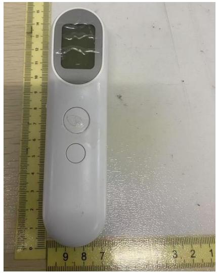

natural_image

White handheld electronic device with a display and control buttons placed next to a yellow ruler for scale (no text or symbols visible)

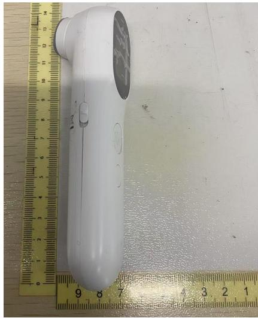

natural_image

White handheld electronic device placed on a wooden surface with yellow ruler for scale (no visible text or symbols)

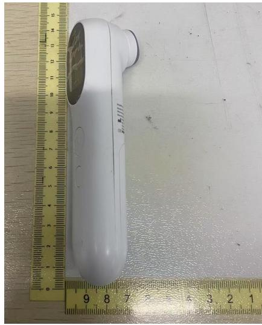

natural_image

White handheld electronic device placed on a wooden surface with a yellow ruler for scale (no visible text or symbols)

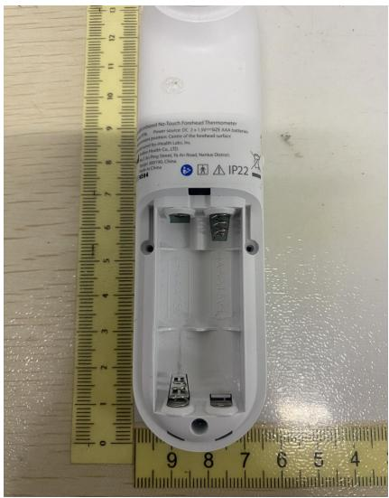

text_image

Standard No-Touch Powerhead Thermometer
Power source: DC 2.13V-50V AAA battery
Standard No-Touch Center of the Powerhead Surface
Standard No-Touch Ltrs, Inc.
IP22
IP22
9 8 7 6 5 4
9 8 7 6 5 4
10 9 8 7 6 5 4
11 10 9 8 7 6 5 4
12 11 10 9 8 7 6 5 4
13 12 11 10 9 8 7 6 5 4
14 15 14 13 12 11 10 9
15 16 15 14 13 12 11 10
16 17 16 15 14 13 12 11
17 18 17 16 15 14 13 12
18 19 20 21 22 23 24
19 20 21 22 23 24
20 21 22 23 24
21 22 23 24
22
IP22

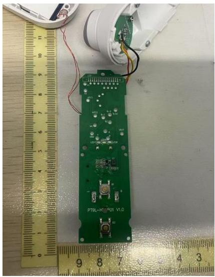

natural_image

Close-up of a green printed circuit board with visible components and wires, placed next to a ruler for scale (no text or symbols on the board itself)

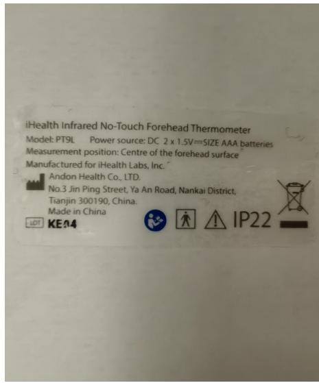

text_image

iHealth Infrared No-Touch Forehead Thermometer
Model: PT9L Power source: DC 2 x 1.5V==SIZE AAA batteries
Measurement position: Centre of the forehead surface
Manufactured for iHealth Labs, Inc.
Andon Health Co., LTD.
No.3 Jin Ping Street, Ya An Road, Nankai District,
Tianjin 300190, China.
Made in China
LEDT KE44 IP22

<table><tr><td colspan="4">IEC 60601-1-11:2015 + A1:2020/EN 60601-1-11:2015 + A1:2021</td></tr><tr><td>Clause</td><td>Requirement + Test</td><td>Result - Remark</td><td>Verdict</td></tr><tr><td colspan="4"></td></tr><tr><td>4</td><td colspan="2">GENERAL REQUIREMENTS</td><td>P</td></tr><tr><td>4.1</td><td>Characteristics of supply mains specified in 4.10.2 of Part 1 applied, except me equipment or me systems intended for home healthcare environment complied with the following:</td><td></td><td>N/A</td></tr><tr><td></td><td>- Supply Mains in the home healthcare environment did not exceed 110 % or was not below 85 % of nominal voltage between any of the conductors of the system or between any of these conductors and earth (% V) :</td><td></td><td>N/A</td></tr><tr><td></td><td>- For me equipment or me systems intended to actively keep alive or resuscitate a patient, Supply Mains in the home healthcare environment did not exceed 110 % or was not below 80 % of nominal voltage between any of the conductors of the system or between any of these conductors and earth (% V :</td><td>Non-life-supporting me equipment</td><td>N/A</td></tr><tr><td></td><td>- Rated range of nominal voltage did include at least 12.4 V to 15.1 V for operation from a 12 V dc supply mains</td><td>No such supply mains</td><td>N/A</td></tr><tr><td></td><td>- Rated range of nominal voltage did include at least 24.8 V to 30.3 V for operation from a 12 V dc supply mains</td><td>See above</td><td>N/A</td></tr><tr><td></td><td>The equipment maintained basic safety and essential performance during and following a 30 s dip to 10 V from a 12 V dc supply mains</td><td>See above</td><td>N/A</td></tr><tr><td></td><td>The equipment maintained basic safety and essential performance during and following a 30 s dip to 20 V from a 24 V dc supply mains</td><td>See above</td><td>N/A</td></tr><tr><td>4.2.1</td><td colspan="2">Environmental conditions of transport and storage between uses</td><td>P</td></tr><tr><td></td><td>Me equipment, except stationary equipment, after being removed from its protective packaging, and subsequently between uses, operated within its specified normal use after transport or storage in the specified environmental conditions</td><td>-20°C~+55°C 15%RH ~95%RH</td><td>P</td></tr><tr><td></td><td>temperature range:-25 °C to +5 °C</td><td></td><td>P</td></tr><tr><td></td><td>temperature range:+5 °C to +35 °C at a non-condensing relative humidity up to 90 %</td><td></td><td>P</td></tr><tr><td></td><td>temperature range: &gt;35 °C to 70 °C at a water vapour pressure up to 50 hPa</td><td></td><td>P</td></tr><tr><td></td><td>For more restricted range of environmental transport and storage conditions between uses, the environmental conditions are specified</td><td></td><td>N/A</td></tr><tr><td></td><td>- Justified in the risk management file</td><td></td><td>N/A</td></tr><tr><td></td><td>- Marked on the me equipment</td><td></td><td>N/A</td></tr><tr><td></td><td>When not practicable, the more restricted range is disclosed in the instructions for use</td><td></td><td>N/A</td></tr><tr><td></td><td>- Marked on the carrying case when the instructions for use indicate the me equipment is intended to be transported or stored in a carrying case between uses</td><td>Not intended to be transported or stored in a carrying case between uses</td><td>N/A</td></tr><tr><td></td><td>Symbol 5.3.5 (ISO 7000-0534), 5.3.6 (ISO 7000-0533), or 5.3.7 (ISO 7000-0632) of ISO 15223-1:2012 used to mark temperature range</td><td>See above</td><td>N/A</td></tr><tr><td></td><td>Symbol 5.3.8 (ISO 7000-2620) of ISO 15223-1:2012 used to mark humidity range</td><td>See above</td><td>N/A</td></tr><tr><td></td><td>Symbol 5.3.9 (ISO 7000-2621) of ISO 15223-1:2012 used to mark atmospheric pressure range</td><td>See above</td><td>N/A</td></tr><tr><td></td><td>Where me equipment used different marking for conditions of transport and storage between uses, continuous operating conditions and transient operating conditions, markings accompanied by supplementary markings except where the respective applicability was obvious</td><td></td><td>N/A</td></tr><tr><td>4.2.2</td><td colspan="2">Environmental transport and storage test</td><td>P</td></tr><tr><td></td><td>a) Me equipment prepared for transportation or storage according to instructions for use</td><td>Removal of batteries</td><td>P</td></tr><tr><td></td><td>b) Me equipment exposed to its lowest specified environmental transport and storage conditions (temperature -4 °C) (°C) :</td><td>-20°C</td><td>P</td></tr><tr><td></td><td>- For at least 16 h or, ensure me equipment reached thermal stability for at least 2 h</td><td>2h</td><td>P</td></tr><tr><td></td><td>c) Then Me equipment exposed to 34 °C + 4 °C and 90% - 0% + 6% relative humidity until the test chamber reached equilibrium and held for at least 2 hours. The transition from low to high temperature was made slowly enough to provide a non-condensing environment.</td><td>34°C, 90%RH, 2h</td><td>P</td></tr><tr><td></td><td>d) Me equipment exposed to its highest specified environmental transport and storage conditions, not requiring a water vapour pressure greater than 50 hPa (temperature +4 °C); (°C, ± %):</td><td>55°C, 33%RH, 2h</td><td>P</td></tr><tr><td></td><td>- For at least 16 h or, ensured me equipment reached thermal stability for at least 2 h</td><td></td><td>P</td></tr><tr><td></td><td>e) At the end of this conditioning period, me equipment allowed to return and stabilize at the operating conditions of normal use</td><td></td><td>P</td></tr><tr><td></td><td>f) Me equipment evaluated to its specifications and ensured it provides basic safety and essential performance</td><td>Provide basic safety and essential performance</td><td>P</td></tr><tr><td>4.2.3.1</td><td colspan="2">Environmental operating conditions - Continuous operating conditions</td><td>P</td></tr><tr><td></td><td>Instructions for use indicated permissible environmental operating conditions of the me equipment</td><td>10°C-40°C, 15%RH~90%RH, 700hPa-1060hPa Described in the “Product specifications” of User's Manual.</td><td>P</td></tr><tr><td></td><td>Me equipment complied with its specifications and all requirements of the standard when operated in normal use within temperature + 5 °C to +40 °C,</td><td></td><td>P</td></tr><tr><td></td><td>Relative humidity range of 15 % to 90%, non-condensing, but not requiring a water vapour partial pressure greater than 50 hPa; and</td><td></td><td>P</td></tr><tr><td></td><td>An atmospheric pressure range of 700 hPa to 1060 hPa</td><td></td><td>P</td></tr><tr><td></td><td>For more restricted range of environmental operating conditions</td><td>10°C-40°C</td><td>P</td></tr><tr><td></td><td>- justified in the risk management file;</td><td></td><td>P</td></tr><tr><td></td><td>-marked on the equipment; or were nor practical in the instructions for use......:</td><td>Described in the “Product specifications” of User's Manual.</td><td>N/A</td></tr><tr><td></td><td>- Marked on the carrying case when the instructions for use indicate the me equipment is intended to be operated in a carrying case</td><td>Not intended to be operated in a carrying case</td><td>N/A</td></tr><tr><td></td><td>Symbol 5.3.5 (ISO 7000-0534), 5.3.6 (ISO 7000-0533), or 5.3.7 (ISO 7000-0632) of ISO 15223-1:2012 used to mark temperature range</td><td></td><td>N/A</td></tr><tr><td></td><td>Symbol 5.3.8 (ISO 7000-2620) of ISO 15223-1:2012 used to mark humidity range</td><td></td><td>N/A</td></tr><tr><td></td><td>Symbol 5.3.9 (ISO 7000-2621) of ISO 15223-1:2012 used to mark atmospheric pressure range</td><td></td><td>N/A</td></tr><tr><td></td><td>Where me equipment used different marking for conditions of continuous operating conditions and transient operating conditions, markings accompanied by supplementary markings</td><td></td><td>N/A</td></tr><tr><td></td><td colspan="2">Environmental operating conditions test</td><td>P</td></tr><tr><td></td><td>a) Me equipment was set up for operation according to intended use</td><td></td><td>P</td></tr><tr><td></td><td>b) Me equipment exposed to 20 °C + 4 °C for at least 6 h or, ensured me equipment reached thermal stability for at least 2 h, (h) :</td><td>22°C 6h</td><td>P</td></tr><tr><td></td><td>c) Me equipment evaluated to its specifications and ensured it continued to provide basic safety and essential performance</td><td>Provide BS and EP</td><td>P</td></tr><tr><td></td><td>d) Me equipment evaluated to its specifications and ensured it continued to provide basic safety and essential performance while at the lowest specified atmospheric pressure.</td><td>Provide BS and EP</td><td>P</td></tr><tr><td></td><td>e) Me equipment evaluated to its specifications and ensured it continued to provide basic safety and essential performance while at the highest specified atmospheric pressure.</td><td>Provide BS and EP</td><td>P</td></tr><tr><td></td><td>f) Pressure in chamber relieved</td><td></td><td>P</td></tr><tr><td></td><td>g) me equipment cooled to its lowest specified environmental operating conditionsh) Me equipment held at lowest specified environmental operating conditions for at least 6 h or, ensured the me equipment reached thermal stability for at least 2 h :</td><td>10°C,15%RH</td><td>PP</td></tr><tr><td></td><td>i) Me equipment met its specifications and basic safety and essential performance</td><td>Provide BS and EP</td><td>P</td></tr><tr><td></td><td>j) me equipment warmed to its highest specified continuous environmental operating conditions</td><td>40°C, 95%RH</td><td>P</td></tr><tr><td></td><td>k) Me equipment held the conditions of j) for at least 6 h or, ensured the me equipment reached thermal stability for at least 2 h :</td><td>2h</td><td>P</td></tr><tr><td></td><td>l) Me equipment met its specifications and basic safety and essential performance</td><td>Provide BS and EP</td><td>P</td></tr><tr><td>4.2.3.2</td><td colspan="2">Environmental shock to transit-operable equipment</td><td>N/A</td></tr><tr><td></td><td>Transit-operable equipment with a stated wider range of continuous environmental operation conditions maintained basic safety and essential performance in the presence of condensation and thermal shock from rapid changes in environmental temperature and humidity during intended use when test in accordance with 4.2.3.2 a)-j).</td><td>No Transit-operable me equipment</td><td>N/A</td></tr><tr><td>5</td><td colspan="2">GENERAL REQUIREMENTS FOR TESTING ME EQUIPMENT</td><td>P</td></tr><tr><td></td><td colspan="2">In addition to the requirements of 5.9.2.1 of with IEC 60601-1 standard, accessibility determined as indicated below:</td><td>P</td></tr><tr><td></td><td>Accessible parts of me equipment identified by inspection and, when necessary, by testing</td><td></td><td>P</td></tr><tr><td></td><td>When in doubt, an accessible part of me equipment determined by a test with the small finger probe of Fig 1, applied in a bent or straight position as follows:</td><td></td><td>P</td></tr><tr><td></td><td>- for all positions of the me equipment operating in normal use</td><td></td><td>P</td></tr><tr><td></td><td>- after opening access covers and removal of parts, including lamps, fuses, and fuse holders when:</td><td>No such parts</td><td>N/A</td></tr><tr><td></td><td>i) the access covers could be opened without the use of a tool, or</td><td>No access covers</td><td>N/A</td></tr><tr><td></td><td>ii) the instructions for use instructed a lay operator to open the relevant access cover</td><td>See above</td><td>N/A</td></tr><tr><td>6</td><td colspan="2">CLASSIFICATION OF ME EQUIPMENT AND ME SYSTEMS</td><td>P</td></tr><tr><td></td><td>Me equipment intended for home healthcare environment classified as follows, except for permanently installed equipment and as required by Part 1, Sub-clause 6.2:</td><td>No permanently installed equipment</td><td>P</td></tr><tr><td></td><td>- class II or internally powered :</td><td>class II and internally powered</td><td>P</td></tr><tr><td></td><td>- Not provided with a functional earth terminal</td><td>No functional earth terminal</td><td>P</td></tr><tr><td></td><td>- When equipped with applied parts, they are type bf or cf :</td><td>Type BF applied part</td><td>P</td></tr><tr><td>7</td><td colspan="2">ME EQUIPMENT IDENTIFICATION, MARKING AND DOCUMENTS</td><td>P</td></tr><tr><td colspan="4"></td></tr><tr><td>7.1</td><td>Usability of identification, marking, and accompanying documents intended for lay operator or lay responsible organization evaluated by an operator whose profile included minimum eight years of education</td><td>Usability was evaluated in the Usability test report</td><td>P</td></tr><tr><td></td><td>Me equipment and me systems intended for home healthcare environment are simple to use and do not require referencing complex accompanying documents :</td><td>See above</td><td>P</td></tr><tr><td>7.2</td><td>In addition to requirements of 7.2.9 of the general standard, the carrying case provided some or all of the ingress protection against water or particulate matter, The enclosure is marked with the SAFETY SIGN ISO 7010-W001 and “keep dry” or :</td><td>the carrying case do not provided the ingress protection against water or particulate matter</td><td>N/A</td></tr><tr><td></td><td>Symbol ISO 15223-1:2012, 5.3.4 (ISO 7000-0626)</td><td></td><td>N/A</td></tr><tr><td></td><td>A carrying case marked with degree of protection</td><td></td><td>N/A</td></tr><tr><td></td><td>Carrying case inspected, and tests and criteria of 7.1.2 and 7.1.3 of Part 1 applied :</td><td></td><td>N/A</td></tr><tr><td>7.3</td><td colspan="2">accompanying documents</td><td>P</td></tr><tr><td>7.3.1</td><td>accompanying documents indicate the lay operator or lay responsible organization should contact the manufacturer or manufacturer's representative on the following issues:</td><td></td><td>P</td></tr><tr><td></td><td>- Assistance in setting up, using, or maintaining the me equipment or me system when needed, or</td><td>Described in chapter "MANUFACTURE INFORMATION" of operation guide</td><td>P</td></tr><tr><td></td><td>- To report unexpected operation or events</td><td>Described in chapter "TROUBLESHOOTING" of operation guide</td><td>P</td></tr><tr><td></td><td>accompanying documents include a postal address and either a phone number or web address for the lay operator or lay responsible organization to contact the manufacturer or manufacturer's representative</td><td>Described in chapter "MANUFACTURE INFORMATION" of operation guide</td><td>P</td></tr><tr><td>7.3.2</td><td>accompanying documents include necessary details for healthcare professional to brief the lay operator or lay responsible organization on any known contraindication(s) to the use of me equipment or me system and any precautions to be taken, including the following:</td><td></td><td>P</td></tr><tr><td></td><td>- Precautions to be taken in the event of changes in the performance of me equipment or me system</td><td>Described in chapter "MAINTENANCE" of operation guide</td><td>P</td></tr><tr><td></td><td>- Precautions to be taken regarding the exposure of the me equipment or me system to reasonably foreseeable environmental conditions</td><td>Described in chapter "NOTICE" of operation guide</td><td>P</td></tr><tr><td></td><td>- Adequate information regarding medicinal substances that me equipment is designed to administer, including any limitations in the choice of substances to be delivered as indicated below:</td><td>Not intended to administer substances</td><td>N/A</td></tr><tr><td></td><td>- Information on any medicinal substances or human blood derivatives incorporated into the me equipment or accessories as an integral part; and</td><td>See above</td><td>N/A</td></tr><tr><td></td><td>- The degree of accuracy claimed for me equipment with a measuring function</td><td>Described in chapter “SPECIFICATIONS” of operation guide</td><td>P</td></tr><tr><td>7.4</td><td colspan="2">Instructions for use</td><td>P</td></tr><tr><td>7.4.1</td><td>Nature of the hazard, likely consequences that could occur if the advice is not followed, and precautions for reducing the risk described in instructions for use corresponding to each warning and SAFETY SIGN :</td><td></td><td>P</td></tr><tr><td></td><td colspan="2">The instructions for use address the following issues, as applicable:</td><td>P</td></tr><tr><td></td><td>- Strangulation due to cables and hoses, particularly due to excessive length</td><td></td><td>N/A</td></tr><tr><td></td><td>- Inhalation or swallowing of small parts</td><td></td><td>P</td></tr><tr><td></td><td>- Potential allergic reactions to accessible materials used in the me equipment</td><td></td><td>P</td></tr><tr><td></td><td>- Contact injuries</td><td></td><td>P</td></tr><tr><td></td><td>The instructions for use include warnings to the effect that the following actions could be unsafe as applicable:</td><td></td><td>P</td></tr><tr><td></td><td>- Use of accessories, detachable parts, and materials not described in the instructions for use (see 7.9.2.14 of Part 1)</td><td>Described in chapter “NOTICE” of operation guide</td><td>P</td></tr><tr><td></td><td>- Interconnection of this equipment to other equipment not described in the instructions for use (see 16.2 c) indent 9) of Part 1)</td><td></td><td>N/A</td></tr><tr><td></td><td>- Modification of the equipment</td><td>Described in chapter “NOTICE” of operation guide</td><td>P</td></tr><tr><td></td><td>- Use of the me equipment outside its carrying case when some part of the protection required by this standard is provided by that carrying case (see 8.3.1 and 10.1)</td><td></td><td>N/A</td></tr><tr><td>7.4.2</td><td>When basic safety or essential performance dependents on the internal electrical power source, the instructions for use describes the following:</td><td></td><td>P</td></tr><tr><td></td><td>- Typical operation time or number of procedures :</td><td>Described in chapter “1. BATTERY LOADING” of operation guide</td><td>P</td></tr><tr><td></td><td>- Typical service life of the internal electrical power source; and :</td><td>DDescribed in chapter “1. BATTERY LOADING” of operation guide</td><td>P</td></tr><tr><td></td><td>- Behaviour of me equipment while the rechargeable internal electrical power source is charging :</td><td>No rechargeable INTERNAL ELECTRICAL POWER SOURCE</td><td>N/A</td></tr><tr><td>7.4.3</td><td>Instructions for use for me equipment intended for use by a lay operator include easily understood diagrams, illustrations, or photographs of the fully assembled and ready-to-operate me equipment including all controls, visual information signals, and indicators provided (see 7.1)</td><td>Described in chapter “SETUP AND OPERATING PROCEDURES” of operation guide</td><td>P</td></tr><tr><td>7.4.4</td><td colspan="2">Additional requirements for me equipment start-up procedure:</td><td>P</td></tr><tr><td></td><td>- Easily understood diagrams, illustrations, or photographs showing proper connection of the patient to the me equipment, accessories and other equipment (see 7.1)</td><td>Described in chapter “SETUP AND OPERATING PROCEDURES” of operation guide</td><td>P</td></tr><tr><td></td><td>- the time from switching “on” until the me equipment is ready for normal use, when it exceeds 15 s (see 15.4.4 of Part 1) (s) :</td><td></td><td>N/A</td></tr><tr><td></td><td>-the time required for me equipment to warm from the minimum storage temperature between uses until it is ready for intended use; and :</td><td>Described in chapter “MAINTENANCE” of operation guide</td><td>P</td></tr><tr><td></td><td>-the time required for me equipment to cool from the maximum storage temperature between uses until it is ready for intended use; and :</td><td>Described in chapter “MAINTENANCE” of operation guide</td><td>P</td></tr><tr><td>7.4.5</td><td>Instructions for use for me equipment intended for use by a lay operator include a description of generally known conditions in the home healthcare environment that can unacceptably affect the basic safety and essential performance of the me equipment</td><td></td><td>P</td></tr><tr><td></td><td>The steps that can be taken by the lay operator to identify and resolve the above conditions</td><td></td><td>P</td></tr><tr><td></td><td colspan="2">At least the following issues are also included as applicable</td><td>P</td></tr><tr><td></td><td>- The effects of lint, dust, light (including sunlight), etc.</td><td>Described in chapter “MAINTENANCE” of operation guide</td><td>P</td></tr><tr><td></td><td>- A list of known devices or other sources that can potentially cause interference problems</td><td>Described in chapter “NOTICE” of operation guide</td><td>P</td></tr><tr><td></td><td>- The effects of degraded sensors and electrodes, or loosened electrodes, that can degrade performance or cause other problems</td><td>Described in chapter “MAINTENANCE” of operation guide</td><td>P</td></tr><tr><td></td><td>- The effects caused by pets, pests or children</td><td>Described in chapter “NOTICE” of operation guide</td><td>P</td></tr><tr><td></td><td>The instructions for use explain the meaning of the IP classification marked on the me equipment, and on any carrying case provided with the me equipment as applicable</td><td></td><td>N/A</td></tr><tr><td>7.4.6</td><td>Instructions for use include a troubleshooting guide for use when there are indications of a me equipment malfunction during start-up or operation</td><td>Described in chapter “TROUBLESHOOTING” of operation guide</td><td>P</td></tr><tr><td></td><td>Troubleshooting guide discloses the necessary steps in the event of an technical alarm condition</td><td>See above</td><td>P</td></tr><tr><td>7.4.7</td><td>Instructions for use for me equipment, me systems, parts, and accessories for other than single use that can be contaminated by contact with patient, body fluids, or expired gases, during intended use, indicate the following:</td><td></td><td>P</td></tr><tr><td></td><td>- Frequency of cleaning, cleaning and disinfection, or cleaning and sterilization, as appropriate, for me equipment, me systems, parts, and accessories used on the same patient including rinsing methods, drying, handling, and storage between uses (see 8.1 and 8.2); and</td><td>Described in chapter “MAINTENANCE” of operation guide</td><td>P</td></tr><tr><td></td><td>- It is necessary to clean and disinfect, clean and sterilize the me equipment, me systems, parts, and accessories for multiple patient use between uses on different patients, including rinsing methods, drying, handling, and storage until re-use (see 8.1 and 8.2), or</td><td></td><td>N/A</td></tr><tr><td></td><td>- Me equipment, me systems and accessories require professional hygienic maintenance prior to re-use and provide contact details for the source of these services (see 7.5.2)</td><td>No professional hygienic maintenance is required.</td><td>N/A</td></tr><tr><td>7.4.8</td><td colspan="2">Instructions for use include:</td><td>P</td></tr><tr><td></td><td>- Expected service life of the me equipment :</td><td>Described in chapter “MAINTENANCE” of operation guide</td><td>P</td></tr><tr><td></td><td>- expected service life of parts and accessories shipped with the me equipment :</td><td></td><td>N/A</td></tr><tr><td></td><td>- shelf life of parts and accessories shipped with me equipment when shelf life is less than the expected service life :</td><td></td><td>N/A</td></tr><tr><td>7.4.9</td><td colspan="2">Instructions for use include:</td><td>P</td></tr><tr><td></td><td>- A statement indicating the lay responsible organization must contact its local authorities to determine the proper method of disposal of potentially bio hazardous parts and accessories, as applicable</td><td>Described in chapter “MAINTENANCE” of operation guide</td><td>P</td></tr><tr><td>7.4.10</td><td>Instructions for use includes the recommended placement of the remote parts of the distributed alarm system, when applicable, to ensure the operator can be notified at all times by an appropriate element of distributed alarm system within its specified range</td><td></td><td>N/A</td></tr><tr><td>7.5</td><td colspan="2">Technical description</td><td>N/A</td></tr><tr><td>7.5.1</td><td>The technical description for permanently installed class I me equipment includes:</td><td>Not class I me equipment</td><td>N/A</td></tr><tr><td></td><td>- A warning indicating the me equipment installation, including a correct protective earth connection, must only be carried out by qualified service personnel</td><td>See above</td><td>N/A</td></tr><tr><td></td><td>- Specifications of the permanently installed protective earth conductor</td><td>See above</td><td>N/A</td></tr><tr><td></td><td>- A warning to verify the integrity of the external protective earthing system</td><td>See above</td><td>N/A</td></tr><tr><td></td><td>- A warning to connect and verify that the protective earth terminal of the permanently installed me equipment is connected to the external protective earthing system</td><td>See above</td><td>N/A</td></tr><tr><td>7.5.2</td><td>Technical description includes methods for cleaning and disinfection or cleaning and sterilization for me equipment and accessories requiring professional hygienic maintenance prior to reuse (see 7.4.7):</td><td>Not require professional hygienic maintenance</td><td>N/A</td></tr><tr><td></td><td>- Before and after any type of service procedure</td><td>See above</td><td>N/A</td></tr><tr><td></td><td>- When the me equipment is transferred to another patient</td><td>See above</td><td>N/A</td></tr><tr><td>8</td><td colspan="2">PROTECTION AGAINST EXCESSIVE TEMPERATURES AND OTHER HAZARDS</td><td>P</td></tr><tr><td>8.1</td><td>A lay operator in the home healthcare environment can perform the cleaning or cleaning and disinfection processes when intended (see 7.4.7)</td><td>Usability was evaluated in the Usability test report</td><td>P</td></tr><tr><td></td><td>Usability of each such process pertaining to a lay operator was investigated by the usability engineering process :</td><td>See usability engineering file</td><td>P</td></tr><tr><td>8.2</td><td>A lay operator in the home healthcare environment can perform the cleaning and sterilization processes when intended (see 7.4.7)</td><td>No sterilization</td><td>N/A</td></tr><tr><td></td><td>Usability of each such process pertaining to a lay operator was investigated by the usability engineering process</td><td>See above</td><td>N/A</td></tr><tr><td>8.3</td><td colspan="2">Additional requirements for ingress of water or particulate matter into me equipment and me systems</td><td>P</td></tr><tr><td>8.3.1</td><td>Transit-operable, handheld, and body-worn me equipment maintained basic safety and essential performance after undergoing the test of IEC 60529 for at least IP 22 :</td><td>portable me equipment</td><td>N/A</td></tr><tr><td></td><td>All other me equipment maintained basic safety and essential performance after undergoing the test of IEC 60529 for at least IP21 :</td><td>IP 22</td><td>P</td></tr><tr><td></td><td>For portable me equipment intended to be used only while in a carrying case, IP21 met with the me equipment in its the carrying case</td><td>Not intended to be used only while in a carrying case</td><td>N/A</td></tr><tr><td></td><td>If some or all of the protection against the ingress of water or particulate matter is provided by a carrying case, then the ME EQUIPMENT shall be tested while inside the carrying case.</td><td>Not intended to be used only while in a carrying case</td><td>N/A</td></tr><tr><td></td><td>Maintenance of basic safety and essential performance verified</td><td>Provide BS and EP</td><td>P</td></tr><tr><td>8.3.2</td><td>Enclosures of the non-me equipment parts of the me systems provide the degree of protection against harmful ingress of water or particulate matter equivalent to equipment complying with their respective IEC or ISO safety standardsTests of IEC 60529:1989 conducted with the equipment placed in the least favourable position of normal use and the enclosures inspected</td><td>Not systemSee above</td><td>N/AN/A</td></tr><tr><td>8.4</td><td colspan="2">Additional requirements for interruption of the power supply/supply mains to me equipment and me system</td><td>N/A</td></tr><tr><td></td><td>me equipment or me system with essential performance intended to actively keep alive or resuscitate a patient maintained its essential performance for a sufficient time or for a sufficient number of procedures when loss or failure of supply mains or near depletion internal electrical power source occurred</td><td>Not life supporting me equipment or me system</td><td>N/A</td></tr><tr><td></td><td>The time or number of procedures remaining allowed alternative life-supporting methods to be employed</td><td>See above</td><td>N/A</td></tr><tr><td></td><td>Optionally, an internal electrical power source was used to maintain essential performance :</td><td>See above</td><td>N/A</td></tr><tr><td></td><td>Optionally, independent means were used to provide essential performance :</td><td>See above</td><td>N/A</td></tr><tr><td></td><td>Instructions for use disclose the time or number of procedures available following a loss or failure of the supply mains or near depletion of the internal electrical power source</td><td>See above</td><td>N/A</td></tr><tr><td></td><td>Instructions for use describes the alternative life-supporting methods to be employed</td><td>See above</td><td>N/A</td></tr><tr><td></td><td>The technical description describes methods that can be employed for longer periods</td><td>See above</td><td>N/A</td></tr><tr><td></td><td>me equipment or me system with essential performance intended to actively keep alive or resuscitate a patient with no internal electrical power source is equipped with an alarm system that includes at least a medium priority alarm condition indicating power failure :</td><td>See above</td><td>N/A</td></tr><tr><td></td><td>me equipment or me system with essential performance intended to actively keep alive or resuscitate a patient with an internal electrical power source is equipped with an automatic switchover to internal electrical power source</td><td>See above</td><td>N/A</td></tr><tr><td></td><td>me equipment or me system with essential performance intended to actively keep alive or resuscitate a patient with an internal electrical power source is equipped with an alarm system that includes at least a medium priority technical alarm condition indicating the internal electrical power source is nearing insufficient remaining power for operation</td><td>See above</td><td>N/A</td></tr><tr><td></td><td>Technical alarm condition provides sufficient time or sufficient number of procedures for a lay operator to act</td><td>See above</td><td>N/A</td></tr><tr><td></td><td>A technical alarm condition of at least low priority remained active until the internal electrical power source returned to a level above the alarm limit or until depleted</td><td>See above</td><td>N/A</td></tr><tr><td colspan="4"></td></tr><tr><td></td><td>It was not possible to inactivate the visual alarm signal of this technical alarm condition</td><td>See above</td><td>N/A</td></tr><tr><td></td><td>Functional tests conducted, and the risk management file inspected :</td><td>See above</td><td>N/A</td></tr><tr><td>8.5</td><td colspan="2">Additional requirements for an internal electrical power source</td><td>P</td></tr><tr><td>8.5.1</td><td>me equipment provided with a means for the operator to determine state of the internal electrical power source when the is essential for basic safety or essential performance or to control risks associated with loss of essential performance</td><td>Indicate in the LCD</td><td>P</td></tr><tr><td></td><td>State of internal electrical power source indicated by:</td><td>See below</td><td>N/A</td></tr><tr><td></td><td>- number of procedures remaining;</td><td>No number of procedures remaining</td><td>N/A</td></tr><tr><td></td><td>-remaining operating time;</td><td>No remaining operating time</td><td>N/A</td></tr><tr><td></td><td>-percentage of the remaining operating time or energy; or</td><td></td><td>P</td></tr><tr><td></td><td>- “fuel” gauge</td><td></td><td>N/A</td></tr><tr><td></td><td>Instructions described method to determine state of internal electrical power source</td><td>Described in chapter “BATTERY LOADING AND AC ADAPTER LOADING” of operation guide</td><td>P</td></tr><tr><td>8.5.2</td><td>Means, other than labelling, provided to prevent risk of swallowing coin/button cells</td><td>No use swallowing coin/button cells</td><td>N/A</td></tr><tr><td></td><td>Replacement of button cell require use of tool</td><td>See above</td><td>N/A</td></tr><tr><td>8.5.3</td><td colspan="2">Additional requirements for separation of parts</td><td>N/A</td></tr><tr><td></td><td>For ME EQUIPMENT or ME SYSTEM with an INTERNAL ELECTRICAL POWER SOURCE, if simultaneous connection of the ME EQUIPMENT to the PATIENT and the SUPPLY MAINS is possible, then APPLIED PARTS and parts that are likely to come into contact with the PATIENT shall have two MOPP from the SUPPLY MAINS.</td><td></td><td>N/A</td></tr><tr><td></td><td>However, parts which the PATIENT intentionally handles as the intended OPERATOR according to 7.9.2.1 of IEC 60601-1:2005 and IEC 60601-1:2005/AMD1:2012 + IEC 60601-1:2005/AMD2:2020 (e.g. touch keys, ENCLOSURE) while the ME EQUIPMENT is not being used for its intended medical function may be insulated with two MOOP from SUPPLY MAINS.</td><td></td><td>N/A</td></tr><tr><td>9</td><td colspan="2">ACCURACY OF CONTROLS AND INSTRUMENTS AND PROTECTION AGAINST HAZARDOUS OUTPUTS</td><td>P</td></tr><tr><td></td><td colspan="2">The risks associated with usability in the home healthcare environment for operator profiles including a lay operator when performing the usability engineering process include at least the following considerations:</td><td>P</td></tr><tr><td></td><td>- changes of controls</td><td>Usability was evaluated in the Usability test report</td><td>P</td></tr><tr><td></td><td>- unexpected movement</td><td></td><td>N/A</td></tr><tr><td></td><td>- potential for misconnection</td><td></td><td>N/A</td></tr><tr><td></td><td>- potential for improper operation, or unsafe use</td><td></td><td>P</td></tr><tr><td></td><td>- potential for confusion as to current operational mode</td><td></td><td>N/A</td></tr><tr><td></td><td>- change in the transfer of energy or substance</td><td></td><td>N/A</td></tr><tr><td></td><td>- exposure to environmental conditions specified in this standard</td><td></td><td>P</td></tr><tr><td></td><td>- exposure to biological materials, and</td><td>No biological materials</td><td>N/A</td></tr><tr><td></td><td>- small parts being inhaled or swallowed</td><td></td><td>N/A</td></tr><tr><td></td><td>Particular emphasis placed on the limited training of a lay operator with respect to the ability to intervene and maintain basic safety and essential performance.</td><td></td><td>P</td></tr><tr><td></td><td>The manufacturer's usability engineering process included the least capable intended lay operator or lay responsible organization</td><td>Usability was evaluated in the Usability test report</td><td>P</td></tr><tr><td></td><td>Usability engineering file inspected for compliance :</td><td>Usability test report</td><td>P</td></tr><tr><td>10</td><td colspan="2">CONSTRUCTION OF ME EQUIPMENT</td><td>P</td></tr><tr><td>10.1</td><td colspan="2">Additional requirements for mechanical strength</td><td>P</td></tr><tr><td>10.1.1</td><td>Additions to Table 28 Mechanical strength test of the base standard, conducted as indicated in Table 1, Mechanical strength test applicability, non-transit-operable, and Table 2, Mechanical strength test applicability, transit-operable</td><td></td><td>P</td></tr><tr><td>10.1.2</td><td>Me equipment, its parts, and mounting accessories, intended for non-transit-operable use displayed adequate mechanical strength when subjected to mechanical stress caused by normal use, including pushing, impact, dropping and rough handling (not applicable to fixed and stationary me equipment)</td><td>See Appended Table 10.1.2</td><td>P</td></tr><tr><td></td><td colspan="2">Me equipment maintained basic safety and essential performance after mechanical tests</td><td>P</td></tr><tr><td></td><td>Operator-re-settable protective devices that can be reset without the use of a tool were, optionally, reset prior to the evaluation of basic safety and essential performance</td><td></td><td>N/A</td></tr><tr><td></td><td>a) Shock tests conducted in accordance with IEC 60068-2-27:2008 :</td><td>See Appended Table 10.1.2a</td><td>P</td></tr><tr><td></td><td>b) Broad-band random vibration tests conducted in accordance with IEC 60068-2-64:2008, using the following conditions :</td><td>See Appended Table 10.1.2b</td><td>P</td></tr><tr><td>10.1.3</td><td>Me equipment, parts, and mounting accessories for transit-operable use displayed adequate mechanical strength when subjected to pushing, impact, dropping, rough handling, and rigorous conditions of patient movement in normal use as well as transportation by trolleys, carts, road vehicles, trains, ships, and aircraft</td><td>Not transit-operable equipment</td><td>N/A</td></tr><tr><td></td><td>Me equipment maintained basic safety and essential performance after the following tests:</td><td>See above</td><td>N/A</td></tr><tr><td></td><td>a) Shock tests conducted on other than hand-held me equipment, parts, and mounting accessories in accordance with IEC 60068-2-27:2008</td><td>See above</td><td>N/A</td></tr><tr><td></td><td>1) Test type: Type 1 :</td><td>See above</td><td>N/A</td></tr><tr><td></td><td>2) Test type: Type 2 :</td><td>See above</td><td>N/A</td></tr><tr><td></td><td>b) Shock tests conducted on hand-held me equipment, parts, and mounting accessories in accordance with IEC 60068-2-27:2008</td><td>See above</td><td>N/A</td></tr><tr><td></td><td>1) Test type: Type 1 :</td><td>See above</td><td>N/A</td></tr><tr><td></td><td>2) Test type: Type 2 :</td><td>See above</td><td>N/A</td></tr><tr><td></td><td>c) Broad-band random vibration test conducted on me equipment, parts, and mounting accessories in accordance with IEC 60068-2-64:2008 :</td><td>See above</td><td>N/A</td></tr><tr><td></td><td>d) Free fall tests conducted on portable and mobile me equipment, parts, and mounting accessories per IEC 60068-2-31:2008, using procedure 1 :</td><td>See above</td><td>N/A</td></tr><tr><td></td><td>Basic safety and essential performance were maintained</td><td>See above</td><td>N/A</td></tr><tr><td>10.2</td><td>Controls of me equipment intended for use by a lay operatory that can affect basic safety or essential performance protected from accidental or unauthorized changes or adjustments</td><td>No controls</td><td>N/A</td></tr><tr><td></td><td>Operator-adjustable controls used for calibration include a means to prevent unintentional changes from the intended position</td><td>See above</td><td>N/A</td></tr><tr><td>11</td><td colspan="2">PROTECTION AGAINST STRANGULATION OR ASPHYXIATION</td><td>N/A</td></tr><tr><td></td><td>Means provided to control the risk of strangulation and asphyxiation of the patient and others to an acceptable level</td><td></td><td>N/A</td></tr><tr><td></td><td>Equipment and risk management file inspected :</td><td></td><td>N/A</td></tr><tr><td>12</td><td colspan="2">ADDITIONAL REQUIREMENTS FOR ELECTROMAGNETIC EMISSIONS OF ME EQUIPMENT AND ME SYSTEMS</td><td>P</td></tr><tr><td></td><td>Me equipment and me systems intended for home healthcare environment are Class B according to CISPR 11:2009 :</td><td>Described in chapter “ELECTROMAGNETIC COMPATIBILITY INFORMATION” of operation guide</td><td>P</td></tr><tr><td colspan="4"></td></tr><tr><td>13</td><td colspan="2">ADDITIONAL REQUIREMENTS FOR ALARM SYSTEMS OF ME EQUIPMENT AND ME SYSTEMS</td><td>N/E</td></tr><tr><td>13.1</td><td>Each high priority and medium priority alarm condition causes generation of auditory alarm signals per IEC 60601-1-8:2006 and IEC 60601-1-8:2006/AMD1:2012, except when equipment is connected to a distributed alarm system intended for confirmed deliver of alarm conditions including the generation of auditory alarm signals per IEC 60601-1-8:2006 and IEC 60601-1-8:2006/AMD1:2012 :</td><td>See attached IEC 60601-1-8 Report</td><td>N/E</td></tr><tr><td>13.2</td><td>For me equipment and me systems intended to actively keep alive or resuscitate a patient, reducing the auditory alarm signal volume t below audible levels resulted in the following was not possible, except when the alarm system was connected to a distributed alarm system that included generation of auditory alarm signals per IEC 60601-1-8:2006 and IEC 60601-1-8:2006/AMD1:2012</td><td>See attached IEC 60601-1-8 Report</td><td>N/E</td></tr></table>

<table><tr><td>Clause of ISO 14971</td><td>Document Ref. in RMF (Document No. &amp; paragraph)</td><td>Result - Remarks</td><td>Verdict</td></tr><tr><td>5.2</td><td></td><td></td><td></td></tr><tr><td>5.3</td><td></td><td></td><td></td></tr><tr><td>5.4</td><td></td><td></td><td></td></tr><tr><td colspan="4">Supplementary information: No more restricted range</td></tr><tr><td>4.2.3.1</td><td colspan="2">RM RESULTS TABLE: Environmental operating conditions - Continuous operating conditions</td><td>N/A</td></tr><tr><td>Clause of ISO 14971</td><td>Document Ref. in RMF (Document No. &amp; paragraph)</td><td>Result - Remarks</td><td>Verdict</td></tr><tr><td>5.2</td><td></td><td></td><td></td></tr><tr><td>5.3</td><td></td><td></td><td></td></tr><tr><td>5.4</td><td></td><td></td><td></td></tr><tr><td colspan="4">Supplementary information: No more restricted range</td></tr></table>

<table><tr><td>7.4.1</td><td colspan="2">RM RESULTS TABLE: Additional requirements for warning and safety notices</td><td>P</td></tr><tr><td>Clause of ISO 14971</td><td>Document Ref. in RMF (Document No. &amp; paragraph)</td><td>Result - Remarks</td><td>Verdict</td></tr><tr><td>5.2</td><td>Risk Assessment Report DN: PT9L-FXPJ01 V1.0</td><td>All hazards associated with the device have been identified.</td><td>P</td></tr><tr><td>5.3</td><td>Risk Assessment Report DN: PT9L-FXPJ01 V1.0</td><td>All hazards associated with the device have been identified.</td><td>P</td></tr><tr><td>5.4</td><td>Risk Assessment Report DN: PT9L-FXPJ01 V1.0</td><td>Risks of each hazardous situation are estimated</td><td>P</td></tr><tr><td>6</td><td>Risk Assessment Report DN: PT9L-FXPJ01 V1.0</td><td>The risk acceptability for each hazardous situation has been estimated and documented</td><td>P</td></tr><tr><td>7.2</td><td>Risk Assessment Report DN: PT9L-FXPJ01 V1.0</td><td>Solutions for reduction of the unacceptable risk to acceptable levels, where required, have been implemented, taking into account the available options and their priority.</td><td>P</td></tr><tr><td colspan="4">IEC 60601-1-11:2015 + A1:2020/EN 60601-1-11:2015 + A1:2021</td></tr><tr><td>Clause</td><td>Requirement + Test</td><td>Result - Remark</td><td>Verdict</td></tr></table>

<table><tr><td>7.4.5</td><td colspan="2">RM RESULTS TABLE: : Additional requirements for operating instructions</td><td>P</td></tr><tr><td>Clause of ISO 14971</td><td>Document Ref. in RMF (Document No. &amp; paragraph)</td><td>Result - Remarks</td><td>Verdict</td></tr><tr><td>5.3</td><td>Risk Assessment Report DN: PT9L-FXPJ01 V1.0</td><td>All hazards associated with the device have been identified.</td><td>P</td></tr><tr><td>5.4</td><td>Risk Assessment Report DN: PT9L-FXPJ01 V1.0</td><td>Risks of each hazardous situation are estimated</td><td>P</td></tr><tr><td>6</td><td>Risk Assessment Report DN: PT9L-FXPJ01 V1.0</td><td>The risk acceptability for each hazardous situation has been estimated and documented</td><td>P</td></tr><tr><td>7.2</td><td>Risk Assessment Report DN: PT9L-FXPJ01 V1.0</td><td>Solutions for reduction of the unacceptable risk to acceptable levels, where required, have been implemented, taking into account the available options and their priority.</td><td>P</td></tr></table>

<table><tr><td>8.4</td><td colspan="2">RM RESULTS TABLE: Additional requirements for interruption of power supply / supply mains to ME Equipment and ME Systems</td><td>N/A</td></tr><tr><td>Clause of ISO 14971</td><td>Document Ref. in RMF (Document No. &amp; paragraph)</td><td>Result - Remarks</td><td>Verdict</td></tr><tr><td>5.2</td><td></td><td></td><td></td></tr><tr><td>5.3</td><td></td><td></td><td></td></tr><tr><td>5.4</td><td></td><td></td><td></td></tr><tr><td>6</td><td></td><td></td><td></td></tr><tr><td>7.2</td><td></td><td></td><td></td></tr><tr><td>7.3</td><td></td><td></td><td></td></tr><tr><td>7.4</td><td></td><td></td><td></td></tr><tr><td>7.6</td><td></td><td></td><td></td></tr><tr><td>7.7</td><td></td><td></td><td></td></tr><tr><td colspan="4">Supplementary information: Not life supporting me equipment or me system</td></tr></table>

<table><tr><td>10.1.2a</td><td colspan="2">TABLE: Shock test (IEC 60068-2-27:2008), using the following conditions*:</td><td>P</td></tr><tr><td></td><td>Peak acceleration :</td><td colspan="2">150 m/s2 (15 g)</td></tr><tr><td></td><td>Duration :</td><td colspan="2">11 ms</td></tr><tr><td></td><td>Pulse shape :</td><td colspan="2">half-sine</td></tr><tr><td></td><td>Number of shocks :</td><td colspan="2">3 shocks per direction per axis (18 total)</td></tr></table>

Report No.: ETX202303-07-078-02

<table><tr><td colspan="4">IEC 60601-1-11:2015 + A1:2020/EN 60601-1-11:2015 + A1:2021</td></tr><tr><td>Clause</td><td>Requirement + Test</td><td>Result - Remark</td><td>Verdict</td></tr></table>

<table><tr><td>Direction Shock Applied</td><td>Axis Shock Applied</td><td>Basic safety and essential performance maintained? Yes/No</td><td>Remarks</td></tr><tr><td>+</td><td>X</td><td>Yes</td><td>P</td></tr><tr><td>-</td><td>X</td><td>Yes</td><td>P</td></tr><tr><td>+</td><td>Y</td><td>Yes</td><td>P</td></tr><tr><td>-</td><td>Y</td><td>Yes</td><td>P</td></tr><tr><td>+</td><td>Z</td><td>Yes</td><td>P</td></tr><tr><td>-</td><td>Z</td><td>Yes</td><td>P</td></tr><tr><td colspan="4">Supplementary information:* (NOTE 1 This represents Class 7M1 as described in IEC TR 60721-4-7:2001 [6])</td></tr></table>

<table><tr><td>10.1.2b</td><td colspan="4">TABLE: Broad-band random vibration test (IEC 60068-2-64:2008) using the following conditions*:</td><td>P</td></tr><tr><td>1</td><td colspan="3">Acceleration amplitude :</td><td colspan="2">10 Hz to 100 Hz: 1,0 (m/s2)2/Hz</td></tr><tr><td>2</td><td colspan="3">Acceleration amplitude :</td><td colspan="2">100 Hz to 200 Hz: - 3 db per octave</td></tr><tr><td>3</td><td colspan="3">Acceleration amplitude :</td><td colspan="2">200 Hz to 2 000 Hz: 0,5 (m/s2)2/Hz</td></tr><tr><td></td><td colspan="3">Duration :</td><td colspan="2">30 min per perpendicular axis (3 total)</td></tr><tr><td colspan="2">Perpendicular axis subjected to broad-band random vibration test</td><td>Acceleration amplitude</td><td colspan="2">Basic safety and essential performance maintained? Yes/No</td><td>Remarks</td></tr><tr><td colspan="2">X</td><td>1</td><td colspan="2">Yes</td><td>P</td></tr><tr><td colspan="2">X</td><td>1</td><td colspan="2">Yes</td><td>P</td></tr><tr><td colspan="2">X</td><td>1</td><td colspan="2">Yes</td><td>P</td></tr><tr><td colspan="2">Y</td><td>2</td><td colspan="2">Yes</td><td>P</td></tr><tr><td colspan="2">Y</td><td>2</td><td colspan="2">Yes</td><td>P</td></tr><tr><td colspan="2">Y</td><td>2</td><td colspan="2">Yes</td><td>P</td></tr><tr><td colspan="2">Z</td><td>3</td><td colspan="2">Yes</td><td>P</td></tr><tr><td colspan="2">Z</td><td>3</td><td colspan="2">Yes</td><td>P</td></tr><tr><td colspan="2">Z</td><td>3</td><td colspan="2">Yes</td><td>P</td></tr><tr><td colspan="6">IEC 60601-1-11:2015 + A1:2020/EN 60601-1-11:2015 + A1:2021</td></tr><tr><td>Clause</td><td colspan="2">Requirement + Test</td><td>Result - Remark</td><td colspan="2">Verdict</td></tr><tr><td>10.1.3a1</td><td colspan="4">TABLE: Shock test (IEC 60068-2-27:2008) for other than hand-held equipment, parts, and mounting accessories under the following conditions (Test Type 1):</td><td>N/A</td></tr><tr><td></td><td colspan="2">Peak acceleration :</td><td colspan="3">150 m/s2 (15 g)</td></tr><tr><td></td><td colspan="2">Duration :</td><td colspan="3">11 ms</td></tr><tr><td></td><td colspan="2">Pulse shape :</td><td colspan="3">half-sine</td></tr><tr><td></td><td colspan="2">Number of shocks :</td><td colspan="3">3 shocks per direction per axis (18 total)</td></tr><tr><td colspan="2">Direction Shock Applied</td><td>Axis Shock Applied</td><td>Basic safety and essential performance maintained? Yes/No</td><td colspan="2">Remarks</td></tr><tr><td colspan="2"></td><td></td><td></td><td colspan="2"></td></tr><tr><td colspan="2"></td><td></td><td></td><td colspan="2"></td></tr><tr><td colspan="2"></td><td></td><td></td><td colspan="2"></td></tr><tr><td colspan="2"></td><td></td><td></td><td colspan="2"></td></tr><tr><td colspan="2"></td><td></td><td></td><td colspan="2"></td></tr><tr><td colspan="2"></td><td></td><td></td><td colspan="2"></td></tr><tr><td colspan="2"></td><td></td><td></td><td colspan="2"></td></tr><tr><td colspan="2"></td><td></td><td></td><td colspan="2"></td></tr><tr><td colspan="2"></td><td></td><td></td><td colspan="2"></td></tr><tr><td colspan="2"></td><td></td><td></td><td colspan="2"></td></tr><tr><td colspan="2"></td><td></td><td></td><td colspan="2"></td></tr><tr><td colspan="2"></td><td></td><td></td><td colspan="2"></td></tr><tr><td colspan="6">Supplementary information:* (NOTE 3 This represents Class 7M2 as described in IEC/TR 60721-4-7:2001 [6])</td></tr></table>

<table><tr><td>10.1.3a2</td><td colspan="4">TABLE: Shock test (IEC 60068-2-27:2008) on other than hand-held me equipment, parts, and mounting accessories under the following conditions (Test Type 2):</td><td>N/A</td></tr><tr><td></td><td colspan="3">Peak acceleration :</td><td colspan="2">300 m/s2 (15 g)</td></tr><tr><td></td><td colspan="3">Duration :</td><td colspan="2">6 ms</td></tr><tr><td></td><td colspan="3">Pulse shape :</td><td colspan="2">half-sine</td></tr><tr><td></td><td colspan="3">Number of shocks :</td><td colspan="2">3 shocks per direction per axis (18 total)</td></tr><tr><td>Direction Shock Applied</td><td>Shock Applied</td><td>Axis Shock Applied</td><td colspan="2">Basic safety and essential performance maintained? Yes/No</td><td>Remarks</td></tr><tr><td></td><td></td><td></td><td colspan="2"></td><td></td></tr><tr><td></td><td></td><td></td><td colspan="2"></td><td></td></tr><tr><td></td><td></td><td></td><td colspan="2"></td><td></td></tr><tr><td></td><td></td><td></td><td colspan="2"></td><td></td></tr><tr><td></td><td></td><td></td><td colspan="2"></td><td></td></tr><tr><td></td><td></td><td></td><td colspan="2"></td><td></td></tr><tr><td></td><td></td><td></td><td colspan="2"></td><td></td></tr><tr><td></td><td></td><td></td><td colspan="2"></td><td></td></tr></table>

<table><tr><td colspan="4">IEC 60601-1-11:2015 + A1:2020/EN 60601-1-11:2015 + A1:2021</td></tr><tr><td>Clause</td><td>Requirement + Test</td><td>Result - Remark</td><td>Verdict</td></tr></table>

<table><tr><td></td><td></td><td></td><td></td></tr><tr><td></td><td></td><td></td><td></td></tr><tr><td colspan="4">Supplementary information:</td></tr></table>

<table><tr><td>10.1.3b1</td><td colspan="3">TABLE: Shock test (IEC 60068-2-27:2008) on hand-held me equipment parts, and mounting accessories using the following conditions (Test Type 1):</td><td>N/A</td></tr><tr><td></td><td colspan="2">Peak acceleration :</td><td colspan="2">300 m/s2 (30 g)</td></tr><tr><td></td><td colspan="2">Duration :</td><td colspan="2">11 ms</td></tr><tr><td></td><td colspan="2">Pulse shape :</td><td colspan="2">half-sine</td></tr><tr><td></td><td colspan="2">Number of shocks :</td><td colspan="2">3 shocks per direction per axis (18 total)</td></tr><tr><td colspan="2">Direction Shock Applied</td><td>Axis Shock Applied</td><td>Basic safety and essential performance maintained? Yes/No</td><td>Remarks</td></tr><tr><td colspan="2"></td><td></td><td></td><td></td></tr><tr><td colspan="2"></td><td></td><td></td><td></td></tr><tr><td colspan="2"></td><td></td><td></td><td></td></tr><tr><td colspan="2"></td><td></td><td></td><td></td></tr><tr><td colspan="2"></td><td></td><td></td><td></td></tr><tr><td colspan="2"></td><td></td><td></td><td></td></tr><tr><td colspan="2"></td><td></td><td></td><td></td></tr><tr><td colspan="2"></td><td></td><td></td><td></td></tr><tr><td colspan="2"></td><td></td><td></td><td></td></tr><tr><td colspan="2"></td><td></td><td></td><td></td></tr><tr><td colspan="5">Supplementary information:* (NOTE 4 This represents Class 7M3 as described in IEC/TR 60721-4-7:2001. (Test Type 1)</td></tr></table>

<table><tr><td>10.1.3c</td><td colspan="4">TABLE: Broad-band random vibration test (IEC 60068-2-64:2008) on me equipment, parts, and mounting accessories using the following conditions*:</td><td>N/A</td></tr><tr><td>1</td><td colspan="3">Acceleration amplitude :</td><td colspan="2">10 Hz to 100 Hz: 1,0 (m/s2)2/Hz</td></tr><tr><td>2</td><td colspan="3">Acceleration amplitude :</td><td colspan="2">100 Hz to 200 Hz: - 3 db per octave</td></tr><tr><td>3</td><td colspan="3">Acceleration amplitude :</td><td colspan="2">200 Hz to 2 000 Hz: 0,5 (m/s2)2/Hz</td></tr><tr><td></td><td colspan="3">Duration :</td><td colspan="2">30 min per perpendicular axis (3 total)</td></tr><tr><td colspan="2">Perpendicular axis subjected to broad-band random vibration test</td><td>Acceleration amplitude</td><td colspan="2">Basic safety and essential performance maintained? Yes/No</td><td>Remarks</td></tr><tr><td colspan="2">1</td><td>1</td><td colspan="2"></td><td></td></tr><tr><td colspan="2">2</td><td>1</td><td colspan="2"></td><td></td></tr><tr><td colspan="2">3</td><td>1</td><td colspan="2"></td><td></td></tr><tr><td colspan="2">1</td><td>2</td><td colspan="2"></td><td></td></tr><tr><td colspan="2">2</td><td>2</td><td colspan="2"></td><td></td></tr><tr><td colspan="2">3</td><td>2</td><td colspan="2"></td><td></td></tr><tr><td colspan="2">1</td><td>3</td><td colspan="2"></td><td></td></tr><tr><td colspan="2">2</td><td>3</td><td colspan="2"></td><td></td></tr></table>

<table><tr><td colspan="4">IEC 60601-1-11:2015 + A1:2020/EN 60601-1-11:2015 + A1:2021</td></tr><tr><td>Clause</td><td>Requirement + Test</td><td>Result - Remark</td><td>Verdict</td></tr></table>

<table><tr><td>3</td><td>3</td><td></td><td></td></tr><tr><td colspan="4">Supplementary information:* (NOTE 5 This represents Class 7M1 and 7M2 as described in IEC/TR 60721-4-7:2001)</td></tr></table>

<table><tr><td>10.1.3d</td><td colspan="5">TABLE: Free fall test (IEC 60068-2-31:2008), using procedure 1, on portable and mobile me equipment, parts, and mounting accessories (with carrying case if intended), under the following conditions*:</td><td>N/A</td></tr><tr><td>1</td><td colspan="4">Fall height for mass ≤ 1 kg :</td><td colspan="2">0,25 m</td></tr><tr><td>2</td><td colspan="4">Fall height for mass &gt; 1 kg and ≤ 10 Kg :</td><td colspan="2">0,1 m</td></tr><tr><td>3</td><td colspan="4">Fall height for mass &gt; 10 kg and ≤ 50 Kg:</td><td colspan="2">0,05 m</td></tr><tr><td>4</td><td colspan="4">Fall height for mass &gt; 50 kg :</td><td colspan="2">0,01 m</td></tr><tr><td>Specified altitude (m)</td><td>Mass (Kg)</td><td>Fall No.</td><td colspan="3">basic safety and essential performance maintained? Yes/No</td><td>Remarks</td></tr><tr><td>0,25</td><td>≤ 1</td><td>1</td><td colspan="3"></td><td></td></tr><tr><td>0,25</td><td>≤ 1</td><td>2</td><td colspan="3"></td><td></td></tr><tr><td>0,1</td><td>&gt; 1 &amp; ≤ 10</td><td>1</td><td colspan="3"></td><td></td></tr><tr><td>0,1</td><td>&gt; 1 &amp; ≤ 10</td><td>2</td><td colspan="3"></td><td></td></tr><tr><td>0,05</td><td>&gt; 10 &amp; ≤ 50</td><td>1</td><td colspan="3"></td><td></td></tr><tr><td>0,05</td><td>&gt; 10 &amp; ≤ 50</td><td>2</td><td colspan="3"></td><td></td></tr><tr><td>0,01</td><td>&gt; 50</td><td>1</td><td colspan="3"></td><td></td></tr><tr><td>0,01</td><td>&gt; 50</td><td>2</td><td colspan="3"></td><td></td></tr><tr><td colspan="7">Supplementary information: (*NOTE 6 This represents Class 7M2 as described in IEC/TR 60721-4-7:2001)</td></tr></table>

<table><tr><td>11.0</td><td colspan="2">RM RESULTS TABLE: PROTECTION AGAINST STRANGULATION AND ASPHYXIATION</td><td>N/A</td></tr><tr><td>Clause of ISO 14971</td><td>Document Ref. in RMF (Document No. &amp; paragraph)</td><td>Result - Remarks</td><td>Verdict</td></tr><tr><td>4.3</td><td></td><td></td><td></td></tr><tr><td>4.4</td><td></td><td></td><td></td></tr><tr><td>5</td><td></td><td></td><td></td></tr><tr><td>6.2</td><td></td><td></td><td></td></tr><tr><td>6.3</td><td></td><td></td><td></td></tr><tr><td>6.4</td><td></td><td></td><td></td></tr><tr><td>6.5</td><td></td><td></td><td></td></tr><tr><td>6.6</td><td></td><td></td><td></td></tr><tr><td colspan="4">Supplementary information:</td></tr></table>

Report No.: ETX202303-07-078-02

<table><tr><td colspan="4">IEC 60601-1-11:2015 + A1:2020/EN 60601-1-11:2015 + A1:2021</td></tr><tr><td>Clause</td><td>Requirement + Test</td><td>Result - Remark</td><td>Verdict</td></tr></table>

ATTACHMENT 3：Photo Documentation

Sample：YP2407017 Lot: KE04

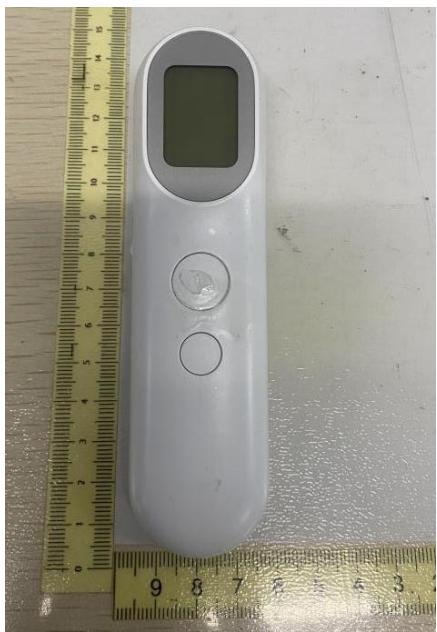

natural_image

White handheld electronic device with a digital display and control buttons placed on a metal ruler for scale (no text or symbols visible)

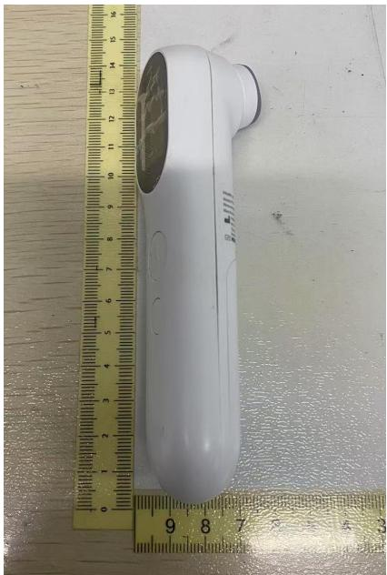

natural_image

White handheld electronic device placed next to a yellow ruler on a wooden surface (no visible text or symbols)

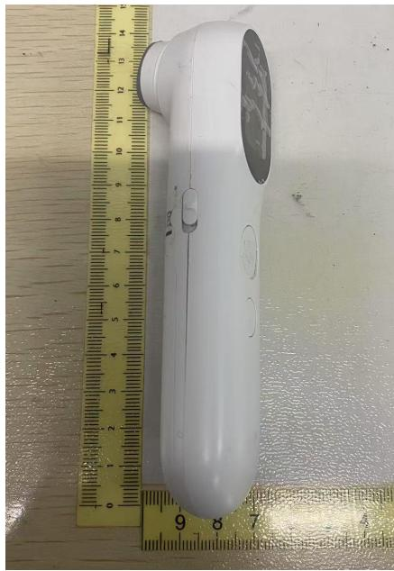

natural_image

White handheld electronic device placed next to a yellow ruler on a wooden surface (no visible text or symbols)

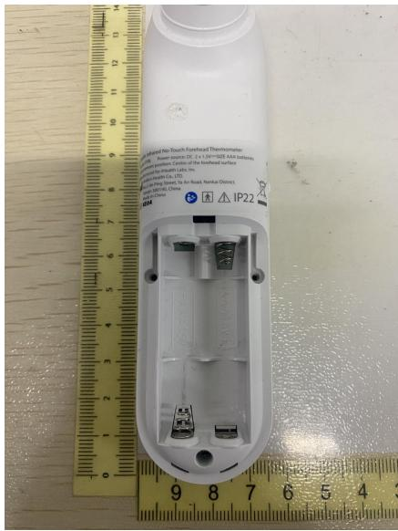

text_image

Applied No-Touch Forehead Thermometer
Power source: DC 2 x 130~925 AM deferrant
Pulsifier: Center of the foothead surface
for Health Labs, Inc.
Operating Co., Ltd.
Aerial Ring Door, To Air Road, Nankai District,
with IP22
IP22
9 8 7 6 5 4 3
9 8 7 6 5 4 3
1 2 3 4 5 6 7 8 9 10 11 12 13
14 15 16 17 18 19 20 21 22 23
14.1 IP22

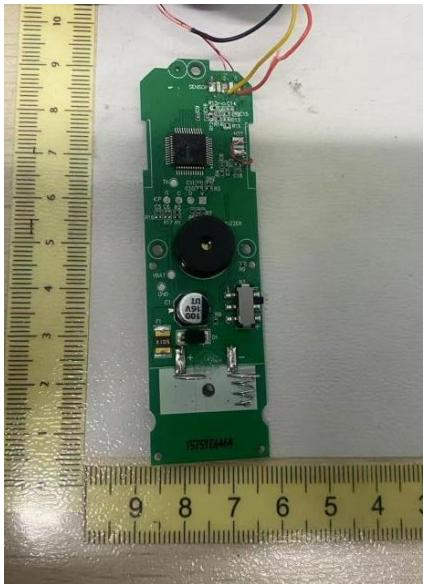

natural_image

Green printed circuit board with electronic components and wires placed on a ruler for scale (no visible text or symbols)

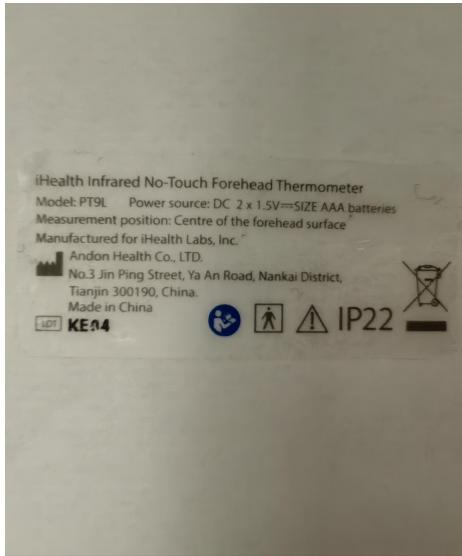

text_image

iHealth Infrared No-Touch Forehead Thermometer
Model: PT9L Power source: DC 2 x 1.5V==SIZE AAA batteries
Measurement position: Centre of the forehead surface
Manufactured for iHealth Labs, Inc.
Andon Health Co., LTD.
No.3 Jin Ping Street, Ya An Road, Nankai District,
Tianjin 300190, China.
Made in China
LEDT KE14 IP22

END OF ATTACHMENT 3

THE END