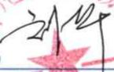
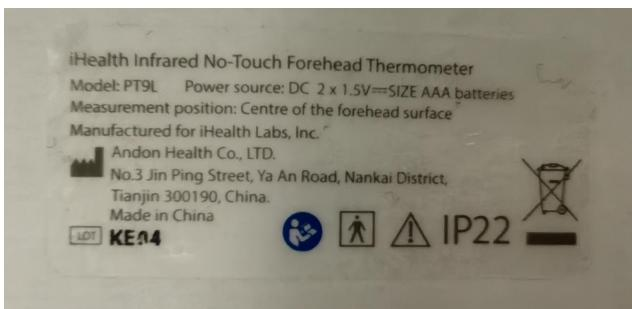
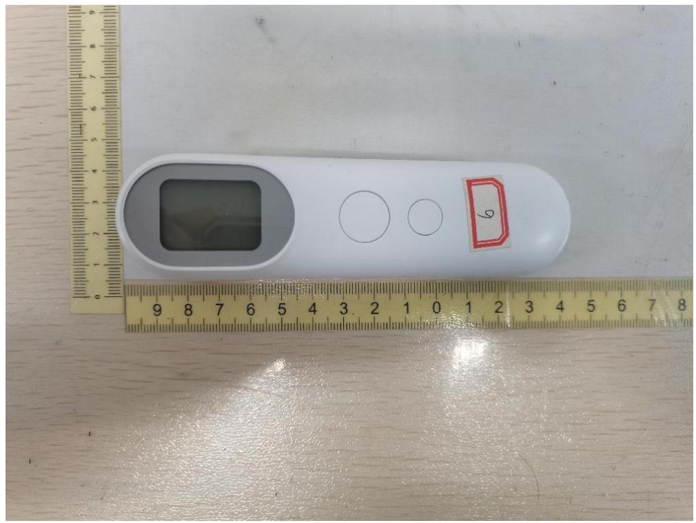
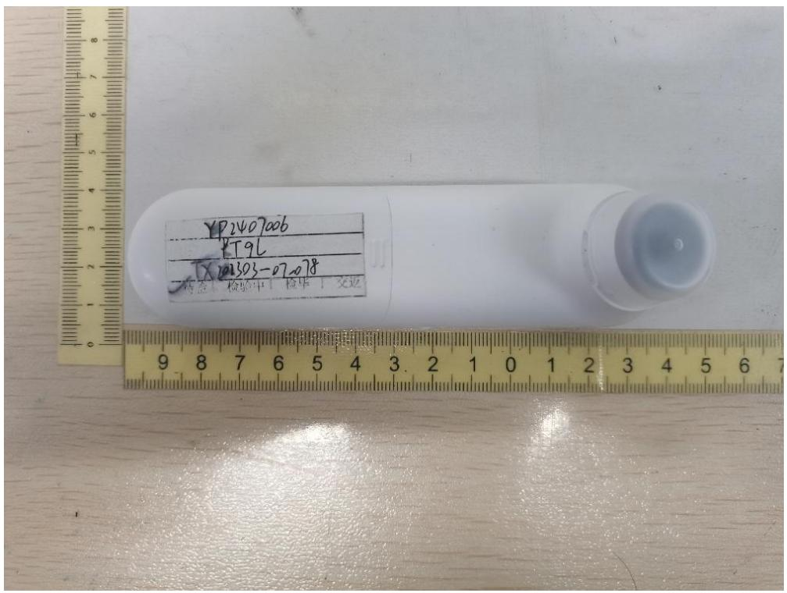
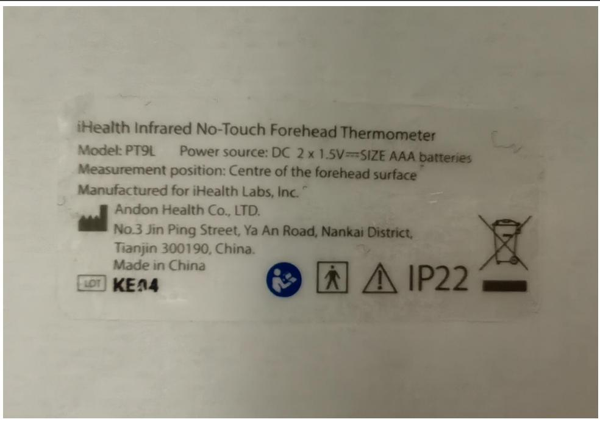

<table><tr><td colspan="2">TEST REPORTISO 80601-2-56Medical electrical equipmentPart 2-56: Particular requirements for basic safety and essential performance of clinical thermometers for body temperature measurement</td></tr><tr><td>Date of issue......:</td><td>2025-05-29</td></tr><tr><td>Standard......:</td><td>EN ISO 80601-2-56:2017/A1:2020/ISO 80601-2-56:2017+A1:2018</td></tr><tr><td>Procedure deviation......:</td><td>N/A</td></tr><tr><td>Non-standard test method......:</td><td>N/A</td></tr><tr><td>Type of test object......:</td><td>Infrared No-Touch Forehead Thermometer</td></tr><tr><td>Trademark......:</td><td>N/A</td></tr><tr><td>Model/type reference......:</td><td>PT9L</td></tr><tr><td>Report No ......:</td><td>ETX202303-07-078-03R1</td></tr><tr><td>Testing period......:</td><td>2024.07.09-2024.09.07</td></tr><tr><td>Manufacturer......:</td><td>ANDON HEALTH CO., LTD.</td></tr><tr><td>Address......:</td><td>No.3 JinPing Street, YaAn Road, Nankai District, Tianjin, China</td></tr><tr><td>Test laboratory......Address......:</td><td>Tianxu(Tianjin)Testing Technology Service Co.,LTD101, First floor, Building L,No.3 JinPing Street,Ya An Road,Nankai District, Tianjin,China</td></tr></table>

(LiuHua

(Guan Qingxiang

2022.5.29

<table><tr><td colspan="2">GENERAL INFORMATION</td></tr><tr><td colspan="2">Test item particulars (see also Clause 6):</td></tr><tr><td>Classification of installation and use ...... :</td><td>Hand-held ME equipment</td></tr><tr><td>Device type (component/sub-assembly/ equipment/system) ...... :</td><td>Equipment</td></tr><tr><td>Intended use (Including type of patient, application location)...... :</td><td>The Infrared No-Touch Forehead Thermometer is intended for the intermittent measurement of body temperature from the forehead skin surface on people of all ages. It can be used by consumers in the household environment and by healthcare providers.</td></tr><tr><td>Mode of operation ...... :</td><td>Continuous</td></tr><tr><td>Supply connection ...... :</td><td>internally powered</td></tr><tr><td>Accessories and detachable parts included ...... :</td><td>N/A</td></tr><tr><td>Other options include ...... :</td><td>N/A</td></tr><tr><td colspan="2">Possible test case verdicts:</td></tr><tr><td>- test case does not apply to the test object ...... :</td><td>N/A</td></tr><tr><td>- test object does meet the requirement ...... :</td><td>Pass (P)</td></tr><tr><td>- test object was not evaluated for the requirement...... :</td><td>N/E</td></tr><tr><td colspan="2">Abbreviations used in the report:</td></tr><tr><td colspan="2">General remarks:&quot;(see Attachment #)&quot; refers to additional information appended to the report.&quot;(see appended table)&quot; refers to a table appended to the report.The tests results presented in this report relate only to the object tested.This report shall not be reproduced except in full without the written approval of the testing laboratory.List of test equipment must be kept on file and available for review.This Test Report Form is intended for the investigation of clinical thermometers for body temperature measurement in accordance with EN ISO 80601-2-56:2017/A1:2020/ISO 80601-2-56:2017+A1:2018. It can only be used together with IEC 60601-1:2005.Additional test data and/or information provided in the attachments to this report.Throughout this report a □ comma / ☒ point is used as the decimal separator.</td></tr></table>

# General product information:

The Infrared No-Touch Forehead Thermometer is intended for the intermittent measurement of body temperature from the forehead skin surface on people of all ages. It can be used by consumers in the household environment and by healthcare providers.

# Tests performed (name of test and test clause):

All the requirements of EN ISO 80601-2-56:2017/A1:2020/ISO 80601-2-56:2017+A1:2018 were evaluated in this test report except the following clauses:

- 201.11.7 Biocompatibility of ME EQUIPMENT and ME is not evaluated in this report.   
- 201.17 Electromagnetic compatibility of ME EQUIPMENT and ME SYSTEMS is not evaluated in this report.   
- 201.102 CLINICAL ACCURACY VALIDATION is not evaluated in this report.   
- 202 Electromagnetic disturbances - Requirements and tests is not evaluated in this report.   
- 206 Usability is not evaluated in this report.

# Test result:

The test item passed the test specification(s). All apply to the test object does meet the requirement.

# General disclaimer：

The test results presented in this report relate only to the object tested.

Without permission of the Report department this test report is not permitted to be duplicated in extracts.

# Condition of acceptability:

1) 201.11.7 Biocompatibility of ME EQUIPMENT and ME is not evaluated in this report.   
2) 201.17 Electromagnetic compatibility of ME EQUIPMENT and ME SYSTEMS is not evaluated in this report.   
3) 201.102 CLINICAL ACCURACY VALIDATION is not evaluated in this report.   
4) 202 Electromagnetic disturbances - Requirements and tests is not evaluated in this report.   
5) 206 Usability is not evaluated in this report.

# Copy of marking plate

The artwork below may be only a draft. The use of certification marks on a product must be authorized by the respective NCBs that own these marks.

text_image

iHealth Infrared No-Touch Forehead Thermometer
Model: PT9L Power source: DC 2 x 1.5V==SIZE AAA batteries
Measurement position: Centre of the forehead surface
Manufactured for iHealth Labs, Inc.
Andon Health Co., LTD.
No.3 Jin Ping Street, Ya An Road, Nankai District,
Tianjin 300190, China.
Made in China
LEDT KE.04
IP22

<table><tr><td colspan="4">EN ISO 80601-2-56:2017/A1:2020/ISO 80601-2-56:2017+A1:2018</td></tr><tr><td>Clause</td><td>Requirement + Test</td><td>Result - Remark</td><td>Verdict</td></tr></table>

<table><tr><td>201.4</td><td colspan="2">GENERAL REQUIREMENTS</td><td>P</td></tr><tr><td>201.4.2</td><td>RISK MANAGEMENT PROCESS for ME EQUIPMENT or ME SYSTEMS</td><td></td><td>P</td></tr><tr><td>201.4.2.101</td><td colspan="2">Additional requirements for RISK MANAGEMENT PROCESS for ME EQUIPMENT or ME SYSTEMS</td><td>P</td></tr><tr><td></td><td>The RISKS of changing environmental conditions for the CLINICAL THERMOMETER are considered in RISK MANAGEMENT PROCESS</td><td>See RISK MANAGEMENT PROCESS PROVIDED BY the manufacture</td><td>P</td></tr><tr><td></td><td>Guidance regarding the RESIDUAL RISKS is provided in the instruction for use</td><td>Refer to Operation Guide.</td><td>P</td></tr><tr><td>201.4.3</td><td colspan="2">ESSENTIAL PERFORMANCE</td><td>P</td></tr><tr><td>201.4.3.101</td><td>Additional requirements for ESSENTIAL PERFORMANCE</td><td></td><td>P</td></tr><tr><td></td><td>At least one of the following functions is identified as ESSENTIAL PERFORMANCE in RISK MANAGEMENT FILE:</td><td>See RISK MANAGEMENT FILE</td><td>P</td></tr><tr><td></td><td>- accuracy of the CLINICAL THERMOMETER,</td><td></td><td>P</td></tr><tr><td></td><td>- generation of a TECHNICAL ALARM CONDITION,</td><td></td><td>P</td></tr><tr><td></td><td>- not providing an OUTPUT TEMPERATURE, or</td><td></td><td>P</td></tr><tr><td>201.5</td><td>General requirements for testing of ME EQUIPMENT</td><td></td><td>N/A</td></tr><tr><td></td><td>IEC 60601-1:2005, Clause 5 applies.</td><td></td><td>N/A</td></tr><tr><td>201.6</td><td>Classification of ME EQUIPMENT and ME SYSTEMS</td><td></td><td>N/A</td></tr><tr><td></td><td>IEC 60601-1:2005, Clause 6 applies</td><td></td><td>N/A</td></tr><tr><td>201.7</td><td colspan="2">ME EQUIPMENT IDENTIFICATION, MARKING AND DOCUMENTS</td><td>P</td></tr><tr><td></td><td colspan="2">IEC 60601-1:2005+A1:2012, Clause 7 applies, except as follows:</td><td>P</td></tr><tr><td>201.7.2.1</td><td colspan="2">Minimum requirements for marking on ME EQUIPMENT and interchangeable parts</td><td>P</td></tr><tr><td>201.7.2.1.101</td><td colspan="2">Additional requirements for minimum requirements for marking on ME EQUIPMENT and interchangeable parts, marking of the packaging</td><td>P</td></tr><tr><td></td><td>The packaging of the CLINICAL THERMOMETER and PROBE is marked as following:</td><td></td><td>P</td></tr><tr><td></td><td>a) MEASURING SITE and REFERENCE BODY SITE</td><td></td><td>N/A</td></tr><tr><td></td><td>b) mode of operation of the CLINICAL THERMOMETER; and– the contents of the packaging</td><td></td><td>PP</td></tr><tr><td></td><td>c) appropriate symbol from ISO 15223-1:2016 used for sterile packaging (See Table 201.D.2.101, symbols 3-8)......</td><td></td><td>P</td></tr><tr><td></td><td>d) Symbol 5.1.4 of ISO 15233-1:2016 used for CLINICAL THERMOMETER or PROBE with expiration date (see Table 201.D.2.101, symbol 2).</td><td></td><td>P</td></tr><tr><td></td><td>e) Packaging marked with special storage and/or handling instructions......</td><td></td><td>P</td></tr><tr><td></td><td>For a specific MODEL OR TYPE REFERENCE, the indication of single use shall be consistent.</td><td>No single use:</td><td>P</td></tr><tr><td>201.7.2.2</td><td colspan="2">Marking on the outside of ME EQUIPMENT or ME EQUIPMENT parts</td><td>P</td></tr><tr><td>201.7.2.101</td><td colspan="2">Additional requirements for marking on the outside of ME EQUIPMENT or ME EQUIPMENT parts</td><td>P</td></tr><tr><td></td><td>The following markings provided on the CLINICAL THERMOMETER are CLEARLY LEGIBLE:</td><td>See Copy of marking plate</td><td>P</td></tr><tr><td></td><td>a) symbol “°C” or “°F” marked adjacent to the OUTPUT TEMPERATURE or indicated at the display :</td><td>Indicated at the display</td><td>P</td></tr><tr><td></td><td>– if switching between units is possible, the respective displayed unit is indicated</td><td></td><td>P</td></tr><tr><td></td><td>b) the intended MEASURING SITE is marked</td><td>See Copy of marking plate</td><td>N/A</td></tr><tr><td></td><td>c) if necessary to maintain ESSENTIAL PERFORMANCE, it is indicated to use a new PROBE</td><td></td><td>N/A</td></tr><tr><td>201.7.4.3</td><td colspan="2">Unit of measure</td><td></td></tr><tr><td>201.7.4.3.101</td><td colspan="2">Additional requirements for unit of measure</td><td>P</td></tr><tr><td></td><td>OUTPUT TEMPERATURE expressed in degrees Celsius, °C or degrees Fahrenheit, °F ......</td><td>Expressed optionally in °C or °F</td><td>P</td></tr><tr><td></td><td>Unit of measure clearly indicated......</td><td></td><td>P</td></tr><tr><td>201.7.9</td><td>ACCOMPANYING DOCUMENT– the ACCOMPANYING DOCUMENT contains name or trade name and address of--the MANUFACTURER, and--where the manufacturer does not have an address within the locale, an authorized representative within the locale,to which the RESPONSIBLE ORGANIZATION can refer . ......</td><td>See chapter “Warranty” of user manual</td><td>PP</td></tr><tr><td>201.7.9.2</td><td colspan="2">Additional requirements for instructions for use</td><td></td></tr><tr><td>201.7.9.2.101</td><td colspan="2">Instructions for use</td><td></td></tr><tr><td></td><td>a) a summary of the USE SPECIFICATION as determined for IEC 62366-1:2015;</td><td></td><td>P</td></tr><tr><td></td><td>b) MEASURING SITE and REFERENCE BODY of CLINICAL THERMOMETER specified</td><td>See chapter “Intended use” of user manual</td><td>P</td></tr><tr><td></td><td>c) recommended minimum measuring time and minimum time between measurements for each intended MEASURING SITE, if applicable ...... :</td><td></td><td>P</td></tr><tr><td></td><td>d) RATED OUTPUT RANGE for each intended REFERENCE BODY SITESpecified ...... :</td><td>See chapter “Safety Precaution” of user manual</td><td>P</td></tr><tr><td></td><td>e) the LABORATORY ACCURACY in the RATED OUTPUT RANGE and, if equipped, the LABORATORY</td><td>See chapter “Product specifications” of user manual</td><td>P</td></tr><tr><td></td><td>f) for CLINICAL THERMOMETERS for use with PROBE COVER:</td><td>No PROBE COVER used</td><td>P</td></tr><tr><td></td><td>1) instruction how to apply PROBE COVER</td><td></td><td>P</td></tr><tr><td></td><td>2) information about the behaviour of the CLINICAL THERMOMETER when used without PROBE COVER</td><td></td><td>P</td></tr><tr><td></td><td>g) mode of operation of the CLINICAL THERMOMETER (DIRECT MODE or ADJUSTED MODE) ...... :</td><td>See chapter “Product specifications” of user manual</td><td>P</td></tr><tr><td></td><td>h) instructions for selection and replacement of INTERNAL ELECTRICAL POWER SOURCES, if applicablei) Instructions provided on nature of maintenance and/or calibration needed to ensure proper function and its frequency ...... :</td><td>See chapter “Setup and operating procedures” in user manual</td><td>PP</td></tr><tr><td></td><td>j) information about disposal of the clinical thermometer and its components ...... :</td><td>See chapter “Maintenance” in user manual</td><td>P</td></tr><tr><td></td><td>k) if the CLINICAL THERMOMETER and/or its components are intended for single use only, information on characteristics and technical factors that could pose a RISK is provided in instructions for use</td><td></td><td>N/A</td></tr><tr><td>201.7.9.101</td><td>The ACCOMPANYING DOCUMENT includes a description of the correction method to derive unadjusted temperatures from OUTPUT TEMPERATURE measured in the ADJUSTED MODE, except when the CLINICAL THERMOMETER is equipped with a TEST MODE or DIRECT MODE</td><td></td><td>P</td></tr><tr><td>201.8</td><td colspan="2">Protection against electrical HAZARDS from ME EQUIPMENT</td><td>P</td></tr><tr><td></td><td>IEC 60601-1:2005+A1:2012, Clause 8 applies</td><td></td><td>P</td></tr><tr><td>201.9</td><td colspan="2">Protection against mechanical HAZARDS of ME EQUIPMENT and ME SYSTEMS</td><td>P</td></tr><tr><td></td><td>IEC 60601-1:2005+A1:2012, Clause 9 applies</td><td></td><td>P</td></tr><tr><td>201.10</td><td colspan="2">Protection against unwanted and excessive radiation HAZARDS</td><td>N/A</td></tr><tr><td></td><td>IEC 60601-1:2005+A1:2012, Clause 10 applies</td><td></td><td>N/A</td></tr><tr><td>201.11</td><td colspan="2">Protection against excessive temperatures and other HAZARDS</td><td>P</td></tr><tr><td></td><td>IEC 60601-1:2005+A1:2012, Clause 11 applies except as follows:</td><td></td><td>P</td></tr><tr><td>201.11.6.6</td><td>Cleaning and disinfection of ME EQUIPMENT and ME SYSTEM</td><td></td><td>P</td></tr><tr><td rowspan="3"></td><td>The surfaces of the CLINICAL THERMOMETER, PROBE and ACCESSORIES that can become contaminated with body fluids during NORMAL CONDITION or SINGLE FAULT CONDITION shall be designed to allow for cleaning and disinfection or cleaning and sterilization (additional requirements arc found in IEC 60601-1:2005+A1:2012, 11.6.7 and IEC 60601-1-11:2015, Clause B).</td><td>See “Caution” of the Operation Guide.</td><td>P</td></tr><tr><td>The CLINICAL THERMOMETER may be dismantled during the decontamination PROCESS,</td><td></td><td>P</td></tr><tr><td>ACCESSORIES not intended for re-use are exemplfrom this requirement.</td><td></td><td>N/A</td></tr><tr><td></td><td>CLINICAL THERMOMETER and PROBEENCLOSURES shall be designed to allow for surface cleaning and disinfection to reduce to acceptable levels the RISK of infection of OPERATORS, bystanders, or the PATIENT</td><td>See “Caution” of the Operation Guide.</td><td>P</td></tr><tr><td></td><td>Instructions for processing and REPROCESSING the CLINICAL THERMOMETER, PROBE and ACC:ESSORIES shall comply with ISO 17664:2004 and ISO 14937:2009 and shall be disclosed in the instructions for use.</td><td>See “Caution” of the Operation Guide.</td><td>P</td></tr><tr><td></td><td>Check compliance by inspection of the RISK MANAGEMENT FILE. When compliance with this document could be affected by the cleaning or the disinfecting of the CLINICAL TIERMOMETER, PROBE or its parts or ACCESSORIES, clean and disinfect them 100 times in accordance with the methods indicated in the instruction for use, including any cooling or drying period. After these PROCEDURES, confirm that BASIC SAFETY and ESSENTIAL PERFORMANCE are maintained. Confirm that the MANUFACTURER has evaluated the effects of multiple PROCESS cycles and the effectiveness of those cycles.</td><td>See appended Table 201.11.6.6</td><td>P</td></tr><tr><td>201.11.7</td><td>Biocompatibility of ME EQUIPMENT and ME</td><td></td><td>N/E</td></tr><tr><td></td><td>The ACCESSIBLE PARTS of a CUNICAL THERMOMETER, PROBE, its parts or ACCESSORIES that contain phthalates which are classified as carcinogenic, mutagenic or toxic to reproduction shall be marked as containing phthalates on the device itself or on the packaging.</td><td></td><td>N/E</td></tr><tr><td></td><td>If the INTENDED USE of a CLINICAL THERMOMETER, PROBE, its parts or ACCESSORES includes treatment of children or treatment of pregnant or nursing women, a specific justification for the use of these phthalates shall be included in the RISK MANAGEMENT FILE. The instructions for use of a CUNICAL THERMOMETER, PROBE, its parts or ACCESSORIES that contain such phthalates shall contain information on RESIDUAL RISKS for these PATIENT groups and, if applicable, on appropriate precautionary measures.Check compliance by inspection of the instructions for use and inspection of the information provided by the MANUFACTURER for identification of the presence of substances which are carcinogenic, mutagenic or toxic to reproduction and justification for their use.</td><td></td><td>N/EN/E</td></tr><tr><td>201.12</td><td colspan="2">ACCURACY OF CONTROLS AND INSTRUMENTS AND PROTECTION AGAINST HAZARDOUS OUTPUTS</td><td>P</td></tr><tr><td>201.12.1</td><td colspan="2">Accuracy of controls and instruments</td><td>P</td></tr><tr><td>201.12.1. 101</td><td colspan="2">Additional requirements for accuracy of controls and instruments</td><td>P</td></tr><tr><td></td><td>If the CLINICAL THERMOMETER cannot indicate a temperature within the LABORATORY ACCURACY, it</td><td></td><td>P</td></tr><tr><td></td><td>- either it provides a TECHNICAL ALARM CONDITION</td><td></td><td>P</td></tr><tr><td></td><td>- or it does not provide an OUTPUT TEMPERATURE;</td><td></td><td>P</td></tr><tr><td></td><td>Minimum RATED OUTPUT RANGE of the CLINICAL THERMOMETER is from 34°C to 42°C.</td><td>32.0°C to 42.9°C</td><td>P</td></tr><tr><td>201.12.2</td><td colspan="2">USABILITY</td><td>P</td></tr><tr><td>201.12.2. 101</td><td colspan="2">Additional requirements for USABILITY</td><td>P</td></tr><tr><td></td><td>CLINICAL THERMOMETERS intended for home healthcare use require the display of OUTPUT TEMPERATURE of at least 4mm or the value is optically magnified to this height. This is indicated in USABILITY ENGINEERING PROCESS.</td><td>10mm</td><td>P</td></tr><tr><td></td><td>CLINICAL THERMOMETERS with a segmented indication display perform a functional test of all segments after activation</td><td></td><td>N/A</td></tr><tr><td>201.13</td><td colspan="2">HAZARDOUS SITUATIONS and fault conditions</td><td>P</td></tr><tr><td></td><td>IEC 60601-1 :2005+A 1 :2012, Clause 13 applies.</td><td></td><td>P</td></tr><tr><td>201.14</td><td colspan="2">201.14 PROGRAMMABLE ELECTRICAL MEDICAL SYSTEMS (PEMS)</td><td>P</td></tr><tr><td></td><td>IEC 60601-1:2005+A1:2012. Clause 14 applies.</td><td></td><td>P</td></tr><tr><td>201.15</td><td colspan="2">201.15 Construction of ME EQUIPMENT</td><td>P</td></tr><tr><td></td><td>IEC 6060 1-1 :2005+A 1:20 12, Clause 15 applies.</td><td></td><td>P</td></tr><tr><td>201.16</td><td colspan="2">ME SYSTEMS</td><td></td></tr><tr><td></td><td>IEC 60601-1 :2005+A1:2012, Clause 16 applies.</td><td>Not ME systems</td><td>N/A</td></tr><tr><td>201.17</td><td colspan="2">Electromagnetic compatibility of ME EQUIPMENT and ME SYSTEMS</td><td>N/E</td></tr><tr><td></td><td>IEC 60601-1:2005, Clause 17 applies.</td><td>Not evaluate in this report</td><td>N/E</td></tr><tr><td>201.101</td><td colspan="2">LABORATY PERFORMANCE REQUIREMENTS</td><td></td></tr><tr><td>201.101.1</td><td colspan="2">General test requirements</td><td></td></tr><tr><td></td><td>Laboratory performance is assessed in DIRECT MODE or in TEST MODE under the same conditions</td><td>In test mode</td><td>P</td></tr><tr><td></td><td>Alternatively correction method is used to derive unadjusted temperatures from OUTPUT TEMPERATURE in accordance with the ACCOMPANYING DOCUMENT</td><td></td><td>P</td></tr><tr><td></td><td>If the CLINICAL THERMOMETER is intended for use with a PROBE COVER as indicated in the instructions for use, a new PROBE COVER is used for each OUTPUT TEMPERATURE measurement</td><td>No PROBE COVER used</td><td>N/A</td></tr><tr><td>201.101.2</td><td colspan="2">LABORATORY ACCURACY</td><td>P</td></tr><tr><td></td><td>The LABORATORY ACCURACY within the RATED OUTPUT RANGE in NORMAL USE shall be within ±0,3°C</td><td>0,3°C</td><td>P</td></tr><tr><td></td><td>The LABORATORY ACCURACY, within the RATED EXTENDED OUTPUT RANGE in NORMAL USE, shall be within 0,4°C unless CLINICAL THERMOMETER indicates that the measured temperature is outside of the RATED OUTPUT RANGE.</td><td>0,3°C</td><td>P</td></tr><tr><td></td><td>If the PROBE is separable from the CLINICAL THERMOMETER, they may be tested separately</td><td></td><td>N/A</td></tr><tr><td></td><td>Calculated equation for CLINICAL THERMOMETER .. :</td><td>See Appended Table 201.101.2</td><td>P</td></tr><tr><td>201.101.3</td><td colspan="2">Time response for a continuous CLINICAL THERMOMETER</td><td>P</td></tr><tr><td></td><td>The transient response for a DIRECT MODE CLINICAL THERMOMETER that is not an ADJUSTED MODE CLINICAL THERMOMETER shall be characterized and disclosed in the instructions for use.</td><td>Not a DIRECT MODE CLINICAL THERMOMETER</td><td>P</td></tr><tr><td></td><td>Transient time lower than recommended minimum measuring time indicated in ACCOMPANYING DOCUMENT.</td><td></td><td>N/A</td></tr><tr><td>201.102</td><td colspan="2">CLINICAL ACCURACY VALIDATION</td><td>N/E</td></tr><tr><td>201.102.1</td><td colspan="2">Method</td><td>N/E</td></tr><tr><td></td><td>ADJUSTED MODE CLINICAL THERMOMETER are VALIDATED for CLINICAL ACCURACY in each ADJUSTED MODE in accordance with ISO 14155-1:2003 and ISO 14155-2:2003.</td><td></td><td>N/E</td></tr><tr><td></td><td>The results of CLINICAL ACCURACY VALIDATION is disclosed in the ACCOMPANYING DOCUMENT.</td><td></td><td>N/E</td></tr><tr><td></td><td>If the CLINICAL THERMOMETER is intended for use with a PROBE COVER as indicated in the instructions for use, a new PROBE COVER is used for each OUTPUT TEMPERATURE measurement.</td><td></td><td>N/E</td></tr><tr><td></td><td>Requirements of clauses 201.102.2, 201.102.3, 201.102.4 and 201.102.5 are fulfilled.</td><td></td><td>N/E</td></tr><tr><td></td><td>CLINICAL ACCURACY validated.</td><td></td><td>N/E</td></tr><tr><td>201.102.2</td><td>Human subject population requirements</td><td></td><td>N/E</td></tr><tr><td></td><td>Total number of febrile subjects not less than 30 % and not greater than 50 % of all subjects in the selected age group .</td><td></td><td>N/E</td></tr><tr><td></td><td>CLINICAL ACCURACY VALIDATION carried out on all age groups indicated in the instructions for use.</td><td></td><td>N/E</td></tr><tr><td></td><td>Number of subjects in each age group is sufficiently large to minimize the effect of random components of measurement error (minimum of all groups is 105; minimum in age group is 35; minimum 15 subjects in A1 or A2 if subgroup A is not excluded ).</td><td>:</td><td>N/E</td></tr><tr><td></td><td>– age group A1 (0-3 months)</td><td></td><td>N/E</td></tr><tr><td></td><td>– age group A2 (3-12 months)</td><td></td><td>N/E</td></tr><tr><td></td><td>– age group B (&gt;1 and &lt;5 years)</td><td></td><td>N/E</td></tr><tr><td></td><td>– age group C (&gt;5 years)</td><td></td><td>N/E</td></tr><tr><td>201.102.3</td><td>Calculated CLINICAL BIAS for the OPERATING MODE being evaluated (Δcb)</td><td></td><td>N/E</td></tr><tr><td>201.102.4</td><td>Calculated LIMITS OF AGREEMENT (LA)</td><td></td><td>N/E</td></tr><tr><td>201.102.5</td><td>Calculated CLINICAL REPEATABILITY for particular OPERATING MODE (σr)An ADJUSTED MODE CLINICAL THERMOMETER that makes continuous estimates of the REFERENCE BODY SITE temperature is exempt from the requirements of this subclause</td><td></td><td>N/EN/E</td></tr><tr><td>201.103</td><td colspan="2">PROBES, PROBE CABLE EXTENDERS AND PROBE COVERS</td><td>P</td></tr><tr><td>201.103.1</td><td colspan="2">General</td><td>P</td></tr><tr><td></td><td>PROBES, PROBE CABLE EXTENDERS and PROBE COVERS comply with the requirements of this particular standard</td><td>No such parts used</td><td>P</td></tr><tr><td></td><td>MANUFACTURERS of PROBES, PROBE CABLE EXTENDERS and PROBE COVERS conduct tests to ensure that all CLINICAL THERMOMETER specifications are met with each MODEL OR TYPE REFERENCE of CLINICAL THERMOMETER with which they are intended to be used</td><td></td><td>P</td></tr><tr><td></td><td>All CLINICAL THERMOMETERS with which compatibility to the PROBES, PROBE CABLE EXTENDERS and PROBE COVERS is claimed are listed in the ACCOMPANYING UMENT ...... :</td><td></td><td>P</td></tr><tr><td></td><td>It is the responsibility of the MANUFACTURER of a PROBE, PROBE CABLE EXTENDER and PROBE COVER, including a REPROCESSED PROBE, PROBE CABLE EXTENDER and PROBE COVER, to have their PROCESSES VALIDATED to ensure that any new or REPROCESSED product complies with the requirements of this particular standard</td><td></td><td>P</td></tr><tr><td>201.103.2</td><td colspan="2">Labelling</td><td>P</td></tr><tr><td></td><td>At least one MODEL OR TYPE REFERENCE of CLINICAL THERMOMETER is included in the ACCOMPANYING DOCUMENT provided with each PROBE, PROBE CABLE EXTENDER and PROBE COVER, compliant with 201.103.1</td><td></td><td>P</td></tr><tr><td></td><td>The following statements can be found in the ACCOMPANYING DOCUMENT of each PROBE, PROBE CABLE EXTENDER and PROBE COVER:</td><td></td><td>P</td></tr><tr><td></td><td>a) Designed for use with specific thermometer or monitoring equipment;</td><td></td><td>P</td></tr><tr><td></td><td>b) The OPERATOR is responsible for checking the compatibility of the thermometer or monitoring equipment, PROBE, PROBE CABLE EXTENDER AND PROBE COVER before use; and</td><td></td><td>P</td></tr><tr><td></td><td>c) Incompatible components can result in degraded performance.</td><td></td><td>P</td></tr><tr><td>202</td><td colspan="2">Electromagnetic disturbances - Requirements and tests</td><td>N/E</td></tr><tr><td></td><td colspan="2">IEC 60601-1-2:2014 applies except as follows:</td><td>N/E</td></tr><tr><td>202.4.3.1</td><td>Configurations</td><td></td><td>N/E</td></tr><tr><td></td><td>Amendment (add after the last dash of 4.3.1):--if applicable, attachment of ACCESSORIES as necessary to achieve the BASIC SAFETY and ESSENTIAL PERFORMANCE of the CLINICAL THERMOMETER;</td><td></td><td>N/E</td></tr><tr><td>202.5.2.2.1</td><td>Requirements applicable to all ME Equipment and ME systems</td><td></td><td>N/E</td></tr><tr><td></td><td>Amendment [add note to list element b]:NOTE: the requirements of this document are not considered deviations or allowances</td><td></td><td>N/E</td></tr><tr><td>202.8.1.101</td><td>Additional general requirements</td><td></td><td>N/E</td></tr><tr><td></td><td>The following degradations, if associated with BASIC SAFETY or ESSENTIAL PERFORMANCE, shall not be allowed:</td><td></td><td>N/E</td></tr><tr><td></td><td>--component failures</td><td></td><td>N/E</td></tr><tr><td></td><td>--changes in programmable parameters or settings</td><td></td><td>N/E</td></tr><tr><td></td><td>--reset to default settings</td><td></td><td>N/E</td></tr><tr><td></td><td>--change of operating mode</td><td></td><td>N/E</td></tr><tr><td></td><td>--change in LABORATORY ACCURACY at any point in the RATED OUTPUT RANGE and in the RATED EXTENDED OUTPUT RANGE greater than permitted in 201.101.2 without the generation of either a TECHNICAL ALARM CONDITION or an indication of abnormal operation.</td><td></td><td>N/E</td></tr><tr><td></td><td>The CLINICAL THERMOMETER may exhibit temporary degradation of performance (e.g. deviation from the performance indicated in the instructions for use dUring IMMUNITY testing), which does not require OPERATOR intervention and that does not affect BASIC SAFETY or ESSENTIAL PERFORMANCE.</td><td></td><td>N/E</td></tr><tr><td></td><td>In the event of disruption during IMMUNITY tests. the CLINICAL THERMOMETER shall recover from any disruption within 30 s</td><td></td><td>N/E</td></tr><tr><td>206</td><td>Usability</td><td></td><td>N/E</td></tr><tr><td></td><td>EC 60601-1-6:2010+A1:2013 applies except as follows: For a CLINICAL THERMOMETER, the following shall be considered PRIMARY OPERATING FUNCTIONS;</td><td></td><td>N/E</td></tr><tr><td></td><td>a) observing the OUTPUT TEMPERATURE;</td><td></td><td>N/E</td></tr><tr><td></td><td>b) properly positioning CLINICAL THERMOMETER or PROBE at the MEASURING SITE;</td><td></td><td>N/E</td></tr><tr><td></td><td>c) starting the CLINICAL THERMOMETER from power off;</td><td></td><td>N/E</td></tr><tr><td></td><td>d) turning off the CLINICAL THERMOMETER;</td><td></td><td>N/E</td></tr><tr><td></td><td>e) performing a basic pre-use functional check of the CLINICALTHERMOMETER.</td><td></td><td>N/E</td></tr><tr><td></td><td>The folloWing functions, if available, also shall be considered PRIMARY OPERATING FUNCTIONS:</td><td></td><td>N/E</td></tr><tr><td></td><td>f) performing a basic pre-use functional check of the ALARM SIGNALS;</td><td></td><td>N/E</td></tr><tr><td></td><td>g) configuring the ACCESSORIES including connection of the detachable parts to the CLINICAL THERMOMETER;</td><td></td><td>N/E</td></tr><tr><td></td><td>h) REPROCESSING the ACCESSORIES;</td><td></td><td>N/E</td></tr><tr><td></td><td>i) setting the OPERATOR-adjustable controls:</td><td></td><td>N/E</td></tr><tr><td></td><td>--switching between MEASURING SITES; --setting CLINICAL THERMOMETER control parameters; --setting ALARM LIMITS; --inactivating ALARM SIGNALS</td><td></td><td>N/E</td></tr><tr><td>208</td><td>General requirements, tests and guidance for alarm systems in medical electrical equipment and medical electrical systems</td><td></td><td>N/A</td></tr><tr><td></td><td>IEC 60601-1-8:2006+A 1:2012 applies except as follows:</td><td></td><td>N/A</td></tr><tr><td>208.6.1.2</td><td>Determination of ALARM CONDITIONS and assignment of priority</td><td></td><td>N/A</td></tr><tr><td></td><td>Amendment (add prior to the compliancecheck): A CLINICAL THERMOMETER need not have a PHYSIOLOGICAL ALARM CONDITION.</td><td></td><td>N/A</td></tr><tr><td>211</td><td>Requirements for medical electrical equipment and medical electrical systems used in the home healthcare environment</td><td></td><td>P</td></tr><tr><td></td><td>IEC 60601-1-11 :2015 applies except as follows:</td><td></td><td>P</td></tr><tr><td>211.4.2.3.1</td><td>Continuous operating conditions</td><td></td><td>P</td></tr><tr><td></td><td>Amendment (replace the first dash with): - a temperature range of at least +15 °C to +40 °C;</td><td>See electrical safety report ETX202303-07-078-02</td><td>P</td></tr><tr><td>211.10.1.1</td><td>General requirements for mechanical strength</td><td></td><td>P</td></tr><tr><td></td><td>The tests of IEC 60601-1-11:2015, Clause 10 and I EC 60601-1 :2005+A1:2012, 15.3 shall be performed on the same sample of the CLINICAL THERMOMETER after the cleaning and disinfection PROCEDURES of</td><td>See appended Table 211.10.1.1</td><td>P</td></tr><tr><td>212</td><td>Requirements for medical electrical equipment and medical electrical systems intended for use in the emergency medical services environment</td><td></td><td>N/A</td></tr><tr><td></td><td>IEC 60601-1-12:2014 applies except as follows:</td><td></td><td>N/A</td></tr><tr><td>212.10.1.1</td><td>General requirements for mechanical strength</td><td></td><td>N/A</td></tr><tr><td></td><td>Amendment (add as the first paragraph):</td><td></td><td>N/A</td></tr><tr><td></td><td>The tests of IEC 60601-1-12:2014, Clause 10 and IEC 60601-1:2005+AI:2012, 15.3 shall be performed on the same sample of the CLINICAL THERMOMETER after the cleaning and disinfection PROCEOURES of 201.11.6.6 of this document have been performed unless there arc no cleaning and disinfection PROf.EDURES specified in the instructions for use. If more than one PROf.EDURE is specified in the instructions for use, each PROCEDURE shall be so tested. A separate sample of the f.UNICAL THERMOMETER</td><td></td><td>N/A</td></tr></table>

Appended Table 

<table><tr><td>201.101.2</td><td colspan="6">TABLE: Laboratory accuracy</td><td>P</td></tr><tr><td></td><td colspan="4">Rated output range (°C)</td><td colspan="2">32.0°C to 42.9°C</td><td>--</td></tr><tr><td></td><td colspan="4">RATED EXTENDED OUTPUT RANGE (°C)</td><td colspan="2">N/A</td><td>--</td></tr><tr><td></td><td colspan="4">Ambient conditions of CLINICAL THERMOMETER (°C / %rH) ...... :</td><td colspan="2">10°C to 40°C, 15%-95%</td><td>--</td></tr><tr><td></td><td colspan="4">Total uncertainty of REFERENCE TEMPERATURE SOURCE (°C) ...... :</td><td colspan="2"></td><td>--</td></tr><tr><td></td><td colspan="2">Combination of ambient</td><td>TRTS (°C)</td><td colspan="2">TTUT (°C)</td><td>TRCT (°C)</td><td>Equation (°C)</td></tr><tr><td rowspan="5">Midpoint of RATED OUTPUT RANGE</td><td>1</td><td>25°C,55%RH</td><td>37.0</td><td colspan="2">36.8</td><td>36.90</td><td>-0.1</td></tr><tr><td>2</td><td>39.5°C,90%RH</td><td>37.0</td><td colspan="2">37.2</td><td>37.11</td><td>0.1</td></tr><tr><td>3</td><td>10.5°C,90%RH</td><td>37.0</td><td colspan="2">37.0</td><td>36.96</td><td>0.0</td></tr><tr><td>4</td><td>39.5°C,20%RH</td><td>37.0</td><td colspan="2">36.9</td><td>36.90</td><td>0.0</td></tr><tr><td>5</td><td>10.5°C,20%RH</td><td>37.0</td><td colspan="2">36.9</td><td>36.90</td><td>0.0</td></tr><tr><td rowspan="5">Upper limit of RATED OUTPUT RANGE</td><td>1</td><td>25°C,55%RH</td><td>42.0</td><td colspan="2">41.8</td><td>41.88</td><td>-0.1</td></tr><tr><td>2</td><td>39.5°C,90%RH</td><td>42.0</td><td colspan="2">42.0</td><td>42.04</td><td>-0.0</td></tr><tr><td>3</td><td>10.5°C,90%RH</td><td>42.0</td><td colspan="2">42.0</td><td>41.95</td><td>0.1</td></tr><tr><td>4</td><td>39.5°C,20%RH</td><td>42.0</td><td colspan="2">41.8</td><td>41.86</td><td>-0.1</td></tr><tr><td>5</td><td>10.5°C,20%RH</td><td>42.0</td><td colspan="2">41.8</td><td>41.95</td><td>-0.2</td></tr><tr><td rowspan="5">lower limit of RATED OUTPUT RANGE</td><td>1</td><td>25°C,55%RH</td><td>33.0</td><td colspan="2">32.9</td><td>32.90</td><td>0.0</td></tr><tr><td>2</td><td>39.5°C,90%RH</td><td>33.0</td><td colspan="2">32.9</td><td>34.82</td><td>0.1</td></tr><tr><td>3</td><td>10.5°C,90%RH</td><td>33.0</td><td colspan="2">32.9</td><td>32.88</td><td>0.0</td></tr><tr><td>4</td><td>39.5°C,20%RH</td><td>33.0</td><td colspan="2">33.0</td><td>32.91</td><td>0.1</td></tr><tr><td>5</td><td>10.5°C,20%RH</td><td>33.0</td><td colspan="2">32.9</td><td>32.89</td><td>0.0</td></tr><tr><td rowspan="5">Upper limit of RATED EXTENDED OUTPUT RANGE</td><td>1</td><td>25°C,55%RH</td><td>N/A</td><td colspan="2">N/A</td><td>N/A</td><td>N/A</td></tr><tr><td>2</td><td>39.5°C,90%RH</td><td>N/A</td><td colspan="2">N/A</td><td>N/A</td><td>N/A</td></tr><tr><td>3</td><td>10.5°C,90%RH</td><td>N/A</td><td colspan="2">N/A</td><td>N/A</td><td>N/A</td></tr><tr><td>4</td><td>39.5°C,20%RH</td><td>N/A</td><td colspan="2">N/A</td><td>N/A</td><td>N/A</td></tr><tr><td>5</td><td>10.5°C,20%RH</td><td>N/A</td><td colspan="2">N/A</td><td>N/A</td><td>N/A</td></tr><tr><td rowspan="5">lower limit of RATED EXTENDED OUTPUT RANGE</td><td>1</td><td>25°C,55%RH</td><td>N/A</td><td colspan="2">N/A</td><td>N/A</td><td>N/A</td></tr><tr><td>2</td><td>39.5°C,90%RH</td><td>N/A</td><td colspan="2">N/A</td><td>N/A</td><td>N/A</td></tr><tr><td>3</td><td>10.5°C,90%RH</td><td>N/A</td><td colspan="2">N/A</td><td>N/A</td><td>N/A</td></tr><tr><td>4</td><td>39. 5°C,20%RH</td><td>N/A</td><td colspan="2">N/A</td><td>N/A</td><td>N/A</td></tr><tr><td>5</td><td>10.5°C,20%RH</td><td>N/A</td><td colspan="2">N/A</td><td>N/A</td><td>N/A</td></tr></table>

# Supplementary information:

1) Combination of upper and lower limits of environmental temperature and humidity ranges:   
1. Midpoint of humidity and ambient temperature   
2. Upper limit of humidity + upper limit of ambient temperature   
3. Upper limit of humidity + lower limit of ambient temperature   
4. Lower limit of humidity + upper limit of ambient temperature   
5. Lower limit of humidity + lower limit of ambient temperature   
TRTS – Measured temperature of REFERENCE TEMPERATURE SOURCE   
TTUT – Measured temperature of CLINICAL THERMOMETER under test   
TRCT – Measured temperature of REFERENCE CLINICAL THERMOMETER   
Note: reference temperature source and reference clinical thermometer are same one thermometer

<table><tr><td>201.11.6.6</td><td colspan="2">RM RESULTS TABLE:Cleaning and disinfection of ME EQUIPMENT and ME SYSTEM</td><td>P</td></tr><tr><td>Clause of ISO 14971</td><td>Document Ref. in RMF (Document No. &amp; paragraph)</td><td>Result - Remarks</td><td>Verdict</td></tr><tr><td>4.2</td><td>Risk Management Report (file No.: PT9L-FXGB01 V1.0)</td><td>Intended use and identification of characteristics related to cleaning analyzed and recorded</td><td>P</td></tr><tr><td>4.3</td><td>Risk Management Report (file No.: PT9L-FXGB01 V1.0)</td><td>Hazard analysis recorded</td><td>P</td></tr><tr><td>4.4</td><td>Risk Management Report (file No.: PT9L-FXGB01 V1.0)</td><td>Risk estimation recorded</td><td>P</td></tr><tr><td>5</td><td>Risk Management Report (file No.: PT9L-FXGB01 V1.0)</td><td>Risk evaluation recorded</td><td>P</td></tr><tr><td>6.4</td><td>Risk Management Report (file No.: PT9L-FXGB01 V1.0)</td><td>Residual risk evaluated.</td><td>P</td></tr><tr><td colspan="4">Supplementary information:</td></tr></table>

<table><tr><td>201.11.6.6</td><td colspan="2">TABLE:Cleaning and disinfection of ME EQUIPMENT and ME SYSTEM</td><td>P</td></tr><tr><td>Clause No.</td><td>Characteristics of the Marking Label tested:</td><td>Results observed</td><td>Remarks (Yes/No)</td></tr><tr><td>201.12.1.101</td><td>When the CLINICAL THERMOMETER is not capable of indicating a temperature within the LABORATORV ACCURACV, it shall provide a TECHNICAL ALARMCONDITION or it shall not provide an OUTPUTTEMPERATURE</td><td>The CLINICAL THERMOMETER show “LOW POWER REMINDER”symbol when lowvoltage of the internal electrical power source .</td><td>Y</td></tr><tr><td></td><td></td><td>The CLINICAL THERMOMETER show “- - -°F” or “- - -°C” When output temperature outside the rated extended output range</td><td></td></tr><tr><td>211.10.1.1</td><td colspan="2">TABLE:General requirements for mechanical strength</td><td>P</td></tr><tr><td>Clause No.</td><td>Characteristics of the Marking Label tested:</td><td>Results observed</td><td>Remarks (Yes/No)</td></tr><tr><td rowspan="2">201.12.1.1 01</td><td rowspan="2">When the CLINICAL THERMOMETER is not capable of indicating a temperature within the LABORATORV ACCURACV, it shall provide a TECHNICAL ALARM CONDITION or it shall not provide an OUTPUTTEMPERATURE</td><td>The CLINICAL THERMOMETER show “LOW POWER REMINDER”symbol when low voltage of the internal electrical power source .</td><td rowspan="2">Y</td></tr><tr><td>The CLINICAL THERMOMETER show “- - -°F” or “- - -°C” When output temperature outside the rated extended output range</td></tr></table>

# ATTACHMENT FILE 1 photos of the DUT

text_image

6
9 8 7 6 5 4 3. 2 1 0 1 2 3 4 5 6 7 8

text_image

YP2407006
PT9L
TX102303-07.078
二检查 | 检验中 | 检毕 | 交近

text_image

iHealth Infrared No-Touch Forehead Thermometer
Model: PT9L Power source: DC 2 x 1.5V==SIZE AAA batteries
Measurement position: Centre of the forehead surface
Manufactured for iHealth Labs, Inc.
Andon Health Co., LTD.
No.3 Jin Ping Street, Ya An Road, Nankai District,
Tianjin 300190, China.
Made in China
LOT KE24 IP22

--- End of Test Report ---