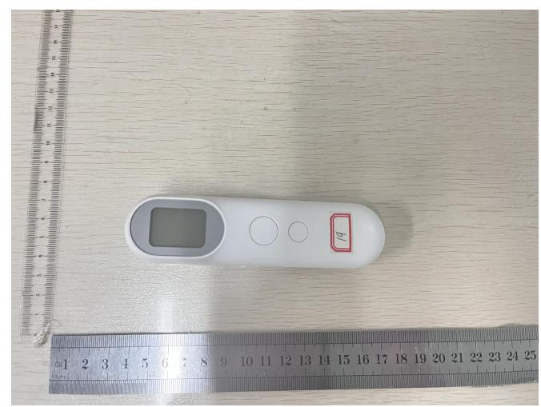
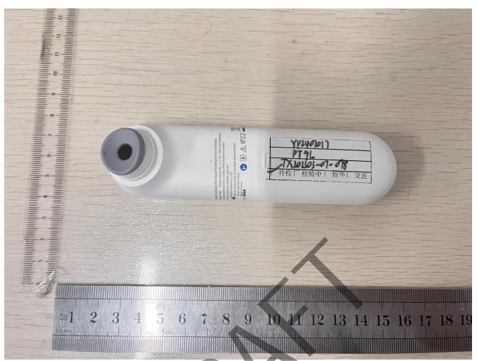
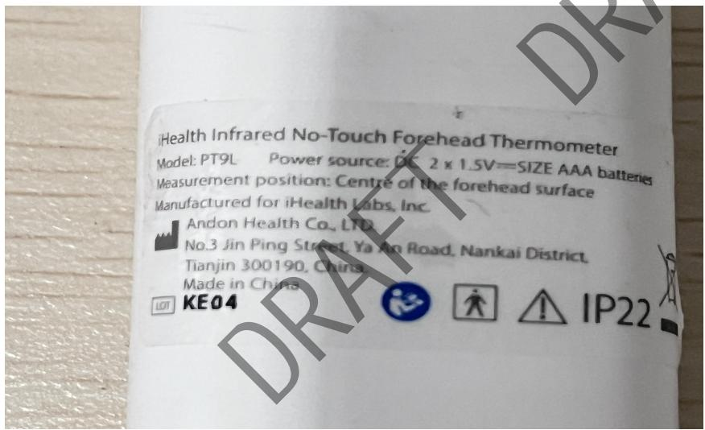

<table><tr><td colspan="2">TEST REPORTIEC 60068-2-78:2012: Damp heat, steady state</td></tr><tr><td>Date of issue......:</td><td>2024-07-12</td></tr><tr><td>Standard......:</td><td>IEC 60068-2-78:2012: Damp heat, steady state</td></tr><tr><td>Procedure deviation......:</td><td>N/A</td></tr><tr><td>Non-standard test method......:</td><td>N/A</td></tr><tr><td>Type of test object......:</td><td>Infrared No-Touch Forehead Thermometer</td></tr><tr><td>Trademark......:</td><td>N/A</td></tr><tr><td>Model/type reference......:</td><td>PT9L</td></tr><tr><td>Report No ......:</td><td>ETX202303-07-078-05</td></tr><tr><td>Testing period......:</td><td>2024.07.10-2024.07.11</td></tr><tr><td>Manufacturer......:</td><td>ANDON HEALTH CO., LTD.</td></tr><tr><td>Address......:</td><td>No.3 JinPing Street, YaAn Road, Nankai District, Tianjin, China</td></tr><tr><td>Test laboratory......Address......</td><td>Tianxu(Tianjin)Testing Technology Service Co.,LTD101, First floor, Building L,No.3 JinPing Street,Ya An Road,Nankai District, Tianjin,China</td></tr></table>

Complied by: （Kang Yanli） Date：

Reviewed by: （Guan Qingxiang） Date：

<table><tr><td>Clause</td><td>Requirement + Test</td><td>Result - Remark</td><td>Verdict</td></tr></table>

<table><tr><td>Damp heat test</td><td>The sample is in normal working condition and put into the programmable constant temperature and humidity test chamber. The temperature and humidity of the test box are adjusted to 40 °C and 95% RH. After the temperature and humidity are stable, it is maintained for 14.8 hours.</td><td>/</td></tr></table>

# ATTACHMENT FILE 1 photos of the EUT

natural_image

White digital thermometer placed on a wooden surface with a ruler for scale (no text or symbols visible)

text_image

YP240017
PT9L
TXW1603-01-08
校核 | 检发中 | 校单 | 交运

text_image

iHealth Infrared No-Touch Forehead Thermometer
Model: PT9L Power source: DC 2 x 1.5V=SIZE AAA batteries
Measurement position: Centre of the forehead surface
Manufactured for iHealth Labs, Inc.
Andon Health Co., LTD.
No.3 Jin Ping Street, Ya An Road, Nankai District,
Tianjin 300190, China.
Made in China
LETI KE04 IP22

--- End of Test Report ---