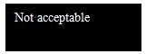
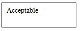

**Risk Management Plan**

**(V1.0)**

Product Model: <u>PT9L</u>

Project Number: <u>30000078</u>

Product  name:    <u>Infrared Forehead Thermometer</u>	

**Drafted by***(Regulation Engineer)*<u>&nbsp;&nbsp;&nbsp;&nbsp;&nbsp;&nbsp;&nbsp;&nbsp;&nbsp;&nbsp;&nbsp;&nbsp;&nbsp;&nbsp;&nbsp;</u>	Date:<u>&nbsp;&nbsp;&nbsp;&nbsp;&nbsp;&nbsp;&nbsp;&nbsp;&nbsp;&nbsp;&nbsp;&nbsp;&nbsp;&nbsp;&nbsp;&nbsp;</u>

**Reviewed by***(Certification Engineer)*<u>&nbsp;&nbsp;&nbsp;&nbsp;&nbsp;&nbsp;&nbsp;&nbsp;&nbsp;&nbsp;&nbsp;&nbsp;&nbsp;&nbsp;&nbsp;</u>Date:<u>&nbsp;&nbsp;&nbsp;&nbsp;&nbsp;&nbsp;&nbsp;&nbsp;&nbsp;&nbsp;&nbsp;&nbsp;&nbsp;&nbsp;&nbsp;&nbsp;</u>

**Approved by***(Product Line Manager‌)*<u>&nbsp;&nbsp;&nbsp;&nbsp;&nbsp;&nbsp;&nbsp;&nbsp;&nbsp;&nbsp;&nbsp;&nbsp;&nbsp;&nbsp;&nbsp;&nbsp;&nbsp;</u>Date:<u>&nbsp;&nbsp;&nbsp;&nbsp;&nbsp;&nbsp;&nbsp;&nbsp;&nbsp;&nbsp;&nbsp;&nbsp;&nbsp;&nbsp;&nbsp;&nbsp;</u>

<table><tr><td>
<strong>No.</strong>
</td><td>
<strong>Version Date </strong>
</td><td>
<strong>Version Description</strong>
</td><td>
<strong>Version</strong>
</td><td>
<strong>Drafter</strong>
</td><td>
<strong>Approver</strong>
</td></tr><tr><td>
1
</td><td>
2024.1.11
</td><td>
Originated
</td><td>
V1.0
</td><td>
Wang Dilong
</td><td>
Hou Guangwei
</td></tr><tr><td>

</td><td></td><td></td><td></td><td></td><td></td></tr><tr><td></td><td></td><td></td><td></td><td></td><td></td></tr><tr><td></td><td></td><td></td><td></td><td></td><td></td></tr><tr><td></td><td></td><td></td><td></td><td></td><td></td></tr><tr><td></td><td></td><td></td><td></td><td></td><td></td></tr><tr><td></td><td></td><td></td><td></td><td></td><td></td></tr><tr><td></td><td></td><td></td><td></td><td></td><td></td></tr><tr><td></td><td></td><td></td><td></td><td></td><td></td></tr><tr><td></td><td></td><td></td><td></td><td></td><td></td></tr><tr><td></td><td></td><td></td><td></td><td></td><td></td></tr><tr><td></td><td></td><td></td><td></td><td></td><td></td></tr><tr><td></td><td></td><td></td><td></td><td></td><td></td></tr><tr><td></td><td></td><td></td><td></td><td></td><td></td></tr><tr><td></td><td></td><td></td><td></td><td></td><td></td></tr><tr><td></td><td></td><td></td><td></td><td></td><td></td></tr><tr><td></td><td></td><td></td><td></td><td></td><td></td></tr><tr><td></td><td></td><td></td><td></td><td></td><td></td></tr><tr><td></td><td></td><td></td><td></td><td></td><td></td></tr></table>

**Version History**

**Contents**

- [1. Arrangement of Risk Management Activities](#_Toc1029)
- [2. Risk Management Group](#_Toc12905)
- [3. Risk Acceptance Criteria](#_Toc29305)
    - [3.1 Severity of A Hazard](#_Toc25220)
    - [3.2 Probability of A Hazard](#_Toc3036)
    - [3.3 Risk Acceptance Criteria](#_Toc17625)
- [4. Residual Risk Acceptance Criteria](#_Toc22151)
    - [4.1 For Single Residual Risk](#_Toc6267)
    - [4.2 For Overall Residual Risk](#_Toc9946)
- [5. Risk Control Measures Verification Criteria](#_Toc4989)

# 1. **Arrangement of Risk Management Activities**

The risk management process will be conducted in accordance with standard ISO 14971:2019, EN ISO 14971:2019 and EN ISO 14971:2019/A11:2021. The risk management plan for the whole life-cycle of the medical device as shown in the table below: 

<table><tr><td>
<strong>Phase</strong>
</td><td>
<strong>Main Job Descriptions</strong>
</td><td>
<strong>Responsibilities and Authorities</strong>
</td><td>
<strong>Requirements on Risk Management Activity  Review</strong>
</td><td>
<strong>Output Document</strong>
</td></tr><tr><td>
<strong>Initial development </strong>
</td><td><ol><li>Document intended use and reasonably foreseeable misuse of the medical device</li><li>Identify characteristics related to safety; </li><li>Identify hazards and hazardous situations;</li><li>Estimate the risk(s) of each hazardous situation; </li><li>Risk evaluation.</li><li>Draft the risk control measures plan.</li></ol></td><td><ol><li>Project manager shall organize the implement of activities in this phase;</li><li>Members of risk management shall be in charge of the job content review.</li></ol></td><td>
Project manager shall daft the “risk assessment report ” and organize the review of “risk assessment report”. 
</td><td><ol><li>Report of risk assessment  </li></ol></td></tr><tr><td>
<strong>Prototype phase</strong>

<strong>(Design verification)</strong>
</td><td><ol><li>Verify the implementation and effectiveness of risk control measures plan; </li><li>Assess the residual risk. </li><li>Make benefit-risk analysis</li><li>Evaluate whether there is any risks arising from risk control measures</li><li>Review completeness of risk control</li></ol></td><td><ol><li>Project manager shall organize the implement of activities in this phase;</li><li>Members of risk management shall be in charge of job content review. </li></ol></td><td>
Project manager shall draft “report of risk control measures verification and residual risk assessment”, and organize review of the report;

Members of risk management shall review the risk management activities in the former phase.
</td><td><ol><li>Report of verification of risk control measure and residual risk evaluation</li></ol></td></tr><tr><td>
<strong>Design validation </strong>
</td><td><ol><li>Overall residual risk evaluation</li><li>Form the risk management report.</li></ol></td><td><ol><li>Project manager shall organize the implement of activities in this phase; </li><li>Members of risk management shall be in charge of job content review </li></ol></td><td>
Members of risk management shall review the risk management activities in former phase.
</td><td><ol><li>Report  of risk management </li></ol></td></tr><tr><td>
<strong>Design change</strong>
</td><td><ol><li>Identify hazards and hazardous situations related to design change.</li><li>Evaluate risk(s) in hazardous situation which result from design change. </li><li>Assess risk(s) in design change. </li><li>Draft the plan of risk control measures for design change. </li><li>Verify the implement of plan on risk control measures after design change. </li><li>Assess residual risk, benefit-risk analysis and any new risks after design change. </li><li>Overall residual risk evaluation after design change</li></ol></td><td><ol><li>Project manager shall organize the implement of activities in this phase. </li><li>Members of risk management shall be in charge of job content review </li></ol></td><td>
Project manager shall draft “report of risk management in design change”, and organize the review of this report.
</td><td><ol><li>Record of risk evaluation (when there is no new risk)</li><li>Report of verification of risk control measure and residual risk evaluation in design change</li><li>Report of Risk Management in design change</li></ol></td></tr><tr><td>
<strong>Production and post-</strong>

<strong>production activities</strong>
</td><td><ol><li>Collect information concerning production and post-production; </li><li>Members of risk management assess if there are hazards or hazardous situation that not be identified before, and if the risk(s) result from hazardous situation become not acceptable; whether the overall residual risk is still acceptable （the criterion see section 4.2）in relation to the benefits of the intended use; and whether the generally acknowledged state of the art has changed</li><li>Members of risk management analyze and assess the risk(s) and make risk control plan and actions to the medical devices if necessary;</li><li>Track the implement of risk control measures. </li></ol></td><td>
Refer to section 4.11.1 for “Collection of production and post-production activities” in Risk Management Control Regulation (QI-7.3-22)
</td><td>
Related person and department shall organize members of risk management to start managing the risk after receiving information. 
</td><td>
Report of Post-market Risk Management 
</td></tr></table>

# 2. **Risk Management Group**

The specific personnel may vary from different projects, but the risk assessment team generally includes the following members:

<table><tr><td>
<strong>Member</strong>
</td><td>
<strong>Specialty</strong>
</td></tr><tr><td>
Chief engineer
</td><td>
Mechano-electronic related specialities, more than three years work experience. 
</td></tr><tr><td>
Product manager
</td><td>
Mechano-electronic related specialities, more than three years design experience. 
</td></tr><tr><td>
Project manager
</td><td>
Mechano-electronic related specialities, more than one year design experience. 
</td></tr><tr><td>
Hardware design director
</td><td>
Mechano-electronic related specialities, more than one year design experience. 
</td></tr><tr><td>
Software design director
</td><td>
Mechano-electronic related specialities, more than one year design experience. 
</td></tr><tr><td>
Mechanical design director
</td><td>
Mechano-electronic related specialities, more than one year design experience. 
</td></tr><tr><td>
Hardware design personnel
</td><td>
Mechano-electronic related specialities, more than one year design experience 
</td></tr><tr><td>
Software design personnel
</td><td>
Mechano-electronic related specialities, more than one year design experience. 
</td></tr><tr><td>
Mechanical design personnel
</td><td>
Mechano-electronic related specialities, more than one year design experience. 
</td></tr><tr><td>
Process design personnel
</td><td>
Electrics or mechanics or other related engineering specialities, more than one year design experience. 
</td></tr><tr><td>
Quality management personnel  
</td><td>
Electrics or mechanics or other related engineering specialities, more than one year design experience.
</td></tr><tr><td>
Sales personnel 
</td><td>
No special requirement. Familiar with handling of customer complaints process
</td></tr><tr><td>
Certification personnel 
</td><td>
Biomedicine or mechano-electronic or other related specialities, more than two years work experience. 
</td></tr><tr><td>
Personnel with medical background 
</td><td>
Biology or clinical medicine or other medical related spcialities, more than three years clinical experience. 
</td></tr></table>

# 3. **Risk Acceptance Criteria**

## **3.1 Severity of A Hazard**

<table><tr><td colspan="3">
<strong>Severity Classification</strong>
</td></tr><tr><td>
<strong>Common terms</strong>
</td><td>
<strong>Class S</strong>
</td><td>
<strong>Possible description</strong>
</td></tr><tr><td>
Catastrophic
</td><td>
5
</td><td>
Result in patient death
</td></tr><tr><td>
Critical
</td><td>
4
</td><td>
Result in permanent impairment or life-threatening injury
</td></tr><tr><td>
Serious
</td><td>
3
</td><td>
Result in injury or impairment requiring  professional medical intervention
</td></tr><tr><td>
Minor
</td><td>
2
</td><td>
Result in temporary injury or impairment not requiring professional medical intervention
</td></tr><tr><td>
Negligible
</td><td>
1
</td><td>
Inconvenience or temporary discomfort
</td></tr></table>

## **3.2 Probability of A Hazard**

<table><tr><td colspan="3">
<strong>Semiquantitative</strong> <strong>Probability Classification</strong>
</td></tr><tr><td>
<strong>Common terms</strong>
</td><td>
<strong>Class P</strong>
</td><td>
<strong>Probability range</strong>
</td></tr><tr><td>
Frequent
</td><td>
6
</td><td>
≥10-3
</td></tr><tr><td>
Probable
</td><td>
5
</td><td>
&lt;10-3 ≥10-4
</td></tr><tr><td>
Occasional
</td><td>
4
</td><td>
&lt;10-4 ≥10-5
</td></tr><tr><td>
Remote
</td><td>
3
</td><td>
&lt;10-5 ≥10-6
</td></tr><tr><td>
Improbable
</td><td>
2
</td><td>
&lt;10-6≥10-8
</td></tr><tr><td>
Few
</td><td>
1
</td><td>
&lt;10-8
</td></tr></table>

## **3.3 Risk Acceptance Criteria** 

<table><tr><td></td><td>
1 Negligible  
</td><td>
2 Minor       
</td><td>
3 Serious    
</td><td>
4 Critical    
</td><td>
5 Catastrophic
</td></tr><tr><td>
6 Frequent
</td><td>
 
</td><td>
 
</td><td>
 
</td><td>
 
</td><td>
 
</td></tr><tr><td>
5 Probable
</td><td>
 
</td><td>
 
</td><td>
 
</td><td>
 
</td><td>
 
</td></tr><tr><td>
4 Occasional
</td><td></td><td>
 
</td><td>
 
</td><td>
 
</td><td>
 
</td></tr><tr><td>
3 Remote
</td><td></td><td></td><td>
 
</td><td>
 
</td><td>
 
</td></tr><tr><td>
2 Improbable
</td><td></td><td></td><td></td><td>
 
</td><td>
 
</td></tr><tr><td>
1 Few
</td><td></td><td></td><td></td><td>
 
</td><td>
 
</td></tr></table>

Not acceptable: Unacceptable risk. Risk control measures are required.

Acceptable: Insignificant/negligible risk. No risk control measures are required.

The manufacturer shall reduce the risk as far as possible,so we use one or more of the following risk control options in the priority order listed: 

(a) eliminate or reduce risks as far as possible through safe design and manufacture;

(b) where appropriate, take adequate protection measures, including alarms if necessary, in relation to risks that cannot be eliminated; and 

(c) provide information for safety (warnings/precautions/contra-indications) and, where appropriate, training to users.

# 4. **Residual Risk Acceptance Criteria**

## **4.1 For Single Residual Risk**

When a risk falls in the “Not acceptable” area, the risk control measures must be taken. After taking measures, the risk became a residual risk, and if this residual risk still falls in the “Not acceptable” area by the Criteria in “3.3 Risk Acceptance Criteria”, the risk-benefit analysis must be taken. And this residual risk will be acceptable when there are reasonable reasons to support the benefits outweigh the risks.

## **4.2 For Overall Residual Risk**

1. The benefits related to the intended use of the medical device are weighed against the overall residual risk. Benefits can be described by their magnitude or extent, the probability of experiencing the benefit within the intended patient populations, and the duration and frequency of the benefit. The evaluation may take into account knowledge of the intended medical indication, the generally acknowledged state of the art in technology and medicine, and the availability of alternative medical devices or treatments.
2. Visual representations of the residual risks can be useful. Each individual residual risk can be shown in a risk matrix as shown in section 3.3. If more than 1/2 of the risks are in the higher severity regions or in the higher probability regions of the risk matrix, or clusters of risks are borderline, then the distribution of the risks can indicate that the overall residual risk might not be acceptable, even if each individual risk has been judged acceptable.
3. Overall risk-benefit analysis:when the benefits outweigh the overall residual risks,the overall residual risks are acceptable.
4. If the overall residual risks are acceptable after evaluation, then the significant residual risks shall be notified to the users and involve the information in the accompanying documents. 

If the overall residual risks are not acceptable after evaluation, then additional risk control measures shall be taken, or the modification to the medical devices may be required.

# 5. **Risk Control Measures Verification Criteria**

We verify the risk control measures of the initial risks and the residual risks in accordance with the document Verification in *Design and Development Control Procedure*.